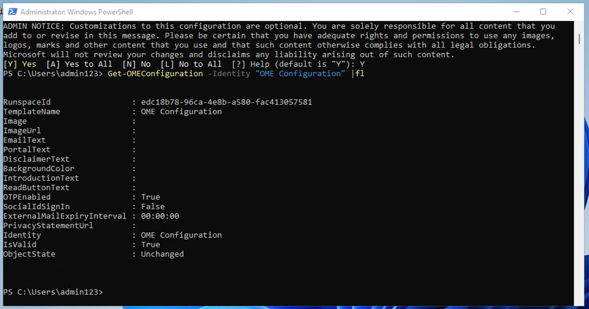
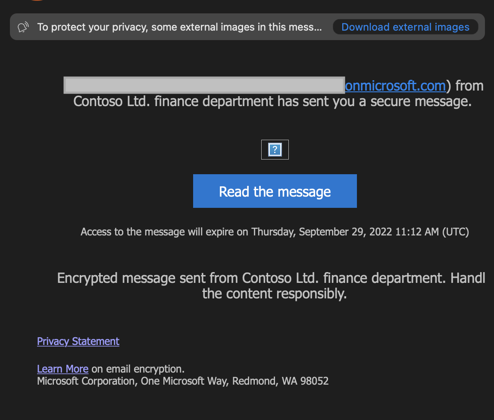

Laboratorio 1 – Asignación de roles de cumplimiento y exploración del
portal de Microsoft Purview

## Objetivo:

En este laboratorio creamos usuarios y les asignamos los roles, equipos
y grupos adecuados en el centro de administración de Office 365 para
representar una organización—Contoso.

También asignamos lo siguiente a los usuarios:

- Evaluaciones de cumplimiento de prueba

Posteriormente, probaremos el **cifrado de mensajes de Office 365 (OME)
integrado en Microsoft 365**.

Primero modificaremos la plantilla predeterminada para garantizar que no
se muestre el diálogo de identificación social (Social IDs) a
destinatarios externos cuando reciban mensajes protegidos con el cifrado
de mensajes de Office 365 (OME) enviados por usuarios de la organización
que hemos configurado.

A continuación, crearemos una configuración personalizada de OME (Office
365 Message Encryption) y estableceremos una regla de transporte para
aplicar este cifrado a todos los correos enviados desde nuestro
departamento financiero.

## Ejercicio1 - Gestión de roles de cumplimiento

En este ejercicio, activaremos todas las licencias de prueba necesarias
para implementar seguridad con Microsoft Purview.

### Tarea 1 – Asignación del rol de Manager a un usuario existente

1.  Inicie sesión en la máquina virtual (VM) con los datos de la cuenta
    que se le proporcionaron en el laboratorio.

2.  Inicie sesión en el centro de administración de Microsoft
    365` ``https://admin.microsoft.com` utilizando las credenciales
    administrativas proporcionadas.

3.  Desde el panel izquierdo, seleccione **Users** \> **Active users**,
    y haga clic en el primer usuario y haga clic en el primer usuario
    **Adele Vance**.

4.  En **Manager**, haga clic **Edit manager**.

5.  Elimine al gestor actual y escriba **Patti** en el cuadro de
    búsqueda. Seleccione **Patti Fernandez**. Haga clic en **Save
    Changes**.

Una captura de pantalla de una descripción de ordenador generada
automáticamente

6.  Cambie el administrador a **Patti Fernandez** para todos los
    usuarios siguientes.

- Adele Vance

- Christie Cline

- Megan Bowen

7.  Para Patti Fernandez, añada a **MOD Administrator** como el manager.

### Tarea 2 – Agregar un administrador de cumplimiento 

1.  Seleccione el usuario **Patti Fernandez**, en **Account**,
    desplácese hasta **Roles** y haga clic en **Manage roles**.

Una captura de pantalla de una descripción de ordenador generada
automáticamente informática

2.  Una vez que se abra el panel **Roles**, marque el botón de radio
    junto a **Admin center access**, y expanda **Show all by category.**

Una captura de pantalla de una descripción de ordenador generada
automáticamente

3.  Desplácese hasta **Security & compliance**, marque la casilla junto
    a **Compliance Administrator**, y haga clic en **Save changes**.

Una captura de pantalla de una descripción de ordenador generada
automáticamente

4.  Cierre el panel, permanezca en la misma página y continue con la
    siguiente tarea.

### Tarea 3 – Creación de equipos y grupos en el centro de administración de Microsoft

1.  Ahora expanda **Teams & groups**, seleccione **Active teams &
    groups** y haga clic en **Add a Microsoft 365 group** en **Teams &
    Microsoft 365 groups**.

Una captura de pantalla de una descripción de ordenador generada
automáticamente

2.  Para el nombre, utilice `Contoso Finance Team`, y para la
    descripción, utilice `This team handles finance.`, y luego haga clic
    en **Next**.

Una captura de pantalla de una descripción de ordenador generada
automáticamente

3.  En la página **Assign Owners**, haga clic en **Assign owners**,
    marque la casilla junto a **Adele Vance**, y haga clic en
    **Add(1)**. Haga clic en **Next**.

4.  En la página **Add members** añada a **Adele Vance**, y **Christie
    Cline** como miembros y haga clic en **Next**. En la página **Add
    members**, seleccione **Next**.

5.  Para la dirección de correo electrónico del grupo utilice
    `contosofinance` y luego haga clic en **Next**.

Una captura de pantalla de una descripción de ordenador generada
automáticamente

6.  Haga clic en **Create group**.

Una captura de pantalla de una descripción de ordenador generada
automáticamente

7.  Al terminar, haga clic en **Close**.

Una captura de pantalla de una descripción de ordenador generada
automáticamente

8.  En la página **Active teams & groups**, seleccione la pestaña
    **Security groups**. Seleccione **Add a security group.**

Una captura de pantalla de una descripción de ordenador generada
automáticamente informática

9.  Repita los pasos para crear otro grupo con la siguiente información.

- En **Set up the basics**, ingrese lo siguiente en el campo **Name**:
  `EDM_DataUploaders`. En el campo Description, ingrese
  `People who will upload data for EDM`.

- Seleccione **Next**.

- En la página **Settings**, seleccione **Next**.

- En la página **Review and finish adding group**, revise su
  configuración y seleccione **Create group**.

- Cuando se muestra la página **New group created**, seleccione el botón
  de cerrar. Ahora seleccione el grupo **EDM_DataUploaders** recién
  creado de la lista.

- En la pestaña members, seleccione **View all and manage owners**, y
  añada a **Patti Fernandez** y **Christie Cline**.

- De igual manera, agregue a **Patti Fernandez** y **Christie Cline**
  como miembros.

Una captura de pantalla de una descripción de ordenador generada
automáticamente

### Tarea 4 – Habilitar la versión de prueba para las evaluaciones de cumplimiento

1.  Inicie sesión en el portal de
    Purview` ``https://purview.microsoft.com` utilizando
    **Administrative Username** y **Administrative Password**.

2.  Si aparece una ventana de bienvenida, acepte los términos y
    seleccione **Get started** y ciérrela.

3.  Desplácese hacia abajo y, en Trials and recommendations, seleccione
    **View all trials and recommendations**.

4.  En página **Microsoft Purview trials and recommendations**, vaya a
    **Compliance assessments**, en **Purview and Priva trials** y
    seleccione **Try now**.

Una captura de pantalla de una descripción de ordenador generada
automáticamente

5.  Haga clic en **Start Trials**.

Nota: Los cambios pueden tardar hasta 2 horas en surtir efecto. Vuelva a
iniciar session para ver las nuevas características. Mientras tanto,
continue con los siguientes pasos.

6.  Desde la barra de navegación, seleccione **Solutions** \> **Audit**.

Una captura de pantalla de una descripción de ordenador generada
automáticamente

7.  En la página **Audit**, seleccione **Start recording user and admin
    activity** para activar el registro de auditoría.

Una captura de pantalla de una descripción de ordenador generada
automáticamente

## Ejercicio 2 - Administración del cifrado de mensajes de Office 365 (OME)

La primera configuración que **Patti Fernandez** necesita configurar y
probar con su equipo piloto es el cifrado de mensajes de **Microsoft 365
integrado en** **Office 365 Message Encryption (OME)**. Para ello,
modificará la plantilla predeterminada y creará una nueva plantilla de
marca, que se asignará a uno de los usuarios piloto. Los usuarios piloto
probarán entonces la funcionalidad OME con sus cuentas.

### Tarea 1 – Verificación de la funcionalidad de Azure RMS

En esta tarea, instalará el modulo **Exchange Online PowerShell** y
verificará la correcta funcionalidad de Azure RMS de su tenant.

1.  Abra una ventana **elevated PowerShell** seleccione el botón de
    Windows con el botón derecho del mouse y, a continuación, ejecute
    **Windows PowerShell** como administrador.

Una captura de pantalla de una descripción de ordenador generada
automáticamente

2.  Confirme la ventana **User Account Control** window con **Yes**.

3.  Ingrese el siguiente cmdlet para instalar la última versión del
    módulo de PowerShell de Exchange Online:

`Install-Module ExchangeOnlineManagement`

Una pantalla de ordenador con una descripción de texto en blanco
generada automáticamente

4.  Confirme el cuadro de diálogo de segurisad del proveedor **NuGet**
    con **Y** para Yes y presione **Enter**. Este proceso puede tardar
    unos segundos en completarse.

Una pantalla de ordenador con una descripción de texto en blanco
generada automáticamente

5.  Confirme el cuadro de diálogo de seguridad del repositorio no
    confinable con **Y** para Yes y presione **Enter**. Este proceso
    puede tardar unos segundos en completarse.

Una pantalla de ordenador con una descripción de texto en blanco
generada automáticamente

6.  Ingrese el siguiente cmdlet para cambiar su política de ejecución y
    presione **Enter.**

`Set-ExecutionPolicy -ExecutionPolicy RemoteSigned -Scope CurrentUser`

7.  Confirme el cambio de la política de ejecución **Y** para Yes y
    presione **Enter**.

8.  Ingrese el siguiente cmdlet para utilizer el modulo **Exchange
    Online PowerShell** y conectarse a su tenant:

`Connect-ExchangeOnline`

9.  Cuando se muestra la ventana **Sign in**, inicie sesión como **Patti
    Fernandez** utilizando el nombre de usuario
    `PattiF``@{TENANTPREFIX``}.onmicrosoft.com` y la contraseña de
    usuario proporcionadas en la pestaña de recursos. (Sustituya
    {TENANTPREFIX} por el prefijo de tenant que figura en la pestaña de
    recursos)

10. Verifique que Azure RMS y IRM estén activados en su tenant
    utilizando el siguiente cmdlet y presione **Enter**:

`Get-IRMConfiguration | fl AzureRMSLicensingEnabled`

11. Cuando el resultado de **AzureRMSLicensingEnabled** es **True**,
    Azure RMS está activado para su tenant. Continúe con el siguiente
    paso.

12. Pruebe las plantillas de Azure RMS utilizadas para el cifrados de
    mensajes de Office 365 con el usuario piloto de demostración **Adele
    Vance** utilizando el siguiente cmdlet (reemplace {TENANTPREFIX} por
    su prefijo de tenant que aparece en la pestaña de recursos)

`Test-IRMConfiguration -Sender adelev@{TENANTPREFIX}.onmicrosoft.com -Recipient adelev@{TENANTPREFIX}.onmicrosoft.com`

13. Verififique que todas las pruebas estén en el estado PASS y que no
    se muestren errores.

Captura de pantalla

14. Deje abierta la ventana de **PowerShell**.

Ha instalado correctamente el modulo de PowerShell de Exchange Online,
se ha conectado a su tenant y ha verificado la correcta funcionalidad de
Azure RMS.

### Tarea 2 – Modificación de la plantilla OME predeterminada 

A continuación, existe un requisito en su organización para restringir
la confianza en proveedores de identidad extranjeros, como Google o
Facebook. Dado que estos ID sociales están activados por defecto para
acceder a mensajes protegidos con OME, debe desactivar el uso de ID
sociales para todos los usuarios de su organización.

1.  Ejecute el siguiente cmdlet para ver la configuración predeterminada
    de OME:

`Get-OMEConfiguration -Identity "OME Configuration" |fl`

Captura de pantalla generada automáticamente de una interfaz informática

2.  Revise la configuración y confirme que el parámetro
    **SocialIdSignIn** está establecido como **True**.

3.  Ejecute el siguiente cmdlet para restringir el uso de
    identificadores sociales (Social IDs) para acceder a mensajes de su
    tenant protegido con OME:

`Set-OMEConfiguration -Identity "OME Configuration" -SocialIdSignIn:$false`

Una pantalla de ordenador con texto en ella, descripción generada
automáticamente

4.  Confirme el mensaje de advertencia para personalizar la plantilla
    predeterminada con **Y** para Yes y presione Enter.

5.  Compruebe de nuevo la configuración predeterminada y valídelo, el
    parámetro **SocialIdSignIn** ahora está establecido en **False**.

`Get-OMEConfiguration -Identity "OME Configuration" |fl`

6.  Observe que el resultado debería mostrar que **SocialIDSignIn** está
    establecido en **False**.

7.  Deje abierta la ventana de **PowerShell** y continúe con el
    siguiente ejercicio.

Ha desactivado correctamente el uso de proveedores de identidad
extranjeros, como Google y Facebook, en el cifrado de mensajes de Office
365.

### Tarea 3 – Prueba de la plantilla OME modificada 

Debe confirmer que no se muestra ningún cuadro de diálogo de
identificadores sociales (Social IDs) para destinatarios externos cuando
reciben un mensaje protegido con el cifrado de mensajes de Office 365 de
usuarios de su tenant y necesitan utilizer la OTP en cualquier momento
para acceder al contenido cifrado.

1.  En **Microsoft Edge**, abra **New InPrivate Window** y vaya a
    `https://outlook.office.com` e inicie sesión en Outlook en la web
    con el nombre de usuario `AdeleV@{TENANTPREFIX``}.onmicrosoft.com` y
    la contraseña de usuario que aparece en la pestaña de recursos.

2.  En el cuadro de diálogo **Stay signed in?**, marque la casilla
    **Don’t show this again** y después seleccione **No**.

3.  Seleccione **Save** en el cuadro de diálogo **Save password**, para
    guardar la contraseña del usuario pilot en su navegador.

4.  Si aparece la ventana **Translate page from…**, seleccione la fecha
    hacia abajo y seleccione **Never translate from…**.

5.  Seleccione **New mail** en la parte superior izquierda de Outlook en
    la web.

Interfaz gráfica de usuario, texto, aplicación, descripción de Word
generada automáticamente

6.  En la línea **To** ingrese su dirección de correo electrónico
    personal o la de un tercero que no esté en el dominio tenant.
    Ingrese `Secret Message` en la línea de asunto y
    `My super-secret message.` en el cuerpo.

Interfaz gráfica de usuario, texto, aplicación, descripción de Word
generada automáticamente

7.  En el panel superior vaya al panel **Options**, seleccione
    **Encrypt** para cifrar el mensaje. Si no encuentra la opción,
    seleccione los **3 puntos (…)** en la parte superior derecha y, a
    continuación, en el despegable seleccione **Encrypt**.

Una captura de pantalla de una descripción de ordenador generada
automáticamente

8.  Una vez haya encriptado correctamente el mensaje, debería ver un
    aviso que diga “**Encrypt: This message is encrypted. Recipients
    can’t remove encryption.**”

Una captura de pantalla de una descripción de ordenador generada
automáticamente

9.  Seleccione **Send** para enviar el mensaje.

Una captura de pantalla de una descripción de ordenador generada
automáticamente

**Nota**: En la cuenta de prueba puede o no tener el privilegio de
enviar cualquier correo electrónico y su correo puede no ser capaz de
llegar al destinatario de su actual tenant. Pero su correo electrónico
llega, puede comprobar los siguientes pasos para probar la plantilla.

10. Acceda a su cuenta de correo electrónico personal y abra el mensaje
    de Adele Vance. Si envió este correo electrónico a su cuenta de
    Microsoft (como @outlook.com) es posible que el cifrado se procese
    automáticamente y verá el mensaje de forma automática.

**Nota**: Si envió el mensaje a otro servicio de correo electrónico como
(@gmail.com), es posible que tenga que realizar los siguientes pasos
para procesar la codificación y leer el mensaje. Es posible que tenga
que comprobar si el mensaje está en la carpeta de correo no deseado o
spam.

11. Seleccione **Read the message**.

12. Sin tener activados los identificadores sociales, no hay ningún
    botón para autenticarse con su cuenta de Google.

13. Seleccione **Sign in with a One-time passcode** para recibir un
    código de acceso por tiempo limitado.

14. Vaya a su portal de correo electrónico personal y abra el mensaje
    con el asunto **one-time passcode to view the message**.

15. Copie el código de acceso, péguelo en el portal OME y seleccione
    **Continue**.

16. Revise el mensaje cifrado.

Ha probado con éxito la plantilla OME predeterminada modificada con los
identificadores sociales desactivados.

### Tarea 4 – Creación de una plantilla de personalización de marca

Los mensajes protegidos enviados por el departamento financiero de su
organización requieren un branding especial, que incluya textos de
introducción y cuerpo personalizados, así como un enlace de descargo de
responsabilidad (disclaimer) en el pie de página. Además, estos mensajes
financieros deben expirar después de siete días. En esta tarea, deberá
crear una nueva configuración personalizada de OME y establecer una
regla de transporte para aplicar dicha configuración a todos los correos
enviados desde el departamento financiero.

1.  En la ventana de PowerShell que dejamos abierta con Exchange Online
    conectado. Ejecute el siguiente cmdlet para crear una nueva
    configuración de OME:

`New-OMEConfiguration -Identity "Finance Department" -ExternalMailExpiryInDays 7`

Descripción de texto generada automáticamente

2.  Confirme el mensaje de advertencia para personalizar la plantilla
    con **Y** para Yes y presione **Enter**.

Descripción de texto generada automáticamente

3.  Cambie el mensaje de texto de introducción con el siguiente cmdlet

`Set-OMEConfiguration -Identity "Finance Department" -IntroductionText "from Contoso Ltd. finance department has sent you a secure message."`

4.  Confirme el mensaje de advertencia para personalizar la plantilla
    con **Y** para Yes y presione **Enter**.

BrokenImage

5.  Cambie el texto del cuerpo del mensaje de correo electrónico con el
    siguiente cmdlet

`Set-OMEConfiguration -Identity "Finance Department" -EmailText "Encrypted message sent from Contoso Ltd. finance department. Handle the content responsibly."`

6.  Confirme el mensaje de advertencia para personalizar la plantilla
    con **Y** para Yes y presione **Enter**.

Texto descriptivo generado automáticamente

7.  Cambie la URL del descargo de responsabilidad para que apunte al
    sitio de la declaración de privacidad de Contoso

`Set-OMEConfiguration -Identity "Finance Department" -PrivacyStatementURL "https://contoso.com/privacystatement.html"`

Texto descriptivo generado automáticamente

8.  Confirme el mensaje de advertencia para personalizar la plantilla
    con **Y** para Yes y presione **Enter**.

9.  Utilice el siguiente cmdlet para crear una regla de flujo de correo,
    que aplique la plantilla OME personalizada a todos los mensajes
    enviados desde el equipo financiero de Contoso. Este proceso puede
    tardar unos segundos en completarse.

`New-TransportRule -Name "Encrypt all mails from Contoso Finance team" -FromScope InOrganization -FromMemberOf "Contoso Finance Team" -ApplyRightsProtectionCustomizationTemplate "Finance Department" -ApplyRightsProtectionTemplate Encrypt`

Descripción de texto generada automáticamente

10. Escriba el siguiente cmdlet para verificar los cambios

`Get-OMEConfiguration -Identity "Finance Department" | Format-List`

11. Deje el **PowerShell** abierto.

Ha creado correctamente una nueva regla de transporte que aplica
automáticamente la plantilla OME personalizada cuando un miembro del
departamento financiero envía un mensaje a destinatarios externos.

### Tarea 5 – Validación de la plantilla de personalización de marca

Para validar la nueva configuración personalizada de OME, debe utilizar
la cuenta de Christie Cline, que es miembro del equipo de finanzas. En
la cuenta de prueba no tendrá el privilegio de enviar ningún correo
electrónico, pero puede consultar los siguientes pasos para comprender
cómo probar la plantilla cuando tenga sus propias licencias. Puede
realizar los pasos 1 a 4, pero es posible que su correo no llegue al
destinatario desde su tenant de prueba actual.

1.  En **Microsoft Edge**, abra **New InPrivate Window** y vaya a
    `https://outlook.office.com` e inicie sesión en Outlook en la web
    con el nombre de usuario `AdeleV@{TENANTPREFIX``}.onmicrosoft.com` y
    la contraseña de usuario que aparece en la pestaña de recursos.

Interfaz gráfica de usuario (GUI) con elementos de texto y aplicación,
descripción generada automáticamente

2.  Seleccione **New message** en la parte superior izquierda de Outlook
    en la web.

3.  En la línea **To** ingrese su dirección de correo electrónico
    personal o la de un tercero que no esté en el dominio tenant.
    Ingrese `Finance Report` en la línea del asunto e ingrese
    `Secret finance information.` en el cuerpo.

4.  Seleccione **Send** para enviar el mensaje.

5.  Inicie sesión en la cuenta de correo eletrónico que utilize
    anteriormente y abra el mensaje de Christie Cline.

6.  Debería ver un mensaje de **Christie Cline** parecido a la imagen
    siguiente. Seleccione **Read the message**.

7.  Si desea leer el mensaje, realice los siguientes pasos.

    1.  Haga clic en **Read the message**. Seleccione **Sign in with a
        One-time passcode** para recibir un código de acceso por tiempo
        limitado.

    2.  Vaya a su portal de correo electrónico personal y abra el
        mensaje con el asunto **Your one-time passcode to view the
        message.**

    3.  Copie la contraseña, péguela en el portal OME y seleccione
        **Continue.**

    4.  Revise el mensaje cifrado con la personalización de marca
        configurada.

Ha probado correctamente la nueva plantilla OME personalizada.

## Ejercicio 3 – Habilitación de la Protección Adaptativa

1.  En Microsoft Edge, vaya a `https://purview.microsoft.com` e inicie
    session en en el portal de previsualización como **MOD
    Administrator**.

2.  En el panel de navegación izquierdo, seleccione **Solutions** \>
    **Insider risk management** \> **Adaptive Protection**. Luego
    seleccione **Dashboard**. Seleccione **Quick setup**.

3.  Aparecerá un mensaje diciendo que estamos configurando las cosas.
    Tardará 72 horas en activarse. Lo usaremos en el octavo laboratorio
    donde exploramos la característica de Adaptive Protection.

4.  Seleccione la pestaña **Adaptive Protection settings** y active el
    botón de alternancia **Adaptive Protection**. Seleccione **Save**.

## Resumen:

En este laboratorio, replicamos con éxito una organización en nuestro
centro de administración, asignamos las licencias adecuadas y aprendimos
a utilizar el cifrado de mensajes de Office 365 (OME) integrado en
Microsoft 365.
