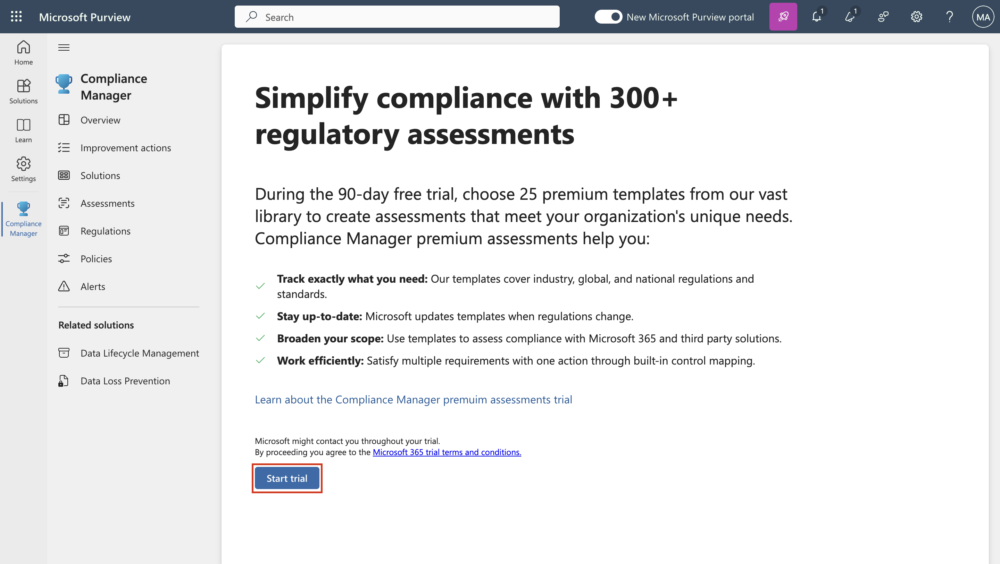
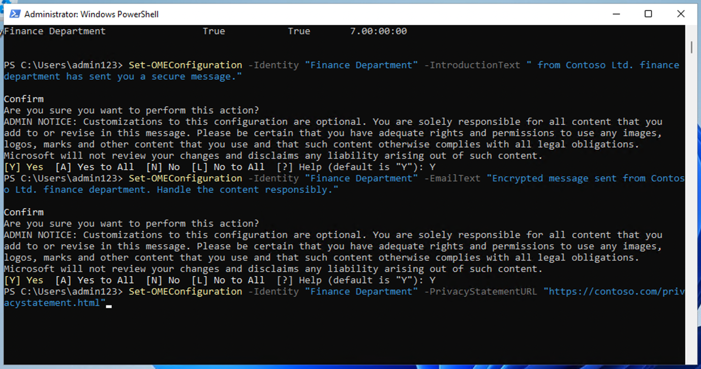
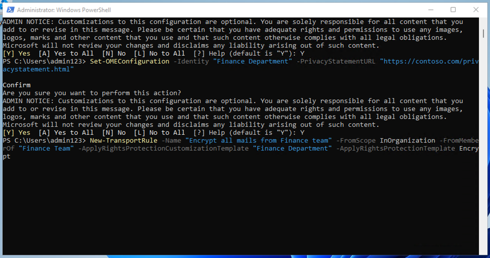

# Lab 1 - Assegnazione dei ruoli di conformità ed esplorazione del portale Microsoft Purview

## Obiettivo:

In questo lab vengono creati utenti e assegnati loro ruoli, team e
gruppi appropriati nell'interfaccia di amministrazione di Office 365 per
rappresentare un'organizzazione, ovvero Contoso.

Agli Utenti assegniamo inoltre:

- Prova per le valutazioni di conformità

Successivamente, testeremo **Microsoft 365 built-in Office 365 Message
Encryption (OME)**.

In primo luogo, modificheremo il modello predefinito per garantire che
non venga visualizzata alcuna finestra di dialogo Social ID per i
destinatari esterni quando si riceve un messaggio protetto con la
crittografia dei messaggi di Office 365 dagli utenti dell'organizzazione
configurata.

Quindi creeremo una nuova configurazione OME personalizzata e creeremo
una regola di trasporto per applicare la configurazione OME a tutte le
e-mail inviate dal nostro reparto finanziario.

## Esercizio 1 - Gestione dei ruoli di conformità

In questo esercizio verranno attivate tutte le licenze di valutazione
necessarie per l'implementazione della sicurezza con Microsoft Purview.

### Attività 1 – Aggiunta del ruolo di Manager a un utente esistente.

1.  Accedere alla macchina virtuale con i dettagli dell'account forniti
    con il lab.

2.  Accedere all'interfaccia di amministrazione di Microsoft 365
    `https://admin.microsoft.com` utilizzando il nome utente e la
    password amministrativi.

3.  Nel riquadro di sinistra, selezionare **Users \> Active users** e
    fare clic sul primo utente **Adele Vance**.

4.  In **Manager**, fare clic su **Edit manager**.

5.  Rimuovere l'attuale manager e digitare **Patti** nella casella di
    ricerca. Selezionare **Patti Fernandez**. Fare clic su **Save
    Changes**.

Uno screenshot di un computer Descrizione generata automaticamente

6.  Cambiare il manager in **Patti Fernandez** per tutti i seguenti
    utenti.

- Adele Vance

- Christie Cline

- Megan Bowen

7.  Per Patti Fernandez, aggiungere **MOD Administrator** come manager.

### Attività 2 - Aggiunta di un amministratore della conformità

1.  Selezionare l'utente **Patti Fernandez**, alla voce **Account**,
    scorrere fino a **Roles** e cliccare su **Manage roles**.

Uno screenshot di un computer Descrizione generata automaticamente

2.  Dopo l'apertura del riquadro **Roles**, selezionare il pulsante di
    opzione accanto **Admin center access** ed espandere **Show all by
    category.**

Uno screenshot di un computer Descrizione generata automaticamente

3.  Scorrere fino a **Security & compliance**, selezionare la casella
    accanto a **Compliance Administrator** e fare clic su **Save
    changes**.

Uno screenshot di un computer Descrizione generata automaticamente

4.  Chiudere il riquadro, rimanere sulla stessa pagina e continuare con
    l'attività successiva.

### Attività 3 - Creazione di team e gruppi in Microsoft admin center

1.  Ora espandere **Teams & groups**, selezionare **Active teams &
    groups** e fare clic su **Add a Microsoft 365 group** in **Teams &
    Microsoft 365 groups**.

Uno screenshot di un computer Descrizione generata automaticamente

2.  Per il nome utilizzare `Contoso Finance Team `e per la
    descrizione utilizzare **This team handles finance.**, quindi fare
    clic su **Next**.

Uno screenshot di un computer Descrizione generata automaticamente

3.  Nella pagina **Assign Owners**, fare clic su **Assign owners**,
    selezionare la casella accanto ad **Adele Vance** e fare clic su
    **Add(1).** Fare clic su **Next**.

4.  Nella pagina **Add members,** aggiungere **Adele Vance** e
    **Christie Cline** come membri, fare clic su **Next**. Nella pagina
    **Add members,** selezionare **Next**.

5.  Per l'indirizzo di posta elettronica del gruppo, usare
    `contosofinance` e quindi fare clic su **Next**.

Uno screenshot di un computer Descrizione generata automaticamente

6.  Fare clic su **Create group**.

Uno screenshot di un computer Descrizione generata automaticamente

7.  Al termine, fare clic su **Close**.

Uno screenshot di un computer Descrizione generata automaticamente

8.  Nella pagina **Active teams & groups,** selezionare la scheda
    **Security groups**. Selezionare **Add a security group.**

Uno screenshot di un computer Descrizione generata automaticamente

9.  Ripetere i passaggi per creare un altro gruppo con le seguenti
    informazioni.

&nbsp;

1.  In **Set up the basics**, immettere quanto segue nel campo **Name**:
    `EDM_DataUploaders`. Nel campo Description, immettere **People who
    will upload data for EDM**.

- Selezionare **Next**.

- Nella pagina **Settings,** selezionare **Next**.

- Nella pagina **Review and finish adding group**, controllare le
  impostazioni e selezionare **Create group**.

- Quando viene visualizzata la pagina **New group created**, selezionare
  il pulsante di chiusura. Ora selezionare il gruppo di
  **EDM_DataUploaders** appena creato dall'elenco.

- Nella scheda **Members**, selezionare **View all and manage owners** e
  aggiungere **Patti Fernandez** e **Christie Cline**.

- Allo stesso modo aggiungere **Patti Fernandez** e **Christie Cline**
  come membri.

Uno screenshot di un computer Descrizione generata automaticamente

### Attività 4 - Abilitazione della prova per le valutazioni di conformità

1.  Accedere al portale di Purview `https://purview.microsoft.com`
    usando **Administrative Username** e **Administrative Password**.

2.  Se viene visualizzata una finestra di benvenuto, accettare le
    condizioni e selezionare **Get started** e chiudila.

3.  Scorrere verso il basso e in **Trials and recommendations**,
    selezionare **View all trials and recommendations**.

4.  Nella pagina **Microsoft Purview trials and recommendations,**
    passare a **Compliance assessments**, in **Purview and Priva
    trials** e selezionare **Try now**.

Uno screenshot di un computer Descrizione generata automaticamente

5.  Fare clic su **Start Trials**.

Nota: potrebbero essere necessarie fino a 2 ore prima che le modifiche
abbiano effetto. Accedere di nuovo per vedere le nuove funzionalità. Nel
frattempo, continuare con i passaggi successivi.

6.  Dalla barra di navigazione, selezionare **Solutions \> Audit**.

Uno screenshot di un computer Descrizione generata automaticamente

7.  Nella pagina **Audit,** selezionare **Start recording user and admin
    activity** per attivare la registrazione di controllo.

Uno screenshot di un motore di ricerca Descrizione generata
automaticamente

## Esercizio 2 - Gestione della crittografia dei messaggi di Office 365

La prima impostazione che **Patti Fernandez** deve configurare e testare
con il team pilot è **Microsoft 365 built-in** **Office 365 Message
Encryption (OME)**. A tale scopo, modificherà il modello predefinito e
creerà un nuovo modello di branding, che verrà assegnato a uno degli
utenti pilot. Gli utenti pilot testeranno quindi la funzionalità OME con
i propri account.

### Attività 1 - Verifica della funzionalità di Azure RMS

In questa attività verrà installato il modulo **Exchange Online
PowerShell** e verrà verificata la corretta funzionalità di Azure RMS
del tenant.

1.  Aprire una finestra di **elevated PowerShell** selezionando il
    pulsante Windows con il tasto destro del mouse e quindi eseguire
    **Windows PowerShell** come amministratore.

Uno screenshot di un computer Descrizione generata automaticamente

2.  Confermare la finestra **User Account Control** con **Yes**.

3.  Immettere il cmdlet seguente per installare la versione più recente
    del modulo **Exchange Online PowerShell**:

Install-Module ExchangeOnlineManagement

Lo schermo di un computer con del testo Descrizione generata
automaticamente

4.  Confermare la finestra di dialogo di sicurezza del provider
    **NuGet** con **Y** per Yes e premere **Enter**. Il completamento di
    questo processo potrebbe richiedere alcuni secondi.

Lo schermo di un computer con testo bianco Descrizione generata
automaticamente

5.  Confermare la finestra di dialogo di sicurezza del repository non
    attendibile con **Y** per Yes e premere **Enter**. Il completamento
    di questo processo potrebbe richiedere alcuni secondi.

Lo schermo di un computer con testo bianco Descrizione generata
automaticamente

6.  Immettere il cmdlet seguente per modificare i criteri di esecuzione
    e premere **Enter**

`Set-ExecutionPolicy -ExecutionPolicy RemoteSigned -Scope CurrentUser`

Immagine rotta

7.  Confermare Execution Policy Change con **Y** per Sì e premere
    **Enter**.

Immagine rotta

8.  Immettere il cmdlet seguente per usare il modulo **Exchange Online
    PowerShell** e connettersi al tenant:

`Connect-ExchangeOnline`

Immagine rotta

9.  Quando viene visualizzata la finestra di **Sign in**, accedere come
    **Patti Fernandez** utilizzando il nome utente
    `PattiF@{TENANTPREFIX}.onmicrosoft.com` e la User Password
    specificata nella scheda delle risorse. (sostituire {TENANTPREFIX}
    con il prefisso del tenant specificato nella scheda delle risorse)

10. Verificare che Azure RMS e IRM siano attivati nel tenant usando il
    cmdlet seguente e premere **Enter**:

`Get-IRMConfiguration | fl AzureRMSLicensingEnabled`

11. Quando il risultato **AzureRMSLicensingEnabled** è **True**, Azure
    RMS viene attivato per il tenant. Continuare con il passaggio
    successivo.

Immagine rotta

12. Testare i modelli di Azure RMS usati per la crittografia dei
    messaggi di Office 365 con l'utente pilot demo **Adele Vance**
    usando il cmdlet seguente (sostituire {TENANTPREFIX} con il prefisso
    del tenant specificato nella scheda delle risorse)

`Test-IRMConfiguration -Sender adelev@{TENANTPREFIX}.onmicrosoft.com -Recipient adelev@{TENANTPREFIX}.onmicrosoft.com`

13. Verificare che tutti i test siano nello stato PASS e che non vengano
    visualizzati errori.

Immagine dello schermo

14. Lasciare aperta la finestra di **PowerShell**.

Il modulo Exchange Online PowerShell è stato installato correttamente,
si è connesso al tenant e è stata verificata la corretta funzionalità di
Azure RMS.

### Attività 2 - Modifica del modello OME predefinito

Successivamente, nell'organizzazione è necessario limitare
l'attendibilità per i provider di identità esterni, ad esempio Google o
Facebook. Poiché questi ID di social networking sono attivati per
impostazione predefinita per l'accesso ai messaggi protetti con OME, è
necessario disattivare l'uso degli ID di social networking per tutti gli
utenti dell'organizzazione.

1.  Eseguire il cmdlet seguente per visualizzare la configurazione OME
    predefinita:

`Get-OMEConfiguration -Identity "OME Configuration" |fl`

Una schermata di un computer Descrizione generata automaticamente

2.  Esaminare le impostazioni e verificare che il parametro
    **SocialIdSignIn** sia impostato su **True**.

Immagine rotta

3.  Eseguire il cmdlet seguente per limitare l'uso degli ID social per
    l'accesso ai messaggi dal tenant protetto con OME:

`Set-OMEConfiguration -Identity "OME Configuration" -SocialIdSignIn:$false`

Lo schermo di un computer con del testo Descrizione generata
automaticamente

4.  Confermare il messaggio di avviso per la personalizzazione del
    modello predefinito con **Y** per Sì e premere **Enter**.

Immagine rotta

5.  Controllare nuovamente la configurazione predefinita e convalidare,
    il parametro **SocialIdSignIn** è ora impostato su **False**.

`Get-OMEConfiguration -Identity "OME Configuration" |fl`

6.  Si noti che il risultato dovrebbe mostrare che **SocialIDSignIn** è
    impostato su **False**.

Immagine rotta

7.  Lasciare aperta la finestra di **PowerShell** e procedere con
    l'esercizio successivo.

L'utilizzo di provider di identità stranieri, come Google e Facebook, è
stato disattivato con successo in Office 365 Message Encryption.

### Task 3 - Test del modello OME modificato

È necessario verificare che non venga visualizzata alcuna finestra di
dialogo degli ID di social networking per i destinatari esterni quando
si riceve un messaggio protetto con la crittografia dei messaggi di
Office 365 dagli utenti del tenant e che questi debbano usare la OTP in
qualsiasi momento per accedere al contenuto crittografato.

1.  In **Microsoft Edge,** aprire **New InPrivate Window** e passare a
    `https://outlook.office.com` e accedere a Outlook sul Web con il
    nome utente `AdeleV@{TENANTPREFIX}.onmicrosoft.com` e la password
    utente specificata nella scheda delle risorse.

2.  Nella finestra di dialogo **Stay signed in?,** selezionare la
    casella di controllo **Don’t show this again** e quindi selezionare
    **No**.

3.  Selezionare **Save** nella finestra di dialogo **Save password** per
    salvare la password dell'utente pilot nel browser.

4.  Se viene visualizzato il messaggio **Translate page from…** viene
    mostrata, selezionare la freccia verso il basso e selezionare
    **Never translate from….**

5.  Selezionare **New mail** nella parte in alto a sinistra di Outlook
    sul Web.

Interfaccia utente grafica, testo, applicazione, descrizione Word
generata automaticamente

6.  Nella riga **To** immettere l'indirizzo di posta elettronica
    personale o di altre terze parti che non si trova nel dominio del
    tenant. Inserire **Secret Message** nella riga dell'oggetto e **My
    super-secret message.** al corpo.

Interfaccia utente grafica, testo, applicazione, descrizione Word
generata automaticamente

7.  Dal riquadro superiore passare al riquadro **Options**, selezionare
    **Encrypt** per crittografare il messaggio. Se non trovi l'opzione,
    seleziona i **3 punti (...)** in alto a destra, quindi dal menu a
    discesa selezionare **Encrypt**.

Uno screenshot di un computer Descrizione generata automaticamente

8.  Dopo aver crittografato correttamente il messaggio, dovresti vedere
    un avviso che dice “**Encrypt: This message is encrypted. Recipients
    can’t remove encryption.**”

Uno screenshot dello schermo di un computer Descrizione generata
automaticamente

9.  Selezionare **Send** per inviare il messaggio.

Interfaccia utente grafica, testo, e-mail Descrizione generata
automaticamente

**Nota**: nell'account di prova potresti avere o meno il privilegio di
inviare qualsiasi messaggio di posta elettronica e la tua posta potrebbe
non essere in grado di raggiungere il destinatario dal tuo attuale
inquilino. Ma la tua email va a buon fine, puoi controllare i seguenti
passaggi per testare il modello.

10. Accedere al tuo account di posta elettronica personale e aprire il
    messaggio di Adele Vance. Se hai inviato questo messaggio di posta
    elettronica a un account Microsoft (ad esempio @outlook.com), la
    crittografia potrebbe essere elaborata automaticamente e il
    messaggio verrà visualizzato automaticamente.

**Nota**: se hai inviato l'e-mail a un altro servizio di posta
elettronica come (@gmail.com), potrebbe essere necessario eseguire i
passaggi successivi per elaborare la crittografia e leggere il
messaggio. Potrebbe essere necessario controllare la cartella della
posta indesiderata o dello spam per il messaggio.

11. Selezionare **Read the message**.

12. Senza aver attivato gli ID social, non c'è alcun pulsante per
    autenticarsi con il tuo account Google.

13. Selezionare **Sign in with a One-time passcode** per ricevere un
    passcode a tempo limitato.

14. Andare al tuo portale di posta elettronica personale e aprire il
    messaggio con oggetto **Your one-time passcode to view the
    message**.

15. Copiare il passcode, incollarlo nel portale OME e selezionare
    **Continue**.

16. Esaminare il messaggio crittografato.

Il modello OME predefinito modificato è stato testato correttamente con
gli ID social disattivati.

### Attività 4 - Creazione di un modello di branding personalizzato

I messaggi protetti inviati dal reparto finanziario della tua
organizzazione richiedono un marchio speciale, che includa testi
personalizzati per l'introduzione e il corpo e un link di esclusione di
responsabilità nel piè di pagina. Anche i messaggi finanziari scadono
dopo sette giorni. In questa attività verrà creata una nuova
configurazione OME personalizzata e verrà creata una regola di trasporto
per applicare la configurazione OME a tutti i messaggi inviati dal
reparto finanziario.

1.  Nella finestra di PowerShell che abbiamo lasciato aperta con
    Exchange Online connesso. Eseguire il cmdlet seguente per creare una
    nuova configurazione OME:

`New-OMEConfiguration -Identity "Finance Department" -ExternalMailExpiryInDays 7`

Descrizione del testo generata automaticamente

2.  Confermare il messaggio di avviso per la personalizzazione del
    modello con **Y** per Sì e premere **Enter**.

Descrizione del testo generata automaticamente

3.  Modificare il messaggio di testo introduttivo con il cmdlet seguente

`Set-OMEConfiguration -Identity "Finance Department" -IntroductionText "from Contoso Ltd. finance department has sent you a secure message."`

Immagine rotta

4.  Confermare il messaggio di avviso per la personalizzazione del
    modello con **Y** per Sì e premere **Enter**.

Immagine rotta

5.  Modificare il corpo del testo dell'e-mail del messaggio con il
    cmdlet seguente

`Set-OMEConfiguration -Identity "Finance Department" -EmailText "Encrypted message sent from Contoso Ltd. finance department. Handle the content responsibly."`

6.  Confermare il messaggio di avviso per la personalizzazione del
    modello con **Y** per Sì e premere **Enter**.

Descrizione del testo generata automaticamente

7.  Modificare l'URL della dichiarazione di non responsabilità in modo
    che punti al sito dell'informativa sulla privacy di Contoso

`Set-OMEConfiguration -Identity "Finance Department" -PrivacyStatementURL "https://contoso.com/privacystatement.html"`

Descrizione del testo generata automaticamente

8.  Confermare il messaggio di avviso per la personalizzazione del
    modello con **Y** per Sì e premere **Enter**.

Immagine rotta

9.  Usare il cmdlet seguente per creare una regola del flusso di posta,
    che applica il modello OME personalizzato a tutti i messaggi inviati
    dal team finanziario di Contoso. Il completamento di questo processo
    potrebbe richiedere alcuni secondi.

`New-TransportRule -Name "Encrypt all mails from Contoso Finance team" -FromScope InOrganization -FromMemberOf "Contoso Finance Team" -ApplyRightsProtectionCustomizationTemplate "Finance Department" -ApplyRightsProtectionTemplate Encrypt`

Descrizione del testo generata automaticamente

10. Digitare il cmdlet seguente per verificare le modifiche.

`Get-OMEConfiguration -Identity "Finance Department" | Format-List`

Immagine rotta

11. Lasciare aperto **PowerShell**.

È stata creata una nuova regola di trasporto che applica automaticamente
il modello OME personalizzato quando un membro del reparto finanziario
invia un messaggio a destinatari esterni.

### Attività 5 - Test del modello di branding personalizzato

Per convalidare la nuova configurazione OME personalizzata, è necessario
utilizzare l'account di Christie Cline, che è un membro del team
finanziario. Nell'account di prova non avrai il privilegio di inviare
alcuna e-mail, ma puoi controllare i seguenti passaggi per capire come
testare il modello quando hai le tue licenze. È possibile eseguire i
passaggi da 1 a 4, ma la posta potrebbe non essere in grado di
raggiungere il destinatario dal tenant di valutazione corrente.

1.  In **Microsoft Edge** aprire **New InPrivate Window** e passare a
    `https://outlook.office.com` e accedere a Outlook sul Web con il
    nome utente `ChristieC@{TENANTPREFIX}.onmicrosoft.com` e la password
    utente specificata nella scheda delle risorse.

Interfaccia utente grafica, testo, applicazione Descrizione generata
automaticamente

2.  Selezionare **New message** nella parte in alto a sinistra di
    Outlook sul Web.

3.  Nella riga **To** immettere l'indirizzo di posta elettronica
    personale o di altre terze parti che non si trova nel dominio del
    tenant. Immettere **Finance Report** nella riga dell'oggetto e
    immettere **Secret finance information.** al corpo.

4.  Selezionare **Send** per inviare il messaggio.

5.  Accedere all'account e-mail che hai utilizzato sopra e aprire il
    messaggio di Christie Cline.

6.  Dovresti vedere un messaggio di **Christie Cline** che assomiglia
    all'immagine qui sotto. Selezionare **Read the message**.

Immagine rotta

7.  Se si desidera leggere il messaggio, eseguire la procedura seguente.

    1.  Fare clic su **Read the message**. Selezionare **Sign in with a
        One-time passcode** per ricevere un passcode a tempo limitato.

    2.  Andare al tuo portale di posta elettronica personale e aprire il
        messaggio con oggetto **Your one-time passcode to view the
        message**.

    3.  Copiare il passcode, incollarlo nel portale OME e selezionare
        **Continue**.

    4.  Esaminare il messaggio crittografato con il branding
        personalizzato.

Il nuovo modello OME personalizzato è stato testato con successo.

## Esercizio 3 – Abilitazione della protezione adattiva

1.  In Microsoft Edge, vai a `https://purview.microsoft.com` e accedere
    al portale Perview come **MOD Administrator**.

2.  Nel riquadro di spostamento a sinistra selezionare **Solutions \>
    Insider risk management \> Adaptive Protection**. Quindi selezionare
    **Dashboard**. Selezionare **Quick setup**.

3.  Mostrerà un messaggio che dice che stiamo configurando le cose. Ci
    vorranno 72 ore per abilitarlo. Lo useremo nell'8° laboratorio in
    cui esploreremo la funzione di protezione adattiva.

Immagine rotta

4.  Selezionare la scheda **Adaptive Protection settings** e attivare l'
    interruttore **Adaptive Protection**. Selezionare **Save**.

Immagine rotta

## Sommario:

In questo lab abbiamo replicato con successo un'organizzazione
nell'interfaccia di amministrazione, assegnato le licenze appropriate e
appreso come usare la crittografia dei messaggi di Office 365
incorporata in Microsoft 365.
