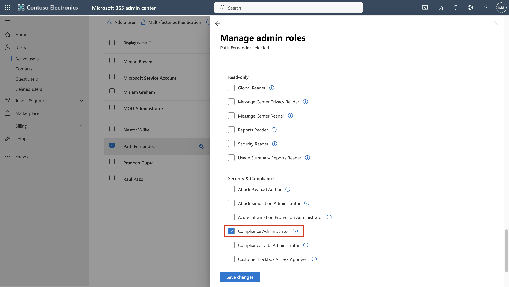
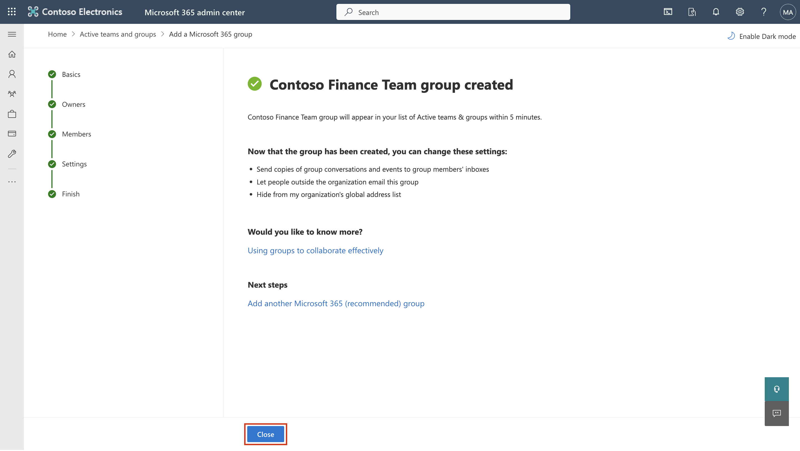
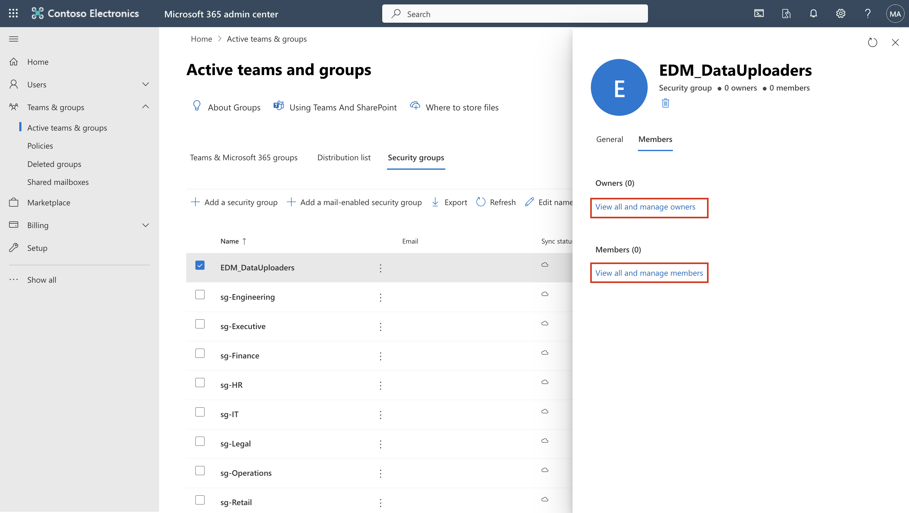
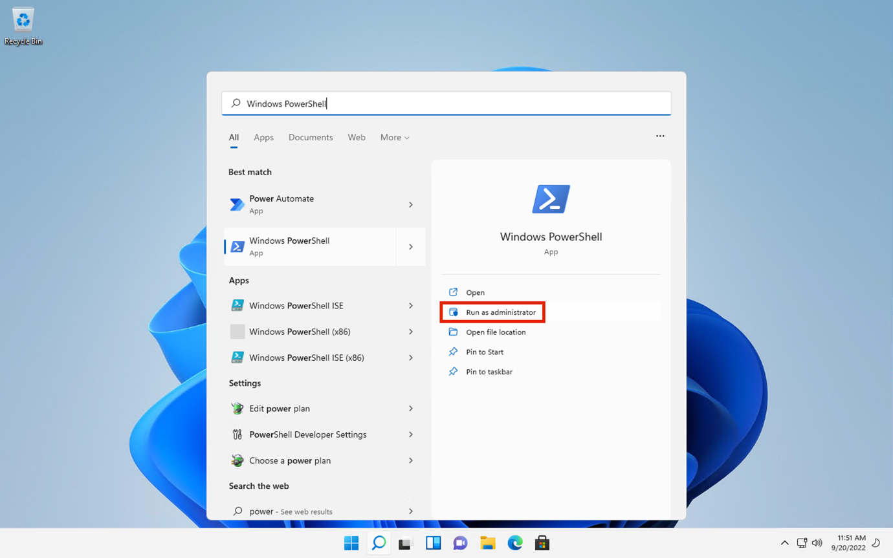

# **ラボ 1 – コンプライアンス ロールの割り当てと Microsoft Purview ポータルの探索**

**導入**

Microsoft Purview ポータルは、Microsoft Purview
内でタスクを実行するユーザーの権限を直接管理できます。ポータルの設定にある「ロールとスコープ」領域を使用すると、Purview
のデータセキュリティ、データガバナンス、リスクとコンプライアンスの各ソリューション全体にわたってユーザーの権限を管理できます。ユーザーが実行できるタスクを、明示的にアクセスを許可した特定のタスクのみに制限することもできます。

重要なお知らせ：Windows PowerShellでコマンドを実行する前に、スクリーンショットにあるものと照らし合わせて確認してください。貼り付けによってフォーマットのエラーが発生することがあります。

**目的**:

- Microsoft 365 のユーザーにマネージャーとコンプライアンス
  ロールを割り当てます。

- チームコラボレーション用の Microsoft 365 とセキュリティ
  グループを作成します。

- Microsoft Purview コンプライアンス評価の試用版を有効にします。

## 演習 1 - コンプライアンス ロールの管理

この演習では、Microsoft Purview
を使用してセキュリティを実装するために必要なすべての試用ライセンスをアクティブ化します。

### タスク 1 – 既存のユーザーにマネージャー ロールを追加します。

1.  ラボの**Resources**タブで提供されているアカウントの詳細を使用して VM
    にログインします。

2.  Microsoft 365
    管理センターにログインします **+++https://admin.microsoft.com+++**管理者ユーザー名と管理者パスワードを使用します。

3.  左側のペインから、 **\[Users\]** \> **\[Active
    users\]**を選択し、最初のユーザー**Adele Vance**をクリックします。

    

4.  **\[Manager\]**の下で、 **\[Edit manager\]** をクリックします。

    

5.  現在のマネージャーを削除し、
    **Patti**と入力します 検索ボックスで**「Patti
    Fernandez」**を選択します。 **「Save Changes」**をクリックします。

    

6.  次のすべてのユーザーのマネージャーを**Patti
    Fernandez**に変更します。

   - Christie Cline

   - Megan Bowe

    Patti Fernandez の場合は、 **MOD Administrator**をマネージャーとして追加します。

    

    

### タスク2 – コンプライアンス管理者の追加

1.  ユーザー**Patti Fernandez**を選択し、
    **\[Account\]の下で\[Roles\]**までスクロールして、 **\[Manage
    roles\]をクリックします**。

    

2.  **\[Roles\]ウィンドウが開い**たら、 **\[Admin center
    access\]**の横にあるラジオ ボタンをオンにして、 **\[Show all by
    category\] を展開します。**

    

3.  **\[Security & compliance\]**までスクロールし、 **\[Compliance
    Administrator\] の**横にあるボックスをオンにして、\[**Save
    changes\]をクリックします**。

    

### センターでチームとグループを作成する

1.  次に、 **「****Teams & groups」を展開し**、 **「****Active teams &
    groups** **」を選択して、「**Teams & Microsoft 365
    groups**」の下にある「Add a Microsoft 365
    group」**をクリックします。

    

2.  名前には**+++Contosoを使用します** **財務チーム+++** 、説明には**+++
    This team handles finance.+ ++ を**使用し、
    **「Next」をクリックします**。

    

3.  **「Assign Owners」ページ**で、 **「Assign Owners」**をクリックし、
    **Adele Vanceの**横にあるボックスにチェックを入れて、「**Add(
    1)」をクリックします。 「Next」**をクリックします。

    

4.  **「Add members」ページ**で、 **Adele
    Vanceを**メンバーとして追加し、
    **「Next」をクリックします**。「**Add members」**ページで、
    **「Next」を選択します**。

5.  グループのメールアドレスには**+++ contfosofinance
    +++を使用してください** 次に、 **\[Next\]をクリックします**。

    

6.  **「Create group」**をクリックします。

    

7.  完了したら、 **「Close」をクリックします**。

    

8.  **Active teams & groups page**で、**Security
    groups**タブを選択します。**Add a security group**を選択します。

    

9.  次の情報を持つ別のグループを作成するには、手順を繰り返します。

- **Set up the basics**画面で、 **「Name」**フィールドに**「 +++
  EDM_DataUploaders +++
  」**と入力します。「Description」フィールドに**「
  +++EDMのデータをアップロードする人+++ 」と入力します**。

- **「Next」**を選択します。

- **\[Settings\]ページ**で、 **\[Next\]を選択します**。

- **\[Review and finish adding group\]ページ**で設定を確認し、
  **\[Create group\]を選択します**。

- **New group
  createdページが表示され**たら、新しく作成された**EDM_DataUploaders**グループを選択します。

  

- **\[Members\] タブ**をクリックし、 **\[View all and manage
  owners\]を選択して**、 **Patti Fernandezを追加します**。

  

  

- 同様に、 **Christie Cline を**メンバーとして追加します。

  

- **Christie Cline**と**Patti Fernandez
  の**追加に成功しました。次に、Patti Fernandez
  をこのグループのメンバーとして追加する必要があります。これは、今後のラボで
  EDM データをアップロードする際に使用するためです。

  

- **EDM_DataUploaders**ペインの**「Member」タブで、
  「Member」**セクションに移動し、 **「View all and manage
  members」**リンクをクリックします。

  

- 右側に表示される**Membersパネル**で、 **「+Add
  members」をクリックします。**

  

- 検索バーに「+++ **PattiF +++」と入力し、 「Patti
  Fernandez」を選択して**、 **「Add」**ボタンを選択します。

  

  

### タスク4 – コンプライアンス評価のためのトライアルの有効化

1.  管理者ユーザー名と管理者パスワードを使用して、 Purview
    ポータル**+++https://purview.microsoft.com+++にログインします。**

2.  ようこそウィンドウが表示された場合は、利用規約に同意し、「**Get
    started」**を選択して閉じます。

    **注: I agree to the terms of data flow disclosure and Privacy Statement**が表示されない場合は、無視して**Get started**ボタンをクリックしてください。

    

3.  ナビゲーション バーから、 **\[Solutions\]** \>
    **\[Audit\]を選択します**。

    

4.  **「Audit」ページ**で、 **「Start recording user and admin
    activity** **」を選択して**、監査ログを有効にします。

    

## **演習2 - Adaptive Protectionの有効化**

1.  Microsoft
    Purviewポータルの左側のナビゲーションペインで、Solutionsをクリックし、
    **Insider Risk Management**に移動して選択します。

    

2.  **Insider** Risk Managementパネルで、 **「Adaptive
    Protection」**をクリックし、 **「Adaptive Protection
    settings」を選択します**。 「Adaptive
    Protection」のトグルを**オンにします。**

    

3.  **\[Save\]ボタン**をクリックします。

    

4.  Adaptive Protectionの有効化には時間がかかります。Adaptive
    Protection機能については、ラボ5で詳しく説明します。

    

## **まとめ**

このラボでは、基本的なコンプライアンス設定を構成し、データ保護のためのMicrosoft
Purviewの機能について学習しました。まず、ユーザーを作成し、適切なロール（マネージャーやコンプライアンス管理者など）を割り当て、Microsoft
365グループとセキュリティグループを設定して、Contosoの組織構造をシミュレートしました。

