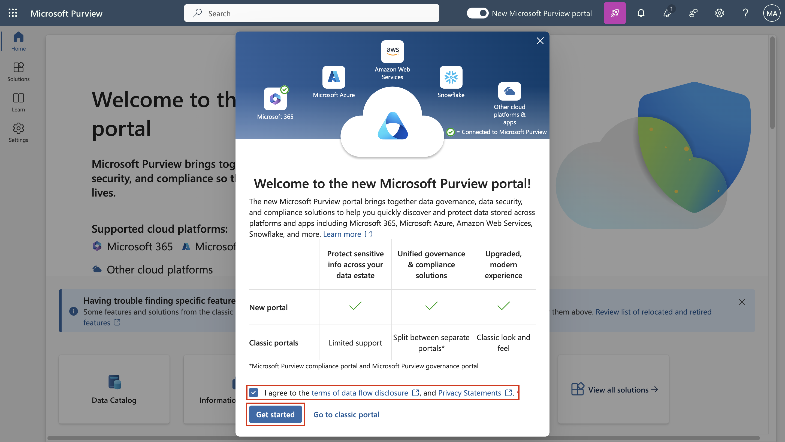
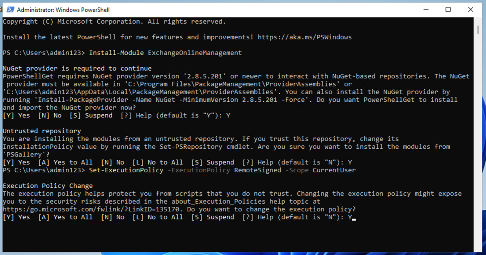

# Lab 1 – Zuweisen von Compliancerollen und Erkunden des Microsoft Purview-Portals

## Ziel:

In diesem Lab erstellen wir Benutzer und weisen ihnen die entsprechenden
Rollen, Teams und Gruppen im Office 365 Admin Center zu, um eine
Organisation – Contoso – darzustellen.

Wir weisen den Benutzern auch Folgendes zu:

1.  Testversion für Compliance-Assessments

Später werden wir die **in Microsoft 365 integrierte Office
365-Nachrichtenverschlüsselung (OME) testen)**.

Zunächst ändern wir die Standardvorlage, um sicherzustellen, dass für
externe Empfänger kein Dialogfeld für soziale IDs angezeigt wird, wenn
eine mit Office 365-Nachrichtenverschlüsselung geschützte Nachricht von
Benutzern der von uns eingerichteten Organisation empfangen wird.

Dann erstellen wir eine neue benutzerdefinierte OME-Konfiguration und
erstellen eine Transportregel, um die OME-Konfiguration auf alle E-Mails
anzuwenden, die von unserer Finanzabteilung gesendet werden.

## Übung 1 – Verwalten von Compliancerollen

In dieser Übung aktivieren wir alle Testlizenzen, die für die
Implementierung der Sicherheit mit Microsoft Purview erforderlich sind.

### Aufgabe 1 – Hinzufügen der Managerrolle zu einem vorhandenen Benutzer.

1.  Melden Sie sich bei der VM mit den Kontodetails an, die Sie mit
    Ihrem Lab erhalten haben.

&nbsp;

1.  Melden Sie sich
    https://admin.microsoft.com` mit dem administrativen Benutzernamen und dem Administratorkennwort`
    beim Microsoft 365 Admin Center an.

&nbsp;

2.  Wählen Sie im linken Fensterbereich **Users** \> **Active Users**,
    und klicken Sie auf den ersten Benutzer **Adele Vance**.

4.  Unter **Manager** Klicken Sie **Edit Manager**.

5.  Entfernen Sie den aktuellen Manager und geben Sie **Patti** im
    Suchfeld ein. Wählen Sie **Patti Fernandez**. Klicken Sie auf **Save
    Changes**.

*Ein Screenshot einer automatisch generierten Computerbeschreibung*

6.  Ändern Sie den Manager **für alle folgenden Benutzer** in Patti
    Fernandez.

- Adele Vance

- Christie Cline

- Megan Bowen

7.  Für Patti Fernandez, fügen Sie **MOD-Administrator** als Manager
    hinzu.

### Aufgabe 2 – Hinzufügen eines Compliance-Administrators

1.  Wählen Sie den Benutzer **Patti Fernandez** aus, unter **Account**,
    scrollen Sie zu **Roles** und klicken Sie auf **Manage Roles**.

Ein Screenshot einer automatisch generierten Computerbeschreibung.

2.  Sobald das **Roles** Fenster wird, geöffnet, überprüfen Sie das
    Optionsfeld in der Nähe des **Admin Center Access**, und erweitern
    **Show all by Category.**

Ein Screenshot einer Computerbeschreibung, automatisch generiert.

3.  Scrollen Sie zu **Security & Compliance**, aktivieren Sie das
    Kontrollkästchen neben **Compliance Administrator**, und klicken Sie
    auf **Save Changes**.

Ein Screenshot einer Computerbeschreibung, automatisch generiert.

4.  Schließen Sie den Bereich, bleiben Sie auf derselben Seite, und
    fahren Sie mit der nächsten Aufgabe fort.

### Aufgabe 3 – Erstellen von Teams und Gruppen im Microsoft Admin Center

1.  Jetzt erweitern Sie **Teams & Groups**, wählen Sie **Active Teams &
    Groups** und klicken Sie auf **Add a Microsoft 365 Group** unter
    **Teams & Microsoft 365 Groups**.

Ein Screenshot einer Computerbeschreibung, automatisch generiert.

2.  Verwenden Sie den Namen `Contoso Finance Team`, und für die
    Beschreibung This `team handles finance.`und klicken Sie dann auf
    **Next**.

Ein Screenshot einer Computerbeschreibung, automatisch generiert.

3.  Auf der **Assign Owners** Seite, klicken Sie auf **Assign Owners**,
    aktivieren Sie das Kontrollkästchen daneben **Adele Vance**, und
    klicken Sie auf **Add (1)**. Klicken Sie dann auf **Next**.

4.  Auf der **Add Members** Seite fügen Sie **Adele Vance** hinzu, und
    **Christie Cline** als Mitglieder, klicken Sie auf **Next**. Auf der
    **Add Members** Seite, wählen Sie **Next**.

&nbsp;

1.  Verwenden Sie als Gruppen-E-Mail-Adresse `contosofinance,` und
    klicken Sie dann auf **Next**.

Ein Screenshot einer Computerbeschreibung, automatisch generiert.

6.  Klicken Sie auf **Create Group**.

Ein Screenshot einer Computerbeschreibung, automatisch generiert

7.  Wenn Sie fertig sind, klicken Sie auf **Close**.

Ein Screenshot einer Computerbeschreibung, automatisch generiert

8.  Auf der **Active Teams & Groups Page**, wählen Sie die **Security
    Groups** Registerkarte. Wählen Sie **Add a Security Group.**

Ein Screenshot einer Computerbeschreibung, automatisch generiert

9.  Wiederholen Sie die Schritte, um eine weitere Gruppe mit den
    folgenden Informationen zu erstellen.

&nbsp;

1.  Auf **Set up the Basics**, geben Sie folgendes in das **Name** Feld
    ein: `EDM_DataUploaders`. Geben Sie im Feld Beschreibung Personen
    ein, `die Daten für EDM hochladen.`

- Wählen Sie **Next** aus.

- Auf der **Settings** Seite, wählen Sie **Next**.

- Auf der **Review and Finish Adding Group** Seite, überprüfen Sie Ihre
  Einstellungen und wählen Sie **Create Group** aus.

- Wenn die Option **New Group Created** Seite angezeigt wird, wählen Sie
  die Schaltfläche Close. Wählen Sie nun die neu angelegte
  **EDM_DataUploaders** Gruppe aus der Liste.

- Wählen Sie auf der Registerkarte Mitglieder die Option **View all and
  Manage Owners**, und fügen Sie **Patti Fernandez** und **Christie
  Cline** hinzu.

- Fügen Sie auf ähnliche Weise **Patti Fernandez** und **Christie
  Cline** als Mitglieder hinzu.

Ein Screenshot einer Computerbeschreibung, automatisch generiert

### Aufgabe 4 – Aktivieren der Testversion für Compliance-Bewertungen

1.  Anmelden Sie sich beim Purview-Portal an.
    `https://purview.microsoft.com` using **Administrative Username**
    und **Administrative Password**.

2.  Wenn ein Willkommensfenster angezeigt wird, stimmen Sie den
    Bedingungen zu und wählen Sie **Get started** und schließen Sie es.

3.  Scrollen Sie nach unten, und wählen Sie unter Testversionen und
    Empfehlungen die Option **View all Trials and Recommendations**.

4.  Auf der **Microsoft Purview Trials and Recommendations** Seite,
    wählen Sie **Compliance Assessments**, unter **Purview and Priva
    Trials** und wählen dann **Try now** aus.

Ein Screenshot einer Computerbeschreibung, automatisch generiert

5.  Klicken Sie auf **Start Trials**.

Hinweis: Es kann bis zu 2 Stunden dauern, bis die Änderungen wirksam
werden. Melden Sie sich erneut an, um die neuen Funktionen zu sehen.
Fahren Sie in der Zwischenzeit mit den nächsten Schritten fort.

6.  Wählen Sie in der Navigationsleiste **Solutions** \> **Audit**.

Ein Screenshot einer Computerbeschreibung, automatisch generiert

7.  Auf der **Audit** Seite, wählen Sie **Start Recording User and Admin
    Activity** so aktivieren Sie die Überwachungsprotokollierung.

Ein Screenshot einer Computerbeschreibung, automatisch generiert

## Übung 2: Verwalten der Office 365-Nachrichtenverschlüsselung

Die erste Einstellung**,** die **Patti Fernandez** konfigurieren und mit
ihrem Pilotteam testen muss, ist die **in Microsoft 365 integrierte
Office 365 Message Encryption (OME).** Zu diesem Zweck ändert er die
Standardvorlage und erstellt eine neue Branding-Vorlage, die einem der
Pilotbenutzer zugewiesen wird. Die Pilotbenutzer testen dann die
OME-Funktionalität mit ihren Konten.

### Aufgabe 1 – Überprüfen der Azure RMS-Funktionalität

In dieser Aufgabe installieren Sie das **Exchange Online
PowerShell-Modul** und überprüfen die korrekte Azure RMS-Funktionalität
Ihres Mandanten.

1.  Öffnen Sie ein **Elevated PowerShell** Fenster, indem Sie die
    Windows-Taste mit der rechten Maustaste auswählen und dann **Windows
    PowerShell** als Administrator auswählen.

Ein Screenshot einer Computerbeschreibung, automatisch generiert

2.  Bestätigen Sie die Schaltfläche **User Account Control** mit
    **Yes**.

3.  Geben Sie das folgende Cmdlet ein, um die neueste Version des
    Exchange Online PowerShell-Moduls zu installieren:

`Install-Module ExchangeOnlineManagement`

Ein Screenshot einer Computerbeschreibung, automatisch generiert

1.  Bestätigen Sie die Schaltfläche **NuGet** provider-Sicherheitsdialog
    mit **Y** für Ja und drücken Sie **Enter**. Dieser Vorgang kann
    einige Sekunden dauern.

Ein Screenshot einer Computerbeschreibung, automatisch generiert

5.  Bestätigen Sie den Sicherheitsdialog für nicht vertrauenswürdige
    Repositorys mit **Y** für Ja und drücken Sie **Enter**. Dieser
    Vorgang kann einige Sekunden dauern.

Ein Screenshot einer Computerbeschreibung, automatisch generiert

6.  Geben Sie das folgende Cmdlet ein, um die Ausführungsrichtlinie zu
    ändern, und drücken Sie **Enter**

`Set-ExecutionPolicy -ExecutionPolicy RemoteSigned -Scope CurrentUser`

7.  Bestätigen Sie die Änderung der Ausführungsrichtlinie mit **Y** für
    Ja, und drücken Sie **Enter**.

8.  Geben Sie das folgende Cmdlet ein, um das **Exchange Online
    PowerShell-Modul zu verwenden** und eine Verbindung mit Ihrem
    Mandanten herzustellen:

`Connect-ExchangeOnline`

1.  Wenn **Sign In** angezeigt wird, melden Sie sich als **Patti
    Fernandez** mit dem Benutzernamen
    `PattiF@{TENANTPREFIX}``.``onmicrosoft.com` und dem Benutzerkennwort
    an, das Sie auf der Registerkarte "Ressourcen" angegeben haben.
    (Ersetzen Sie {TENANTPREFIX} durch das auf der Registerkarte
    "Ressourcen" angegebene Mandantenpräfix.)

&nbsp;

9.  Vergewissern Sie sich, dass Azure RMS und IRM in Ihrem Mandanten
    aktiviert sind, indem Sie das folgende Cmdlet verwenden, und drücken
    Sie **Enter**:

`Get-IRMConfiguration | fl AzureRMSLicensingEnabled`

11. Wenn das **AzureRMSLicensingEnabled** Ergebnis **True** ist, ist
    Azure RMS für Ihren Mandanten aktiviert. Fahren Sie mit dem nächsten
    Schritt fort.

12. Testen Sie die Azure RMS-Vorlagen, die für die Office
    365-Nachrichtenverschlüsselung verwendet werden, mit dem folgenden
    Cmdlet (ersetzen Sie {TENANTPREFIX} durch Ihr Mandantenpräfix, das
    auf der Registerkarte Ressourcen angegeben ist)

`Test-IRMConfiguration -Sender adelev@{TENANTPREFIX.onmicrosoft.com -Recipient adelev@{TENANTPREFIX.onmicrosoft.com`

13. Stellen Sie sicher, dass alle Tests den Status PASS haben und keine
    Fehler angezeigt werden.

Screenshot

14. Lassen Sie das PowerShell-Fenster geöffnet.

Sie haben das Exchange Online PowerShell-Modul erfolgreich installiert,
eine Verbindung mit Ihrem Mandanten hergestellt und die korrekte
Funktionalität von Azure RMS überprüft.

### Aufgabe 2 – Ändern der standardmäßigen OME-Vorlage

Als Nächstes gibt es in Ihrer Organisation eine Anforderung, die
Vertrauenswürdigkeit für fremde Identitätsanbieter wie Google oder
Facebook einzuschränken. Da diese IDs für soziale Netzwerke
standardmäßig für den Zugriff auf Nachrichten aktiviert sind, die mit
OME geschützt sind, müssen Sie die Verwendung von IDs für soziale
Netzwerke für alle Benutzer in Ihrer Organisation deaktivieren.

1.  Führen Sie das folgende Cmdlet aus, um die OME-Standardkonfiguration
    anzuzeigen:

`Get-OMEConfiguration -Identity "OME Configuration" |fl`

Ein Screenshot einer Computerbeschreibung, automatisch generiert

2.  Überprüfen Sie die Einstellungen, und vergewissern Sie sich, dass
    der Parameter **SocialIdSignIn** auf **True** festgelegt ist.

3.  Führen Sie das folgende Cmdlet aus, um die Verwendung von IDs für
    soziale Netzwerke für den Zugriff auf Nachrichten von Ihrem
    Mandanten einzuschränken, der mit OME geschützt ist:

`Set-OMEConfiguration -Identity "OME Configuration" -SocialIdSignIn:$false`

Ein Computerbildschirm mit Text Beschreibung wird automatisch generiert

4.  Bestätigen Sie die Warnmeldung zum Anpassen der Standardvorlage mit
    **Y** für Ja und drücken Sie die Eingabetaste.

5.  Überprüfen Sie die Standardkonfiguration erneut und validieren Sie,
    der Parameter **SocialIdSignIn** ist jetzt auf **False** gesetzt.

`Get-OMEConfiguration -Identity "OME Configuration" |fl`

6.  Beachten Sie, dass das Ergebnis anzeigen sollte, dass
    **SocialIDSignIn** auf **False** festgelegt ist.

7.  Lassen Sie das **PowerShell-Fenster** geöffnet, und fahren Sie mit
    der nächsten Übung fort.

Sie haben die Verwendung von fremden Identitätsanbietern, z. B. Google
und Facebook, in der Office365-Nachrichtenverschlüsselung erfolgreich
deaktiviert.

### Aufgabe 3 – Testen der modifizierten OME-Vorlage

Sie müssen bestätigen, dass für externe Empfänger kein Dialogfeld für
soziale IDs angezeigt wird, wenn Sie eine Nachricht erhalten, die mit
Office 365-Nachrichtenverschlüsselung von Benutzern Ihres Mandanten
geschützt ist, und dass sie das OTP jederzeit verwenden müssen, um auf
den verschlüsselten Inhalt zuzugreifen.

1.  Öffnen Sie in **Microsoft Edge** ein **New In Private Window**,
    navigieren Sie zu `https://outlook.office.com,` und melden Sie sich
    bei Outlook im Web mit dem Benutzernamen
    `AdeleV@{TENANTPREFIX}.onmicrosoft.com` und dem Benutzerkennwort an,
    das Sie auf der Registerkarte "Ressourcen" angegeben haben.

&nbsp;

1.  Auf der **Stay signed in?** Dialogbox, Aktivieren Sie das
    Kontrollkästchen **Don’t show this again**, und wählen Sie dann
    **No** aus.

&nbsp;

1.  Wählen Sie im Dialogfeld **Save Password** die Option **Save,** um
    das Passwort des Pilotenbenutzers in Ihrem Browser zu speichern.

2.  Wenn **Translate page from…** Fenster angezeigt wird, wählen Sie den
    Pfeil nach unten aus, und wählen Sie **Never translate from…**.

3.  Wählen Sie **New Mail** in der oberen linken Seite von Outlook im
    Web aus.

Grafische Benutzeroberfläche, Text, Anwendung, Word Beschreibung werden
automatisch generiert

1.  Geben Sie in der Zeile **To** Ihre persönliche E-Mail-Adresse oder
    eine andere E-Mail-Adresse eines Drittanbieters ein, die sich nicht
    in der Mandantendomäne befindet. Geben Sie `Secret Message` in die
    Betreffzeile und `My super-secret message``.`` ``ein.`

Grafische Benutzeroberfläche, Text, Anwendung, Word Beschreibung werden
automatisch generiert

7.  Wechseln Sie im oberen Bereich zum **Optionsbereich**, und wählen
    Sie **Encrypt** aus, um die Nachricht zu verschlüsseln. Wenn Sie die
    Option nicht finden, wählen Sie die 3 Punkte (...) oben rechts und
    wähle dann aus dem Dropdown-Menü **Encrypt** aus.

Ein Screenshot einer Computerbeschreibung wird automatisch generiert

8.  Nachdem Sie die Nachricht erfolgreich verschlüsselt haben, sollte
    ein Hinweis angezeigt werden, der besagt: “**Encrypt: This message
    is encrypted. Recipients can’t remove encryption.**”

Ein Screenshot einer Computerbeschreibung wird automatisch generiert

9.  Wählen Sie **Send** um die Nachricht zu senden.

Grafische Benutzeroberfläche, Text, E-Mail Beschreibung wird automatisch
generiert

**Anmerkung**: Im Testkonto haben Sie möglicherweise nicht die
Berechtigung, E-Mails zu senden, und Ihre E-Mails können den Empfänger
von Ihrem aktuellen Mandanten möglicherweise nicht erreichen. Aber Ihre
E-Mail geht durch, Sie können die folgenden Schritte ausführen, um die
Vorlage zu testen.

10. Melden Sie sich bei Ihrem persönlichen E-Mail-Konto an und öffnen
    Sie die Nachricht von Adele Vance. Wenn Sie diese E-Mail an ein
    Microsoft-Konto (z. B. @outlook.com) gesendet haben, wird die
    Verschlüsselung möglicherweise automatisch verarbeitet, und die
    Meldung wird automatisch angezeigt.

**Anmerkung**: Wenn Sie die E-Mail an einen anderen E-Mail-Dienst wie
(@gmail.com) gesendet haben, müssen Sie möglicherweise die nächsten
Schritte ausführen, um die Verschlüsselung zu verarbeiten und die
Nachricht zu lesen. Möglicherweise müssen Sie Ihren Junk- oder
Spam-Ordner auf die Nachricht überprüfen.

11. Wählen Sie **Read the Message** aus.

&nbsp;

1.  Wenn Social IDs nicht aktiviert sind, gibt es keine Schaltfläche zur
    Authentifizierung mit Ihrem Google-Konto.

&nbsp;

12. Wählen Sie **Sign in with a One-time Passcode** um einen zeitlich
    begrenzten Passcode zu erhalten.

13. Gehen Sie zu Ihrem persönlichen E-Mail-Portal und öffnen Sie die
    Nachricht mit dem Betreff **Your one-time Passcode to View the
    Message**.

14. Kopieren Sie die Kennung, fügen Sie sie in das OME-Portal ein, und
    wählen Sie **Continue**.

15. Überprüfen der verschlüsselten Nachricht.

Sie haben die geänderte Standard-OME-Vorlage mit deaktivierten Social
IDs erfolgreich getestet.

### Aufgabe 4 – Erstellen einer benutzerdefinierten Branding-Vorlage

Geschützte Nachrichten, die von der Finanzabteilung Ihres Unternehmens
gesendet werden, erfordern ein spezielles Branding, einschließlich
benutzerdefinierter Einleitungs- und Textkörper sowie eines
Haftungsausschluss-Links in der Fußzeile. Die Finanzmeldungen verfallen
ebenfalls nach sieben Tagen. In dieser Aufgabe erstellen Sie eine neue
benutzerdefinierte OME-Konfiguration und erstellen eine Transportregel,
um die OME-Konfiguration auf alle E-Mails anzuwenden, die von der
Finanzabteilung gesendet werden.

1.  Im PowerShell-Fenster, das wir mit Exchange Online verbunden
    gelassen haben. Führen Sie das folgende Cmdlet aus, um eine neue
    OME-Konfiguration zu erstellen:

`New-OMEConfiguration -Identity "Finance Department" -ExternalMailExpiryInDays 7`

Text Beschreibung wird automatisch generiert

2.  Bestätigen Sie die Warnmeldung zum Anpassen der Vorlage mit **Y**
    für Ja und drücken Sie **Enter**.

Text Beschreibung wird automatisch generiert

1.  Ändern Sie die Einführungstextnachricht mit dem folgenden Cmdlet

`Set-OMEConfiguration -Identity "Finance Department" -IntroductionText "from Contoso Ltd. finance department has sent you a secure message."`

4.  Bestätigen Sie die Warnmeldung zum Anpassen der Vorlage mit **Y**
    für Ja und drücken Sie **Enter**.

1.  Ändern Sie den E-Mail-Text der Nachricht mit dem folgenden Cmdlet

`Set-OMEConfiguration -Identity "Finance Department" -EmailText "Encrypted message sent from Contoso Ltd. finance department. Handle the content responsibly."`

6.  Bestätigen Sie die Warnmeldung zum Anpassen der Vorlage mit **Y**
    für Ja und drücken Sie **Enter**.

Text Beschreibung wird automatisch generiert

1.  Ändern Sie die Haftungsausschluss-URL so, dass sie auf die
    Datenschutzerklärungswebsite von Contoso verweist

`Set-OMEConfiguration -Identity "Finance Department" -PrivacyStatementURL "https://contoso.com/privacystatement.html"`

Text Beschreibung wird automatisch generiert

8.  Bestätigen Sie die Warnmeldung zum Anpassen der Vorlage mit **Y**
    für Ja und drücken Sie **Enter**.

9.  Verwenden Sie das folgende Cmdlet, um eine Nachrichtenflussregel zu
    erstellen, die die benutzerdefinierte OME-Vorlage auf alle
    Nachrichten anwendet, die vom Finanzteam von Contoso gesendet
    werden. Dieser Vorgang kann einige Sekunden dauern.

`New-TransportRule -Name "Encrypt all mails from Contoso Finance team" -FromScope InOrganization -FromMemberOf "Contoso Finance Team" -ApplyRightsProtectionCustomizationTemplate "Finance Department" -ApplyRightsProtectionTemplate Encrypt`

Text Beschreibung wird automatisch generiert

10. Geben Sie das folgende Cmdlet ein, um die Änderungen zu überprüfen.

`Get-OMEConfiguration -Identity "Finance Department" | Format-List`

11. Lassen Sie **PowerShell** geöffnet.

Sie haben erfolgreich eine neue Transportregel erstellt, die die
benutzerdefinierte OME-Vorlage automatisch anwendet, wenn ein Mitglied
der Finanzabteilung eine Nachricht an externe Empfänger sendet.

### Aufgabe 5 – Testen der benutzerdefinierten Brandingvorlage#

Um die neue benutzerdefinierte OME-Konfiguration zu validieren, müssen
Sie das Konto von Christie Cline verwenden, die Mitglied des Finanzteams
ist. Im Testkonto haben Sie nicht das Recht, E-Mails zu senden, aber Sie
können die folgenden Schritte ausführen, um zu verstehen, wie Sie die
Vorlage testen können, wenn Sie Ihre eigenen Lizenzen haben. Sie können
die Schritte 1 bis 4 ausführen, aber Ihre E-Mail kann den Empfänger von
Ihrem aktuellen Testmandanten möglicherweise nicht erreichen.

1.  In **Microsoft Edge**, Öffnen Sie eine **New InPrivate Window** und
    navigieren Sie zu `https://outlook.office.com` und melden Sie sich
    mit dem Benutzernamen bei Outlook im Web an
    `ChristieC@{TENANTPREFIX}.onmicrosoft.com` und das Benutzerkennwort,
    das auf der Registerkarte "Ressourcen" angegeben ist.

Grafische Benutzeroberfläche, Text, Anwendung Beschreibung wird
automatisch generiert

2.  Wählen Sie **New Message** aus dem oberen linken Teil von Outlook im
    Web.

3.  Geben Sie in der Zeile **To** Ihre persönliche E-Mail-Adresse oder
    eine andere E-Mail-Adresse eines Drittanbieters ein, die sich nicht
    in der Mandantendomäne befindet. Geben Sie `Finance Report` in die
    Betreffzeile ein und geben Sie `Secret finance information.` to the
    body. ein

4.  Wählen Sie **Send** um die Nachricht zu senden.

5.  Melden Sie sich mit dem E-Mail-Konto an, das Sie oben verwendet
    haben, und öffnen Sie die Nachricht von Christie Cline.

6.  Sie sollten eine Nachricht von **Christie Cline** sehen, die wie in
    der Abbildung unten aussieht. Wählen Sie **Read the Message** aus.

7.  Wenn Sie die Nachricht lesen möchten, führen Sie die folgenden
    Schritte aus.

    1.  Wählen Sie **Read the Message**. Wählen Sie **Sign in with a
        One-time passcode,** um einen zeitlich begrenzten Passcode zu
        erhalten.

    2.  Gehen Sie zu Ihrem persönlichen E-Mail-Portal und öffnen Sie die
        Nachricht mit dem Betreff **Your one-time Passcode to View the
        Message**.

    3.  Kopieren Sie die Kennung, fügen Sie sie in das OME-Portal ein,
        und wählen Sie **Continue**.

    4.  Überprüfen der verschlüsselten Nachricht mit benutzerdefiniertem
        Branding.

Sie haben die neue angepasste OME-Vorlage erfolgreich getestet.

## Übung 3 – Aktivieren des adaptiven Schutzes

1.  In Microsoft Edge, Navigieren Sie zu `https://purview.microsoft.com`
    und melden Sie sich im Perview-Portal als **MOD-Administrator**.

2.  Wählen Sie im linken Navigationsbereich **Solutioons** \> **Insider
    Risk Management** \> **Adaptive Protection**. Wählen Sie dann
    **Dashboard** aus. Wählen Sie dann **Quick setup** aus.

3.  Es wird eine Meldung angezeigt, die besagt, dass wir die Dinge
    einrichten. Es dauert 72 Stunden, bis es aktiviert ist. Wir werden
    dies im 8. Lab verwenden, in dem wir die adaptive Schutzfunktion
    untersuchen.

4.  Wählen Sie die Registerkarte **Adaptive Protection Settings** aus,
    und aktivieren Sie die **Umschaltfläche Adaptive Protection.**
    Wählen Sie **Save** aus. 

## Zusammenfassung:

In dieser Übung haben wir erfolgreich eine Organisation in unserem Admin
Center repliziert, entsprechende Lizenzen zugewiesen und gelernt, wie
die in Microsoft 365 integrierte Office 365 Message Encryption (OME)
verwendet wird.
