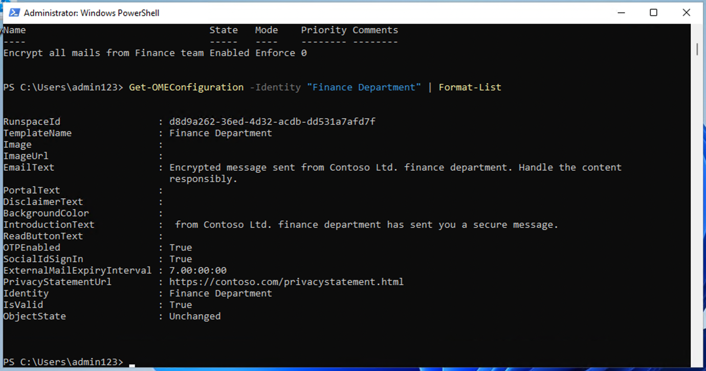

# **ラボ 1 – コンプライアンス ロールの割り当てと Microsoft Purview ポータルの探索**

**導入**

Microsoft Purview ポータルは、Microsoft Purview
内でタスクを実行するユーザーの権限を直接管理できます。ポータルの設定にある「ロールとスコープ」領域を使用すると、Purview
のデータセキュリティ、データガバナンス、リスクとコンプライアンスの各ソリューション全体にわたってユーザーの権限を管理できます。ユーザーが実行できるタスクを、明示的にアクセスを許可した特定のタスクのみに制限することもできます。

**目的**:

- Microsoft 365 のユーザーにマネージャーとコンプライアンス
  ロールを割り当てます。

- チームコラボレーション用の Microsoft 365 とセキュリティ
  グループを作成します。

- Microsoft Purview コンプライアンス評価の試用版を有効にします。

- Office 365 メッセージ暗号化用に Azure RMS を検証および構成します。

- デフォルトの OME テンプレートを変更して、ソーシャル ID
  アクセスを無効にします。

- ソーシャル サインインなしで暗号化された電子メール配信をテストします。

- 財務チーム向けにカスタム OME ブランディング
  テンプレートを作成して適用します。

## 演習 1 - コンプライアンス ロールの管理

この演習では、Microsoft Purview
を使用してセキュリティを実装するために必要なすべての試用ライセンスをアクティブ化します。

### タスク 1 – 既存のユーザーにマネージャー ロールを追加します。

1.  ラボの**Resources**タブで提供されているアカウントの詳細を使用して VM
    にログインします。

2.  Microsoft 365
    管理センターにログインします **+++https://admin.microsoft.com+++**管理者ユーザー名と管理者パスワードを使用します。

3.  左側のペインから、 **\[Users\]** \> **\[Active
    users\]**を選択し、最初のユーザー**Adele Vance**をクリックします。

4.  **\[Manager\]**の下で、 **\[Edit manager\]** をクリックします。

5.  現在のマネージャーを削除し、
    **Patti**と入力します 検索ボックスで**「Patti
    Fernandez」**を選択します。 **「Save Changes」**をクリックします。

6.  次のすべてのユーザーのマネージャーを**Patti
    Fernandez**に変更します。

- Christie Cline

- Megan Bowe

Patti Fernandez の場合は、 **MOD
Administrator**をマネージャーとして追加します。

> 
>
> 

### タスク2 – コンプライアンス管理者の追加

1.  ユーザー**Patti Fernandez**を選択し、
    **\[Account\]の下で\[Roles\]**までスクロールして、 **\[Manage
    roles\]をクリックします**。

2.  **\[Roles\]ウィンドウが開い**たら、 **\[Admin center
    access\]**の横にあるラジオ ボタンをオンにして、 **\[Show all by
    category\] を展開します。**

3.  **\[Security & compliance\]**までスクロールし、 **\[Compliance
    Administrator\] の**横にあるボックスをオンにして、\[**Save
    changes\]をクリックします**。

### センターでチームとグループを作成する

1.  次に、 **「****Teams & groups」を展開し**、 **「****Active teams &
    groups** **」を選択して、「**Teams & Microsoft 365
    groups**」の下にある「Add a Microsoft 365
    group」**をクリックします。

2.  名前には**+++Contosoを使用します** **財務チーム+++** 、説明には**+++
    This team handles finance.+ ++ を**使用し、
    **「Next」をクリックします**。

3.  **「Assign Owners」ページ**で、 **「Assign Owners」**をクリックし、
    **Adele Vanceの**横にあるボックスにチェックを入れて、「**Add(
    1)」をクリックします。 「Next」**をクリックします。

4.  **「Add members」ページ**で、 **Adele
    Vanceを**メンバーとして追加し、
    **「Next」をクリックします**。「**Add members」**ページで、
    **「Next」を選択します**。

5.  グループのメールアドレスには**+++ contfosofinance
    +++を使用してください** 次に、 **\[Next\]をクリックします**。

6.  **「Create group」**をクリックします。

7.  完了したら、 **「Close」をクリックします**。

8.  **Active teams & groups page**で、**Security
    groups**タブを選択します。**Add a security group**を選択します。

9.  次の情報を持つ別のグループを作成するには、手順を繰り返します。

- **Set up the basics**画面で、 **「Name」**フィールドに**「 +++
  EDM_DataUploaders +++
  」**と入力します。「Description」フィールドに**「
  +++EDMのデータをアップロードする人+++ 」と入力します**。

- **「Next」**を選択します。

- **\[Settings\]ページ**で、 **\[Next\]を選択します**。

- **\[Review and finish adding group\]ページ**で設定を確認し、
  **\[Create group\]を選択します**。

- **New group
  createdページが表示され**たら、新しく作成された**EDM_DataUploaders**グループを選択します。

> 

- **\[Members\] タブ**をクリックし、 **\[View all and manage
  owners\]を選択して**、 **Patti Fernandezを追加します**。

- 同様に、 **Christie Cline を**メンバーとして追加します。

- **Christie Cline**と**Patti Fernandez
  の**追加に成功しました。次に、Patti Fernandez
  をこのグループのメンバーとして追加する必要があります。これは、今後のラボで
  EDM データをアップロードする際に使用するためです。

- **EDM_DataUploaders**ペインの**「Member」タブで、
  「Member」**セクションに移動し、 **「View all and manage
  members」**リンクをクリックします。

- 右側に表示される**Membersパネル**で、 **「+Add
  members」をクリックします。**

- 検索バーに「+++ **PattiF +++」と入力し、 「Patti
  Fernandez」を選択して**、 **「Add」**ボタンを選択します。

### タスク4 – コンプライアンス評価のためのトライアルの有効化

1.  管理者ユーザー名と管理者パスワードを使用して、 Purview
    ポータル**+++https://purview.microsoft.com+++にログインします。**

2.  ようこそウィンドウが表示された場合は、利用規約に同意し、「**Get
    started」**を選択して閉じます。

> **注: I agree to the terms of data flow disclosure and Privacy
> Statement**が表示されない場合は、無視して**Get
> started**ボタンをクリックしてください。

3.  ナビゲーション バーから、 **\[Solutions\]** \>
    **\[Audit\]を選択します**。

4.  **「Audit」ページ**で、 **「Start recording user and admin
    activity** **」を選択して**、監査ログを有効にします。

## 演習 2 - Office 365 メッセージ暗号化の管理

Patti Fernandez がパイロット
チームで構成およびテストする必要がある最初の設定は、**Microsoft 365
built-in** **Office 365 Message Encryption
(OME)**です。この目的のために、彼女はデフォルトのテンプレートを変更し、新しいブランディングテンプレートを作成します。このテンプレートはパイロットユーザーの1人に割り当てます。パイロットユーザーは、自分のアカウントでOMEの機能をテストします。

### タスク 1 – Azure RMS の機能の検証

**Exchange Online
PowerShellモジュール**をインストールし、テナントの正しい Azure RMS
機能を確認します。

1.  マウスの右ボタンで Windows ボタンを選択して管理者**特権の
    PowerShellウィンドウ**を開き、 **Windows PowerShell
    を**管理者として実行します。

2.  **\[User Account
    Control\]**ウィンドウで**\[Yes\]をクリックして**確認します。

3.  最新の Exchange Online PowerShell モジュール
    バージョンをインストールするには、次のコマンドレットを入力します。

**+++Install-ModuleExchangeOnlineManagement +++**

4.  信頼できないリポジトリのセキュリティに関するダイアログで**Y**
    （はい）を選択し、 **Enter
    キーを押します**。このプロセスが完了するまで数秒かかる場合があります。

**注**: 信頼されていないリポジトリの確認の前に NuGet
プロバイダーが続行する必要があるというメッセージが表示された場合は、
**Yと入力してEnterボタン**を押します。

5.  実行ポリシーを変更するには、次のコマンドレットを入力して**Enter
    キーを押します。**

**+++Set-ExecutionPolicy -ExecutionPolicy RemoteSigned -Scope
CurrentUser+++**

6.  実行ポリシーの変更を**Y (はい)**で確認し、 **Enter
    キーを押します**。

7.  **Exchange Online
    PowerShell**モジュールを使用してテナントに接続するには、次のコマンドレットを入力します。

**+++Connect-ExchangeOnline +++**

8.  **Sign inウィンドウが表示され**たら、ユーザー名
    PattiF@WWLxXXXXXX.onmicrosoft.com を使用して**Patti
    Fernandezとしてサインインします。** リソース
    タブで指定されたユーザーパスワード。

**\[Automatically sign in to all desktop apps and websites on this
device?」という**ダイアログボックスが表示された場合は、 **「No, this app
only」**ボタンをクリックします。

9.  次のコマンドレットを使用してテナント内で Azure RMS と IRM
    がアクティブ化されていることを確認し、 **Enter** キーを押します。

**+++ Get-IRMConfiguration | fl AzureRMSLicensingEnabled +++**

10. **AzureRMSLicensingEnabled
    の**結果が**Trueの**場合、テナントに対して Azure RMS
    がアクティブ化されます。次の手順に進みます。

11. 次のコマンドレットを使用して、デモ パイロット ユーザー**Adele
    Vance**に対して Office 365 メッセージ暗号化に使用される Azure RMS
    テンプレートをテストします( WWLxXXXXXX をリソース
    タブで指定したテナント プレフィックスに置き換えます)。

**+++
Test-IRMConfiguration -Senderadelev@WWLxXXXXXX.onmicrosoft.com -Recipientadelev@WWLxXXXXX.onmicrosoft.com
+++**

12. すべてのテストのステータスが PASS
    であり、エラーが表示されないことを確認します。

13. **PowerShell**ウィンドウを開いたままにしておきます。

Exchange Online PowerShell
モジュールが正常にインストールされ、テナントに接続され、Azure RMS
の正しい機能が検証されました。

### タスク2 – デフォルトのOMEテンプレートの変更

次に、組織ではGoogleやFacebookなどの外部IDプロバイダーへの信頼を制限する必要があります。これらのソーシャルIDは、OMEで保護されたメッセージにアクセスするためにデフォルトで有効化されているため、組織内のすべてのユーザーに対してソーシャルIDの使用を無効化する必要があります。

1.  デフォルトの OME
    構成を表示するには、次のコマンドレットを実行します。

**+++ Get-OMEConfiguration -Identity"OME Configuration" | fl +++**

2.  設定を確認し、
    **SocialIdSignInパラメータがTrue**に設定されていることを確認します。

3.  OME
    で保護されたテナントからのメッセージにアクセスするためのソーシャル
    ID の使用を制限するには、次のコマンドレットを実行します。

4.  **Set-OMEConfiguration -Identity"OME
    Configuration" -SocialIdSignIn:$false**

5.  デフォルトのテンプレートをカスタマイズするための警告メッセージに対して**「Y」**
    (はい) をクリックして確認し、Enter キーを押します。

6.  デフォルト構成を再度確認して検証すると、
    **SocialIdSignInパラメータがFalse**に設定されていることがわかります。

**+++ Get-OMEConfiguration -Identity"OME Configuration" | fl +++**

7.  結果には**SocialIDSignIn**が**False**に設定されていることが示されることに注意してください。

8.  **PowerShellウィンドウ**を離れる **開い**て次の演習に進みます。

Office 365 メッセージ暗号化で、Google や Facebook などの外部 ID
プロバイダーの使用を正常に無効にしました。

### タスク3 – 変更されたOMEテンプレートのテスト

テナントのユーザーから Office 365
メッセージ暗号化で保護されたメッセージを受信するときに、外部の受信者に対してソーシャル
ID
ダイアログが表示されず、暗号化されたコンテンツにアクセスするときはいつでも
OTP を使用する必要があることを確認する必要があります。

1.  **Microsoft Edge**で、**New InPrivate Windowを開き、
    https://outlook.office.com**に移動して、ユーザー名**AdeleV@WWLxXXXXXX.onmicrosoft.com**とリソース
    タブで指定されたユーザー パスワードを使用して Outlook on the web
    にログインします。

2.  **\[Stay signed in?\]ダイアログ ボックス**で、\[**Don’t show this
    again\]**チェック ボックスをオンにして、 **\[No\]を選択します**。

3.  **Save password**ダイアログボックスが表示された場合は、
    **「Save」を選択します**。

4.  **\[Translate page
    from…** **\]ウィンドウが表示された**場合は、下矢印を選択し、
    **\[Never translate from…\]を選択します**。

5.  **「Your privacy
    matters」**ダイアログボックスが表示されたら、「**Continue」**ボタンをクリックします。

> 

6.  Web 上の Outlook の左上部分から**\[New mail\]**を選択します。

7.  **To欄**に、テナントドメイン外の個人用メールアドレスまたはサードパーティのメールアドレスを入力します。件名に**「Secret
    Message」 、**本文に**「+++My super-secret message.+
    ++」と入力します。**

8.  上部のペインから**Options**ペインに移動し、**Encryptを選択して**メッセージを暗号化します。

9.  メッセージの暗号化に成功すると、「**Encrypt: This message is
    encrypted. Recipients can't remove
    encryption**」という通知が表示されます。

10. メッセージを送信するには、\[**Send\]**を選択します。

トライアルアカウントではメールを送信する権限がありませんが、ご自身のライセンスをお持ちの場合、以下の手順でテンプレートをテストする方法をご確認ください。現在のテナントからメールが受信者に届くことはありません。

11. 個人用メールアカウントにサインインし、Adele
    Vanceからのメッセージを開いてください。このメールをMicrosoftアカウント（@outlook.comなど）に送信した場合、暗号化が自動的に処理され、メッセージが自動的に表示される可能性があります。

**注:** （@google.com
などの）別のメールサービスにメールを送信した場合は、暗号化処理を行ってメッセージを読むために次の手順を実行する必要がある場合があります。迷惑メールフォルダやスパムフォルダにメッセージが届いていないかご確認ください。

12. **\[Read the message\]**を選択します。

13. ソーシャル ID を有効にしないと、Google
    アカウントで認証するボタンが表示されません。

14. 期間限定のパスコードを受け取るには、 **「Sign in with a One-time
    passcode」を**選択します。

> 

15. **「Your one-time passcode to view the
    message」の**メッセージを開きます。

> 

16. パスコードをコピーし、 OME ポータルに貼り付けて、
    **\[Continue\]を選択します**。

17. 暗号化されたメッセージを確認します。

> 

非アクティブ化されたソーシャル ID を使用して、変更されたデフォルトの OME
テンプレートを正常にテストしました。

### タスク4 – カスタム ブランディング テンプレートの作成

組織の財務部門から送信される保護されたメッセージには、カスタマイズされた導入部と本文、フッターの免責事項リンクなど、特別なブランディングが必要です。また、財務メッセージは7日後に有効期限が切れます。このタスクでは、新しいカスタムOME構成を作成し、財務部門から送信されるすべてのメールにOME構成を適用するトランスポートルールを作成します。

1.  Exchange Online を接続した状態で開いたままにした PowerShell
    ウィンドウで、次のコマンドレットを実行して新しい OME
    構成を作成します。

**+++ New-OMEConfiguration -Identity"Finance
Department" -ExternalMailExpiryInDays 7+++**

2.  テンプレートのカスタマイズに関する警告メッセージに対して**「Y」**
    （はい）をクリックして確認し、 **Enter キーを押します**。

3.  次のコマンドレットを使用して紹介テキスト メッセージを変更します。

**+++ Set-OMEConfiguration -Identity"Finance
Department" -IntroductionText " from Contoso Ltd. finance department has
sent you a secure message." +++**

4.  テンプレートのカスタマイズに関する警告メッセージに対して**「Y」**
    （はい）をクリックして確認し、 **Enter キーを押します**。

5.  次のコマンドレットを使用して、メッセージの本文の電子メール
    テキストを変更します。

**+++ Set-OMEConfiguration -Identity"Finance
Department" -EmailText "Encrypted message sent from Contoso Ltd. finance
department. Handle the content responsibly." +++**

6.  テンプレートのカスタマイズに関する警告メッセージに対して**「Y」**
    （はい）をクリックして確認し、 **Enter キーを押します**。

7.  免責事項の URL を Contoso のプライバシー ステートメント
    サイトを指すように変更します。

**+++ Set-OMEConfiguration -Identity "Finance
Department" -PrivacyStatementURL"https://contoso.com/privacystatement.html"+++**

8.  テンプレートのカスタマイズに関する警告メッセージに対して**「Y」**
    （はい）をクリックして確認し、 **Enter キーを押します**。

9.  次のコマンドレットを使用して、Contoso
    財務チームから送信されるすべてのメッセージにカスタム OME
    テンプレートを適用するメールフロールールを作成します。このプロセスは完了するまで数秒かかる場合があります。

**+++New-TransportRule -Name "Encrypt all mails from Contoso Finance
team" -FromScopeInOrganization -FromMemberOf "Contoso Finance
Team"-ApplyRightsProtectionCustomizationTemplate"Finance
Department" -ApplyRightsProtectionTemplate Encrypt +++**

10. 変更を確認するには、次のコマンドレットを入力します。

**+++Get- OMEConfiguration - Identity"Finance Department" |
Format-List+++**

11. **PowerShellを開いた**ままにしておきます。

財務部門のメンバーが外部の受信者にメッセージを送信するときに、カスタム
OME テンプレートを自動的に適用する新しいトランスポート
ルールが正常に作成されました。

### タスク5 – カスタムブランディングテンプレートのテスト

新しいカスタムOME設定を検証するには、財務チームのメンバーであるChristie
Clineのアカウントを使用する必要があります。トライアルアカウントではメールを送信する権限がありませんが、ご自身のライセンスをお持ちの場合、テンプレートをテストする方法については、以下の手順をご確認ください。手順1～4は実行できますが、現在のテナントから受信者にメールが届きません。

1.  **Microsoft Edge**で、**New InPrivate ウィンドウを開き、
    https://outlook.office.com**に移動して、ユーザー名[**ChristieC@M365xXXXXXX.onmicrosoft.com**で
    Outlook on the web
    にログインします。](mailto:ChristieC@M365xXXXXXX.onmicrosoft.com)
    およびリソース タブで指定されたユーザー パスワード。

2.  Web 上の Outlook の左上部分から**\[New message\]**を選択します。

3.  **To欄**に、テナントドメイン外の個人またはサードパーティのメールアドレスを入力します。件名欄に**「Finance
    report」 、**本文欄に**「Secret finance
    information」**と入力します。

4.  メッセージを送信するには、\[**Send\]**を選択します。

5.  上記で使用したメール アカウントにサインインし、Veronica Quek
    からのメッセージを開きます。

6.  **Christie Cline**からのメッセージ（下図のような）が表示されます。
    **「Read the message」を選択してください**。

7.  メッセージを読む場合は、次の手順を実行します。

    1.  **「Read the message」**をクリックします。 **「Sign in with a
        One-time
        passcode」を選択して**、期間限定のパスコードを受け取ります。

    2.  **「Your one-time passcode to view the
        message」の**メッセージを開きます。

    3.  パスコードをコピーし、 OME ポータルに貼り付けて、
        **\[Continue\]を選択します**。

    4.  カスタム ブランディングで暗号化されたメッセージを確認します。

新しくカスタマイズされた OME テンプレートのテストが正常に完了しました。

## **演習3 - Adaptive Protectionの有効化**

1.  Microsoft
    Purviewポータルの左側のナビゲーションペインで、Solutionsをクリックし、
    **Insider Risk Management**に移動して選択します。

> 

2.  **Insider** Risk Managementパネルで、 **「Adaptive
    Protection」**をクリックし、 **「Adaptive Protection
    settings」を選択します**。 「Adaptive
    Protection」のトグルを**オンにします。**

> 

3.  **\[Save\]ボタン**をクリックします。

4.  Adaptive Protectionの有効化には時間がかかります。Adaptive
    Protection機能については、ラボ5で詳しく説明します。

## **まとめ**

このラボでは、基本的なコンプライアンス設定を構成し、データ保護のためのMicrosoft
Purviewの機能について学習しました。まず、ユーザーを作成し、適切なロール（マネージャーやコンプライアンス管理者など）を割り当て、Microsoft
365グループとセキュリティグループを設定して、Contosoの組織構造をシミュレートしました。

次に、コンプライアンス機能のトライアル版を有効化し、Microsoft Purview
で監査ログを有効化しました。ラボでは、 **Office 365 Message Encryption
(OME)**
の構成とテストを進めました。具体的には、デフォルトのテンプレートを変更してソーシャルIDアクセスを無効化し、財務部門向けに**カスタムブランドの
OME 構成**を作成し、トランスポートルールで適用しました。最後に、Purview
の Insider Risk Management で**Adaptive
Protection**を有効化し、後のラボでさらに検討するインテリジェントなリスクベースのデータ保護ポリシーの基礎を築きました。
