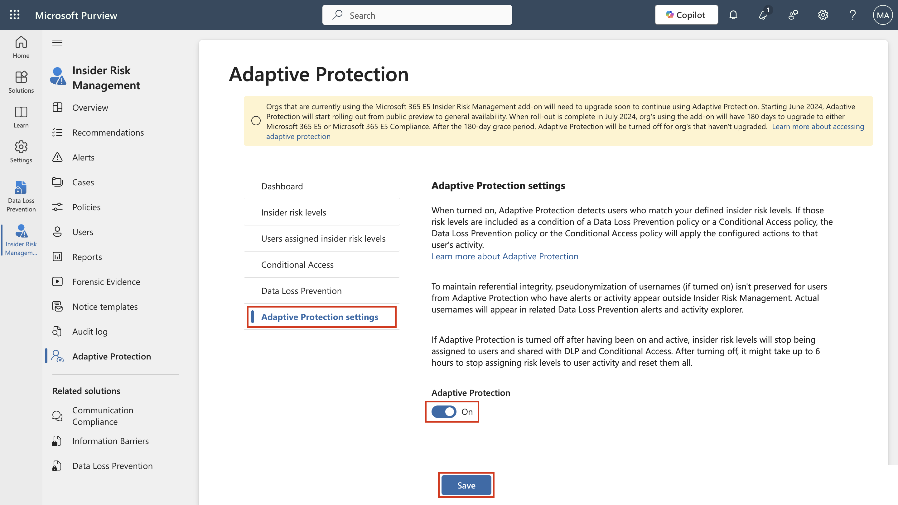

## 实验室 1 – 分配合规性角色并探索 Microsoft Purview 门户

## 客观的:

本实验室中，我们在 Office 365
管理中心创建用户并为他们分配适当的角色、团队和组来代表一个组织 —
Contoso。

我们还向用户分配以下内容:

- 合规性评估试验

稍后，我们将测试**Microsoft 365内置的Office 365消息加密（OME）。**

首先，我们将修改默认模板，以确保在从我们设置的组织的用户接收受 Office
365 消息加密保护的消息时，不会为外部收件人显示任何社交 ID 对话框。

## 然后，我们将创建一个新的自定义 OME 配置，并创建一个传输规则，将 OME 配置应用于从我们的财务部门发送的所有邮件。

练习 1 - 管理合规角色

### 在本次练习中，我们将激活使用 Microsoft Purview实施安全性所需的所有试用许可证。

### 任务 1 — 为现有用户添加管理员角色。

1.  使用实验室提供的帐户详细信息登录 VM。

2.  使用管理用户名和管理密码登录 Microsoft 365 管理中心
    https://admin.microsoft.com。

3.  在左侧窗格中，选择“**User”\>“** **Active
    Users**”，然后单击第一个用户 **Adele Vance**。

4.  在 **manager**下，单击 **edit manager**。

5.  删除当前经理并在搜索框中输入 **Patti**。选择 **Patti
    Fernandez**。单击 **Save Changes**。

计算机屏幕截图 自动生成的描述

6.  将以下所有用户的经理更改为 **Patti Fernandez**。

- Adele Vance

- Christie Cline

- Megan Bowen

7.  对于 Patti Fernandez，添加 **MOD administrator** 作为经理。

### 任务 2 – 添加合规性管理员

1.  选择用户 **Patti Fernandez**，在 **Account** 下，滚动到 **Roles**
    并单击 **Manage roles**。

自动生成的计算机 Description 的屏幕截图

2.  打开 **Roles** 窗格后，选中 **Admin center access**
    附近的单选按钮，然后展开 **Show all by category。**

自动生成的计算机 Description 的屏幕截图

3.  滚动到Security & compliance，勾选Compliance
    Administrator**旁边的框**，然后点击**Save changes**。

自动生成的计算机 Description 的屏幕截图

4.  关闭窗格，保持在同一页面上，然后继续执行下一个任务。

### 任务 3 - 在 Microsoft 管理中心创建团队和组

1.  现在展开**Teams & groups**，选择**Active teams & groups**，**Teams &
    Microsoft 365 groups**下的**Add a Microsoft 365 group**。

自动生成的计算机 Description 的屏幕截图

2.  对于名称，请使用 `Contoso Finance ``Team`，对于说明，请使用
    `This team handled finance。`，然后单击 **Next**。

自动生成的计算机 Description 的屏幕截图

3.  在 **Assign Owners** 页面上，点击 **Assign owners**，勾选 **Adele
    Vance** 旁边的框，然后点击 **Add（1）。**单击 **Next** 。

4.  在 **Add members** 页面上，将 **Adele Vance** 和 **Christie Cline**
    添加为成员，然后单击 **Next**。在 **Add members** 页面上，选择
    **Next**。

5.  对于 group email address（组电子邮件地址），请使用 `contosofinance`
    ，然后单击 **Next**。

自动生成的计算机 Description 的屏幕截图

6.  单击 **Create group**。

自动生成的计算机 Description 的屏幕截图

7.  完成后，单击 **Close**。

自动生成的计算机 Description 的屏幕截图

8.  在 **Active teams & groups page上**，选择**Security groups**
    选项卡。选择 **Add a security group。**

自动生成的计算机 Description 的屏幕截图

9.  重复这些步骤以使用以下信息创建另一个组。

- 在 **Set up the basics** 中，在 **Name**
  字段中输入以下内容：EDM_DataUploaders。在 描述 字段中，输入 人员
  他们将上传 EDM 的数据。

- 选择 **Next**。

- 在 **Settings** 页面上，选择 **Next** 。

- 在 **Review and finish adding group** 页面上，查看您的设置并选择
  **Create group**。

- 当显示 **New group created** 页面时，选择 close
  按钮。现在，从列表中选择新创建的 **EDM_DataUploaders** 组。

- 在成员选项卡下，选择**View all and manage owners**，然后添加 **Patti
  Fernandez** 和 **Christie Cline** 。

- 同样，添加 **Patti Fernandez** 和 **Christie Cline** 作为成员。

自动生成的计算机 Description 的屏幕截图

### 任务 4 – 启用合规性评估的试用

1.  使用 **Administration Username** 和 **Administration Password**
    https://purview.microsoft.com 登录到 Purview 门户。

2.  如果显示欢迎窗口，请同意条款并选择 **Get started** 并关闭它。

3.  向下滚动，然后在 Trials and recommendations 下，选择 **View all
    trials and recommendations** 。

4.  在 **Microsoft Purview trials and recommendations**页上，转到
    **Compliance assessments**，在 **Purview and Priva
    trials**下，然后选择 **Try now**。

自动生成的计算机 Description 的屏幕截图

5.  单击 **Start Trials**。

注意：更改最多可能需要2小时才能生效。再次登录以查看新功能。在此期间，请继续执行后续步骤。

6.  从导航栏中，选择 **Solutions** \> **Audit**。

自动生成的计算机 Description 的屏幕截图

7.  在 **Audit** 页面上，选择 **Start recording user and admin
    activity** 以激活审核日志记录。

自动生成的搜索引擎描述的屏幕截图

## 练习 2 - 管理 Office 365 邮件加密

**Patti Fernandez Microsoft 365 built-in Office 365 Message Encryption
(OME)。**为此，他将修改默认模板并创建一个新的品牌模板，该模板将分配给其中一个试点用户。然后，试点用户将使用其帐户测试
OME 功能。

### 任务 1 - 验证 Azure RMS 功能

在此任务中，您将安装 **Exchange Online PowerShell** 模块并验证租户的正确
Azure RMS 功能。

1.  通过使用鼠标右键选择 Windows 按钮打开 **elevated
    PowerShell**窗口，然后**以管理员身份运行 Windows PowerShell**。

自动生成的计算机 Description 的屏幕截图

2.  确认 **User Account Control** 窗口**Yes。**

3.  输入以下 cmdlet 以安装最新的 Exchange Online PowerShell 模块版本:

`Install-Module ``ExchangeOnlineManagement`

自动生成文本的计算机屏幕 Description

4.  确认 **NuGet** 提供程序安全对话框，其中 **Y** 表示“是”，然后按
    **Enter**。此过程可能需要几秒钟才能完成。

自动生成带有白色文本 Description 的计算机屏幕

5.  确认Untrusted repository security 对话框，输入 **Y**
    表示“是”，然后按 **Enter**。此过程可能需要几秒钟才能完成。

自动生成带有白色文本 Description 的计算机屏幕

6.  输入以下 cmdlet 以更改执行策略，然后按 **Enter 键**

`Set-``ExecutionPolicy`` -``ExecutionPolicy`` ``RemoteSigned`` -Scope ``CurrentUser`

BrokenImage

7.  使用 **Y** 确认 Execution Policy Change，为 Yes，然后按 **Enter**。

BrokenImage

8.  输入以下 cmdlet 以使用 **Exchange Online PowerShell**
    模块并连接到您的租户:

`连接``-ExchangeOnline`

BrokenImage

9.  当显示**Sign in**窗口时，使用用户名
    PattiF@{TENANTPREFIX}.onmicrosoft.com 和资源选项卡上提供的用户密码以
    **Patti Fernandez**` ``身份登录`` ` 。（将 {TENANTPREFIX}
    替换为资源选项卡上提供的租户前缀）

10. 使用以下 cmdlet 验证是否已在租户中激活 Azure RMS 和 IRM，然后按
    **Enter**:

`Get-``IRMConfiguration`` | ``fl`` ``AzureRMSLicensingEnabled`

11. 当 **AzureRMSLicensingEnabled** 结果为 **True** 时，将为租户激活
    Azure RMS。继续执行下一步。

BrokenImage

12. 使用以下 cmdlet（将 {TENANTPREFIX}
    替换为资源选项卡上提供的租户前缀），针对演示试点用户 **Adele Vance**
    测试用于 Office 365 消息加密的 Azure RMS 模板

`Test-``IRMConfiguration`` -Sender ``adelev``@{TENANTPREFIX``}.onmicrosoft.com`` -Recipient ``adelev``@{TENANTPREFIX``}.onmicrosoft.com`

13. 验证所有测试都处于 PASS 状态，并且未显示任何错误。

截图

14. 使 **PowerShell** 窗口保持打开状态。

你已成功安装 Exchange Online PowerShell 模块，连接到租户，并验证了 Azure
RMS 的正确功能。

### 任务 2 – 修改默认 OME 模板

接下来，您的组织中需要限制对外部身份提供商（如 Google 或
Facebook）的信任。由于这些社交 ID 默认处于激活状态，用于访问受 OME
保护的邮件，因此您需要为组织中的所有用户停用社交 ID。

1.  运行以下 cmdlet 以查看默认 OME 配置:

`Get-``OMEConfiguration`` -Identity "OME Configuration" |``fl`

自动生成的计算机描述的屏幕截图

2.  查看设置并确认 **SocialIdSignIn** 参数设置为 **True**。

BrokenImage

3.  运行以下 cmdlet 以限制使用社交 ID 访问来自受 OME 保护的租户的消息:

`Set-``OMEConfiguration`` -Identity "OME Configuration" -``SocialIdSignIn``:$``false`

自动生成文本的计算机屏幕 Description

4.  使用 **Y** 确认自定义默认模板的警告消息，然后单击 Enter。

BrokenImage

5.  再次检查默认配置并验证， **SocialIdSignIn** 参数现在设置为
    **False**。

`Get-``OMEConfiguration`` -Identity "OME Configuration" |``fl`

6.  请注意，结果应显示 **SocialIDSignIn** 设置为 **False**。

BrokenImage

7.  让 **PowerShell** 窗口 保持打开状态，然后继续进行下一个练习。

您已成功在 Office 365 邮件加密中停用外部身份提供程序（如 Google 和
Facebook）的使用。

### 任务 3 – 测试修改后的 OME 模板

您必须确认，当您的租户用户收到受 Office 365
邮件加密保护的邮件时，没有向外部收件人显示社交 ID
对话框，并且他们需要随时使用 OTP 访问加密内容。

1.  在 **Microsoft Edge** 中，打开一个 **New InPrivate 窗口**并导航到
    `https://outlook.office.com ``并使用用户名`` `AdeleV@{TENANTPREFIX}.onmicrosoft.com` ``和资源选项卡上提供的用户密码`登录
    Outlook 网页版。

2.  在 **Stay signed in?** 对话框中，选中 **Don’t show this again**
    复选框，然后选择 **No**。

3.  在 **Save password** 对话框中选择 **Save**
    ，以将试点用户密码保存在浏览器中。

4.  如果 **Translate page from…**窗口，选择向下箭头并选择 **Never
    translate from...**。

5.  选择 **New mail** 从 Outlook 网页版的左上角。

自动生成图形用户界面、文本、应用程序、Word 描述

6.  在**To**行中，输入不在租户域中的个人或其他第三方电子邮件地址。在主题行中输入
    `Secret Message `和 `My super-secret message。` 到身体。

自动生成图形用户界面、文本、应用程序、Word 描述

7.  从顶部窗格中转到 **Options** 窗格，选择 **Encrypt**
    以加密消息。如果找不到该选项，请选择 **3 dots （...）**
    ，然后从下拉列表中选择 **Encrypt**。

自动生成的计算机 Description 的屏幕截图

8.  成功加密邮件后，您应该会看到一条通知，上面写着**“Encrypt: This
    message is encrypted. Recipients can’t remove encryption.”。**

自动生成的计算机屏幕描述的屏幕截图

9.  选择 **Send** 以发送消息。

自动生成图形用户界面、文本、电子邮件描述

**注意**：在试用帐户中，您可能有权也可能没有发送任何电子邮件的权限，并且您的邮件可能无法从当前租户到达收件人。但是您的电子邮件通过，您可以查看以下步骤来测试模板。

10. 登录您的个人电子邮件帐户并打开来自 Adele Vance
    的消息。如果您将此电子邮件发送到 Microsoft 帐户（如
    @outlook.com），则系统可能会自动处理加密，并且您会自动看到该消息。

**注意**：如果您将电子邮件发送到其他电子邮件服务（如
（@gmail.com），则可能需要执行后续步骤来处理加密并阅读邮件。您可能需要检查垃圾邮件文件夹中是否有该邮件。

11. 选择 **Read the message** 。

12. 如果没有激活社交 ID，就没有按钮来验证您的 Google 帐户。

13. 选择 **Sign in with a One-time passcode** 以接收限时密码。

14. 转到您的个人电子邮件门户，打开主题为 **Your one-time passcode to
    view the message**。

15. 复制密码，将其粘贴到 OME 门户，然后选择 **Continue**。

16. 查看加密邮件。

您已成功使用已停用的社交 ID 测试了修改后的默认 OME 模板。

### 任务 4 – 创建自定义品牌模板

您的组织财务部门发送的受保护邮件需要特殊品牌，包括自定义的简介和正文文本以及页脚中的Disclaimer链接。财务消息也将在7天后过期。在此任务中，您将创建一个新的自定义OME配置，并创建一个传输规则，以将OME配置应用于从财务部门发送的所有邮件。

1.  在我们保持打开状态的 PowerShell 窗口中，连接了 Exchange
    Online。运行以下 cmdlet 以创建新的 OME 配置:

`New-``OMEConfiguration`` -Identity "Finance Department" -``ExternalMailExpiryInDays`` 7`

自动生成文本描述

2.  使用 **Y** 确认自定义模板的警告消息 ，表示 Yes，然后按 **Enter**。

自动生成文本描述

3.  使用以下 cmdlet 更改简介文本消息

`Set-``OMEConfiguration`` -Identity "Finance Department" -``IntroductionText`` "from Contoso Ltd. finance department has sent you a secure message."`

BrokenImage

4.  使用 **Y** 确认自定义模板的警告消息 ，表示 Yes，然后按 **Enter**。

BrokenImage

5.  使用以下 cmdlet 更改邮件的正文电子邮件文本

`Set-``OMEConfiguration`` -Identity "Finance Department" -``EmailText`` "Encrypted message sent from Contoso Ltd. finance department. Handle the content responsibly."`

6.  使用 **Y** 确认自定义模板的警告消息 ，表示 Yes，然后按 **Enter**。

自动生成文本描述

7.  将免责声明 URL 更改为指向 Contoso 的隐私声明网站

`Set-``OMEConfiguration`` -Identity "Finance Department" -``PrivacyStatementURL`` "https://contoso.com/privacystatement.html"`

自动生成文本描述

8.  使用 **Y** 确认自定义模板的警告消息 ，表示 Yes，然后按 **Enter**。

BrokenImage

9.  使用以下 cmdlet 创建邮件流规则，该规则将自定义 OME 模板应用于从
    Contoso 财务团队发送的所有邮件。此过程可能需要几秒钟才能完成。

`New-``TransportRule`` -Name "Encrypt all mails from Contoso Finance team" -``FromScope`` ``InOrganization`` -``FromMemberOf`` "Contoso Finance Team" -``ApplyRightsProtectionCustomizationTemplate`` "Finance Department" -``ApplyRightsProtectionTemplate`` Encrypt`

BrokenImage

自动生成文本描述

10. 键入以下 cmdlet 以验证更改。

`Get-``OMEConfiguration`` -Identity "Finance Department" | Format-List`

BrokenImage

11. 使 **PowerShell** 保持打开状态。

您已成功创建一个新的传输规则，当财务部门的成员向外部收件人发送邮件时，该规则会自动应用自定义
OME 模板。

### 任务 5 – 测试自定义品牌模板

要验证新的自定义 OME 配置，您需要使用财务团队成员 Christie Cline
的帐户。在试用帐户中，您将无权发送任何电子邮件，但可以查看以下步骤，了解如何在拥有自己的许可证时测试模板。您可以执行步骤
1 - 4，但您的邮件可能无法从当前试用租户到达收件人。

1.  在 **Microsoft Edge** 中，**New InPrivate Window** 并导航到
    `https://outlook.office.com ``并使用用户名`` `ChristieC@{TENANTPREFIX}.onmicrosoft.com` ``和资源选项卡上给出的用户密码`登录
    Outlook 网页版。

自动生成图形用户界面、文本、应用程序描述

2.  选择 **New message** 从 Outlook 网页版的左上角。

3.  在 **To**
    行中，输入不在租户域中的个人或其他第三方电子邮件地址。在主题行输入
    `Finance ``Report`，然后输入 `Secret finance information``。`
    到身体。

4.  选择 **Send** 以发送消息。

5.  登录您在上面使用的电子邮件帐户，然后打开来自 Christie Cline 的消息。

6.  您应该会看到来自 **Christie Cline** 的消息，如下图所示。选择 **Read
    the message**。

BrokenImage

7.  如果要阅读该消息，请执行以下步骤。

    1.  单击 **Read the message**。选择 **Sign in with a One-time
        passcode** 以接收限时密码。

&nbsp;

1.  转到您的个人电子邮件门户，打开主题为 **Your one-time passcode to
    view the message**。

2.  复制密码，将其粘贴到 OME 门户，然后选择 **Continue**。

3.  查看带有自定义品牌的加密邮件。

您已成功测试新的自定义 OME 模板。

## 练习 3 – 启用自适应保护

1.  在 Microsoft Edge 中，导航到 `https://purview.microsoft.com` **并以
    MOD Administrator** 身份登录 perview 门户。

2.  从左侧导航窗格中，选择 **Solutioons** \> **Insider Risk Management**
    \> **Adaptive Protection**。然后选择 **Dashboard** 。选择 **Quick
    setup**。

3.  它将显示一条消息，指出我们正在进行设置。启用它需要 72
    小时。我们将在第 8 个实验中使用它来探索自适应保护功能。

BrokenImage

4.  选择 **Adaptive Protection settings** 选项卡，然后打开 **Adaptive
    Protection** 切换按钮。选择 **Save** 。

BrokenImage

## 总结：

在此实验室中，我们成功地在管理中心复制了一个组织，分配了适当的许可证，并学习了如何使用
Microsoft 365 内置的 Office 365 消息加密 （OME）。
