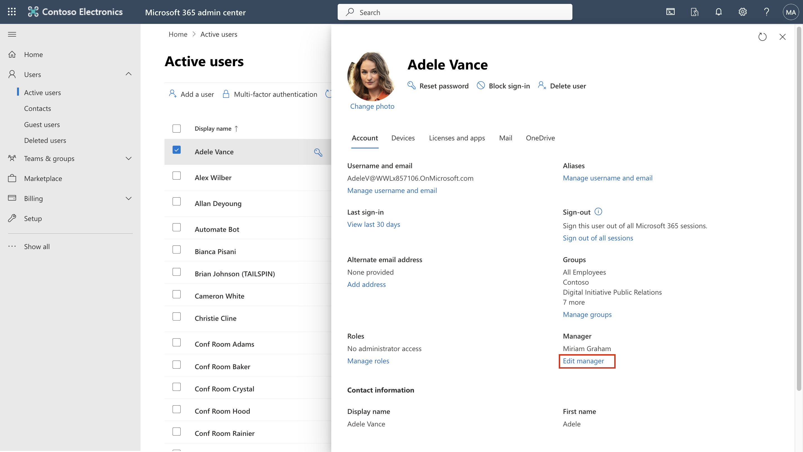
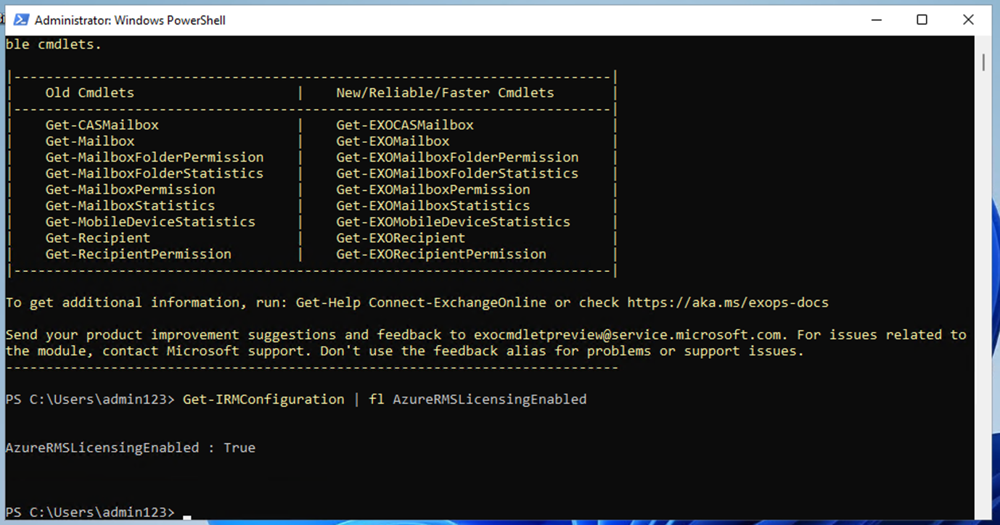
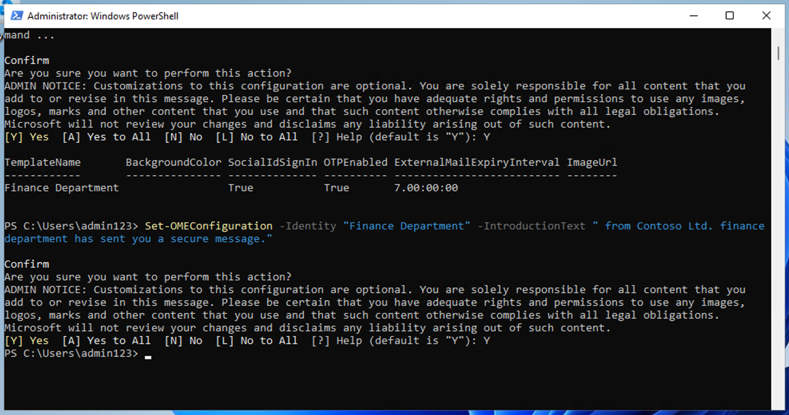

# 실습 1 – 규정 준수 역할을 할당하고 Microsoft Purview 포털을 탐색하기

## 목표:

이 실습에서는 사용자를 생성하고 Office 365 관리 센터에서 조직 –
Contoso를 나타내는 적절한 역할, 팀 및 그룹을 할당할 것입니다.

사용자에세 다은 사항도 할당할 것입니다:

- 규정 준수 평가를 위한 평가판

나중에, **Microsoft 365 built-in Office 365 Message Encryption (OME)**
테스트할 것입니다.

먼저, 설정한 조직의 사용자로부터 Office 365 로 보호된 메시지를 받을 때
외부 수신자에 대해 소설 ID 대화 상자가 표시되지 않도록 기본 템플릿을
수정할 것입니다.

다음 새 사용자 지정 OME 구성을 생성하고 재무 부서에서 보낸 모든 메일에
OME 구성을 적용하는 전송 규칙을 생성할 것입니다.

## 연습 1 – 규정 준수 역할을 관리하기

이 연습에서는Microsoft Purview를 사용하여 보안을 구현하는 데 필요한 모든
평가판 라이선스를 활성화할 것입니다.

### 작업 1 – 기존 사용자에서 관리자 역할을 추가하기

1.  실습과 함께 제공괸 계정 세부 정보를 사용하여 VM에 로그인하세요.

2.  관리 사용자 이름 및 관리 암호를
    사용하여` Microsoft 365 ``관리`` ``센터`` `https://admin.microsoft.com
    로그인하세요.

&nbsp;

1.  왼쪽 창에서 **Users** \> **Active users** 선택하여 첫 번째 사용자
    **Adele Vance**를 클릭하세요.

4.  **Manager**에서 **Edit manager** 클릭하세요.

5.  현재 관리자를 제거하고 검색 상자에 **Patti**를 입력하세요. **Patti
    Fernandez**를 선택하세요. **Save Changes**를 클릭하세요.

컴퓨터 설명의 스크린샷 자동으로 생성됩니다

6.  다음 모든 사용자에 대해 관리자를 **Patti Fernandez**로 변경하세요.

- Adele Vance

- Christie Cline

- Megan Bowen

7.  Patti Fernandez의 경우 **MOD Administrator**를 관리자로 추가하세요.

### 작업 2 – Compliance Administrator 추가하기

1.  사용자 **Patti Fernandez**를 선택하여 **Account**아래에서
    **Roles**로 스크롤하고**Manage roles**를 클릭하세요.

컴퓨터 설명의 스크린샷 자동으로 생성됩니다

2.  **Roles** 창이 열리면 **Admin center access**의 라디오 버튼을
    확인하고 **Show all by category**를 확장하세요**.**

컴퓨터 설명의 스크린샷 자동으로 생성됩니다

3.  **Security & compliance**로 스크롤하고 **Compliance Administrator**
    옆의 확인란을 선택하여**Save changes**를 클릭하세요.

컴퓨터 설명의 스크린샷 자동으로 생성됩니다

4.  창을 닫고 동일한 페이지를 유지한 후 다음 작업을 계속하세요.

### 작업 3 – Microsoft 관리 센터에서 팀 및 그룹을 생성하기

1.  **Teams & groups**를 확장하고 **Active teams & groups**를
    선택하고**Teams & Microsoft 365 groups**아래에서**Add a Microsoft
    365 group**를 클릭하세요.

컴퓨터 설명의 스크린샷 자동으로 생성됩니다

2.  이름에는`Contoso Finance Team``을`` ``사용하여`` ``설명에는`` ``This team handles finance.`` ``사용하고`**Next**를
    클릭하세요.

컴퓨터 설명의 스크린샷 자동으로 생성됩니다

3.  **Assign Owners** 페이지에서 **Assign owners**를 클락하고**Adele
    Vance**옆의 확인란을 확인하고 **Add(1)**을 클릭하세요. **Next**를
    클릭하세요.

4.  **Add members** 페이지에서**Adele Vance**를 추가하고 **Christie
    Cline**를 구성원으로 추가하고**Next**을 클릭하세요. **Add members**
    페이지에서 **Next**을 선택하세요.

5.  그룹 이메일 주소의 경우`contosofinance` 를 사용하여**Next**를
    클릭하세요.

컴퓨터 설명의 스크린샷 자동으로 생성됩니다

6.  **Create group**를 클릭하세요.

컴퓨터 설명의 스크린샷 자동으로 생성됩니다

7.  완료되면 **Close**를 클릭하세요.

컴퓨터 설명의 스크린샷 자동으로 생성됩니다

8.  **Active teams & groups page**에서 **Security groups** 탭을
    선택하세요. **Add a security group**를 선택하세요**.**

컴퓨터 설명의 스크린샷 자동으로 생성됩니다

9.  다음 정보를 사용하여 다른 그룹을 생성하려면 단계를 반복하세요.

- **Set up the basics**에서 Name 필드에 다음을 입력하세요:
  `EDM_DataUploaders`. 설명 필드에서
  `People who will upload data for EDM``를`` ``입력하세요`.

- **Next**를 선택하세요.

- **Settings** 페이지에서 **Next**를 선택하세요.

- **Review and finish adding group** 페이지에서 설정을 평가하고**Create
  group**를 선택하세요.

- **New group created** 페이지가 표시되면 닫기 버튼을 선택하세요. 이제
  목록에서 새로 생성된**EDM_DataUploaders** 그룹을 선택하세요.

- 구성원 탭에서**View all and manage owners**를 선택하고 **Patti
  Fernandez** 및 **Christie Cline**를 추가하세요.

- 마찬가지로**Patti Fernandez** 및 **Christie Cline** 을 멤버로
  추가하세요.

컴퓨터 설명의 스크린샷 자동으로 생성됩니다

### 작업 4 – 규정 준수 평가를 위한 시험을 활성화하기

1.  **Administrative Username** 및 **Administrative Password**를
    사용하여Purview Portal <https://purview.microsoft.com> 로그인하세요.

2.  시작 창이 표시되면 약관에 동의하고 **Get started을** 선택한 후
    닫으세요.

3.  아래로 스크롤하여 Trials and recommendations에서 **View all trials
    and recommendations**를 선택하세요.

4.  **Microsoft Purview trials and recommendations** 페이지에서
    **Purview and Priva trials** 아래의 **Compliance assessments**로
    이동하여**Try now**를 선택하세요.

컴퓨터 설명의 스크린샷 자동으로 생성됩니다

5.  **Start Trials**를 클릭하세요.

참고: 변경사항이 적용되려면 최대 2시간이 걸릴 수 있습니다. 다시
로그인하여 새로운 기능을 확인하세요. 그 동안 다음 단계를 계속합니다.

6.  탐색 바에서**Solutions** \> **Audit**를 선택하세요.

컴퓨터 설명의 스크린샷 자동으로 생성됩니다

7.  **Audit** 페이지에서 **Start recording user and admin activity** 을
    선택하여 감시 로깅을 활성화하세요.

검색 엔진 설명의 스크린샷 자동으로 생성됩니다

## 연습 2 - Office 365 Message Encryption 관리하기

**Patti Fernandez**가 파일럿 팀과 함께 구성하고 테스트해야 하는 첫번째
설정은**Microsoft 365 built-in** **Office 365 Message Encryption
(OME)**입니다. 이를 위해 기본 템플릿을 수정하고 파일럿 사용자 중 한
명에게 할당될 새 브랜딩 템플릿을 생성할 것입니다. 다음은 파일럿 사용자는
자신의 계정으로 OME 기능을 테스트할 것입니다.

### 작업 1 – Azure RMS 기능을 확인하기

이 작업에서는**Exchange Online PowerShell** 모듈을 설치하고 테넌트의
올바른Azure RMS 기능을 확인할 것입니다.

1.  마우스 오른쪽 버튼으로 Windows 버터은을 선택하여 관리자 권한 Open an
    **elevated PowerShell** 창을 연 후 관리자 권한으로**Windows
    PowerShell** 을 실행하세요.

컴퓨터 설명의 스크린샷 자동으로 생성됩니다

2.  **Yes**로**User Account Control**창을 확인하세요.

3.  다음 cmdlet을 입력하여 최신 Exchange Online PowerShell 모듈 버전을
    설치하세요:

`Install-Module ``ExchangeOnlineManagement`

텍스트가 있는 컴퓨터 화면 설명이 자동으로 생성됩니다

4.  **Y**를 사용하여 Yes에 대해 **NuGet** 공급자 보안 대화 상자를
    확인하고 **Enter** 키를 누르세요. 이 프로세스를 완료하는 데 몇 초
    정도 걸릴 수 있습니다.

흰색 텍스트 Description이 자동으로 생성된 컴퓨터 화면

5.  신뢰할 수 없는 리포지토리 보안 대화 상자에서 **Y**를 Yes로 확인하고
    **Enter** 키를 누르세요. 이 프로세스를 완료하는 데 몇 초 정도 걸릴
    수 있습니다.

흰색 텍스트 Description이 자동으로 생성된 컴퓨터 화면

6.  다음 cmdlet을 입력하여 실행 정책을 변경하고 **Enter** 키를 누르세요

`Set-``ExecutionPolicy`` -``ExecutionPolicy`` ``RemoteSigned`` -Scope ``CurrentUser`

7.  Yes에 대해 **Y**로 실행 정책 변경을 확인하고 **Enter** 키를
    누르세요.

8.  다음 cmdlet을 입력하여 **Exchange Online PowerShell** 모듈을
    사용하고 테넌트에 연결하세요:

`Connect-``ExchangeOnline`

9.  **Sign in** 창이 표시되면사용자 이름
    `PattiF``@{TENANTPREFIX}.onmicrosoft.com` 와 리소스 탭에 지정된
    사용자 암호를 사용하여**Patti Fernandez**로 로그인하세요.
    ({TENANTPREFIX}를 리소스 탭에 지정된 테넌트 접두시로 바꾸세요)

10. 다음 cmdlet을 사용하여 테넌트에서 Azure RMS 및 IRM이 활성화되어
    있는지 확인하고 **Enter** 키를 누르세요:

`Get-``IRMConfiguration`` | ``fl`` ``AzureRMSLicensingEnabled`

11. **AzureRMSLicensingEnabled** 결과가 **True**이면 테넌트에 대해 Azure
    RMS가 활성화됩니다. 다음 단계를 계속하세요.

BrokenImage

12. 다음 cmdlet을 사용하여 데모 파일럿 사용자인 **Adele Vance**에 대해
    Office 365 Message Encryption에 사용되는 Azure RMS 템플릿을
    테스트하세요 ({TENANTPREFIX}를 리소스 탭에 지정된 테넌트 접두사로
    바꾸세요).

`Test-``IRMConfiguration`` -Sender ``adelev``@{TENANTPREFIX``}.onmicrosoft.com`` -Recipient ``adelev``@{TENANTPREFIX``}.onmicrosoft.com`

13. 모든 테스트가 PASS 상태이고 오류가 표시되지 않는지 확인하세요.

Screenshot

14. **PowerShell** 창을 열어 두세요 .

Exchange Online PowerShell 모듈을 성공적으로 설치하고 테넌트에 연결하고
Azure RMS의 올바른 기능을 확인했습니다.

### 작업 2 – 기본 OME 템플릿을 수정하기

다음으로, 조직에서 Google 또는 Facebook과 같은 외국 ID 공급자에 대한
신뢰를 제한해야 하는 요구 사항이 있습니다. 이러한 소셜 ID는 OME로 보호된
메시지에 액세스하기 위해 기본적으로 활성화되므로 조직의 모든 사용자에
대해 소셜 ID 사용을 비활성화해야 합니다.

1.  다음 cmdlet을 실행하여 기본 OME 구성을 확인하세요:

`Get-``OMEConfiguration`` -Identity "OME Configuration" |``fl`

컴퓨터 설명의 스크린샷이 자동으로 생성됩니다

2.  설정을 검토하고 **SocialIdSignIn** 매개 변수가 **True**로 설정되어
    있는지 확인하세요 .

3.  다음 cmdlet을 실행하여 OME로 보호된 테넌트의 메시지에 액세스하기
    위해 소셜 ID의 사용을 제한합니다:

`Set-``OMEConfiguration`` -Identity "OME Configuration" -``SocialIdSignIn``:$``false`

텍스트가 있는 컴퓨터 화면 설명이 자동으로 생성됩니다

4.  기본 템플릿을 사용자 지정하기 위한 경고 메시지를 **Y**를 Yes로
    확인하고 Enter 키를 누르세요.

5.  기본 구성을 다시 확인하고 **SocialIdSignIn** 매개 변수가 이제
    **False**로 설정되었는지 확인하세요.

`Get-``OMEConfiguration`` -Identity "OME Configuration" |``fl`

6.  결과에 **SocialIDSignIn**이 **False**로 설정되어 있는 것으로
    표시되어야 합니다.

7.  **PowerShell** 창을 열어 두고 다음 연습으로 진행하세요 .

Office 365 Message Encryption에서 Google 및 Facebook과 같은 외국 ID
공급자의 사용을 성공적으로 비활성화했습니다.

### 작업 3 – 수정된 OME 템플릿을 테스트하기

테넌트 사용자로부터 Office 365 Message Encryption로 보호된 메시지를 받을
때 외부 수신자에 대한 소셜 ID 대화 상자가 표시되지 않는지 확인해야 하며
암호화된 콘텐츠에 액세스할 때 언제든지 OTP를 사용해야 합니다.

1.  **Microsoft Edge**에서 **New InPrivate Window** 를
    열고`https://outlook.office.com` 로 이도하여 사용자
    이름`AdeleV@{TENANTPREFIX}.onmicrosoft.com` 및 리소스 탭에 지정된
    사용자 암호를 웹용 Outlook 로그인하세요.

2.  **Stay signed in?** 대화 상자에서 **Don’t show this again** 확인란릏
    선택한 후**No**를 선택하세여.

3.  파일럿 사용자 암호를 브라우저에 저장하기 위해 **Save password** 대화
    상자에서**Save** 선택하세요.

4.  **Translate page from…** 창이 표시되면 아래쪽 화살표를
    선택하고**Never translate from…**를 선택하세요.

5.  웹용 Outlook의 왼쪽 위에서 **New mail**을 선택하세요.

그래픽 사용자 인터페이스, 텍스트, 애플리케이션, Word 설명이 자동으로
생성됩니다.

6.  **To**줄에 테넌트 도메인에 없는 개인 또는 기타 타사 이메일 주소를
    입력하세요. 제목줄에
    `Secret Message``를`` ``입력하고``My super-secret message.` 를
    입력하세요.

그래픽 사용자 인터페이스, 텍스트, 애플리케이션, Word 설명이 자동으로
생성됩니다.

7.  왼쪽 창에서**Options** 창으로 이동하고**Encrypt** 를 선택하여
    메시지를 암호화하세요. 옵션을 찾을 수 없으면 오른쪽 상단에서 있는**3
    dots (…)** 를 선택한 후 드롭다운에서 **Encrypt**를 선택하세요.

컴퓨터 설명의 스크린샷 자동으로 생성됩니다

8.  메시지를 성공적을 암호화하면 다음이 표시합니다.

> “**Encrypt: This message is encrypted. Recipients can’t remove
> encryption.**”

컴퓨터 화면의 스크린샷 설명이 자동으로 생성됩니다

9.  **Send** 를 선택하고 메시지를 보내세요.

그래픽 사용자 인터페이스, 텍스트, 이메일 설명이 자동으로 생성됩니다

**참고**: 평가판 계정에는 이메일을 보낼 수 있는 권한이 있을 수도 있고
없을 수도 있으며 메일이 현재 테넌트의 수신자에게 도달하지 못할 수
있습니다. 그러나 이메일이 통과하면 다음 단계를 확인하여 템플릿을
테스트할 수 있습니다.

10. 개인 이메일 계정에 로그인하고 Adele Vance가 보낸 메시지를 여세요. 이
    이메일을 Microsoft 계정(예: @outlook.com)으로 보낸 경우 암호화가
    자동으로 처리될 수 있으며 메시지가 자동으로 표시됩니다.

**참고**: (@gmail.com)와 같은 다른 이메일 서비스로 이메일을 보낸 경우
암호화를 처리하고 메시지를 읽기 위해 다음 단계를 수행해야 할 수
있습니다. 정크 또는 스팸 폴더에서 메시지를 확인해야 할 수도 있습니다.

11. **Read the message**를 선택하세요.

12. 소셜 ID를 활성화하지 않으면 Google 계정으로 인증할 수 있는 버튼이
    없습니다.

13. 제한된 시간 암호를 받기 위해 **Sign in with a One-time passcode**를
    선택하세요.

14. 제한된 시간 암호를 받기 위해**Your one-time passcode to view the
    message**를 선택하세요.

15. 암호를 복사하여 OME 포털에 붙여넣고 **Continue**을 선택하세요.

16. 암호화된 메시지를 검토하세요.

비활성화된 소셜 ID를 사용하여 수정된 기본 OME 템플릿을 성공적으로
테스트했습니다..

### 작업 4 – 맞춤형 브랜딩 템플릿을 생성하기

조직의 재무 부서에서 보낸 보호된 메시지에는 사용자 지정된 소개 및 본문
텍스트와 바닥글의 고지 사항 링크를 포함한 특별한 브랜딩이 필요합니다.
재무 메시지도 7일 후에 만료됩니다. 이 작업에서는 새 사용자 지정 OME
구성을 생성하고 재무 부서에서 보낸 모든 메일에 OME 구성을 적용하는 전송
규칙을 생성합니다.

1.  Exchange Online이 연결된 상태로 열어 둔 PowerShell 창에서. 다음
    cmdlet을 실행하여 새 OME 구성을 생성하세요:

`New-``OMEConfiguration`` -Identity "Finance Department" -``ExternalMailExpiryInDays`` 7`

텍스트 설명이 자동으로 생성됩니다

2.  템플릿을 사용자 지정하기 위한 경고 메시지를Yes를**Y**로
    확인하고**Enter**를 입력하세요.

텍스트 설명이 자동으로 생성됩니다

3.  다음 cmdlet을 사용하여 소개 텍스트 메시지를 변경하세요.

`Set-``OMEConfiguration`` -Identity "Finance Department" -``IntroductionText`` "from Contoso Ltd. finance department has sent you a secure message."`

4.  템플릿을 사용자 지정하기 위한 경고 메시지를 Yes에 대한 **Y**로
    확인하고 **Enter** 키를 누르세요.

5.  다음 cmdlet을 사용하여 메시지의 본문 전자 메일 텍스트를 변경하세요

`Set-``OMEConfiguration`` -Identity "Finance Department" -``EmailText`` "Encrypted message sent from Contoso Ltd. finance department. Handle the content responsibly."`

6.  템플릿을 사용자 지정하기 위한 경고 메시지를 Yes에 대한 **Y**로
    확인하고 **Enter** 키를 누르세요.

텍스트 설명이 자동으로 생성됩니다

7.  고지 사항 URL이 Contoso의 개인 정보 취급 방침 사이트를 가리키도록
    변경하세요.

`Set-``OMEConfiguration`` -Identity "Finance Department" -``PrivacyStatementURL`` "https://contoso.com/privacystatement.html"`

텍스트 설명이 자동으로 생성됩니다

8.  템플릿을 사용자 지정하기 위한 경고 메시지를 Yes에 대한 **Y**로
    확인하고 **Enter** 키를 누르세요.

9.  다음 cmdlet을 사용하여 Contoso 재무 팀에서 보낸 모든 메시지에 사용자
    지정 OME 템플릿을 적용하는 메일 흐름 규칙을 생성합니다. 이
    프로세스를 완료하는 데 몇 초 정도 걸릴 수 있습니다.

`New-``TransportRule`` -Name "Encrypt all mails from Contoso Finance team" -``FromScope`` ``InOrganization`` -``FromMemberOf`` "Contoso Finance Team" -``ApplyRightsProtectionCustomizationTemplate`` "Finance Department" -``ApplyRightsProtectionTemplate`` Encrypt`

텍스트 설명이 자동으로 생성됩니다

10. 다음 cmdlet을 입력하여 변경 내용을 확인하세요.

`Get-``OMEConfiguration`` -Identity "Finance Department" | Format-List`

11. **PowerShell**을 열어 두세요.

재무 부서의 구성원이 외부 받는 사람에게 메시지를 보낼 때 사용자 지정 OME
템플릿을 자동으로 적용하는 새 전송 규칙을 성공적으로 생성핬습니다.

### 작업 5 – 사용자 지정 브랜딩 템플릿을 테스트하기

새 사용자 지정 OME 구성의 유효성을 검사하려면 재무 팀의 구성원인
Christie Cline의 계정을 사용해야 합니다. 평가판 계정에는 이메일을 보낼
수 있는 권한이 없지만 다음 단계를 확인하여 자체 라이선스가 있는 경우
템플릿을 테스트하는 방법을 이해할 수 있습니다. 1-4단계를 수행할 수
있지만 메일이 현재 평가판 테넌트에서 수신자에게 도달하지 못할 수
있습니다.

1.  **Microsoft Edge**에서 **New InPrivate Window** 를
    열고`https://outlook.office.com` 로 이동하여 사용자
    이름`ChristieC``@{TENANTPREFIX}.onmicrosoft.com` 및 리소스 암호를
    사용하여 웹용 Outlook로그인하세요.

그래픽 사용자 인터페이스, 텍스트, 애플리케이션 설명이 자동으로
생성됩니다

2.  웹용 Outlook의 왼쪽 위에서**New message** 를 선택하세요.

3.  **To**줄에 테넌트 도메인에 없는 개인 또는 기타 타사 이메일 주소를
    입력하세요. 제목줄에 `Finance Report` 를
    입력하고`Secret finance information.`를 입력하세요.

4.  메시지를 선택하여**Send** 를 보내세요.

5.  위에서 사용한 이메일 계정으로 로그인하고 Christie Cline이 보낸
    메시지를 여세요.

6.  아ㄹ 이미지와 같은**Christie Cline**의 메시지가 표시되어야 합니다.
    **Read the message**를 선택하세요.

7.  메시지를 읽으려면 다음 단계를 수행하세요.

    1.  **Read the message**를 클릭하세요. 제한된 시간 암호를 받기
        위해**Sign in with a One-time passcode**를 선택하세요.

    2.  개인 이메일 포털로 이동하여**Your one-time passcode to view the
        message**인 제목을 여세요.

    3.  암호를 복사하여 OME 포털에 붙여넣고 **Continue을** 선택하세요.

    4.  사용자 지정 브랜딩을 사용하여 암호화된 메시지 검토하세요.

새 사용자 지정 OME 템플릿을 성공적으로 테스트했습니다..

## 연습 3 – Adaptive Protection 활성화하기

1.  Microsoft Edge에서 `https://purview.microsoft.com` 로
    이동하여purview portal에**MOD Administrator**로 로그인하세요.

2.  왼쪽 탐색 창에서**Solutioons** \> **Insider risk management** \>
    **Adaptive Protection**를 선택하세요. **Dashboard**를 선택하세요.
    **Quick setup**를 선택하세요.

3.  It 우리가 설정하고 있다는 메시지가 표시됩니다. 활성화하는 데
    72시간이 걸립니다. Adaptive Protection기능을 살펴보는 8번째 실습에서
    이를 사용할 것입니다.

4.  **Adaptive Protection settings** 탭을 선택하고**Adaptive
    Protection** 토글 버튼을 켜세요. **Save**를 선택하세요.

## 요약:

이 실습에서는 관리 센터에서 조직을 성공적으로 복제하고 적절한 라이선스를
할당하고 Microsoft 365 내장된 Office 365 Message Encryption (OME)를
사용하는 방법을 배웠습니다.
