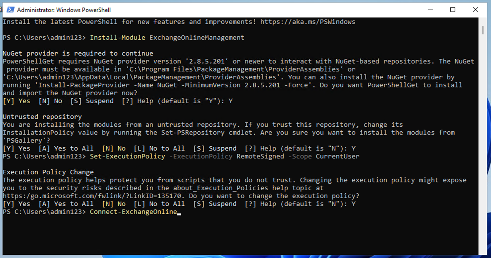

# ラボ 1 – コンプライアンス ・ロールの割り当てと Microsoft Purview ポータルの探索

## 目的:

このラボでは、ユーザーを作成し、Office 365
管理センターで適切な役割、チーム、グループを割り当てて、組織 (Contoso)
を表します。

また、ユーザーに次のものを割り当てます。

- • コンプライアンス評価のためのトライアル

その後、Microsoft 365 に組み込まれている Office 365 Message Encryption
(OME) をテストします。

まず、既定のテンプレートを変更して、設定した組織のユーザーから Office
365
メッセージ暗号化で保護されたメッセージを受信したときに、外部の受信者にソーシャル
ID ダイアログが表示されないようにします。

次に、新しいカスタム OME
構成を作成し、財務部門から送信されるすべてのメールに OME
構成を適用するトランスポート ルールを作成します。

.

## エクササイズ 1 - コンプライアンスの役割の管理

この演習では、Microsoft Purview
を使用してセキュリティを実装するために必要なすべての試用ライセンスをアクティブ化します。

### タスク 1 – 既存のユーザーにマネージャーの役​​割を追加します。

1.  1\. ラボで提供されたアカウントの詳細を使用して VM にログインします。

2.  2\. 管理者ユーザー名と管理者パスワードを使用して、Microsoft 365
    管理センター https://admin.microsoft.com にログインします。

3.  3\. 左側のペインで、\[Users\] \> \[Active users\]
    を選択し、最初のユーザー Adele Vance
    をクリックします。

&nbsp;

4.  「Manager」の下で、「Edit manager」をクリックします。

M

5.  5\.
    現在のマネージャーを削除し、検索ボックスに「Patti」と入力します。Patti
    Fernandez を選択します。\[Save Changes\] をクリックします。.

コンピュータのスクリーンショット 説明は自動的に生成されました

6.  次のすべてのユーザーのマネージャーを Patti Fernandez に変更します。

- Adele Vance

- Christie Cline

- Megan Bowen

7.  Patti Fernandez の場合、MOD Administrator
    をマネージャーとして追加します。

### タスク 2 – コンプライアンス管理者の追加

1.  1\. ユーザー Patti Fernandez
    を選択し、「Account」の下で「Roles」までスクロールして、「Manage
    roles」をクリックします。

コンピュータのスクリーンショット 説明は自動的に生成されました

2.  「Roles」ペインが開いたら、「Admin center access」の横にあるラジオ
    ボタンをオンにして、「Show all my category」を展開します。

コンピュータのスクリーンショット 説明は自動的に生成されました

3.  「Security and Compliance」までスクロールし、「Compliance
    Administrator 」の横にあるチェックボックスをオンにして、「Save
    changes」をクリックします。

コンピュータのスクリーンショット 説明は自動的に生成されました

4.  ペインを閉じて、同じページに留まり、次のタスクに進みます。

### タスク 3 – Microsoft 管理センターでチームとグループを作成する

1.  1\. 次に、「Teams & groups」を展開し、「Active teams &
    groups」を選択して、「Teams & Microsoft 365 groups」の下にある「Add
    a Microsoft 365 group 」をクリックします。

コンピュータのスクリーンショット 説明は自動的に生成されました

2.  名前には「Contoso Finance Team」、説明には「This team handles
    finance.」と入力し、「Next」をクリックします。

コンピュータのスクリーンショット 説明は自動的に生成されました

3.  3\. 「Assign Owners」ページで、「Assign Owners」をクリックし、Adele
    Vance
    の横のボックスをオンにして、「Add(1)」をクリックします。「Next」をクリックします。.

4.  4\. 「Add members」ページで、Adele Vance と Christie Cline
    をメンバーとして追加し、「Next」をクリックします。「Add
    members」ページで、「Next」を選択します。

5.  5\. グループのメール アドレスに contosofinance
    を使用し、「Next」をクリックします。

6.  **Next**.

コンピュータのスクリーンショット 説明は自動的に生成されました

6.  「Create group」をクリックします。

コンピュータのスクリーンショット 説明は自動的に生成されました

7.  完了したら、「Close」をクリックします。.

コンピュータのスクリーンショット 説明は自動的に生成されました

8.  「Active teams & groups」ページで、「Security
    groups」タブを選択し、「Add a security group」を選択します。**.**

コンピュータのスクリーンショット 説明は自動的に生成されました

9.  手順を繰り返して、次の情報を含む別のグループを作成します。

- 基本設定で、名前フィールドに「EDM_DataUploaders」と入力します。説明フィールドには、「People
  who will upload data for EDM」と入力します。

- Nextを選択します。

- Settingsページで、Nextを選択します。

- Review and finish adding groupページで、設定を確認し、Create
  groupを選択します。

- 新しいグループの作成ページが表示されたら、閉じるボタンを選択します。次に、リストから新しく作成した
  EDM_DataUploaders グループを選択します。

- メンバータブで、すべてを表示して所有者を管理を選択し、Patti Fernandez
  と Christie Cline を追加します。

- 同様に、Patti Fernandez と Christie Cline をメンバーとして追加します。

コンピュータのスクリーンショット 説明は自動的に生成されました

### タスク 4 – コンプライアンス評価のトライアルを有効にする

1.  管理者ユーザー名と管理者パスワードを使用して、Purview ポータル
    (https://purview.microsoft.com) にログインします。

2.  ようこそウィンドウが表示されたら、利用規約に同意し、\[Close\]
    を選択して閉じます。

3.  下にスクロールし、「Trials and recommendations」の下にある「View all
    trials and recommendations」を選択します。

4.  4\. Microsoft Purview
    のトライアルと推奨事項のページで、コンプライアンス評価に移動し、Purview
    と Priva のトライアルで、\[Try now\] を選択します。

コンピュータのスクリーンショット 説明は自動的に生成されました

5.  5\. 「Click trials」をクリックします。

注: 変更が有効になるまでに最大 2
時間かかる場合があります。新しい機能を確認するには、もう一度サインインしてください。その間、次の手順に進んでください。

6.  ナビゲーション バーから \[Solutions\] \> \[Audit\] を選択します。

コンピュータのスクリーンショット 説明は自動的に生成されました

7.  7\. 「Audit」ページで、「Start recording user and admin
    activity」を選択して監査ログを有効にします。

検索エンジンのスクリーンショット 自動生成された説明

## エクササイズ 2 - Office 365 メッセージ暗号化の管理

Patti Fernandez がパイロット
チームで構成およびテストする必要がある最初の設定は、Microsoft 365
に組み込まれている Office 365 Message Encryption (OME)
です。このために、彼は既定のテンプレートを変更し、パイロット ユーザーの
1 人に割り当てる新しいブランド
テンプレートを作成します。その後、パイロット
ユーザーは自分のアカウントで OME 機能をテストします。

### タスク1 – Azure RMS 機能の検証

このタスクでは、Exchange Online PowerShell
モジュールをインストールし、テナントの Azure RMS
機能が正しいことを確認します。

1.  1\. マウスの右ボタンで Windows ボタンを選択して管理者特権の
    PowerShell ウィンドウを開き、Windows PowerShell
    を管理者として実行します。

コンピュータのスクリーンショット 説明は自動的に生成されました

2.  2\. ユーザー アカウント制御ウィンドウで \[Yes\] を選択します。

3.  3\. 次のコマンドレットを入力して、最新の Exchange Online PowerShell
    モジュール バージョンをインストールします。

`Install-Module ``ExchangeOnlineManagement`

テキストが表示されたコンピュータ画面 説明は自動的に生成されます

4.  NuGet プロバイダーのセキュリティ ダイアログで Y (Yes)
    を入力して確認し、Enter
    キーを押します。このプロセスが完了するまでに数秒かかる場合があります。

白い文字で説明が自動生成されたコンピューター画面

5.  5\. 信頼されていないリポジトリのセキュリティ ダイアログで Y (Yes)
    を選択して Enter
    キーを押します。このプロセスが完了するまでに数秒かかる場合があります。

白い文字で説明が自動生成されたコンピューター画面

6.  6\. 実行ポリシーを変更するには、次のコマンドレットを入力し、Enter
    キーを押します。

`Set-``ExecutionPolicy`` -``ExecutionPolicy`` ``RemoteSigned`` -Scope CurrentUser`

7.  7\. 実行ポリシーの変更を「Y」（Yes）で確認し、Enter キーを押します。

8.  次のコマンドレットを入力して、Exchange Online PowerShell
    モジュールを使用し、テナントに接続します。

`Connect-``ExchangeOnline`

9.  サインイン ウィンドウが表示されたら、ユーザー名
    PattiF@{TENANTPREFIX}.onmicrosoft.com とリソース
    タブで指定されたユーザー パスワードを使用して、Patti Fernandez
    としてサインインします。({TENANTPREFIX} をリソース
    タブで指定されたテナント プレフィックスに置き換えます)

10. 10\. 次のコマンドレットを使用して、テナントで Azure RMS と IRM
    がアクティブになっていることを確認し、Enter キーを押します。

`Get-``IRMConfiguration`` | ``fl`` ``AzureRMSLicensingEnabled`

11. 11\. AzureRMSLicensingEnabled の結果が True の場合、Azure RMS
    はテナントに対してアクティブ化されます。次の手順に進みます。

12. 12\. 次のコマンドレットを使用して、デモ パイロット ユーザー Adele
    Vance に対して Office 365 メッセージ暗号化に使用される Azure RMS
    テンプレートをテストします ({TENANTPREFIX} をリソース
    タブで指定されたテナント プレフィックスに置き換えます)。

`Test-``IRMConfiguration`` -Sender ``adelev``@{TENANTPREFIX}.onmicrosoft.com -Recipient adelev@{TENANTPREFIX}.onmicrosoft.com`

13. 13\. すべてのテストのステータスが PASS
    であり、エラーが表示されないことを確認します。

Screenshot

14. PowerShell ウィンドウを開いたままにします。

Exchange Online PowerShell
モジュールが正常にインストールされ、テナントに接続され、Azure RMS
の正しい機能が検証されました。

### タスク 2 – デフォルトのOMEテンプレートの変更

次に、組織では、Google や Facebook などの外部 ID
プロバイダーに対する信頼を制限する必要があります。これらのソーシャル ID
は、OME
で保護されたメッセージにアクセスするために既定でアクティブ化されるため、組織内のすべてのユーザーに対してソーシャル
ID の使用を非アクティブ化する必要があります。

1.  次のコマンドレットを実行して、デフォルトの OME 構成を表示します。

`Get-``OMEConfiguration`` -Identity "OME Configuration" |fl`

コンピュータのスクリーンショット 説明は自動的に生成されました

2.  設定を確認し、SocialIdSignIn パラメータが True
    に設定されていることを確認します。

3.  OME
    で保護されたテナントからのメッセージにアクセスするためのソーシャル
    ID の使用を制限するには、次のコマンドレットを実行します。

`Set-``OMEConfiguration`` -Identity "OME Configuration" -SocialIdSignIn:$false`

テキストが表示されたコンピュータ画面 説明は自動的に生成されます

4.  デフォルトのテンプレートをカスタマイズするための警告メッセージに対して「Y」（Yes）を押して確認し、Enter
    キーを押します。

5.  5\. デフォルト構成を再度確認して検証すると、SocialIdSignIn
    パラメータが False に設定されていることがわかります。

`Get-``OMEConfiguration`` -Identity "OME Configuration" |fl`

6.  6\. 結果には SocialIDSignIn が False
    に設定されていることが示されるはずです。

7.  PowerShell ウィンドウを開いたままにして、次の演習に進みます。

Office 365 メッセージ暗号化で、Google や Facebook などの外部 ID
プロバイダーの使用を正常に無効にしました。

### タスク 3 – 変更されたOMEテンプレートのテスト

テナントのユーザーから Office 365
メッセージ暗号化で保護されたメッセージを受信するときに、外部の受信者に対してソーシャル
ID
ダイアログが表示されず、暗号化されたコンテンツにアクセスするときは常に
OTP を使用する必要があることを確認する必要があります。

1.  Microsoft Edge で、新しい InPrivate
    ウィンドウを開き、https://outlook.office.com に移動して、ユーザー名
    AdeleV@{TENANTPREFIX}.onmicrosoft.com とリソース
    タブで指定したユーザー パスワードを使用して Outlook on the web
    にログインします。

2.  \[Stay signed in?\] ダイアログ ボックスで、\[Don’t show this again\]
    チェック ボックスをオンにして、\[No\] を選択します。

3.  \[Save password\] ダイアログで \[Save\] を選択して、パイロット
    ユーザーのパスワードをブラウザーに保存します。

4.  \[Translate page from…\] ウィンドウが表示されたら、下矢印を選択して
    \[Never translate from…\] を選択します。

5.  Outlook on the web の左上部分から \[New mail\] を選択します。　

グラフィカルユーザーインターフェイス、テキスト、アプリケーション、Wordの説明が自動的に生成されます

6.  6\. \[To\] 行に、テナント
    ドメインに含まれない個人またはサードパーティの電子メール
    アドレスを入力します。件名に「Secret Message」、本文に「My
    super-secret message.」と入力します。

グラフィカルユーザーインターフェイス、テキスト、アプリケーション、Wordの説明が自動的に生成されます

7.  上部のペインからオプション
    ペインに移動し、暗号化を選択してメッセージを暗号化します。オプションが見つからない場合は、右上の
    3 つのドット (…) を選択し、ドロップダウンから暗号化を選択します。

コンピュータのスクリーンショット 説明は自動的に生成されました

8.  8\. メッセージの暗号化に成功すると、「“Encrypt: This message is
    encrypted. Recipients can’t remove
    encryption.”」という通知が表示されます。

コンピュータ画面のスクリーンショット 説明は自動的に生成されました

9.  9\. 「Send」を選択してメッセージを送信します。

グラフィカルユーザーインターフェイス、テキスト、電子メールの説明が自動的に生成されます

注:
試用アカウントでは、電子メールを送信する権限がある場合とない場合があり、現在のテナントから受信者にメールが届かない場合があります。ただし、電子メールは送信されます。次の手順でテンプレートをテストできます。

10. 個人のメール アカウントにサインインし、Adele Vance
    からのメッセージを開きます。このメールを Microsoft アカウント
    (@outlook.com など)
    に送信した場合、暗号化が自動的に処理され、メッセージが自動的に表示されます。

注: 電子メールを (@gmail.com などの別の電子メール
サービスに送信した場合は、暗号化を処理してメッセージを読むために次の手順を実行する必要がある場合があります。メッセージが迷惑メール
フォルダーまたはスパム
フォルダーにないか確認する必要がある場合もあります。

11. \[Read the message\] を選択します。

12. ソーシャル ID を有効にしないと、Google
    アカウントで認証するボタンはありません。

13. \[Sign in with a One-timetime passcode\]
    を選択して、期間限定のパスコードを受け取ります。

14. 個人のメール ポータルに移動し、件名が「Your One-time
    passcode」のメッセージを開いてメッセージを表示します。

15. パスコードをコピーして OME ポータルに貼り付け、\[Continue\]
    を選択します。

16. 暗号化されたメッセージを確認します。

非アクティブ化されたソーシャル ID を使用して変更されたデフォルトの OME
テンプレートを正常にテストしました。

### タスク 4 – カスタム ブランディング テンプレートの作成

組織の財務部門から送信される保護されたメッセージには、カスタマイズされた紹介文と本文、フッターの免責事項リンクなど、特別なブランド化が必要です。財務メッセージは
7 日後に期限切れになります。このタスクでは、新しいカスタム OME
構成を作成し、財務部門から送信されるすべてのメールに OME
構成を適用するトランスポート ルールを作成します。

1.  Exchange Online を接続した状態で開いたままにした PowerShell
    ウィンドウで、次のコマンドレットを実行して新しい OME
    構成を作成します。

`New-``OMEConfiguration`` -Identity "Finance Department" -ExternalMailExpiryInDays 7`

自動生成されるテキスト説明

2.  テンプレートのカスタマイズに関する警告メッセージを確認し、「Y」（Yes）を押して
    Enter キーを押します。

自動生成されるテキスト説明

3.  次のコマンドレットで紹介テキストメッセージを変更します。

`Set-``OMEConfiguration`` -Identity "Finance Department" -IntroductionText "from Contoso Ltd. finance department has sent you a secure message."`

4.  4\.
    テンプレートのカスタマイズに関する警告メッセージを確認し、「Y」（Yes）をクリックして
    Enter キーを押します。

5.  次のコマンドレットを使用して、メッセージの本文のテキストを変更します。

`Set-``OMEConfiguration`` -Identity "Finance Department" -``EmailText`` "Encrypted message sent from Contoso Ltd. finance department. Handle the content responsibly."`

6.  テンプレートのカスタマイズに関する警告メッセージを確認し、「Y」（Yes）をクリックして
    Enter キーを押します。

自動生成されるテキスト説明

7.  免責事項のURLをContosoのプライバシーステートメントサイトを指すように変更する

`Set-``OMEConfiguration`` -Identity "Finance Department" -PrivacyStatementURL "https://contoso.com/privacystatement.html"`

自動生成されるテキスト説明

8.  テンプレートのカスタマイズに関する警告メッセージを確認し、「Y」（Yes）をクリックして
    Enter キーを押します。

9.  次のコマンドレットを使用して、Contoso
    財務チームから送信されるすべてのメッセージにカスタム OME
    テンプレートを適用するメール フロー
    ルールを作成します。このプロセスは完了するまでに数秒かかる場合があります。

`New-``TransportRule`` -Name "Encrypt all mails from Contoso Finance team" -FromScope InOrganization -FromMemberOf "Contoso Finance Team" -ApplyRightsProtectionCustomizationTemplate "Finance Department" -ApplyRightsProtectionTemplate Encrypt`

自動生成されるテキスト説明

10. 変更を確認するには、次のコマンドレットを入力します。

`Get-``OMEConfiguration`` -Identity "Finance Department" | Format-List`

11. PowerShell を開いたままにしておきます。

財務部門のメンバーが外部の受信者にメッセージを送信するときに、カスタム
OME テンプレートを自動的に適用する新しいトランスポート
ルールが正常に作成されました。

### タスク 5 – カスタム ブランディング テンプレートのテスト

新しいカスタム OME 構成を検証するには、財務チームのメンバーである
Christie Cline
のアカウントを使用する必要があります。試用アカウントでは、電子メールを送信する権限はありませんが、独自のライセンスがある場合にテンプレートをテストする方法を理解するには、次の手順を確認してください。手順
1 ～ 4
は実行できますが、現在の試用テナントから受信者にメールが届かない可能性があります。

1.  Microsoft Edge で新しい InPrivate
    ウィンドウを開き、https://outlook.office.com に移動して、ユーザー名
    ChristieC@{TENANTPREFIX}.onmicrosoft.com とリソース
    タブで指定されたユーザー パスワードを使用して Web 上の Outlook
    にログインします。

グラフィカルユーザーインターフェイス、テキスト、アプリケーションの説明が自動的に生成されます

2.  Web 上の Outlook の左上部分から \[New message\] を選択します。

3.  \[To\] 行に、テナント ドメインにない個人またはサードパーティのメール
    アドレスを入力します。件名に「Finance
    report」と入力し、本文に「Secret finance information」と入力します。

4.  \[Send\] を選択してメッセージを送信します。

5.  上記で使用したメール アカウントにサインインし、Christie Cline
    からのメッセージを開きます。

6.  Christie Cline
    からのメッセージは、次の画像のように表示されます。\[Read the
    message\] を選択します。

7.  メッセージを読む場合は、次の手順を実行します。

    1.  \[Read the message\] をクリックします。\[Sign in with a One-time
        passcode\] を選択して、期間限定のパスコードを受け取ります。

    2.  個人のメール ポータルに移動し、件名が「One-time
        passcode」のメッセージを開いてメッセージを表示します。

    3.  パスコードをコピーして OME ポータルに貼り付け、\[Continue\]
        を選択します。

    4.  カスタム ブランドで暗号化されたメッセージを確認します。

新しいカスタマイズされた OME テンプレートのテストが正常に完了しました。

## エクササイズ3 – 適応型保護の有効化

1.  Microsoft Edge で、https://purview.microsoft.com
    に移動し、パービュー ポータルに MOD 管理者としてログインします。

2.  左側のナビゲーション ペインから、\[Solutions\] \> \[Insider risk
    management\] \> \[Adaptive protection\]
    を選択します。次に、\[Dashboard\] を選択します。\[Quick setup\]
    を選択します。

3.  設定中であることを示すメッセージが表示されます。有効にするには 72
    時間かかります。これは、アダプティブ
    プロテクション機能について説明する 8 番目のラボで使用します。

4.  「Adaptive Protection」タブを選択し、「Adaptive
    Protection」トグルボタンをオンにします。「Save」を選択します。.

## 概要:

このラボでは、管理センターで組織を正常に複製し、適切なライセンスを割り当て、Microsoft
365 に組み込まれている Office 365 Message Encryption (OME)
の使用方法を学習しました。
