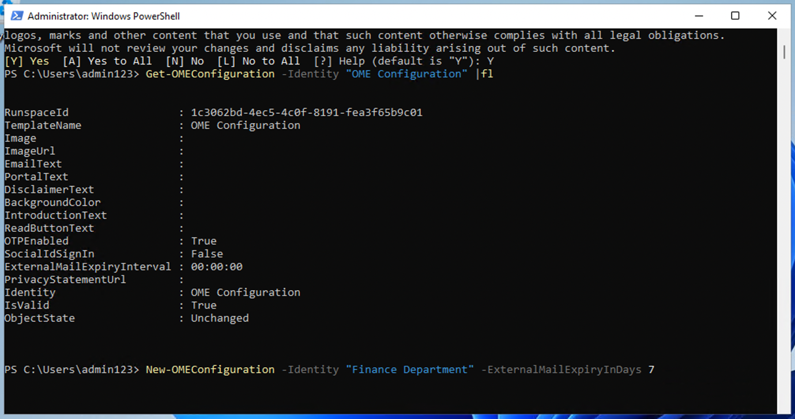

Atelier 1 – Attribution de rôles de conformité et exploration du portail
Microsoft Purview

Objectif :

Dans cet atelier, nous créons des utilisateurs et leur attribuons des
rôles, des équipes et des groupes appropriés dans le Centre
d’administration Office 365 pour représenter une organisation, Contoso.

Nous attribuons également les éléments suivants aux utilisateurs :

- Essai pour les évaluations de conformité

Plus tard, nous testerons **Microsoft 365 built-in Office 365 Message
Encryption (OME).**

Tout d’abord, nous allons modifier le modèle par défaut pour nous
assurer qu’aucune boîte de dialogue d’identifiants sociaux n’est
affichée pour les destinataires externes lors de la réception d’un
message protégé par le chiffrement de messages Office 365 de la part
d’utilisateurs de l’organisation que nous avons configurée.

## Ensuite, nous allons créer une nouvelle configuration OME personnalisée et créer une règle de transport pour appliquer la configuration OME à tous les e-mails envoyés depuis notre service financier.  Exercice 1 - Gestion des rôles de conformité

Dans cet exercice, nous allons activer toutes les licences d'essai
requises pour mettre en œuvre la sécurité avec Microsoft Purview.

Tâche 1 – Ajout du rôle de gestionnaire à un utilisateur existant.

1.  Connectez-vous à la machine virtuelle avec les détails de compte
    fournis avec votre atelier.

2.  Connectez-vous au Centre d'administration Microsoft 365
    https://admin.microsoft.com l'aide du nom d'utilisateur et du mot de
    passe administratifs.

3.  Dans le volet gauche, sélectionnez **Users** \> **Active users**,
    puis cliquez sur le premier utilisateur, **Adele Vance**.

> 

4.  Sous **Manager**, Cliquez **Edit manager**.

> 

5.  Supprimez le gestionnaire actuel et tapez **Patti** dans la zone de
    recherche. Sélectionnez **Patti Fernandez**. Cliquez sur **Save
    Changes.  
      
    ****  
      
    ***Une capture d'écran d'un ordinateur Description générée
    automatiquement*

&nbsp;

6.  Changez le manager en **Patti Fernandez** pour tous les utilisateurs
    suivants.

- Adele Vance

- Christie Cline

- Megan Bowen

7.  Pour Patti Fernandez, ajouter **MOD Administrator** en tant que
    gestionnaire.

Tâche 2 – Ajout d'un administrateur de conformité

1.  Sélectionnez l’utilisateur **Patti Fernandez**, sous **Account**,
    faites défiler jusqu’à **Roles** et cliquez sur **Manage roles**  
    

*Une capture d’écran d’un ordinateur Description générée
automatiquement*

2.  Une fois le volet **Roles** ouvert, cochez la case d'option près de
    **Admin center access**, puis développez **Show all by category**

> 
>
> *Une capture d'écran d'un ordinateur Description générée
> automatiquement*

3.  Faites défiler jusqu’à **Security & compliance**, cochez la case à
    côté de **Compliance Administrator**, puis cliquez sur **Save
    changes**.

> 
>
> Une capture d'écran d'un ordinateur Description générée
> automatiquement

4.  Fermez le volet, restez sur la même longueur d'onde et passez à la
    tâche suivante.

### Tâche 3 - Création d'équipes et de groupes dans le centre d'administration Microsoft

1.  Développez maintenant **Teams & groups**, sélectionnez **Active
    teams & groups** et cliquez sur **Add a Microsoft 365 group** sous
    **Teams & Microsoft 365 groups**

> 

*Une capture d'écran d'un ordinateur Description générée
automatiquement*

2.  Pour le nom, utilisez Contoso Finance Team et pour la description,
    utilisez Cette équipe gère les finances., puis cliquez sur **Next**.

> 
>
> *Une capture d'écran d'un ordinateur Description générée
> automatiquement*

3.  Sur la page **Assign Owners**, cliquez sur **Assign owners**, cochez
    la case à côté d’**Adele Vance** et cliquez sur **Add(1)**. Cliquez
    sur **Next**.

4.  Sur la page **Add members**, ajoutez **Adele Vance** et **Christie
    Cline** en tant que membres, cliquez sur **Next**. Sur la page **Add
    members**, sélectionnez **Next**

5.  Pour l'adresse e-mail de groupe, utilisez contosofinance , puis
    cliquez sur **Next**

> 
>
> *Une capture d'écran d'un ordinateur Description générée
> automatiquement*

6.  Cliquez sur **Create group**.

> *Une capture d'écran d'un ordinateur Description générée
> automatiquement*

7.  Une fois cela fait, cliquez sur **Close**.

> 
>
> *Une capture d'écran d'un ordinateur Description générée
> automatiquement*

8.  Sur la page **Active teams & groups page**, sélectionnez l’onglet
    **Security groups**. Sélectionnez **Add a security group**

*Une capture d'écran d'un ordinateur Description générée
automatiquement*

9.  Répétez les étapes pour créer un autre groupe avec les informations
    suivantes.

- Dans la **Set up the basics**, entrez ce qui suit dans le champ
  **Name** : EDM_DataUploaders. Dans le champ Description, saisissez
  Personnes qui téléchargeront des données pour la GED.

1.  Sélectionnez **Next**.

- Sur le page **Settings**, sélectionnez **Next**.

- Sur la page **Review and finish adding group**, vérifiez vos
  paramètres et sélectionnez **Create group**.

- Lorsque la page **New group created** s’affiche, sélectionnez le
  bouton Fermer. Sélectionnez maintenant le groupe **EDM_DataUploaders**
  nouvellement créé dans la liste.

- Sous l’onglet Membres, sélectionnez **View all and manage owners**,
  puis ajoutez **Patti Fernandez** et **Christie Cline**.

- De même, ajoutez **Patti Fernandez** et **Christie Cline** en tant que
  membres.

> 
>
> *Une capture d'écran d'un ordinateur Description générée
> automatiquement*

Tâche 4 – Permettre l'essai pour les évaluations de la conformité

1.  Connectez-vous au portail Purview https://purview.microsoft.com en
    utilisant **Administrative Username** et **Administrative
    Password**.

2.  Si une fenêtre de bienvenue s’affiche, acceptez les conditions et
    sélectionnez **Get started** et fermez-la.

> 

3.  Faites défiler l’écran vers le bas et sous Versions d’évaluation et
    recommandations, sélectionnez **View all trials and
    recommendations**

> 

4.  Sur la page **Microsoft Purview trials and recommendations**,
    accédez à **Compliance assessments**, sous **Purview and Priva
    trials**, puis sélectionnez **Try now**.

> 
>
> *Une capture d'écran d'un ordinateur Description générée
> automatiquement*

5.  Cliquez sur **Start Trials**.

> 

Remarque : L'application des modifications peut prendre jusqu'à 2
heures. Connectez-vous à nouveau pour voir les nouvelles
fonctionnalités. En attendant, passez aux prochaines étapes.

6.  Dans la barre de navigation, sélectionnez **Solutions** \>
    **Audit**.

*Une capture d'écran d'un ordinateur Description générée
automatiquement*

7.  Sur la page **Audit**, sélectionnez **Start recording user and admin
    activity** pour activer la journalisation d’audit.

*Une capture d'écran d'un ordinateur Description générée
automatiquement*

Exercice 2 - Gestion du chiffrement des messages Office 365

Le premier paramètre que **Patti Fernandez** doit configurer et tester
avec son équipe pilote est **Microsoft 365 built-in** **Office 365
Message Encryption (OME).** À cette fin, il modifiera le modèle par
défaut et créera un nouveau modèle de marque, qui sera attribué à l'un
des utilisateurs pilotes. Les utilisateurs pilotes testeront ensuite la
fonctionnalité OME avec leurs comptes.

Tâche 1 – Vérification de la fonctionnalité Azure RMS

Dans cette tâche, vous allez installer **Exchange Online PowerShell** et
vérifier la fonctionnalité Azure RMS correcte de votre locataire.

1.  Ouvrez une fenêtre **elevated PowerShell** sélectionnant le bouton
    Windows avec le bouton droit de la souris, puis exécutez **Windows
    PowerShell** en tant qu'administrateur.  
      
    

*Une capture d'écran d'un ordinateur Description générée
automatiquement*

2.  Confirmez la fenêtre de **User Account Control** avec **Yes**.

3.  Entrez l'applet de commande suivante pour installer la dernière
    version du module PowerShell Exchange Online :

Install-Module ExchangeOnlineManagement

*Une capture d'écran d'un ordinateur Description générée
automatiquement*

4.  Confirmez la boîte de dialogue de sécurité du fournisseur **NuGet**
    avec **Y** pour Oui et appuyez sur **Enter**. Ce processus peut
    prendre quelques secondes.  
    

> *Une capture d'écran d'un ordinateur Description générée
> automatiquement*

5.  Confirmez la boîte de dialogue Sécurité du référentiel non approuvé
    avec **Y** pour Oui et appuyez sur **Enter**. Ce processus peut
    prendre quelques secondes

> 

*Une capture d'écran d'un ordinateur Description générée
automatiquement*

6.  Entrez l’applet de commande suivante pour modifier votre stratégie
    d’exécution et appuyez sur **Enter**

> Set-ExecutionPolicy -ExecutionPolicy RemoteSigned -Scope CurrentUser  
>   
>   
>   

7.  Confirmez la modification de la politique d’exécution avec **Y**
    pour Oui et appuyez sur **Enter**.

> 

8.  Entrez l’applet de commande suivante pour utiliser le module
    **Exchange Online PowerShell** et vous connecter à votre locataire :

Connect-ExchangeOnline

> 

9.  Lorsque la fenêtre **Sign in** s'affiche, connectez-vous en tant que
    **Patti Fernandez** à l'aide du nom d'utilisateur
    PattiF@{TENANTPREFIX}.onmicrosoft.com et du mot de passe utilisateur
    indiqué dans l'onglet des ressources (remplacez {TENANTPREFIX} par
    le préfixe du locataire indiqué dans l'onglet des ressources)

10. Vérifiez qu'Azure RMS et IRM sont activés dans votre locataire à
    l'aide de l'applet de commande suivante et appuyez sur **Enter** :

Get-IRMConfiguration | fl AzureRMSLicensingEnabled

11. Lorsque **le résultat AzureRMSLicensingEnabled** est **True**, Azure
    RMS est activé pour votre locataire. Passez à l'étape
    suivante

12. Testez les modèles Azure RMS utilisés pour le chiffrement des
    messages Office 365 par rapport à l'utilisateur pilote de
    démonstration **Adele Vance** à l'aide de l'applet de commande
    suivante (remplacez {TENANTPREFIX} par le préfixe de votre locataire
    indiqué dans l'onglet ressources)

Test-IRMConfiguration -Sender adelev@{TENANTPREFIX}.onmicrosoft.com
-Recipient adelev@{TENANTPREFIX}.onmicrosoft.com

13. Vérifiez que tous les tests ont le statut PASS et qu'aucune erreur
    n'est affichée.

  
  
*Capture d'écran*

14. Laissez la fenêtre **PowerShell** ouverte.

Vous avez installé le module Exchange Online PowerShell, vous vous êtes
connecté à votre locataire et vous avez vérifié le bon fonctionnement
d'Azure RMS.

Tâche 2 – Modification du modèle OME par défaut

Ensuite, votre organisation est tenue de restreindre la confiance des
fournisseurs d'identité étrangers, tels que Google ou Facebook. Étant
donné que ces identifiants sociaux sont activés par défaut pour accéder
aux messages protégés par OME, vous devez désactiver l'utilisation des
identifiants sociaux pour tous les utilisateurs de votre organisation.

1.  Exécutez la cmdlet suivante pour afficher la configuration par
    défaut de l'OME :

get-OMEConfiguration -Identity « OME Configuration » |fl

*Une capture d'écran d'un ordinateur Description générée
automatiquement*

2.  Vérifiez les paramètres et vérifiez que le paramètre
    **SocialIdSignIn** est défini sur **True**

> 

*BrokenImage*

3.  Exécutez l'applet de commande suivante pour restreindre
    l'utilisation des ID sociaux pour l'accès aux messages de votre
    locataire protégé par OME :

Set-OMEConfiguration -Identity "OME Configuration"
-SocialIdSignIn:$false

> 

*Une capture d'écran d'un ordinateur Description générée
automatiquement*

4.  Confirmez le message d'avertissement pour la personnalisation du
    modèle par défaut avec **Y** pour Oui et appuyez sur Entré

*BrokenImage*

5.  Vérifiez à nouveau la configuration par défaut et validez, le
    paramètre **SocialIdSignIn** est maintenant défini sur **False**.

Get-OMEConfiguration -Identity "OME Configuration" |fl

6.  Notez que le résultat doit indiquer que **SocialIDSignIn** est
    défini sur **False**.

*BrokenImage*

7.  Laissez la fenêtre **PowerShell** ouverte et passez à l'exercice
    suivant.

Vous avez désactivé l'utilisation de fournisseurs d'identité étrangers,
tels que Google et Facebook, dans le chiffrement des messages Office
365.

Tâche 3 – Mise à l'essai du modèle d'OME modifié

Vous devez vérifier qu'aucune boîte de dialogue d'ID sociaux n'est
affichée pour les destinataires externes lors de la réception d'un
message protégé par le chiffrement de messages Office 365 de la part
d'utilisateurs de votre client et qu'ils doivent utiliser le mot de
passe à usage unique à tout moment pour accéder au contenu chiffré.

1.  Dans **Microsoft Edge**, ouvrez une **New InPrivate Window** et
    accédez à https://outlook.office.com et connectez-vous à Outlook sur
    le web avec le nom d'utilisateur
    AdeleV@{TENANTPREFIX}.onmicrosoft.com et le mot de passe utilisateur
    indiqué dans votre onglet ressources.

2.  Sur le site Rester **Stay signed in?** , cochez la case **Don’t show
    this again,** puis sélectionnez **No**.

3.  Sélectionnez **Save** dans la boîte de dialogue **Save password**
    pour enregistrer le mot de passe de l'utilisateur pilote dans votre
    navigateur.

4.  Si une **Translate page from...** s'affiche, sélectionnez la flèche
    vers le bas et sélectionnez **Never translate from...**.

5.  Sélectionnez **New mail** dans la partie supérieure gauche d'Outlook
    sur le web.

> 

*Une capture d'écran d'un ordinateur Description générée
automatiquement*

6.  Sur la ligne **To**, entrez votre adresse e-mail personnelle ou une
    autre adresse e-mail tierce qui ne figure pas dans le domaine du
    locataire. Entrez Secret Message Sur la ligne d’objet et My
    super-secret message. au corps

*Interface utilisateur graphique, texte, application, description de mot
générée automatiquement*

7.  Dans le volet supérieur, accédez au **Options**, sélectionnez
    **Encrypt** pour chiffrer le message. Si vous ne trouvez pas
    l'option, sélectionnez les **3 dots (...)** en haut à droite, puis
    dans la liste déroulante, sélectionnez **Encrypt**.

> 

*Une capture d'écran d'un ordinateur Description générée
automatiquement*

8.  Une fois que vous avez correctement chiffré le message, vous devriez
    voir un avis indiquant « **Encrypt: This message is encrypted.
    Recipients can’t remove encryption.**"

*Une capture d'écran d'un écran d'ordinateur Description générée
automatiquement*

9.  Sélectionnez **Send** pour envoyer le message.

*Interface utilisateur graphique, texte, e-mail Description générée
automatiquement*

**Remarque** : Dans le compte d'essai, vous pouvez ou non avoir le
privilège d'envoyer des e-mails et votre courrier peut ne pas être en
mesure d'atteindre le destinataire de votre locataire actuel. Mais que
votre e-mail passe, vous pouvez consulter les étapes suivantes pour
tester le modèle.

10. Connectez-vous à votre compte de messagerie personnel et ouvrez le
    message d'Adele Vance. Si vous avez envoyé cet e-mail à un compte
    Microsoft (tel que @outlook.com), le chiffrement peut être traité
    automatiquement et le message s'affiche automatiquement.

**Remarque** : Si vous avez envoyé l'e-mail à un autre service de
messagerie tel que (@gmail.com), vous devrez peut-être effectuer les
étapes suivantes pour traiter le cryptage et lire le message. Vous
devrez peut-être vérifier votre dossier de courrier indésirable ou de
spam pour le message.

11. Sélectionnez **Read the message**.

12. Si les identifiants sociaux ne sont pas activés, il n'y a pas de
    bouton pour s'authentifier avec votre compte Google.

13. Sélectionnez **Sign in with a One-time passcode** pour recevoir un
    code d'accès à durée limitée.

14. Accédez à votre portail de messagerie personnel et ouvrez le message
    avec l'objet **Your one-time passcode to view the message**.

15. Copiez le code d'accès, collez-le dans le portail OME et
    sélectionnez **Continue**.

16. Vérifiez le message chiffré.

Vous avez testé avec succès le modèle OME par défaut modifié avec des
identifiants sociaux désactivés.

Tâche 4 - Création d'un modèle de marque personnalisé

Les messages protégés envoyés par le service financier de votre
organisation nécessitent une image de marque spéciale, y compris des
textes d'introduction et de corps personnalisés, ainsi qu'un lien de
non-responsabilité dans le pied de page. Les messages financiers
expireront également après sept jours. Dans cette tâche, vous allez
créer une configuration OME personnalisée et créer une règle de
transport pour appliquer la configuration OME à tous les e-mails envoyés
depuis le service financier.

6.  Dans la fenêtre PowerShell que nous avons laissée ouverte avec
    Exchange Online connecté. exécutez l'applet de commande suivante
    pour créer une configuration OME :

Nouveau-OMEConfiguration -Identité « Département Financier »
-ExternalMailExpiryInDays

7

*Description textuelle générée automatiquement*

2.  Confirmez le message d'avertissement pour la personnalisation du
    modèle avec **Y** pour Oui et appuyez sur **Enter**.

*Description textuelle générée automatiquement*

3.  Modifiez le message texte d'introduction à l'aide de l'applet de
    commande suivante

Set-OMEConfiguration -Identity "Finance Department" -IntroductionText
"from Contoso Ltd. finance department has sent you a secure
message."

*BrokenImage*

4.  Confirmez le message d'avertissement pour la personnalisation du
    modèle avec **Y** pour Oui et appuyez sur **Enter**.

*BrokenImage*

5.  Modifiez le corps du texte de l'e-mail du message à l'aide de
    l'applet de commande suivante

Set-OMEConfiguration -Identity "Finance Department" -EmailText
"Encrypted message sent from Contoso Ltd. finance department. Handle the
content responsibly."

6.  Confirmez le message d'avertissement pour la personnalisation du
    modèle avec **Y** pour Oui et appuyez sur **Enter**.

*Description textuelle générée automatiquement*

7.  Modifiez l'URL de la clause de non-responsabilité pour qu'elle
    pointe vers le site de la déclaration de confidentialité de Contoso

Set-OMEConfiguration -Identity "Finance Department" -PrivacyStatementURL
"https://contoso.com/privacystatement.html"

Description textuelle générée automatiquement

8.  Confirmez le message d'avertissement pour la personnalisation du
    modèle avec **Y** pour Oui et appuyez sur **Enter**.

*BrokenImage*

9.  Utilisez l'applet de commande suivante pour créer une règle de flux
    de messagerie, qui applique le modèle OME personnalisé à tous les
    messages envoyés par l'équipe financière de Contoso. Ce processus
    peut prendre quelques secondes.

New-TransportRule -Name "Encrypt all mails from Contoso Finance team"
-FromScope InOrganization -FromMemberOf "Contoso Finance Team"
-ApplyRightsProtectionCustomizationTemplate "Finance Department"
-ApplyRightsProtectionTemplate Encrypt

*BrokenImage*

*Description textuelle générée automatiquement*

10. Tapez l'applet de commande suivante pour vérifier les modifications.

Get-OMEConfiguration -Identity "Finance Department" | Format-List

*BrokenImage*

11. Laissez le **PowerShell** ouvert.

Vous avez créé une nouvelle règle de transport qui applique
automatiquement le modèle OME personnalisé, lorsqu'un membre du service
financier envoie un message à des destinataires externes.

Tâche 5 – Test du modèle de marque personnalisé

Pour valider la nouvelle configuration OME personnalisée, vous devez
utiliser le compte de Christie Cline, qui est membre de l'équipe
financière. Dans le compte d'essai, vous n'aurez pas le privilège
d'envoyer des e-mails, mais vous pouvez consulter les étapes suivantes
pour comprendre comment tester le modèle lorsque vous avez vos propres
licences. Vous pouvez effectuer les étapes 1 à 4, mais il se peut que
votre courrier ne puisse pas atteindre le destinataire à partir de votre
locataire d'essai actuel.

1.  Dans **Microsoft Edge**, ouvrez une **nouvelle fenêtre InPrivate**
    et accédez à https://outlook.office.com et connectez-vous à Outlook
    sur le web avec le nom d'utilisateur
    ChristieC@{TENANTPREFIX}.onmicrosoft.com et le mot de passe
    utilisateur indiqué dans l'onglet des ressources.

*Interface utilisateur graphique, texte, application Description générée
automatiquement*

2.  Sélectionnez **New message** dans la partie supérieure gauche
    d'Outlook sur le web.

3.  Sur la ligne **To,** entrez votre adresse e-mail personnelle ou une
    autre adresse e-mail tierce qui ne figure pas dans le domaine du
    locataire. Entrez Rapport financier sur la ligne d’objet et entrez
    Informations financières secrètes. au corps.

4.  Sélectionnez **Send** pour envoyer le message.

5.  Connectez-vous à l'adresse e-mail que vous avez utilisée ci-dessus
    et ouvrez le message de Christie Cline.

6.  Vous devriez voir un message de **Christie Cline** qui ressemble à
    l'image ci-dessous. Sélectionnez **Read the message**.

*BrokenImage*

7.  Si vous souhaitez lire le message, procédez comme suit.

    1.  Cliquez sur **Read the message**. Sélectionnez **Sign in with a
        One-time passcode** pour recevoir un code d'accès à durée
        limitée.

    2.  Accédez à votre portail de messagerie personnel et ouvrez le
        message avec l'objet **Your one-time passcode to view the
        message**.

    3.  Copiez le code d'accès, collez-le dans le portail OME et
        sélectionnez **Continue**.

    4.  Examinez le message chiffré avec une personnalisation de la
        marque.

Vous avez testé avec succès le nouveau modèle OME personnalisé.

Exercice 3 – Activation de la protection adaptative

1.  Dans Microsoft Edge, accédez à https://purview.microsoft.com et
    connectez-vous au portail perview en tant que **MOD Administrator**.

2.  Dans le volet de navigation de gauche, sélectionnez **Solutions** \>
    **Insider risk management** \> **Adaptive Protection** \>
    **Protection adaptative**. Sélectionnez ensuite **Dashboard**.
    Sélectionnez **Quick setup**.

3.  Il affichera un message indiquant que nous mettons les choses en
    place. Il faudra 72 heures pour l'activer. Nous l'utiliserons dans
    le 8e laboratoire, où nous explorerons la fonctionnalité de
    protection adaptative.

*BrokenImage*

4.  Sélectionnez l’onglet **Adaptive Protection settings** et activez le
    bouton bascule **Adaptive Protection**. Sélectionnez **Save**.

  
*BrokenImage  
  
*Résumé :

Dans cet atelier, nous avons réussi à répliquer une organisation dans
notre centre d'administration, à attribuer les licences appropriées et à
apprendre à utiliser le chiffrement de messages Office 365 intégré à
Microsoft 365 (OME).
