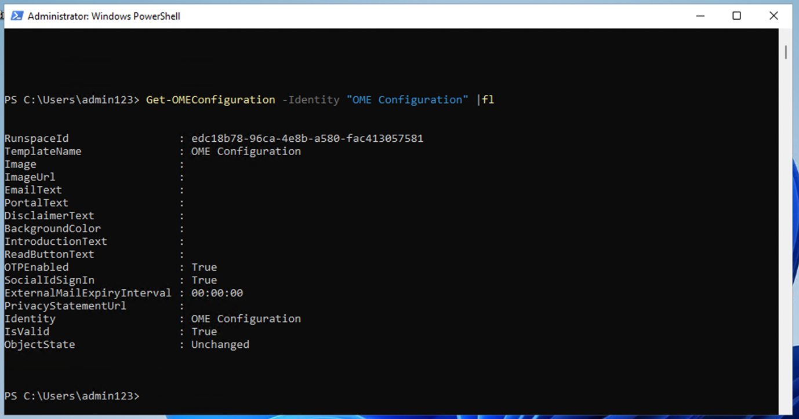

## 實驗室 1 – 分配合規性角色幷探索 Microsoft Purview 門戶

## 客觀的:

本實驗室中，我們在 Office 365
管理中心創建用戶幷爲他們分配適當的角色、團隊和組來代表一個組織 —
Contoso。

我們還向用戶分配以下內容:

- 合規性評估試驗

稍後，我們將測試**Microsoft 365內置的Office 365消息加密（OME）。**

首先，我們將修改默認模板，以確保在從我們設置的組織的用戶接收受 Office
365 消息加密保護的消息時，不會爲外部收件人顯示任何社交 ID 對話框。

## 然後，我們將創建一個新的自定義 OME 配置，幷創建一個傳輸規則，將 OME 配置應用于從我們的財務部門發送的所有郵件。

練習 1 - 管理合規角色

### 在本次練習中，我們將激活使用 Microsoft Purview實施安全性所需的所有試用許可證。

### 任務 1 — 爲現有用戶添加管理員角色。

1.  使用實驗室提供的帳戶詳細信息登錄 VM。

2.  使用管理用戶名和管理密碼登錄 Microsoft 365 管理中心
    https://admin.microsoft.com。

3.  在左側窗格中，選擇“**User”\>“** **Active
    Users**”，然後單擊第一個用戶 **Adele Vance**。

4.  在 **manager**下，單擊 **edit manager**。

5.  删除當前經理幷在搜索框中輸入 **Patti**。選擇 **Patti
    Fernandez**。單擊 **Save Changes**。

計算機屏幕截圖 自動生成的描述

6.  將以下所有用戶的經理更改爲 **Patti Fernandez**。

- Adele Vance

- Christie Cline

- Megan Bowen

7.  對于 Patti Fernandez，添加 **MOD administrator** 作爲經理。

### 任務 2 – 添加合規性管理員

1.  選擇用戶 **Patti Fernandez**，在 **Account** 下，滾動到 **Roles**
    幷單擊 **Manage roles**。

自動生成的計算機 Description 的屏幕截圖

2.  打開 **Roles** 窗格後，選中 **Admin center access**
    附近的單選按鈕，然後展開 **Show all by category。**

自動生成的計算機 Description 的屏幕截圖

3.  滾動到Security & compliance，勾選Compliance
    Administrator**旁邊的框**，然後點擊**Save changes**。

自動生成的計算機 Description 的屏幕截圖

4.  關閉窗格，保持在同一頁面上，然後繼續執行下一個任務。

### 任務 3 - 在 Microsoft 管理中心創建團隊和組

1.  現在展開**Teams & groups**，選擇**Active teams & groups**，**Teams &
    Microsoft 365 groups**下的**Add a Microsoft 365 group**。

自動生成的計算機 Description 的屏幕截圖

2.  對于名稱，請使用 `Contoso Finance Team`，對于說明，請使用
    `This team handled finance``。`，然後單擊 **Next**。

自動生成的計算機 Description 的屏幕截圖

3.  在 **Assign Owners** 頁面上，點擊 **Assign owners**，勾選 **Adele
    Vance** 旁邊的框，然後點擊 **Add（1）。**單擊 **Next** 。

4.  在 **Add members** 頁面上，將 **Adele Vance** 和 **Christie Cline**
    添加爲成員，然後單擊 **Next**。在 **Add members** 頁面上，選擇
    **Next**。

5.  對于 group email address（組電子郵件地址），請使用 `contosofinance`
    ，然後單擊 **Next**。

自動生成的計算機 Description 的屏幕截圖

6.  單擊 **Create group**。

自動生成的計算機 Description 的屏幕截圖

7.  完成後，單擊 **Close**。

自動生成的計算機 Description 的屏幕截圖

8.  在 **Active teams & groups page上**，選擇**Security groups**
    選項卡。選擇 **Add a security group。**

自動生成的計算機 Description 的屏幕截圖

9.  重複這些步驟以使用以下信息創建另一個組。

- 在 **Set up the basics** 中，在 **Name**
  字段中輸入以下內容：EDM_DataUploaders。在 描述 字段中，輸入 人員
  他們將上傳 EDM 的數據。

- 選擇 **Next**。

- 在 **Settings** 頁面上，選擇 **Next** 。

- 在 **Review and finish adding group** 頁面上，查看您的設置幷選擇
  **Create group**。

- 當顯示 **New group created** 頁面時，選擇 close
  按鈕。現在，從列表中選擇新創建的 **EDM_DataUploaders** 組。

- 在成員選項卡下，選擇**View all and manage owners**，然後添加 **Patti
  Fernandez** 和 **Christie Cline** 。

- 同樣，添加 **Patti Fernandez** 和 **Christie Cline** 作爲成員。

自動生成的計算機 Description 的屏幕截圖

### 任務 4 – 啓用合規性評估的試用

1.  使用 **Administration Username** 和 **Administration Password**
    https://purview.microsoft.com 登錄到 Purview 門戶。

2.  如果顯示歡迎窗口，請同意條款幷選擇 **Get started** 幷關閉它。

3.  向下滾動，然後在 Trials and recommendations 下，選擇 **View all
    trials and recommendations** 。

4.  在 **Microsoft Purview trials and recommendations**頁上，轉到
    **Compliance assessments**，在 **Purview and Priva
    trials**下，然後選擇 **Try now**。

自動生成的計算機 Description 的屏幕截圖

5.  單擊 **Start Trials**。

注意：更改最多可能需要2小時才能生效。再次登錄以查看新功能。在此期間，請繼續執行後續步驟。

6.  從導航欄中，選擇 **Solutions** \> **Audit**。

自動生成的計算機 Description 的屏幕截圖

7.  在 **Audit** 頁面上，選擇 **Start recording user and admin
    activity** 以激活審核日志記錄。

自動生成的搜索引擎描述的屏幕截圖

## 練習 2 - 管理 Office 365 郵件加密

**Patti Fernandez Microsoft 365 built-in Office 365 Message Encryption
(OME)。**爲此，他將修改默認模板幷創建一個新的品牌模板，該模板將分配給其中一個試點用戶。然後，試點用戶將使用其帳戶測試
OME 功能。

### 任務 1 - 驗證 Azure RMS 功能

在此任務中，您將安裝 **Exchange Online PowerShell** 模塊幷驗證租戶的正確
Azure RMS 功能。

1.  通過使用鼠標右鍵選擇 Windows 按鈕打開 **elevated
    PowerShell**窗口，然後**以管理員身份運行 Windows PowerShell**。

自動生成的計算機 Description 的屏幕截圖

2.  確認 **User Account Control** 窗口**Yes。**

3.  輸入以下 cmdlet 以安裝最新的 Exchange Online PowerShell 模塊版本:

`Install-Module ExchangeOnlineManagement`

自動生成文本的計算機屏幕 Description

4.  確認 **NuGet** 提供程序安全對話框，其中 **Y** 表示“是”，然後按
    **Enter**。此過程可能需要幾秒鐘才能完成。

自動生成帶有白色文本 Description 的計算機屏幕

5.  確認Untrusted repository security 對話框，輸入 **Y**
    表示“是”，然後按 **Enter**。此過程可能需要幾秒鐘才能完成。

自動生成帶有白色文本 Description 的計算機屏幕

6.  輸入以下 cmdlet 以更改執行策略，然後按 **Enter 鍵**

`Set-ExecutionPolicy -ExecutionPolicy RemoteSigned -Scope CurrentUser`

7.  使用 **Y** 確認 Execution Policy Change，爲 Yes，然後按 **Enter**。

8.  輸入以下 cmdlet 以使用 **Exchange Online PowerShell**
    模塊幷連接到您的租戶:

`連接``-ExchangeOnline`

9.  當顯示**Sign in**窗口時，使用用戶名
    PattiF@{TENANTPREFIX}.onmicrosoft.com 和資源選項卡上提供的用戶密碼以
    **Patti Fernandez**` ``身份登錄`` ` 。（將 {TENANTPREFIX}
    替換爲資源選項卡上提供的租戶前綴）

10. 使用以下 cmdlet 驗證是否已在租戶中激活 Azure RMS 和 IRM，然後按
    **Enter**:

`Get-IRMConfiguration | fl AzureRMSLicensingEnabled`

11. 當 **AzureRMSLicensingEnabled** 結果爲 **True** 時，將爲租戶激活
    Azure RMS。繼續執行下一步。

12. 使用以下 cmdlet（將 {TENANTPREFIX}
    替換爲資源選項卡上提供的租戶前綴），針對演示試點用戶 **Adele Vance**
    測試用于 Office 365 消息加密的 Azure RMS 模板

`Test-IRMConfiguration -Sender adelev@{TENANTPREFIX}.onmicrosoft.com -Recipient adelev@{TENANTPREFIX}.onmicrosoft.com`

13. 驗證所有測試都處于 PASS 狀態，幷且未顯示任何錯誤。

截圖

14. 使 **PowerShell** 窗口保持打開狀態。

你已成功安裝 Exchange Online PowerShell 模塊，連接到租戶，幷驗證了 Azure
RMS 的正確功能。

### 任務 2 – 修改默認 OME 模板

接下來，您的組織中需要限制對外部身份提供商（如 Google 或
Facebook）的信任。由于這些社交 ID 默認處于激活狀態，用于訪問受 OME
保護的郵件，因此您需要爲組織中的所有用戶停用社交 ID。

1.  運行以下 cmdlet 以查看默認 OME 配置:

`Get-OMEConfiguration -Identity "OME Configuration" |fl`

自動生成的計算機描述的屏幕截圖

2.  查看設置幷確認 **SocialIdSignIn** 參數設置爲 **True**。

3.  運行以下 cmdlet 以限制使用社交 ID 訪問來自受 OME 保護的租戶的消息:

`Set-OMEConfiguration -Identity "OME Configuration" -SocialIdSignIn:$false`

自動生成文本的計算機屏幕 Description

4.  使用 **Y** 確認自定義默認模板的警告消息，然後單擊 Enter。

5.  再次檢查默認配置幷驗證， **SocialIdSignIn** 參數現在設置爲
    **False**。

`Get-OMEConfiguration -Identity "OME Configuration" |fl`

6.  請注意，結果應顯示 **SocialIDSignIn** 設置爲 **False**。

7.  讓 **PowerShell** 窗口 保持打開狀態，然後繼續進行下一個練習。

您已成功在 Office 365 郵件加密中停用外部身份提供程序（如 Google 和
Facebook）的使用。

### 任務 3 – 測試修改後的 OME 模板

您必須確認，當您的租戶用戶收到受 Office 365
郵件加密保護的郵件時，沒有向外部收件人顯示社交 ID
對話框，幷且他們需要隨時使用 OTP 訪問加密內容。

1.  在 **Microsoft Edge** 中，打開一個 **New InPrivate 窗口**幷導航到
    `https://outlook.office.com ``幷使用用戶名`` `AdeleV@{TENANTPREFIX}.onmicrosoft.com` ``和資源選項卡上提供的用戶密碼`登錄
    Outlook 網頁版。

2.  在 **Stay signed in?** 對話框中，選中 **Don’t show this again**
    複選框，然後選擇 **No**。

3.  在 **Save password** 對話框中選擇 **Save**
    ，以將試點用戶密碼保存在瀏覽器中。

4.  如果 **Translate page from…**窗口，選擇向下箭頭幷選擇 **Never
    translate from...**。

5.  選擇 **New mail** 從 Outlook 網頁版的左上角。

自動生成圖形用戶界面、文本、應用程序、Word 描述

6.  在**To**行中，輸入不在租戶域中的個人或其他第三方電子郵件地址。在主題行中輸入
    `Secret Message ``（秘密消息` ） 和
    `My super-secret message ``（我的超級秘密消息）。` 到身體。

自動生成圖形用戶界面、文本、應用程序、Word 描述

7.  從頂部窗格中轉到 **Options** 窗格，選擇 **Encrypt**
    以加密消息。如果找不到該選項，請選擇 **3 dots （...）**
    ，然後從下拉列表中選擇 **Encrypt**。

自動生成的計算機 Description 的屏幕截圖

8.  成功加密郵件後，您應該會看到一條通知，上面寫著**“Encrypt: This
    message is encrypted. Recipients can’t remove encryption.”。**

自動生成的計算機屏幕描述的屏幕截圖

9.  選擇 **Send** 以發送消息。

自動生成圖形用戶界面、文本、電子郵件描述

**注意**：在試用帳戶中，您可能有權也可能沒有發送任何電子郵件的權限，幷且您的郵件可能無法從當前租戶到達收件人。但是您的電子郵件通過，您可以查看以下步驟來測試模板。

10. 登錄您的個人電子郵件帳戶幷打開來自 Adele Vance
    的消息。如果您將此電子郵件發送到 Microsoft 帳戶（如
    @outlook.com），則系統可能會自動處理加密，幷且您會自動看到該消息。

**注意**：如果您將電子郵件發送到其他電子郵件服務（如
（@gmail.com），則可能需要執行後續步驟來處理加密幷閱讀郵件。您可能需要檢查垃圾郵件文件夾中是否有該郵件。

11. 選擇 **Read the message** 。

12. 如果沒有激活社交 ID，就沒有按鈕來驗證您的 Google 帳戶。

13. 選擇 **Sign in with a One-time passcode** 以接收限時密碼。

14. 轉到您的個人電子郵件門戶，打開主題爲 **Your one-time passcode to
    view the message**。

15. 複製密碼，將其粘貼到 OME 門戶，然後選擇 **Continue**。

16. 查看加密郵件。

您已成功使用已停用的社交 ID 測試了修改後的默認 OME 模板。

### 任務 4 – 創建自定義品牌模板

您的組織財務部門發送的受保護郵件需要特殊品牌，包括自定義的簡介和正文文本以及頁脚中的Disclaimer鏈接。財務消息也將在7天后過期。在此任務中，您將創建一個新的自定義OME配置，幷創建一個傳輸規則，以將OME配置應用于從財務部門發送的所有郵件。

1.  在我們保持打開狀態的 PowerShell 窗口中，連接了 Exchange
    Online。運行以下 cmdlet 以創建新的 OME 配置:

`New-OMEConfiguration -Identity "Finance Department" -ExternalMailExpiryInDays 7`

自動生成文本描述

2.  使用 **Y** 確認自定義模板的警告消息 ，表示 Yes，然後按 **Enter**。

自動生成文本描述

3.  使用以下 cmdlet 更改簡介文本消息

`Set-OMEConfiguration -Identity "Finance Department" -IntroductionText "from Contoso Ltd. finance department has sent you a secure message."`

4.  使用 **Y** 確認自定義模板的警告消息 ，表示 Yes，然後按 **Enter**。

5.  使用以下 cmdlet 更改郵件的正文電子郵件文本

`Set-OMEConfiguration -Identity "Finance Department" -EmailText "Encrypted message sent from Contoso Ltd. finance department. Handle the content responsibly."`

6.  使用 **Y** 確認自定義模板的警告消息 ，表示 Yes，然後按 **Enter**。

自動生成文本描述

7.  將免責聲明 URL 更改爲指向 Contoso 的隱私聲明網站

`Set-OMEConfiguration -Identity "Finance Department" -PrivacyStatementURL "https://contoso.com/privacystatement.html"`

自動生成文本描述

8.  使用 **Y** 確認自定義模板的警告消息 ，表示 Yes，然後按 **Enter**。

9.  使用以下 cmdlet 創建郵件流規則，該規則將自定義 OME 模板應用于從
    Contoso 財務團隊發送的所有郵件。此過程可能需要幾秒鐘才能完成。

`New-TransportRule -Name "Encrypt all mails from Contoso Finance team" -FromScope InOrganization -FromMemberOf "Contoso Finance Team" -ApplyRightsProtectionCustomizationTemplate "Finance Department" -ApplyRightsProtectionTemplate Encrypt`

自動生成文本描述

10. 鍵入以下 cmdlet 以驗證更改。

`Get-OMEConfiguration -Identity "Finance Department" | Format-List`

11. 使 **PowerShell** 保持打開狀態。

您已成功創建一個新的傳輸規則，當財務部門的成員向外部收件人發送郵件時，該規則會自動應用自定義
OME 模板。

### 任務 5 – 測試自定義品牌模板

要驗證新的自定義 OME 配置，您需要使用財務團隊成員 Christie Cline
的帳戶。在試用帳戶中，您將無權發送任何電子郵件，但可以查看以下步驟，瞭解如何在擁有自己的許可證時測試模板。您可以執行步驟
1 - 4，但您的郵件可能無法從當前試用租戶到達收件人。

1.  在 **Microsoft Edge** 中，**New InPrivate Window** 幷導航到
    `https://outlook.office.com ``幷使用用戶名`` `ChristieC@{TENANTPREFIX}.onmicrosoft.com` ``和資源選項卡上給出的用戶密碼`登錄
    Outlook 網頁版。

自動生成圖形用戶界面、文本、應用程序描述

2.  選擇 **New message** 從 Outlook 網頁版的左上角。

3.  在 **To**
    行中，輸入不在租戶域中的個人或其他第三方電子郵件地址。在主題行輸入
    `Finance Report`，然後輸入 `Secret finance information``。` 到身體。

4.  選擇 **Send** 以發送消息。

5.  登錄您在上面使用的電子郵件帳戶，然後打開來自 Christie Cline 的消息。

6.  您應該會看到來自 **Christie Cline** 的消息，如下圖所示。選擇 **Read
    the message**。

7.  如果要閱讀該消息，請執行以下步驟。

    1.  單擊 **Read the message**。選擇 **Sign in with a One-time
        passcode** 以接收限時密碼。

&nbsp;

1.  轉到您的個人電子郵件門戶，打開主題爲 **Your one-time passcode to
    view the message**。

2.  複製密碼，將其粘貼到 OME 門戶，然後選擇 **Continue**。

3.  查看帶有自定義品牌的加密郵件。

您已成功測試新的自定義 OME 模板。

## 練習 3 – 啓用自適應保護

1.  在 Microsoft Edge 中，導航到 `https://purview.microsoft.com` **幷以
    MOD Administrator** 身份登錄 perview 門戶。

2.  從左側導航窗格中，選擇 **Solutioons** \> **Insider Risk Management**
    \> **Adaptive Protection**。然後選擇 **Dashboard** 。選擇 **Quick
    setup**。

3.  它將顯示一條消息，指出我們正在進行設置。啓用它需要 72
    小時。我們將在第 8 個實驗中使用它來探索自適應保護功能。

4.  選擇 **Adaptive Protection settings** 選項卡，然後打開 **Adaptive
    Protection** 切換按鈕。選擇 **Save** 。

## 總結：

在此實驗室中，我們成功地在管理中心複製了一個組織，分配了適當的許可證，幷學習了如何使用
Microsoft 365 內置的 Office 365 消息加密 （OME）。
