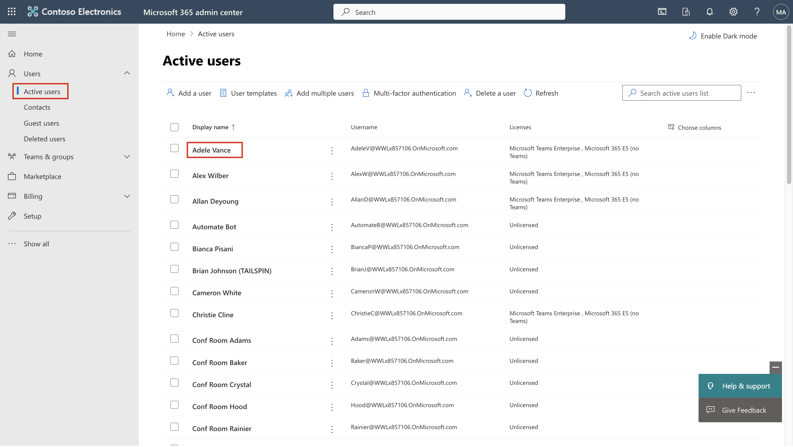

# Lab 1 – Atribuição de funções de conformidade e exploração do portal Microsoft Purview

## Objetivo:

Neste laboratório, criamos usuários e lhes atribuímos funções, equipes e
grupos apropriados no centro de administração do Office 365 para
representar uma organização - Contoso.

Também ativamos e atribuímos o seguinte aos Usuários:

- Avaliações de teste de conformidade

Mais tarde, testaremos a **Criptografia de Mensagens do Office 365 (OME)
integrada ao Microsoft 365**.

Primeiramente, modificaremos o modelo padrão para garantir que nenhuma
caixa de diálogo de IDs sociais seja exibida para destinatários externos
ao receber uma mensagem protegida com a Criptografia de Mensagens do
Office 365 de usuários da organização que configuramos.

Em seguida, criaremos uma nova configuração personalizada do OME e
criaremos uma regra de transporte para aplicar a configuração do OME a
todos os e-mails enviados pelo nosso departamento financeiro.

## Exercício 1 - Gerenciando Funções de Conformidades

Neste exercício, ativaremos todas as licenças de avaliação necessárias
para implementar a segurança com o Microsoft Purview.

### Tarefa 2 - Adicionar a função de gerente a um usuário existente.

1.  Faça login na VM com os detalhes da conta fornecidos na guia inicial
    do seu laboratório.

2.  Faça login no centro de administração do Microsoft 365 através do
    site `https://admin.microsoft.com` usando o nome de usuário
    administrativo e a senha administrativa.

3.  No painel esquerdo, selecione **Users** \> **Active users**, e
    clique no primeiro usuário **Adele Vance**.

4.  Em **Manager**, Clique em **Edit manager**.

5.  Remova o gerente atual e digite **Patti** na caixa de pesquisa.
    Selecione **Patti Fernandez**. Clique em **Save changes**.

Uma captura de tela de uma descrição de computador gerada
automaticamente

6.  Altere o gerente para **Patti Fernandez** para todos os seguintes
    usuários.

- Adele Vance

- Christie Cline

- Megan Bowen

7.  Para Patti Fernandez, adicione o **MOD Administrator** como gerente.

### Tarefa 2 – Adicionando um Administrador de Conformidade

1.  Selecione o usuário **Patti Fernandez**, em **Account**, role até
    **Roles** e clique em **Manage roles**.

*Uma captura de tela de uma descrição de computador gerada
automaticamente*

2.  Depois que o painel **Roles** for aberto, marque o botão de opção
    próximo ao **Admin center access**, e expanda **Show all by
    category.**

Uma captura de tela de uma descrição de computador gerada
automaticamente

3.  Role até **Security & Compliance**, marque a caixa ao lado de
    **Compliance Administrator** e clique em **Save changes**.

Uma captura de tela de uma descrição de computador gerada
automaticamente

4.  Feche o painel, permaneça na mesma página e continue para a próxima
    tarefa.

### Task 7 – Criação de equipes e grupos no centro de administração da Microsoft

1.  Agora, expanda **Teams & groups**, selecione **Active teams &
    groups** e clique em **Add a Microsoft 365 group** em **Teams &
    Microsoft 365 groups**.

Uma captura de tela de uma descrição de computador gerada
automaticamente

2.  Para o name, use `Contoso Finance Team`, e para a description, use
    `This team handles finance` e, em seguida, clique em **Next**.

Uma captura de tela de uma descrição de computador gerada
automaticamente

3.  Na página **Assign owners**, clique em **Assign Owners**, marque a
    caixa ao lado de **Adele Vance**, e clique em **Add(1)**. Clique em
    **Next**.

4.  Na página **Add members**, adicione **Adele Vance** e **Christie
    Cline** como membros e clique em **Next**. Na página **Add
    members**, selecione **Next.**

5.  Para o group email address, use contosofinance e clique em **Next**.

Uma captura de tela de uma descrição de computador gerada
automaticamente

6.  Clique em **Create group**.

Uma captura de tela de uma descrição de computador gerada
automaticamente

7.  Quando terminar, clique em **Close**.

Uma captura de tela de uma descrição de computador gerada
automaticamente

8.  Na página **Active teams & groups**, selecione a guia **Security
    groups**. Selecione **Add a security group.**

Uma captura de tela de uma descrição de computador gerada
automaticamente

9.  Repita as etapas para criar outro grupo com as informações a seguir.

- Em **Set up the basics**, digite o seguinte no campo **Name**:
  `EDM_DataUploaders`. No campo Description, digite
  `People who will upload data for EDM`.

- Seleciocne **Next**.

- Na página **Settings**, selecione **Next**.

- Na página **Review and finish adding group**, revise suas
  configurações e selecione **Create group**.

- Quando a página **New group created** for exibida, selecione
  **Close**. Agora, selecione o grupo **EDM_DataUploaders** recém-criado
  na lista.

- Na guia membros, selecione **View all and manage owners**, e adicione
  **Patti Fernandez** e **Christie Cline**.

- Da mesma forma, adicione **Patti Fernandez** e **Christie Cline** como
  membros.

Uma captura de tela de uma descrição de computador gerada
automaticamente

### Task 8 – Habilitando teste para avaliações de conformidade

1.  Faça login no Portal do Purview através do site
    `https://purview.microsoft.com` usando o **Administrative Username**
    e a **Administrative Password**.

2.  Se uma janela de boas-vindas for exibida, aceite os termos e
    selecione **Get started** e feche-a.

3.  Role para baixo e, em Trials and recommendations, selecione **View
    all trials and recommendations**.

4.  Na página do **Microsoft Purview trials and recommendations**
    navegue até **Compliance assessments**, em **Purview and Priva
    trials** e selecione **Try now**.

Uma captura de tela de uma descrição de computador gerada
automaticamente

5.  Clique em **Start Trials**.

Observação: Pode levar até 2 horas para que as alterações entrem em
vigor. Faça login novamente para ver os novos recursos e, enquanto isso,
continue com as próximas etapas.

6.  Na barra de navegação, selecione **Solutions** \> **Audit**.

Uma captura de tela de uma descrição de computador gerada
automaticamente

7.  Na página **Audit** selecione **Start recording user and admin
    activity** para ativar o audit logging.

Uma captura de tela de uma descrição de computador gerada
automaticamente

## Exercício 2 - Gerenciando a criptografia de mensagens do Office 365

A primeira configuração que **Patti Fernandez** precisa definir e testar
com sua equipe piloto é o **Microsoft 365 built-in** **Office 365
Message Encryption (OME)**. Para isso, ele modificará o modelo padrão e
criará um novo modelo de marca, que será atribuído a um dos
usuários-piloto. Os usuários-piloto testarão a funcionalidade do OME com
suas contas.

### Tarefa 1 - Verificação da funcionalidade do Azure RMS

Nesta tarefa, você instalará o módulo do **Exchange Online PowerShell**
e verificará a funcionalidade correta do Azure RMS do seu locatário.

1.  Abra uma janela **elevated PowerShell** selecionando o botão Windows
    com o botão direito do mouse e, em seguida, run as admistrator no
    **Windows PowerShell**.

Uma captura de tela de uma descrição de computador gerada
automaticamente

2.  Confirme a janela **User Account Control** com **Yes**.

3.  Digite o seguinte cmdlet para instalar a versão mais recente do
    módulo do Exchange Online PowerShell:

`Install-Module ExchangeOnlineManagement`

Uma tela de computador com texto Descrição gerada automaticamente

4.  Confirme a caixa de diálogo de segurança do provedor **NuGet** com
    **Y** para Sim e pressione **Enter**. Esse processo pode levar
    alguns segundos para ser concluído.

Uma captura de tela de uma descrição de computador gerada
automaticamente

5.  Confirme a caixa de diálogo Untrusted repository security com **Y**
    para Sim e pressione **Enter**. Esse processo pode levar alguns
    segundos para ser concluído.

Uma captura de tela de uma descrição de computador gerada
automaticamente

6.  Digite o cmdlet a seguir para alterar sua política de execução e
    pressione **Enter**

`Set-ExecutionPolicy -ExecutionPolicy RemoteSigned -Scope CurrentUser`

Imagem interrompida

7.  Confirme a alteração da política de execução com **Y** para Sim e
    pressione **Enter**.

Imagem interrompida

8.  Digite o seguinte cmdlet para usar o módulo do **Exchange Online
    PowerShell** e conecte-se ao seu locatário:

`Connect-ExchangeOnline`

Imagem interrompida

9.  Quando a janela de **Sign in** for exibida, faça login como **Patti
    Fernandez** usando o nome de usuário
    `PattiF@{TENANTPREFIX}.onmicrosoft.com` e a senha de usuário
    fornecida na guia de recursos. (substitua {TENANTPREFIX} pelo
    prefixo do locatário fornecido na guia de recursos).

10. Verifique se o Azure RMS e o IRM estão ativados em seu locatário
    usando o cmdlet a seguir e pressione **Enter**:

`Get-IRMConfiguration | fl AzureRMSLicensingEnabled`

11. Quando o resultado do **AzureRMSLicensingEnabled** for **True**, o
    Azure RMS será ativado para seu locatário. Continue com a próxima
    etapa.

Imagem interrompida

12. Teste os modelos do Azure RMS usados para a Criptografia de
    Mensagens do Office 365 em relação ao usuário piloto de demonstração
    **Adele Vance** usando o cmdlet a seguir (Substitua {TENANTPREFIX}
    pelo prefixo do locatário fornecido na guia de recursos).

`Test-IRMConfiguration -Sender adelev@{TENANTPREFIX}.onmicrosoft.com -Recipient adelev@{TENANTPREFIX}.onmicrosoft.com`

13. Verifique se todos os testes estão no status PASS e se nenhum erro é
    exibido.

Screenshot

14. Deixe a janela do **PowerShell** aberta.

Você instalou com êxito o módulo do Exchange Online PowerShell,
conectou-se ao seu locatário e verificou a funcionalidade correta do
Azure RMS.

### Tarefa 2 - Modificação do modelo padrão do OME

Em seguida, há um requisito em sua organização para restringir a
confiança em provedores de identidade estrangeiros, como o Google ou o
Facebook. Como essas IDs sociais são ativadas por padrão para acessar
mensagens protegidas com OME, é necessário desativar o uso de IDs
sociais para todos os usuários da sua organização.

1.  Execute o cmdlet a seguir para visualizar a configuração padrão do
    OME:

`Get-OMEConfiguration -Identity "OME Configuration" |fl`

Uma captura de tela de uma descrição de computador gerada
automaticamente

2.  Revise as configurações e confirme se o parâmetro **SocialIdSignIn**
    está definido como **True**.

Imagem interrompida

3.  Execute o seguinte cmdlet para restringir o uso de IDs sociais para
    acessar mensagens do seu locatário protegido com OME:

`Set-OMEConfiguration -Identity "OME Configuration" -SocialIdSignIn:$false`

Uma tela de computador com texto Descrição gerada automaticamente

4.  Confirme a mensagem de aviso para personalizar o modelo padrão com
    **Y** para Sim e pressione Enter.

Imagem interrompida

5.  Verifique novamente a configuração padrão e valide-a. O parâmetro
    **SocialIdSignIn** agora está definido como **False**.

`Get-OMEConfiguration -Identity "OME Configuration" |fl`

6.  Observe que o resultado deve mostrar que o **SocialIDSignIn** está
    definido como **False**.

Imagem interrompida

7.  Deixe a **janela do PowerShell aberta** e prossiga para o próximo
    exercício.

Você desativou com êxito o uso de provedores estrangeiros de identidade,
como Google e Facebook, na Criptografia de Mensagens do Office 365.

### Tarefa 3 - Teste do modelo OME modificado

Você deve confirmar que nenhuma caixa de diálogo de IDs sociais é
exibida para destinatários externos ao receber uma mensagem protegida
com a Criptografia de Mensagens do Office 365 de usuários do seu
locatário e que eles precisam usar a OTP sempre que acessarem o conteúdo
criptografado.

1.  No **Microsoft Edge**, abra uma **New InPrivate Window** e navegue
    até o site `https://outlook.office.com` e faça login no Outlook na
    Web como o nome de usuário `AdeleV@{TENANTPREFIX}.onmicrosoft.com` e
    a senha de usuário fornecida na guia de recursos.

&nbsp;

2.  Na caixa de diálogo **Stay signed in?** marque a caixa de seleção
    **Don’t show this again** e, em seguida, selecione **No**.

&nbsp;

8.  Selecione **Save** na caixa de diálogo **Save password** para salvar
    a senha do usuário piloto no navegador.

9.  Se uma janela **Translate page from...** for exibida, selecione a
    seta para baixo e selecione **Never translate from...**

10. Selecione **New mail**  na parte superior esquerda do Outlook na
    Web.

Interface gráfica do usuário, texto, aplicativo. Descrição do Word
gerada automaticamente.

6.  Na linha **To,** digite seu endereço de e-mail pessoal ou de
    terceiros que não esteja no domínio do locatário. Digite
    `Secret Message` na linha de assunto e `My super-secret message.` no
    corpo da mensagem.

Interface gráfica do usuário, texto, aplicativo. Descrição do Word
gerada automaticamente.

7.  No painel superior, vá para o painel **Options** e selecione
    **Encrypt** para criptografar a mensagem. Se você não encontrar a
    opção, selecione os **três pontos** (...) no canto superior direito
    e, no menu suspenso, selecione **Encrypt.**

Uma captura de tela de uma descrição de computador gerada
automaticamente

8.  Depois de criptografar a mensagem com êxito, você verá um aviso que
    diz “**Encrypt: This message is encrypted. Recipients can’t remove
    encryption.**”

Uma captura de tela de uma descrição de computador gerada
automaticamente

9.  Selecione **Send** para enviar a mensagem.

Interface gráfica do usuário, aplicativo, Descrição do PowerPoint gerada
automaticamente

**Observação:** Na conta de avaliação, você pode ou não ter o privilégio
de enviar qualquer e-mail e seu e-mail pode não conseguir chegar ao
destinatário do seu locatário atual. Mas se seu e-mail for enviado, você
pode verificar as seguintes etapas para testar o modelo.

10. Faça login em sua conta de e-mail pessoal e abra a mensagem de Adele
    Vance. Se você enviou esse e-mail para uma conta da Microsoft (como
    @outlook.com), a criptografia poderá ser processada automaticamente
    e você verá a mensagem automaticamente.

**Observação:** Se você enviou o e-mail para outro serviço de e-mail,
como (@gmail.com), talvez seja necessário executar as próximas etapas
para processar a criptografia e ler a mensagem. Talvez seja necessário
verificar se a mensagem de Lynne Robbins está na pasta de lixo
eletrônico ou de spam.

11. Selecione **Read the message**.

12. Sem as IDs sociais ativadas, não há botão para autenticar com sua
    conta do Google.

13. Selecione **Sign in with a One-time passcode** para receber uma
    senha por tempo limitado.

14. Acesse seu portal de e-mail pessoal e abra a mensagem com o assunto
    **Your one-time passcode to view the message.**

15. Copie a senha, cole-a no portal OME e selecione **Continue**.

16. Revise a mensagem criptografada.

Você testou com êxito o modelo padrão modificado do OME com IDs sociais
desativadas.

### Tarefa 4 - Criação de um modelo de marca personalizado

As mensagens protegidas enviadas pelo departamento financeiro de sua
organização exigem uma marca especial, incluindo textos personalizados
de introdução e corpo e um link de isenção de responsabilidade no
rodapé. As mensagens financeiras também devem expirar após sete dias.
Nesta tarefa, você criará uma nova configuração personalizada do OME e
criará uma regra de transporte para aplicar a configuração do OME a
todos os e-mails enviados pelo departamento financeiro.

1.  Na janela do PowerShell que deixamos aberta com o Exchange Online
    conectado, execute o seguinte cmdlet para criar uma nova
    configuração do OME:

`New-OMEConfiguration -Identity "Finance Department" -ExternalMailExpiryInDays 7`

Descrição do texto gerada automaticamente

2.  Confirme a mensagem de aviso para personalizar o modelo com **Y**
    para Sim e pressione **Enter**.

Descrição do texto gerada automaticamente

3.  Altere a mensagem de texto de introdução com o seguinte cmdlet

`Set-OMEConfiguration -Identity "Finance Department" -IntroductionText "from Contoso Ltd. finance department has sent you a secure message."`

Imagem interrompida

4.  Confirme a mensagem de aviso para personalizar o modelo com **Y**
    para Sim e pressione **Enter**.

Imagem interrompida

5.  Altere o texto do corpo do e-mail da mensagem com o seguinte cmdlet

`Set-OMEConfiguration -Identity "Finance Department" -EmailText "Encrypted message sent from Contoso Ltd. finance department. Handle the content responsibly."`

6.  Confirme a mensagem de aviso para personalizar o modelo com **Y**
    para Sim e pressione **Enter**.

Descrição do texto gerada automaticamente

7.  Altere o URL da isenção de responsabilidade para direcioná-lo ao
    site de declaração de privacidade da Contoso.

`Set-OMEConfiguration -Identity "Finance Department" -PrivacyStatementURL "https://contoso.com/privacystatement.html"`

Descrição do texto gerada automaticamente

8.  Confirme a mensagem de aviso para personalizar o modelo com **Y**
    para Sim e pressione **Enter**.

Imagem interrompida

9.  Use o cmdlet a seguir para criar uma regra de fluxo de e-mail que
    aplique o modelo OME personalizado a todas as mensagens enviadas
    pela equipe financeira. Esse processo pode levar alguns segundos
    para ser concluído.

`New-TransportRule -Name "Encrypt all mails from Contoso Finance team" -FromScope InOrganization -FromMemberOf "Contoso Finance Team" -ApplyRightsProtectionCustomizationTemplate "Finance Department" -ApplyRightsProtectionTemplate Encrypt`

Imagem interrompida

Descrição do texto gerada automaticamente

10. Digite o seguinte cmdlet para verificar as alterações.

`Get-OMEConfiguration -Identity "Finance Department" | Format-List`

Imagem interrompida

1.  Deixe o **PowerShell** aberto.

Você criou com êxito uma nova regra de transporte que aplica
automaticamente o modelo OME personalizado quando um membro do
departamento financeiro envia uma mensagem a destinatários externos.

### Tarefa 5 - Testar o modelo de marca personalizada

### Para validar a nova configuração personalizada do OME, você precisa usar a conta de Christie Cline, que é membro da equipe financeira. Na conta de teste, você não terá o privilégio de enviar nenhum e-mail, mas pode conferir as etapas a seguir para entender como testar o modelo quando tiver suas próprias licenças. Você pode executar as etapas 1 a 4, mas seu e-mail não chegará ao destinatário do seu locatário atual.

1.  No **Microsoft Edge**, abra uma **New Private Window** e navegue
    até` https://outlook.office.com` e faça login no Outlook na web com
    o nome de usuário` ``ChristieC@{TENANTPREFIX}.onmicrosoft.com` e a
    senha de usuário fornecida na guia de recursos.

Interface gráfica do usuário, texto, aplicativo Descrição gerada
automaticamente

2.  Selecione **New message** na parte superior esquerda do Outlook na
    web.

3.  Na linha **To**, digite seu endereço de e-mail pessoal ou de
    terceiros que não esteja no domínio do locatário. Digite
    `Finance Report` na linha de assunto e digite
    `Secret finance information` no corpo da mensagem.

4.  Selecione **Send** para enviar a mensagem.

5.  Entre na conta de e-mail que você usou acima e abra a mensagem de
    Christie Cline.

6.  Você deverá ver uma mensagem de **Christie Cline** parecida com a
    imagem abaixo. Selecione **Read the message**.

Imagem interrompida

7.  Se você quiser ler a mensagem, execute as etapas a seguir.

    7.  Clique em **Read the message**. Selecione **Sign in with a
        One-time passcode** para receber uma senha de tempo limitado.

    8.  Acesse seu portal de e-mail pessoal e abra a mensagem com o
        assunto **Your one-time passcode to view the message**.

    9.  Copie a senha, cole-a no portal OME e selecione **Continue**.

    10. Revise a mensagem criptografada com a marca personalizada.

Você testou com sucesso o novo modelo personalizado do OME.

## Exercício 3 - Habilitando a proteção adaptativa

1.  No Microsoft Edge, navegue até `https://purview.microsoft.com` e
    faça login no portal do Purview como **MOD Administrator**.

2.  No painel de navegação esquerdo, selecione **Solutions** \>
    **Insider risk management** \> **Adaptive Protection**. Em seguida,
    selecione **Dashboard**. Selecione **Quick setup**.

3.  Será exibida uma mensagem informando que estamos configurando
    recursos. A ativação levará 72 horas. Usaremos isso no oitavo
    laboratório, no qual exploraremos o recurso Adaptive Protection.

Imagem interrompida

4.  Selecione a guia **Adaptive Protection settings** e ative o botão de
    alternância **Adaptive Protection**. Selecione **Save**.

Imagem interrompida

## Resumo:

Neste laboratório, replicamos com sucesso uma organização em nosso
centro de administração, atribuímos as licenças apropriadas e aprendemos
a usar o Office 365 Message Encryption (OME) integrado ao Microsoft 365.
