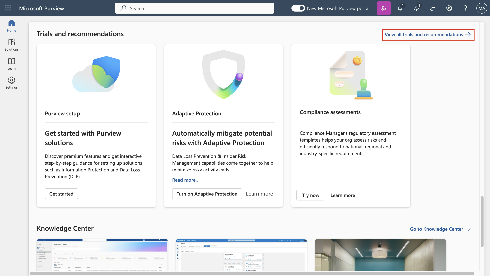
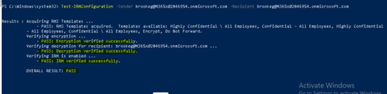
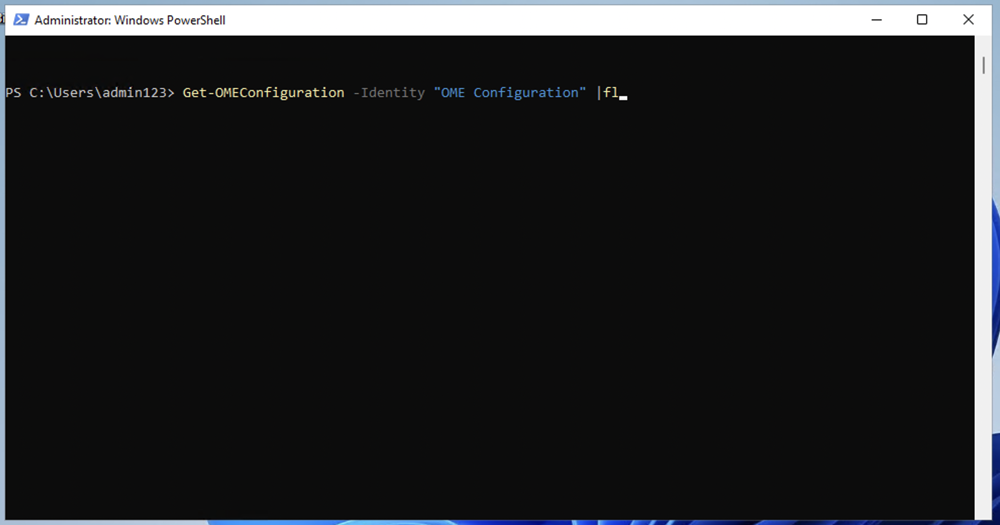
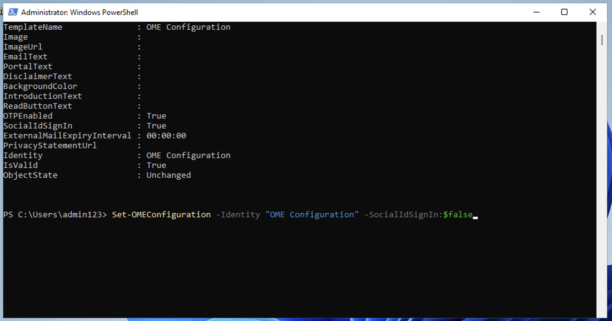
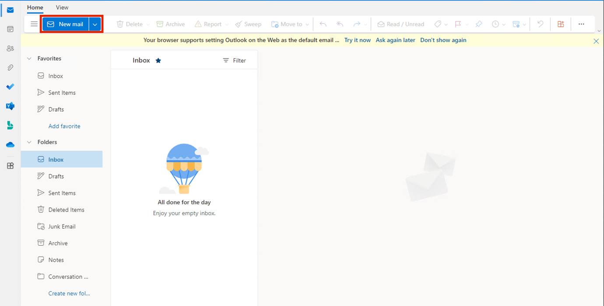
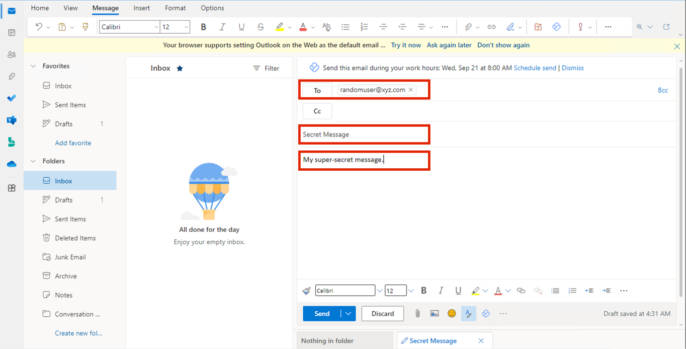
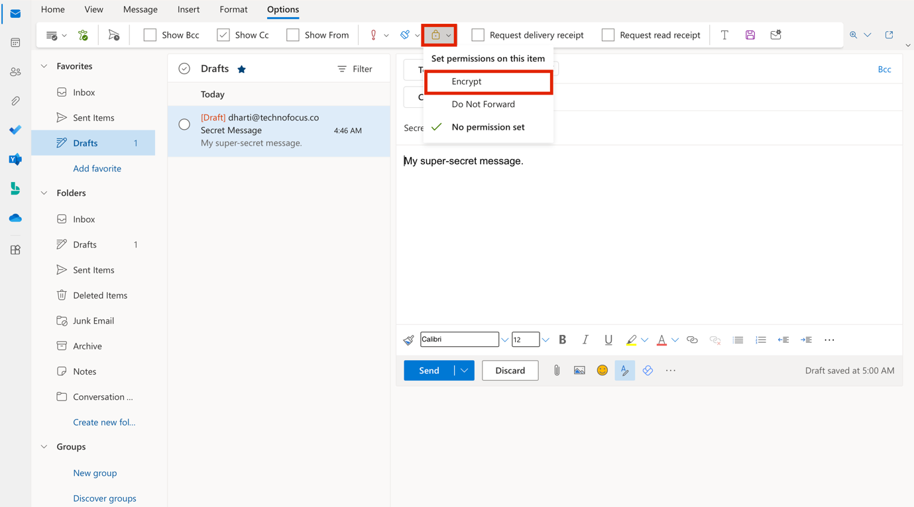
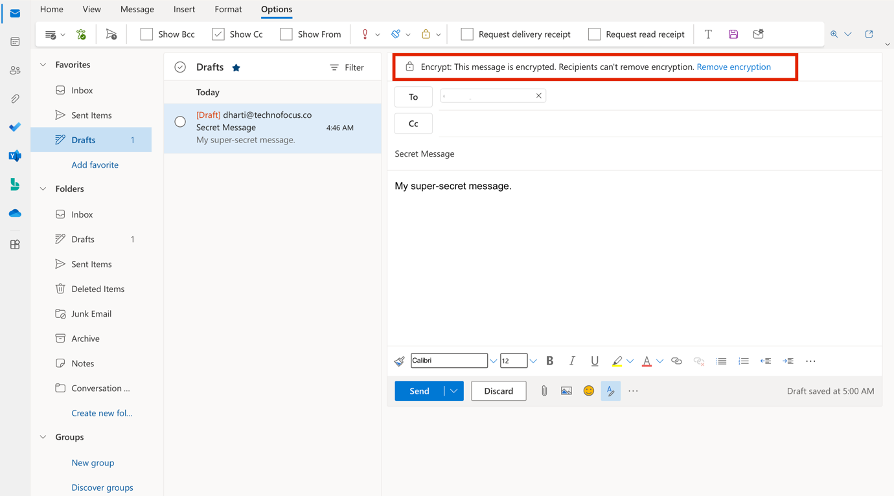
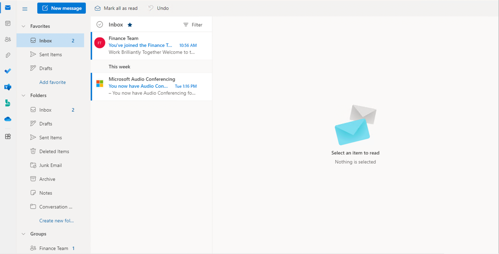

# **实验室 1：分配合规性角色并探索 Microsoft Purview 门户**

## **介绍**

Microsoft Purview 门户支持直接管理在 Microsoft Purview
中执行任务的用户的权限。使用门户“设置”中的“角色和范围”区域，可以跨
Purview
数据安全、数据治理以及风险和合规性解决方案管理用户的权限。您可以限制用户仅执行
您明确授予他们访问权限的特定任务。

## **目标**:

- 将经理和合规性角色分配给 Microsoft 365 中的用户。
- 创建用于团队协作的 Microsoft 365 和安全组。
- 启用 Microsoft Purview 合规性评估的试用版。
- 验证并配置 Azure RMS 以进行 Office 365 邮件加密。
- 修改默认 OME 模板以禁用社交 ID 访问。
- 测试无需社交登录的加密电子邮件传递。
- 为财务团队创建并应用自定义 OME 品牌模板。

## 练习 1 - 管理合规角色

在本练习中，我们将激活使用 Microsoft Purview
实现安全性所需的所有试用许可证。

### 任务 1 - 向现有用户添加经理角色。

1.  使用实验室的“**resources**”选项卡中提供的帐户详细信息登录到 VM。.

2.  使用管理用户名和管理密码登录到 Microsoft 365 admin center
    **+++https://admin.microsoft.com+++**。 

3.  从左窗格中，选择 **Users** \> **Active users**，然后单击第一个用户
    **Adele Vance**。

   

4.  在“**Manager**”下，单击“**Edit manager**”。 

   

5.  删除当前经理，然后在搜索框中键入 **Patti**。选择 **Patti
    Fernandez**。单击 **Save Changes**。 

   

6.  同样，将所有以下用户的经理更改为 Patti Fernandez。

   - Christie Cline
   - Megan Bowe

7.  对于 Patti Fernandez，**MOD Administrator** 添加为经理。

   

   

## 任务 2 – 添加合规性管理员

1.  选择用户 **Patti
    Fernandez**，在“**Account**”下，滚动到“**Roles**”，然后单击“**Manage
    roles**”。

   

2.  打开“**Roles**”窗格后，选中“**Admin center
    access**”附近的单选按钮，然后展开“**Show all by category**”。 

   

3.  滚动到“**Security & compliance**”，选中“**Compliance
    Administrator**”旁边的框，然后单击“**Save changes**”。

   

## 任务 3 – 在 Microsoft 管理中心创建团队和组

1.  现在，展开 **Teams & groups**，选择“**Active teams &
    groups**”，然后单击 Teams & Microsoft 365 groups 下的 **Add a
    Microsoft 365 group**  。

   

2.  对于名称，请使用 **+++Contoso**
    **Finance Team+++**，对于说明，请使用 **+++This team handles
    finance.+++**，然后单击“**Next**”。

   

3.  在 **Assign Owners** 页面上，单击 **Assign owners**，选中 **Adele
    Vance** 旁边的框，然后单击 **Add（1）。**单击 **Next**。

   

4.  在“**Add members** ”页面上，将 **Adele Vance**
    添加为成员，单击“**Next**”。在“**Add
    members** ”页上，选择“**Next**”。

5.  对于群组电子邮件地址，请使用 **+++contfosofinance+++** ，然后单击
    **Next**。

   

6.  单击 **Create group**。

   

7.  完成后，单击 **Close**。

   

8.  在“**Active teams & groups**”页上，选择“**Security
    groups** ”选项卡。选择“**Add a security group**”。

   

9.  重复这些步骤以使用以下信息创建另一个组。

- 在 **Set up the basics** 上，在 **Name**
  字段中输入以下内容：**+++EDM_DataUploaders+++**。在“Description”字段中，输入
  **+++People who will upload data for EDM+++** 数据的人员。

- 选择 **Next**。

- 在“**Settings**”页上，选择“**Next**”。

- 在  **Review and finish adding group**
  页面上，检查您的设置并选择**Create group** 。

- 当显示“**New group created**”页面时，选择新创建的
  **EDM_DataUploaders** 。 

   

- 单击“**Members**”选项卡，然后选择“**View all and manage
  owners**”者，并添加 **Patti Fernandez。**

  

  

- 同样，添加 **Christie Cline** 作为成员。

   

- 您已成功添加 **Christie Cline** 和 **Patti
  Fernandez**。现在，我们需要将 Patti Fernandez
  添加为该组的成员，因为她将在即将到来的实验中负责上传 EDM 数据。

   

- 在 **EDM_DataUploaders**
  窗格中的“**Member**”选项卡下，导航至“**Member**”部分，然后单击“**View
  all and manage members**”链接

   

- 在右侧出现的 **Members** 窗格中，单击“**+Add members**”

   

- 在搜索栏中输入**+++PattiF+++**并选择 **Patti Fernandez**，然后选择
  **Add** 按钮。

   

   

## 任务 4 – 启用合规性评估试用

1.  使用管理用户名和管理密码登录到 Purview 门户
    **+++https://purview.microsoft.com+++**。

2.  如果显示欢迎窗口，请同意条款并选择“**Get started** ”并关闭它。

    **注意：**如果您没有看到 **I agree to the terms of data flow disclosure and Privacy Statement**，请忽略并单击“**Get started**”按钮

   

3.  从导航栏中，选择 **Solutions** \> **Audit**。

   

4.  在“**Audit**”页上，选择“**Start recording user and admin
    activity** ”以激活审核日志记录。 

   

## 练习 2 - 管理 Office 365 邮件加密

Patti Fernandez 需要与她的试点团队一起配置和测试的第一个设置是
**Microsoft 365 built-in** **Office 365 Message Encryption
(OME)**。为此，她将修改默认模板并创建一个新的品牌模板，该模板将分配给其中一位试点用户。然后，试点用户将使用其帐户测试
OME 功能。

### 任务 1 – 验证 Azure RMS 功能

在此任务中，你将安装 **Exchange Online PowerShell** 模块，并验证租户的
Azure RMS 功能是否正确。

1.  通过使用鼠标右键选择“Windows”按钮打开提升的 **PowerShell**
    窗口，然后以管理员身份运行 **Windows PowerShell** 。

   

2.  使用“**Yes**”确认“**User Account Control** ”窗口。

3.  输入以下 cmdlet 以安装最新的 Exchange Online PowerShell 模块版本:

   **+++Install-ModuleExchangeOnlineManagement+++**

   

4.  确认“Untrusted repository security”对话框，用 **Y**
    表示“**Yes**”，然后按 **Enter**。此过程可能需要几秒钟才能完成。

   **注意：**如果在确认不受信任的存储库之前看到 NuGet 提供程序需要继续语句，请输入 **Y** 并按 **Enter** 按钮**。**

5.  输入以下 cmdlet 以更改执行策略，然后按 **Enter**

   **+++Set-ExecutionPolicy -ExecutionPolicy RemoteSigned -Scope CurrentUser+++**

   

6.  使用 **Y** 表示是确认执行策略更改，然后按 **Enter**。

   

7.  输入以下 cmdlet 以使用 **Exchange Online PowerShell**
    模块并连接到租户:

   **+++Connect-ExchangeOnline+++**

8.  显示“**Sign in** ”窗口时，使用“资源”选项卡上提供的用户名
    PattiF@WWLxXXXXXX.onmicrosoft.com 和用户密码以 **Patti
    Fernandez**身份登录。

   

   

如果 **Automatically sign in to all desktop apps and websites on this
device?**对话框出现，然后单击“**No, this app only**”按钮

   

9.  使用以下 cmdlet 验证是否已在租户中激活 Azure RMS 和 IRM，然后按
    **Enter**:

   **+++Get-IRMConfiguration | fl AzureRMSLicensingEnabled+++**

   

10. 当 **AzureRMSLicensingEnabled** 结果为 **True** 时，将为租户激活
    Azure RMS。继续下一步。

   

11. 使用以下 cmdlet 针对演示试点用户 **Adele Vance** 测试用于 Office 365
    邮件加密的 Azure RMS 模板 （将 WWLxXXXXXX
    替换为“resource”选项卡上提供的租户前缀）

   **+++Test-IRMConfiguration -Senderadelev@WWLxXXXXXX.onmicrosoft.com -Recipientadelev@WWLxXXXXX.onmicrosoft.com+++**

12. 验证所有测试都处于“PASS”状态，并且未显示任何错误。

   

13. 使 **PowerShell** 窗口保持打开状态。

    已成功安装 Exchange Online PowerShell 模块，连接到租户，并验证了 Azure RMS 的正确功能。

### 任务 2 – 修改默认 OME 模板

接下来，您的组织中需要限制对外部身份提供商（例如 Google 或
Facebook）的信任。由于默认情况下会激活这些社交 ID 以访问受 OME
保护的邮件，因此需要为组织中的所有用户停用社交 ID。

1.  运行以下 cmdlet 以查看默认 OME 配置:

   **+++Get-OMEConfiguration -Identity"OME Configuration" |fl+++**

   

2.  查看设置并确认 **SocialIdSignIn** 参数设置为 **True**。

   

3.  运行以下 cmdlet 以限制使用社交 ID 访问受 OME 保护的租户中的邮件:

   **Set-OMEConfiguration -Identity"OME Configuration" -SocialIdSignIn:$false**

4.  确认自定义默认模板的警告消息，其中 **Y** 表示是，然后按 Enter。

   

5.  再次检查默认配置并验证，

   **SocialIdSignIn** 参数现在设置为 **False**。

   **+++Get-OMEConfiguration -Identity"OME Configuration" |fl+++**

6.  请注意，结果应显示 **SocialIDSignInis** 设置为 **False**。

   

7.  保持 **PowerShell 窗口打开**，然后继续进行下一个练习。

   你已成功停用外部标识提供者的使用，例如 Office 365 邮件加密中的 Google 和 Facebook。

## 任务 3 – 测试修改后的 OME 模板

必须确认，当从租户用户那里收到受 Office 365
邮件加密保护的邮件时，外部收件人不会显示社交 ID
对话框，并且他们需要随时使用 OTP 访问加密内容。

1.  在 **Microsoft Edge** 中，打开“**New InPrivate
    Window** ”并导航到“**https://outlook.office.com** ”，然后使用“resources”选项卡上提供的用户名
    **AdeleV@WWLxXXXXXX.onmicrosoft.com** 和“用户密码”登录 Outlook
    网页版。

2.  在 **Stay signed in?** 对话框中，选中 **Don’t show this
    again** 复选框，然后选择 **No**。

3.  如果出现“**Save password** ”对话框，然后选择“**Save**”。

4.  如果 **Translate page from…** 窗口，选择向下箭头，然后选择 **Never
    translate from…**。

5.  如果您看到“**Your privacy
    matters**”对话框，请单击“**Continue**”按钮。

   

6.  从 Outlook 网页版的左上角部分选择“**New mail** ”。

   

7.  在“**To**”行中，输入不在租户域中的个人或其他第三方电子邮件地址。在主题行中输入
    **Secret Message** ，在正文中输入 **+++My super-secret
    message.+++** 。 

   

8.  从顶部窗格转到“**Options** ”窗格，选择“**Encrypt** ”以加密邮件。

   

9.  成功加密邮件后，您应该会看到一条通知，内容为“**Encrypt: This message
    is encrypted. Recipients can't remove encryption.”**。

   

10. 选择 **Send** 以发送消息。 

   

   在试用帐户中，您将没有发送任何电子邮件的权限，但您可以查看以下步骤，了解如何在拥有自己的许可证时测试模板。您的邮件将无法从您当前租户到达收件人。

11. 登录您的个人电子邮件帐户并打开来自 Adele Vance
    的消息。如果您将此电子邮件发送到Microsoft帐户（如
    @outlook.com），则加密可能会自动处理，您将自动看到该消息。

   

   **注意：**如果您将电子邮件发送到其他电子邮件服务，例如（@google.com），则可能需要执行后续步骤来处理加密并阅读邮件。您可能需要检查垃圾邮件文件夹中是否有该邮件。

12. 选择“**Read the message**”。 

13. 如果不激活社交 ID，则没有按钮可以使用您的 Google 帐户进行身份验证。

14. 选择“**Sign in with a One-time passcode** ”以接收限时密码。 

    

15. 转到您的个人电子邮件门户并打开主题为“**Your one-time passcode to
    view the message**。

   

16. 复制密码，将其粘贴到 OME 门户，然后选择“**Continue**”。

   

17. 查看加密邮件。

   

   您已成功测试已停用社交 ID 的修改后的默认 OME 模板。

### 任务 4 – 创建自定义品牌模板

组织财务部门发送的受保护邮件需要特殊品牌，包括自定义的介绍和正文以及页脚中的免责声明链接。财务消息也将在
7 天后过期。在此任务中，您将创建新的自定义 OME
配置，并创建传输规则，以将 OME 配置应用于从财务部门发送的所有邮件。

1.  在连接 Exchange Online 时保持打开状态的 PowerShell 窗口中，运行以下
    cmdlet 以创建新的 OME 配置:

   **+++New-OMEConfiguration -Identity"Finance Department" -ExternalMailExpiryInDays 7+++**

   

2.  确认自定义模板的警告消息，其中 Y 表示是，然后按 **Enter**。

   

3.  使用以下 cmdlet 更改简介文本消息:

   **+++Set-OMEConfiguration -Identity"Finance Department" -IntroductionText " from Contoso Ltd. finance department has sent you a secure message."+++**

   

4.  确认自定义模板的警告消息，其中 Y 表示是，然后按 **Enter**。

   

5.  使用以下 cmdlet 更改邮件的正文电子邮件文本:

   **+++Set-OMEConfiguration -Identity"Finance Department" -EmailText "Encrypted message sent from Contoso Ltd. finance department. Handle the content responsibly."+++**

6.  确认自定义模板的警告消息，其中 **Y** 表示是，然后按 **Enter**。

   

7.  更改免责声明 URL 以指向 Contoso 的隐私声明网站:

   **+++Set-OMEConfiguration -Identity "Finance Department" -PrivacyStatementURL"https://contoso.com/privacystatement.html"+++**

8.  确认自定义模板的警告消息，其中 **Y** 表示是，然后按 **Enter**。

   

9.  使用以下 cmdlet 创建邮件流规则，该规则将自定义 OME 模板应用于从
    Contoso 财务团队发送的所有邮件。此过程可能需要几秒钟才能完成。

   **+++New-TransportRule -Name "Encrypt all mails from Contoso Finance
team" -FromScopeInOrganization -FromMemberOf "Contoso Finance
Team"-ApplyRightsProtectionCustomizationTemplate"Finance
Department" -ApplyRightsProtectionTemplate Encrypt+++**

   

10. 键入以下 cmdlet 以验证更改。

   **+++Get-OMEConfiguration -Identity"Finance Department" | Format-List+++**

11. 使 **PowerShell** 保持 打开状态。

   你已成功创建新的传输规则，当财务部门的成员向外部收件人发送邮件时，该规则会自动应用自定义 OME 模板。

## 任务 5 – 测试自定义品牌模板

要验证新的自定义 OME 配置，您需要使用财务团队成员 Christie Cline
的帐户。在试用帐户中，您将没有发送任何电子邮件的权限，但您可以查看以下步骤，了解如何在拥有自己的许可证时测试模板。可以执行步骤
1 - 4，但邮件将无法从当前租户到达收件人。

1.  在 **Microsoft Edge** 中，打开“**New InPrivate
    Window** ”并导航到“**https://outlook.office.com** ”，然后使用“资源”选项卡上给出的用户名
    [**ChristieC@M365xXXXXXX.onmicrosoft.com**](mailto:ChristieC@M365xXXXXXX.onmicrosoft.com)
    和用户密码登录 Outlook 网页版。

   

2.  从 Outlook 网页版的左上角选择“**New message** ”。

3.  在“**To** ”行中，输入不在租户域中的个人或其他第三方电子邮件地址。在主题行中输入
    **Finance Report** ，然后输入 **Secret finance
    information**。到身体。

4.  选择 **Send** 以发送消息。 

5.  登录您在上面使用的电子邮件帐户并打开来自 Veronica Quek 的消息。

6.  您应该会看到来自 **Christie Cline** 的消息，如下图所示。选择“**Read
    the message**”。

   

7.  如果要阅读消息，请执行以下步骤。

    1.  点击 **Read the message**。选择“**Sign in with a One-time
        passcode** ”以接收限时密码。

    2.  转到您的个人电子邮件门户并打开主题为“**Your one-time passcode to
        view the message”**。.

    3.  复制密码，将其粘贴到 OME 门户，然后选择“**Continue**”。

    4.  查看具有自定义品牌的加密邮件。

   您已成功测试新的自定义 OME 模板

## **练习 3 - 启用自适应保护**

1. 在 Microsoft Purview
门户左侧导航窗格中，单击“**Solutions**”，然后导航并 选择“**nsider Risk
Management**”

   

2. 在“**Insider Risk Management**”窗格中，导航并单击“**Adaptive Protection**”，然后选择“**Adaptive Protection settings**”。现在，打开
   “Adaptive Protection”**开关**。

   

3. 单击“**Save**”按钮。

   

4. 启用自适应保护需要一些时间。我们将在第 5
   个实验中探索自适应保护功能。

   

## **总结**

在本实验室中，你配置了基础合规性设置，并探索了用于数据保护的 Microsoft
Purview 功能。首先，创建用户，为他们分配适当的角色
（，如经理和合规性管理员） ，并设置 Microsoft 365 组和安全组以模拟
Contoso 的组织结构。

然后，你启用了合规性功能的试用版，并在 Microsoft Purview
中激活了审核日志记录。该实验室继续配置和测试 **Office 365 Message
Encryption (OME)**，方法是修改默认模板以禁用社交 ID
访问，并为财务部门创建 **custom branded OME
configuration**，并通过传输规则强制实施。最后，你在 Purview 的“under
Insider Risk Management”下启用了 **Adaptive
Protection**，为智能的、基于风险的数据保护策略奠定了基础，以便在以后的实验室中进一步探索。

