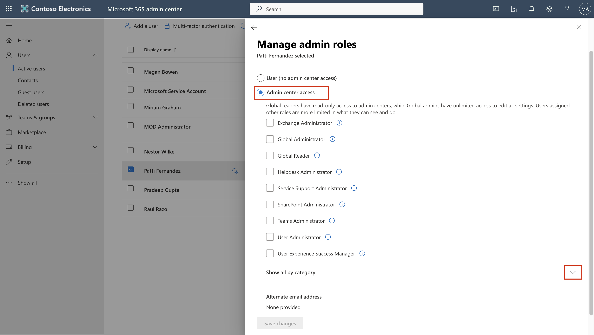
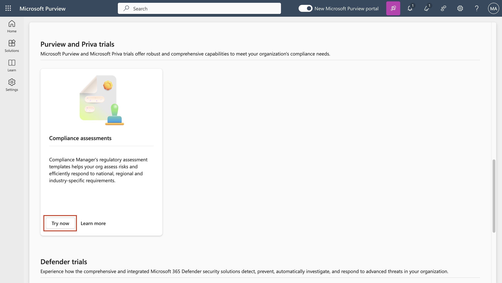
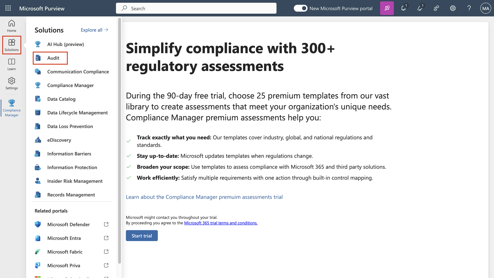
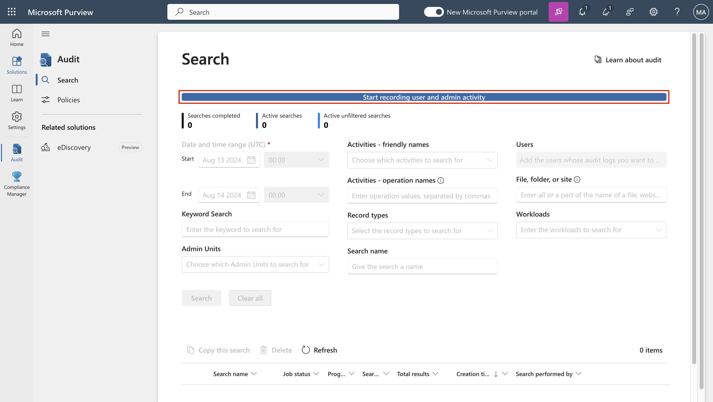
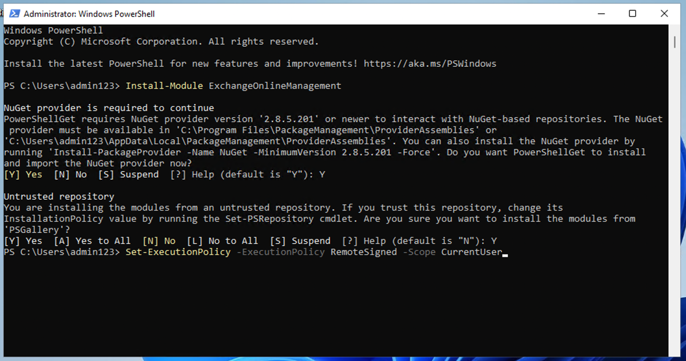

# **实验室 1：分配合规性角色并探索 Microsoft Purview 门户**

## **介绍**

Microsoft Purview 门户支持直接管理在 Microsoft Purview
中执行任务的用户的权限。使用门户“设置”中的“角色和范围”区域，可以跨
Purview
数据安全、数据治理以及风险和合规性解决方案管理用户的权限。您可以限制用户仅执行
您明确授予他们访问权限的特定任务。

## **目标**:

- 将经理和合规性角色分配给 Microsoft 365 中的用户。
- 创建用于团队协作的 Microsoft 365 和安全组。
- 启用 Microsoft Purview 合规性评估的试用版。。

重要提示：如果在执行任何命令时遇到错误，请与提供的截图进行核对。有时，错误可能是由于粘贴命令时的格式问题引起的。

## 练习 1 - 管理合规角色

在本练习中，我们将激活使用 Microsoft Purview
实现安全性所需的所有试用许可证。

### 任务 1 - 向现有用户添加经理角色。

1.  使用实验室的“**resources**”选项卡中提供的帐户详细信息登录到 VM。.

2.  使用管理用户名和管理密码登录到 Microsoft 365 admin center
    **+++https://admin.microsoft.com+++**。 

3.  从左窗格中，选择 **Users** \> **Active users**，然后单击第一个用户
    **Adele Vance**。

   

4.  在“**Manager**”下，单击“**Edit manager**”。 

   

5.  删除当前经理，然后在搜索框中键入 **Patti**。选择 **Patti
    Fernandez**。单击 **Save Changes**。 

   

6.  同样，将所有以下用户的经理更改为 Patti Fernandez。

   - Christie Cline
   - Megan Bowe

7.  对于 Patti Fernandez，**MOD Administrator** 添加为经理。

   

   

## 任务 2 – 添加合规性管理员

1.  选择用户 **Patti
    Fernandez**，在“**Account**”下，滚动到“**Roles**”，然后单击“**Manage
    roles**”。

   

2.  打开“**Roles**”窗格后，选中“**Admin center
    access**”附近的单选按钮，然后展开“**Show all by category**”。 

   

3.  滚动到“**Security & compliance**”，选中“**Compliance
    Administrator**”旁边的框，然后单击“**Save changes**”。

   

## 任务 3 – 在 Microsoft 管理中心创建团队和组

1.  现在，展开 **Teams & groups**，选择“**Active teams &
    groups**”，然后单击 Teams & Microsoft 365 groups 下的 **Add a
    Microsoft 365 group**  。

   

2.  对于名称，请使用 **+++Contoso**
    **Finance Team+++**，对于说明，请使用 **+++This team handles
    finance.+++**，然后单击“**Next**”。

   

3.  在 **Assign Owners** 页面上，单击 **Assign owners**，选中 **Adele
    Vance** 旁边的框，然后单击 **Add（1）。**单击 **Next**。

   

4.  在“**Add members** ”页面上，将 **Adele Vance**
    添加为成员，单击“**Next**”。在“**Add
    members** ”页上，选择“**Next**”。

5.  对于群组电子邮件地址，请使用 **+++contfosofinance+++** ，然后单击
    **Next**。

   

6.  单击 **Create group**。

   

7.  完成后，单击 **Close**。

   

8.  在“**Active teams & groups**”页上，选择“**Security
    groups** ”选项卡。选择“**Add a security group**”。

   

9.  重复这些步骤以使用以下信息创建另一个组。

- 在 **Set up the basics** 上，在 **Name**
  字段中输入以下内容：**+++EDM_DataUploaders+++**。在“Description”字段中，输入
  **+++People who will upload data for EDM+++** 数据的人员。

- 选择 **Next**。

- 在“**Settings**”页上，选择“**Next**”。

- 在  **Review and finish adding group**
  页面上，检查您的设置并选择**Create group** 。

- 当显示“**New group created**”页面时，选择新创建的
  **EDM_DataUploaders** 。 

   

- 单击“**Members**”选项卡，然后选择“**View all and manage
  owners**”者，并添加 **Patti Fernandez。**

  

  

- 同样，添加 **Christie Cline** 作为成员。

   

- 您已成功添加 **Christie Cline** 和 **Patti
  Fernandez**。现在，我们需要将 Patti Fernandez
  添加为该组的成员，因为她将在即将到来的实验中负责上传 EDM 数据。

   

- 在 **EDM_DataUploaders**
  窗格中的“**Member**”选项卡下，导航至“**Member**”部分，然后单击“**View
  all and manage members**”链接

   

- 在右侧出现的 **Members** 窗格中，单击“**+Add members**”

   

- 在搜索栏中输入**+++PattiF+++**并选择 **Patti Fernandez**，然后选择
  **Add** 按钮。

   

   

## 任务 4 – 启用合规性评估试用

1.  使用管理用户名和管理密码登录到 Purview 门户
    **+++https://purview.microsoft.com+++**。

2.  如果显示欢迎窗口，请同意条款并选择“**Get started** ”并关闭它。

    **注意：**如果您没有看到 **I agree to the terms of data flow disclosure and Privacy Statement**，请忽略并单击“**Get started**”按钮

   

3.  从导航栏中，选择 **Solutions** \> **Audit**。

   

4.  在“**Audit**”页上，选择“**Start recording user and admin
    activity** ”以激活审核日志记录。 

   

## **总结**

在本实验室中，你配置了基础合规性设置，并探索了用于数据保护的 Microsoft
Purview 功能。首先，创建用户，为他们分配适当的角色
（，如经理和合规性管理员） ，并设置 Microsoft 365 组和安全组以模拟
Contoso 的组织结构。

