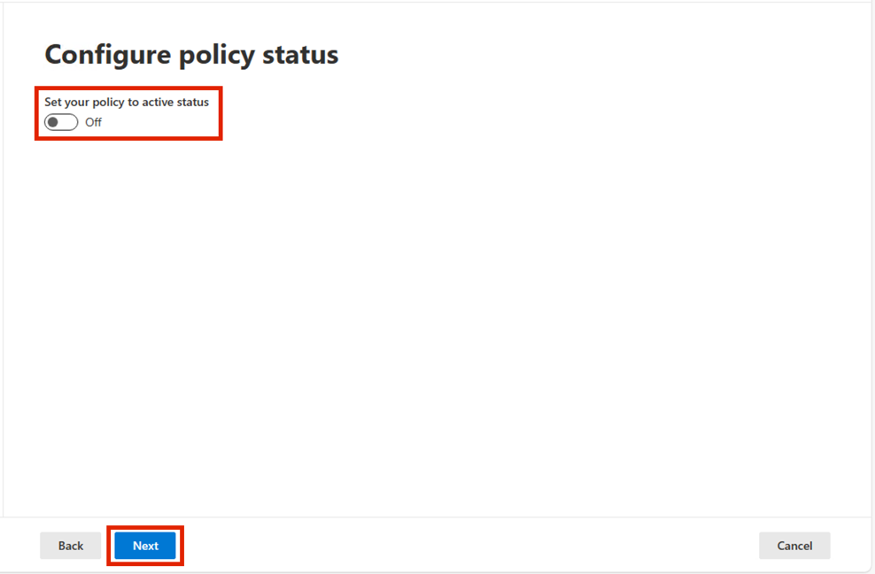
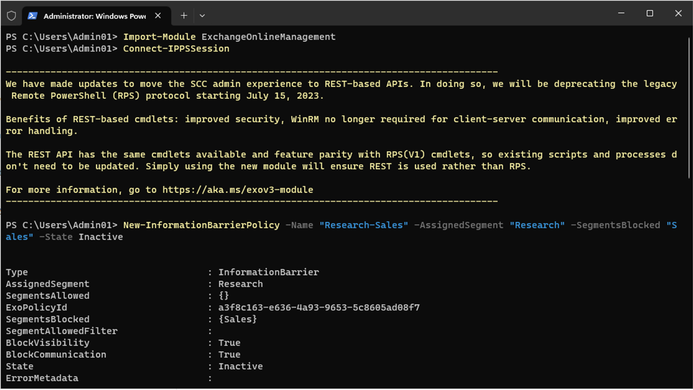

# 实验 10 – 配置信息屏障

## 目的：

Contoso
有五个部门：*人力资源*、*销售*、*市场营销*、*研究和制造*。为了保持符合行业法规，某些部门的用户不应与其他部门通信，如下表所示:

[TABLE]

对于此结构，Contoso 的计划包括三个 IB 策略:

1.  旨在阻止销售人员与 Research 沟通的 IB 政策

2.  阻止 Research 与 Sales 通信的另一项 IB 策略。

3.  一种 IB 策略，旨在允许 Manufacturing 仅与 HR 和 Marketing 进行通信。

## 练习 1 – 先决条件

### 任务 1 – 为组织中的用户创建细分

1.  在 VM 上， 以管理员身份运行 **PowerShell**。

BrokenImage

2.  运行以下命令:

`Install-Module ExchangeOnlineManagement`

3.  如果系统提示**Do you want PowerShellGet to install and import the
    NuGet provider now?**’ 和‘**Are you sure you want to install the
    modules from ‘PSGallery’?**’键入 **y** 并按 Enter。

自动生成的计算机 Description 的屏幕截图

4.  安装完成后，运行以下命令。

`Import-Module ``ExchangeOnlineManagement`

自动生成的计算机 Description 的屏幕截图

5.  现在运行以下命令以连接到 Exchange Online。

`Connect-``IPPSSession`

自动生成的计算机 Description 的屏幕截图

6.  使用 实验室环境主页上提供的 MOD Administrator 凭证登录。

BrokenImage

7.  在 **PowerShell** 中逐个运行以下命令 以创建组织结构。

`New-``OrganizationSegment`` -Name "HR" -``UserGroupFilter`` "Department -eq 'HR'"`

BrokenImage

`New-OrganizationSegment -Name "Sales" -UserGroupFilter "Department -eq 'Sales'"`

`New-OrganizationSegment -Name "Marketing" -UserGroupFilter "Department -eq 'Marketing'"`

`New-OrganizationSegment -Name "Research" -UserGroupFilter "Department -eq 'Research'"`

`New-OrganizationSegment -Name "Manufacturing" -UserGroupFilter "Department -eq 'Manufacturing'"`

### 任务 2 – 在 Microsoft Teams 中启用范围目录搜索

打开按名称搜索

1.  转到 Microsoft Teams 管理中心，转到
    `https://admin.teams.microsoft.com`，选择 **Teams** \> **Teams
    settings**。

自动生成的计算机 Description 的屏幕截图

2.  在 **Search by name下**，在 Scope **directory search using an
    Exchange address book** 旁边，打开开关 **On**。选择 **Save** 。

自动生成的计算机 Description 的屏幕截图

## 练习 2 – 创建 IB 策略

### 任务 1 – 阻止段之间的通信

1.  `使用`` MOD Administration ``的凭证登录`` ``https://purview.microsoft.com/``，该凭证在环境的 resources ``选项卡上提供``。`

2.  在左侧导航窗格中，选择 **Solutions** \> **Information barriers**。

3.  在子导航中，选择 **Policies**。在 **Policies** 页面上，选择 **Create
    policy** 以创建和配置新的 IB 策略。

自动生成的计算机 Description 的屏幕截图

4.  在 **Name** 页面上，输入策略的名称 — `Sales-Research`。然后选择
    **Next**。

自动生成的计算机 Description 的屏幕截图

5.  在 **Assigned segment** 页面上，选择 **Choose segment**。 **在 On
    Select assigned segment for this policy** 窗格中，选择
    Sales。现在，选择 **Add**
    将所选区段添加到策略中。您只能选择一个区段。

自动生成的计算机 Description 的屏幕截图

6.  选择 **Next**。

自动生成的计算机 Description 的屏幕截图

7.  在 **Communication and collaboration**下，选择 **Blocked**。选择
    **Choose segment**，选择 **Research** ，然后选择 **Add。**

自动生成的计算机 Description 的屏幕截图

8.  在 **Communication and collaboration 页面上，在 Communication and
    collaboration** 字段中选择策略类型 **Blocked**。选择 **Next**。

自动生成的计算机 Description 的屏幕截图

9.  在 **Policy status** 页面上，将活动策略状态切换为 **On**。选择
    **Next** 继续。

BrokenImage

10. 在 **Review your settings**
    页面上，查看您为策略选择的设置以及针对您的选择的任何建议或警告。选择
    **Edit** 以更改任何策略分段和状态，或选择 **Submit** 以创建策略。

BrokenImage

11. 选择 **Done** 创建 策略后。

自动生成的计算机 Description 的屏幕截图

### 任务 2 – 通过 PowerShell 创建 IB 策略

1.  在 VM 上， 以管理员身份运行 PowerShell。

BrokenImage

2.  运行以下命令:

`Import-Module ExchangeOnlineManagement`

自动生成的计算机 Description 的屏幕截图

3.  现在运行以下命令以连接到 Exchange Online。

`Connect-``IPPSSession`

自动生成的计算机 Description 的屏幕截图

4.  使用 实验室环境资源页面上提供的 **MOD Administrator**凭证登录。

5.  运行以下命令以创建名为 **Research-Sales** 的 IB
    策略。当此策略处于活动状态并应用时，它将有助于阻止 **Research**
    区段中的用户与 **Sales** 区段中的用户通信。

`New-``InformationBarrierPolicy`` -Name "Research-Sales" -``AssignedSegment`` "Research" -SegmentsBlocked "Sales" -State Inactive`

BrokenImage

6.  运行以下命令以创建名为 **Manufacturing-HRMarketing** 的 IB
    策略。当此策略处于活动状态并应用时，**Manufacturing** 部门只能与
    **HR** 和 **Marketing**
    进行通信。人力资源和营销部门不受与其他部门交流的限制..

`New-``InformationBarrierPolicy`` -Name "Manufacturing-``HRMarketing``" -``AssignedSegment`` "Manufacturing" -SegmentsAllowed "HR","Marketing","Manufacturing" -State Inactive`

自动生成的计算机程序说明的计算机屏幕截图

7.  `使用环境主页上提供的`` `**MOD Administration** 凭证登录
    https://purview.microsoft.com/。

8.  在左侧导航窗格中，选择 **Information barriers \> Policies**。在
    **Policies** 页面上。您将能够看到我们创建的策略。

## 练习 3 - 应用 IB 策略

1.  `使用`` MOD Administration ``的凭证登录`` ``https://purview.microsoft.com/``，该凭证在环境的 resources`` ``选项卡上提供``。`

2.  在左侧导航窗格中，选择 **Information barriers**。

3.  在子导航中，选择 **Policy applications**。选择 **Apply all
    policies**。

**总结：**

在本实验中，我们学习了如何创建区段以实施 IB
策略。我们创建了不同的策略，通过允许或阻止不同部门之间的通信和协作来创建信息屏障。
