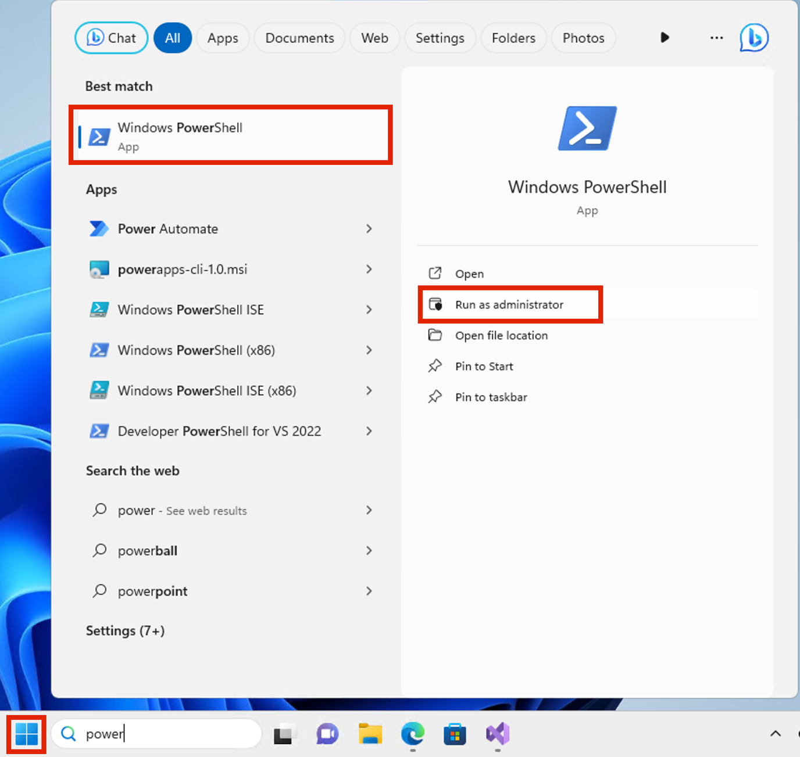

# Lab 10 – Configurazione delle barriere informative

## Obiettivo:

Contoso ha cinque reparti: *Risorse umane*, *Vendite*, *Marketing*,
*Ricerca* e *Produzione*. Per rimanere conformi alle normative del
settore, gli utenti di alcuni reparti non devono comunicare con altri
reparti, come elencato nella tabella seguente:

[TABLE]

Per questa struttura, il piano di Contoso include tre criteri IB:

1.  Una politica IB progettata per impedire alle vendite di comunicare
    con la ricerca

2.  Un'altra politica di IB per impedire a Recerca di comunicare con le
    vendite.

3.  Una politica IB progettata per consentire al settore Produzione di
    comunicare solo con le risorse umane e il marketing.

## Esercizio 1 – Prerequisiti

### Attività 1 - Creare un segmento per gli utenti dell'organizzazione

1.  Nella macchina virtuale, eseguire **PowerShell** come
    amministratore.

Immagine rotta

2.  Eseguire le operazioni seguenti:

Install-Module ExchangeOnlineManagement

3.  Se richiesto, viene visualizzato il messaggio ‘**Do you want
    PowerShellGet to install and import the NuGet provider now?**’ e
    ‘**Are you sure you want to install the modules from ‘PSGallery’?**’
    digitare **y** e premere invio.

Uno screenshot di un computer Descrizione generata automaticamente

4.  Eseguire il seguente comando una volta terminata l'installazione.

Import-Module ExchangeOnlineManagement

Uno screenshot di un computer Descrizione generata automaticamente

5.  Ora eseguire il seguente comando per connetterti a Exchange Online.

`Connect-IPPSSession`

Uno screenshot di un computer Descrizione generata automaticamente

6.  Accedere utilizzando le **credenziali di amministratore MOD**
    fornite nella home page dell'ambiente lab.

Immagine rotta

7.  Eseguire il comando seguente uno alla volta in **PowerShell** per
    creare la struttura organizzativa.

`New-OrganizationSegment -Name "HR" -UserGroupFilter "Department -eq 'HR'"`

Immagine rotta

New-OrganizationSegment -Name "Sales" -UserGroupFilter "Department -eq
'Sales'" 

New-OrganizationSegment -Name "Marketing" -UserGroupFilter "Department
-eq 'Marketing'" 

New-OrganizationSegment -Name "Research" -UserGroupFilter "Department
-eq 'Research'" 

New-OrganizationSegment -Name "Manufacturing" -UserGroupFilter
"Department -eq 'Manufacturing'`"`

### Attività 2 - Abilitare la ricerca di directory con ambito in Microsoft Teams

Per attivare la ricerca per nome

1.  Passare all'interfaccia di amministrazione di Microsoft Teams
    passando a `https://admin.teams.microsoft.com`, selezionare **Teams
    \> Teams settings**.

Uno screenshot di un computer Descrizione generata automaticamente

2.  In **Search by name**, accanto a **Scope directory search using an
    Exchange address book policy**, attivare l'interruttore (**On**).
    Selezionare **Save**.

Uno screenshot di un computer Descrizione generata automaticamente

## Esercizio 2 - Creazione di policy IB

### Attività 1 - Bloccare le comunicazioni tra i segmenti

1.  Accedere al `https://purview.microsoft.com/` utilizzando le
    credenziali per l'amministrazione MOD, fornite nella scheda delle
    risorse dell'ambiente.

2.  Nel riquadro di spostamento a sinistra, selezionare **Solutions \>
    Information barriers**.

3.  Nella navigazione secondaria selezionare **Policies**. Nella pagina
    **Policies** selezionare **Create policy** per creare e configurare
    una nuova policy IB.

Uno screenshot di un computer Descrizione generata automaticamente

4.  Nella pagina **Name** immettere un nome per il criterio:
    Sales-Research. Quindi selezionare **Next**.

Uno screenshot di un computer Descrizione generata automaticamente

5.  Nella pagina **Assigned segment**, seleziona **Choose segment**. In
    riquadro **Select assigned segment for this policy**, selezionare
    **Sales**. Selezionare ora **Add** per aggiungere il segmento
    selezionato al criterio. È possibile selezionare un solo segmento.

Uno screenshot di un computer Descrizione generata automaticamente

6.  Selezionare **Next**.

Uno screenshot di un computer Descrizione generata automaticamente

7.  In **Communication and collaboration,** selezionare **Blocked**.
    Selezionare **Choose segment**, selezionare **Research** e quindi
    selezionare **Add.**

Uno screenshot di un computer Descrizione generata automaticamente

8.  Nella pagina **Communication and collaboration,** selezionare il
    tipo di criterio **Blocked** nel campo **Communication and
    collaboration**. Selezionare **Next**.

Uno screenshot di un computer Descrizione generata automaticamente

9.  Nella pagina **Policy status,** impostare lo stato del criterio
    attivo su **On**. Selezionare **Next** per continuare.

Immagine rotta

10. Nella pagina **Review your settings** esaminare le impostazioni
    scelte per il criterio ed eventuali suggerimenti o avvisi per le
    selezioni. Selezionare **Edit** per modificare i segmenti e lo stato
    dei criteri oppure selezionare **Submit** per creare i criteri.

Immagine rotta

11. Selezionare **Done** dopo aver creato il criterio.

Uno screenshot di un computer Descrizione generata automaticamente

### Attività 2 - Creare criteri IB tramite PowerShell

1.  Nella macchina virtuale, eseguire **PowerShell** come
    amministratore.

Immagine rotta

2.  Eseguire le operazioni seguenti:

Import-Module ExchangeOnlineManagement

Uno screenshot di un computer Descrizione generata automaticamente

3.  Ora eseguire il seguente comando per connetterti a Exchange Online.

`Connect-IPPSSession`

Uno screenshot di un computer Descrizione generata automaticamente

4.  Accedere utilizzando le **credenziali di amministratore MOD**
    fornite nella pagina delle risorse dell'ambiente lab.

5.  Eseguire il comando seguente per creare un criterio IB denominato
    **Research-Sales**. Quando questo criterio è attivo e applicato,
    consente di impedire agli utenti che si trovano nel segmento
    **Research** di comunicare con gli utenti del segmento **Sales**.

New-InformationBarrierPolicy -Name "Research-Sales" -AssignedSegment
"Research" -SegmentsBlocked "Sales" -State Inactive

Immagine rotta

6.  Eseguire il comando seguente per creare un criterio IB denominato
    **Manufacturing-HRMarketing**. Quando questo criterio è attivo e
    applicato, il settore **Manufacturing** può comunicare solo con
    **HR** e **Marketing**. Le risorse umane e il marketing non sono
    limitati dalla comunicazione con altri segmenti.

New-InformationBarrierPolicy -Name "Manufacturing-HRMarketing"
-AssignedSegment "Manufacturing" -SegmentsAllowed
"HR","Marketing","Manufacturing" -State Inactive

Una schermata del computer di un programma per computer Descrizione
generata automaticamente

7.  Accedere al `https://purview.microsoft.com/` utilizzando le
    credenziali per **MOD Administration**, fornite nella home page del
    tuo ambiente.

8.  Nel riquadro di spostamento a sinistra, selezionare **Information
    barriers \> Policies**. Nella pagina **Policies**. Potrai vedere le
    politiche che abbiamo creato.

## Esercizio 3 – Applicare le politiche IB

1.  Accedere al `https://purview.microsoft.com/` utilizzando le
    credenziali per l'amministrazione MOD, fornite nella scheda delle
    risorse dell'ambiente.

2.  Nel riquadro di spostamento a sinistra, selezionare **Information
    barriers**.

3.  Nella navigazione secondaria, selezionare **Policy applications**.
    Selezionare **Apply all policies**.

**Sommario:**

In questo laboratorio abbiamo imparato come creare i segmenti per
implementare le policy IB. Abbiamo creato diverse politiche per creare
barriere informative consentendo o bloccando la comunicazione e la
collaborazione tra diversi segmenti.
