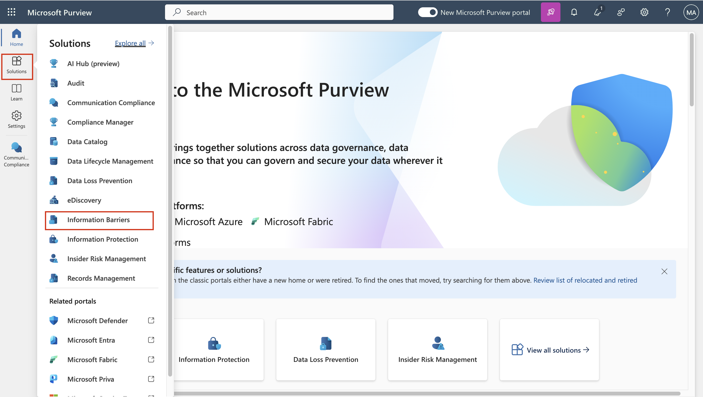
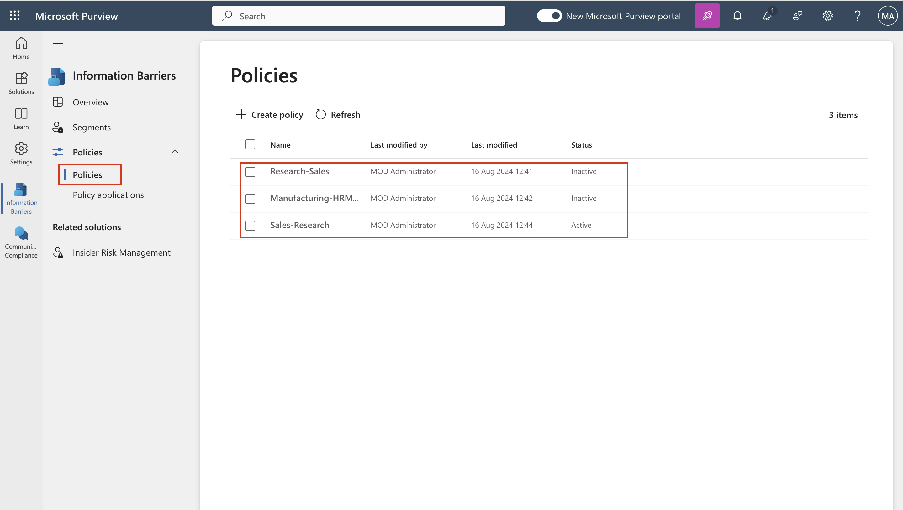

# Atelier 10 – Configuration des barrières d'information

## Objectif :

Contoso dispose de cinq départements : *RH,* *Ventes*, *Marketing*,
*Recherche* et *Fabrication*. Afin de rester en conformité avec les
réglementations du secteur, les utilisateurs de certains services ne
sont pas censés communiquer avec d'autres services, comme indiqué dans
le tableau suivant :

[TABLE]

Pour cette structure, le plan de Contoso comprend trois stratégies IB :

1.  Une politique de l'IB conçue pour empêcher les ventes de communiquer
    avec la recherche

2.  Une autre politique de l'IB visant à empêcher la recherche de
    communiquer avec le service commercial.

3.  Une politique de l'IB conçue pour permettre au secteur manufacturier
    de communiquer uniquement avec les RH et le marketing.

## Exercice 1 – Prérequis

### Tâche 1 – Créer un segment pour les utilisateurs de votre organisation

1.  Sur votre machine virtuelle, exécutez **PowerShell** en tant
    qu'administrateur.

2.  Exécutez ce qui suit :

`Install-Module ExchangeOnlineManagement`

3.  Si vous êtes invité à **‘Do you want PowerShellGet to install and
    import the NuGet provider now?’** et **‘Are you sure you want to
    install the modules from ‘PSGallery’?’** Tapez **y** et appuyez sur
    Entrée.

Une capture d'écran d'un ordinateur Description générée automatiquement

4.  Exécutez la commande suivante une fois l'installation terminée.

`Import-Module ``ExchangeOnlineManagement`

Une capture d'écran d'un ordinateur Description générée automatiquement

5.  Exécutez maintenant la commande suivante pour vous connecter à
    Exchange Online.

`Connect-``IPPSSession`

Une capture d'écran d'un ordinateur Description générée automatiquement

6.  Connectez-vous à l'aide des informations d'identification **MOD
    Administrator** fournies sur la page d'accueil de l'environnement de
    laboratoire.

7.  Exécutez la commande suivante une par une dans **PowerShell** pour
    créer la structure d'organisation.

`New-``OrganizationSegment`` -Name "HR" -``UserGroupFilter`` "Department -eq 'HR'"`

New-OrganizationSegment -Name "Sales" -UserGroupFilter "Department -eq
'Sales'"

New-OrganizationSegment -Name "Marketing" -UserGroupFilter "Department
-eq 'Marketing'"

New-OrganizationSegment -Name "Research" -UserGroupFilter "Department
-eq 'Research'"

### New-OrganizationSegment -Name "Manufacturing" -UserGroupFilter "Department -eq 'Manufacturing'"

### 

### Tâche 2 - Activer la recherche dans l'annuaire dans Microsoft Teams

Pour activer la recherche par nom

1.  Accédez au centre d'administration Microsoft Teams en accédant à
    `https://admin.teams.microsoft.com`, sélectionnez **Teams \> Teams
    settings**.

Une capture d'écran d'un ordinateur Description générée automatiquement

2.  Sous **Search by name**, à côté **Scope directory search using an
    Exchange address book policy**, activez l'option **On**.
    Sélectionnez **Save**.

Une capture d'écran d'un ordinateur Description générée automatiquement

## Exercice 2 – Créer des politiques de l'IB

### Tâche 1 – Bloquer les communications entre les segments

1.  Connectez-vous à l' `https://purview.microsoft.com/` à l'aide des
    informations d'identification pour l'administration MOD, fournies
    dans l'onglet des ressources de votre environnement.

2.  Dans le volet de navigation de gauche, sélectionnez **Solutions \>
    Information barriers**.

3.  Dans la sous-navigation, sélectionnez **Policies**. Sur la page
    **Policies**, sélectionnez **Create policy** pour créer et
    configurer une nouvelle stratégie IB.

Une capture d'écran d'un ordinateur Description générée automatiquement

4.  Sur la page **Name**, entrez un nom pour la stratégie :
    `Ventes-Recherche`. Sélectionnez ensuite **Next**.

Une capture d'écran d'un ordinateur Description générée automatiquement

5.  Sur la page **Assigned segment,** sélectionnez **Choose segment. On
    Select assigned segment for this policy**, sélectionnez Ventes.
    Sélectionnez maintenant **Add** pour ajouter le segment sélectionné
    à la stratégie. Vous ne pouvez sélectionner qu'un seul segment.

Une capture d'écran d'un ordinateur Description générée automatiquement

6.  Sélectionnez **Next**.

Une capture d'écran d'un ordinateur Description générée automatiquement

7.  Sous **Communication et collaboration**, sélectionnez **Blocked.**
    Sélectionnez **Choose segment**, **Research**, puis **Add.**

Une capture d'écran d'un ordinateur Description générée automatiquement

8.  Sur la page **Communication and collaboration**, sélectionnez le
    type de stratégie Bloqué dans le champ **Communication and
    collaboration**. Sélectionnez **Next**.

Une capture d'écran d'un ordinateur Description générée automatiquement

9.  Sur la page **Policy status**, basculez l'état de la stratégie
    active sur **On**. Sélectionnez **Next** pour continuer.

10. Sur la page **Review your settings**, passez en revue les paramètres
    que vous avez choisis pour la stratégie et les suggestions ou
    avertissements pour vos sélections. Sélectionnez **Edit** pour
    modifier les segments et l'état de la stratégie ou sélectionnez
    **Submit** pour créer la stratégie.

11. Sélectionnez **Done** une fois la stratégie créée.

Une capture d'écran d'un ordinateur Description générée automatiquement

### Tâche 2 – Créer des politiques IB via PowerShell

1.  Sur votre machine virtuelle, exécutez **PowerShell** en tant
    qu'administrateur.

2.  Exécutez ce qui suit :

`Import-Module ExchangeOnlineManagement`

Une capture d'écran d'un ordinateur Description générée automatiquement

3.  Exécutez maintenant la commande suivante pour vous connecter à
    Exchange Online.

`Connect-``IPPSSession`

Une capture d'écran d'un ordinateur Description générée automatiquement

4.  Connectez-vous à l'aide des informations d'identification **MOD
    Administrator** fournies sur la page des ressources de
    l'environnement de l’atelier.

5.  Exécutez la commande suivante pour créer une politique IB appelée
    **Research-Sales**. Lorsque cette politique est active et appliquée,
    elle permet d'empêcher les utilisateurs du segment **Research** de
    communiquer avec les utilisateurs du segment **Sales**.

`New-``InformationBarrierPolicy`` -Name "Research-Sales" -``AssignedSegment`` "Research" -``SegmentsBlocked`` "Sales" -State Inactive`

6.  Exécutez la commande suivante pour créer une stratégie IB appelée
    **Manufacturing-HRMarketing**. Lorsque cette politique est active et
    appliquée, le **secteur manufacturier** ne peut communiquer qu'avec
    **HR** et **le Marketing**. Les RH et le marketing ne sont pas
    limités dans la communication avec d'autres segments.

`New-``InformationBarrierPolicy`` -Name "Manufacturing-``HRMarketing``" -``AssignedSegment`` "Manufacturing" -``SegmentsAllowed`` "``HR","Marketing","Manufacturing``" -State Inactive`

Capture d'écran d'un programme d'ordinateur Description générée
automatiquement

7.  Connectez-vous à `https://purview.microsoft.com/` à l'aide des
    informations d'identification pour **MOD Administration**, fournies
    sur la page d'accueil de votre environnement.

8.  Dans le volet de navigation de gauche, sélectionnez **Information
    barriers \> Policies**. Sur la page **Policies**. Vous pourrez voir
    les politiques que nous avons créées.

## Exercice 3 – Appliquer les politiques de l'IB

1.  Connectez-vous à l' `https://purview.microsoft.com/` à l'aide des
    informations d'identification pour l'administration MOD, fournies
    dans l'onglet des ressources de votre environnement.

2.  Dans le volet de navigation de gauche, sélectionnez **Information
    barriers**.

3.  Dans le sous-volet de navigation, sélectionnez **Policy
    applications**. Sélectionnez **Apply all policies**.

**Résumé :**

Dans cet atelier, nous avons appris à créer les segments pour mettre en
œuvre les politiques de l'IB. Nous avons créé différentes politiques
pour créer des barrières à l'information en autorisant ou en bloquant la
communication et la collaboration entre les différents segments.
