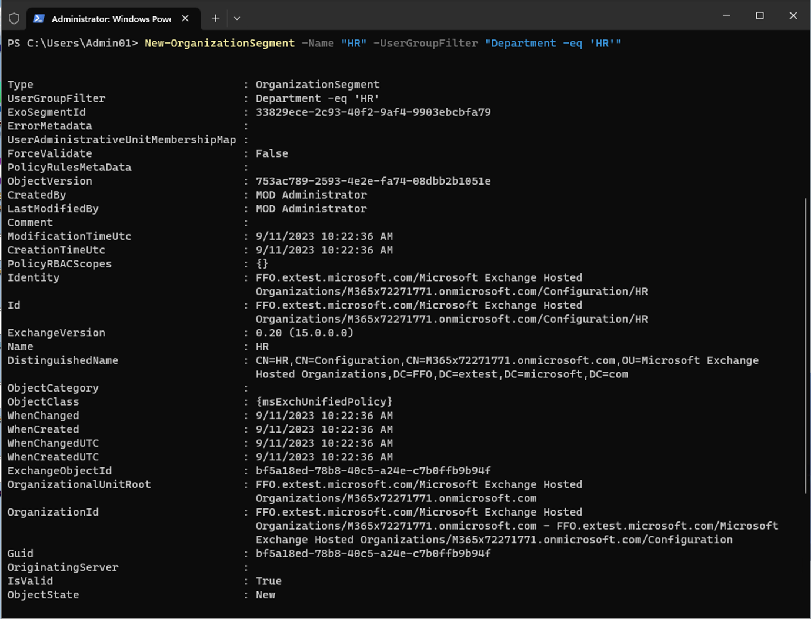
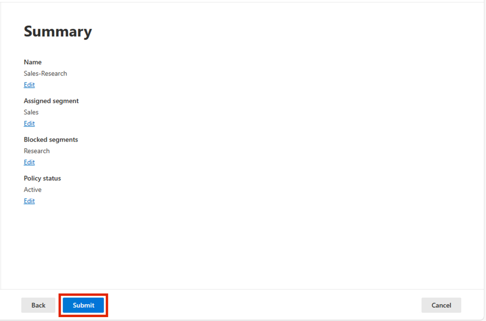

# 實驗 10 – 配置信息屏障

## 目的：

Contoso
有五個部門：*人力資源*、*銷售*、*市場營銷*、*研究和製造*。爲了保持符合行業法規，某些部門的用戶不應與其他部門通信，如下表所示:

[TABLE]

對于此結構，Contoso 的計劃包括三個 IB 策略:

1.  旨在阻止銷售人員與 Research 溝通的 IB 政策

2.  阻止 Research 與 Sales 通信的另一項 IB 策略。

3.  一種 IB 策略，旨在允許 Manufacturing 僅與 HR 和 Marketing 進行通信。

## 練習 1 – 先决條件

### 任務 1 – 爲組織中的用戶創建細分

1.  在 VM 上， 以管理員身份運行 **PowerShell**。

BrokenImage

2.  運行以下命令:

`Install-Module ``ExchangeOnlineManagement`

3.  如果系統提示**Do you want PowerShellGet to install and import the
    NuGet provider now?**’ 和‘**Are you sure you want to install the
    modules from ‘PSGallery’?**’鍵入 **y** 幷按 Enter。

自動生成的計算機 Description 的屏幕截圖

4.  安裝完成後，運行以下命令。

`Import-Module ``ExchangeOnlineManagement`

自動生成的計算機 Description 的屏幕截圖

5.  現在運行以下命令以連接到 Exchange Online。

`Connect-``IPPSSession`

自動生成的計算機 Description 的屏幕截圖

6.  使用 實驗室環境主頁上提供的 MOD Administrator 憑證登錄。

BrokenImage

7.  在 **PowerShell** 中逐個運行以下命令 以創建組織結構。

`New-``OrganizationSegment`` -Name "HR" -``UserGroupFilter`` "Department -eq 'HR'"`

BrokenImage

`New-``OrganizationSegment`` -Name "Sales" -``UserGroupFilter`` "Department -eq 'Sales'"`

`New-``OrganizationSegment`` -Name "Marketing" -``UserGroupFilter`` "Department -eq 'Marketing'"`

`New-``OrganizationSegment`` -Name "Research" -``UserGroupFilter`` "Department -eq 'Research'"`

`New-``OrganizationSegment`` -Name "Manufacturing" -``UserGroupFilter`` "Department -eq 'Manufacturing'"`

### 任務 2 – 在 Microsoft Teams 中啓用範圍目錄搜索

打開按名稱搜索

1.  轉到 Microsoft Teams 管理中心，轉到
    `https://admin.teams.microsoft.com`，選擇 **Teams** \> **Teams
    settings**。

自動生成的計算機 Description 的屏幕截圖

2.  在 **Search by name下**，在 Scope **directory search using an
    Exchange address book** 旁邊，打開開關 **On**。選擇 **Save** 。

自動生成的計算機 Description 的屏幕截圖

## 練習 2 – 創建 IB 策略

### 任務 1 – 阻止段之間的通信

1.  `使用`` MOD Administration ``的憑證登錄`` ``https://purview.microsoft.com/``，該憑證在環境的`` resources ``選項卡上提供``。`

2.  在左側導航窗格中，選擇 **Solutions** \> **Information barriers**。

3.  在子導航中，選擇 **Policies**。在 **Policies** 頁面上，選擇 **Create
    policy** 以創建和配置新的 IB 策略。

自動生成的計算機 Description 的屏幕截圖

4.  在 **Name** 頁面上，輸入策略的名稱 — `Sales-Research`。然後選擇
    **Next**。

自動生成的計算機 Description 的屏幕截圖

5.  在 **Assigned segment** 頁面上，選擇 **Choose segment**。 **在 On
    Select assigned segment for this policy** 窗格中，選擇
    Sales。現在，選擇 **Add**
    將所選區段添加到策略中。您只能選擇一個區段。

自動生成的計算機 Description 的屏幕截圖

6.  選擇 **Next**。

自動生成的計算機 Description 的屏幕截圖

7.  在 **Communication and collaboration**下，選擇 **Blocked**。選擇
    **Choose segment**，選擇 **Research** ，然後選擇 **Add。**

自動生成的計算機 Description 的屏幕截圖

8.  在 **Communication and collaboration 頁面上，在 Communication and
    collaboration** 字段中選擇策略類型 **Blocked**。選擇 **Next**。

自動生成的計算機 Description 的屏幕截圖

9.  在 **Policy status** 頁面上，將活動策略狀態切換爲 **On**。選擇
    **Next** 繼續。

BrokenImage

10. 在 **Review your settings**
    頁面上，查看您爲策略選擇的設置以及針對您的選擇的任何建議或警告。選擇
    **Edit** 以更改任何策略分段和狀態，或選擇 **Submit** 以創建策略。

BrokenImage

11. 選擇 **Done** 創建 策略後。

自動生成的計算機 Description 的屏幕截圖

### 任務 2 – 通過 PowerShell 創建 IB 策略

1.  在 VM 上， 以管理員身份運行 PowerShell。

BrokenImage

2.  運行以下命令:

`Import-Module ``ExchangeOnlineManagement`

自動生成的計算機 Description 的屏幕截圖

3.  現在運行以下命令以連接到 Exchange Online。

`Connect-``IPPSSession`

自動生成的計算機 Description 的屏幕截圖

4.  使用 實驗室環境資源頁面上提供的 **MOD Administrator**憑證登錄。

5.  運行以下命令以創建名爲 **Research-Sales** 的 IB
    策略。當此策略處于活動狀態幷應用時，它將有助于阻止 **Research**
    區段中的用戶與 **Sales** 區段中的用戶通信。

`New-``InformationBarrierPolicy`` -Name "Research-Sales" -``AssignedSegment`` "Research" -``SegmentsBlocked`` "Sales" -State Inactive`

BrokenImage

6.  運行以下命令以創建名爲 **Manufacturing-HRMarketing** 的 IB
    策略。當此策略處于活動狀態幷應用時，**Manufacturing** 部門只能與
    **HR** 和 **Marketing**
    進行通信。人力資源和營銷部門不受與其他部門交流的限制..

`New-``InformationBarrierPolicy`` -Name "Manufacturing-``HRMarketing``" -``AssignedSegment`` "Manufacturing" -``SegmentsAllowed`` "``HR","Marketing","Manufacturing``" -State Inactive`

自動生成的計算機程序說明的計算機屏幕截圖

7.  `使用環境主頁上提供的`` `**MOD Administration** 憑證登錄
    https://purview.microsoft.com/。

8.  在左側導航窗格中，選擇 **Information barriers \> Policies**。在
    **Policies** 頁面上。您將能够看到我們創建的策略。

## 練習 3 - 應用 IB 策略

1.  `使用`` MOD Administration ``的憑證登錄`` ``https://purview.microsoft.com/``，該憑證在環境的`` resources ``選項卡上提供。`

2.  在左側導航窗格中，選擇 **Information barriers**。

3.  在子導航中，選擇 **Policy applications**。選擇 **Apply all
    policies**。

**總結：**

在本實驗中，我們學習了如何創建區段以實施 IB
策略。我們創建了不同的策略，通過允許或阻止不同部門之間的通信和協作來創建信息屏障。
