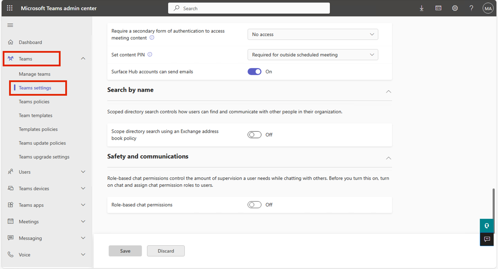
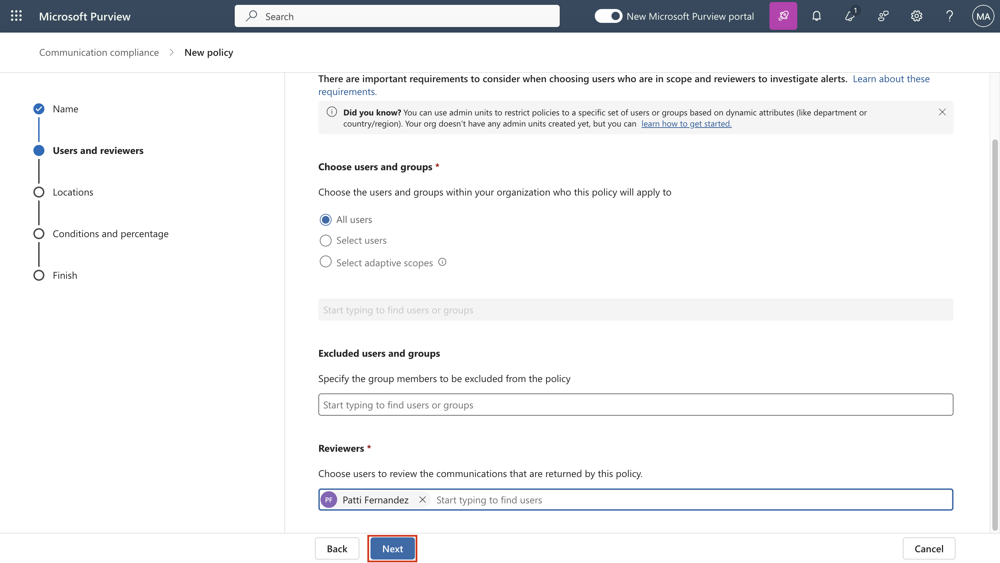

# **ラボ 10: Microsoft Purview を使用して Fabric と Power BI でSensitivity Labelを適用する**

**紹介**

FabricおよびPower BI（Power BI Desktopを含む）のMicrosoft Purview
Information ProtectionのSensitivity
labelsをテナントで有効にする必要があります。Sensitivity
labelsを有効にすると、次のようになります。

- 組織内の指定されたユーザーとセキュリティグループは、 Fabric
  コンテンツにSensitivity labelsを適用できます。Fabric
  サービスでは、これは任意の Fabric アイテムを意味します。Power BI
  Desktop では、 .pbixファイルを意味します。

- サービスでは、組織のすべてのメンバーがラベルを閲覧できます。デスクトップでは、ラベルが公開されている組織のメンバーのみがラベルを閲覧できます。

**目的**

- Microsoft Purview を使用して、Microsoft Fabric で手動のSensitivity
  labels ポリシーを有効にし、優先順位を付けます。

**演習 1: Microsoft Fabric の試用版をアクティブ化し、Purview Hub
にアクセスする**

1.  Edge ブラウザーのアドレス バーを開き、次の URL を入力して Fabric
    ポータルを開きます -

  **+++https://app.fabric.microsoft.com+++**

  

**注**: Fabric ポータルに直接アクセスする場合は、手順 2 と 3
をスキップしてください。

2.  テナントの資格情報を入力します。

    

    

3.  パスワード欄にテナントパスワードを入力します。次に、「**Sign
    in」**ボタンをクリックします。

    

4.  **Welcome to the Fabric view**ダイアログ
    ボックスで、\[**Cancel\]**ボタンをクリックします。

    

5.  コマンドバーのプロフィール アイコンをクリックします。

    

6.  **「Free trial」**ボタンに移動してクリックします。

    

7.  **Activate your 60-day free Fabric trial capacity - Trial capacity
    region**で**、Default – West US
    3**リージョンが選択されていることを確認し、
    **Activate**ボタンをクリックします。

    

8.  **Successfully upgraded to a free Microsoft Fabric trial**ダイアログ
    ボックスで、 **\[Got it\]**ボタンをクリックします。

    

9.  コマンド バーの**\[設定\]**ギア ボックスをクリックします。

    

10. Governance and insightsのセクションに移動し、 **Microsoft Purview
    hub (preview)**リンクをクリックします。

    

11. **Microsoft Purview hub (preview)**ページで、 **\[Information
    Protection\]**タイルをクリックします。

    

12. **Pick an account**ダイアログ ボックスが表示された場合、テナント ID
    を選択します。

    

13. **Welcome to Information Protection in the new Microsoft Purview
    portal**ダイアログ ボックスが表示された場合は、 **\[Get
    started\]**ボタンをクリックします。

    

**演習 2: Fabric と Power BI 向けのSensitivity labels
ポリシーを作成して構成する**

1.  \[Information Protection\] ブレードで、
    **\[Policies\]**の横にあるドロップダウンに移動してクリックします。

    

2.  次に、 **Label publishing policies**をクリックします。 **Label
    policies**ページで、 **Publish label**をクリックします。

    

3.  **Create policyページ**で、「**Choose sensitivity label to
    publish」**リンクに移動してクリックします。

    

4.  **Sensitivity label to
    publish**ペインが右側に表示されるので、移動して**「Confidential」**の横にあるチェックボックスを選択し、
    「**Add**」ボタンをクリックします。

    

5.  次に、 **「Next」**ボタンをクリックします。

    

6.  **Assign admin units**ページで、 **Next**ボタンをクリックします。

    

7.  **Publish to users and groupsページ**で、 **Users and
    groups**の横にあるチェックボックスが選択されていることを確認し、
    **\[Next\]**ボタンをクリックします。

    

8.  **Policy settings**ページで、 **Require users to apply a label to
    their Fabric and Power BI
    content**の横にあるチェックボックスを選択します。次に、
    **「Next」**ボタンをクリックします。

    

    

9.  **Default settings for documents – Apply a default label to
    documents**ページで、 **\[Next\]**ボタンをクリックします。

    

10. **Default settings for documents – Apply a default label to
    emails**ページで、 **\[Next\]**ボタンをクリックします。

    

11. **Default settings for meetings and calendar eventsページ**で、
    **\[Next\]**ボタンをクリックします。

    

12. **Default settings for Fabric and Power BI contentページ**で、
    **\[Next\]**ボタンをクリックします。

    

13. **Name your policy**ページの**Name**欄に、**+++Manual Labeling – HR
    Confidential
    Docs+++**と入力します。「**Next」**ボタンをクリックします。

    

14. **Review and finishページ**で、
    **「Submit」**ボタンをクリックします。

    

15. ポリシーが正常に作成されました。「**Done」**ボタンをクリックしてください。

    

16. **Label policies**ページに、**Manual Labeling – HR Confidential
    Docs**ポリシーが正常に作成されたことが表示されます。

    

17. **Manual Labeling – HR Confidential
    Docs**を選択し、水平の省略記号をクリックして移動し、「**Move
    up」**を選択して優先度を変更します。

    

    

18. もう一度、 **\[Manual Labeling – HR Confidential
    Docs\]**を選択し、その横にある水平の省略記号をクリックして、
    **\[Move up\]を選択します**。

    

19. **Manual Labeling – HR Confidential Docs**の優先度が 1
    に変更されていることがわかります。

    

**まとめ**

このラボでは、Microsoft Fabric の試用版を有効化し、Microsoft Purview
ポータルにアクセスし、ユーザーに Fabric および Power BI
コンテンツに「Confidential」ラベルを適用させるよう必須のsensitivity
labelポリシーを作成しました。。その後、ポリシーの適用優先順位を設定しました。

