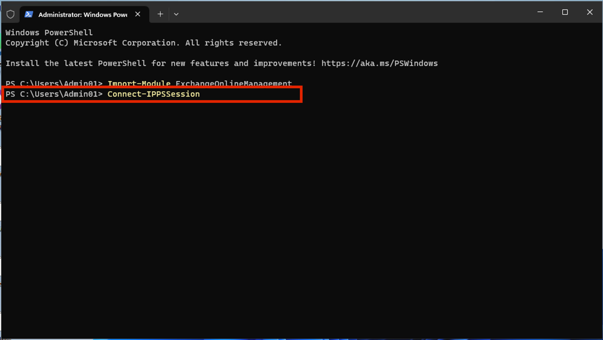
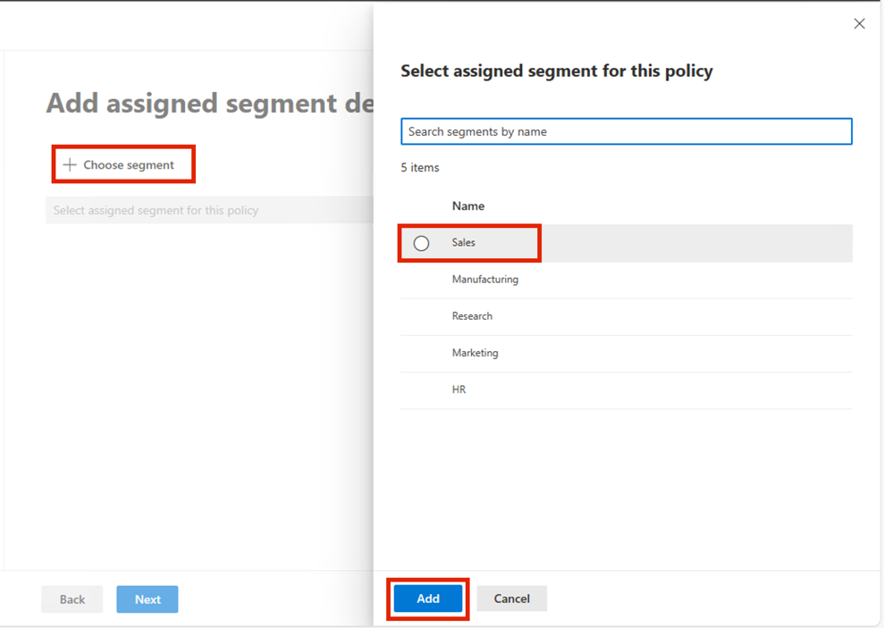
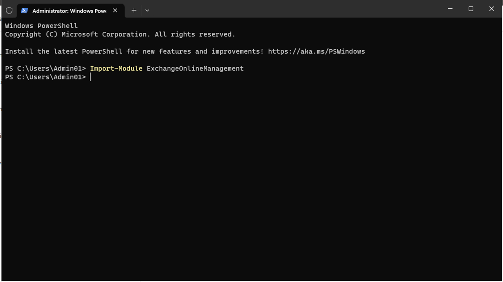
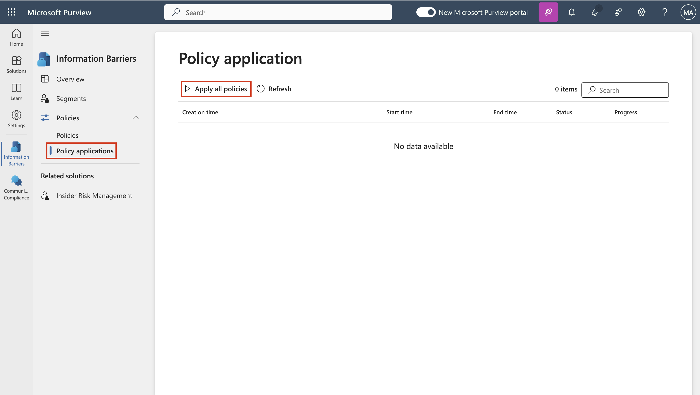

# **实验室 10_使用 Microsoft Purview 在 Fabric 和 Power BI 中强制执行敏感度标签**

**介绍**

必须在租户上启用 Fabric 和 Power BI （包括 Power BI Desktop） 中
Microsoft Purview 信息保护中的 Sensitivity labels。启用敏感度标签时:

- 组织中的指定用户和安全组可以将敏感度标签应用于其 Fabric 内容。在
  Fabric 服务中，这意味着任何 Fabric 项。在 Power BI Desktop
  中，它表示其 .pbix 文件。

- 在服务中，组织的所有成员都可以看到这些标签。在 Desktop
  中，只有已发布标签的组织成员才能看到标签。

**目的**

- 使用 Microsoft Purview 在 Microsoft Fabric
  中启用手动敏感度标签策略并确定其优先级。

**练习 1：激活 Microsoft Fabric 试用版并访问 Purview 中心**

1.  打开 Edge 浏览器地址栏并输入以下 URL 以打开 Fabric 门户-

    +++https://app.fabric.microsoft.com+++

    

**注意**：如果直接登陆 Fabric 门户，请跳过步骤 \#2 和 3。

2.  输入租户凭据。

    

    

3.  在密码字段中，输入租户密码。然后，单击“**Sign in**”按钮。

    

4.  在“**Welcome to the Fabric view**”对话框中，单击“**Cancel**”按钮。

    

5.  单击命令栏上的配置文件图标。

    

6.  导航并单击 **Free trial** 按钮。

    

7.  在“**Activate your 60-day free Fabric trial capacity** - **Trial
    capacity region**”区域中，确保选择“**Default – West US
    3**”区域，然后单击“**Activate**”按钮。

    

8.  在“**Successfully upgraded to a free Microsoft Fabric
    trial**”对话框中，单击“**Got it**”按钮。

    

9.  单击命令栏中的“**Settings**”齿轮框。

    

10. 导航到“治理和见解”部分，然后单击“**Microsoft Purview hub
    (preview)**链接。

    

11. 在 **Microsoft Purview hub (preview)**页中，单击 “**Information
    Protection** ”磁贴。

    

12. 如果出现“**Pick an account**”对话框，然后选择租户 ID。

    

13. 如果在 **Welcome to Information Protection in the new Microsoft
    Purview portal** 对话框中，请单击“**Get started**”按钮。.

    

**练习 2：创建和配置 Fabric 和 Power BI 的敏感度标签策略**

1.  在“Information
    Protection”边栏选项卡中，导航并单击“**Policies**”旁边的下拉列表。

    

2.  然后，点击“**Label publishing policies”。**在**“Label
    policies”**页面中，点击“**Publish label”。**

    

3.  在“**Create policy**”页中，导航并单击“**Choose sensitivity label to
    publish**”链接。

    

4.  “**Sensitivity label to
    publish**”窗格显示在右侧，导航并选中“**Confidential**”旁边的复选框，然后单击“**Add**”按钮。

    

5.  现在，单击“**Next**”按钮。

    

6.  在“**Assign admin units**”页上，单击“**Next**”按钮。

    

7.  在“**Publish to users and groups**”页中，确保选中“**Users and
    groups**”旁边的复选框，然后单击“**Next**”按钮。

    

8.  在“**Policy settings**”页中，选中“**Require users to apply a label
    to their Fabric and Power BI
    content**”旁边的复选框。然后，单击“**Next**”按钮。

    

    

9.  **Default settings for documents – Apply a default label to
    documents**页面上，单击 **Next** 按钮。

    

10. 在 **Default settings for documents – Apply a default label to
    emails** 页面上，单击 **Next** 按钮。

    

11. 在“**Default settings for meetings and calendar
    events**”页上，单击“**Next**”按钮。

    

12. 在“**Default settings for Fabric and Power BI
    content**”页上，单击“**Next**”按钮。

    

13. 在“**Name your policy**”页的“**Name**”字段下，输入 **+++Manual
    Labeling – HR Confidential Docs+++**。然后，单击“**Next**”按钮。

    

14. 在“**Review and finish**”页面上，单击“**Submit**”按钮。

    

15. 策略已成功创建。现在，单击“**Done**”按钮。

    

16. 在“**Label policies**”页中，你将看到“**Manual Labeling – HR
    Confidential Docs**”。

    

17. 选择“**Manual Labeling – HR Confidential
    Docs**”，然后单击水平省略号，导航并选择“**Move up**”以更改优先级。

    

    

18. 再次选择“**Manual Labeling – HR Confidential
    Docs**”，然后单击其旁边的水平省略号并选择“**Move up**”。

    

19. 您会注意到，**Manual Labeling – HR Confidential Docs**
    优先级现在更改为 1。

    

**总结**

在本实验室中，你已激活 Microsoft Fabric 试用版，访问了 Microsoft Purview
门户，并创建了强制敏感度标签策略，要求用户将“Confidential”标签应用于
Fabric 和 Power BI 内容。然后，该政策被优先执行。

