# Lab 11 – Configure Information Protection Policy in Fabric​

## Introduction

Information protection tenant settings help you to protect sensitive
information in your Power BI tenant. Allowing and applying sensitivity
labels to content ensures that information is only seen and accessed by
the appropriate users. 

## Objective

- Enable information protection features in Microsoft Fabric through the
  Admin Portal to prepare for sensitivity label enforcement.

## Exercise 1 – Configure Information Protection Settings in Fabric Admin Portal

1.  In the Fabric portal home page, click on the **Settings** icon in
    the command bar, then navigate to **Governance and insights**
    section and click on **Admin portal** link.

    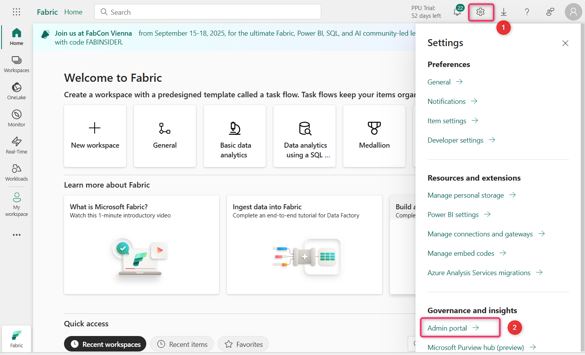

2.  In the Admin portal – Tenant settings, scroll down to **Information
    protection** section.

    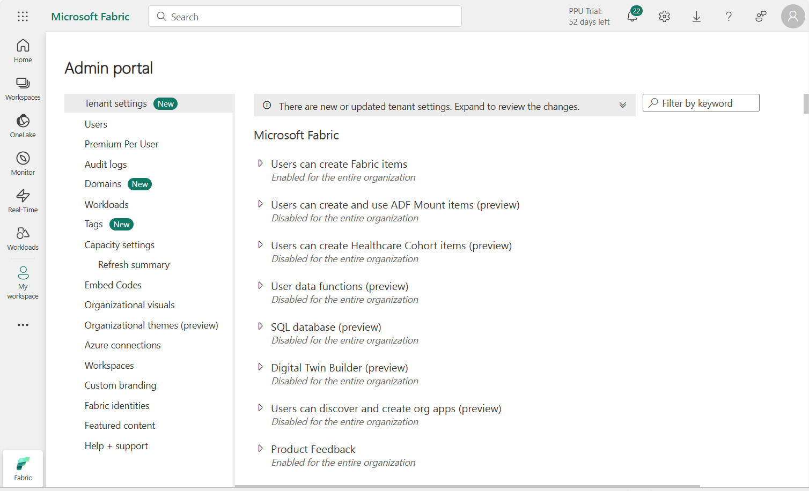

3.  Click on the play button beside the **Allow users to apply sensitivity
    labels for content.**

    

4.  Click on the toggle button to enable it. With this setting enabled,
    specified users can apply sensitivity labels from Microsoft Purview
    Information Protection.

    

5.  Now, click on the **Apply** button.

    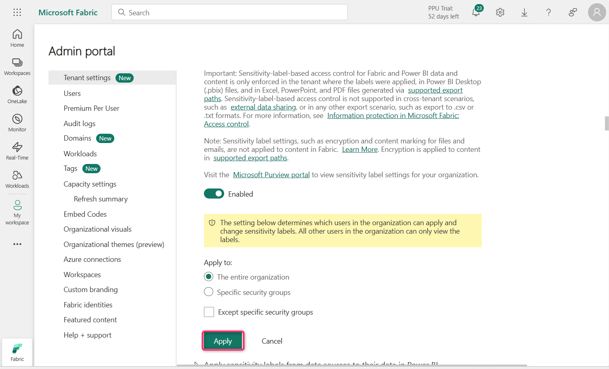

    **Note**: In case, **Apply** button is not highlighted, then select **Specific security groups** radio button and select back the **The entire organization** radio button.
    
6.  You will receive a notification stating – **Tenant settings will be
    applied within the next 15 minutes**.

    

7.  Click on the play icon beside **Apply sensitivity labels from data
    sources to their data in Power BI**

    

8.  Click on the toggle button to enable it.

    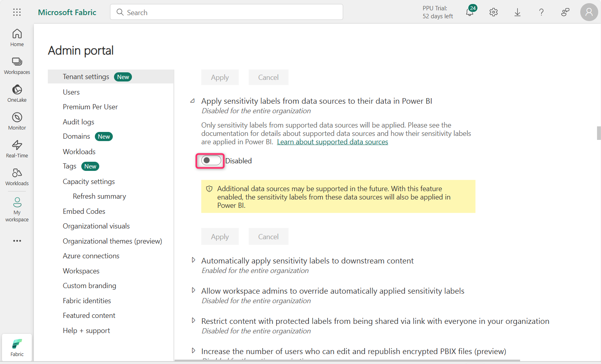

9.  When this setting is enabled, Power BI semantic models that connect
    to sensitivity-labeled data in supported data sources can inherit
    those labels, so that the data remains classified and secure when
    brought into Power BI.

    Click on the **Apply** button.

    

10. You will receive a notification stating – **Tenant settings will be
    applied within the next 15 minutes.**

    

11. Click on the Play icon beside **Automatically apply sensitivity
    labels to downstream content**

    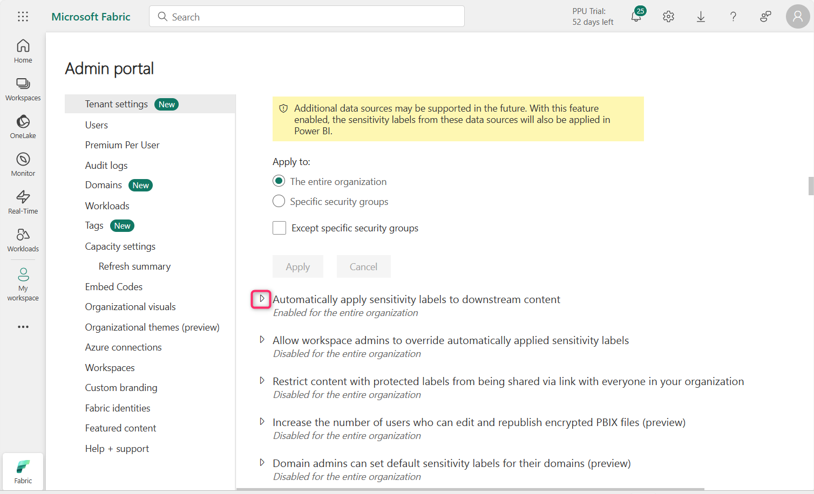

12. Click on the toggle button to enable it.

    

13. With this settings enabled, whenever you change a sensitivity label
    or applied to Fabric content, the label will also be applied to its
    eligible downstream content.

    Click on the **Apply** button.

    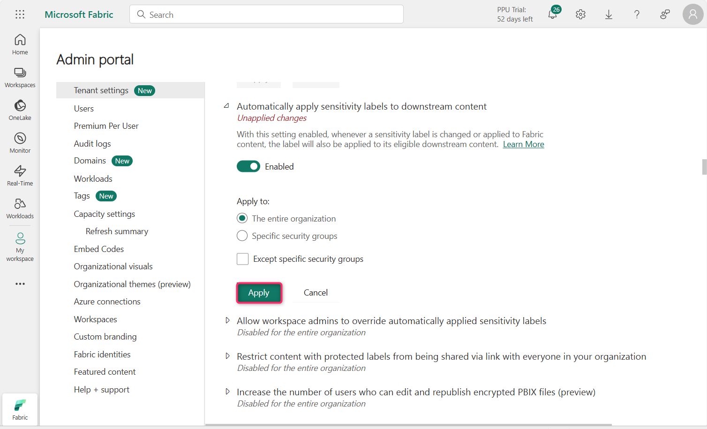

14. You will receive a notification stating – Tenant settings will be
    applied within the next 15 minutes.

    

15. Click on the Play icon beside - **Allow workspace admins to override
    automatically applied sensitivity labels**

    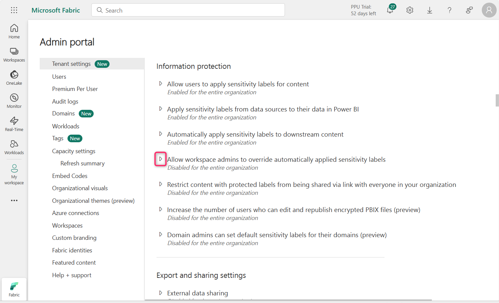

16. Click on the toggle button to enable it.

    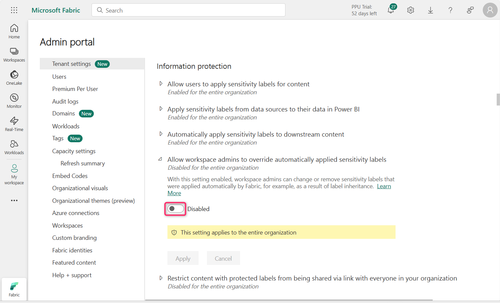

17. This setting makes it possible for workspace admins to override
    automatically applied sensitivity labels without regard to label
    change enforcement rules.

    Click on the **Apply** button

    

18. You will receive a notification stating - Tenant settings will be
    applied within the next 15 minutes.

    

19. Click on the Play icon beside **Restrict content with protected
    labels from being shared via link with everyone in your
    organization**

    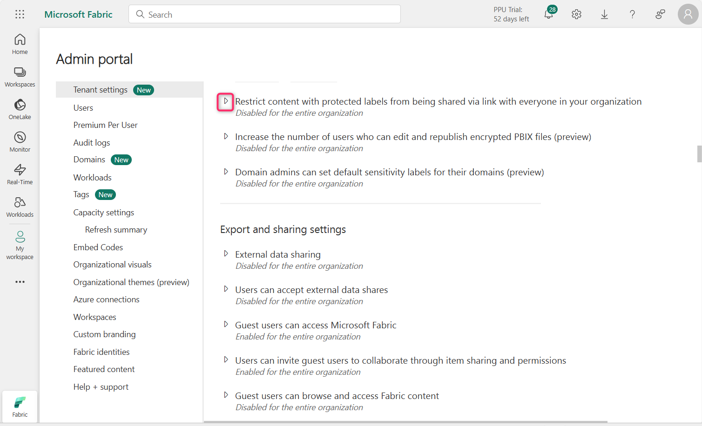

20. Click on the toggle button to enable it.

    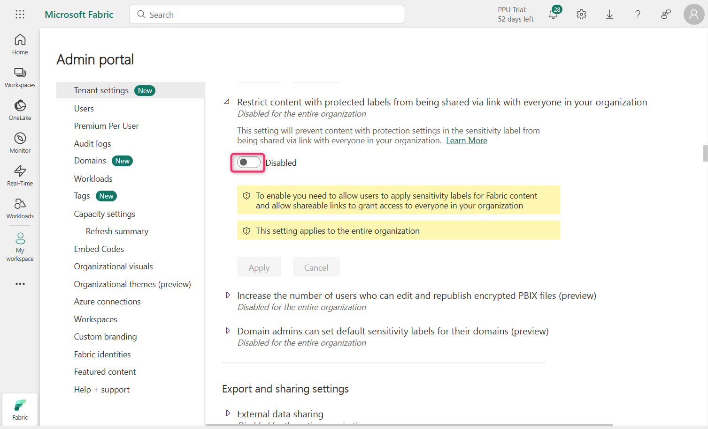

21. When this setting is enabled, users can't generate a sharing link
    for People in your organization for content with protection settings
    in the sensitivity label.

    Click on the **Apply** button

    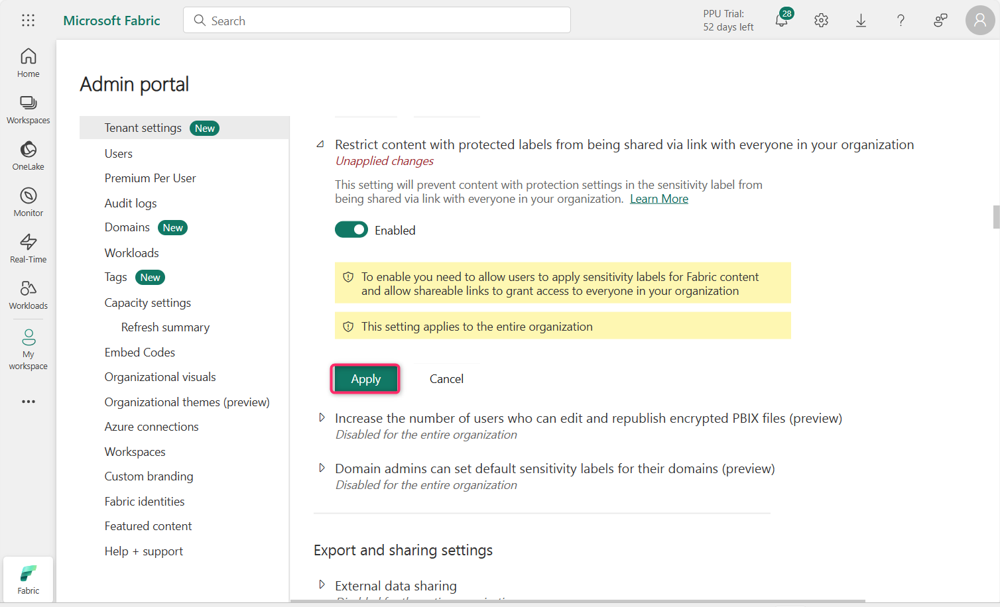

22. You will receive a notification stating - Tenant settings will be
    applied within the next 15 minutes.
    
    

24. Click on the Play icon beside **Domain admins can set default
    sensitivity labels for their domains (preview)**

    

24. Click on the toggle button to enable it.

    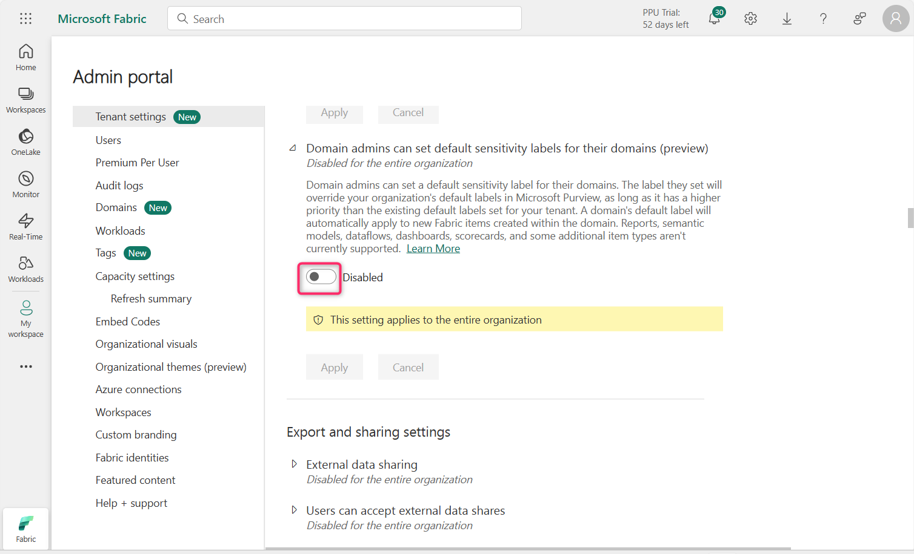

25. Click on the **Apply** button.

    

26. You will receive a notification stating - Tenant settings will be
    applied within the next 15 minutes.

    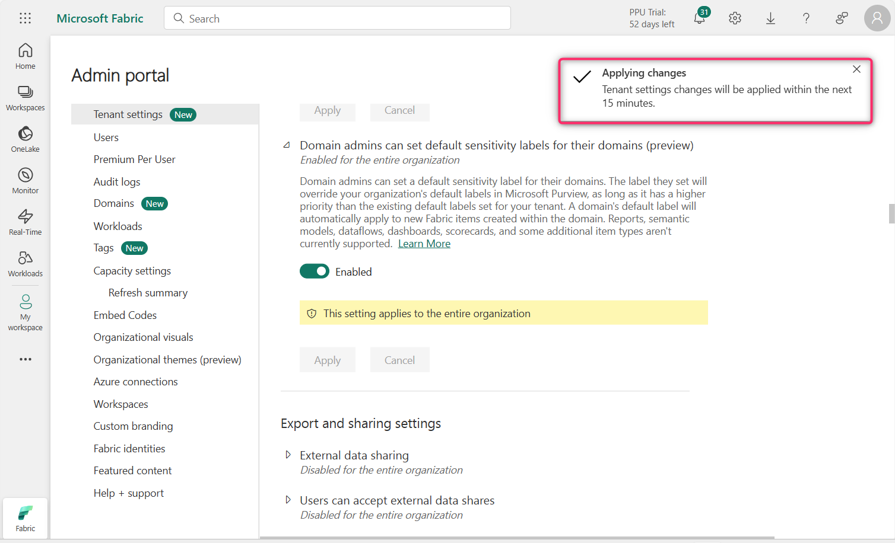

## Summary

In this lab, you’ve enabled various information protection settings in
the Microsoft Fabric Admin Portal to support sensitivity label
application, inheritance, automatic labeling, and admin overrides.

