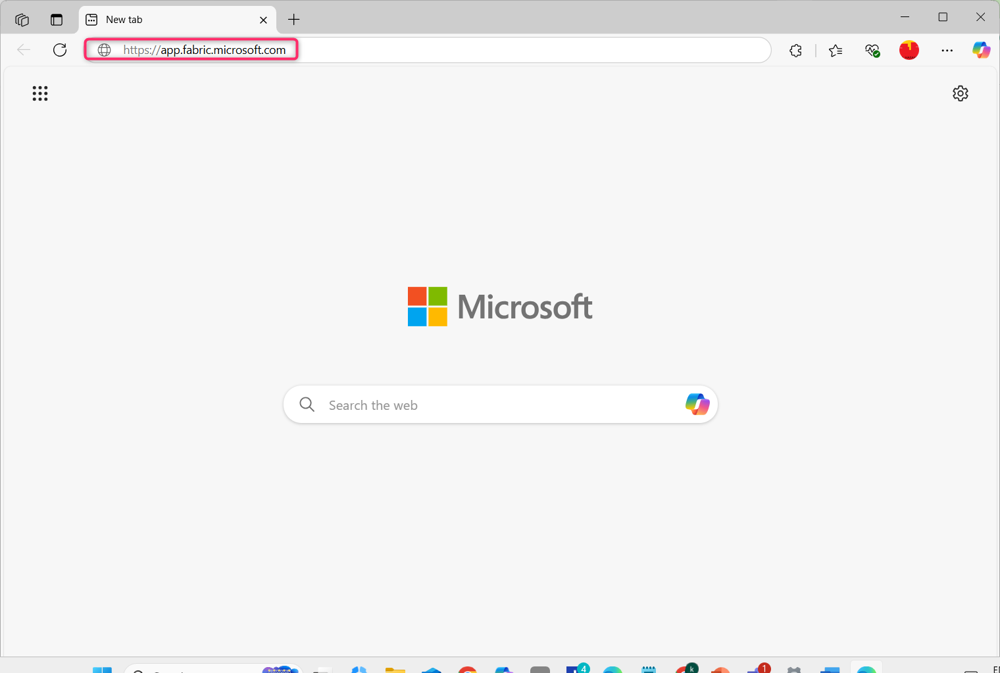
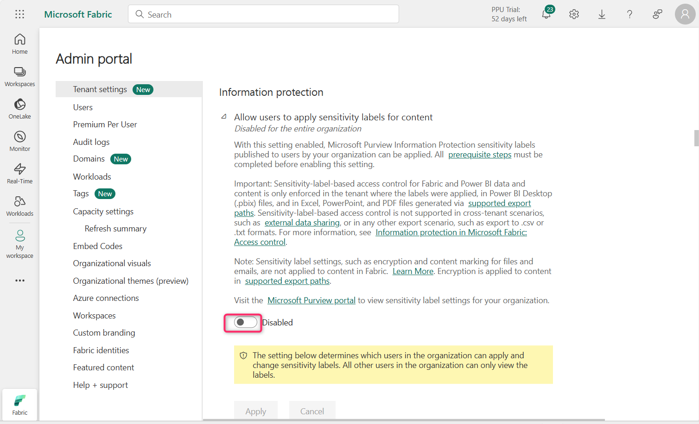
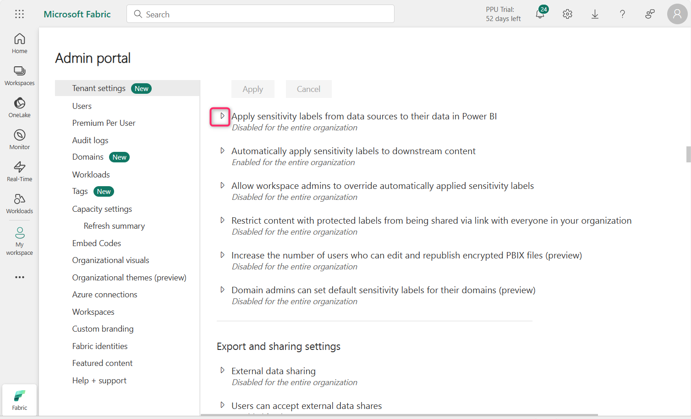
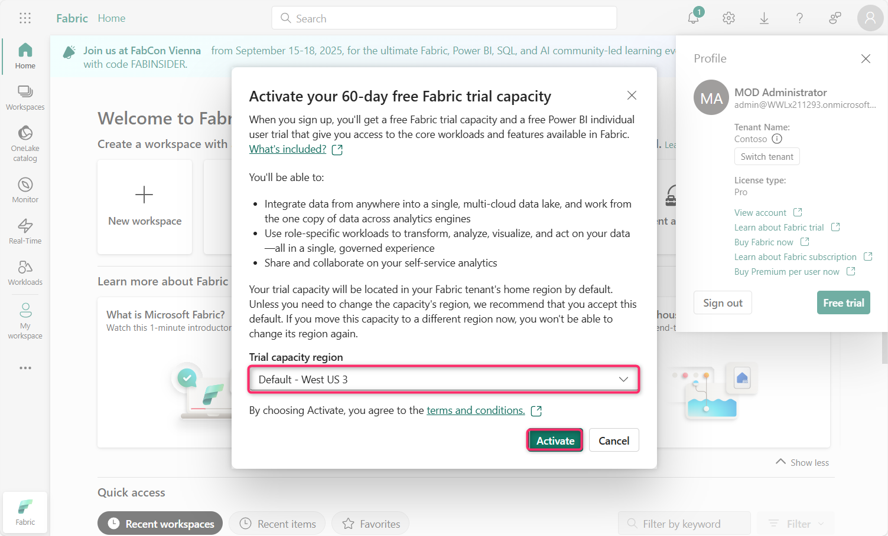
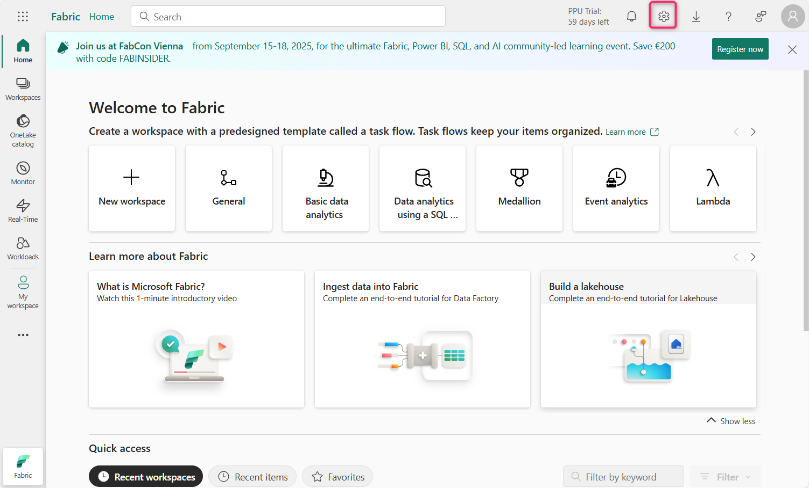
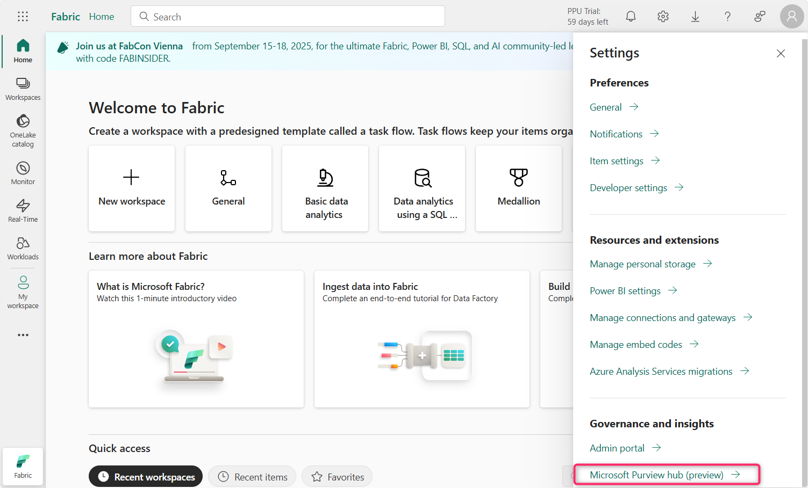
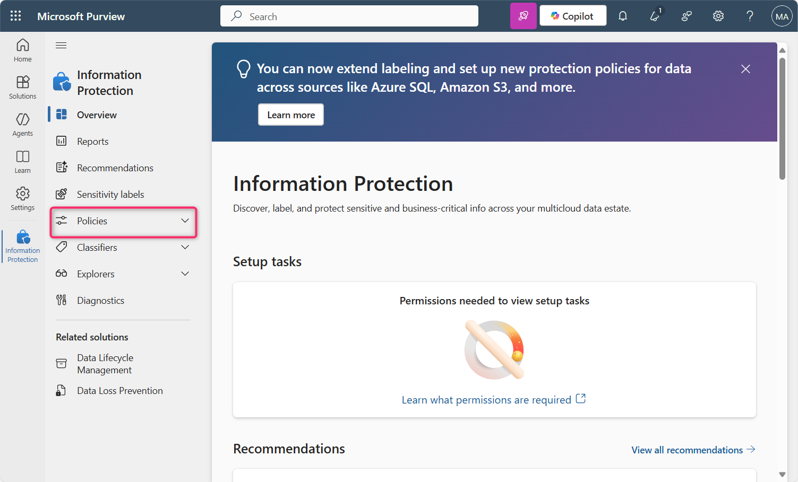
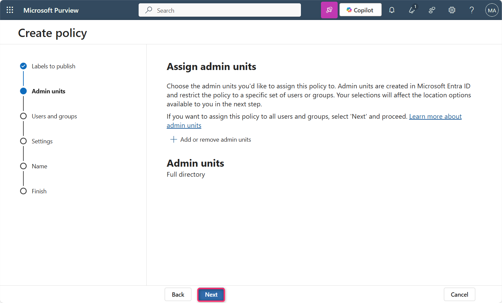

> **ラボ 11:ファブリックでInformation Protectionポリシーを構成する**

**紹介**

Information protectionテナント設定は、Power BI
テナント内の機密情報を保護するのに役立ちます。コンテンツにsensitivity
labelsを許可および適用することで、適切なユーザーのみが情報を閲覧およびアクセスできるようになります。　

**目的**

- 管理ポータルを通じて Microsoft Fabric のInformation
  Protection機能を有効にして、sensitivity labelsの適用を準備します。

**演習 1: Fabric Admin PortalでInformation Protection設定を構成する**

1.  Fabric ポータルのホームページで、コマンド
    バーの**Settings**アイコンをクリックし、 **Governance and
    insights**セクションに移動して、 **Admin
    portal**リンクをクリックします。

2.  Admin portal – Tenant settingsで、**Information
    Protection**セクションまで下にスクロールします。

3.  「Allow users to apply sensitivity labels for
    content」の横にある再生ボタンをクリックします。

4.  トグルボタンをクリックして有効にします。この設定を有効にすると、指定されたユーザーがMicrosoft
    Purview Information Protectionからsensitivity
    labelsを適用できるようになります。

5.  次に、 **「Apply」**ボタンをクリックします。

**注: \[Apply\]ボタンが強調表示されていない**場合は、 **\[****Specific
security groups\] ラジオ ボタン**を選択し、 **\[****The entire
organization**\] ラジオ ボタンを再度選択します。

6.  **「「Tenant settings will be applied within the next 15
    minutes」」**という通知が表示されます。

7.  **「Apply sensitivity labels from data sources to their data in
    Power BI」**の横にある再生アイコンをクリックします。

8.  有効にするには、トグルボタンをクリックします。

9.  この設定を有効にすると、サポートされているデータソース内のsensitivity
    labelsが付けられたデータに接続する Power BI セマンティック
    モデルはそれらのラベルを継承できるため、Power BI
    に取り込まれたときにデータは機密扱いのまま、安全性が確保されます。

> **「Apply」ボタン**をクリックします。

10. **「「Tenant settings will be applied within the next 15
    minutes」」**という通知が表示されます。

11. **Automatically apply sensitivity labels to downstream
    content**の横にある再生アイコンをクリックします。

12. 有効にするには、トグルボタンをクリックします。

13. この設定を有効にすると、sensitivity labelsを変更したり、Fabric
    コンテンツに適用したりするたびに、そのラベルは対象となるダウンストリーム
    コンテンツにも適用されます。

**「Apply」ボタン**をクリックします。

14. 「「Tenant settings will be applied within the next 15
    minutes」」という通知が表示されます。

15. **Allow workspace admins to override automatically applied
    sensitivity labels**の横にある再生アイコンをクリックします。

16. 有効にするには、トグルボタンをクリックします。

17. この設定により、ワークスペース管理者は、ラベル変更の適用ルールに関係なく、自動的に適用されたsensitivity
    labelsを上書きできるようになります。

**「Apply」**ボタンをクリックします

18. 「Tenant settings will be applied within the next 15
    minutes」という通知が表示されます。

19. **Restrict content with protected labels from being shared via link
    with everyone in your
    organization**の横にある再生アイコンをクリックします。

20. 有効にするには、トグルボタンをクリックします。

21. この設定を有効にすると、ユーザーはsensitivity
    labelsに保護設定があるコンテンツについて、組織内のユーザー向けの共有リンクを生成できなくなります。

**「Apply」**ボタンをクリックします

22. 「Tenant settings will be applied within the next 15
    minutes」という通知が表示されます。

23. **Domain admins can set default sensitivity labels for their domains
    (preview)**の横にある再生アイコンをクリックします。

24. 有効にするには、トグルボタンをクリックします。

25. **「Apply」**ボタンをクリックします。

26. 「Tenant settings will be applied within the next 15
    minutes」という通知が表示されます。

**まとめ**

このラボでは、sensitivity
labelsの適用、継承、自動ラベル付け、アドミンオーバーライドをサポートするように、Microsoft
Fabric Admin PortalでさまざまなInformation Protection設定を  
有効にしました　
