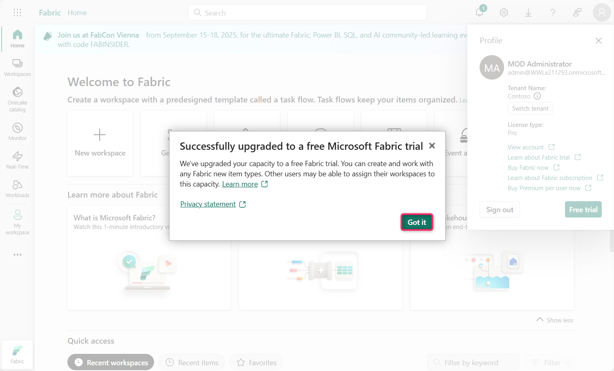

> **实验室 11：在 Fabric 中配置信息保护策略**

**介绍**

信息保护租户设置可帮助你保护 Power BI
租户中的敏感信息。允许敏感度标签并将其应用于内容可确保只有适当的用户才能看到和访问信息。

**目的**

- 通过管理门户在 Microsoft Fabric
  中启用信息保护功能，为敏感度标签强制实施做好准备。

**练习 1：在 Fabric 管理门户中配置信息保护设置**

1.  在 Fabric portal
    主页中，单击命令栏中的“**Settings**”图标，然后导航到“**Governance
    and insights**”部分，然后单击“**Admin portal**”链接。

2.  在“Admin portal – Tenant settings”中，向下滚动到“**Information
    protection**”部分。

3.  单击“Allow users to apply sensitivity labels for
    content”旁边的播放按钮。

4.  单击切换按钮以启用它。启用此设置后，指定用户可以从 Microsoft Purview
    Information Protection 应用 sensitivity labels。

5.  现在，单击“**Apply**”按钮。

**注意**：如果“**Apply**”按钮未突出显示，请选择“**Specific security
groups**”单选按钮，然后选择“**The entire organization**”单选按钮。

6.  您将收到一条通知，指出 – **Tenant settings will be applied within
    the next 15 minutes**。

7.  单击“**Apply sensitivity labels from data sources to their data in
    Power BI**”旁边的播放图标

8.  单击切换按钮以启用它。

9.  启用此设置后，连接到受支持数据源中敏感度标记数据的 Power BI
    语义模型可以继承这些标签，以便数据在引入 Power BI 时保持分类和安全。

> 单击“**Apply**”按钮。

10. 您将收到一条通知，指出 – **Tenant settings will be applied within
    the next 15 minutes**。

11. 单击“**Automatically apply sensitivity labels to downstream
    content**”旁边的“播放”图标

12. 单击切换按钮以启用它。

13. 启用此设置后，每当更改敏感度标签或应用于 Fabric
    内容时，该标签也将应用于其符合条件的下游内容。

单击“**Apply**”按钮。

14. 您将收到一条通知，指出 – 租户设置将在接下来的 15 分钟内应用。

15. 单击旁边的“播放”图标 - **Allow workspace admins to override
    automatically applied sensitivity labels**

16. 单击切换按钮以启用它。

17. 此设置使工作区管理员可以替代自动应用的敏感度标签，而不考虑标签更改强制规则。

单击“**Apply**”按钮

18. 你将收到一条通知，指出 - Tenant settings will be applied within the
    next 15 minutes。

19. 点击“**Restrict content with protected labels from being shared via
    link with everyone in your organization**”旁边的“播放”图标

20. 单击切换按钮以启用它。

21. 启用此设置后，用户无法为组织中的人员生成共享链接，以获取 sensitivity
    label 中具有保护设置的内容。

单击“**Apply**”按钮

22. 你将收到一条通知，指出 - Tenant settings will be applied within the
    next 15 minutes。

23. 单击“**Domain admins can set default sensitivity labels for their
    domains (preview)**”旁边的“播放”图标

24. 单击切换按钮以启用它。

25. 单击“**Apply**”按钮。

26. 你将收到一条通知，指出 - Tenant settings will be applied within the
    next 15 minutes。

**总结**

在本实验室中，你已在 Microsoft Fabric
管理门户中启用了各种信息保护设置，以支持敏感度标签应用程序、继承、自动标记和管理替代。
