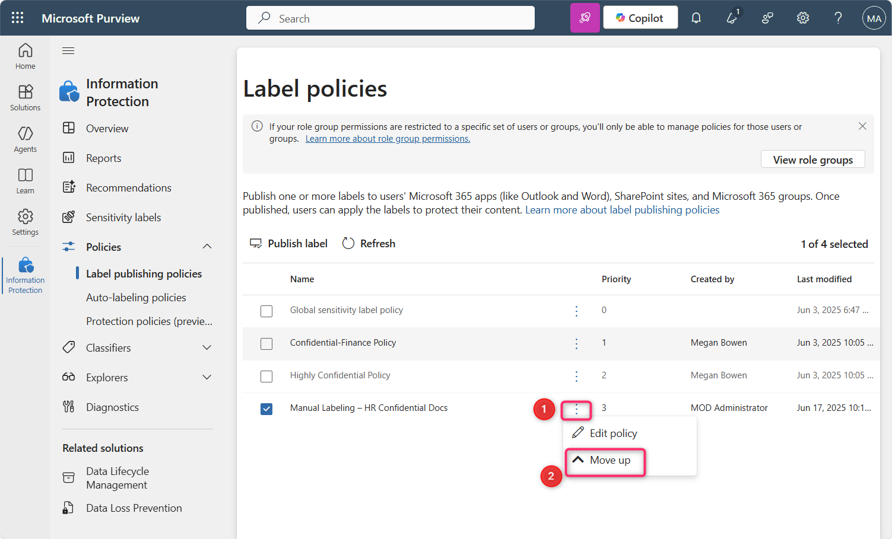

# Lab 1: Enforce Sensitivity Labeling in Fabric and Power BI using Microsoft Purview

## Objective

- Enable and prioritize a manual sensitivity label policy in Microsoft
  Fabric using Microsoft Purview.

1.  Open an Edge browser address bar and enter the following URL to open
    the Fabric portal -

[**https://app.fabric.microsoft.com**](https://app.fabric.microsoft.com/)

2.  Enter your tenant credentials.

3.  In the password field, enter the tenant password. Then, click on the
    **Sign in** button.

4.  On **Welcome to the Fabric view** dialog box, click on the
    **Cancel** button.

5.  Click on the profile icon on the command bar.

6.  Navigate and click on **Free trial** button.

7.  On the **Activate your 60-day free Fabric trial capacity**, in the
    **Trial capacity region** ensure that **Default – West US 3** region
    is selected, then click on the **Activate** button.

8.  On **Successfully upgraded to a free Microsoft Fabric trial** dialog
    box, click on the **Got it** button.

9.  Click on the **Settings** gear box in the command bar.

10. Navigate to Governance and insights section and click on **Microsoft
    Purview hub (preview)** link.

11. In case, **Pick an account** dialog box appears, then select your
    tenant ID.

12. On **Welcome to Information Protection in the new Microsoft Purview
    portal** dialog box, click on **Get started** button.

13. Click on the dropdown beside **Policies**.

14. Then, click on **Label publishing policies**.

15. In the **Create policy** page, navigate and click on **Choose
    sensitivity label to publish** link.

16. **Sensitivity label to publish** pane appears on the right side,
    navigate and select the checkbox beside **Confidential**, then click
    on the **Add** button.

17. Now, click on the **Next** button.

18. On **Assign admin units** page, click on the **Next** button.

19. In **Publish to users and groups** page, ensure that the checkbox
    beside **Users and groups** is selected, then click on the **Next**
    button.

20. In the **Policy settings** page, select the checkbox beside
    **Require users to apply a label to their Fabric and Power BI
    content**. Then, click on the **Next** button.

21. On **Default settings for documents – Apply a default label to
    documents** page, click on the **Next** button.

22. On **Default settings for documents – Apply a default label to
    emails** page, click on the **Next** button.

23. On **Default settings for meetings and calendar events** page, click
    on the **Next** button.

24. On **Default settings for Fabric and Power BI content** page, click
    on the **Next** button.

25. In **Name your policy** page, under the **Name** field, enter
    **Manual Labeling – HR Confidential Docs**. Then, click on the
    **Next** button.

26. On **Review and finish** page, click on the **Submit** button.

27. The policy is successfully created. Now, click on the **Done**
    button.

28. In the **Label policies** page, you will see **Manual Labeling – HR
    Confidential Docs** policy is successfully created.

29. Select **Manual Labeling – HR Confidential Docs**, then click on the
    horizontal ellipsis, navigate and select **Move up** to change the
    Priority.

30. Again, select **Manual Labeling – HR Confidential Docs**, then click
    on the horizontal ellipsis beside it and select **Move up**.

31. You will notice that **Manual Labeling – HR Confidential Docs**
    priority is now changed to 1.

**Summary**

In this lab, you’ve activated a Microsoft Fabric trial, accessed the
Microsoft Purview portal, and created a mandatory sensitivity label
policy requiring users to apply the "Confidential" label to Fabric and
Power BI content. The policy was then prioritized for enforcement.
