# **实验室 12_创建阻止外部用户访问 Fabric 工作区的 DLP 策略**

**介绍**

*我们需要阻止外部用户访问包含信用卡号的报表，除非数据标有“Highly
Confidential -
Internal”敏感度标签，在这种情况下，保护策略会限制对选定安全组的访问。我们希望通知合规性管理员，以了解何时阻止语义模型，并通知数据所有者了解发生了限制。我们还希望内部用户意识到数据是高度机密的，他们不应在组织外部共享数据。*

**重要**

出于此策略创建过程的目的，您将接受默认的包含/排除值，并使策略保持关闭状态。部署策略时，您将更改这些内容。

**目的**

- 在 Microsoft Purview 中创建自定义 Data Loss Prevention (DLP)
  策略，以阻止外部用户访问包含敏感信息的 Fabric 和 Power BI 内容。

**练习 1：创建自定义 DLP 策略以阻止对 Fabric 工作区的外部访问**

1.  在 Microsoft Purview
    门户中，单击“**Solutions**”，然后导航并单击“**Data Loss
    Prevention**,

    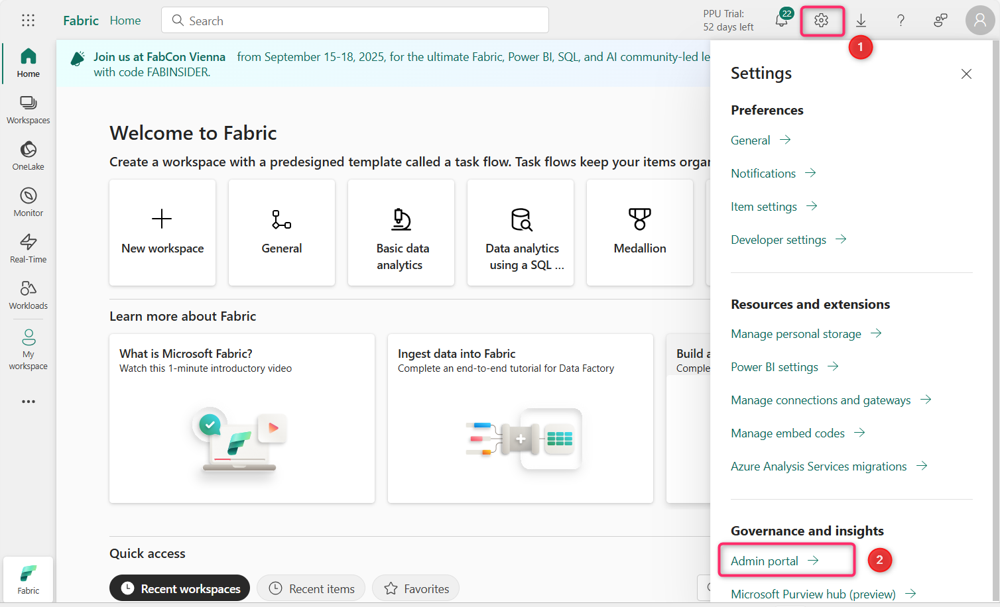

2.  现在，单击 **Policies**。

    

3.  在“**Policies**”页中，单击“**+** **Create policy**”。

    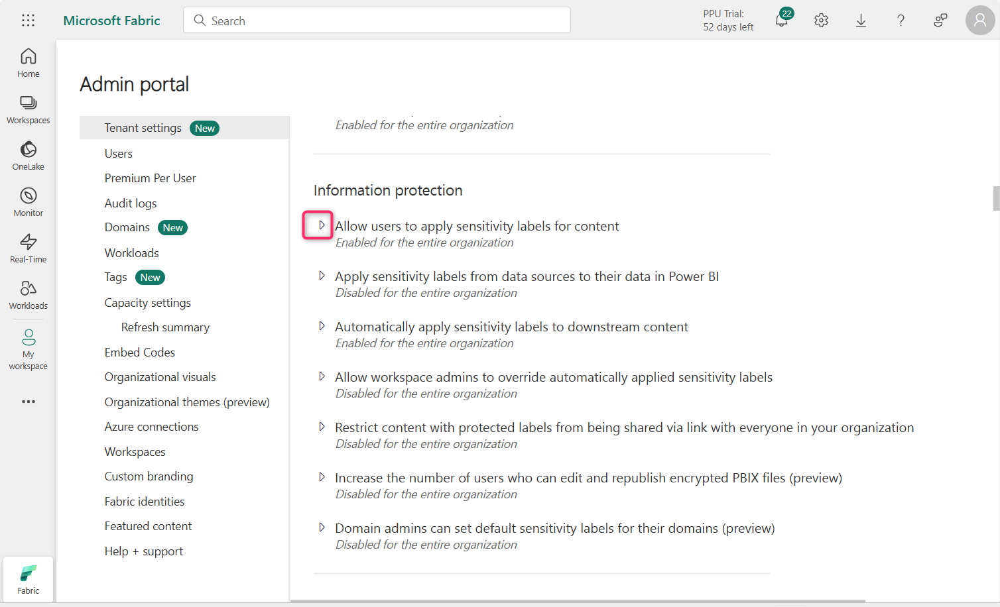

4.  在“**Choose what type of data to protect**”页面上，确保已选择“**Data
    stored in connected sources**”单选按钮，然后单击“**Next**”按钮。

    

5.  在“**Start with a template or create a custom
    policy**”页上，单击“**Categories**”下的“**Custom**”。

    从“**Regulations**”列表中选择“**Custom
    policy**”，然后单击“**Next**”按钮。 

    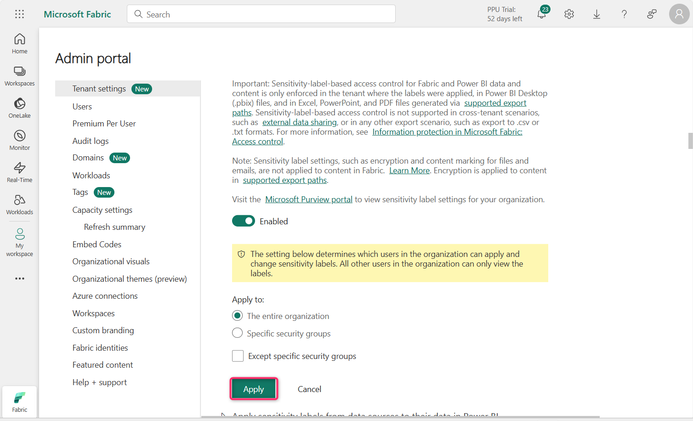

6.  在“**Name your DLP policy**”页的“**Name**”字段中，确保提及“**Custom
    policy**”。

**注意**：您可以在此处使用策略意图语句。无法重命名策略。

  单击“**Next**”按钮。

  

7.  在“**Assign** **Admin units**”页面中，单击“**Next**”按钮。

    

8.  在选择应用策略的位置页面上，单击 Next 按钮。

    

9.  在“**Define policy settings** ”页上，确保选中“**Create or customize
    advanced DLP rules** ”单选按钮。然后，单击“**Next**”按钮。

    

10. 在“**Customize advanced DLP rules**”页中，选择“**+ Create rule**”。

    

11. 在“**Create rule**”页的“**Name**”字段中，输入“**Block external users
    access to Fabric workspace**”。

    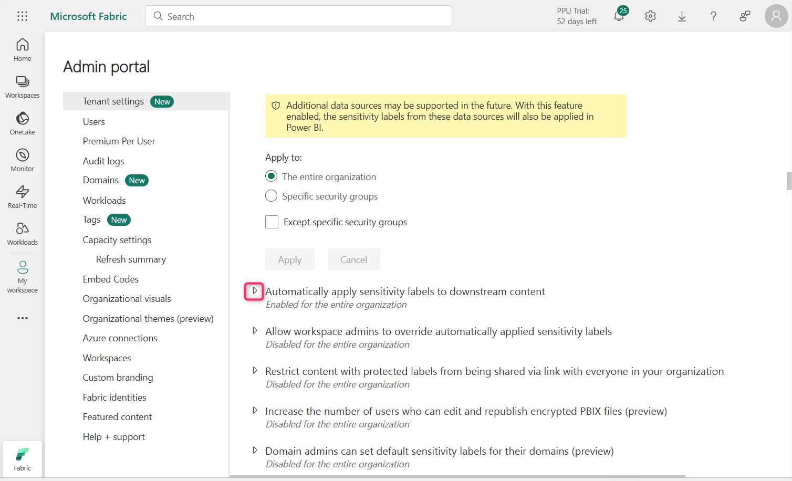

12. 在“**Conditions** ”部分下，选择“**Add condition** \> **Content
    contains** \> **Add** \> **Sensitive info types**”。 

    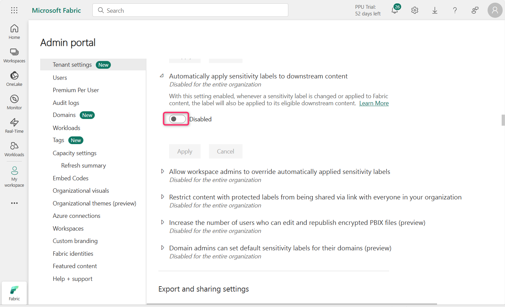

    

13. 在右侧显示的“**Sensitive info types**”窗格中，单击搜索栏内，键入
    **credit card number**，然后按 Enter 按钮。

    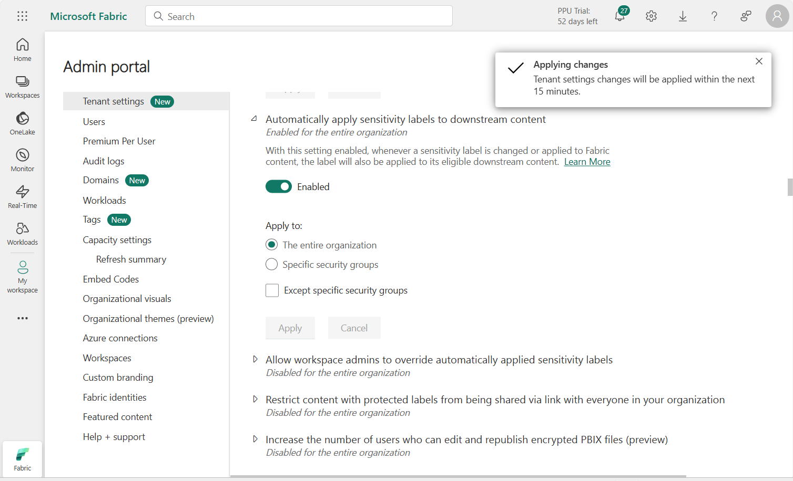

    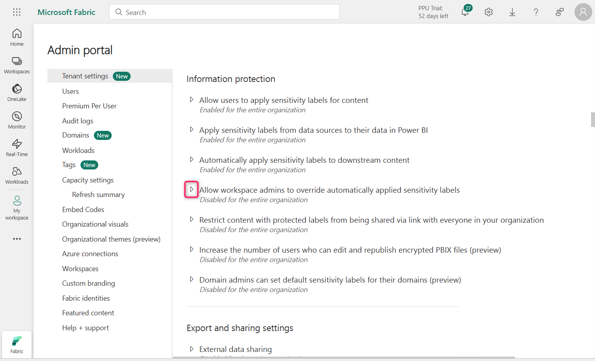

14. 选中 **Credit Card Number** 旁边的复选框，然后单击 **Add** 按钮。

    

15. 在“**Actions**”下，选择 “**Add an action** \> **Restrict access or
    encrypt the content in Microsoft 365 locations**” 

    

16. 确保选中“**Block users from receiving email or accessing shared
    SharePoint, OneDrive, and Teams files, and Power BI items** and
    **Block only people outside your organization**”。

    

17. 在“**User notifications**”下，将切换开关设置为“**On**”。 

    

    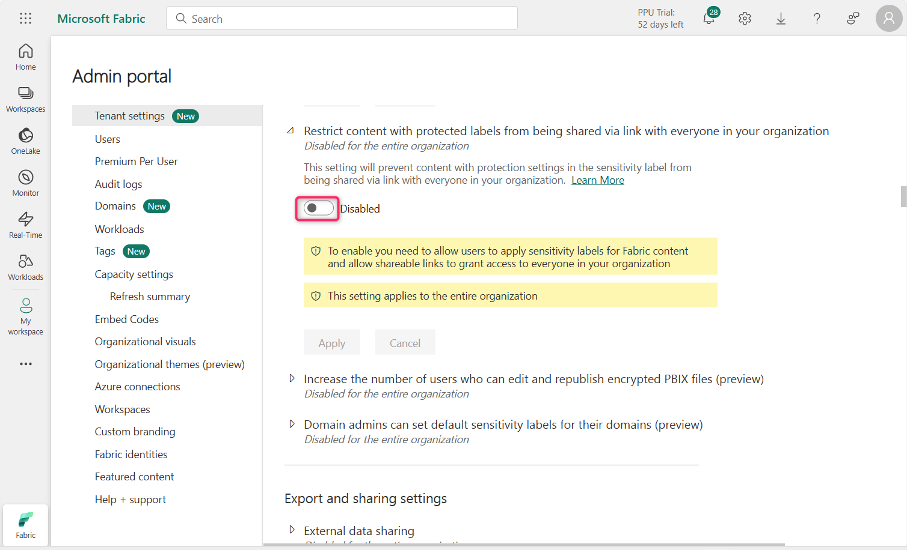

18. 选中“**Notify users in Office 365 service with a policy tip or email
    notifications**”复选框和“**Customize the policy tip
    text**”复选框。  

    

19. 在“**User overrides**”部分中，选中“**Allow users to override policy
    restrictions in Fabric (including Power BI), Exchange, SharePoint,
    OneDrive, and Teams**”旁边的复选框，然后导航并选中“**Override the
    rule automatically if they report it as a false
    positive**”旁边的复选框。

    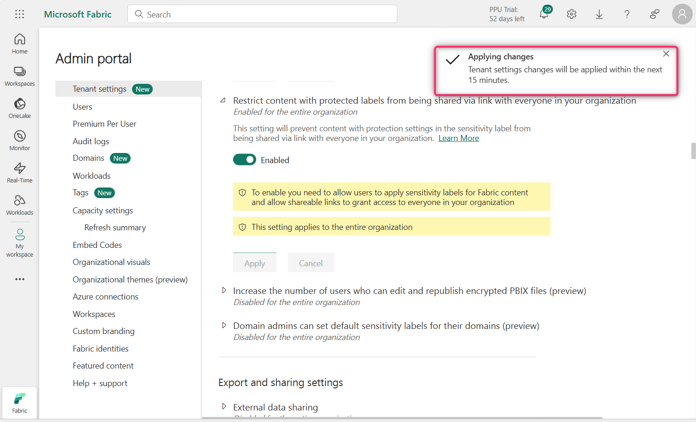

20. 在“**Incident reports**”下，将“在**Use this severity level in admin
    alerts and reports** ”设置为“**High**”。 

    

    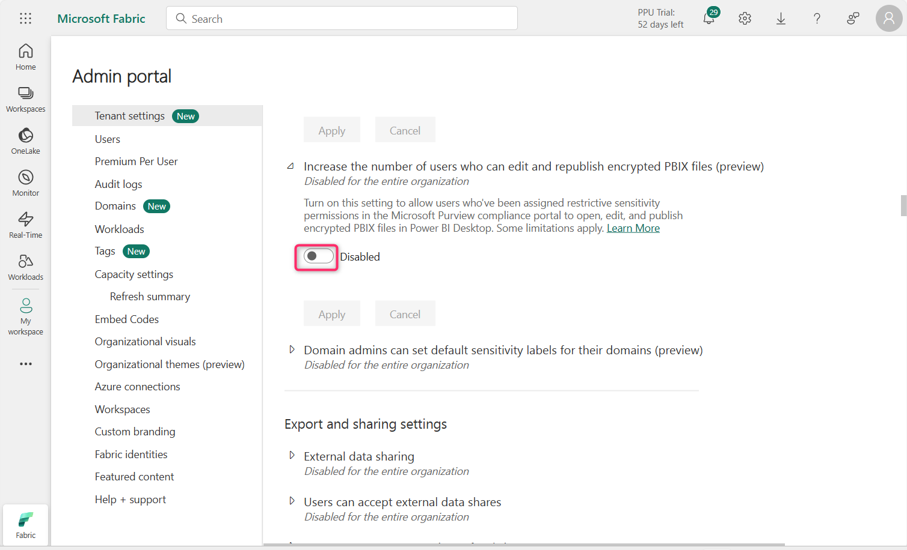

21. 确保“**Send an alert to admins when a rule match
    occurs** ”开关设置为“**On**”。

22. 确保选中“**Send alert every time an activity matches the
    rule** ”单选按钮。

    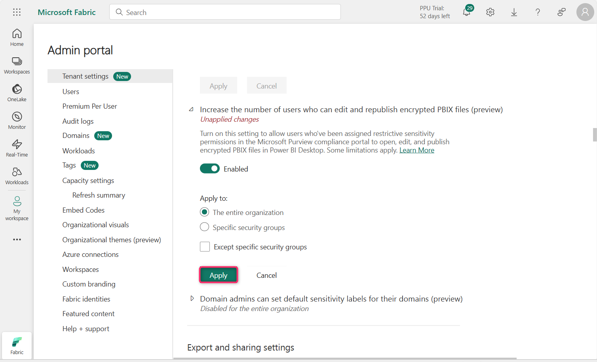

23. 单击“**Save**”按钮。

    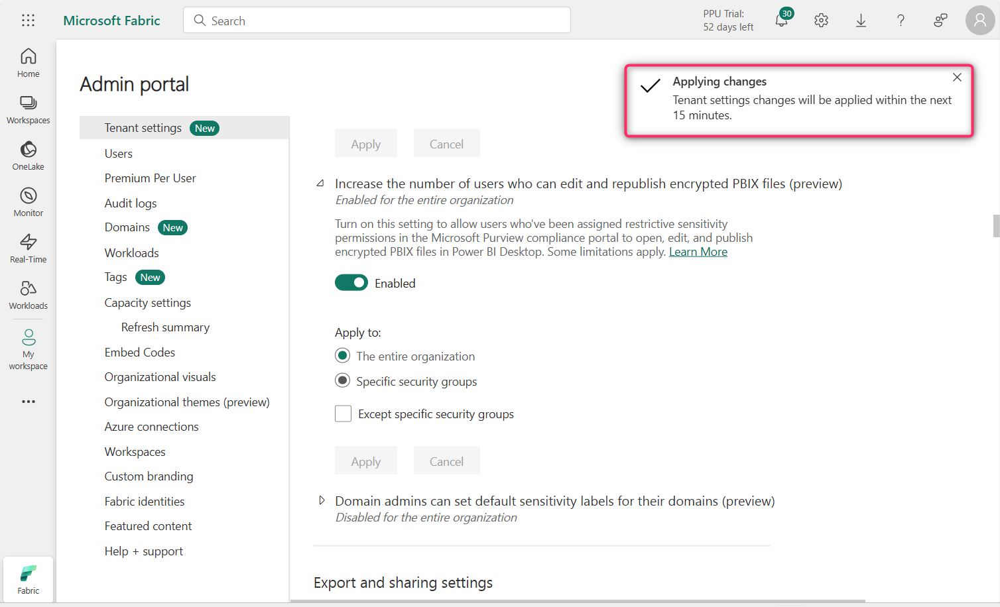

24. 查看规则，然后单击 **Next** 按钮。

    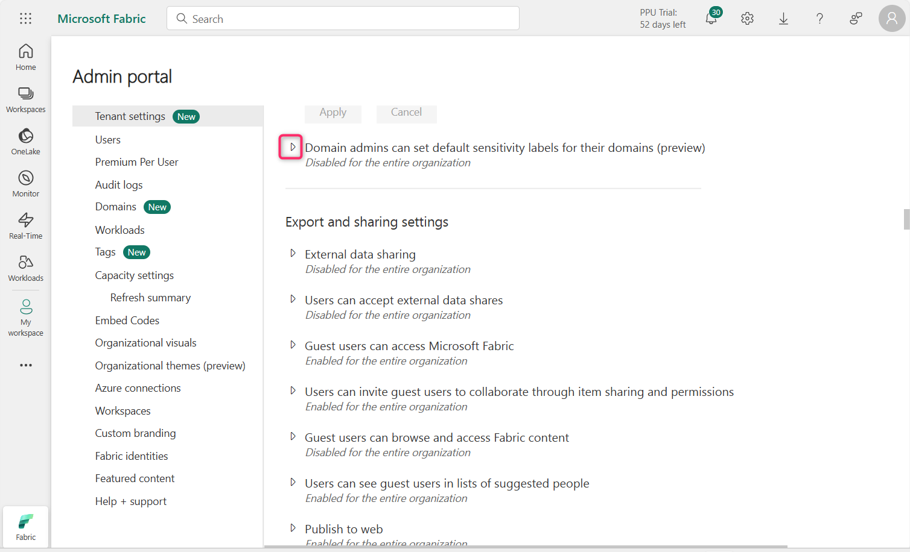

25. 确保选中“**Run the policy in simulation mode**”单选按钮和“**Show
    policy tips while in simulation
    mode** ”复选框。然后，单击“**Next**”按钮。 

    

26. 在“**Review and
    finish**”页面中，单击“**Submit**”按钮。几秒钟后，策略将成功创建。

    

    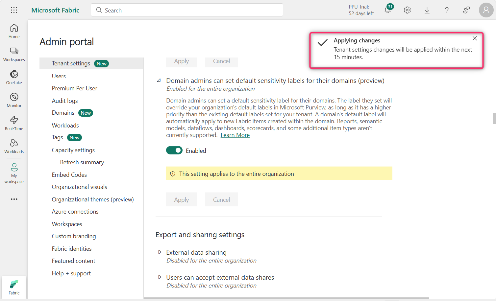

**重要提示：**

由于此实验室环境中的许可限制，您可能会遇到以下错误。

此实验室在 Power BI Pro 许可证下运行，该许可证不支持 Fabric 或 Premium
工作区的 Microsoft Purview DLP 集成。因此，无法正确限定“Block external
user”等 DLP policy 操作的范围，并且向导会失败并出现以下错误：

要仅阻止组织外的人员，您必须选择条件“内容与组织外的人员共享”。

在实际的企业环境中，如果您的租户具有以下条件，则不会发生此问题：

\- Power BI Premium Per User (PPU) license

\- or a Microsoft Fabric capacity (F64+)

这些许可证允许与 Microsoft Fabric 和 Power BI 进行完整的 DLP
策略集成，包括对阻止操作和适当的条件范围的支持。

**总结**

在本实验室中，你已在 Microsoft Purview 中创建了自定义 DLP
策略，通过检测敏感数据并应用限制来阻止外部用户访问来保护 Fabric 和 Power
BI 内容。该策略还启用用户通知和管理员警报。

