**ラボ 12_外部ユーザーによる Fabric
ワークスペースへのアクセスをブロックする DLP ポリシーを作成する**

**紹介**

*クレジットカード番号を含むレポートを外部ユーザーが閲覧できないようにする必要があります。ただし、データに「Highly
Confidential - Internal」のsensitivity
labelが付けられている場合は、保護ポリシーによってアクセスが特定のセキュリティグループに制限されます。セマンティック
モデルがブロックされるたびにコンプライアンス管理者に通知し、データ所有者に制限が発生したことを認識してもらいます。また、社内ユーザーにも、データが極秘であり、組織外で共有してはならないことを認識してもらう必要があります。*

| **声明** | **構成に関する質問への回答と構成のマッピング** |
| ---  | --- |
|「外部ユーザーをブロックする必要があります...」           |       監視対象: Fabric と Power BI 
管理範囲:ディレクトリ全体
 アクション: Restrict access or encrypt the content in Microsoft 365 locations > Block users from receiving email or accessing shared SharePoint, OneDrive, and Teams files, and Power BI items > Block only people outside your organization|
|「...クレジットカード番号を含むレポートから...」|  監視対象: Custom templateを使用する
 致条件: 編集して、Credit Card Numberの機密情報タイプを追加する。|
| 「ただし、データに「Highly Confidential - Internal」sensivity labelが付けられている場合は除きます...」|  条件グループの構成: boolean ANDを使用して最初の条件に結合されたネストされたboolean NOT条件グループを作成する
 一致条件: これを編集して、Highly Confidential - Internalのsensitivity labelを追加する。|
|「セマンティック モデルがブロックされるたびにコンプライアンス管理者に通知し...」|インシデントレポート: Send an alert to admins when a rule match occurs: On
 Send an alert every time an activity matches the rule: 選択済み|
| 「…データ所有者に制限が発生したことを認識してもらいます。また、社内ユーザーにも、データが極秘であり、組織外で共有してはならないことを認識してもらう必要があります」|  User notifications: On　
- Microsoft 365 files and Microsoft Fabric items: Notify users in Office 365 service with a policy tip or email notifications：選択済み
- Policy tips: Customize the policy tip text:：選択済み。機密性の高いデータの共有に関するルールを説明するテキストをテキストボックスに追加します。　|

**重要**

このポリシー作成手順では、デフォルトの包含/除外値をそのまま使用し、ポリシーはオフのままにします。ポリシーを展開する際に、これらの値を変更します。

**目的**

- Microsoft Purview でカスタム Data Loss Prevention (DLP)
  ポリシーを作成し、機密情報を含む Fabric および Power BI
  コンテンツへの外部ユーザー アクセスをブロックします。　

**演習 1: Fabricワークスペースへの外部アクセスをブロックするカスタム DLP
ポリシーの作成**

1.  Microsoft Purviewポータルで、 **「Solutions」をクリックし**、 **Data
    Loss Prevention**

**に**移動してクリックします。

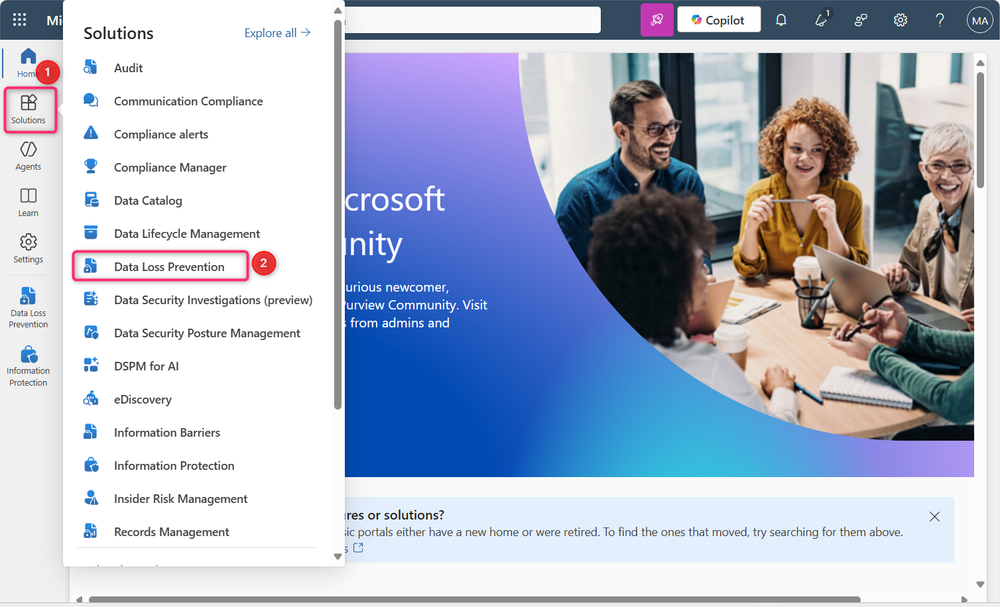

1.  次に、 **Policies**をクリックします。

2.  **Policiesページ**で、 **+ Create
    policyをクリックします。**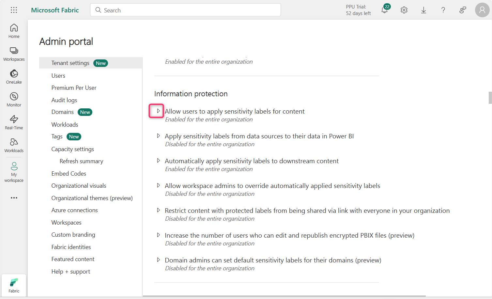

3.  **Choose what type of data to protect**ページで、 **Data stored in
    connected sources**ラジオ ボタンが選択されていることを確認し**、
    「Next」**ボタンをクリックします。　

4.  **Start with a template or create a custom
    policy**ページで、**Categories**の下の**Custom**をクリックします。

> **Regulationsリスト**から**Custom policy**を選択し、
> **\[Next\]**ボタンをクリックします。

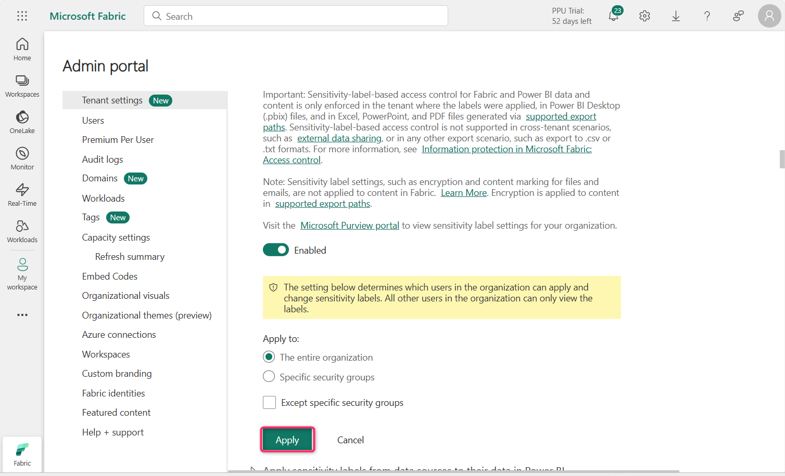

5.  **Name your DLP policy**ページの**「Name」**フィールドに、 **Custom
    policy**が記載されていることを確認します。

**注**:
ここではポリシーインテントステートメントを使用できます。ポリシーの名前は変更できません。

> **「Next」**ボタンをクリックします。

6.  **Assign** **Admin units**ページで、
    **\[Next\]**ボタンをクリックします。

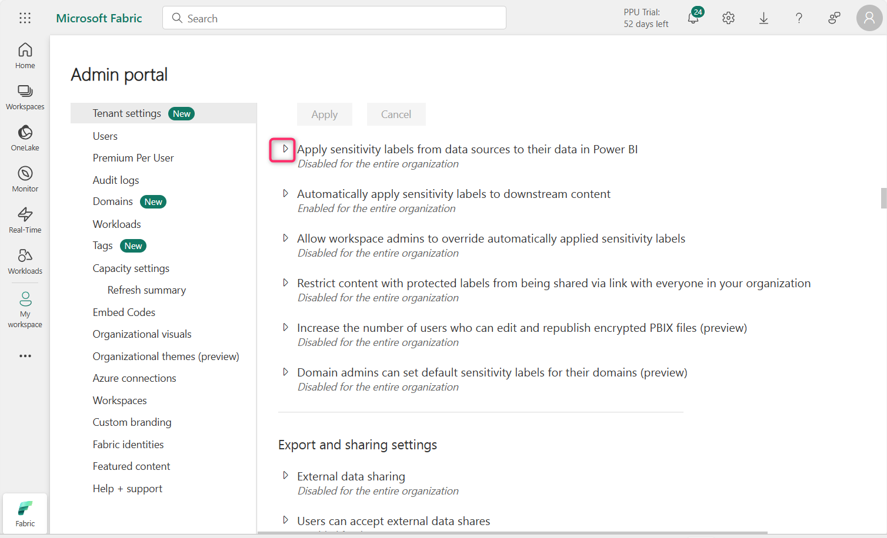

7.  Choose where to apply the
    policyページで、「Next」ボタンをクリックします。

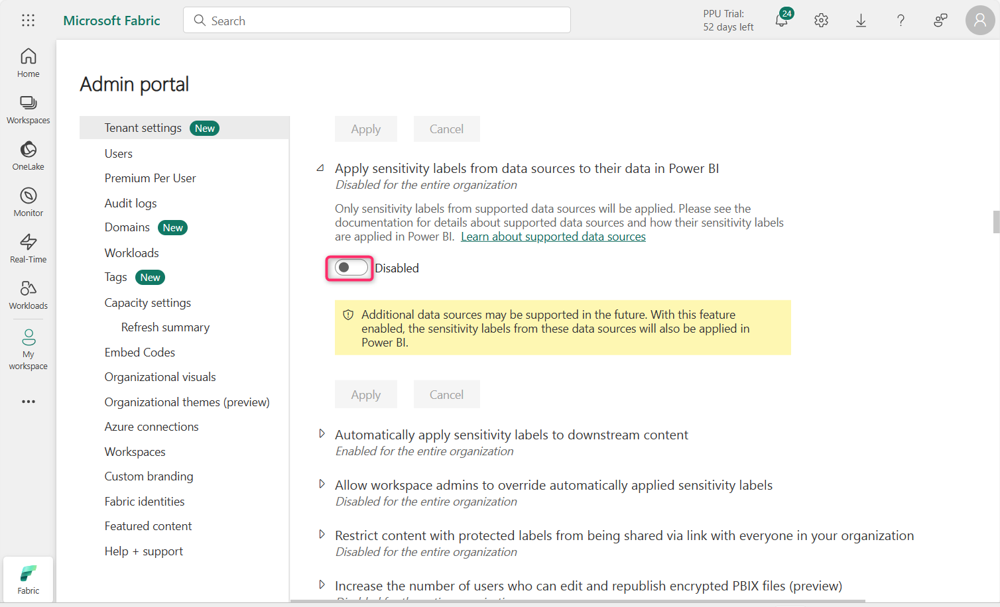

8.  **Define policy settings**ページで、 「Create or customize advanced
    DLP
    rulesラジオボタンが選択されていることを確認します。次に、「**Next**」ボタンをクリックします。

9.  **Customize advanced DLP rules**ページで、 **+ Create
    rule**を選択します。

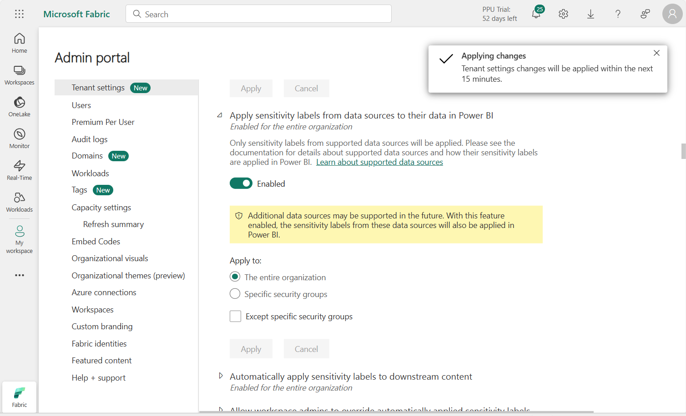

10. **Create rule**ページの **Name**フィールドに、 **Block external
    users access to Fabric workspaceと**入力します。

11. **Conditions**セクションでAdd condition \> Content contains \> Add
    \> Sensitive info types**を選択します**。

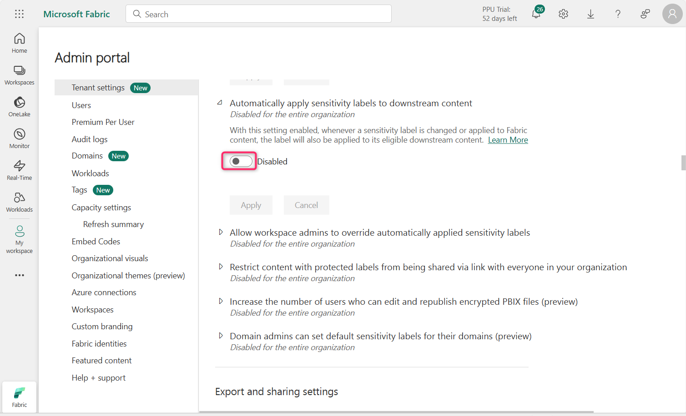

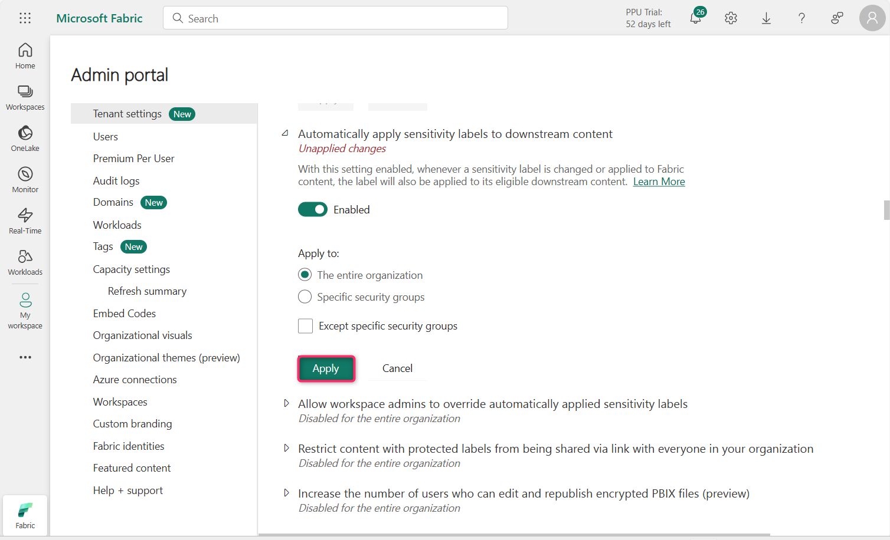

12. 右側に表示される**Sensitive info
    typesペイン**で、検索バー内をクリックし、**credit card
    number**を入力して Enter キーを押します。

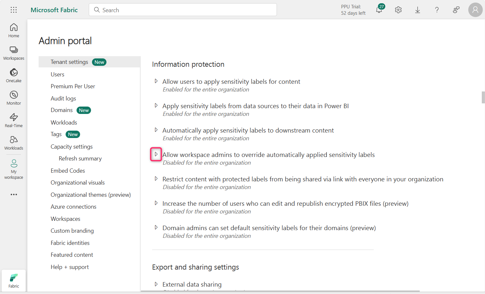

13. **Credit Card
    Number**の横にあるチェックボックスを選択して、「**Add」**ボタンをクリックします。

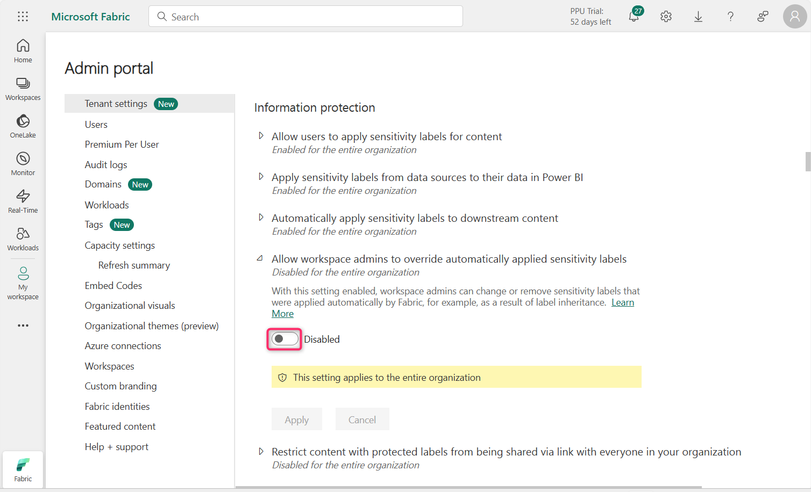

14. **Actions**セクションで**Add an action \> Restrict access or encrypt
    the content in Microsoft 365 locations**を選択します。

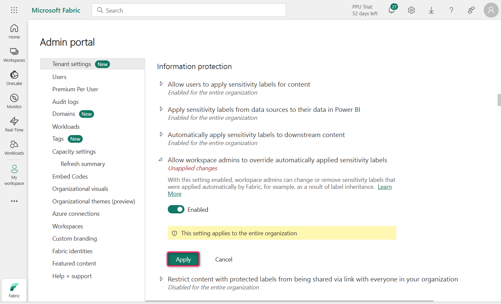

15. **\[Block users from receiving email or accessing shared SharePoint,
    OneDrive, and Teams files, and Power BI items** \]と**\[Block only
    people outside your
    organization\]**が選択されていることを確認します。

16. **User notifications**の下で、トグルを**\[On\]**に設定します。

17. **\[Notify users in Office 365 service with a policy tip or email
    notifications**\]チェック ボックスと**\[Customize the policy tip
    text\]**チェック ボックスを選択します。

18. **\[User overrides\]**セクションで、 **\[Allow users to override
    policy restrictions in Fabric (including Power BI), Exchange,
    SharePoint, OneDrive, and Teams,\]
    の**横にあるチェックボックスを選択し、 **\[beside Override the rule
    automatically if they report it as a false
    positive\]**の横にあるチェックボックスを選択します。

> 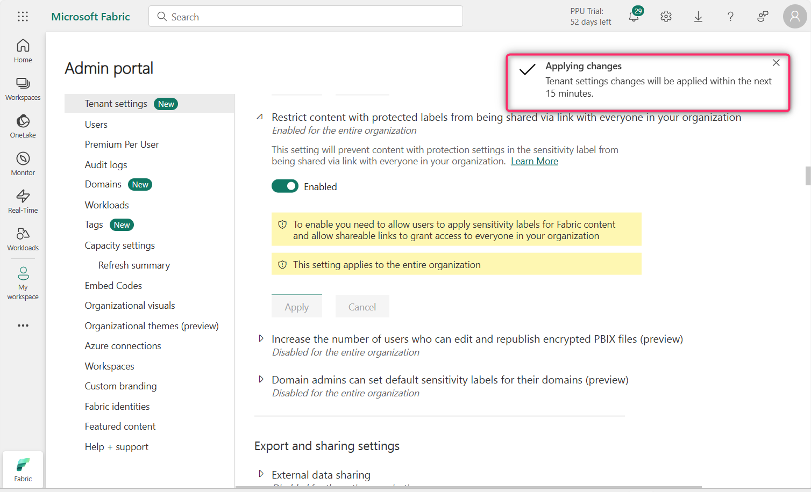

19. **Incident reportsセクション**で、 **\[Use this severity level in
    admin alerts and reports\] を\[High\]**に設定します。

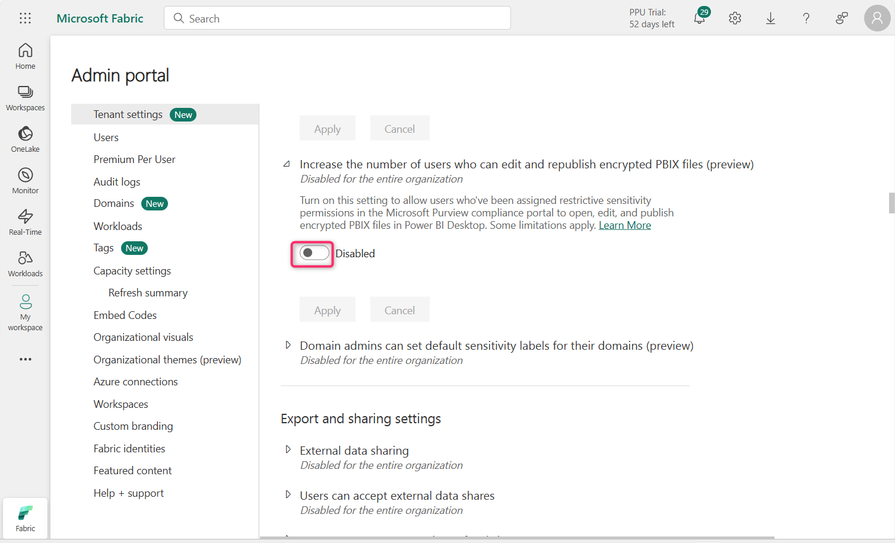

20. **Send an alert to admins when a rule match
    occurs**トグルがオンに設定されていることを確認します。

21. **「Send alert every time an activity matches the rule」**ラジオ
    ボタンが選択されていることを確認します。

22. **\[Save\]**ボタンをクリックします。

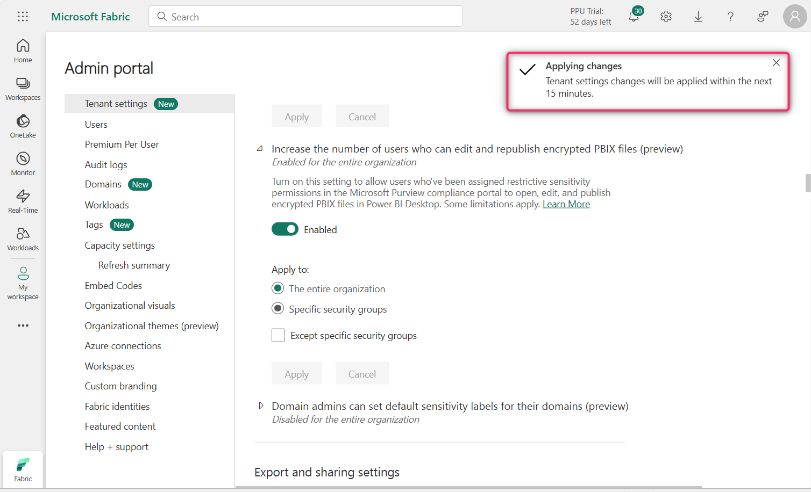

23. ルールを確認して、 **「Next」**ボタンをクリックします。

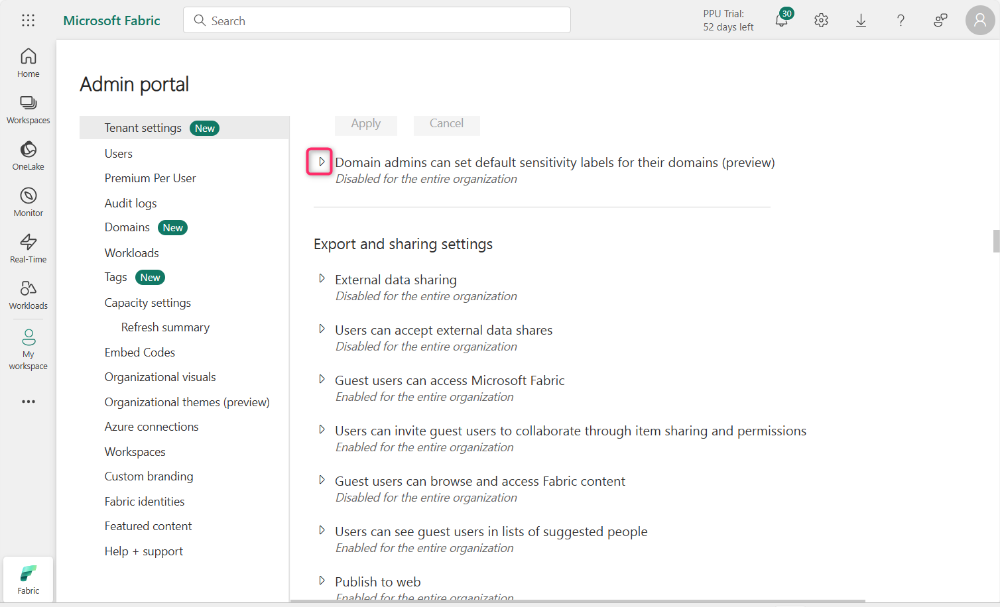

24. **「Run the policy in simulation mode」**ラジオボタンと「**Show
    policy tips while in simulation
    mode」**チェックボックスが選択されていることを確認します。
    **「Next」**ボタンをクリックします。

25. **「Review and
    finish」ページ**で**「Submit」**ボタンをクリックします。数秒後、ポリシーが正常に作成されます。　

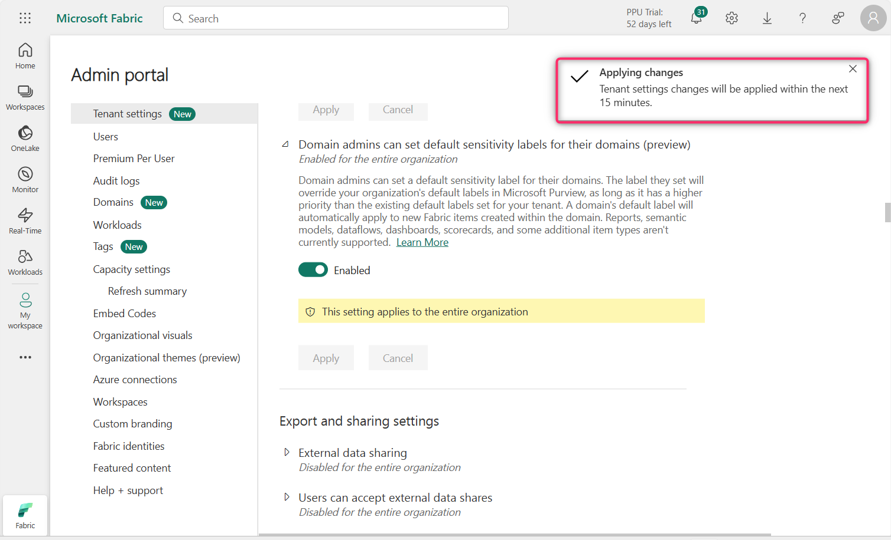

**重要な注意**:

このラボ環境ではライセンスの制限により、次のエラーが発生する可能性があります。

このラボはPower BI
Proライセンスで実行されていますが、FabricまたはPremiumワークスペース向けのMicrosoft
Purview DLP統合をサポートしていません。そのため、「Block external
users」などのDLPポリシーアクションのスコープを適切に設定できず、ウィザードが以下のエラーで失敗します。　

「To block only people outside your organization, you must select the
condition 'Content is shared with people outside my organization'」

実際のエンタープライズ環境では、テナントに次の条件が満たされている場合、この問題は発生しません。　

- Power BI Premium Per User (PPU) license

- or a Microsoft Fabric capacity (F64+)

これらのライセンスにより、ブロック
アクションと適切な条件のスコープ設定のサポートを含む、Microsoft Fabric
および Power BI との完全な DLP ポリシー統合が可能になります。

**まとめ**

このラボでは、Microsoft Purview でカスタム DLP
ポリシーを作成しました。機密データを検出し、外部ユーザーによるアクセスをブロックする制限を適用することで、Fabric
と Power BI
のコンテンツを保護します。また、このポリシーでは、ユーザーへの通知と管理者アラートも可能になります。

