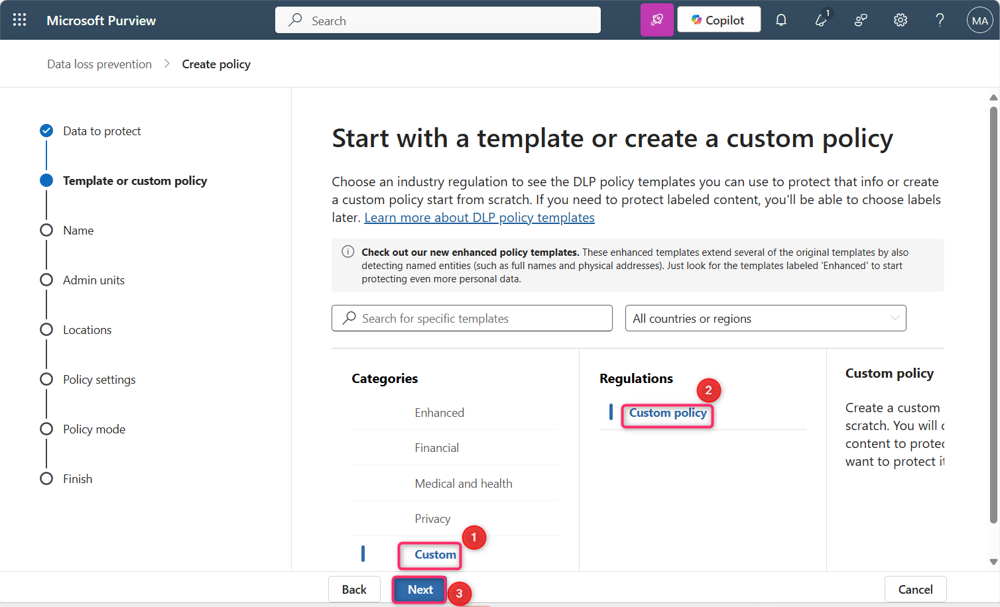
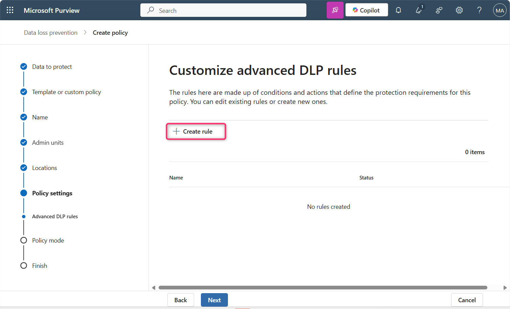
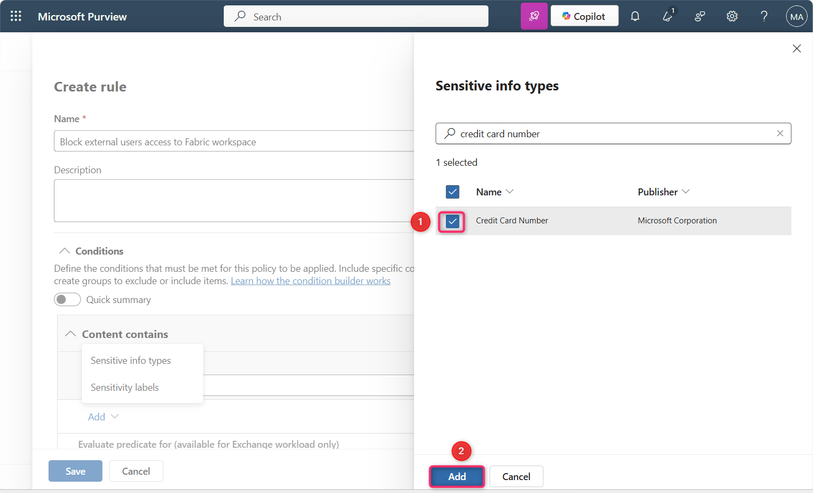
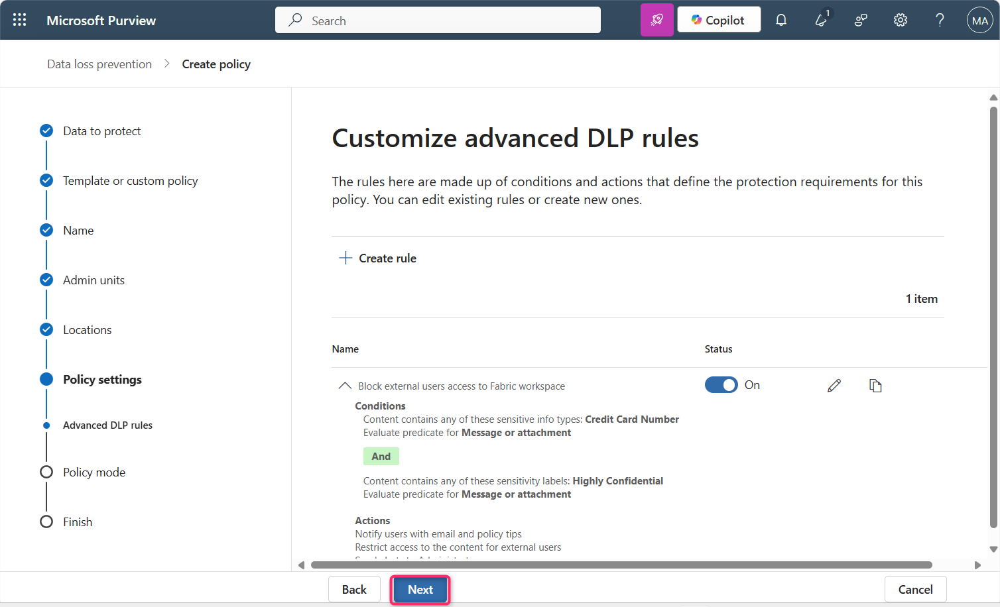

# Lab 13: Create a DLP Policy that blocks external users access to Fabric workspace

## Introduction

We need to block external users from reports containing credit card
numbers, unless the data is labeled with the 'Highly Confidential -
Internal' sensitivity label, in which case a protection policy restricts
access to select security groups. We want to notify the compliance admin
to know whenever a semantic model is blocked and the data owner to be
aware the restriction took place. We also want internal users to be
aware that the data is highly confidential and that they shouldn't share
it outside the organization.

[TABLE]

** **

**Important**

For the purposes of this policy creation procedure, you'll accept the
default include/exclude values and leave the policy turned off. You'll
be changing these when you deploy the policy.

**Objective**

Create a custom Data Loss Prevention (DLP) policy in Microsoft Purview
to block external user access to Fabric and Power BI content containing
sensitive information.

1.  In the Microsoft Purview portal, click on **Solutions**, then
    navigate and click on **Data Loss Prevention**

2.  Now, click on **Policies**.

3.  In the **Policies** page, click on **+** **Create policy**.

4.  On **Choose what type of data to protect** page, ensure that **Data
    stored in connected sources** radio button is selected, then click
    on the **Next** button.

5.  On **Start with a template or create a custom policy** page, click
    on **Custom** under **Categories**.

> Select **Custom policy** from the **Regulations** list, then click on
> the **Next** button.

6.  On the **Name your DLP policy** page, in the **Name** field, ensure
    that **Custom policy** is mentioned.

**Note**: You can use the policy intent statement here. Policies can't
be renamed.

> Click on the **Next** button.

7.  In the **Assign** **Admin units** page, click on the **Next**
    button.

8.  Scroll down and select the checkbox beside **Fabric and Power BI
    workspaces**. Then, click on the **Next** button.

9.  On the **Define policy settings** page, ensure that **Create or
    customize advanced DLP rules** radio button is selected. Then, click
    on the **Next** button.

10. In **Customize advanced DLP rules** page, select **+ Create rule**.

11. On the **Create rule** page, in the **Name** field, enter **Block
    external users access to Fabric workspace**.

12. Under **Conditions** section, select **Add condition** \> **Content
    contains** \> **Add** \> **Sensitive info types**.

13. In the **Sensitive info types** pane that appear on the right side,
    click inside the search bar, type **credit card number** and press
    the enter button.

14. Select the check box beside **Credit Card Number**, then click on
    the **Add** button.

15. Under **Conditions** section, select **Add condition** \> **Content
    contains** \> **Add** \> **Sensitivity labels**

16. Sensitivity labels pane appears on the right side, in the search
    bar, enter **Highly Confidential**, then press the enter button.

17. Select the check box beside **Highly Confidential**, then click on
    the **Add** button.

18. Under **Actions**, select **Add an action** \> **Restrict access or
    encrypt the content in Microsoft 365 locations**

19. Ensure that the **Block users from receiving email or accessing
    shared SharePoint, OneDrive, and Teams files, and Power BI
    items** and **Block only people outside your organization** are
    selected.

20. Under **User notifications**, set the toggle to **On**.

21. Select **Notify users in Office 365 service with a policy tip or
    email notifications** check box and **Customize the policy tip
    text** checkbox.

22. Provide a policy tip that explains that the data in the report is
    highly confidential is not to be shared outside the organization.

23. Under **Incident reports**, set **Use this severity level in admin
    alerts and reports** to **High**.

24. Make sure the **Send an alert to admins when a rule match
    occurs** toggle is set to **On**.

25. Make sure the **Send alert every time an activity matches the
    rule** radio button is selected.

26. Click on the **Save** button.

27. Review the rule, then click on the **Next** button.

28. Ensure that the **Run the policy in simulation mode** radio button
    and the **Show policy tips while in simulation mode** checkboxes are
    selected. Then, click on the **Next** button.

29. In **Review and finish** page, click on the **Submit** button. Wait
    for few seconds.

30. The policy is successfully created, now click on the **Done**
    button.

31. In the **Policies** page, you will see that the **Custom policy** is
    successfully created.

**Summary**

In this lab, you have created a custom DLP policy in Microsoft Purview
to protect Fabric and Power BI content by detecting sensitive data and
applying restrictions to block external user access. The policy also
enables user notifications and admin alerts, and is run in simulation
mode for testing.
