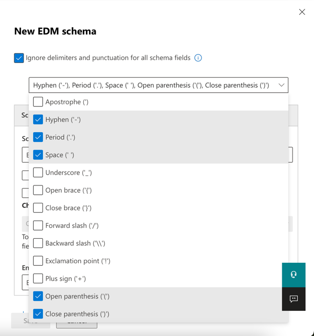
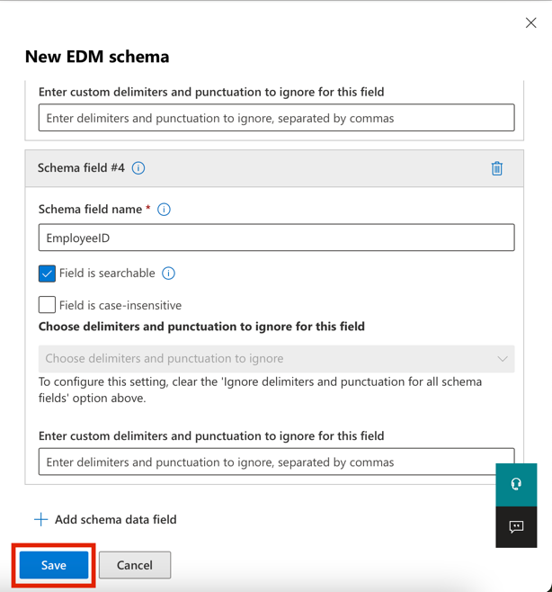
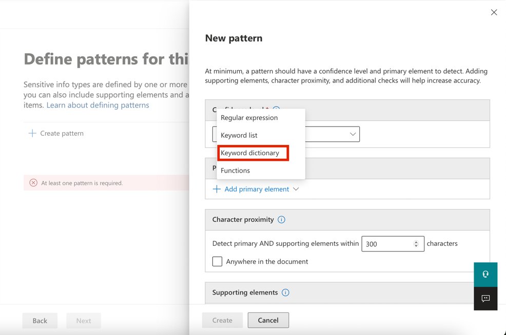
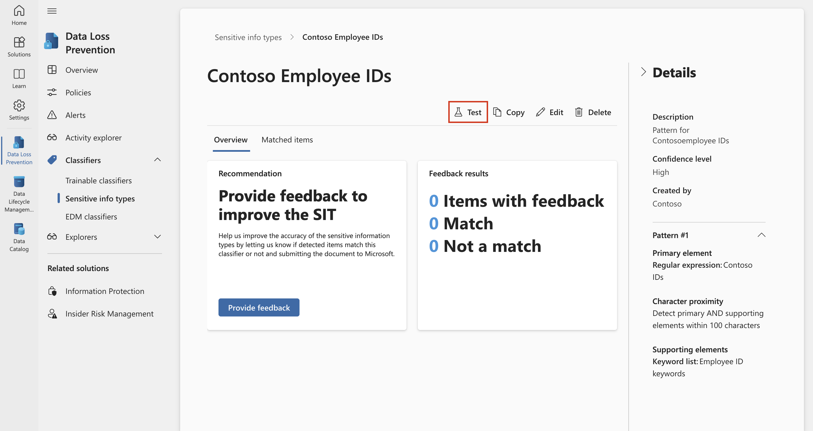
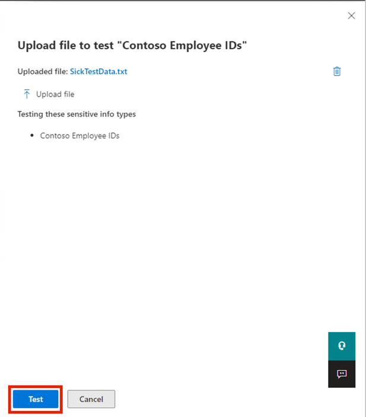
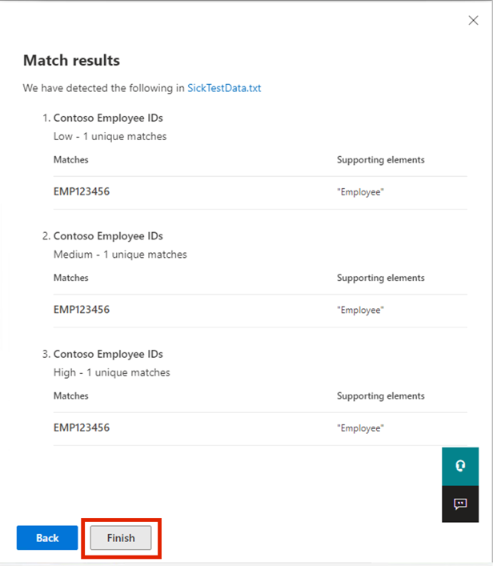

# ラボ 2 — 機密情報タイプの管理

## 目的:

Contoso Ltd. では以前、チケット ソリューションでサポート
チケットを処理する際に、従業員が誤って顧客の個人情報を送信してしまうという問題がありました。

今後ユーザーを教育するために、機密情報の種類を使用して、電子メールやドキュメント内の従業員
ID (大文字 3 文字と数字 6 文字)
を識別するためのカスタムの機密情報の種類が必要です。誤検出率を下げるために、キーワード「従業員」と「ID」を使用します。

このラボでは、次のものを作成します。

- 新しいカスタム機密情報タイプ

- EDM ベースの分類用データベース

- キーワード辞書

## エクササイズ 1 – カスタム機密情報タイプの作成

この演習では、セキュリティ & コンプライアンス センター PowerShell
モジュールを使用して、キーワード「従業員」および「ID」の近くにある従業員
ID のパターンを認識する新しいカスタム機密情報の種類を作成します。

1.  1\. Microsoft Edge で、新しい InPrivate
    ウィンドウを開き、https://purview.microsoft.com
    に移動して、ユーザー名 PattiF@{TENANTPREFIX}.onmicrosoft.com
    とリソース タブに表示されているユーザー パスワードを使用して、Patti
    Fernandez
    としてログインします。求められたら、利用規約に同意し、\[Get
    started\] を選択します。

2.  2\. 左側のナビゲーションから、\[Solutions\] \> \[Data Loss
    Prevention\] を選択します。

3.  3\. 左側のペインから「Classifiers」を選択します。サブナビゲーション
    ペインから「Sensitive info types」を選択します。「+ Create sensitive
    info
    type」を選択して、新しい機密情報の種類を作成するためのウィザードを開きます。

コンピュータのスクリーンショット 説明は自動的に生成されました

4.  4\. 「Name your sensitive info
    type」ページで、次の情報を入力します。

    - **名前**: `Contoso Employee IDs`

    - **説明**: `Pattern for Contoso Employee IDs.`

5.  **Next**を選択します。

グラフィカルユーザーインターフェイス、アプリケーションの説明は自動的に生成されます

6.  \[Define patterns for this sensitive info type\]
    ページで、\[パターンの作成\] を選択します。

コンピュータのスクリーンショット 説明は自動的に生成されました

7.  7\. 右側の「New pattern」ペインで、「Add primary
    element」を選択し、「Regular expression」を選択します。

グラフィカルユーザーインターフェイス、アプリケーション、Teamsの説明が自動的に生成されます

8.  8\. 新しい右側のペイン「Add a regular
    expression」で、次のように入力します。

    - **ID**: `Contoso IDs`

    - **Regular expression**: `\s\[A-Z\]{3}\[0-9\]{6}\s`

    - **String match**を選択します。

9.  **Done**を選択します。

グラフィカルユーザーインターフェイス、アプリケーションの説明は自動的に生成されます

10. 右側の「New pattern」ペインで、「Supporting
    elements」の下にある「Add supporting elements or group of
    elements」ドロップダウン メニューを選択し、「Keyword
    list」を選択します。

グラフィカルユーザーインターフェイス、アプリケーションの説明は自動的に生成されます

10. 新しい右側のペイン「Add a keyword list」で、次のように入力します。

    - **ID**: `Employee ID keywords`

    - **Case insensitive**:

&nbsp;

    Employee
    ID

11. S

グラフィカルユーザーインターフェイス、テキスト、アプリケーションの説明が自動的に生成されます

13. \[New pattern\] ウィンドウで、\[Character proximity\] 値を 100
    文字に減らします。

グラフィカルユーザーインターフェイス、テキスト、アプリケーションの説明が自動的に生成されます

14\. \[Create\] ボタンを選択します。

15\. \[Define patterns for this sensitive info type\]
ページに戻り、\[Next\] を選択します。

グラフィカルユーザーインターフェイス、テキスト、アプリケーション、Teamsの説明が自動的に生成されます

16. 「On the Choose the recommended confidence level to show in
    compliance
    policies」ページで、既定値を使用して「Next」を選択します。

17. \[Review settings and finish\] ページで設定を確認し、\[Create\]
    を選択します。正常に作成されたら、\[Done\] を選択します。

グラフィカルユーザーインターフェイス、テキスト、アプリケーションの説明が自動的に生成されます

18. ブラウザウィンドウを開いたままにします。

100 文字の範囲内で 3 つの大文字、6
つの数字、およびキーワード「従業員」または「ID」のパターンで従業員 ID
を識別するための新しい機密情報の種類を正常に作成しました。

## エクササイズ 2 – EDMベースの分類情報タイプの作成

追加の検索パターンとして、従業員データのデータベース スキーマを使用して
EDM ベースの分類を作成します。データベース ソース
ファイルは、従業員の次のデータ フィールドでフォーマットされます:
名前、生年月日、住所、従業員 ID。

1.  1\. \[Solutions\] \> \[Data Loss Prevention\] \> \[Classifiers\]
    を選択し、\[EDM classifiers\] に移動して \[New EDM experience\]
    をオフにし、\[EDM Schema\] から \[+ Create EDM Schema\]
    を選択して新しいスキーマ定義を作成します。

コンピュータのスクリーンショット 説明は自動的に生成されました

2.  \[Name\] フィールドに、employeedb と入力します。

3.  \[Description\] フィールドに、Employee Database schema
    と入力します。

4.  すべてのスキーマ フィールドで \[Ignore delimiters and punctuation
    for all schema fields.\] を有効にします。

コンピュータのスクリーンショット 説明は自動的に生成されました

5.  「Choose delimiters and punctuation to
    ignore」のドロップダウンをクリックし、「Hyphen」、「Period」、「Space」、「Open
    paranthesis」、および「Close paranthesis」を選択します。

グラフィカルユーザーインターフェイス、アプリケーションの説明は自動的に生成されます

6.  最初のスキーマ
    フィールド名に「Name」と入力し、「フィールドは検索可能」ボックスにチェックを入れます。

7.  下端から「+ Add schema data
    field」を選択します。

8.  スキーマ フィールド名で、スキーマ フィールド \#2 の下に、Birthdate
    と入力します。

9.  下端から + スキーマ データ フィールドの追加を再度選択します。

10. スキーマ フィールド名で、スキーマ フィールド \#3
    の下に、StreetAddress と入力します。

11. 最後にもう一度、下端から + スキーマ データ
    フィールドの追加を選択します。

12. スキーマ フィールド名で、スキーマ フィールド \#4 の下に、EmployeeID
    と入力します。

13. フィールドは検索可能を選択します。

14. \[Save\] を選択します。

グラフィカルユーザーインターフェイス、アプリケーションの説明は自動的に生成されます

15. 左側のペインから EDM 機密情報の種類を選択し、+ Create EDM sensitive
    info typeを選択して、EDM ルール パッケージ ウィザードを開きます。

16. 「Define data score schema」ページで、「Choose an existing EDM
    schema.」を選択します。

グラフィカルユーザーインターフェイス、アプリケーションの説明は自動的に生成されます

17. employeedbを選択し、「Add」を選択します。

グラフィカルユーザーインターフェイス、テキスト、アプリケーションの説明が自動的に生成されます

18. データ ストア スキーマを確認し、\[Next\] を選択します。

グラフィカルユーザーインターフェイス、アプリケーションの説明は自動的に生成されます

19. \[Define patterns for this EDM sensitive」ページで、「+ Create
    pattern」を選択します。

グラフィカルユーザーインターフェイス、アプリケーションの説明は自動的に生成されます

20. 右側の \[New pattern\] ペインの \[Primary element\]
    フィールドで、\[EmployeeID\] を選択します。

21. \[Primary element’s sensitive info type\] の下で、\[Choose sensitive
    info type\] を選択します。

パターンのスクリーンショット 自動的に生成された説明

22. 検索バーに「Contoso」と入力し、Enter キーを押します。

23. 「Contoso Employee ID」を選択し、「Done」を選択します。

24. 「Done」を選択します。

コンピュータのスクリーンショット 説明は自動的に生成されました

25. 「Next in the Define patterns for this EDM sensitive info
    type」画面で「Next」を選択します。

グラフィカルユーザーインターフェイス、テキスト、アプリケーションの説明が自動的に生成されます

26. 「Choose the recommended confidence level and character
    proximity」では、デフォルト値をそのままにして、「Next」を選択します。

グラフィカルユーザーインターフェイス、テキスト、アプリケーション、Wordの説明が自動的に生成されます

27. 「Name and describe your EDM sensitive info
    type」ページで、名前に「Contoso Employee EDM」と入力します。

28. 「Description for admins」フィールドに、従業員の個人情報の EDM
    ベースの機密情報の種類を入力します。\[Next\]
    を選択します。

グラフィカルユーザーインターフェイス、テキスト、アプリケーションの説明が自動的に生成されます

29. 設定を確認して、「Submit」を選択します。

グラフィカルユーザーインターフェイス、アプリケーションの説明は自動的に生成されます

30. 「Your EDM sensitive info type was
    created」ページで、「Done」を選択します。

コンピュータのスクリーンショット 説明は自動的に生成されました

31. Microsoft Purview ポータルでブラウザーを開いたままにしておきます。

データベース ファイル ソースから従業員データを識別するための新しい EDM
ベースの分類機密情報タイプが正常に作成されました。

## エクササイズ 3 – EDMベースの分類データソースの作成

EDM
ベースの分類を機密データを含むデータベースに関連付けるには、次に、EDM
アップロード エージェント
ツールを使用して機密情報タイプの実際のデータをハッシュしてアップロードする必要があります。

1.  Microsoft Edge で、https://go.microsoft.com/fwlink/?linkid=2088639
    に移動して、EDM ダウンロード エージェントにアクセスします。

2.  \[Run\]
    を選択して、ツールをダウンロードしてインストールします。

3.  Microsoft Exact Data Match アップロード エージェント セットアップ
    ウィザードで、\[Next\] を選択します。

    - \[I accept the terms in the License Agreement\] を選択し、\[Next\]
      を選択します。

    - デフォルトのインストール先フォルダ パスを変更せずに、\[Next\]
      を選択します。

    - \[Install\] を選択してインストールを実行します。

    - \[User Account Control\] ウィンドウが開いたら、\[Yes\]
      を選択します。

    - ログインを求められた場合は、Patti のアカウントでログインします。

    - インストールが完了したら、\[Finish\] を選択します。

    - 左下の Windows シンボルを選択してスタート
      メニューを開き、\[Notepad\] と入力して、スタート メニューから
      \[Notepad\] を選択します。

    - Notepadウィンドウの最初の行に次のテキストを入力します (次の 3
      つすべてを新しい行に入力してください)。

&nbsp;

    Name,Birthdate,StreetAddress,EmployeeID
    Patti Fernandez,01.06.1980,1Main Street,CSO123456
    Christie Cline,31.01.1985,2Secondary Street,CSO654321

4.  ファイルを選択し、EmployeeData.csv として保存します。

5.  ファイルの種類でドロップダウンを選択し、すべてのファイル (.)
    を選択します。

6.  エンコードでドロップダウンを選択し、UTF-8
    を選択して保存を選択します。

7.  Notepadウィンドウを閉じます。

8.  タスクバーの Windows シンボルをマウスの右ボタンで選択し、\[Windows
    PowerShell (Admin)\] を選択して管理者として実行します。

9.  `ユーザー`` ``アカウント制御ウィンドウが開いたら、``[``Yes``] ``を選択します。`

10. `EDM ``アップロード`` ``エージェント`` ``ディレクトリに移動します。`

> `cd "C:\Program Files\Microsoft\``EdmUploadAgent``"`

自動生成されるテキスト説明

11. 次のコマンドレットを実行して、アカウントでデータベースをテナントにアップロードすることを承認します。

`.\EdmUploadAgent.exe /Authorize`

12. \[Pick an account\] ウィンドウが表示されたら、ユーザー名
    PattiF@{TENANTPREFIX}.onmicrosoft.com とリソース
    タブで指定されたユーザー パスワードを使用して、Patti Fernandez
    としてログインします。(またはリセットした新しいパスワード)

注: 次の手順では、ファイルのパスが VM
内のパスと似ていることを確認してください。手順やスクリーンショットとは異なる場合があります。その場合は、コマンド内のファイルのパスを適宜変更してください。

13. PowerShellで次のスクリプトを実行して、EDMベースの分類機密情報タイプのデータベーススキーマ定義をダウンロードします。

`.\EdmUploadAgent.exe /``SaveSchema`` /``DataStoreName`` ``employeedb`` /OutputDir "C:\Users\Admin\Documents\"`

注: 最後のコマンドが失敗した場合、EDM_DataUploaders
グループのメンバーシップが適用されるまでさらに時間がかかる可能性があります。スキーマ
ファイルをダウンロードできるようになるまで、最大 1
時間かかることがあります。失敗した場合は、次のタスクに進み、後でこの手順に戻ります。または、VM
上のドキュメント フォルダーのパスを確認してください。

14. PowerShell で次のスクリプトを実行して、データベース
    ファイルをハッシュし、EDM
    ベースの分類機密情報タイプにアップロードします。

`.\EdmUploadAgent.exe /``UploadData`` /``DataStoreName`` ``employeedb`` /DataFile "C:\Users\Admin\Documents\EmployeeData.csv" /HashLocation "C:\Users\Admin\Documents\" /Schema "C:\Users\Admin\Documents\employeedb.xml"`

注意: 次のエラーが発生した場合

エラーの種類: System.IO.FileNotFoundException

エラー メッセージ: 指定されたファイルが見つかりません。

EmployeeData.csv ファイルを保存したパスを確認してください

自動生成されるテキスト説明

15. アップロードの進行状況を確認し、状態が完了に変わったら、次の
    PowerShell コマンドを実行します。

`.\EdmUploadAgent.exe /``GetSession`` /``DataStoreName`` ``employeedb`

EDM ベースの分類機密情報タイプのデータベース
ファイルをハッシュしてアップロードしました。

## エクササイズ 4 – キーワード辞書の作成

同僚が病欠を報告した後にユーザーがメールを送信した際に、個人情報漏洩の違反が複数発生しました。その場合、病気や疾患の理由が送信されました。私たちはそのようなことが起きてほしくありません。

1.  Microsoft Edge で、新しい InPrivate
    ウィンドウを開き、https://purview.microsoft.com
    に移動して、ユーザー名 PattiF@{TENANTPREFIX}.onmicrosoft.com
    とリソース タブに表示されているユーザー パスワードを使用して Patti
    Fernandez としてログインします。

2.  左側のナビゲーションから、\[Solutions\] \> \[Data Loss Prevention\]
    を選択します。

コンピュータのスクリーンショット 説明は自動的に生成されました

3.  左側のペインから「Classifiers」を選択します。サブナビゲーション
    ペインから「Sensitive info types」を選択します。「+ Create sensitive
    info
    type」を選択して、新しい機密情報の種類を作成するためのウィザードを開きます。

コンピュータのスクリーンショット 説明は自動的に生成されました

4.  「Name your sensitive info type」ページで、次のように入力します。

    - Name: `Contoso Diseases List`

    - Description: `List of possible diseases of employees.`

グラフィカルユーザーインターフェイス、アプリケーション、Teamsの説明が自動的に生成されます

5.  **Next**を選択します。

6.  6\. \[Define patterns for this sensitive info type\] ページで、\[+
    Create pattern\] を選択します。

グラフィカルユーザーインターフェイス、アプリケーション、Teamsの説明が自動的に生成されます

7.  「Primary element」の下のドロップダウン
    フィールドを選択し、「Keyword dictionary」を選択します。

グラフィカルユーザーインターフェイス、アプリケーションの説明は自動的に生成されます

8.  「Add a keyword dictionary」ページで、「Diseases
    dictionary」という名前を入力します。

9.  「Keyword」領域に、次のキーワードをそれぞれ別の行に入力します。

&nbsp;

    flu
    influenza
    cold
    bronchitis
    otitis

10. \[Done\] を選択します。

11. \[Supporting elements\] の下で、\[+Add supporting elements or group
    of elements\] ドロップダウンを選択し、キーワード
    リストを選択して、キーワード辞書の追加サポートを追加します。

グラフィカルユーザーインターフェイス、アプリケーションの説明は自動的に生成されます

12. キーワードリストの追加ページで、IDフィールドに従業員の不在を入力します。大文字と小文字を区別しないボックスに、次のキーワードをそれぞれ別の行に入力します。

&nbsp;

    employee
    absence
    reason

グラフィカルユーザーインターフェイス、アプリケーションの説明は自動的に生成されます

13. \[Done\] を選択します。

14. \[New pattern\] ページで、構成を確認し、\[Create\] を選択します。

グラフィカルユーザーインターフェイス、アプリケーションの説明は自動的に生成されます

15. 「Define patterns for this sensitive
    info」で、「Next」を選択します。

グラフィカルユーザーインターフェイス、アプリケーション、Teamsの説明が自動的に生成されます

16. 「Choose the recommended confidence level to show in compliance
    policies」では、既定値をそのままにして、「Next」を選択します。

コンピュータのスクリーンショット 説明は自動的に生成されました

17. \[Review settings and finish\] ページで設定を確認し、\[Create\]
    を選択します。プロセスが完了したら、\[Done\] を選択します。

18. Microsoft Purview ポータルのブラウザ
    ウィンドウを開いたままにしておきます。

キーワード辞書に基づいて新しい機密情報タイプを作成し、誤検出率を下げるためにキーワードを追加しました。次のタスクに進みます。

## エクササイズ 5 – カスタムの機密情報タイプの操作

カスタムの機密情報タイプは、ポリシーで使用する前に必ずテストする必要があります。そうしないと、カスタム検索パターンの誤動作により、データの損失や漏洩が発生する可能性があります。

1.  左下の Windows シンボルを選択してスタート
    メニューを開き、Notepadと入力してスタート
    メニューからNotepadを選択します。

2.  Notepadウィンドウに次のテキストを入力します。

`Employee Patti Fernandez EMP123456 is on absence because of the flu/influenza`

3.  \[File\] を選択し、\[SickTestData としてSave を選択して、\[Save\]
    を選択します。

4.  メモ帳ウィンドウを閉じます。

5.  Microsoft Edge で、Microsoft Purview ポータル
    タブがまだ開いているはずです。開いている場合は、それを選択して次の手順に進みます。閉じた場合は、新しいタブで
    https://purview.microsoft.com に移動します。ユーザー名
    PattiF@{TENANTPREFIX}.onmicrosoft.com とリソース
    タブで指定されたユーザー パスワードを使用して、Patti Fernandez
    としてログインします。

6.  左側のナビゲーション ペインで \[Solutions\] \> \[Data Loss
    Prevention\] を選択し、\[Classifiers\] の下の \[Sensitive info types
    under Classifiers\] を選択します。右上の検索ボックスに Contoso
    と入力して Enter キーを押します。\[Contoso Employee ID\]
    を選択して、右側のペインを開きます。

コンピュータのスクリーンショット 説明は自動的に生成されました

7.  右側のペインから「Test」を選択します。

コンピュータのスクリーンショット 説明は自動的に生成されました

8.  8\. 「Upload file to test」ページで、「Upload file」を選択します。

9.  左側のペインから「Document」を選択し、「SickTestData」という名前のファイルを選択して「OPen」を選択します。

グラフィカルユーザーインターフェイス、テキスト、アプリケーションの説明が自動的に生成されます

10. 「Test」を選択して分析を開始します。

グラフィカルユーザーインターフェイス、テキスト、アプリケーションの説明が自動的に生成されます

11. 「Match results」ページで、見つかった一致を確認します。

12. \[Finish\] を選択し、\[X\] ボタンをクリックしてテスト
    ページを閉じます。

グラフィカルユーザーインターフェイス、テキスト、アプリケーションの説明が自動的に生成されます

13. データ分類ページに戻り、「Contoso Diseases
    List」という名前の機密情報タイプを選択します。

14. 右側のペインで、「Test」を選択します。

15. 「Upload file to test」ページで、「Upload file」を選択します。

16. 16\. 左側のペインから「Document」を選択し、SickTestData
    という名前のファイルを選択して「Open」を選択します。

17. 17\. 「Test」を選択して分析を開始します。

グラフィカルユーザーインターフェイス、テキスト、アプリケーションの説明が自動的に生成されます

18. 「Match
    results」ページで、見つかった一致を確認します。確認が完了したら、「Finish」を選択します。

グラフィカルユーザーインターフェイス、アプリケーションの説明は自動的に生成されます

## 概要:

2
つのカスタム機密情報タイプを正常にテストし、検索パターンが目的のパターンを認識することを検証しました。機密情報タイプの作成は完了したので、次の演習に進むことができます。
