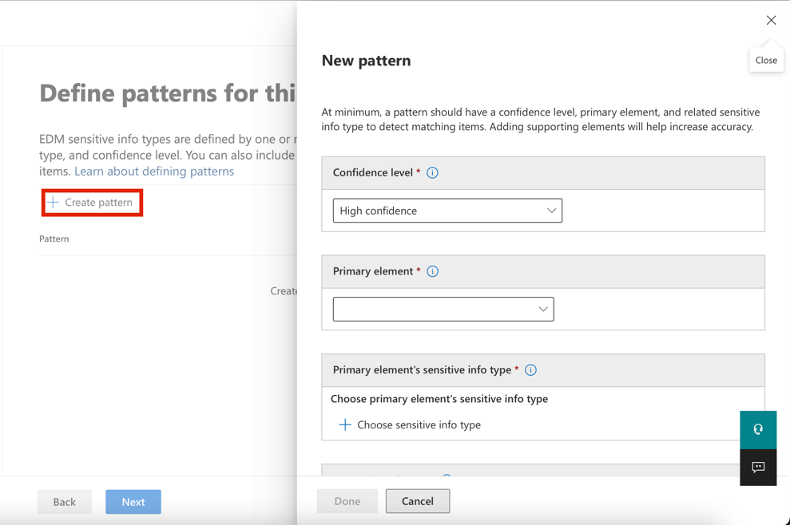
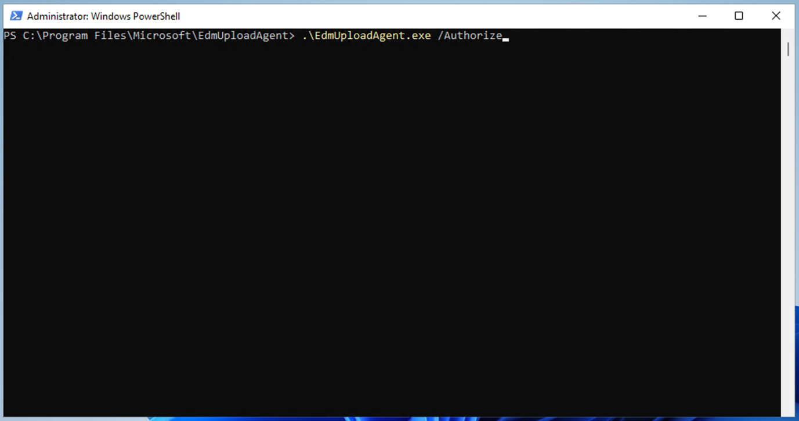
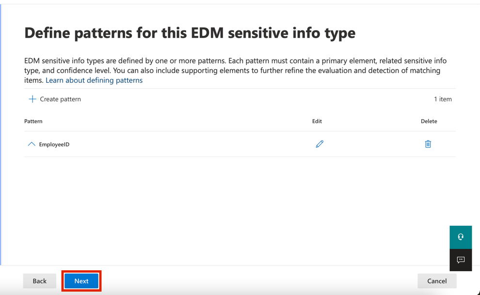
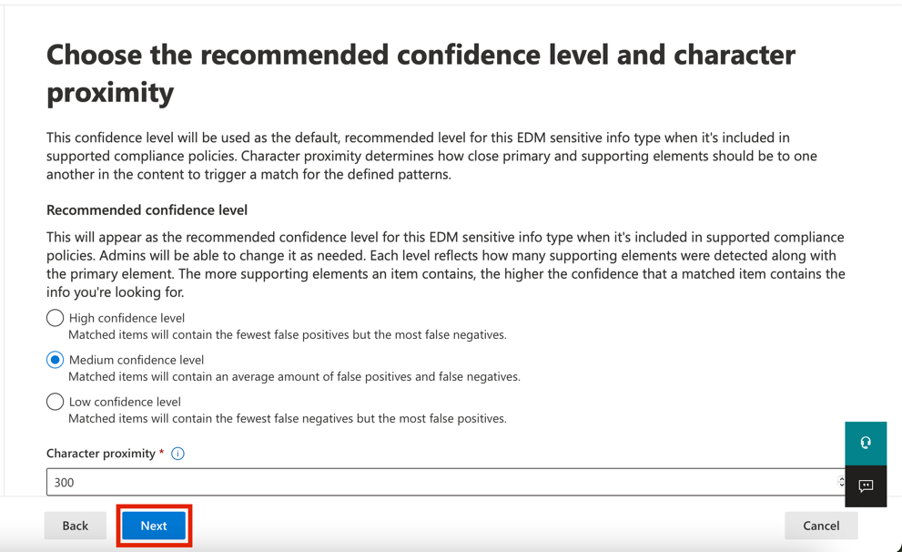
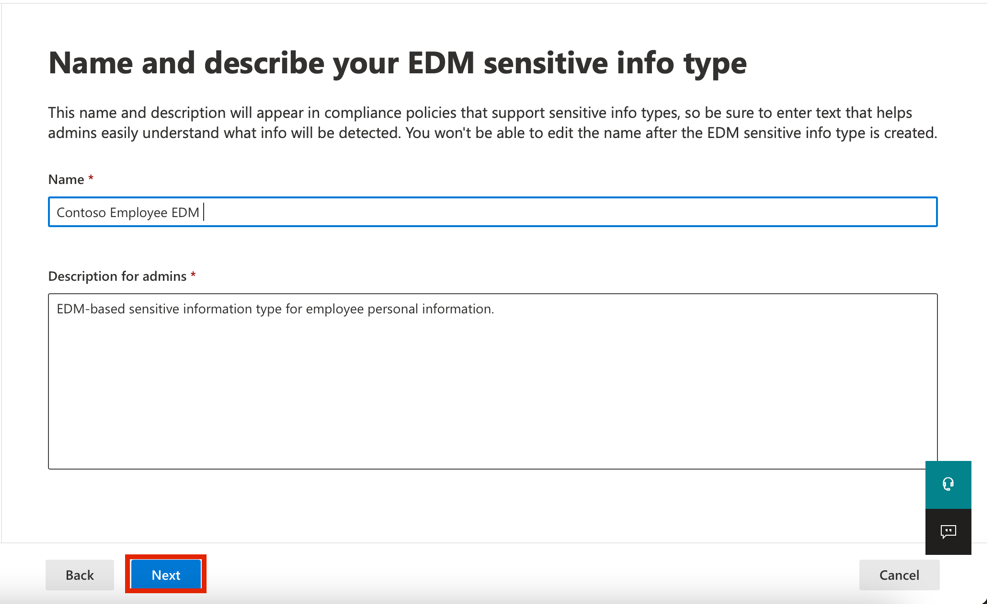
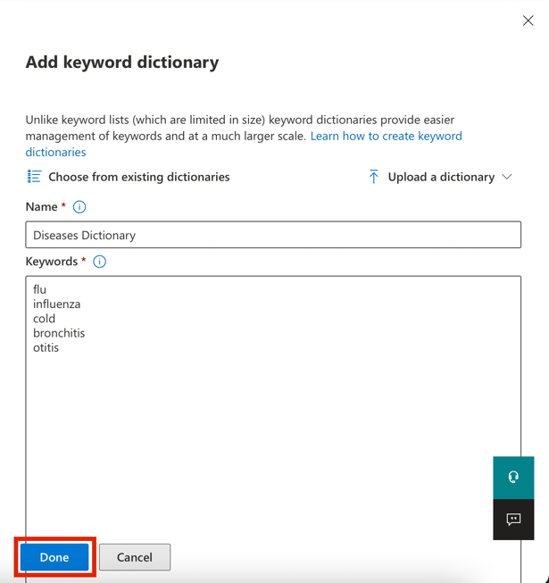
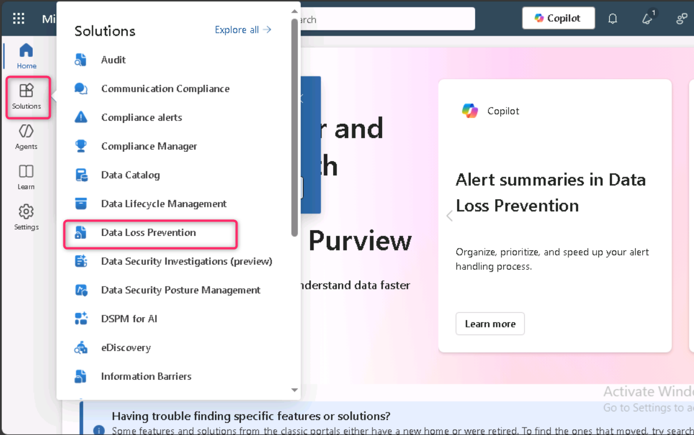
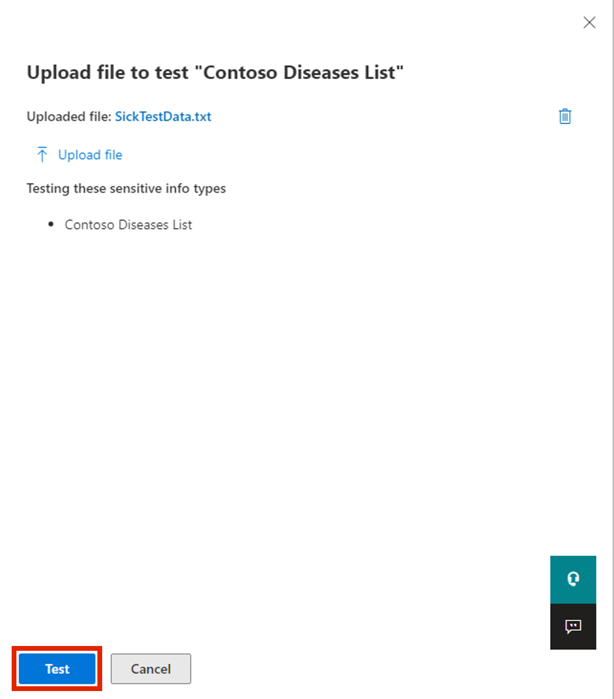

# 실습 2 — 중요한 정보 유형을 관리하기

## 목표:

Contoso Ltd.는 이전에 티켓팅 솔루션에서 지원 티켓에 대해 작업할 때
직원이 실수로 고객으로부터 개인 정보를 보내는 문제가 있었습니다.

향후 사용자를 교육하기 위해 중요한 정보 유형을 사용하여 3개의 대문자와
6개의 숫자로 구성된 전자 메일 및 문서에서 직원 ID를 식별하려면 사용자
지정 중요한 정보 유형이 필요합니다. 거짓 긍정 비율을 낮추기 위해
"Employee" 및 "IDs" 키워드가 사용됩니다.

이 실습에서는 다음을 생성할 것입니다:

- 새로운 사용자 지정 중요한 정보 유형

- EDM 기반 분류를 위한 데이터베이스

- 키워드 사전

## 연습 1 – 사용자 지정 중요한 정보 유형을 생성하기

이 연습에서는 **Security & Compliance Center PowerShell** 모듈을
사용하여 키워드 "Employee" 및 "ID" 근처의 직원 ID 패턴을 인식하는 새로운
사용자 지정 중요한 정보 유형을 생성할 것입니다.

1.  **Microsoft Edge**에서 **New InPrivate Window**를 열고
    `https://purview.microsoft.com` 로 이동하고 사용자
    이름`PattiF``@{TENANTPREFIX}.onmicrosoft.com` 와 리소스 탭에 제공된
    사용자 암호를 사용하여 **Patti Fernandez**로 로그인하세요. 메시지가
    표시되면 사용 약관에 동의하고**Get started**을 선택하세요.

2.  왼쪽 탐색에서 **Solutions** \> **Data Loss Prevention**를
    선택하세요.

3.  왼쪽 창에서**Classifiers** 를 선택하세요. 하위 탐색
    창에서**Sensitive info types**를 선택하세요. 새 중요한 정보 유형에
    대한 wizard를 열기 위해 **+Create sensitive info type**를
    선택하세요.

컴퓨터 설명의 스크린샷 자동으로 생성됩니다

4.  **Name your sensitive info type** 페이지에서 다음 정보를 입력하세요:

    - **이름**: `Contoso Employee IDs`

    - **설명**: `Pattern for Contoso Employee IDs.`

5.  **Next**를 선택하세요.

그래픽 사용자 인터페이스, 애플리케이션 설명이 자동으로 생성됩니다

6.  **Define patterns for this sensitive info type** 페이지에서**Create
    pattern**를 선택하세요.

컴퓨터 설명의 스크린샷 자동으로 생성됩니다

7.  오른쪽**New pattern** 창에서 **Add primary element**를
    선택하여**Regular expression**를 선택하세요.

그래픽 사용자 인터페이스, 애플리케이션, 팀 설명이 자동으로 생성됩니다

8.  새 오른쪽 창에서**Add a regular expression**하여 다음을 입력하세요:

    - **ID**: `Contoso IDs`

    - **정규식**: `\s\[A-Z\]{``3}\``[0-9\]{``6}\``s`

    - **String match** 선택

9.  **Done**를 선택하세요.

그래픽 사용자 인터페이스, 애플리케이션 설명이 자동으로 생성됩니다

10. 다시 오른쪽의**New pattern** 창에서**Supporting elements** 아래에서
    **+ Add supporting elements or group of elements** 도롭다운 메뉴를
    선택하고**Keyword list**를 선택하세요.

그래픽 사용자 인터페이스, 애플리케이션 설명이 자동으로 생성됩니다

10. 새 오른쪽 창에서**Add a keyword list**하여 다음을 입력하세요:

    - **ID**: `Employee ID keywords`

    - **대소문자 구분 안 함**:

&nbsp;

    Employee
    ID

11. **Case Sensitive** 필드에서 ***Word match***에 대한 방사형을
    선택하세요

12. **Done**를 선택하세요.

그래픽 사용자 인터페이스, 텍스트, 애플리케이션 설명이 자동으로
생성됩니다

13. New pattern 창에서 **Character proximity** 값을 ***100***자로
    줄이세요.

그래픽 사용자 인터페이스, 텍스트, 애플리케이션 설명이 자동으로
생성됩니다

14. **Create** 버튼을 선택하세요.

15. **Define patterns for this sensitive info type** 페이지로
    돌아가서**Next**를 선택하세요.

그래픽 사용자 인터페이스, 텍스트, 애플리케이션, Teams 설명이 자동으로
생성됩니다

16. **Choose the recommended confidence level to show in compliance
    policies** 페이지에서 기본 값을 사용하여**Next**를 선택하세요.

17. **Review settings and finish** 페이지에서 설정을
    검토하고**Create**를 선택하세요. 성공적으로 생성되면**Done**를
    선택하세요.

그래픽 사용자 인터페이스, 텍스트, 애플리케이션 설명이 자동으로
생성됩니다

18. 브라우저 창을 열러 두세요.

대문자 3개, 숫자 6개, 100자 범위 내의 키워드 'Employee' 또는 'IDs'
패턴으로 직원 ID를 식별하는 새로운 중요한 정보 유형을 성공적으로
생성했습니다.

## 연습 2 – EDM-기반 분류 정보 유형을 생성하기

추가 검색 패턴으로 직원 데이터의 데이터베이스 스키마를 사용하여 EDM 기반
분류를 생성할 것입니다. 데이터베이스 소스 파일은 직원의 Name, Birthdate,
StreetAddress 및 EmployeeID 데이터 필드로 형식이 지정될 것입니다.

1.  **Solutions** \> **Data Loss Prevention** \> **Classifiers**를
    선택하여**EDM classifiers**로 이동하여 **New EDM experience**를
    끄고EDM Schema에서 새 스키마 정의를 생성하기 위해 **+ Create EDM
    schema**를 선택하세요.

컴퓨터 설명의 스크린샷 자동으로 생성됩니다

2.  **Name** 필드에서 `employeedb``를`` ``입력하세요`.

3.  **Description** 필드에서`Employee Database schema.`.를 입력하세요.

4.  **Ignore delimiters and punctuation for all schema fields**를
    활성화하세요.

컴퓨터 설명의 스크린샷 자동으로 생성됩니다

5.  **Choose delimiters and punctuation to ignore** 드롭다운을 클릭하고
    **Hyphen**, **Period**, **Space**, **Open parenthesis** 및 **Close
    parenthesis**를 선택하세요.

그래픽 사용자 인터페이스, 애플리케이션 설명이 자동으로 생성됩니다

6.  첫번째Schema 필드 이름에 `Name` 를 입력하여 **Field is searchable**
    상자를 표시하세요.

7.  하단에서 **+ Add schema data field** 선택하세요.

8.  **Schema field name**에서**Schema field \#2**아래에 `Birthdate`를
    입력하세요.

9.  다시 하단에서 **+ Add schema data field** 를 선택하세요.

10. **Schema field name**에서 **Schema field
    \#3**아래에`StreetAddress`를 입력하세요.

11. 마지막으로 하단에서 **+ Add schema data field**를 선택하세요.

12. **Schema field name**에서 **Schema field \#4**아레에 `EmployeeID`를
    입력하세요.

13. **Field is searchable**를 선택하세요.

14. **Save**를 선택하세요.

그래픽 사용자 인터페이스, 애플리케이션 설명이 자동으로 생성됩니다

15. 왼쪽 창에서**EDM sensitive info types**를 선택하여**EDM rule
    package** wizard를 열기 위해 **+ Create EDM sensitive info type**를
    선택하세요.

16. **Define data store schema** 페이지에서 **Choose an existing EDM
    schema**를 선택하세요.

그래픽 사용자 인터페이스, 애플리케이션 설명이 자동으로 생성됩니다

17. **employeedb** 를 선택하여**Add**를 선택하세요.

그래픽 사용자 인터페이스, 텍스트, 애플리케이션 설명이 자동으로
생성됩니다

18. Data store schema를 검토하여**Next**를 클릭하세요.

그래픽 사용자 인터페이스, 애플리케이션 설명이 자동으로 생성됩니다

19. **Define patterns for this EDM sensitive info type** 페이지에서 **+
    Create pattern**를 선택하세요.

그래픽 사용자 인터페이스, 애플리케이션 설명이 자동으로 생성됩니다

20. 오른쪽 **New pattern** 창에서 **Primary element**
    필드에서***EmployeeID***를 선택하세요.

21. **Primary element’s sensitive info type**아래에서 **Choose sensitive
    info type**를 선택하세요.

Description이 자동으로 생성된 패턴의 스크린샷

22. **Search** 바에서***Contoso***를 입력하여enter 키를 입력하세요.

23. **Contoso Employee** IDs를 선택하여**Done**를 선택하세요.

24. **Done**를 선택하세요.

컴퓨터 설명의 스크린샷 자동으로 생성됩니다

25. **Define patterns for this EDM sensitive info type**
    화면에서**Next** 를 선택하세요.

그래픽 사용자 인터페이스, 텍스트, 애플리케이션 설명이 자동으로
생성됩니다

26. **Choose the recommended confidence level and character
    proximity**에서 기본값을 유지하고**Next**를 선택하세요.

그래픽 사용자 인터페이스, 텍스트, 애플리케이션, Word 설명이 자동으로
생성됩니다

27. **Name and describe your EDM sensitive info type** 페이지에서
    이름을`Contoso Employee EDM` 로 입력하세요.

28. **Description for admins** 필드에서
    `EDM-based sensitive information type for employee personal information.`.를
    입력하여**Next**를 선택하세요**.**

그래픽 사용자 인터페이스, 텍스트, 애플리케이션 설명이 자동으로
생성됩니다

29. 설정을 검토하여**Submit**을 선택하세요.

그래픽 사용자 인터페이스, 애플리케이션 설명이 자동으로 생성됩니다

30. **Your EDM sensitive info type was created** 페이지에서 **Done**을
    선택하세요.

컴퓨터 설명의 스크린샷 자동으로 생성됩니다

31. Microsoft Purview 포털을 사용하여 브라우저를 열어 두세요.

데이터베이스 파일 원본에서 직원 데이터를 식별하기 위한 새로운 EDM 기반
분류에 민감한 정보 유형을 성공적으로 생성했습니다.

## 연습 3 – EDM 기반 분류 데이터 소스를 생성하기

EDM 기반 분류를 중요한 데이터가 포함된 데이터베이스와 연결하려면 EDM
Upload Agent 도구를 통해 중요한 정보 유형에 대한 실제 데이터를 해시하고
업로드해야 합니다.

1.  **Microsoft Edge**에서 EDM 다운로드 에이전트를 액세스하기
    위해`https://go.microsoft.com/fwlink/?linkid=2088639` 로 이동하세요.

2.  도구를 다운로드와 설치하기 위해**Run** 을 선택하세요.

3.  **Microsoft Exact Data Match Upload Agent Setup**
    wizard에서**Next**를 선택하세요.

    - **I accept the terms in the License Agreement**를 선택하여
      **Next**를 선택하세요.

    - 기본 대상 **Destination Folder** 경로를 변경하지 말고 **Next**를
      선택하세요.

    - 설치하기 위해**Install** 을 선택하세요.

    - **User Account Control** 창이 열면**Yes**를 선택하세요.

    - 로그인을 요청하면**Patti의** 계정을 통해 로그인하세요.

    - 설치가 왼료되면 **Finish**를 선택하세요.

    - 왼쪽 아래에 있는 Windows 기호를 선택하여 시작 메뉴를
      열고**Notepad**을 입력한 후 시작 메뉴에서**Notepad**을 선택하세요.

    - 메모장 창의 첫 번째 줄에 다음 텍스트를 입력하세요 (다음 세 줄을
      모두 새 줄에 입력해야 합니다).

&nbsp;

    Name,Birthdate,StreetAddress,EmployeeID
    Patti Fernandez,01.06.1980,1Main Street,CSO123456
    Christie Cline,31.01.1985,2Secondary Street,CSO654321

4.  File을 선택하고: `EmployeeData.csv`로 선택하세요`.`

5.  **Save as type:** 드롭다운을 선택하여**All Files (*.*)**를
    선택하세요.

6.  **Encoding:** 드롭다운을 선택하여**UTF-8**를 선택하고**Save**를
    선택하세요.

7.  Notepad 창을 닫으세요.

8.  마우스 오른쪽 버튼으로 작업 표시줄에서 windows 기호를
    선택하고**Windows PowerShell (Admin)**을 선택하고 관리자 권한으로
    실행하세요.

9.  **User Account Control** 창이 열면**Yes**를 선택하세요.

10. EDM Upload Agent 디렉터리로 이동하세요:

`cd "C:\Program Files\Microsoft\``EdmUploadAgent``"`

텍스트 설명이 자동으로 생성됩니다

11. 다음 cmdlet을 실행하여 테넌트에 데이터베이스를 업로드할 수 있는
    권한을 계정으로 부여하세요:

`.\EdmUploadAgent.exe /Authorize`

12. **Pick an account**창이 표시되면 사용자 이름
    `PattiF``@{TENANTPREFIX}.onmicrosoft.com`` `및 리소스 탭에 지정된
    사용자 암호를 사용하여 **Patti Fernandez**로 로그인하세요. (또는
    재설정한 새 암호)

**참고**: 다음 단계에서는 파일의 경로가 VM의 경로와 유사한지 확인하세요.
지침이나 스크린샷과 다를 수 있습니다. 이 경우 그에 따라 명령에서 파일
경로를 변경하세요.

13. PowerShell에서 다음 스크립트를 실행하여 EDM 기반 분류 중요한 정보
    유형의 데이터베이스 스키마 정의를 다운로드합니다

`.\EdmUploadAgent.exe /``SaveSchema`` /``DataStoreName`` ``employeedb`` /``OutputDir`` "C:\Users\Admin\Documents\"`

**참고**: 마지막 명령이 실패하면 **EDM_DataUploaders** 그룹 멤버십이
적용될 때까지 시간이 더 걸릴 수 있습니다 . 스키마 파일을 다운로드할 수
있을 때까지 최대 1시간이 걸릴 수 있습니다. 실패하면 다음 작업으로
진행하고 나중에 이 단계로 돌아갑니다. 또는 VM의 문서 폴더 경로를
확인합니다.

14. 데이터베이스 파일을 해시하고 PowerShell에서 다음 스크립트를 실행하여
    EDM 기반 분류 중요한 정보 유형에 업로드하세요:

`.\EdmUploadAgent.exe /``UploadData`` /``DataStoreName`` ``employeedb`` /``DataFile`` "C:\Users\Admin\Documents\EmployeeData.csv" /``HashLocation`` "C:\Users\Admin\Documents\" /Schema "C:\Users\Admin\Documents\employeedb.xml"`

**참고:** 다음과 같은 오류가 발생하는 경우

오류 유형: System.IO.FileNotFoundException

오류 메시지: 지정된 파일을 찾을 수 없습니다..

파일 EmployeeData.csv을 저장한 경로를 확인하세요

텍스트 설명이 자동으로 생성됩니다

15. 상태가 완료되면 변경될 때까지 업로드 진행률을 확인한 후 다음
    PowerShell 명령을 실행하세요:

`.\EdmUploadAgent.exe /``GetSession`` /``DataStoreName`` ``employeedb`

EDM 기반 분류에 민감한 정보 유형에 대한 데이터베이스 파일을 성공적으로
해시하고 업로드했습니다.

## 연습 4 – 키워드 사전을 생성하기

동료가 병가를 신고한 후 사용자가 이메일을 발송하는 과정에서 여러 건의
개인정보 유출 사례가 발생했습니다. 그런 일이 일어났을 때 병이나 질병의
원인을 알려 주었습니다. 우리는 그런 일이 일어나지 않기를 바랍니다.

1.  **Microsoft Edge**에서**New InPrivate Window**를 열고
    `https://purview.microsoft.com` 로 이동하여 사용자 이름
    `PattiF``@{TENANTPREFIX}.onmicrosoft.com` 및 리소스 탭에 제공괸
    사용자 암호를 사용하여 **Patti Fernandez**로 로그인하세요.

2.  왼쪽 탐색에서**Solutions** \> **Data Loss Prevention**를 선택하세요.

컴퓨터 설명의 스크린샷 자동으로 생성됩니다

3.  왼쪽 창에서**Classifiers**를 선택하세요. 하위 탐색 창에서**Sensitive
    info types**를 선택하세요. **+Create sensitive info type** 를
    선택하여 새 중요한 정보 유형에 대한 wizard를 여세요.

컴퓨터 설명의 스크린샷 자동으로 생성됩니다

4.  **Name your sensitive info type** 페이지에서 다음을 입력하세요:

    - Name: `Contoso Diseases List`

    - Description: `List of possible diseases of employees.`

그래픽 사용자 인터페이스, 애플리케이션, 팀 설명이 자동으로 생성됩니다

5.  **Next**를 선택하세요.

6.  **Define patterns for this sensitive info type** 페이지에서 **+
    Create pattern**를 선택하세요.

그래픽 사용자 인터페이스, 애플리케이션, 팀 설명이 자동으로 생성됩니다

7.  **Primary element** 아래의 드롭다운 필드롤 선택하고**Keyword
    dictionary**를 선택하세요.

그래픽 사용자 인터페이스, 애플리케이션 설명이 자동으로 생성됩니다

8.  **Add a keyword dictionary** 페이지에서`Diseases Dictionary`라는
    이름을 입력하세요.

9.  **Keywords** 영역에서 다음 키워드를 각각 별도의 줄에 입력하세요

&nbsp;

    flu
    influenza
    cold
    bronchitis
    otitis

10. **Done**를 선택하세요.

11. **Supporting elements** 아래에서**+ Add supporting elements or group
    of elements** 드롭다운을 선택하고 키워드 사전에 대한 지원을 추가하기
    위해**keyword list**을 선택하세요.

그래픽 사용자 인터페이스, 애플리케이션 설명이 자동으로 생성됩니다

12. **Add a keyword list** 페이지에서**ID** 필드에`Employee absence` 를
    입력하세요. **Case insensitive**상자에 다음 키워드를 각각 별도의
    줄에 입력하세요

&nbsp;

    employee
    absence
    reason

그래픽 사용자 인터페이스, 애플리케이션 설명이 자동으로 생성됩니다

13. **Done**을 선택하세요.

14. **New pattern** 페이지에서 구성을 검토하여**Create**를 선택하세요.

그래픽 사용자 인터페이스, 애플리케이션 설명이 자동으로 생성됩니다

15. **Define patterns for this sensitive info type**에서**Next**을
    선택하세요.

그래픽 사용자 인터페이스, 애플리케이션, 팀 설명이 자동으로 생성됩니다

16. **Choose the recommended confidence level to show in compliance
    policies**에서 기본값을 유지하고**Next**를 선택하세요.

컴퓨터 설명의 스크린샷 자동으로 생성됩니다

17. **Review settings and finish** 페이지에서 설정을
    검토하여**Create**를 선택하세요. 프로세스가 완료되면**Done**을
    선택하세요.

18. Microsoft Purview 포털의 브라우저 창을 열어 두세요.

키워드 사전을 기반으로 새로운 중요한 정보 유형을 성공적으로 생성하고 더
많은 키워드를 추가하여 가양성 비율을 줄였습니다. 다음 작업을 진행합니다.

## 연습 5 – 사용자 지정 Sensitive Information Types작업하기

사용자 지정 Sensitive Information Types은 정책에서 사용하기 전에 항상
테스트해야 하며 그렇지 않으면 오작동하는 사용자 지정 검색 패턴으로 인해
데이터 손실이나 누출이 발생할 수 있습니다.

1.  왼쪽 아래에 있는Windows 기호를 선택하여 시작 메뉴를
    열고**Notepad**을 입력한 후 시작 메뉴에서**Notepad** 을 선택하세요.

2.  메모장 창에 다음 텍스트를 입력하세요.

`Employee Patti Fernandez EMP123456 is on absence because of the flu/influenza`

3.  **File**을 선택하여 `SickTestData` 로 저장을**Save**을 선택하세요.

4.  Notepad 창을 닫으세요.

5.  **Microsoft Edge**에서 Microsoft Purview 포털 탭을 여전히 열랴
    있어야 합니다. 그러면 그것을 선택하고 다음 단계로 진행하세요.
    닫았다면 새 탭에서 `https://purview.microsoft.com`. 로 이동하세요.
    사용자 이름 `PattiF``@{TENANTPREFIX}.onmicrosoft.com` 와 리소스 탭에
    제공된 사용자 암호를 사용하여**Patti Fernandez**로 로그인하세요.

6.  왼쪽 창에서**Solutions** \> **Data Loss Prevention**를
    선택하고**Classifiers** 아래의**Sensitive info types**를 선택하세요.
    오른쪽 상단의**Search** 상자에***Contoso***를 입력하여**Enter**를
    입력하세요. 오른쪽 창을 열기 위해**Contoso Employee IDs** 를
    선택하세요.

컴퓨터 설명의 스크린샷 자동으로 생성됩니다

7.  오른쪽 창에서**Test**를 선택하세요.

컴퓨터 설명의 스크린샷 자동으로 생성됩니다

8.  **Upload file to test** 페이지에서**Upload file**을 선택하세요.

9.  왼쪽 창에서**Documents**를 선택하고**SickTestData** 라는 이름의
    파일을 선택하고**Open**를 선택하세요.

그래픽 사용자 인터페이스, 텍스트, 애플리케이션 설명이 자동으로
생성됩니다

10. 분석을 시작하기 위해**Test** 을 선택하세요.

그래픽 사용자 인터페이스, 텍스트, 애플리케이션 설명이 자동으로
생성됩니다

11. **Match results** 페이지에서 검색된 일치 항목을 검토하세요.

12. **Finish**를 선택하여**X** 버튼을 클릭하여 테스트 페이지를 닫으세요.

그래픽 사용자 인터페이스, 텍스트, 애플리케이션 설명이 자동으로
생성됩니다

13. **Data classification** 페이지로 돌아가서 이름이**Contoso Diseases
    List**인Sensitive Information Type을 선택하세요.

14. 오른쪽 창에서 **Test**를 선택하세요.

15. **Upload file to test** 페이지에서**Upload file**를 선택하세요.

16. 왼쪽 창에서**Documents**를 선택하여 *SickTestData*라는 이름의 파일을
    선택하고 **Open**를 선택하세요.

17. 분석을 시작하기 위해**Test** 를 선택하세요.

그래픽 사용자 인터페이스, 텍스트, 애플리케이션 설명이 자동으로
생성됩니다

18. **Match results** 페이지에서 찾은 일치 항목 검토하세요. 검토가
    완료되면**Finish**을 선택하세요.

그래픽 사용자 인터페이스, 애플리케이션 설명이 자동으로 생성됩니다

## 요약:

두 가지 사용자 지정 sensitive information types을 성공적으로 테스트하고
검색 패턴이 원하는 패턴을 인식하는지 확인했습니다. Sensitive information
types생성했으며 다음 연습을 진행할 수 있습니다.
