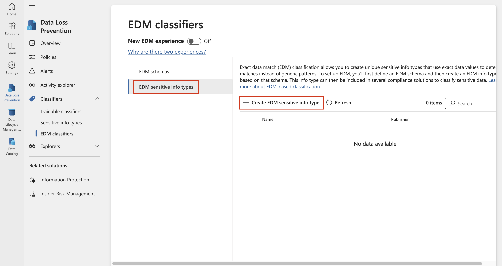
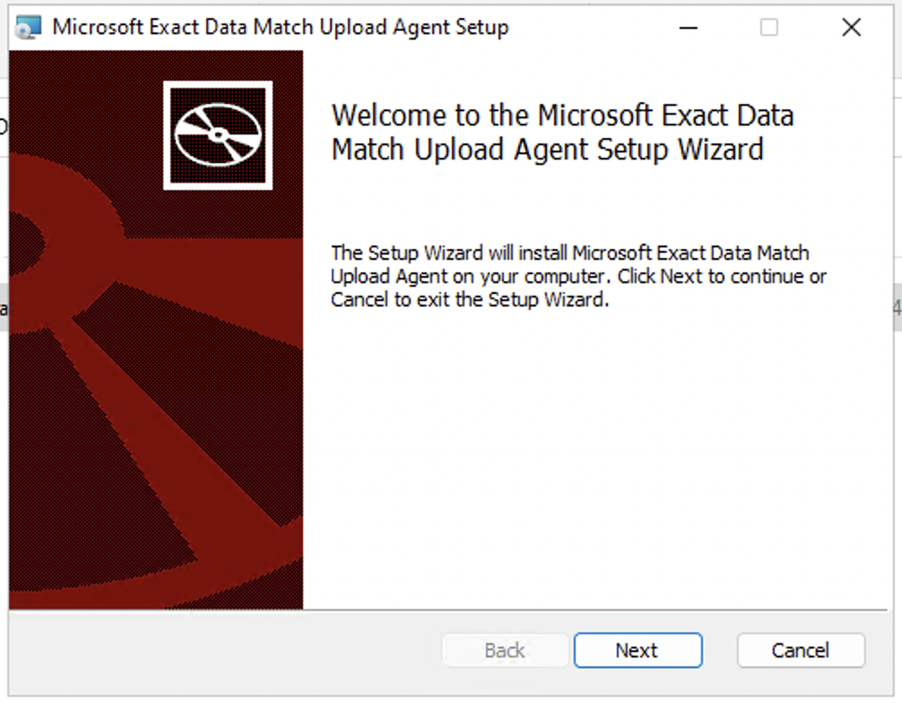

# 實驗 2 — 管理敏感信息類型

## 目的:

Contoso Ltd.
以前遇到過員工在工單解决方案中處理支持工單時意外發送客戶的個人信息的問題。

爲了在將來教育用戶，需要自定義敏感信息類型來識別電子郵件和文檔中的員工
ID，這些 ID
由三個大寫字符和六個數字組成，使用敏感信息類型。爲了降低誤報率，將使用關鍵字
“Employee” 和 “IDs”。

在本練習中，您將創建：

- 新的自定義敏感信息類型

- 基于 EDM 的分類數據庫

- 關鍵字字典

## 練習 1 – 創建自定義敏感信息類型

在本練習中，你將使用 **Security & Compliance Center PowerShell**
模塊創建新的自定義敏感信息類型，該類型可識別關鍵字“Employee”和“ID”附近的員工
ID 模式。

1.  在 **Microsoft Edge** 中，打開 **New InPrivate Window**，導航到
    `https://purview.microsoft.com` 幷使用用戶名
    PattiF@{TENANTPREFIX}.onmicrosoft.com 和資源選項卡上提供的用戶密碼以
    **Patti Fernandez**` ``身份登錄`` `
    。如果系統提示，請同意條款和條件，然後選擇 **Get started**。

2.  從左側導航欄中，選擇 **Solutions** \> **Data Loss Prevention**。

3.  從左側窗格中選擇 **Classifiers。**從子導航窗格中選擇 **Sensitive
    info types** 。選擇 **+Create sensitive info
    type**以打開新敏感信息類型的嚮導。

自動生成的計算機 Description 的屏幕截圖

4.  在 **Name your sensitive info type**頁上，輸入以下信息:

    - **Name**: `Contoso Employee IDs`

    - **Description**: `Pattern for Contoso Employee IDs.`

5.  選擇 **Next**。

圖形用戶界面，自動生成應用程序描述

6.  在 Define patterns for this sensitive info type 頁上，選擇 Create
    pattern。

自動生成的計算機 Description 的屏幕截圖

7.  在右側的 **New pattern** 窗格中，選擇 **Add primary element**
    ，然後選擇 **Regular expression**。

自動生成圖形用戶界面、應用程序、Teams 描述

8.  在新的右側窗格 **Add a regular expression** 中，輸入以下內容:

    - **ID**: `Contoso IDs`

    - **Regular expression**: `\s[A-Z]{3}[0-9]{6}\s `

    - Select **String match**

9.  選擇 **Done**。

圖形用戶界面，自動生成應用程序描述

10. 再次在右側的 **New pattern** 窗格中，**在 Supporting elements
    下**，選擇 **+ Add supporting elements or group of
    elements**下拉菜單，然後選擇 **Keyword list**。

圖形用戶界面，自動生成應用程序描述

10. 在新的右側窗格 **Add a keyword list** 中，輸入以下內容:

    - **ID**: `Employee ID keywords`

    - **Case insensitive**:

&nbsp;

    Employee
    ID

11. 在 Case Sensitive ***字段***下爲 **Word match** 選擇徑向

12. 選擇 **Done**。

自動生成圖形用戶界面、文本、應用程序描述

13. 在 New pattern 窗口中，將 **Character proximity** 值减少到 ***100***
    個字符。

自動生成圖形用戶界面、文本、應用程序描述

14. 選擇 **Create** 按鈕。

15. 返回 **Define patterns for this sensitive info type** 頁，選擇
    **Next**。

自動生成圖形用戶界面、文本、應用程序、Teams 描述

16. 在 **Choose the recommended confidence level to show in compliance
    policies** 頁面上，使用默認值，然後選擇 **Next**。

17. 在 **Review settings and finish** 頁面上，查看設置幷選擇
    **Create**。成功創建後，選擇 **Done**。

自動生成圖形用戶界面、文本、應用程序描述

18. 使瀏覽器窗口保持打開狀態。

您已成功創建新的敏感信息類型，以 3 個大寫字符、6 個數字和 100
個字符範圍內的關鍵字“Employee”或“ID”模式標識員工 ID。

## 練習 2 – 創建基于 EDM 的分類信息類型

作爲額外的搜索模式，您將使用員工數據的數據庫架構創建基于 EDM
的分類。數據庫源文件將使用員工的以下數據字段進行格式設置：Name、Birthdate、StreetAddress
和 EmployeeID。

1.  選擇 **Solutions \> Data Loss Prevention \> Classifiers**，導航到
    **EDM classifiers**，關閉 **New EDM experience**，然後從 EDM Schema
    中選擇**+ Create EDM schema** 以創建新的架構定義。

自動生成的計算機 Description 的屏幕截圖

2.  在 **Name** 字段中，輸入 employeedb。

3.  在 **Description** 字段中，輸入 Employee Database schema..

4.  啓用 **Ignore delimiters and punctuation for all schema fields**。

自動生成的計算機 Description 的屏幕截圖

5.  單擊 **Choose delimiters and punctuation** **的下拉列表，**然後選擇
    **Hyphen, Period, Space, Open parenthesis** 和 **Close
    parenthesis**。

圖形用戶界面，自動生成應用程序描述

6.  在第一個 Schema field name 中，輸入 `Name` 幷標記 **Field is
    searchable** 框。

7.  從 下端選擇 **+ Add schema data field**。

8.  在 **Schema field name 中的** Schema field \#2 **下**，輸入
    `Birthdate`。

9.  再次從下端選擇 **+ Add schema data field**。

&nbsp;

10. 在 **Schema field name** 中，在 **Schema field \#3** 下，輸入
    `StreetAddress`。

11. 最後一次從下端選擇 **+ Add schema data field**。

12. 在 **Schema field name 中的 Schema field \#4 下**，輸入
    `EmployeeID`。

13. 選擇 **Field is searchable**。

14. 選擇 **Save**。

圖形用戶界面，自動生成應用程序描述

15. 從左窗格中選擇 **EDM sensitive info types**，然後選擇 **+ Create EDM
    sensitive info type** 以打開 **EDM rule package** 嚮導。

16. 在 **Define data store schema** 頁面上，選擇 **Choose an existing
    EDM schema**。

圖形用戶界面，自動生成應用程序描述

17. 選擇 **employeedb** ，然後選擇 **Add**。

自動生成圖形用戶界面、文本、應用程序描述

18. 查看數據存儲架構，然後選擇 **Next**。

圖形用戶界面，自動生成應用程序描述

19. 在 **Define patterns for this EDM sensitive info type** 頁上，選擇
    **+ Create pattern**。

圖形用戶界面，自動生成應用程序描述

20. 在右側的 **New pattern** 窗格的 **Primary element** 字段中，選擇
    ***EmployeeID***。

21. 在 **Primary element's sensitive information type**下，選擇 **Choose
    sensitive information type** 。

自動生成的模式 Description 的屏幕截圖

22. 在 **Search** 欄中，輸入 ***Contoso*** 幷按 Enter 鍵。

23. 選擇 **Contoso Employee ID，** 然後選擇 **Done**。

24. 選擇 **Done**。

自動生成的計算機 Description 的屏幕截圖

25. 在 **Define patterns for this EDM sensitive info type** 屏幕中選擇
    **Next**。

自動生成圖形用戶界面、文本、應用程序描述

26. 在 **Choose the recommended confidence level and character
    proximity** 中，保留默認值，然後選擇 **Next**。

自動生成圖形用戶界面、文本、應用程序、Word 描述

27. 在 **Name and describe your EDM sensitive info type** 頁中，輸入
    `Contoso Employee EDM` 作爲名稱。

28. 在 **Description for admins** 字段中，爲員工個人信息輸入
    `基于`` EDM ``的敏感信息類型。`。選擇 **Next。**

自動生成圖形用戶界面、文本、應用程序描述

29. 查看設置，然後選擇 **Submit**。

圖形用戶界面，自動生成應用程序描述

30. 在 **Your EDM sensitive info type**頁上，選擇 **Done**。

自動生成的計算機 Description 的屏幕截圖

31. 使用 Microsoft Purview 門戶使瀏覽器保持打開狀態。

您已成功創建新的基于 EDM
的分類敏感信息類型，用于從數據庫文件源中識別員工數據。

## 練習 3 – 創建基于 EDM 的分類數據源

要將基于 EDM 的分類與包含敏感數據的數據庫相關聯，接下來需要通過 EDM
上傳代理工具對敏感信息類型的實際數據進行哈希處理和上傳。

1.  在 **Microsoft Edge** 中，導航到
    `https://go.microsoft.com/fwlink/?linkid=2088639` 以訪問 EDM
    下載代理。

2.  選擇 **Run**下載幷安裝該工具。

3.  在 **Microsoft Exact Data Match Upload Agent Setup** 嚮導中，選擇
    **Next**。

    - **選擇 I accept the terms in the License Agreement，然後選擇
      Next。**

    - 請勿更改默認的 **Destination Folder** 路徑，然後選擇 **Next**。

    - 選擇 **Install** 以執行安裝。

    - 當 **User Account Control** 窗口打開時，選擇 **Yes**。

    - 如果要求登錄，請通過 **Patti** 的帳戶登錄。

    - 安裝完成後，選擇 **Finish。**

    - 選擇左下角的 Windows 符號打開開始菜單，輸入**Notebook** 幷選擇
      **Notebook** 從開始菜單中。

    - 在記事本窗口的第一行中輸入以下文本（確保在新行中輸入以下所有三個文本。

&nbsp;

    Name,Birthdate,StreetAddress,EmployeeID
    Patti Fernandez,01.06.1980,1Main Street,CSO123456
    Christie Cline,31.01.1985,2Secondary Street,CSO654321

4.  選擇 File （文件） 和 Save as： `EmployeeData.csv`

5.  選擇**下拉列表 Save as type：**，然後選擇 **All Files (.)**中。

6.  選擇 Encoding： **的下拉列表**，然後選擇 **UTF-8** 幷選擇 **Save**。

7.  關閉記事本窗口。

8.  用鼠標右鍵選擇任務欄中的 Windows 符號，然後選擇 **Windows PowerShell
    （Admin）** 幷以管理員身份運行。

9.  當 **User Account Control** 窗口打開時，選擇 **Yes**。

10. 導航到 EDM Upload Agent 目錄：

`cd "C:\Program Files\Microsoft\EdmUploadAgent"`

Text Description automatically generated

11. 通過運行以下 cmdlet，使用您的帳戶授權將數據庫上傳到您的租戶：

`.\EdmUploadAgent.exe /Authorize`

12. 當 **Pick an account （選擇帳戶**） 窗口顯示時， 使用用戶名
    PattiF@{TENANTPREFIX}.onmicrosoft.com` ``和資源選項卡上提供的用戶密碼以`` `**Patti
    Fernandez** 身份登錄。

**注意**：對于後續步驟，請確保文件的路徑與 VM
中的路徑相似。它可能與說明或屏幕截圖不同。在這種情况下，請在命令中相應地更改文件的路徑。

13. 通過在 PowerShell 中運行以下脚本，下載基于 EDM
    的分類敏感信息類型的數據庫架構定義

`.\EdmUploadAgent.exe /``SaveSchema`` /``DataStoreName`` ``employeedb`` /``OutputDir`` "C:\Users\Admin\Documents\"`

**注意**：如果最後一個命令失敗，則可能需要更多時間才能應用
**EDM_DataUploaders** 組成員資格。可能需要長達一小時才能下載 Schema
文件。如果失敗，請繼續執行下一個任務，稍後返回此步驟。或者檢查 VM 上
documents 文件夾的路徑。

> \`14.通過在PowerShell中運行以下脚本，對數據庫文件進行哈希處理，幷將其上傳到基于
> EDM 的分類敏感信息類型：

`.\EdmUploadAgent.exe /``UploadData`` /``DataStoreName`` ``employeedb`` /``DataFile`` "C:\Users\Admin\Documents\EmployeeData.csv" /``HashLocation`` "C:\Users\Admin\Documents\" /Schema "C:\Users\Admin\Documents\employeedb.xml"`

**注意：** 如果您收到以下錯誤

錯誤類型: System.IO.FileNotFoundException

錯誤消息：找不到指定的文件。

檢查保存文件的路徑EmployeeData.csv

自動生成文本描述

15. 檢查上傳進度，直到狀態更改爲 completed （已完成），然後運行以下
    PowerShell 命令：

`.\EdmUploadAgent.exe /``GetSession`` /``DataStoreName`` ``employeedb`

您已成功對基于 EDM 的分類敏感信息類型進行哈希處理幷上傳數據庫文件。

## 練習 4 – 創建關鍵字詞典

當用戶在同事報告病假後發送電子郵件時，發生了幾起個人信息泄露違規行爲。當這種情况發生時，生病或生病的原因就被發出來了。我們不希望這種情况發生。

1.  在 **Microsoft Edge** 中，打開一個 **New InPrivate Window**，導航到
    `https://purview.microsoft.com`，然後使用用戶名
    PattiF@{TENANTPREFIX}.onmicrosoft.com 和資源選項卡上提供的用戶密碼以
    `Patti Fernandez` 身份登錄。

2.  從左側導航欄中，選擇 **Solutions** \> **Data Loss Prevention**。

自動生成的計算機 Description 的屏幕截圖

3.  從左側窗格中選擇 **Classifiers。**從子導航窗格中選擇 **Sensitive
    info types** 。選擇 **+Create sensitive info type**
    以打開新敏感信息類型的嚮導。

自動生成的計算機 Description 的屏幕截圖

4.  在 **Name your sensitive info type**頁上，輸入以下內容:

    - 名字: `Contoso Diseases List`

    - 描述: `List of possible diseases of employees.`

自動生成圖形用戶界面、應用程序、Teams 描述

5.  選擇 **Next**。

6.  在 **Define patterns for this sensitive info type**頁上，選擇 **+
    Create pattern**。

自動生成圖形用戶界面、應用程序、Teams 描述

7.  選擇 **Primary element** 下的下拉字段 ，然後選擇 **Keyword
    dictionary**。

圖形用戶界面，自動生成應用程序描述

8.  在 **Add a keyword dictionary** 頁面中，輸入名稱
    `Diseases Dictionary`。

9.  在 **Keywords** 區域中，輸入以下關鍵字，每個關鍵字都放在單獨的行中

&nbsp;

    flu
    influenza
    cold
    bronchitis
    otitis

10. 選擇 **Done**。

11. 在 **Supporting elements下**，選擇 **+ Add supporting elements or
    group of elements**下拉列表，然後選擇 **keyword
    list**以添加對關鍵字詞典的其他支持。

圖形用戶界面，自動生成應用程序描述

12. 在 **Add a keyword list**頁中`，在`` `ID 字段中輸入 員工缺勤。在
    **Case insensitive**
    框中，輸入以下關鍵字，每個關鍵字都放在單獨的行中

&nbsp;

    employee
    absence
    reason

圖形用戶界面，自動生成應用程序描述

13.選擇 **Done**。

14.在 **New pattern** 頁面中，查看配置幷選擇 **Create**。

圖形用戶界面，自動生成應用程序描述

15. 在 **Define patterns for this sensitive info type**中，選擇
    **Next**。

自動生成圖形用戶界面、應用程序、Teams 描述

16. 在 **Choose the recommended confidence level to show in compliance
    policies** 中，保留默認值，然後選擇 **Next**。

自動生成的計算機 Description 的屏幕截圖

17. 在 **Review settings and finish** 頁面中，查看您的設置幷選擇
    **Create**。該過程完成後，選擇 **Done**。

18. 使 Microsoft Purview 門戶中的瀏覽器窗口保持打開狀態。

您已成功基于關鍵字字典創建新的敏感信息類型，幷添加了更多關鍵字以降低誤報率。繼續執行下一個任務。

## 練習 5 – 使用自定義敏感信息類型

在策略中使用自定義敏感信息類型之前，應始終對其進行測試，否則可能會因自定義搜索模式故障而導致數據丟失或泄漏。

1.  選擇左下角的 Windows
    符號打開開始菜單，輸入**Notepad**幷選擇**Notepad**從開始菜單中。

2.  在記事本窗口中輸入以下**Notepad**

`Employee Patti Fernandez EMP123456 ``is on absence`` because of the flu/influenza`

3.  選擇 **File （文件** ） 和 Save As `SickTestData`` `，然後選擇
    **Save**。

4.  關閉記事本窗口。

5.  在 **Microsoft Edge** 中，Microsoft Purview
    門戶選項卡應仍處于打開狀態。如果是這樣，請選擇它幷繼續下一步。如果您關閉了它，則在新選項卡中導航到
    `https://purview.microsoft.com`。 **使用用戶名**
    PattiF@{TENANTPREFIX}.onmicrosoft.com` ``和資源選項卡上提供的用戶密碼以`` `**Patti
    Fernandez** 身份登錄。

6.  在左側導航窗格中，選擇 **Solutions** \> **Data Loss
    Prevention**，然後在 **Classifiers** 下**Sensitive info
    types**。在右上角的 **Search （搜索**） 框中，輸入 ***Contoso***
    幷按 **Enter**。選擇 **Contoso 員工 ID** 以打開右側窗格。

自動生成的計算機 Description 的屏幕截圖

7.  從 右側窗格中選擇 **Test**。

自動生成的計算機 Description 的屏幕截圖

8.  在 **Upload file to test** 頁面上，選擇 **Upload file**。

9.  從左側窗格中選擇 **Documents** ，選擇名爲 **SickTestData**
    的文件，然後選擇 **Open**。

自動生成圖形用戶界面、文本、應用程序描述

10. 選擇 **Test** 以開始分析。

自動生成圖形用戶界面、文本、應用程序描述

11. 在 **Match results** 頁面上，查看找到的匹配項。

12. 選擇 **Finish** 幷通過單擊 **X** 按鈕關閉測試頁面 。

自動生成圖形用戶界面、文本、應用程序描述

13. 返回 **Data classification** 頁，選擇名爲 **Contoso Diseases List**
    的 Sensitive Information Type。

14. 在右側窗格中，選擇 **Test**.

15. 在 **Upload file to test** 頁面上，選擇 **Upload file**。

16. 從左側窗格中選擇 **Documents**，選擇名爲 *SickTestData*
    的文件，然後選擇 **Open**。

17. 選擇 **Test** 以開始分析。

自動生成圖形用戶界面、文本、應用程序描述

18. 在 **Match results** 頁面上，查看找到的匹配項。完成後，查看，選擇
    **Finish**。

圖形用戶界面，自動生成應用程序描述

## 總結:

您已成功測試了兩種自定義敏感信息類型，幷驗證了搜索模式可識別所需的模式。您已完成敏感信息類型的創建，可以繼續進行下一個練習。
