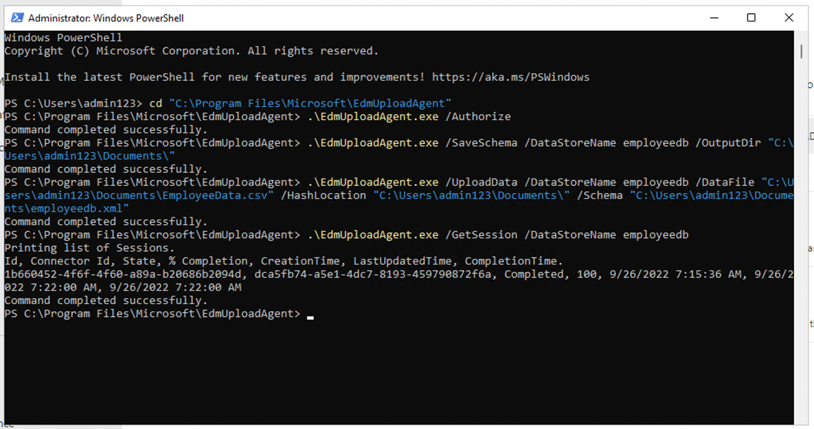

# Laboratório 2 — Gerenciando tipos de informações confidenciais

## Objetivo:

Anteriormente, a Contoso Ltd. tinha problemas com funcionários que
acidentalmente enviavam informações pessoais de clientes quando
trabalhavam em tíquetes de suporte na solução de tíquetes.

Para educar os usuários no futuro, um tipo de informação confidencial
personalizada é necessária para identificar IDs de funcionários em
e-mails e documentos, que consistem em três caracteres maiúsculos e seis
números, usando tipos de informações confidenciais. Para reduzir a taxa
de falsos positivos, serão usadas as palavras-chave "Employee" e "IDs".

Neste laboratório, você criará:

- Um novo tipo de informação confidencial personalizada

- um banco de dados para classificação baseada em EDM

- dicionário de palavras-chave

## Exercício 1 – Criando tipos de informações confidenciais personalizadas

Neste exercício, você usará o módulo do **Security and Compliance Center
PowerShell** para Criar um novo tipo de informações confidenciais
personalizadas que reconheça o padrão de IDs de funcionários próximo às
palavras-chave "Employee" e "ID".

1.  No **Microsoft Edge**, abra uma **New InPrivate Window**, navegue
    até `https://purview.microsoft.com` e faça login como **Patti
    Fernandez** usando o nome de usuário
    `PattiF@{TENANTPREFIX}.onmicrosoft.com` e a Senha de Usuário
    fornecida na guia de recursos. Se solicitado, concorde com os termos
    e condições e selecione **Get started**.

2.  No painel de navegação à esquerda, selecione **Solutions** \> **Data
    Loss Prevention**.

3.  Selecione **Classifiers** no painel esquerdo. Selecione **Sensitive
    info types** **confidenciais** no painel de subnavegação. Selecione
    **+ Create sensitive info type** para abrir o assistente para um
    novo sensitive info type.

Uma captura de tela de uma descrição de computador gerada
automaticamente

4.  Na página **Name your sensitive info type**, insira as seguintes
    informações:

    - **Name**: `Contoso Employee IDs`

    - **Description**: `Pattern for Contoso Employee IDs``.`

5.  Selecione **Next**.

Interface gráfica do usuário, descrição do aplicativo gerada
automaticamente

6.  Na página **Define patterns for this sensitive info type**,
    selecione **Create pattern**.

Uma captura de tela de uma descrição de computador gerada
automaticamente

7.  No painel **New pattern** do lado direito, selecione **Add primary
    element** e selecione **Regular expression**.

Interface gráfica do usuário, aplicativo, descrição do Teams gerada
automaticamente

8.  No novo painel do lado direito **Add a regular expression**, insira
    o seguinte:

    - **ID**: `Contoso IDs`

    - **Regular expression**: `\s\[A-Z\]{3}\[0-9\]{6}\s`

    - Select **String match**

9.  Selecione **Done**.

Interface gráfica do usuário, descrição do aplicativo gerada
automaticamente

10. Novamente no painel **New pattern** do lado direito, abaixo de
    **Supporting elements**, selecione **+ Add supporting elements or
    group of elements** no menu suspenso e selecione **Keyword list**.

Interface gráfica do usuário, descrição do aplicativo gerada
automaticamente

10. No novo painel do lado direito **Add a keyword list**, insira o
    seguinte:

    - **ID**: `Employee ID keywords`

    - **Case insensitive**:

&nbsp;

    Employee
    ID

11. Selecione o radial para ***Word match*** no campo **Case Sensitive**

12. Selecione **Done**.

Interface gráfica do usuário, texto e descrição do aplicativo gerada
automaticamente

13. Na janela Novo padrão, diminua o valor de **Character proximity**
    para ***100*** caracteres.

Interface gráfica do usuário, texto e descrição do aplicativo gerada
automaticamente

14. Selecione o botão **Create**.

15. De volta à página **Define patterns for this sensitive info type,**
    selecione **Next**.

Interface gráfica do usuário, texto, aplicativo e descrição do Teams
gerada automaticamente

16. Na página **Choose the recommended confidence level to show in
    compliance policies**, use o valor padrão e selecione **Next**.

Imagem interrompida

17. Na página **Review settings and finish**, revise as configurações e
    selecione **Create**. Quando a criação for bem-sucedida, selecione
    **Done**.

Interface gráfica do usuário, texto e descrição do aplicativo gerada
automaticamente

18. Deixe a janela do navegador aberta.

Você criou com sucesso um novo tipo de informação confidencial para
identificar IDs de funcionários no padrão de três caracteres maiúsculos,
seis números e as palavras-chave "Employee" ou "IDs" em um intervalo de
100 caracteres.

## Exercício 2 – Criando o tipo de informação de classificação baseada em EDM

Como um padrão de pesquisa adicional, você criará uma classificação
baseada em EDM com um esquema de banco de dados de funcionários. O
arquivo de origem do banco de dados será formatado com os seguintes
campos de dados de funcionários: Name, Birthdate, StreetAddress, e
EmployeeID.

1.  Selecione **Solutions** \> **Data Loss Prevention** \>
    **Classifiers**, navegue até **EDM classifiers**, desative a opção
    **New EDM experience** e, em **EDM schema**, selecione **+ Create
    EDM schema** para criar uma nova definição de esquema.

Uma captura de tela de uma descrição de computador gerada
automaticamente

2.  No campo **Name**, insira `employeedb`.

3.  No campo **Description**, insira `o ``Employee Database schema``.`.

4.  Ative **Ignore delimiters and punctuation for all schema fields**.

Uma captura de tela de uma descrição de computador gerada
automaticamente

5.  Clique no menu suspenso para **Choose delimiters and punctuation to
    ignore** e selecione **Hyphen**, **Period**, **Space**, **Open
    parenthesis** e **Close parenthesis**.

Interface gráfica do usuário. Descrição do aplicativo gerada
automaticamente

6.  No primeiro **Schema field name**, insira `N``a``me` e marque a
    caixa **Field is searchable**.

7.  Selecione **+ Add schema data field** na parte inferior.

Imagem interrompida

8.  Em **Schema field name**, abaixo do **Schema field \#2**, digite
    Birthdate.

9.  Novamente selecione **+ Add schema data field** na extremidade
    inferior.

10. No **Schema field name**, abaixo do **Schema field \#3**, digite
    `StreetAddress`.

11. Selecione **+ Add schema data field** na extremidade inferior uma
    última vez.

12. No **Schema field name**, abaixo do **Schema field \#4**, digite
    EmployeeID.

13. Selecione **Field is searchable**.

14. Selecione **Save**.

Interface gráfica do usuário. Descrição do aplicativo gerada
automaticamente

15. Selecione **EDM sensitive info types** no painel esquerdo e
    selecione **+ Create EDM sensitive info type** para abrir o
    assistente de **EDM rule package**.

16. Na página **Define data store schema**, selecione **Choose an
    existing EDM**.

Interface gráfica do usuário. Descrição do aplicativo gerada
automaticamente

17. Selecione **employeedb** e clique em **Add**.

Interface gráfica do usuário, texto e descrição do aplicativo gerada
automaticamente

18. Revise o esquema do armazenamento de dados e selecione **Next**.

Interface gráfica do usuário. Descrição do aplicativo gerada
automaticamente

19. Na página **Define patterns for this EDM sensitive info type**,
    selecione **+ Create pattern**.

Interface gráfica do usuário. Descrição do aplicativo gerada
automaticamente

20. No painel **New pattern** no lado direito, no campo **Primary
    element**, selecione ***EmployeeID.***

21. Abaixo do **Primary element’s sensitive info type**, selecione
    **Choose sensitive info type**.

Uma captura de tela de uma descrição de computador gerada
automaticamente

22. Na barra **Search**, insira ***Contoso*** e pressione a tecla Enter.

23. Selecione **Contoso Employee IDs** e selecione **Done**.

24. Selecione **Done**.

Uma captura de tela de uma descrição de computador gerada
automaticamente

25. Selecione **Next** na tela **Define patterns for this EDM sensitive
    info type**.

Interface gráfica do usuário, texto e descrição do aplicativo gerada
automaticamente

26. Na seção **Choose the recommended confidence level and character
    proximity**, deixe o valor padrão persistir e selecione **Next**.

Interface gráfica do usuário, texto, aplicativo e descrição do Word
gerada automaticamente

27. Na página **Name and describe your EDM sensitive info type**, digite
    `Contoso Employee EDM` for the name.

28. No campo **Description for admins**, digite
    `EDM-based sensitive information type for employee personal information`.
    Selecione **Next.**

Interface gráfica do usuário, texto e descrição do aplicativo gerada
automaticamente

29. Revise as configurações e selecione **Submit**.

Interface gráfica do usuário. Descrição do aplicativo gerada
automaticamente

30. Na página **Your EDM sensitive info type was created**, selecione
    **Done**.

Uma captura de tela de uma descrição de computador gerada
automaticamente

31. Deixe o navegador aberto com o portal do Microsoft Purview.

Você criou com sucesso um novo tipo de informação confidencial de
classificação baseada em EDM para identificar dados de funcionários de
uma fonte de arquivo de banco de dados.

## Exercício 3 – Criando fonte de dados de classificação baseada em EDM

Para associar a classificação baseada em EDM a um banco de dados que
contenha dados confidenciais, é necessário fazer o hashing e o upload
dos dados reais para o tipo de informação sensível por meio da
ferramenta EDM Upload Agent.

1.  No **Microsoft Edge**, navegue até
    `https://go.microsoft.com/fwlink/?linkid=2088639` para acessar o
    agente de download do EDM.

2.  Selecione **Run** para baixar e instalar a ferramenta.

Imagem interrompida

3.  No assistente **Microsoft Exact Data Match Upload Agent Setup**,
    selecione **Next**.

    - Selecione, **I accept the terms in the License Agreement** e
      selecione **Next**.

    - Não altere o caminho padrão do **Destination Folder** e selecione
      **Next**.

    - Selecione **Install** para executar a instalação.

    - Quando a janela **User Account Control** for aberta, selecione
      **Sim**.

    - Se solicitado a fazer login, faça-o por meio da conta da **Patti**
      .

    - Quando a instalação for concluída, selecione **Finish**.

    - Selecione o símbolo do Windows no canto inferior esquerdo para
      abrir o menu Iniciar, entre no **Notepad** e selecione **Notepad**
      no menu Iniciar.

    - Digite o seguinte texto na primeira linha da janela do Notepad
      (certifique-se de inserir todos os três seguintes em novas
      linhas.)

&nbsp;

    Name,Birthdate,StreetAddress,EmployeeID
    Patti Fernandez,01.06.1980,1Main Street,CSO123456
    Christie Cline,31.01.1985,2Secondary Street,CSO654321

4.  Selecione File e Save As: `EmployeeData.csv`

5.  Selecione o menu suspenso em **Save as type:** e selecione **All
    files (*.*)**.

6.  Selecione o menu suspenso em **Encoding:** e selecione **UTF-8** e
    selecione **Save**.

Imagem interrompida

7.  Feche a janela do Notepad.

8.  Selecione o símbolo do Windows na barra de tarefas com o botão
    direito do mouse e selecione **Windows PowerShell (Admin)** e
    execute run as administrator.

Imagem interrompida

9.  Quando a janela **User Account Control** for aberta, selecione
    **Yes**.

10. Navegue até o EDM Upload Agent directory:

`cd "C:\Arquivos de Programas\Microsoft\EdmUploadAgent"`

Descrição do texto gerada automaticamente

11. Autorize com sua conta o upload do banco de dados para seu locatário
    executando o seguinte cmdlet:

`.\EdmUploadAgent.exe /Authorize`

Imagem interrompida

12. Quando a janela **Pick an account** for exibida, faça login como
    **Patti Fernandez** usando o nome de usuário
    `PattiF@{TENANTPREFIX}.onmicrosoft.com` e a senha do usuário
    fornecida na guia de recursos. (Ou a nova senha que você redefinir.)

**Observação**: para as próximas etapas, verifique se o caminho dos
arquivos é semelhante ao caminho em sua VM. Pode ser diferente das
instruções ou das capturas de tela. Nesse caso, altere o caminho do seu
arquivo nos comandos de acordo.

13. Faça o download da definição do esquema do banco de dados do tipo de
    informação sensível de classificação baseada em EDM executando o
    seguinte script no PowerShell

`.\EdmUploadAgent.exe /SaveSchema /DataStoreName employeedb /OutputDir "C:\Users\Admin\Documents\"`

**Observação**: Se o último comando falhar, possivelmente levará mais
tempo até que a associação ao grupo **EDM_DataUploaders** seja aplicada.
Pode levar até uma hora até que seja possível fazer o download do
arquivo de esquema. Se houver falha, prossiga para a próxima tarefa e
retorne a esta etapa mais tarde. Ou verifique o caminho da pasta de
documentos em sua VM.

Imagem interrompida

14. Faça o hash do arquivo de banco de dados e carregue-o no tipo de
    informação confidencial de classificação baseada em EDM executando o
    seguinte script no PowerShell:

`.\EdmUploadAgent.exe /UploadData /DataStoreName employeedb /DataFile "C:\Users\Admin\Documents\EmployeeData.csv" /HashLocation "C:\Users\Admin\Documents\" /Schema "C:\Users\Admin\Documents\employeedb.xml"`

Imagem interrompida

**Observação:** se você receber os seguintes erros

Error Type: System.IO.FileNotFoundException

Error Message: Unable to find the specified file.

Verifique o caminho onde você salvou o arquivo EmployeeData.csv

Descrição do texto gerada automaticamente

15. Verifique o andamento do upload até que o estado mude para concluído
    e, em seguida, execute o seguinte comando do PowerShell:

`.\EdmUploadAgent.exe /GetSession /DataStoreName employeedb`

Imagem interrompida

Você fez hash e upload com sucesso de um arquivo de banco de dados para
um tipo de informação confidencial de classificação baseada em EDM.

## Exercício 4 – Criando um dicionário de palavras-chave

Várias violações de vazamento de informações pessoais ocorreram quando
os usuários enviaram e-mails depois que os colegas informaram que
estavam de licença médica. Quando isso acontecia, o motivo da doença ou
enfermidade era enviado. Não queremos que isso aconteça.

1.  No **Microsoft Edge**, abra uma guia **New InPrivate Window**,
    navegue até `https://purview.microsoft.com` e faça login como
    **Patti Fernandez** usando o nome de usuário
    `PattiF@{TENANTPREFIX}.onmicrosoft.com` e a Senha de Usuário
    fornecida na guia de recursos.

2.  No painel de navegação à esquerda, selecione **Solutions** \> **Data
    Loss Prevention**.

Uma captura de tela de uma descrição de computador gerada
automaticamente

3.  Selecione **Classifiers** no painel esquerdo. Selecione **Sensitive
    info types** no painel de subnavegação. Selecione **+****Create
    sensitive info type** para abrir o assistente para um novo tipo de
    informação confidencial.

Uma captura de tela de uma descrição de computador gerada
automaticamente

4.  Na página **Name your sensitive info type**, insira o seguinte:

    - Name: `Contoso Diseases List`

    - Description: `List of possible diseases of employees.`

Interface gráfica do usuário, aplicativo e descrição do Teams gerada
automaticamente

5.  Selecione **Next**.

6.  Na página **Define patterns for this sensitive info type**,
    selecione **+ Create pattern**.

Interface gráfica do usuário, aplicativo, descrição do Teams gerada
automaticamente

7.  Selecione o campo suspenso abaixo de **Primary element** e selecione
    **Keyword dictionary**.

Interface gráfica do usuário, descrição do aplicativo gerada
automaticamente

8.  Na página **Add a keyword dictionary**, digite o nome
    `Diseases Dictionary`.

9.  Na área **Keywords**, insira as seguintes palavras-chave, cada uma
    em uma linha separada

> flu
>     influenza
>     cold
>     bronchitis
>     otitis

Imagem interrompida

10. Selecione **Done**.

11. Abaixo de **Supporting elements**, selecione **+ Add supporting
    elements or group of elements** suspensos e selecione **keyword
    list** para adicionar suporte adicional ao dicionário de
    palavras-chave.

Interface gráfica do usuário, descrição do aplicativo gerada
automaticamente

12. Na página **Add a keyword list**, insira `Employee absence` no campo
    **ID**. Na caixa **Case insensitive**, insira as seguintes
    palavras-chave, cada uma em uma linha separada

&nbsp;

    employee
    absence
    reason

Interface gráfica do usuário, descrição do aplicativo gerada
automaticamente

13. Selecione **Done**.

14. Na página **New pattern**, revise a configuração e selecione
    **Create**.

Interface gráfica do usuário. Descrição do aplicativo gerada
automaticamente

15. Na seção **Define patterns for this sensitive info type**, selecione
    **Next**.

Interface gráfica do usuário, aplicativo e descrição do Teams gerada
automaticamente

16. Na seção **Choose the recommended confidence level to show in
    compliance policies**, deixe o valor padrão persistir e selecione
    **Next**.

Uma captura de tela de uma descrição de computador gerada
automaticamente

17. Na página **Review settings and finish**, revise suas configurações
    e selecione **Create**. Quando o processo estiver concluído,
    selecione **Done**.

Imagem interrompida

18. Deixe a janela do navegador no portal do Microsoft Purview aberta.

Você criou com sucesso um novo tipo de informação confidencial com base
em um dicionário de palavras-chave e adicionou mais palavras-chave para
diminuir a taxa de falsos positivos. Prossiga para a próxima tarefa.

## Exercício 5 – Trabalhando com tipos de informações confidenciais personalizados

Os tipo de informações confidenciais personalizadas devem ser sempre
testados antes de serem usados nas políticas, caso contrário, poderá
ocorrer perda ou vazamento de dados devido ao mau funcionamento de um
padrão de pesquisa personalizado.

1.  Selecione o símbolo do Windows no canto inferior esquerdo para abrir
    o menu Iniciar, entre no **Notepad** e selecione **Notepad** no menu
    Iniciar.

2.  Digite o seguinte texto na janela do Notepad

`Employee Patti Fernandez EMP123456 is on absence because of the flu/influenza`

3.  Selecione **File** e Save as `SickTestData` e selecione **Save**.

4.  Feche a janela do Notepad.

5.  No **Microsoft Edge**, a guia do portal do Microsoft Purview ainda
    deve estar aberta. Em caso afirmativo, selecione-a e prossiga para a
    próxima etapa. Se você o fechou, em uma nova guia, navegue até
    `https://purview.microsoft.com`. Faça login como **Patti Fernandez**
    usando o nome de usuário `PattiF@{TENANTPREFIX}.onmicrosoft.com` e a
    senha de usuário fornecida na guia de recursos.

6.  No painel de navegação esquerdo, selecione **Solutions** \> **Data
    Loss Prevention** e, em seguida, selecione os **Sensitive info
    types** em **Classifiers**. Na caixa **Search** no canto superior
    direito, insira ***Contoso*** e pressione **Enter**. Selecione
    **Contoso Employee IDs** para abrir o painel do lado direito.

Uma captura de tela de uma descrição de computador gerada
automaticamente

7.  Selecione **Test** no painel do lado direito.

Uma captura de tela de uma descrição de computador gerada
automaticamente

8.  Na página **Upload file to test**, selecione **Upload file**.

Imagem interrompida

9.  Selecione **Documents** no painel esquerdo, selecione o arquivo com
    o nome **SickTestData** e selecione **Open**.

Interface gráfica do usuário, texto e descrição do aplicativo gerada
automaticamente

10. Selecione **Test** para iniciar a análise.

Interface gráfica do usuário, texto e descrição do aplicativo gerada
automaticamente

11. Na página de **Match results**, revise a correspondência encontrada.

Imagem interrompida

12. Selecione **Finish** e feche a página de teste clicando no botão
    **X**.

Interface gráfica do usuário, texto e descrição do aplicativo gerada
automaticamente

13. De volta à página **Data classification**, selecione o Sensitive
    Information Type com o nome **Contoso Diseases List**.

14. No painel do lado direito, selecione **Test**.

Imagem interrompida

15. Na página **Upload file to test**, selecione **Upload file**.

Imagem interrompida

16. Selecione **Documents** no painel esquerdo, selecione o arquivo com
    o nome *SickTestData* e selecione **Open**.

17. Selecione **Test** para iniciar a análise.

Interface gráfica do usuário, texto e descrição do aplicativo gerada
automaticamente

18. Na página de **Match results**, revise a correspondência encontrada.
    Quando terminar, revise, selecione **Finish.**

Interface gráfica do usuário, descrição do aplicativo gerada
automaticamente

## Resumo:

Você testou com sucesso os dois tipos de informações confidenciais
personalizadas e validou que o padrão de pesquisa reconhece os padrões
desejados. Você concluiu a criação de tipos de informações confidenciais
e pode prosseguir com o próximo exercício.
