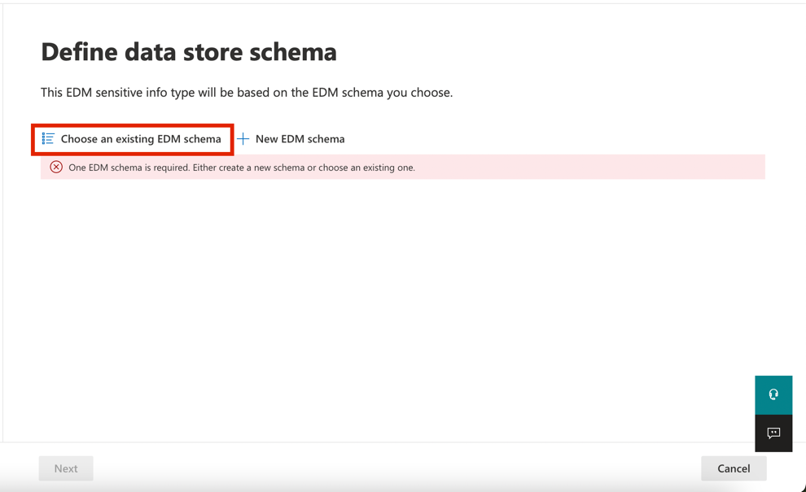
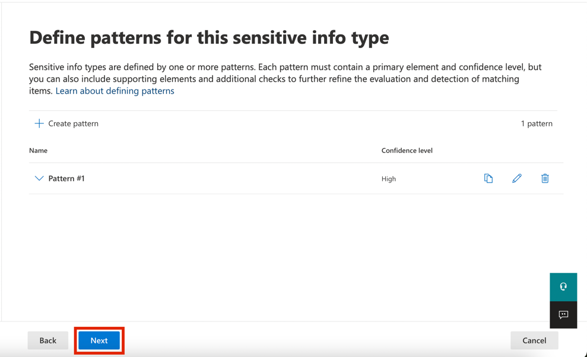
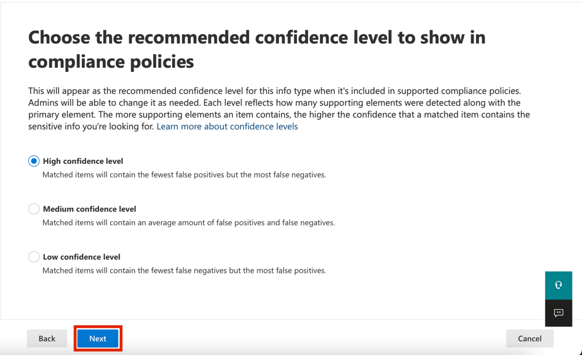
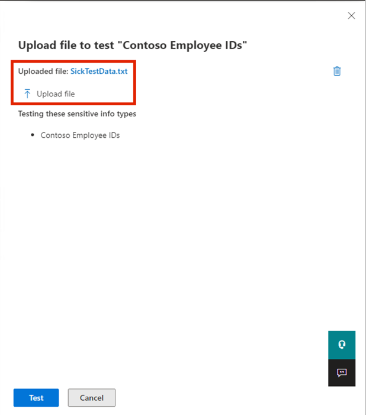

# **ラボ 2 — Sensitive Information Typeの管理**

## 導入

Contoso Ltd. では以前、チケット ソリューションでサポート
チケットを処理する際に、従業員が顧客の個人情報を誤って送信してしまうという問題がありました。

今後のユーザー教育のため、メールや文書に含まれる従業員ID（大文字3文字と数字6桁）をSensitive
Information Typeで識別するためのカスタムSensitive Information
Typeが必要となります。誤検出率を下げるため、「従業員」と「ID」というキーワードを使用します。

## 目的

- 正規表現とキーワード リストを使用して、**カスタムのSensitive
  Information Type**を作成します。

- 構造化された従業員データを使用して、 **EDM ベースのSensitive
  Information Typeを**構成および定義します。

- 従業員データをハッシュ化し、分類のために**EDM Upload
  Agentにアップロードします**。

- 機密性の高い健康関連の用語を識別するために、**キーワード辞書ベースのSensitive
  Information Typeを**構築します。

- カスタムのSensitive Info
  Typesをポリシーに適用する前に、その正確性をテストして検証します。

- Microsoft Purview で Adaptive Protection を有効にします。

## 演習1 – カスタムSensitive Information Typeの作成

この演習では、**Security & Compliance Center
PowerShell**モジュールを使用して、キーワード「Employee」および「ID」の近くにある従業員
ID のパターンを認識する新しいカスタムSensitive Info Typesを作成します。

1.  **Microsoft Edge**で、**New InPrivate Window**を開き、 **+++**
    https:// **purview** .microsoft.com
    +++に移動し、ユーザー名**PattiF@WWLxXXXXXX.onmicrosoft.com**とリソース
    タブに指定されているユーザー パスワードを使用して**Patti
    Fernandez**としてログインします。

2.  **Welcome to the new Microsoft Purview
    portal**ダイアログボックスが表示されたら、\[**Get
    Started\]**ボタンをクリックします。

> 

3.  左側のナビゲーションから、 **\[Solutions\]** \> **\[Data Loss
    Prevention\]**を選択します。

4.  左ペインから**「Classifiers」**を選択します。サブナビゲーションペインから**「Sensitive
    Info Types」**を選択します。 **「+ Create sensitive info
    type** **」**を選択して、新しいSensitive Info
    Typesを作成するためのウィザードを開きます。

5.  **「Name your sensitive info
    type」**ページで、次の情報を入力します。

    - **Name**: **+++Contoso 従業員 ID+++**

    - **Description**: +++ **Contoso 従業員IDのパターン+++ 。**

6.  **「Next」**を選択します。

7.  **\[Define patterns for this sensitive info type\]ページ**で、
    **\[Create pattern\]**を選択します。

8.  右側に表示される**\[New pattern\]**ペインで、 **\[Add primary
    element\]**を選択し、 **\[Regular expression\]**を選択します。

9.  新しい右側のペイン**「Add a regular
    expression」で**、次のように入力します。

    - **ID** : **+++Contoso ID+++**

    - **Regular expression**: **+++\s\[A-Z\]{3}\[0-9\]{6}\s +++**

    - **String match**を選択します。

10. **\[Done\]**を選択します。

11. \[New pattern\] ペインで、**Character
    proximity** 値を*100文字*に減らします。

12. **「Supporting elements」見出し**に移動し、 **「+ Add supporting
    elements or group of elements」**ドロップダウン
    メニューをクリックして、 **「Keyword list」**を選択します。

13. **\[Add a keyword list\]ペイン**で、次のように入力します。

    - **ID** : **+++Employee ID keywords+++**

    - **Case insensitive**: **+++ Employee** **ID +++**

> 

14. **「Word match」の**横にあるラジオボタンを選択します。次に、
    **「Done」**ボタンをクリックします。

15. 次に、 **「Create」**ボタンをクリックします。

16. **Define patterns for this sensitive info type** ページに戻り、
    **\[Next\]**を選択します。

17. **\[Choose the recommended confidence level to show in compliance
    policies\]ページ**で既定値を使用し、
    **\[Next\]**ボタンを選択します。

18. **「Review settings and finish」ページ**で設定を確認し、
    **「Create」**を選択します。正常に作成されたら、
    **「Done」**を選択します。

19. ブラウザウィンドウを開いたままにしておきます。

100 文字の範囲内で 3 つの大文字、6
つの数字、およびキーワード「従業員」または「ID」のパターンで従業員 ID
を識別するための新しいSensitive Info Typesを正常に作成しました。

## 演習2 – EDMベースの分類情報タイプの作成

追加の検索パターンとして、従業員データのデータベーススキーマを使用して、EDMベースの分類を作成します。データベースソースファイルは、従業員の以下のデータフィールド（名前、生年月日、住所、従業員ID）でフォーマットされます。

1.  「Solutions」をクリックし、 **「Data Loss
    Prevention」**を選択します。 

2.  **「Classifiers」**をクリックし、 **「EDM
    Classifiers」を選択します**。EDMClassifiersページで、「**New EDM
    experience」**の横にあるトグルボタンをクリックして**Off**にします。

3.  次に、 **「Create EDM schema」**をクリックします **。**

4.  **Name**フィールドに**+++ employeedb +++**と入力します。

5.  **「Desccription」フィールド**に**「 +++Employee Database schema.+++
    」**と入力します。  
    **「Ignore delimiters and punctuation for all schema
    fields」の**チェックを外します。

6.  最初のスキーマフィールド名に**「+++Name+++」と入力します。Field is
    searchable**ボックスをチェックします。

7.  **\[Choose delimiters and punctuation to
    ignore\]**のドロップダウンをクリックし、 **\[Hyphen\]** 、
    **\[Period\]** 、 \[**Space\]** 、 **\[Open parenthesis\]** 、
    **\[閉じ括弧\]**を選択します。

8.  下端から**+ Add schema data fieldを**選択します。

9.  **Schema field name**で、**Schema field \#2の下に+++Birthdate+++
    と**入力します。

10. もう一度、下端から**「+ Add schema data field」**を選択します。

11. **Schema field name**で、**Schema field \#3の下に+++ StreetAddress
    +++**と入力します。

12. 最後に、下端から**+ Add schema data field** **を**選択します。

13. **Schema field name**で、**Schema field \#4の下に+++ EmployeeID
    +++**と入力します。

14. **Field is searchableを選択します。**。

15. **\[Save\]**を選択します。

16. 左側のペインから**EDM Sensitive Info Types**を選択し、 **+ EDM
    Sensitive Info Typesの**作成を選択**して、EDM rule
    packageウィザード**を開きます。

17. **\[Define data store schema\]ページ**で、 **\[Choose an existing
    EDM schema\]**を選択します。

18. **employeedb**を選択し、**Add**を選択します。

19. データ ストア スキーマを確認し、 **\[Next\]**を選択します。

20. **Define patterns for this EDM sensitive info type** **ページ**で、
    **+ Create pattern**を選択します。

21. 右側の \[**New pattern\]ペイン**の**\[Primary
    element\]**フィールドで、 ***EmployeeID***を選択します。

22. **Primary element's sensitive info type**の下で、Choose **Sensitive
    Info Typeを選択します**。

23. **サーチ**バーに***「Contoso」と入力し***、Enter キーを押します。

24. **Contoso Employee ID**を選択し、 **\[Done\]**を選択します。

25. **\[Done\]**を選択します。

26. *Define patterns for this EDM sensitive info
    type* 画面で**Nextを**選択します。

27. **Choose the recommended confidence level and character
    proximity** 場合は、デフォルト値をそのままにして、
    **\[Next\]**を選択します。

28. **Name and describe your EDM sensitive info
    type**のページで、名前として**「+++Contoso Employee
    EDM+++」と入力します。**

29. **「Description for admins」**フィールドに**「 +++ EDM-based
    sensitive information type for employee personal information.+ ++
    」と入力します**。 **「Next」**を選択します**。**

30. 設定を確認し、 **\[Submit\]**を選択します。

31.  **Your EDM sensitive info type was createdページ**で、
    **\[Done\]**を選択します。

32. Microsoft Purview ポータルでブラウザを開いたままにしておきます。

データベース ファイル ソースから従業員データを識別するための新しい EDM
ベースの分類Sensitive Information Typeが正常に作成されました。

## 演習3 – EDMベースの分類データソースの作成

EDM
ベースの分類を機密データを含むデータベースに関連付けるには、次に、EDM
アップロード エージェント ツールを使用してSensitive Information
Typeの実際のデータをハッシュしてアップロードする必要があります。

1.  **Microsoft Edge**で、 **+++**
    https://go.microsoft.com/fwlink/?linkid=2088639**+++** EDM
    ダウンロード エージェントをダウンロードします。

2.  **Open file**リンクをクリックして、
    **EdmUploadAgent.msi**にアクセスします**。**

> 

3.  **\[Welcome to the Microsoft Exact Data Match Upload Agent Setup
    Wizard\]**ダイアログ ボックスで、
    **\[Next\]**ボタンをクリックします。

4.  **Microsoft Exact Data Match Upload Agent Setup**ウィザードで、
    **\[Next\]**を選択します。

    - **\[I accept the terms in the License Agreement\]**を選択し、
      **\[Next\]**を選択します。

    - **Destination Folder**のパスを変更せず、
      **\[Next\]**を選択します。

    - インストールを実行するには、 **\[Install\]**を選択します。

    - **\[User Account Control\]**ウィンドウが開いたら、
      **\[Yes\]**を選択します。

    - ログインを求められた場合は、 **Patti
      の**アカウントを使用してログインします。

    - インストールが完了したら、 **\[Finish\]**を選択します。

5\.
次に、Windowsアイコンを右クリックし、「**Run**」をクリックします。「**Run**」ダイアログボックスで「+++notepad+++」と入力し、「**OK**」ボタンをクリックします。

6\. メモ帳ウィンドウの最初の行に次のテキストを入力します。

**+++ Name,Birthdate,StreetAddress,EmployeeID**

**Patti Fernandez,01.06.1980,1Main Street,CSO123456**

**Christie Cline,31.01.1985,2Secondary Street,CSO654321+++**

7.  ファイルを選択し、名前を付けて保存: **+++EmployeeData.csv+++**

8.  **\[Save as type\]**のドロップダウンを選択し、 **\[All files\] ( *.*
    )**を選択します。

9.  **Encodingフィールド**で、 **UTF-8**が選択されていることを確認し、
    **\[Save\]**ボタンをクリックします。

10. メモ帳ウィンドウを閉じます。

11. タスクバーの Windows アイコンを右クリックし、\[Windows PowerShell
    (Admin)\] を選択して管理者として実行します。

> 

12. **「User Account Control」ダイアログ ボックス**で、
    **「Yes」**ボタンをクリックします。

13. EDM アップロード エージェント ディレクトリに移動します。

**+++cd "C:\Program Files\Microsoft\\ EdmUploadAgent "+++**

14. 次のコマンドレットを実行して、アカウントでデータベースをテナントにアップロードすることを承認します。

**+++.\EdmUploadAgent.exe /承認+++**

15. **\[Pick an
    account\]ウィンドウが表示され**たら、ユーザー名**PattiF@WWLxXXXXXX.onmicrosoft.com**と\[Resources\]
    タブで指定したユーザー パスワードを使用して、 **Patti
    Fernandez**としてログインします。(またはリセットした新しいパスワード)

> 
>
> 

16. PowerShell で次のスクリプトを実行して、EDM
    ベースの分類機密情報タイプのデータベース
    スキーマ定義をダウンロードします。

**+++.\EdmUploadAgent.exe /SaveSchema /DataStoreNameemployeedb /OutputDirC:\Users\Admin\Documents\\++**

**注**：最後のコマンドが失敗した場合、
**EDM_DataUploaders**グループのメンバーシップが適用されるまでさらに時間がかかる可能性があります。スキーマファイルのダウンロードが可能になるまで、最大1時間かかる場合があります。失敗した場合は、次のタスクに進み、後でこの手順に戻ってください。または、VM
上のドキュメントフォルダへのパスを確認してください。

17. PowerShell で次のスクリプトを実行して、データベース
    ファイルをハッシュし、EDM
    ベースの分類機密情報タイプにアップロードします。

**+++.\EdmUploadAgent.exe /UploadData/DataStoreName employeedb
/DataFileC:\Users\Admin\Documents\EmployeeData.csv /HashLocation
C:\Users\Admin\Documents\\
/SchemaC:\Users\Admin\Documents\employeedb.xml+++**

**注意:**次のエラーが表示された場合

エラーの種類: System.IO.FileNotFoundException

エラー メッセージ: 指定されたファイルが見つかりません。

EmployeeData.csvファイルを保存したパスを確認してください。

18. 状態が完了に変わるまでアップロードの進行状況を確認し、次の
    PowerShell コマンドを実行します。

**+++.\EdmUploadAgent.exe /GetSession /DataStoreNameemployeedb +++**

EDMベースの分類機密情報タイプのデータベース
ファイルをハッシュしてアップロードしました。

## 演習4 – キーワード辞書の作成

同僚が病欠を報告した後にユーザーがメールを送信した際に、個人情報漏洩の違反が複数発生しました。その際、病欠の理由が公表されていました。このような事態は絶対に避けなければなりません。

1.  **Microsoft Edge**で、**New InPrivate Windows**を開き、
    **+++https://purview.microsoft.com+++**に移動して、ユーザー名**PattiF@WWLxXXXXXX.onmicrosoft.com**とリソース
    タブに指定されているユーザー パスワードを使用して、 **Patti
    Fernandez**としてログインします。

2.  左側のナビゲーションから、 **\[Solutions\]** \> **\[Data Loss
    Prevention\]**を選択します。opp

3.  左ペインから**「Classifiers」**を選択します。サブナビゲーションペインから**「Sensitive
    Info Types」**を選択します。 **「+Create Sensitive Info
    Types」**を選択して、新しいSensitive Info
    Typesを作成するためのウィザードを開きます。

4.  **「Name your sensitive info
    type」ページ**で、次のように入力します。

    - Name: **+++ Contoso Diseases List +++**

    - Description: **+++ List of possible diseases of employees.+ ++**

5.  **「Next」**を選択します。

6.  **\[Define patterns for this sensitive info type\]ページ**で、
    **\[+Create pattern\]** を選択します。

7.  **Primary element**の下のドロップダウン
    フィールドを選択し、**Keyword dictionary**を選択します。

8.  **Add a keyword dictionary** ページで、名前に「 **!! *Diseases
    Dictionary* !!」**と入力します。

9.  **Keywords領域**に、次のキーワードをそれぞれ別の行に入力します。

**+++ flu**

**influenza**

**cold**

**bronchitis**

**otitis**

**+++**

10. **\[Done\]**を選択します。

11. **\[Supporting elements\]**の下で、 **\[+Add supporting elements or
    group of elements\]**ドロップダウンを選択し、**keyword
    list** を選択して、キーワード
    ディクショナリに追加のサポートを追加します。

12. **「Add a keyword list」ページ**で、
    **IDフィールド**に**「Employee」**と入力します。 **「Case
    insensitive」**ボックスに、以下のキーワードをそれぞれ1行ずつ入力し、「**Done」**ボタンをクリックします。

**+++EmployeeID+++**

**+++leave+++**

**+++reason+++**

13. **\[New pattern\]ページ**で構成を確認し、
    **\[Create\]**を選択します。

14. **Define patterns for this sensitive info type** で、
    **\[Next\]**を選択します。

15. **Choose the recommended confidence level to show in compliance
    policies**では、既定値をそのままにして、 **\[Next\]**を選択します。

16. **「Review settings and finish」ページ**で設定を確認し、
    **「Create」を選択します**。プロセスが完了したら、
    **「Done」**を選択します。

17. Microsoft Purview ポータルのブラウザ
    ウィンドウを開いたままにします。

キーワード辞書に基づいて新しい機密情報タイプを作成し、誤検知率を下げるためのキーワードを追加しました。次のタスクに進んでください。

## 演習 5 – カスタムの機密情報タイプの操作

カスタムの機密情報タイプは、ポリシーで使用する前に必ずテストする必要があります。そうしないと、カスタム検索パターンの誤動作によりデータの損失や漏洩が発生する可能性があります。

1.  Windowsアイコンを右クリックし、「**Run」**をクリックします。「**Run**」ダイアログボックスに**「**
    +++notepad+++」と入力し、 **「OK」**ボタンをクリックします。

2.  メモ帳ウィンドウに次のテキストを入力します。

**+++ Employee Patti Fernandez with Employee ID ABC123456 is on leave
because of the flu/influenza +++**

3.  **File**を選択し、 **SickTestData**として保存
    **\[Save\]**を選択します。

4.  メモ帳ウィンドウを閉じます。

5.  **Microsoft Edge**では、Microsoft Purview
    ポータルのタブがまだ開いているはずです。開いている場合は、それを選択して次の手順に進みます。閉じてしまった場合は、新しいタブで**+++https://purview.microsoft.com+++にアクセスします。**ユーザー名**PattiF@WWLxXXXXXX.onmicrosoft.com**と、リソースタブに記載されているユーザーパスワードを使用して、
    **Patti Fernandez**としてログインします。

6.  左側のナビゲーションペインで**「Solutions」** \> **「Data Loss
    Prevention」を選択し、 「Classifiers」**の下にある「**Sensitive Info
    Types」**を選択します。右上の**検索ボックスに*「Contoso」と入力し***、Enterキーを押します。
    **「Contoso Employee ID」をクリックして**右側のペインを開きます。

7.  右側のペインから**「Test」**を選択します。

8.  **\[Upload file to test\]ページ**で、 **\[Upload
    file\]**を選択します。

9.  **\[Documents\]**を選択し、
    **SickTestData**という名前のファイルを選択して**\[Open\]**を選択します。

10. 分析を開始するには、 **「Test」**を選択します。

11. **「Match results」ページ**で、見つかった一致を確認します。

12. **\[Finish\]**を選択し、 **\[X\]ボタン**をクリックしてテスト
    ページを閉じます。

13. **Data classificationページ**に戻り、 **「Contoso Diseases
    List」**という名前のSensitive Info Typesを選択します。

14. 右側のペインで、 **\[Test\]を選択します**。

15. **\[Upload file to test\]ページ**で、 **\[Upload
    file\]**を選択します。

16. **\[Documents\]**を選択し、
    *SickTestData*という名前のファイルを選択して**\[Open\]**を選択します。

17. 分析を開始するには、 **「Test」**を選択します。

18. **Match
    results**ページで、見つかった一致を確認します。確認が完了したら、
    **「Finish」**を選択します。

> 

## **演習6 - Adaptive Protectionの有効化**

1.  Microsoft
    Purviewポータルの左側のナビゲーションペインで、**Solutions**をクリックし、
    **Insider Risk Management**に移動して選択します**。**

> 

2.  **Insider Risk Managementパネル**で、 **「Adaptive
    Protection」**をクリックし、 **「Adaptive Protection
    settings」を選択します**。 「Adaptive
    Protection」のトグルを**オンにします。**

> 

3.  **\[Save\]ボタン**をクリックします。

4.  Adaptive Protectionの有効化には時間がかかります。Adaptive
    Protection機能については、ラボ5で詳しく説明します。

## まとめ：

このラボでは、正規表現、キーワード辞書、および Exact Data Match (EDM)
テクニックを使用して Microsoft Purview でカスタムの機密情報タイプ (SIT)
を作成およびテストし、Data Loss
Prevention機能を強化する方法を学習しました。
