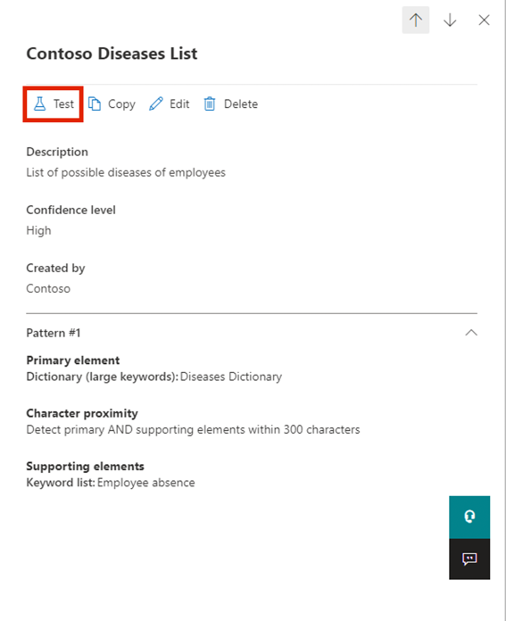

# Laboratorio 2 — Gestión de tipos de información confidencial

## Objectivo:

Contoso Ltd. anteriormente tuvo problemas con empleados que enviaron
accidentalmente información personal de clientes al trabajar en tickets
de soporte en el sistema de gestión de tickets.

Para capacitar a los usuarios en el futuro, se requiere un tipo de
información confidencial personalizado que identifique los IDs de
empleado en correos y documentos, los cuales consisten en tres letras
mayúsculas y seis números, utilizando tipos de información confidencial.
Para reducir los falsos positivos, se usarán las palabras clave
'Employee' (Empleado) e 'IDs' (Identificadores).

En este laboratorio creará:

- Un nuevo tipo personalizado de información confidencial

- Una base de datos para la clasificación basada en EDM

- Diccionario de palabras clave

## Ejercicio 1 – Creación de tipos de información confidencial personalizados

En el presente ejercicio, usted empleará el módulo de PowerShell del
centro de seguridad y cumplimiento para crear un nuevo tipo de
información confidencial personalizada que permita identificar los
números de identificación de empleados cuando aparezcan próximos a los
términos clave 'Employee' e 'ID'.

1.  En **Microsoft Edge**, abra una **nueva ventana InPrivate**, vaya a
    `https://purview.microsoft.com` e inicie sesión como **Patti
    Fernandez** utilizando el nombre de usuario
    `PattiF``@{TENANTPREFIX}.onmicrosoft.com` y la contraseña de usuario
    que figura en su pestaña de recursos. Si se le solicita, acepte los
    términos y condiciones y seleccione **Get started**.

2.  Desde la barra de navegación izquierda, seleccione **Solutions** \>
    **Data Loss Prevention**.

3.  Seleccione **Classifiers** en el panel izquierdo. Seleccione
    **Sensitive info types** en el panel de subnavegación. Seleccione
    **+Create sensitive info type** para abrir el asistentne para un
    nuevo tipo de información confidencial.

Captura de pantalla generada automáticamente de una interfaz informática

4.  En la página **Name your sensitive info type**, ingrese la siguiente
    información:

    - **Name**: `Contoso Employee IDs`

    - **Description**: `Pattern for Contoso Employee IDs.`

5.  Seleccione **Next**.

Interfaz gráfica de usuario, descripción de la aplicación generada
automáticamente

6.  En la página **Define patterns for this sensitive info type**,
    seleccione **Create pattern**.

Una captura de pantalla de una descripción de ordenador generada
automáticamente

7.  En el panel de la derecha **New pattern**, seleccione **Add primary
    element** y seleccione **Regular expression**.

Interfaz gráfica de usuario, aplicación, descripción de Teams generada
automáticamente

8.  En el nuevo panel de la derecha **Add a regular expression**,
    ingrese lo siguiente:

    - **ID**: `Contoso IDs`

    - **Regular expression**: `\s\[A-Z\]{3}\[0-9\]{6}\s`

    - Select **String match**

9.  Seleccione **Done**.

Interfaz gráfica de usuario, descripción de la aplicación generada
automáticamente

10. En el panel **New pattern** del lado derecho de nuevo, debajo de
    **Supporting elements**, seleccione **+ Add supporting elements or
    group of elements** del menú desplegable y seleccione **Keyword
    list**.

Interfaz gráfica de usuario, descripción de la aplicación generada
automáticamente

10. En el nuevo panel de la derecha **Add a keyword list**, ingrese lo
    siguiente:

    - **ID**: `Employee ID keywords`

    - **Case insensitive**:

&nbsp;

    Employee
    ID

11. Seleccione el radial para ***Word match*** en el campo **Case
    Sensitive**

12. Seleccione **Done**.

Interfaz gráfica de usuario, texto, descripción de la aplicación
generada automáticamente

13. En la ventana New pattern disminuya el valor **Character proximity**
    a ***100*** caracteres.

Interfaz gráfica de usuario, texto, descripción de la aplicación
generada automáticamente

14. Seleccione el botón **Create**.

15. De vuelta en la página **Define patterns for this sensitive info
    type** seleccione **Next**.

Interfaz gráfica de usuario, texto, aplicación, descripción de Teams
generada

automáticamente

16. En la página **Choose the recommended confidence level to show in
    compliance policies** utilice el valor predeterminado y seleccione
    **Next**.

17. En la página **Review settings and finish** revise los ajustes y
    seleccione **Create**. Cuando se haya creado correctamente,
    seleccione **Done**.

Interfaz gráfica de usuario, texto, descripción de la aplicación
generada automáticamente

18. Deje abierta la ventana del navegador.

Ha creado con éxito un nuevo tipo de información confidencial para
identificar IDs de empleado con el patrón de tres letras mayúsculas,
seis números, y las palabras clave 'Employee' o 'IDs' dentro de un rango
de 100 caracteres.

## Ejercicio 2 – Creación de un tipo de información de clasificación basada en EDM 

Como patrón de búsqueda adicional, deberá crear una clasificación basada
en EDM (Exact Data Match) utilizando un esquema de base de datos con
información de empleados. El archivo fuente de la base de datos deberá
incluir los siguientes campos: Name, Birthdate, StreetAddress, and
EmployeeID.

1.  Seleccione **Solutions** \> **Data Loss Prevention** \>
    **Classifiers**, navegue hasta **EDM classifiers**, desactive **New
    EDM experience**, y en EDM Schema, seleccione **+ Create EDM
    schema** para crear una nueva definición de esquema.

Una captura de pantalla de una descripción de ordenador generada
automáticamente

2.  En el campo **Name**, ingrese `employeedb`.

3.  En el campo **Description**, ingrese `Employee Database schema.`

4.  Active **Ignore delimiters and punctuation for all schema fields**.

Una captura de pantalla de una descripción de ordenador generada
automáticamente

5.  Haga clic en el despegable **Choose delimiters and punctuation to
    ignore** y seleccione **Hyphen**, **Period**, **Space**, **Open
    parenthesis** y **Close parenthesis**.

Interfaz gráfica de usuario, descripción de la aplicación generada
automáticamente

6.  En el primer campo llamado Schema field, ingrese `Name` y marque la
    casilla **Field is searchable**.

7.  Seleccione **+ Add schema data field** en el extremo inferior.

8.  En **Schema field name**, debajo de **Schema field \#2**, ingrese
    `Birthdate`.

9.  Vuelva a seleccionar **+ Add schema data field** en el extremo
    inferior.

10. En **Schema field name**, debajo de **Schema field \#3**, ingrese
    `StreetAddress`.

11. Seleccione **+ Add schema data field** en el extremo inferior por
    última vez.

12. En **Schema field name**, debajo de **Schema field \#4**, ingrese
    `EmployeeID`.

13. Seleccione **Field is searchable**.

14. Seleccione **Save**.

Interfaz gráfica de usuario, descripción de la aplicación generada
automáticamente

15. Seleccione **EDM sensitive info types** en el panel Izquierdo y
    seleccione **+ Create EDM sensitive info type** para abrir el
    asistente del **EDM rule package**.

16. En la página **Define data store schema**, seleccione **Choose an
    existing EDM schema**.

Interfaz gráfica de usuario, descripción de la aplicación generada
automáticamente

17. Seleccione **employeedb** y seleccione **Add**.

Interfaz gráfica de usuario, texto, descripción de la aplicación
generada automáticamente

18. Revise el esquema del almacén de datos y seleccione **Next**.

Interfaz gráfica de usuario, descripción de la aplicación generada
automáticamente

19. En la página **Define patterns for this EDM sensitive info type**,
    seleccione **+ Create pattern**.

Interfaz gráfica de usuario, descripción de la aplicación generada
automáticamente

20. En el panel **New pattern** del lado derecho, en el campo **Primary
    element**, seleccione ***EmployeeID***.

21. Abajo de **Primary element’s sensitive info type**, seleccione
    **Choose sensitive info type**.

Una captura de pantalla de una descripción de un patrón generada
automáticamente

22. En la barra **Search**, ingrese ***Contoso*** y presione la tecla
    enter.

23. Seleccione **Contoso Employee IDs** y seleccione **Done**.

24. Seleccione **Done**.

Una captura de pantalla de una descripción de ordenador generada
automáticamente

25. Seleccione **Next** en la pantalla **Define patterns for this EDM
    sensitive info type**.

Interfaz gráfica de usuario, texto, descripción de la aplicación
generada automáticamente

26. En la casilla **Choose the recommended confidence level and
    character proximity** deje que persista el valor por defecto y
    seleccione **Next**.

Interfaz gráfica de usuario, texto, aplicación, descripción de Word
generada automáticamente

27. En la página **Name and describe your EDM sensitive info type**,
    ingrese `Contoso Employee EDM` como nombre.

28. En el campo **Description for admins**, ingrese
    `EDM-based sensitive information type for employee personal ``information.`.Seleccione
    **Next.**

Interfaz gráfica de usuario, texto, descripción de la aplicación
generada automáticamente

29. Revive los ajustes y seleccione **Submit**.

Interfaz gráfica de usuario, texto, descripción de la aplicación
generada automáticamente

30. En su página **Your EDM sensitive info type was created**,
    seleccione **Done**.

Una captura de pantalla de una descripción de ordenador generada
automáticamente

31. Deje el navegador abierto con el portal Microsoft Purview.

Ha creado con éxito un nuevo tipo de información confidencial de
clasificación basada en EDM para identificar los datos de los empleados
a partir de una fuente de archivos de base de datos.

## Ejercicio 3 – Creación de un origen de datos para clasificación basada en EDM (Exact Data Match)

Para asociar la clasificación basada en EDM con una base de datos que
contiene información confidencial, se requiere aplicar hashing y cargar
los datos reales del tipo de información confidencial mediante la
herramienta EDM Upload Agent como siguiente paso.

1.  En **Microsoft Edge**, navegue hasta
    `https://go.microsoft.com/fwlink/?linkid=2088639` para acceder al
    agente de descargas de EDM.

2.  Seleccione **Run** para descargar e instalar la herramienta.

3.  En el asistente de **Microsoft Exact Data Match Upload Agent
    Setup**,

    - Seleccione **I accept the terms in the License Agreement** y luego
      seleccione **Next**.

    - No cambie la ruta predeterminada de **Destination Folder** y
      seleccione **Next**.

    - Seleccione **Install** para realizar la instalación.

    - Cuando se abre la ventana **User Account Control**, selecione
      **Yes**.

    - Si se le pide que inicie sesión, hágalo a través de la cuenta de
      **Patti**.

    - Cuando finalice la instalación, seleccione **Finish**.

    - Seleccione el símbolo **Notepad** y seleccione **Notepad** en el
      menú de inicio.

    - Ingrese el siguiente texto en la primera línea de la ventana del
      bloc de notas (Asegúrese de ingresar los tres siguientes en líneas
      nuevas.)

&nbsp;

    Name,Birthdate,StreetAddress,EmployeeID
    Patti Fernandez,01.06.1980,1Main Street,CSO123456
    Christie Cline,31.01.1985,2Secondary Street,CSO654321

4.  Seleccione File y Save As: `EmployeeData.csv`

5.  Seleccione el despegable en **Save as type:** y seleccione **All
    Files (*.*)**.

6.  Seleccione el despegable en **Encoding:** y seleccione **UTF-8** y
    seleccione **Save**.

7.  Cierre la ventana del bloc de notas.

8.  Seleccione el símbolo de windows en la barra de tareas con el botón
    derecho del mouse y seleccione **Windows PowerShell (Admin)** y
    ejecútelo como administrador.

9.  Cuando se abre la ventana **User Account Control**, seleccione
    **Yes**.

10. Navegue al directorio de instalación del EDM Upload Agent:

`cd "C:\Program Files\Microsoft\EdmUploadAgent"`

Descripción de texto generada automáticamente

11. Autorice con su cuenta la carga de la base de datos en su tenant
    ejecutando el siguiente cmdlet:

`.\EdmUploadAgent.exe /Authorize`

12. Cuando aparezca la ventana **Pick an account**, inicie sesión como
    **Patti Fernandez** utilizando el nombre de usuario
    `PattiF``@{TENANTPREFIX``}.onmicrosoft.com` y la contraseña de
    usuario proporcionada en la pestaña de recursos (o la nueva
    contraseña que haya restablecido).

**Nota**: Para los siguientes pasos, asegúrese de que la ruta de los
archivos se parezca a la ruta de su VM. Puede ser diferente a las
instrucciones o a las capturas de pantalla. En tal caso, cambie la ruta
de su archivo en los comandos en consecuencia.

13. Descargue la definición del esquema de la base de datos del tipo de
    información confidencial de clasificación basada en EDM ejecutando
    el siguiente script en PowerShell

`.\EdmUploadAgent.exe /SaveSchema /DataStoreName employeedb /OutputDir "C:\Users\Admin\Documents\"`

**Nota**: Si el último comando falla, es posible que se tarde más tiempo
en aplicar la pertenencia al grupo **EDM_DataUploaders**. Puede tardar
hasta una hora en descargar el archivo de esquema. Si falla, continúe
con la siguiente tarea y vuelva a este paso más tarde. O compruebe la
ruta de la carpeta de documentos en su VM.

14. Haga un hash del archivo de base de datos y cárguelo en el tipo de
    información confidencial de clasificación basada en EDM ejecutando
    el siguiente script en PowerShell:

`.\EdmUploadAgent.exe /UploadData /DataStoreName employeedb /DataFile "C:\Users\Admin\Documents\EmployeeData.csv" /HashLocation "C:\Users\Admin\Documents\" /Schema "C:\Users\Admin\Documents\employeedb.xml"`

**Nota:** Si recibe los siguientes errores

Error Type: System.IO.FileNotFoundException

Error Message: Unable to find the specified file.

Compruebe la ruta donde guardó el archivo EmployeeData.csv

Descripción de texto generada automáticamente

15. Compruebe el progreso de la carga hasta que el estado cambie a
    completado y, a continuación, ejecute el siguiente comando de
    PowerShell:

`.\EdmUploadAgent.exe /GetSession /DataStoreName employeedb`

Ha cifrado y cargado correctamente un archivo de base de datos para un
tipo de información confidencial de clasificación basada en EDM.

## Ejercicio 4 – Creación de un diccionario de palabras clave

Se produjeron varias filtraciones de información personal cuando los
usuarios enviaron correos electrónicos después de que sus compañeros
notificaran ausencias por enfermedad. Cuando eso sucedía, se enviaba el
motivo de la enfermedad. No queremos que eso suceda.

1.  En **Microsoft Edge**, abra una **nueva ventana InPrivate**, vaya a
    `https://purview.microsoft.com` e inicie sesión como **Patti
    Fernandez** utilizando el nombre de usuario
    `PattiF``@{TENANTPREFIX``}.onmicrosoft.com` y la contraseña de
    usuario que figura en su ficha de recursos.

2.  Desde el menú de navegación de la izquierda, seleccione
    **Solutions** \> **Data Loss Prevention**.

Una captura de pantalla de una descripción de ordenador generada
automáticamente

3.  Seleccione **Classifiers** en el panel izquierdo. Seleccione
    **Sensitive info types** en panel de subnavegación. Seleccione
    **+Create sensitive info type** para abrir el asistente para un tipo
    de información confidencial.

Una captura de pantalla de una descripción de ordenador generada
automáticamente

4.  En la página **Name your sensitive info type**, ingrese lo
    siguiente:

    - Name: `Contoso Diseases List`

    - Description: `List of possible diseases of employees.`

in

Graphical user interface, application, Teams Description automatically
generated

5.  Seleccione **Next**.

6.  En la página **Define patterns for this sensitive info type**,
    seleccione **+ Create pattern**.

Interfaz gráfica de usuario, aplicación, descripción de Teams generada
automáticamente

7.  Seleccione el campo despegable debajo de **Primary element** y
    seleccione **Keyword dictionary**.

Interfaz gráfica de usuario, descripción de la aplicación generada
automáticamente

8.  En la página **Add a keyword dictionary** ingrese el nombre
    `Diseases Dictionary`.

9.  En el área **Keywords**, ingrese las siguientes palabras clave, cada
    una en una línea separada

&nbsp;

    flu
    influenza
    cold
    bronchitis
    otitis

10. Seleccione **Done**.

11. Debajo de **Supporting elements**, seleccione el menu despegable **+
    Add supporting elements or group of elements** y seleccione
    **keyword list** para añadir apoyo adicional al diccionario de
    palabras clave.

Interfaz gráfica de usuario, descripción de la aplicación generada
automáticamente

12. En la página **Add a keyword list** ingrese `Employee absence` en el
    campo **ID**. En el cuadro **Case insensitive**, ingrese las
    siguientes palabras clave, cada una en una línea separada

&nbsp;

    employee
    absence
    reason

Interfaz gráfica de usuario, descripción de la aplicación generada
automáticamente

13. Seleccione **Done**.

14. En la página **New pattern**, revise la configuración y seleccione
    **Create**.

Interfaz gráfica de usuario, descripción de la aplicación generada
automáticamente

15. En **Define patterns for this sensitive info type** seleccione
    **Next**.

Interfaz gráfica de usuario, aplicación, descripción de Teams generada
automáticamente

16. En **Choose the recommended confidence level to show in compliance
    policies**, deje el valor predeterminado y seleccione **Next**.

Una captura de pantalla de una descripción de ordenador generada
automáticamente

17. En la página **Review settings and finish**, revise su configuración
    y seleccione **Create**. Cuando el proceso haya finalizado,
    seleccione **Done**.

18. Deje abierta la ventana del navegador en el portal Microsoft
    Purview.

Ha creado correctamente un nuevo tipo de información confidencial basado
en un diccionario de palabras clave y ha añadido más palabras clave para
disminuir la tasa de falsos positivos. Continúe con la siguiente tarea.

## Exercise 5 – Ejercicio 5 – Trabajo con tipos de información confidencial personalizados

Los tipos de información confidencial personalizados siempre deben
probarse antes de implementarse en políticas, ya que patrones de
búsqueda mal configurados podrían causar pérdida o filtración de datos.

1.  Seleccione el símbolo de Windows en la parte inferior izquierda para
    abrir el menú de inicio, ingrese **Notepad** y seleccione
    **Notepad** en el menú de inicio.

2.  Ingrese el siguiente texto en la ventana del bloc de notas.

`La ``empleada`` Patti Fernandez EMP123456 ``está`` ``ausente`` ``por`` gripe/influenza`

3.  Seleccione **File** y Save As `SickTestData` y seleccione **Save**.

4.  Cierre la ventana del bloc de notas.

5.  En **Microsoft Edge**, abra una **nueva ventana InPrivate**, vaya a
    `https://purview.microsoft.com` e inicie sesión como **Patti
    Fernandez** utilizando el nombre de usuario
    `PattiF``@{TENANTPREFIX``}.onmicrosoft.com` y la contraseña de
    usuario que figura en su ficha de recursos.

6.  En el panel de navegación Izquierdo, seleccione**Solutions** \>
    **Data Loss Prevention**, y luego seleccione **Sensitive info
    types** en **Classifiers**. En el cuadro **Search** de la parte
    superior derecha, ingrese ***Contoso*** y presione **Enter**.
    Seleccione **Contoso Employee IDs** para abrir el panel derecho.

Una captura de pantalla de una descripción de ordenador generada
automáticamente

7.  Selecione **Test** en el panel de la derecha.

Una captura de pantalla de una descripción de ordenador generada
automáticamente

8.  En la página **Upload file to test**, seleccione **Upload file**.

9.  Seleccione **Documents** en el panel izquierdo, seleccione el
    archive con el nombre **SickTestData** y seleccione **Open**.

Interfaz gráfica de usuario, texto, descripción de la aplicación
generada automáticamente

10. Seleccione **Test** para iniciar el análisis.

Interfaz gráfica de usuario, texto, descripción de la aplicación
generada automáticamente

11. En la página **Match results**, revise la coincidencia encontrada.

12. Seleccione **Finish** y cierre la página de prueba hacienda clic en
    el botón **X**.

Interfaz gráfica de usuario, texto, descripción de la aplicación
generada automáticamente

13. De vuelta a la página **Data classification**, seleccione Sensitive
    Information Type con el nombre **Contoso Diseases List**.

14. En el panel lateral derecho, seleccione **Test**.

15. En la página **Upload file to test**, seleccione **Upload file**.

16. Seleccione **Documents** en el panel izquierdo, seleccione el
    archive con el nombre *SickTestData* y seleccione **Open**.

17. Seleccione **Test** para comenzar el análisis.

Interfaz gráfica de usuario, texto, descripción de la aplicación
generada automáticamente

18. En la página **Match results**, revise la coincidencia encontrada.
    Cuando haya terminado, seleccione **Finish**.

Interfaz gráfica de usuario, descripción de la aplicación generada
automáticamente

## Resumen:

Ha probado satisfactoriamente los dos tipos de información confidencial
personalizados y validado que los patrones de búsqueda identifican
correctamente los formatos requeridos. Ha completado la creación de
tipos de información confidencial y puede continuar con el siguiente
ejercicio.
