# **实验室 2_管理敏感信息类型**

## 介绍

Contoso Ltd.
以前遇到过员工在票证解决方案中处理支持票证时意外发送客户个人信息的问题。

为了将来教育用户，需要自定义敏感信息类型来识别电子邮件和文档中的员工
ID，这些 ID
由三个大写字符和六个数字组成，使用敏感信息类型。为了降低误报率，将使用关键字“Employee”和“ID”。

## 目标

- 使用正则表达式和关键字列表创建 **自定义敏感信息类型。**

- 使用结构化员工数据配置**和定义基于** **EDM 的敏感信息类型。**

- 将员工数据哈希并上传到 **EDM 上传代理**进行分类。

- 生成 **基于关键字字典的敏感信息类型** ，以识别与健康相关的机密术语。

- 在策略中应用自定义敏感信息类型之前，测试和验证自定义敏感信息类型的准确性。

- 在 Microsoft Purview 中启用自适应保护。

## 练习 1 – 创建自定义敏感信息类型

在本练习中，你将使用 **Security & Compliance Center
PowerShell **模块创建新的自定义敏感信息类型，该类型可识别关键字“Employee”和“ID”附近的员工
ID 模式。

1.  在 **Microsoft Edge** 中，打开“**新建 InPrivate 窗口**”，导航到
    **+++**https://**purview**.microsoft.com**+++**，然后使用“资源”选项卡上提供的用户名
    **PattiF@WWLxXXXXXX.onmicrosoft.com** 和用户密码以 **Patti
    Fernandez** 身份登录。 

2.  如果显示“**Welcome to the new Microsoft Purview
    portal**”对话框，请单击“**Get Started**”按钮

   

3.  从左侧导航栏中，选择“**Solutions** \> **Data Loss Prevention**”。

   

4.  从左窗格中选择 **Classifiers**。从子导航窗格中选择“**Sensitive info
    types** ”。选择“**+Create sensitive info
    type** ”以打开新敏感信息类型的向导。  

   

5.  在“**Name your sensitive info type**”页上，输入以下信息:

    - **名字**: **+++Contoso Employee IDs+++**

    - **描述**: **+++Pattern for Contosoemployee IDs+++.**

6.  选择 **Next**。 

   

7.  在“**Define patterns for this sensitive info
    type**”页上，选择“**Create pattern**”。 

   

8.  在右侧显示的 **New pattern** 窗格中，选择 **Add primary element**
    并选择 **Regular expression**。 

   

9.  在新的右窗格中，**Add a regular expression，**输入以下内容:

    - **ID**: **+++Contoso IDs+++**

    - **Regular expression**: **+++\s\[A-Z\]{3}\[0-9\]{6}\s+++**

    - 选择 **String match**

10. 选择“**Done**”。 

    

11. 在 New pattern 新建模式窗格中，将 **Character proximity**  值减少到
    ***100*** 个字符。

    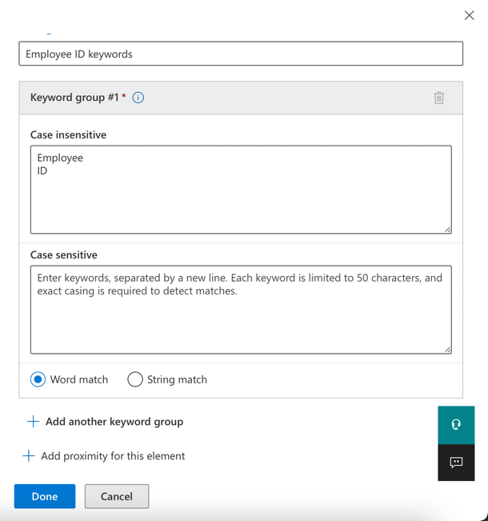

    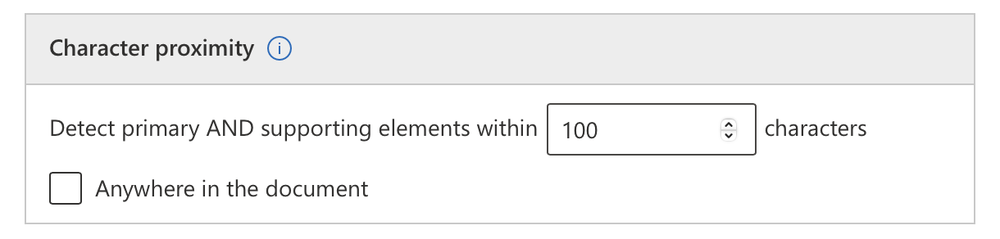

12. 导航到 **Supporting elements** 标题，单击 **+ Add supporting
    elements or group of elements** 下拉菜单，然后选择 **Keyword
    list**。

    

13. 在 **Add a keyword list** 窗格中，输入以下内容:

    - **ID**: **+++Employee ID keywords+++**

    - **Case insensitive**:**+++Employee** **ID+++**

      

14. 向下滚动并选择 **Word match**
    旁边的单选按钮。然后，单击“**Done**”按钮。

    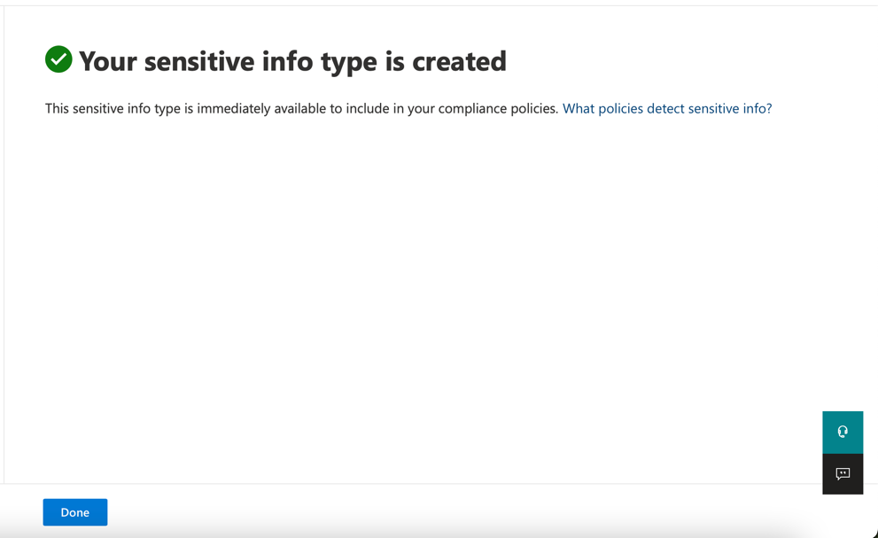

15. 现在，单击“**Create**”按钮。 

    

16. 返回到“**Define patterns for this sensitive info
    type** ”页，选择“**Next**”。

   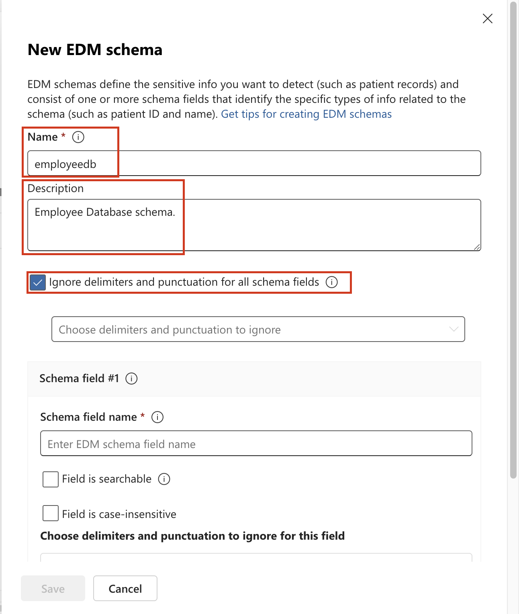

17. 在“**Choose the recommended confidence level to show in compliance
    policies** ”页上，使用默认值并选择“**Next**”按钮。

    

18. 在“**Review settings and
    finish** ”页上，查看设置并选择“**Create**”。成功创建后，选择
    **Done**。

    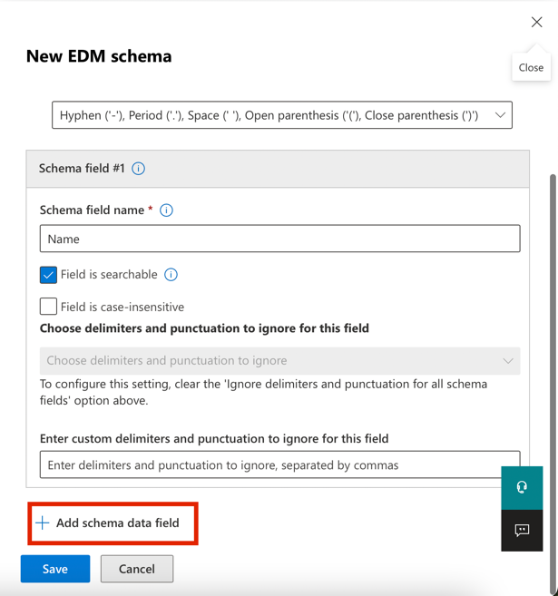

    

19. 保持浏览器窗口打开。

已成功创建新的敏感信息类型，以三个大写字符、六个数字和 100
个字符范围内的关键字“Employee”或“ID”的模式标识员工 ID。

## 练习 2 – 创建基于 EDM 的分类信息类型

作为额外的搜索模式，您将使用员工数据的数据库架构创建基于 EDM
的分类。数据库源文件将使用员工的以下数据字段进行格式化：Name、Birthdate、StreetAddress
和 EmployeeID。

1.  单击 Solutions，然后选择 **Data Loss
    Prevention**

    

2.  单击 **Classifiers**，然后选择 **EDM classifiers**。在“EDM
    classifiers”页中，单击“**New EDM experience**”旁边的切换按钮将其
    **Off**

    

3.  然后，单击 **Create** **EDM schema**

   

4.  在“**Name**”字段中，输入 **+++employeedb+++**。  

5.  在“**Description**”字段中，输入
    **+++Employee Database schema.+++**。 取消选中 **Ignore delimiters
    and punctuation for all schema fields**。 

   

   

6.  在第一个 Schema field name 中，输入 **+++Name+++** 并标记 **Field is
    searchable** 框。

   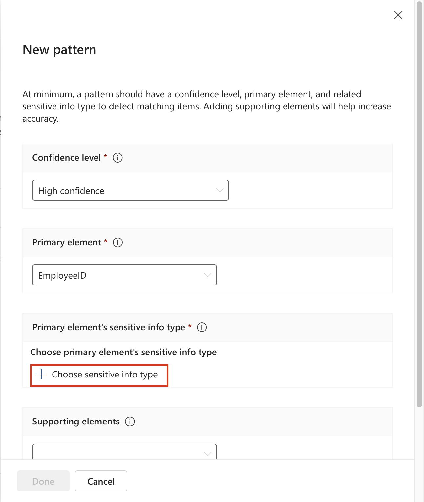

7.  单击“**Choose delimiters and punctuation to
    ignore** ”的下拉列表，然后选择 **Hyphen**, **Period**,
    **Space**, **Open parenthesis**  和 **Close parenthesis**。

   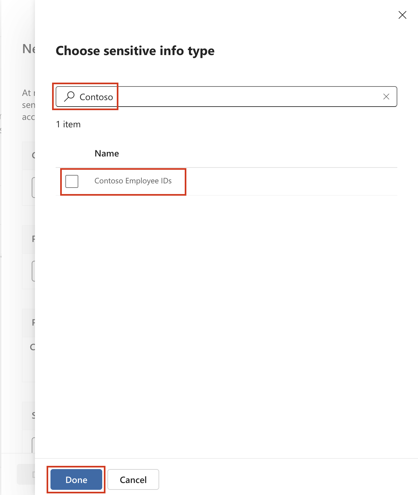

8.  从下端选择 **+ Add schema data field** 。

   

9.  在 **Schema field name** 的 **Schema field \#2**下，输入 **+++Birthdate+++**。 

10. 再次从下端选择 **+ Add schema data field** 。

11. 在 **Schema field name** 的 **Schema field \#3**下方，输入
    **+++StreetAddress+++**.。 

12. 最后一次从下端选择 **+ Add schema data field** 。 

13. 在 **Schema field name** 的 **Schema field \#4**下，输入
    **+++EmployeeID+++**。 

14. 选择 **Field is searchable**。

15. 选择 **Save**。

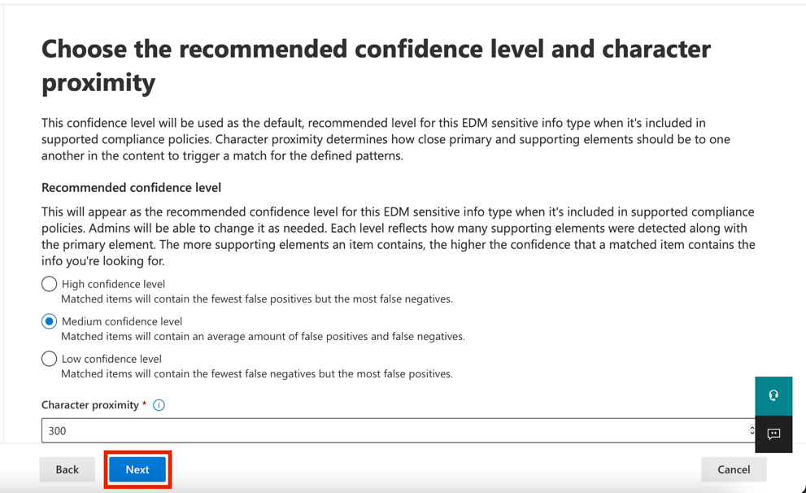

16. 从左窗格中选择 **EDM sensitive info types** ，然后选择 **+ Create
    EDM sensitive info type** 以打开 **EDM rule package**  向导。

   

17. 在“**Define data store schema** ”页上，选择“**Choose an existing EDM
    schema**”。
    

18. 选择 **employeedb** 并选择 **Add**。

   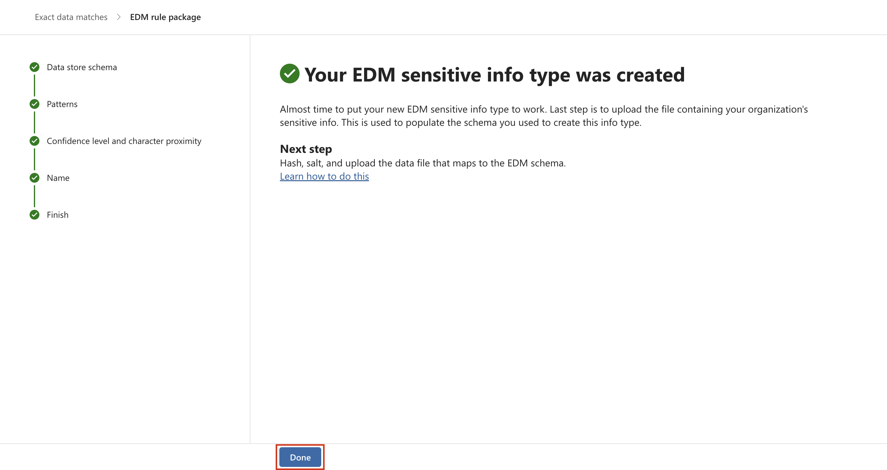

19. 查看数据存储架构，然后选择“**Next**”。

   

20. 在“**Define patterns for this EDM sensitive info
    type**”页上，选择**+ Create pattern**”。 

   

21. 在右侧的 **New pattern**窗格的 **Primary element**  字段中，选择
    ***EmployeeID***。 

22. 在“**Primary element's sensitive info type**”下，选择“**Choose
    sensitive info type**”。 

   

23. 在 **Search** 中，输入 ***Contoso*** ，然后按 Enter 键。 

24. 选择 **Contoso Employee IDs**，然后选择 完成。  

25. 选择 **Done**。 

    

26. 在“*Define patterns for this EDM sensitive info
    type* ”屏幕中选择“**Next**”。  

    

27. 在“**Choose the recommended confidence level and character
    proximity** ”中，让默认值保留，然后选择“**Next**”。

    

28. 在“**Name and describe your EDM sensitive info type** ”页中，输入
    **+++Contoso Employee EDM+++** 作为名称。

29. 在“**Description for admins** ”字段中，为员工个人信息输入
    **+++EDM-based sensitive information type for employee personal
    information.+++**。选择**Next**。 

   

30. 查看设置并选择 **Submit。**

    

31. 在 **Your EDM sensitive info type was created** 页上，选择
    **Done**。 

    

32. 使用 Microsoft Purview 门户使浏览器保持打开状态。

已成功创建新的基于 EDM
的分类敏感信息类型，用于从数据库文件源识别员工数据。

## 练习 3 – 创建基于 EDM 的分类数据源

若要将基于 EDM 的分类与包含敏感数据的数据库相关联，接下来需要通过 EDM
上传代理工具对敏感信息类型的实际数据进行哈希处理和上传。

1.  在 **Microsoft Edge** 中，导航到
    **+++**https://go.microsoft.com/fwlink/?linkid=2088639**+++**以下载
    EDM 下载代理。 

2.  单击 **Open file** 链接以访问 **EdmUploadAgent.msi**

   

3.  在“**Welcome to the Microsoft Exact Data Match Upload Agent Setup
    Wizard**”对话框中，单击“**Next**”按钮。

   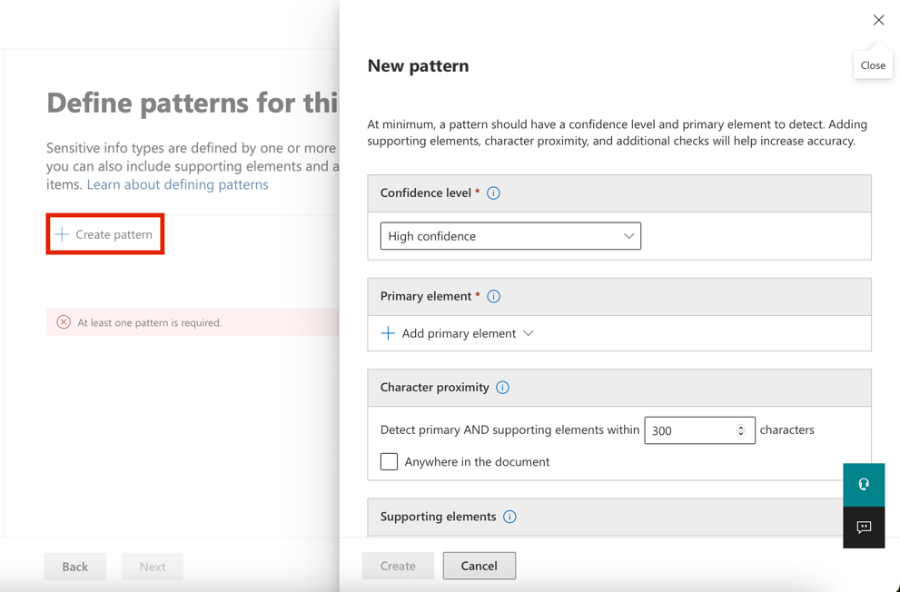

4.  在 **Microsoft Exact Data Match Upload Agent Setup** 向导中，选择
    “**Next**”。

    - 选择“**I accept the terms in the License
      Agreement**”，然后选择“**Next**”。 

    - 不要更改默认的 **Destination Folder** 路径，然后选择**Next**。 

    - 选择 **Install** 以执行安装。 

    - 打开“**User Account Control** ”窗口时，选择“**Yes**”。

    - 如果要求登录，请通过 **Patti** 的帐户登录。

    - 安装完成后，选择“**Finish**”。

5. 现在，右键单击 Windows 图标，导航并单击
**Run**。在“**Run**”对话框中，键入 +++notepad+++，然后单击“**OK**”按钮。

   

   

6. 在记事本窗口的第一行输入以下文本:

**+++Name,Birthdate,StreetAddress,EmployeeID**

**Patti Fernandez,01.06.1980,1Main Street,CSO123456**

**Christie Cline,31.01.1985,2Secondary Street,CSO654321+++**

7.  选择“File”并另存为: **+++EmployeeData.csv+++**

8.  选择“**Save as type:** ”中的下拉列表，然后选择“**All Files
    (*.*)**”。

9.  在“**Encoding**”字段中，确保选择了
    **UTF-8**，然后单击“在“编码”字段中，确保选择了
    UTF-8，然后单击“保存”按钮。”按钮。

   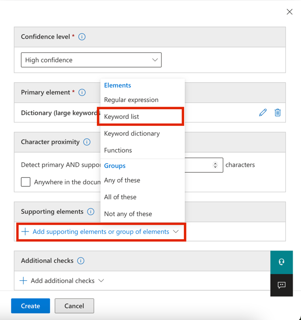

10. 关闭记事本窗口。

11. 右键单击任务栏上的 Windows 图标，然后选择 Windows
    PowerShell（管理员）以管理员身份运行它。

    

12. 在“**User Account Control** ”对话框中，单击“**Yes**”按钮。

    

13. 导航到 EDM 上传代理目录:

   **+++cd "C:\Program Files\Microsoft\EdmUploadAgent"+++**

   

14. 通过运行以下 cmdlet，使用帐户授权将数据库上传到租户:

    **+++.\EdmUploadAgent.exe /Authorize+++**

    

15. 当显示“**Pick an account** ”窗口时，使用“资源”选项卡上提供的用户名
    **PattiF@WWLxXXXXXX.onmicrosoft.com** 和用户密码以 **Patti
    Fernandez** 身份登录。（或您重置的新密码。

    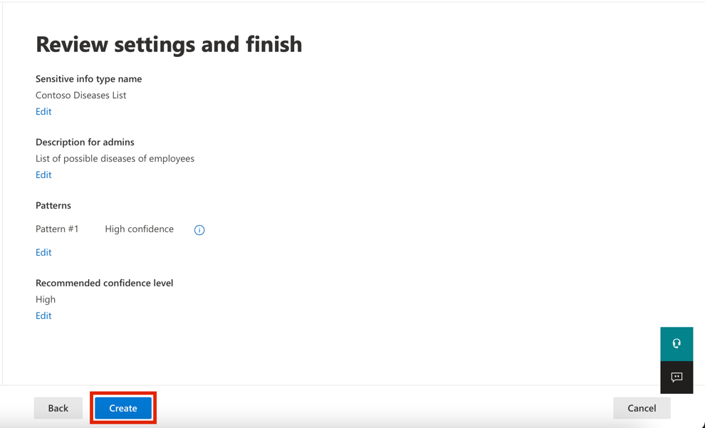

    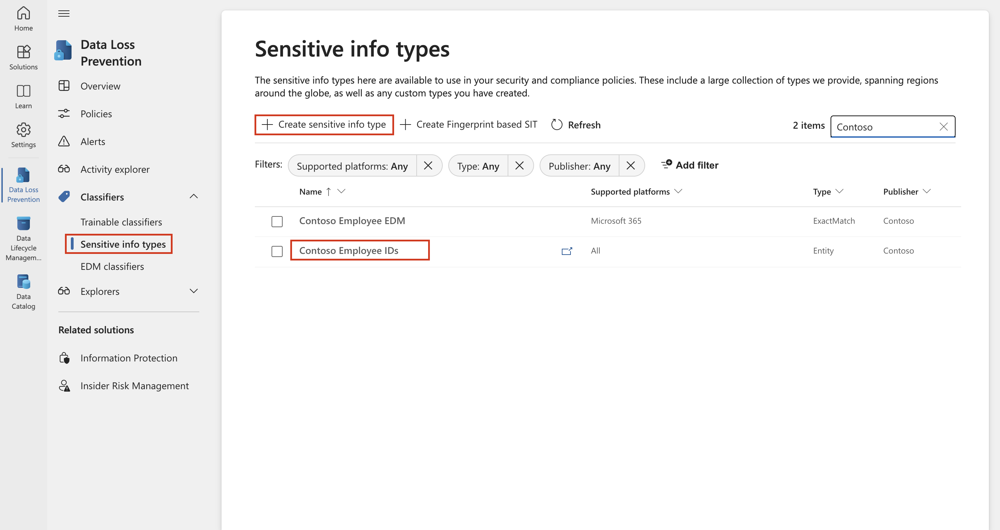

16. 通过在 PowerShell 中运行以下脚本，下载基于 EDM
    的分类敏感信息类型的数据库架构定义:

    **+++.\EdmUploadAgent.exe /SaveSchema /DataStoreNameemployeedb /OutputDirC:\Users\Admin\Documents\\++**

**注意：**如果最后一个命令失败，则可能需要更多时间才能应用
**EDM_DataUploaders**
组成员资格。最多可能需要一小时才能下载架构文件。如果失败，请继续执行下一个任务，稍后返回此步骤。或者检查
VM 上文档文件夹的路径。

      

17. 通过在 PowerShell
    中运行以下脚本，对数据库文件进行哈希处理，并将其上传到基于 EDM
    的分类敏感信息类型:

**+++.\EdmUploadAgent.exe /UploadData/DataStoreName employeedb /DataFileC:\Users\Admin\Documents\EmployeeData.csv /HashLocation C:\Users\Admin\Documents\\/SchemaC:\Users\Admin\Documents\employeedb.xml+++**

   

**注意：**如果您收到以下错误

错误类型: System.IO.FileNotFoundException

错误信息: 找不到指定的文件。

检查保存文件 EmployeeData.csv 的路径

   

18. 检查上传进度，直到状态更改为“已完成”，然后运行以下 PowerShell 命令:

   **+++.\EdmUploadAgent.exe /GetSession /DataStoreNameemployeedb+++**

   

   已成功哈希并上传基于 EDM 的分类敏感信息类型的数据库文件。

## 练习 4 – 创建关键字词典

当用户在同事报告病假后发送电子邮件时，发生了几起个人信息泄露违规行为。当这种情况发生时，疾病或疾病的原因就会被发出。我们不希望这种情况发生。

1.  在 **Microsoft Edge** 中，打开“**New InPrivate Window**”，导航到
    **+++https://purview.microsoft.com+++**，然后使用“资源”选项卡上提供的用户名
    **PattiF@WWLxXXXXXX.onmicrosoft.com** 和用户密码以 Patti Fernandez
    身份登录。 

2.  从左侧导航栏中，选择“**Solutions** \> **Data Loss Prevention**”。

   

3.  从左窗格中选择 **Classifiers**。从子导航窗格中选择“**Sensitive info
    types** ”。选择“**+Create sensitive info
    type** ”以打开新敏感信息类型的向导。  

   

4.  在“**Name your sensitive info type ”**页上，输入以下内容:

    - 名字: **+++Contoso Diseases List+++**

    - 描述: **+++List of possible diseases of employees.+++**

   

5.  选择 **Next**。

6.  在“**Define patterns for this sensitive info type** ”页上，选择“**+
    Create pattern**”。

   

7.  选择“**Primary element** ”下方的下拉字段，然后选择“**Keyword
    dictionary**”。

   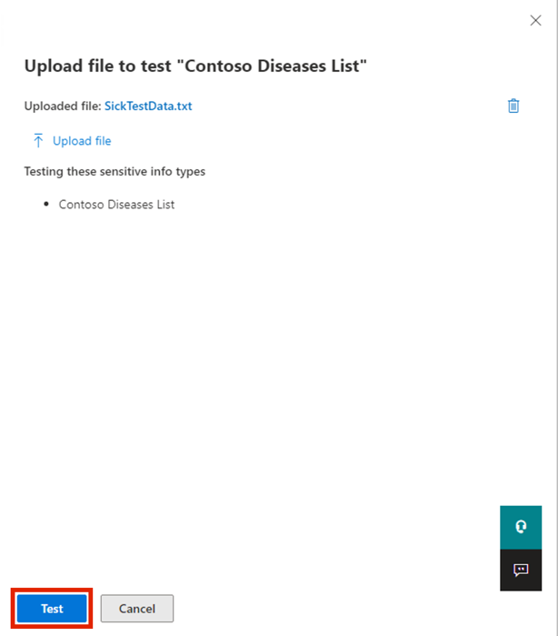

8.  在 **Add a keywor d dictionary**页中，输入名称 **!!*Diseases
    Dictionary*!!** 。

9.  在**“Keywords ”**区域中，输入以下关键字，每个关键字都输入到单独的行中:

**+++flu**

**influenza**

**cold**

**bronchitis**

**otitis+++**

   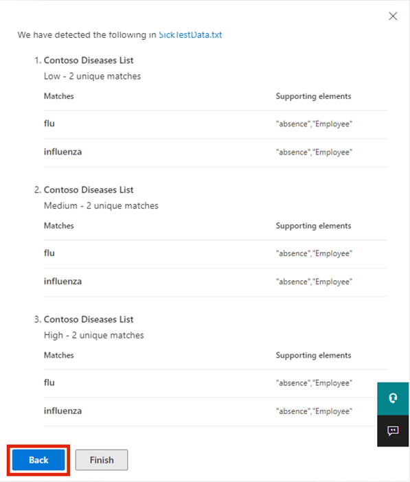

10. 选择 **Done**。

11. 在“**Supporting elements**”下，选择“**+ Add supporting elements or
    group of elements**”下拉列表，然后选择“**keyword
    list** ”以添加对关键字词典的其他支持。

   

12. 在 添加关键字列表 页中，在 **ID** 字段中输入
    **Employee **。在“**Case
    insensitive** ”框中，输入以下关键字，每个关键字输入单独的行，然后单击“**Done**”按钮:

**+++EmployeeID+++**

**+++leave+++**

**+++reason+++**

   

13. 在“**New pattern**”页中，查看配置并选择“**Create**”。

   

14. 在“**Define patterns for this sensitive info
    type**”中，选择“**Next**”。 

   

15. 在“**Choose the recommended confidence level to show in compliance
    policies** ”中，让默认值保留，然后选择“**Next**”。

   

16. 在“**Review settings and
    finish** ”页中，查看设置并选择“**Create**”。该过程完成后，选择“**Done**”。

    

17. 使 Microsoft Purview 门户中的浏览器窗口保持打开状态。

你已成功基于关键字字典创建了新的敏感信息类型，并添加了更多关键字以降低误报率。继续执行下一个任务。

## 练习 5 – 使用自定义敏感信息类型

在策略中使用自定义敏感信息类型之前，应始终对其进行测试，否则由于自定义搜索模式故障，可能会发生数据丢失或泄漏。

1.  右键单击 Windows 图标，导航并单击 **Run**。在“**Run**”对话框中，键入
    +++notepad+++，然后单击“**OK**”按钮。

   

   

2.  在记事本窗口中输入以下文本:

**+++ Employee Patti Fernandez with Employee ID ABC123456 is on leave
because of the flu/influenza+++**

3.  选择“**File**并另存为 **SickTestData**”，然后选择“**Save**”。 

4.  关闭记事本窗口。

5.  在 **Microsoft Edge** 中，Microsoft Purview
    门户选项卡仍应打开。如果是这样，请选择它并继续下一步。如果关闭了它，则在新选项卡中导航到
    **+++https://purview.microsoft.com+++**。使用资源选项卡上提供的用户名
    **PattiF@WWLxXXXXXX.onmicrosoft.com** 和用户密码以 **Patti
    Fernandez** 身份登录。

6.  在左侧导航窗格中，选择“**Solutions** \> **Data Loss
    Prevention**”，然后在“**Classifiers**”下选择“**Sensitive info
    types**”。在右上角的“**Search**”框中，输入 ***Contoso***，然后按
    Enter。单击“**Contoso Employee IDs** ”以打开右侧窗格。

   

7.  从右侧窗格中选择“**Test**”。  

   

8.  在“**Upload file to test** ”页上，选择“**Upload file**”。

   

9.  从左窗格中选择“**Documents**”，选择名称为 **SickTestData**
    的文件，然后选择“**Open**”。 

   

10. 选择“**Test**”以开始分析。  

   

11. 在 **Match results** 页上，查看找到的匹配项。

    

12. 选择“**Finish**”，然后单击“**X**”按钮关闭测试页。 

   

13. 返回到“**Data classification** ”页，选择名称为“**Contoso Diseases
    List**”的“敏感信息类型”。

14. 在右侧窗格中，选择“**Test**”。

    

15. 在“**Upload file to test** ”页上，选择“**Upload file**”。

   

16. 从左窗格中选择“**Documents** ”，选择名称为 *SickTestData*
    的文件，然后选择“**Open**”。 

17. 选择“**Test** ”以开始分析。

   

18. 在 **Match results
    页**上，查看找到的匹配项。审阅完成后，选择**“Finish”**。

   

## **练习 6 - 启用自适应保护**

1.  在 Microsoft Purview
    门户左侧导航窗格中，单击“**Solutions**”，然后导航并选择“**Insider
    Risk Management**”

   

2.  在“**Insider Risk Management**”窗格中，导航并单击“**Adaptive
    Protection**”，然后选择“**Adaptive Protection
    settings**”。现在，打开自适应保护开关。

   

3.  单击“**Save**”按钮。

   

4.  启用自适应保护需要时间。我们将在第 5 个实验室中探索自适应保护功能。

   

## 总结：

在本实验室中，你已了解如何使用正则表达式、关键字字典和 Exact Data Match
（EDM） 技术在 Microsoft Purview 中创建和测试自定义Sensitive Information
Types（SIT） ，以增强数据丢失防护功能。
