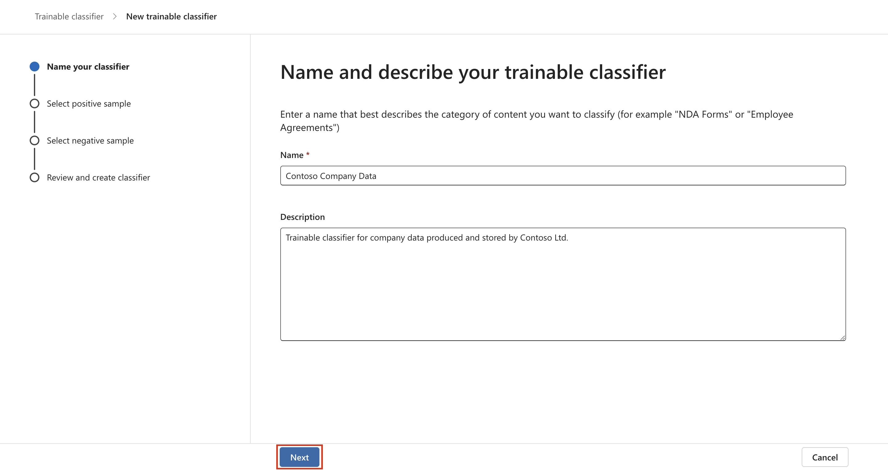

# **ラボ3 – トレーニング可能なClassifiersの管理**

## 導入：

Contoso Ltd. テナントには、「Sales and Marketing」という名前の
SharePoint
サイトコレクションが含まれており、将来的には財務関連のドキュメントやレポートを保存するために利用されます。これらのドキュメントの性質上、これらのファイルを認識してラベルを付けるトレーニング可能な分類子を作成する必要があります。このラボでは、カスタムのトレーニング可能な分類子を有効化し、新しい分類子を作成します。

目的

- 選択した SharePoint
  サイトに保存されている一般的なデータを識別および分類するためのトレーニング可能な分類子を作成します。

## 演習1 – 学習可能なClassifiersの作成

このタスクでは、Patti は新しいトレーニング可能な分類子を作成し、Contoso
Ltd によって作成および保存された一般的なデータを識別するためのさまざまな
SharePoint サイトを選択します。

1.  **Microsoft Edge**で、**New InPrivate Windowを開き、
    +++https://purview.microsoft.com+++**に移動して、ユーザー名**PattiF@WWLxXXXXXX.onmicrosoft.com**とリソース
    タブに指定されているユーザー パスワードを使用して、 **Patti
    Fernandez**としてログインします。

2.  左側のナビゲーションから、 **\[Solutions\]** \> **\[Data Loss
    Prevention\]**を選択します。

    

3.  左側のペインから**「Classifiers」**を展開します。サブナビゲーションペインから**「Trainable
    Classifiers」を選択します。** 新しい分類子を作成するには、 **「+
    Create trainable classifier」**を選択します。

    

4.  **Name and describe your trainable
    classifier**ページに次の情報を入力します。

5.  Name: **+++ Contoso Company Data +++**

6.  説明: **+++ Trainable classifier for company data produced and
    stored by Contoso Ltd. +++**

7.  **「Next」**を選択します。

    

8.  **\[Choose sites\]**を選択して右側のペインを開きます。

    

9.  次の SharePoint サイトを選択し、 **\[Add\]**を選択します。

    - ブランド

    - デジタルイニシアティブ広報

    - 仕事

    - 営業とマーケティング

    - マーク8プロジェクトチーム

    

10. 選択したサイトがリストに表示されるまで待ってから、
    **「Next」**を選択します。

    

11. **Source of the negative sample contentページ**で、「**+Choose
    sites」をクリックします。**

    

12. **\[Add SharePoint sites\]**ウィンドウで、 **\[Learn\]
    の**横にあるチェックボックスに移動して選択し、**\[Add\]**ボタンをクリックします。

    

13. **「Next」**ボタンをクリックします。

    

14. 設定を確認し、 **「Create trainable classifier」**を選択します。

    

15. **Your trainable classifier is being trainedページ**で、
    **\[Done\]**ボタンをクリックします。

    

選択した SharePoint
サイト内のドキュメントとファイルが分析中です。分析には最大 24
時間かかる場合があります。

## まとめ：

*「Contoso Company
Data」*というトレーニング可能なClassifiersを作成しました。このClassifiersはドキュメントを分析して企業固有のデータを識別します。トレーニングには最大24時間かかります。
