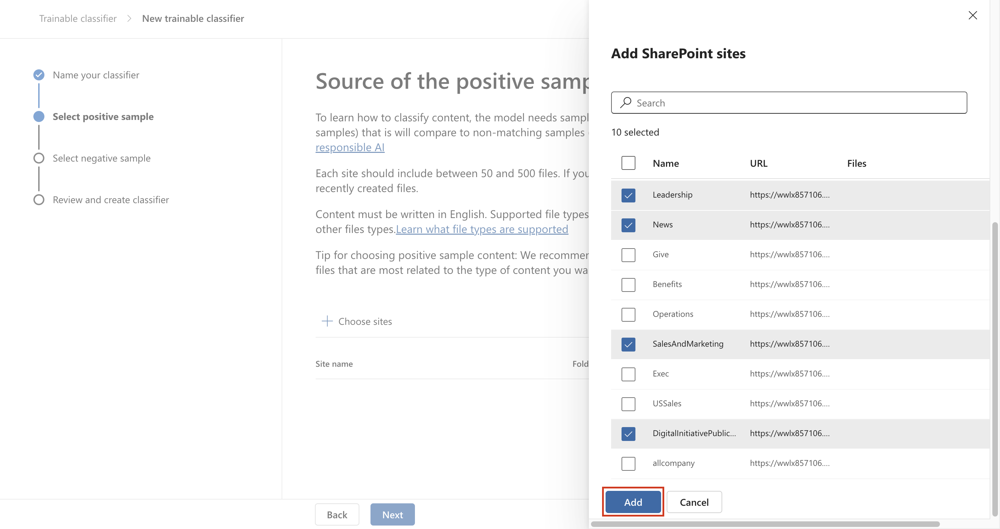

# 實驗 3 – 管理可訓練分類器

## 目的:

Contoso Ltd. 租戶包含一個 SharePoint
網站集，該網站集將來將用于存儲多個與財務相關的文檔和報表。由于這些文檔的性質，您需要創建一個可訓練的分類器來識別和標記這些文件。爲此，您將激活自定義可訓練分類器，幷在此實驗室中創建一個新分類器。

## 練習 1 – 創建可訓練分類器

在此任務中，Patti 將創建一個新的可訓練分類器，幷選擇不同的 SharePoint
站點來識別 Contoso Ltd. 創建和存儲的典型數據。

1.  在 **Microsoft Edge** 中，打開一個 **New InPrivate Window**，導航到
    `https://purview.microsoft.com` 幷使用用戶名
    PattiF@WWLx{TENANTPREFIX}.onmicrosoft.com
    和資源選項卡上提供的用戶密碼以 `Patti Fernandez` 身份登錄。

2.  從左側導航欄中，選擇 **Solutions** \> **Data Loss Prevention**。

自動生成的計算機 Description 的屏幕截圖

3.  從左側窗格中展開 **Classifiers**。從子導航窗格中選擇 **Trainable
    Classifiers。+ Create trainable classifier** 以創建新的分類器。

4.  在 **Name and describe your trainable classifier**
    頁面上輸入以下信息：

    - 名字: `Contoso Company Data`

    - 描述:
      `Trainable classifier for company data produced and stored by Contoso Ltd.`

5.  選擇 **Next**。

自動生成的計算機 Description 的屏幕截圖

8.  選擇 **Choose sites** 以打開右側窗格。

自動生成的計算機 Description 的屏幕截圖

9.  選擇以下 SharePoint 站點，然後選擇 **Add**。

    - Brand

    - Digital Initiative Public Relations

    - Work

    - Sales and Marketing

    - Mark 8 Project Team

10. 等待所選站點顯示在列表中，然後選擇 **Next**。

自動生成的計算機 Description 的屏幕截圖

11. 在 **Source of the negative sample content page**，選擇站點
    **Learn**，然後選擇 **Next**。

12. 查看設置，然後選擇 **Create trainable classifier**。

自動生成的計算機 Description 的屏幕截圖

13. 當顯示消息 Your trainable classifier was created 時，選擇 **Done**。

現在正在分析所選 SharePoint 站點中的文檔和文件，這可能需要長達 24
小時。準備就緒後，您可以執行以下作。

- Test the classifier

- Review the classifier

- Publish the classifier

您可以瀏覽已存在的分類器以供進一步查看。

## 總結:

您已成功創建一個自定義可訓練分類器，該分類器與 Contoso Ltd. 的現有
SharePoint 站點上存儲的文件匹配。
