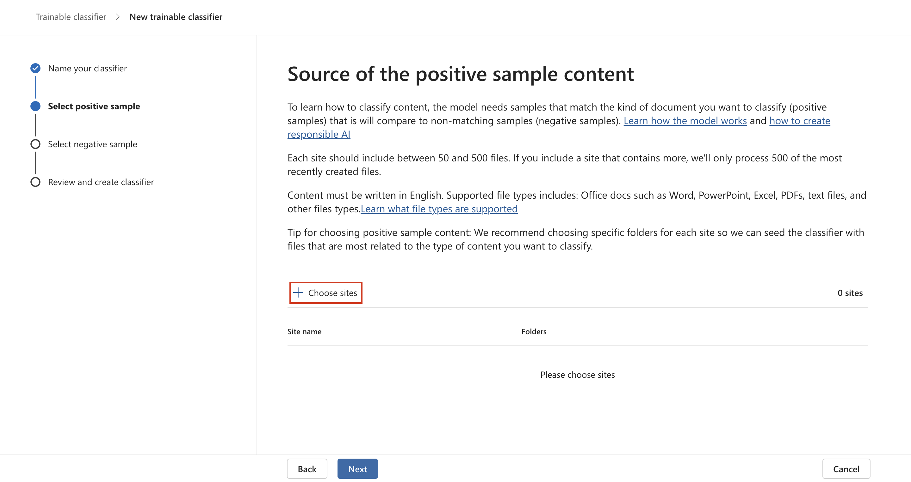

# **实验室 3_管理可训练分类器**

## 介绍:

Contoso Ltd. 租户包含一个名为“销售和营销”的 SharePoint
网站集，将来将用于存储多个与财务相关的文档和报表。由于这些文档的性质，您需要创建一个可训练的分类器来识别和标记这些文件。为此，你将激活自定义可训练分类器，并在此实验室中创建一个新的分类器。

目标

- 创建可训练的分类器来识别和分类所选 SharePoint 网站中存储的典型数据。

## 练习 1 – 创建可训练的分类器

在此任务中，Patti 将创建一个新的可训练分类器，并选择不同的 SharePoint
网站来标识 Contoso Ltd 创建和存储的典型数据。

1.  在 **Microsoft Edge** 中，打开“**New InPrivate Window**”，导航到
    **+++https://purview.microsoft.com+++**，然后使用“资源”选项卡上提供的用户名
    **PattiF@WWLxXXXXXX.onmicrosoft.com**和用户密码以身份登录。

2.  从左侧导航栏中，选择“**Solutions** \> **Data Loss Prevention**”。

   

3.  从左窗格中展开**Classifiers**。从子导航窗格中选择“**Trainable
    Classifiers** ”。选择“**+ Create trainable
    classifier** ”以创建新的分类器。 

   

4.  在 **Name and describe your trainable classifier** 页:

5.  名字: **+++Contoso Company Data+++**

6.  描述: **+++Trainable classifier for company data produced and stored
    by Contoso Ltd.+++**

7.  选择 **Next**。

   

8.  选择“**Choose sites** ”以打开右侧窗格。 

   

9.  选择以下 SharePoint 网站，然后选择“**Add**”。

    - 品牌

    - 数字倡议公共关系

    - 工作

    - 销售和营销

    - Mark 8 项目团队

   

10. 等待所选站点显示在列表中，然后选择 **Next。**

    

11. 在“**Source of the negative sample content**”**页**上，单击**+
    Choose sites page**

   

12. 在“**Add SharePoint
    sites**”窗格中，导航并选中“**Learn**”旁边的复选框，然后单击“**Add**”按钮。

   

13. 单击“**Next**”按钮。

   

14. 查看设置，然后选择“**Create trainable classifier**”。

    

15. 在“**Your trainable classifier is being
    trained**”页上，单击“**Done**”按钮。

   

现在正在分析所选 SharePoint 网站中的文档和文件，这可能需要长达 24 小时。

## 总结:

在本实验室中，你通过选择相关的 SharePoint 网站作为正内容源和负内容源，在
Microsoft Purview 中创建了名为 *Contoso Company Data*
的可训练分类器。该分类器将分析文档以识别公司特定数据，培训最多需要 24
小时。

