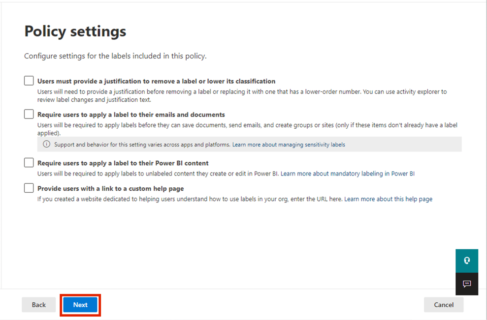

# 실습 4 – Sensitivity Labels와 작업하기

## 목표:

이 실습에서는Contoso Ltd의 시스템 관리자인 Patti Fernandez의 역할을 맡은
것으로 가정합니다. 귀하의 조직은 독일의 Rednitzhembach에 기반을 두고
있으며 현재 조직 정보 보호 정책의 일환으로 HR 부서의 모든 직원 문서에
민감도 레이블이 표시되었는지 확인하기 위해 민감도 계획을 구현하고
있습니다.

## 연습 1 – Sensitivity labels에 대한 지원을 활성화하기

이 작업에서는 MSOnline 모듈 및 SharePoint Online PowerShell 모듈을
설치하고 테넌트에서 민감도 레이블에 대한 지원을 사용하도록 설정할
것입니다.

1.  마우스 오른쪽 버튼으로 작업 표시줄에서 Windows 기호를 선택하고
    **Windows PowerShell (Admin)**을 선택하고 관리자 권한으로
    실행하세요.

컴퓨터 설명의 스크린샷 자동으로 생성됩니다

2.  **Yes**로 **User Account Control**창을 확인하고 Enter키를 누르세요.

3.  다음 cmdlet을 입력하여 최신 Microsoft Online PowerShell 모듈 버전을
    설치하세요:

`Install-Module -Name MSOnline`

컴퓨터 설명의 스크린샷 자동으로 생성됩니다

4.  NuGet 보안 대화 상자와 신뢰할 수 없는 리포지토리 보안 대화 상자를
    확인하고 Y를 Yes로 지정하고 Enter 키를 누르세요. 처리를 완료하는 데
    시간이 걸릴 수 있습니다.

5.  최신 SharePoint Online PowerShell 모듈 버전으로 설치하려면 다음
    cmdlet을 입력하세요:

`Install-Module -Name ``Microsoft.Online.SharePoint.PowerShell`

컴퓨터 설명의 스크린샷 자동으로 생성됩니다

6.  Untrusted repository security dialog를 Y에서 Yes를 확인하고 Enter
    키를 누르세요.

컴퓨터 화면의 스크린샷 설명이 자동으로 생성됩니다

7.  다음 cmdlet을 입력하여Microsoft Online 서비스에 연결하세요:

`Connect-``MsolService`

8.  **Sign in to your account** 양식에서는 사용자
    이름`PattiF``@{TENANTPREFIX}.onmicrosoft.com` 와 리소스 탭에 제공괸
    사용자 암호를**Patti Fernandez**로 로그인하세요.

컴퓨터 화면의 스크린샷 설명이 자동으로 생성됩니다

9.  로그인한 후 **PowerShell window**로 이동하세요.

10. 도메인을 가져오기 위해 다음 cmdlet을 입력하세요:

`$domain = get-``msoldomain`

11. 다음 cmdlet을 입력하여 SharePoint 관리자url을 생성하세요:

`$``adminurl`` = "https://" + $``domain.Name.split``(``'.')[``0] + "-admin.sharepoint.com"`

컴퓨터 화면의 스크린샷 설명이 자동으로 생성됩니다

12. 다음 cmdlet을 입력하여SharePoint Online 관리 센터에 로그인하세요:

`Connect-``SPOService`` -``url`` $``adminurl`

컴퓨터 화면의 스크린샷 설명이 자동으로 생성됩니다

13. **Sign in to your account** 양식에서 실습 환경의 리소스 탭에 제공된
    자격 증명을 사용하여**MOD Administrator**로 로그인하세요.

14. 로그인한 후 PowerShell 창을 선택하세요.

15. 다음 cmdlet을 입력하여 sensitivity labels에 대한 지원을 사용하도록
    설정하세요:

`Set-``SPOTenant`` -``EnableAIPIntegration`` $true`

16. Yes에 대해 **Y**를 눌러 변경 사항을 확인하고 Enter 키를 누르세요.

17. **PowerShell** 창을 닫으세요.

Teams 및 SharePoint 사이트에서 민감도 레이블에 대한 지원을 사용하도록
설정했습니다.

## 연습 2 – Sensitivity Labels 생성하기

이 작업에서 HR 부서는 HR 직원 문서에 적용할 Sensitivity Label을
요청했습니다. 내부 문서에 대한 Sensitivity Label과 HR 부서에 대한 하위
레이블을 생성할 것입니다.

1.  **Microsoft Edge**에서 navigate to `https://purview.microsoft.com`
    로 이동하여 사용자 이름`PattiF``@{TENANTPREFIX}.onmicrosoft.com` 및
    리소스 탭에 제공된 사용자 암호를 사용하여**Patti Fernandez**로
    로그인하세요.

2.  Microsoft Purview 포털에서 왼쪽 탐색 창에서 **Solutions** \>
    **Information Protection**를 선택하세요.

3.  하위 탐색에서**Sensitivity Labels** \> **Create Labels**를
    선택하세요.

4.  **New sensitivity label** wizard가 시작합니다. **Name**,
    **Description for admins** 및 **Description for users**의 **Label**
    **details**페이지에서 다음 정보를 입력하세요:

    - Name: `Internal`

    - Display name: `Internal`

    - Description for users: `Internal sensitivity label`

    - Description for admins: `Internal sensitivity label for Contoso.`

그래픽 사용자 인터페이스, 텍스트, 애플리케이션, 이메일 설명 자동
생성됩니다

5.  **Next**를 선택하세요.

그래픽 사용자 인터페이스, 텍스트, 애플리케이션 설명이 자동으로
생성됩니다

6.  **Define the scope for this label** 페이지에서 이메일, 파일 및Power
    BI 항목을 보호하는 **Items** 옵션을 선택하세요. **Meetings** 근처의
    상자를 선택 취소하세요.

컴퓨터 설명의 스크린샷 자동으로 생성됩니다

7.  **Next**을 선택하세요.

컴퓨터 설명의 스크린샷 자동으로 생성됩니다

8.  **Choose protection settings for labeled items**
    페이지에서**Next**를 선택하세요.

컴퓨터 설명의 스크린샷 자동으로 생성됩니다

9.  **Auto-labeling** for files and emails 페이지에서 **Next**를
    선택하세요.

컴퓨터 설명의 스크린샷 자동으로 생성됩니다

10. **Define protection settings for groups and sites** 페이지에서
    **Next**를 선택하세요.

컴퓨터 설명의 스크린샷 자동으로 생성됩니다

11. **Auto-labeling for schematized data assets (preview)** 페이지에서
    **Next**를 선택하세요.

그래픽 사용자 인터페이스, 텍스트, 애플리케이션 설명이 자동으로
생성됩니다

12. **Review your settings and finish** 페이지에서 **Create label**를
    선택하세요.

컴퓨터 설명의 스크린샷 자동으로 생성됩니다

13. 레이블이 생성되고 완료되면 메시지가 표시됩니다.: **Your sensitivity
    label was created**

14. **Don’t create a policy yet** 선택하여**Done**를 선택하세요.

컴퓨터 화면의 스크린샷 설명이 자동으로 생성됩니다

15. **Information protection** 페이지에서 새로 생성된 **Internal**
    레이블을 강조 표시하고(선택하지 않고) 세로**…**를 선택하세요.

16. 드롭다운 메뉴에서 **+ Add sub label** 를 선택하세요.

컴퓨터 설명의 스크린샷 자동으로 생성됩니다

17. **New sensitivity label** wizard가 시작합니다. **Label details**
    페이지 다음 정보를 입력하세요:

    - Name: `Employee data (HR)`

    - Display name: `Employee data (HR)`

    - Description for users:
      `This HR label is the default label for all specified documents in the HR Department.`

    - Description for admins:
      `This label is created in consultation with ``Ms.Jones`` (Head of HR department). Contact her, when you want to change settings of the label.`

18. **Next**를 선택하세요.

19. **Define the scope for this label** 페이지에서 이메일, 파일 및
    회의를 보호하는**Items** 옵션을 선택하세요. **Next**를 선택하세요.

20. **Choose protection settings for labeled items** 페이지에서**Control
    Access** 옵션을 선택하세요. **Next**를 선택하세요.

21. **Access Control** 페이지에서**Configure access control settings**을
    선택하세요.

22. 암호화 설정에 다음 정보를 입력하세요:

    - Assign permissions now or let users decide?: **Assign permissions
      now**

    - User access to content expires: **Never**

    - Allow offline access: **Only for a number of days**

    - Users have offline access to the content for this many days:
      **15**

컴퓨터 설명의 스크린샷 자동으로 생성됩니다

23. **Assign permissions** 링크를 선택하세요.

컴퓨터 설명의 스크린샷 자동으로 생성됩니다

24. **Assign permissions** 창에서 **+ Add any authenticated users**를
    선택하세요.

25. **Save**를 선택하세요.

26. **Encryption** 페이지에서 **Next**를 선택하세요.

컴퓨터 설명의 스크린샷 자동으로 생성됩니다

27. **Auto-labeling for files and emails** 페이지에서 **Next**를
    선택하세요.

컴퓨터 설명의 스크린샷 자동으로 생성됩니다

28. **Define protection settings for groups and sites** 페이지에서
    **Next**를 선택하세요.

컴퓨터 설명의 스크린샷 자동으로 생성됩니다

29. **Auto-labeling for schematized data assests (preview)** 페이지에서
    **Next**를 선택하세요.

컴퓨터 설명의 스크린샷 자동으로 생성됩니다

30. **Review your settings and finish** 페이지에서 **Create label**를
    선택하세요.

컴퓨터 설명의 스크린샷 자동으로 생성됩니다

31. 레이블이 생성되고 완료되면 메시지가 표시됩니다: **Your sensitivity
    label was created**.

32. **Don’t create a policy yet** 를 선택하여**Done**를 선택하세요.

컴퓨터 화면의 스크린샷 설명이 자동으로 생성됩니다

33. 탭을 열어 두어 다음 작업을 계속하세요.

조직 내부 정책에 대한 sensitivity label과 HR (인사) 부서에 대한 민감도
하위 레이블을 성공적으로 생성했습니다.

## 연습 3 – Sensitivity Labels를 게시하기

이제 HR 사용자가 HR 문서에 적용할 수 있도록 게시된 sensitivity label을
사용할 수 있도록 내부 및 HR sensitivity label을 게시할 것입니다.

1.  **Microsoft Edge**에서 `https://purview.microsoft.com` 로 이동하여
    사용자 이름`PattiF``@{TENANTPREFIX}.onmicrosoft.com` 및 리소스 탭에
    제공된 사요자 암호를 사용하여**Patti Fernandez**로 로그인하세요.

2.  Microsoft Purview 포털에서 왼쪽 창에서**Solutions** \> **Information
    Protection**를 선택하세요.

3.  하위 탐색에서**Sensitivity Labels** \> **Publish Labels**를
    선택하세요.

4.  게시 sensitivity labels wizard가 시작됩니다.

5.  **Choose sensitivity labels to publish** 페이지에서**Choose
    sensitivity labels to publish** 링크를 선택하세요.

컴퓨터 설명의 스크린샷 자동으로 생성됩니다

6.  **Sensitivity labels to publish**이라는 사이드 바가 오론쪽에
    나타납니다.

7.  **Internal** 및 **Internal/Employee Data (HR)** 확인란을 선택하세요.

컴퓨터 설명의 스크린샷 자동으로 생성됩니다

8.  **Add**를 선택하세요.

컴퓨터 설명의 스크린샷 자동으로 생성됩니다

9.  **Choose sensitivity labels to publish** 페이지에서**Next**를
    선택하세요.

컴퓨터 설명의 스크린샷 자동으로 생성됩니다

10. **Publish to users and groups** 페이지에서**Next**를 선택하세요.

컴퓨터 설명의 스크린샷 자동으로 생성됩니다

11. **Policy settings** 페이지에서**Next**를 선택하세요.

12. **Apply a default label to documents** 페이지에서**Next**를
    선택하세요.

컴퓨터 설명의 스크린샷 자동으로 생성됩니다

13. **Apply a default label to emails** 페이지에서**Next**를 선택하세요.

14. **Default settings for meetings and calendar events**에서**Next**를
    선택하세요.

15. **Default settings for Fabric and Power BI content**
    페이지에서**Next**를 선택하세요.

16. **Name your policy** 페이지에서 다음 정보를 입력하세요:

    - Name: `Internal HR employee data`

    - Enter a description for your sensitivity label policy:
      `This HR label is to be applied to internal HR employee data.`

그래픽 사용자 인터페이스, 텍스트, 애플리케이션, 이메일 설명 자동
생성됩니다

17. **Next**를 선택하세요.

그래픽 사용자 인터페이스, 텍스트, 애플리케이션 설명이 자동으로
생성됩니다

18. **Review and finish** 페이지에서**Submit**를 선택하세요.

그래픽 사용자 인터페이스, 텍스트, 애플리케이션 설명이 자동으로
생성됩니다

19. 정책이 생성되고 완료되면 메시지가 표시됩니다: **New policy
    created**.

20. **Done and proceed to next task without closing the window**를
    선택하세요.

컴퓨터 설명의 스크린샷 자동으로 생성됩니다

내부 및 HR sensitivity labels을 성공적으로 게시했습니다. 변경사항이 모든
사용자 및 서비스에 복제되는 데 최대 24시간이 걸릴 수 있습니다.

## 연습 4 – Sensitivity Labels와 작업하기

이 작업에서는 Word 및 Outlook 이메일에 sensitivity labels을 생성할
것입니다. 생성된 문서는 OneDrive에 저장되고 이메일을 통해 HR 직원에게
전송됩니다.

1.  `https://portal.office.com` 로 이동하여**Patti Fernandez**로
    로그인하세요.

2.  **Get your work done with Office 365** 메시지가 표시되면 닫으세요.

그래픽 사용자 인터페이스 설명이 자동으로 생성됩니다

3.  왼쪽 창에서 **Microsoft Word** 기호를 선택하여 Word Online을 여세요.

그래픽 사용자 인터페이스, 웹 사이트 설명이 자동으로 생성됩니다

4.  새 문서를 생성하기 위해**New blank document**를 선택하세요.

그래픽 사용자 인터페이스, 웹 사이트 설명이 자동으로 생성됩니다

5.  **Your privacy options** 메시지가 표시되면 **Close**를 선택하고
    닫으세요.

6.  Word document에 다음 내용을 입력하세요:

`Important HR employee document.`

그래픽 사용자 인터페이스, 애플리케이션, Word 설명이 자동으로 생성됩니다

7.  위쪽 창에서**Sensitivity**를 선택하여 드롭다운 메뉴를 여세요.

그래픽 사용자 인터페이스, 애플리케이션, Word 설명이 자동으로 생성됩니다

8.  레이블을 적용하기 위해**Internal** \> **Employee data (HR)**를
    선택하세요.

**참고**: 이 연습의 작업 1에서 실행한 스크립트는 테넌트에 대한 Word에서
sensitivity labels을 활성화했습니다. Microsoft Word 온라인에서 해당
활성화를 실현하는 데 한 시간이 걸릴 수 있습니다. Word에 sensitivity
labels메뉴가 표시되지 않으면 나중에 이 실습으로 돌아가거나 이 연습의
작업 1을 제대로 완료했는지 확인해야 할 수 있습니다.

9.  창의 왼쪽 상단에 있는 **Document – Saved**을 선택하고 파일 이름으로
    **HR Document**를 입력한 후**Enter** 키를 누르세요.

그래픽 사용자 인터페이스, 애플리케이션, Word 설명이 자동으로 생성됩니다

10. 단어 탭을 닫고**Office 365** 탭으로 돌아가세요. 왼쪽
    창에서**Outlook** 기호를 선택하여 웹용**Outlook**를 여세요.

그래픽 사용자 인터페이스, 텍스트, 애플리케이션 설명이 자동으로
생성됩니다

11. 환영 메시지가 표시되면 **X**를 선택하여 닫으세요.

12. 웹용 Outlook의 창 왼쪽 위에서 **New message**를 선택하세요.

컴퓨터 설명의 스크린샷 자동으로 생성됩니다

13. **To** 필드에 이름을 **Adele**로 입력하고 드롭다운 목록에서**Adele
    Vance**를 선택하세요.

14. 제목 필드에서 `Employee data for HR``를`` ``입력하세``요`.

15. 전자 메일 메시지(페이지 아래쪽의 큰 콘텐츠 패널) 내에 다음 메시지를
    입력하세요:

&nbsp;

    Dear Ms. Adele,
    Please find attached the important HR employee document.
    Kind regards,
    Patti Fernandez

컴퓨터 설명의 스크린샷 자동으로 생성됩니다

16. 하단 메뉴에서**paperclip symbol**를 선택하세요.

17. **Suggested attachments** 아래에서**HR Document.docx** 선택하여
    문서를 첨부하세요.

18. 첨부된 문서가 포함된 이메일 메시지를 보내려면 **Send**를 선택하세요.

19. 브라우저 창을 열어 두세요.

OneDrive에 저장된 sensitivity label이 있는 HR Word 문서를 성공적으로
생성했습니다. 이메일이 sensitivity label로 설정된 직원에게 문서화하기
위해 이메일로 보냈습니다.

시험 계정에서는 메일을 보낼 수 있지만 메일이 반송되고 현재 테넌트에서
수신자에서 연결할 수 없습니다.

## 연습 5 – Auto Labelling 구성하기

이 작업에서는 **European General Data Protection Regulation (GPDR)**과
관련된 정보가 포함된 것으로 확인된 문서 및 이메일에 자동으로 레이블을
지정하는 **Sensitivity Label**을 생성할 것입니다.

1.  **Microsoft Edge**에서는 Microsoft Purview 포털 탭이 열려 있어야
    합니다.

2.  **Patti Fernandez**로 포털에 로그인해야 합니다.

3.  **Information protection**에서**Label**을 선택하고 기존 **Internal**
    레이블을 강조 표시하고 (선택하지 않고) 세 개의 점을 선택하세요. **+
    Create sublabel** 메뉴 항목을 선택하세요.

컴퓨터 설명의 스크린샷 자동으로 생성됩니다

4.  **New sensitivity label** wizard가 시작됩니다. **Label details**
    페이지에서 다음을 정보를 입력하세요:

    - Name: `GDPR Germany`

    - Display name: `GDPR Germany`

    - Description for users:
      `This document or email contains data related to the European General Data Protection Regulation(GPDR) for the region Germany.`

    - Description for admins:
      `This label is auto applied to German GDPR documents.`

5.  **Next**를 선택하세요.

6.  **Define the scope for this label** 페이지에서 파일, 이메일 및 회의
    항목을 보호하는 **Items**옵션을 선택하세요. **Next**를 선택하세요.

7.  **Choose protection settings for labeled items** 페이지에서
    **Next**를 선택하세요.

8.  **Auto-labeling for files and emails** 페이지에서**Auto-labeling for
    files and emails** 사용으로 설정하세요.

그래픽 사용자 인터페이스, 텍스트, 애플리케이션 설명이 자동으로
생성됩니다

9.  **Detect content that matches these conditions** 섹션에서 **+Add
    condition**을 선택하고**Content contains**를 선택하세요.

10. **Content contains** 섹션에서 텍스트를 **Add**하고**Sensitive info
    types**를 선택하세요.

컴퓨터 설명의 스크린샷 자동으로 생성됩니다

11. **Sensitive info types** 패널이 오른쪽에 표시됩니다.

12. **Search for sensitive info types** 검색 패널에서 다음 정보를
    입력하세요:

`German`

13. 키보드에서enter 키를 누르면 결과에Germany와 관련된sensitivity info
    types이 표시됩니다. **Select all** 확인란을 누르세요.

14. **Add**를 선택하세요.

15. **Next**를 선택하세요.

컴퓨터 설명의 스크린샷 자동으로 생성됩니다

16. **Define protection settings for groups and sites**
    페이지에서**Next**를 선택하세요.

컴퓨터 설명의 스크린샷 자동으로 생성됩니다

17. **Auto-labeling for schematized data assets (preview)**
    페이지에서**Next**를 선택하세요.

18. **Default settings for Fabric and Power BI content page** 페이지로
    리디렉션되는 경우**Next**를 선택하세요.

19. **Review your settings and finish** 페이지에서 **Create label**를
    선택하세요.

20. 레이블이 생성되고 완료되면 이 메시지가 표시됩니다: **Your
    sensitivity label was created**. 다음 단계에서 **Don’t create a
    policy yet**를 선택하세요. **Done**를 선택하세요.

그래픽 사용자 인터페이스, 텍스트, 애플리케이션, Word 설명이 자동으로
생성됩니다

21. 하위 탐색에서 **Sensitivity Labels** \> **Publish Labels**를
    선택하세요.

22. **Publish sensitivity labels wizard**가 시작됩니다.

그래픽 사용자 인터페이스, 텍스트, 애플리케이션, Word 설명이 자동으로
생성됩니다

23. **Choose sensitivity labels to publish** 페이지에서**Choose
    sensitivity labels to publish** 링크를 선택하세요.

컴퓨터 설명의 스크린샷 자동으로 생성됩니다

24. **Sensitivity labels to publish**라는 사이드 바가 오른쪽에
    나타납니다.

그래픽 사용자 인터페이스, 애플리케이션, Word 설명이 자동으로 생성됩니다

25. **Internal** 및 **Internal/GDPR Germany** 확인란을 선택하고**Add**를
    선택하세요.

그래픽 사용자 인터페이스, 애플리케이션, Word 설명이 자동으로 생성됩니다

26. **Choose sensitivity labels to publish** 페이지에서**Next**를
    선택하세요.

그래픽 사용자 인터페이스, 텍스트, 애플리케이션, Word 설명이 자동으로
생성됩니다

27. **Publish to users and groups** 페이지에서**Next**를 선택하세요.

그래픽 사용자 인터페이스, 텍스트, 애플리케이션 설명이 자동으로
생성됩니다

28. **Policy settings** 페이지에서**Next**를 선택하세요.

그래픽 사용자 인터페이스, 텍스트, 애플리케이션, Word 설명이 자동으로
생성됩니다

29. **Apply a default label to documents** 페이지에서**Next**를
    선택하세요.

그래픽 사용자 인터페이스, 텍스트, 애플리케이션 설명이 자동으로
생성됩니다

30. **Apply a default label to emails** 페이지에서**Next**를 선택하세요.

31. **Default settings for meetings and calendar events**에서**Next**를
    선택하세요.

32. **Default settings for Fabric and Power BI content
    page**에서**Next**를 선택하세요.

33. **Name your policy** 페이지에서 다음 정보를 입력하세요:

    - Name: `GDPR Germany policy`

    - Enter a description for your sensitivity label policy:
      `This auto apply sensitivity labels policy is for the GDPR region of Germany.`

34. **Next**를 선택하세요.

그래픽 사용자 인터페이스, 텍스트, 애플리케이션 설명이 자동으로
생성됩니다

35. **Review and finish** 페이지에서 **Submit**를 선택하세요.

그래픽 사용자 인터페이스, 애플리케이션 설명이 자동으로 생성됩니다

36. 정책이 생성되고 완료되면 메시지가 표시됩니다: **New policy
    created**.

37. **Done**를 선택하세요.

그래픽 사용자 인터페이스, 텍스트, 애플리케이션, Word 설명이 자동으로
생성됩니다

## 요약:

독일 지역에서 GDPR 문서에 대한 민감도 자동 적용 레이블을 성공적으로
만들고 게시했습니다..

자동 적용된 sensitivity labels을 적용하는 데 최대 24시간이 걸릴 수
있으며 이 기간은 25,000개 이상의 문서 (즉, 일일 제한)에 적용되는 경우 더
길어집니다.
