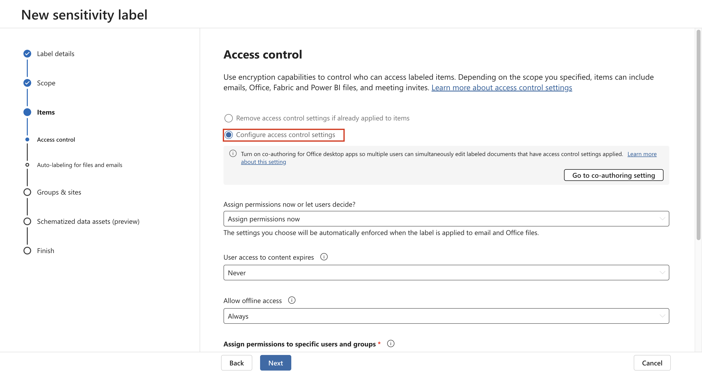
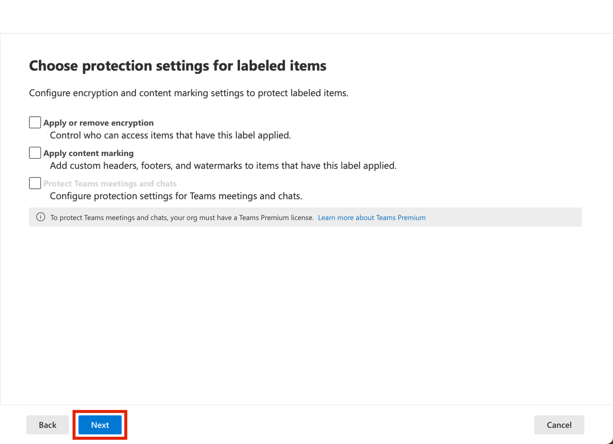

# 實驗 4 - 使用敏感度標簽

## **目的**:

在本實驗中，您將扮演 Contoso Ltd. 的系統管理員 Patti Fernandez
的角色。你的組織位于德國雷德尼茨亨巴赫，目前正在實施敏感度計劃，以確保人力資源部門的所有員工文檔都已標有敏感度標簽，作爲組織信息保護策略的一部分。

## 練習 1 - 啓用對敏感度標簽的支持

在此任務中，你將安裝 MSOnline 模塊和 SharePoint Online PowerShell
模塊，幷在租戶上啓用對敏感度標簽的支持。

1.  用鼠標右鍵選擇任務欄中的 Windows 符號，然後選擇 **Windows PowerShell
    （Admin）** 幷以管理員身份運行。

自動生成的計算機 Description 的屏幕截圖

2.  確認 **User Account Control** 窗口，然後單擊 **Yes**，然後按 Enter。

3.  輸入以下 cmdlet 以安裝最新的 Microsoft Online PowerShell 模塊版本:

`Install-Module -Name ``MSOnline`

自動生成的計算機 Description 的屏幕截圖

4.  確認 NuGet 安全對話框和“不受信任的存儲庫”安全對話框，幷使用 Y
    表示“是”，然後按 Enter。這可能需要一段時間才能完成處理。

5.  輸入以下 cmdlet 以安裝最新的 SharePoint Online PowerShell 模塊版本：

`Install-Module -Name ``Microsoft.Online.SharePoint.PowerShell`

自動生成的計算機 Description 的屏幕截圖

6.  在 Untrusted repository security 對話框中，使用 Y 表示“是”，然後按
    Enter。

自動生成的計算機屏幕描述的屏幕截圖

7.  輸入以下 cmdlet 以連接到 Microsoft Online 服務：

`Connect-``MsolService`

8.  在 **Sign in to your account （登錄您的賬戶**） 表單中，
    **使用用戶名**
    PattiF@{TENANTPREFIX}.onmicrosoft.com` ``和資源選項卡上提供的用戶密碼以`` `Patti
    Fernandez 身份登錄。

自動生成的計算機屏幕描述的屏幕截圖

9.  登錄後，轉到 **PowerShell window**。

10. 輸入以下 cmdlet 以獲取域：

`$domain = get-``msoldomain`

11. 輸入以下 cmdlet 以創建 SharePoint 管理員 URL：

`$``adminurl`` = "https://" + $``domain.Name.split``(``'.')[``0] + "-admin.sharepoint.com"`

自動生成的計算機屏幕描述的屏幕截圖

12. 輸入以下 cmdlet 以登錄到 SharePoint Online 管理中心：

`Connect-``SPOService`` -``url`` $``adminurl`

自動生成的計算機屏幕描述的屏幕截圖

13. 在 **Sign in to your account（登錄您的賬戶**）表單中，
    使用實驗室環境的 resources（資源）選項卡中提供的憑證以 **MOD
    Administrator**身份登錄。

&nbsp;

14. 登錄後，選擇 PowerShell 窗口。

15. 輸入以下 cmdlet 以啓用對敏感度標簽的支持：

`Set-``SPOTenant`` -``EnableAIPIntegration`` $true`

16. 使用 **Y** 確認更改， 對于 Yes ，然後按 Enter。

17. 關閉 **PowerShell** 窗口。

你已成功爲 Teams 和 SharePoint 網站啓用對敏感度標簽的支持。

## 練習 2 - 創建敏感度標簽

在此任務中，HR 部門已請求將敏感度標簽應用于 HR 員工文檔。你將爲 Internal
documents （內部文檔） 創建一個敏感度標簽，幷爲 HR 部門創建一個子標簽。

1.  在 **Microsoft Edge** 中，導航到 `https://purview.microsoft.com`
    幷使用用戶名 PattiF@{TENANTPREFIX}.onmicrosoft.com
    和資源選項卡上提供的用戶密碼以 `Patti Fernandez` 身份登錄。

2.  在 Microsoft Purview 門戶的左側導航窗格中，選擇 **Solutions \>
    Information Protection。**

3.  從子導航欄中，選擇 **Sensitivity Labels** \> **Create Labels**。

4.  New **sensitivity label** 嚮導將啓動。在 **Name**、**Description for
    admins** 和 **Description for users 的** Label details
    **頁面上**，輸入以下信息：

    - 名字: `Internal`

    - 顯示名稱: `Internal`

    - 用戶描述: `Internal sensitivity label`

    - 管理員描述: `Internal sensitivity label for Contoso.`

自動生成圖形用戶界面、文本、應用程序、電子郵件描述

5.  選擇 **Next**。

自動生成圖形用戶界面、文本、應用程序描述

6.  在 **Define the scope for this label**
    頁面上，選擇“保護電子郵件、文件和 Power BI **Items**
    的項目”選項。取消選中 **Meetings** 旁邊的框。

自動生成的計算機 Description 的屏幕截圖

7.  選擇 **Next**。

自動生成的計算機 Description 的屏幕截圖

8.  在 **Choose protection settings for labeled items** 頁上，選擇
    **Next** 。

自動生成的計算機 Description 的屏幕截圖

9.  在 **Auto-labeling** 文件和電子郵件” 頁面上，選擇 **Next**。

自動生成的計算機 Description 的屏幕截圖

10. 在 **Define protection settings for groups and sites** 頁面上，選擇
    **Next**。

自動生成的計算機 Description 的屏幕截圖

11. 在 **Auto-labeling for schematized data assets
    (preview)**頁面上，選擇**Next**。

自動生成圖形用戶界面、文本、應用程序描述

12. 在 **Review your settings and finish （查看您的設置幷完成** ）
    頁面上，選擇 **Create label**。

自動生成的計算機 Description 的屏幕截圖

13. 將創建標簽，完成後將顯示一條消息： **Your sensitivity label was
    created**

14.選擇 **Don't create a policy yet** ，然後選擇 **Done**。

自動生成的計算機屏幕描述的屏幕截圖

15. 在 **Information protection**頁上，突出顯示 （但不選擇） 新創建的
    **Internal** 標簽，然後選擇垂直 **...**。

16.選擇 **+ Add sub label** 從下拉菜單中。

自動生成的計算機 Description 的屏幕截圖

> 17.New **sensitivity label** 嚮導將啓動。在 **Label details**
> 頁面上，輸入以下信息：

- 名字: `Employee data (HR)`

- 顯示名稱: `Employee data (HR)`

- 用戶描述:
  `This HR label is the default label for all specified documents in the HR Department.`

- 管理員描述:
  `This label ``is`` created in consultation with ``Ms.Jones`` (Head of HR department). Contact ``her,`` when you want to change ``settings`` of the label.`

> 18.選擇 **Next**。

> 19.在 **Define the scope for this label** 頁面上，選擇選項 **Items**
> that protect email， files， and Meetings.選擇 **Next**。

> 20.在 **Choose protection settings for labeled items** 頁面上，選擇
> **Control Access** 選項。選擇 **Next**。

> 21.在 **Access Control** 頁面上，選擇 **Configure access control
> ettings**。

22. 在加密設置中輸入以下信息:

    - Assign permissions now or let users decide?: **Assign permissions
      now**

    - User access to content expires: **Never**

    - Allow offline access: **Only for a number of days**

    - Users have offline access to the content for this many days:
      **15**

自動生成的計算機 Description 的屏幕截圖

23. Select the **Assign permissions** link.

自動生成的計算機 Description 的屏幕截圖

24. 在 **Assign permissions** 窗格中，選擇 **+ Add any authenticated
    users**。

25. 選擇 **Save** 。

26. 在 **Encryption** 頁面上，選擇 **Next** 。

自動生成的計算機 Description 的屏幕截圖

27. 在 **Auto-labeling for files and emails** 頁面上，選擇 **Next**。

自動生成的計算機 Description 的屏幕截圖

28. 在 **Define protection settings for groups and sites** 頁面上，選擇
    **Next** 。

自動生成的計算機 Description 的屏幕截圖

29. 在 **Auto-labeling for schematized data assests
    （preview）**頁面上，選擇 **Next**。

自動生成的計算機 Description 的屏幕截圖

30. 在 **Review your settings and finish** 頁面上，選擇 **Create
    label**。

自動生成的計算機 Description 的屏幕截圖

31. 將創建標簽，完成後，將顯示一條消息 **Your sensitivity label was
    created**。

32. 選擇 **Don't create a policy yet**，然後選擇 **Done**。

自動生成的計算機屏幕描述的屏幕截圖

33. 保持選項卡打開以繼續執行下一個任務。

你已成功爲組織內部策略創建敏感度標簽，幷爲人力資源 （HR）
部門創建敏感度子標簽。

## 練習 3 - 發布敏感度標簽

現在，你將發布 “內部 ”和 “HR 敏感度” 標簽，以便已發布的敏感度標簽可供 HR
用戶應用于其 HR 文檔。

1.  在 **Microsoft Edge** 中，導航到 `https://purview.microsoft.com`
    幷使用用戶名 PattiF@{TENANTPREFIX}.onmicrosoft.com
    和資源選項卡上提供的用戶密碼以 `Patti Fernandez` 身份登錄。

2.  在 Microsoft Purview 門戶的左側導航窗格中，**選擇 Solutions \>
    Information Protection。**

3.  從子導航欄中，選擇 **Sensitivity Labels** \> **Publish Labels**。

4.  發布敏感度標簽嚮導將啓動。

5.  在 **Choose sensitivity labels to publish**頁上，選擇 **Choose
    sensitivity labels to publish**鏈接。

自動生成的計算機 Description 的屏幕截圖

6.  右側將顯示一個名爲 **Sensitivity labels to publish** **的**側邊欄。

7.  選中 **Internal** 和 **Internal/Employee Data （HR）** 複選框。

自動生成的計算機 Description 的屏幕截圖

8.  選擇 **Add**。

自動生成的計算機 Description 的屏幕截圖

9.  在 **Choose sensitivity labels to publish**頁上，選擇Next。

自動生成的計算機 Description 的屏幕截圖

10. 在 **Publish to users and groups**，選擇**Next**。

自動生成的計算機 Description 的屏幕截圖

11. 在 **Policy settings** 頁面上，選擇 **Next**。

12. 在 **Apply a default label to documents** 頁面上，選擇**Next**。

自動生成的計算機 Description 的屏幕截圖

13. 在 **Apply a default label to emails** 頁面上，選擇 **Next**。

14. 在 Default **settings for meetings and calendar events**上，選擇
    **Next**。

15. 在 **Default settings for Fabric and Power BI
    content**頁面上，選擇**Next**。

16. 在 **Name your policy** 頁面上，輸入以下信息:

    - 名字: `Internal HR employee data`

    - 輸入敏感度標簽策略的說明:
      `This HR label is to be applied to internal HR employee data.`

自動生成圖形用戶界面、文本、應用程序、電子郵件描述

17. 選擇 **Next**。

自動生成圖形用戶界面、文本、應用程序描述

18. 在 **Review and finish** 頁面上，選擇 **Submit** 。

自動生成圖形用戶界面、文本、應用程序描述

19. 將創建策略，完成後，將顯示 **New policy created**。

20. 選擇 **Done and proceed to next task without closing the window**。

自動生成的計算機 Description 的屏幕截圖

您已成功發布 Internal （內部） 和 HR sensitivity （人力資源敏感度）
標簽。請注意，更改最多可能需要 24 小時才能複製到所有用戶和服務。

## 練習 4 - 使用敏感度標簽

在此任務中，您將在 Word 和 Outlook
電子郵件中創建敏感度標簽。創建的文檔將存儲在 OneDrive
中，幷通過電子郵件發送給 HR 員工。

1.  導航到 `https://portal.office.com ``幷以`` `**Patti Fernandez**
    身份登錄。

2.  如果**顯示 Get your work with Office 365** 消息，請將其關閉。

圖形用戶界面 自動生成描述

3.  從左側窗格中選擇 **Microsoft Word** 符號以打開 Word Online。

圖形用戶界面，自動生成網站描述

4.  選擇 **New blank document** 以創建新文檔。

圖形用戶界面，自動生成網站描述

5.  如果顯示 **Your privacy options** 消息，請選擇 Close **將其關閉**。

6.  在 word 文檔中輸入以下內容：

`Important HR employee document.`

自動生成圖形用戶界面、應用程序、Word 描述

7.  選擇 **Sensitivity** 從頂部窗格中打開下拉菜單。

自動生成圖形用戶界面、應用程序、Word 描述

8.  選擇 **Internal** \> **Employee data （HR）** 以應用標簽。

**注意**：請注意，在本練習的任務 1 中運行的脚本在 Word
中爲租戶激活了敏感度標簽。有時可能需要一個小時才能在 Microsoft Word
Online 中實現該激活。如果在 Word 中看不到 Sensitivity
label（敏感度標簽）菜單，則可能需要稍後返回此實驗室，或確保正確完成本練習的任務
1。

9.  選擇 Document – Saved 在窗口的左上角，輸入HR Document 作爲 文件名
    然後按 Enter 鍵。

自動生成圖形用戶界面、應用程序、Word 描述

10. 關閉單詞選項卡以返回到 **Office 365** 選項卡。從左側窗格中選擇
    **Outlook** 符號以打開 **Outlook** 網頁版。

自動生成圖形用戶界面、文本、應用程序描述

11. 如果顯示歡迎消息，請選擇 **X** 將其關閉。

12. 在 Outlook 網頁版中，選擇 窗口左上角的 **New message**。

自動生成的計算機 Description 的屏幕截圖

13. 在 **To** 字段中輸入名稱： **Adele** 幷選擇 **Adele Vance**
    從下拉列表中。

14. 在主題字段中，輸入：`Employee data for HR``。`

15. 在電子郵件消息（頁面底部的大內容面板）中，插入以下消息:

&nbsp;

    DearMs. Adele,
    Please find attached the important HR employee document.
    Kind regards,
    Patti Fernandez

自動生成的計算機 Description 的屏幕截圖

16. 從 底部菜單中選擇 **paperclip symbol**。

17. 選擇 **Document.docx Suggested attachments** 下方的 HR 以附加文檔。

18. 選擇 **Send**以發送帶有附加文檔的電子郵件。

19. 使瀏覽器窗口保持打開狀態。

你已成功創建帶有敏感度標簽的 HR Word 文檔，該文檔已保存到 OneDrive
上。然後，你通過電子郵件將 Document
發送給一名工作人員，其中電子郵件也設置了敏感度標簽。

請注意，在試用帳戶中，您將能够發送郵件，但郵件會退回，幷且無法從當前租戶聯繫到收件人。

## 練習 5 – 配置自動標簽

在此任務中，您將創建一個**Sensitivity
Label**敏感度標簽，該標簽將自動標記發現包含與**European General Data
Protection Regulation (GPDR)** 相關的信息的文檔和電子郵件。

1.  在 **Microsoft Edge** 中，Microsoft Purview
    門戶選項卡應仍處于打開狀態。

2.  您應該以 **Patti Fernandez 的身份登錄門戶**。

3.  在Information protection,
    **下**，選擇Label,，突出顯示（不選擇）現有的 **Internal**
    標簽，然後選擇三個點。選擇 **+ Create sublabel** 菜單項。

自動生成的計算機 Description 的屏幕截圖

4.  New **sensitivity label** 嚮導將啓動。在 **label details**
    頁面上，輸入以下信息:

    - 名字: `GDPR Germany`

    - 顯示名稱: `GDPR Germany`

    - 用戶描述:
      `This document or email contains data related to the European General Data Protection ``Regulation(``GPDR) for the region Germany.`

    - 管理員描述: `This label is auto applied to German GDPR documents.`

5.  選擇 **Next**。

6.  在 **Define the scope for this label** 頁面上，選擇選項 **Items**
    that protect Files， Emails， and Meetings items.然後選擇 **Next**。

7.  在 **Choose protection settings for labeled items**頁上，選擇
    **Next**。

8.  在 **Auto-labeling for files and emails** 頁面上，將 **Auto-labeling
    for files and emails** 設置爲 enabled。

自動生成圖形用戶界面、文本、應用程序描述

4.  在 **Detect content that matches these conditions**
    部分中，選擇**+Add condition**，然後選擇 **Content contains**。

9.  在 **Content contains** 部分中，選擇 **Add text** ，然後選擇
    **Sensitive info types。**

自動生成的計算機 Description 的屏幕截圖

11. 右側**將顯示 Sensitive info types** 面板。

12. 在 **Search for sensitive info types** 搜索面板中，輸入以下信息:

`German`

13. 按鍵盤上的 Enter 鍵，結果將顯示與德國相關的敏感度信息類型。按
    **Select all** 複選框。

14. 選擇 **Add**。

15. 選擇 **Next**。

自動生成的計算機 Description 的屏幕截圖

16. 在 **Define protection settings for groups and sites** 頁面上，選擇
    **Next** 。

自動生成的計算機 Description 的屏幕截圖

17. 在 **Auto-labeling for schematized data assets
    (preview)**頁面上，選擇 **下一步**。

18. 如果重定向到 **Default settings for Fabric and Power BI content
    page**頁面，請選擇 **Next**。

19. 在 **Review your settings and finish** 頁面上，選擇 **Create label**
    。

> 20\. 將創建標簽，完成後將顯示一條消息： **Your sensitivity label was
> created**。在 “後續步驟” 下，選擇 **Don’t create a policy
> yet。**然後選擇 **Done**。

自動生成圖形用戶界面、文本、應用程序、Word 描述

21. 從子導航欄中，選擇 **Sensitivity Labels** \> **Publish Labels**。

22. Publish **Publish sensitivity labels wizard** 將啓動。

自動生成圖形用戶界面、文本、應用程序、Word 描述

23. 在 Choose sensitivity labels to publish 頁上，選擇 **Choose
    sensitivity labels to publish**鏈接。

自動生成的計算機 Description 的屏幕截圖

24. 右側將顯示一個名爲 **Sensitivity labels to publish** **的**側邊欄。

自動生成圖形用戶界面、應用程序、Word 描述

25. 選中 **Internal** and **Internal/GDPR Germany** 複選框，然後選擇
    **Add**。

自動生成圖形用戶界面、應用程序、Word 描述

26. 在 **Choose sensitivity labels to publish** 頁上，選擇 **Next**。

自動生成圖形用戶界面、文本、應用程序、Word 描述

27. 在 **Publish to users and groups**頁面上，選擇 **Next**。

自動生成圖形用戶界面、文本、應用程序描述

28. 在 **Policy settings** 頁面上，選擇 **Next** 。

自動生成圖形用戶界面、文本、應用程序、Word 描述

29. 在 **Apply a default label to documents**頁面上，選擇 **Next**。

自動生成圖形用戶界面、文本、應用程序描述

30. 在 **Apply a default label to emails** 頁面上，選擇 **Next**。

31. 在 Default **settings for meetings and calendar events**上，選擇
    **Next**。

32. 在 **Default settings for Fabric and Power BI content** 頁面上，選擇
    **Next**。

33. 在 **Name your policy** 頁面上，輸入以下信息:

    - 名字: `GDPR Germany policy`

    - 輸入敏感度標簽策略的說明：
      `This auto apply sensitivity labels policy is for the GDPR region of Germany.`

34. 選擇 **Next**。

自動生成圖形用戶界面、文本、應用程序描述

35. 在 **Review and finish** 頁面上，選擇 **Submit**。

圖形用戶界面，自動生成應用程序描述

36. 將創建策略，完成後將顯示一條消息， **New policy created**。

37. 選擇 **Done**。

自動生成圖形用戶界面、文本、應用程序、Word 描述

## 總結:

你已成功在德國區域爲 GDPR 文檔創建幷發布了自動應用敏感度標簽。

請注意，應用自動應用的敏感度標簽最多可能需要 24 小時，當應用于超過
25,000 個文檔時，此持續時間會更長（即每日限制）。
