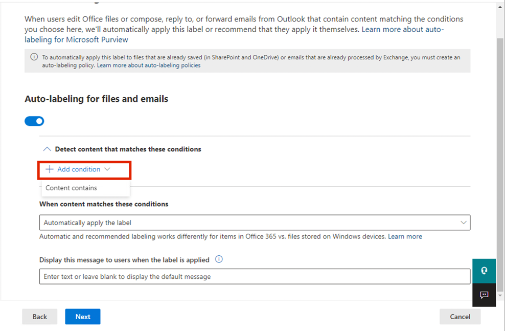

Atelier 4 – Travailler avec les étiquettes de sensibilité

Objectif :

Dans cet atelier, vous allez jouer le rôle de Patti Fernandez,
administratrice système pour Contoso Ltd. Votre organisation est basée à
Rednitzhembach, en Allemagne, et met actuellement en œuvre un plan de
sensibilité pour s'assurer que tous les documents des employés du
service des ressources humaines ont été marqués d'une étiquette de
confidentialité dans le cadre des politiques de protection des
informations de votre organisation.

Exercice 1 – Activation de la prise en charge des étiquettes de
confidentialité

Dans cette tâche, vous allez installer le module MSOnline et le module
PowerShell SharePoint Online et activer la prise en charge des
étiquettes de confidentialité sur votre locataire.

1.  Sélectionnez le symbole Windows dans la barre des tâches avec le
    bouton droit de la souris, sélectionnez **Windows PowerShell
    (Admin)** et exécutez-le en tant qu'administrateur.

*Une capture d'écran d'un ordinateur Description générée
automatiquement*

2.  Confirmez la fenêtre **User Account Control** avec **Yes** et
    appuyez sur Entrée.

3.  Entrez l'applet de commande suivante pour installer la dernière
    version du module Microsoft Online PowerShell :

Install-Module -Nom MSOnline

*Une capture d'écran d'un ordinateur Description générée
automatiquement*

4.  Confirmez la boîte de dialogue de sécurité NuGet et la boîte de
    dialogue de sécurité du référentiel non approuvé avec Y pour Oui,
    puis appuyez sur Entrée. Le traitement peut prendre un certain
    temps.

5.  Entrez l'applet de commande suivante pour installer la dernière
    version du module PowerShell SharePoint Online :

Install-Module -Name Microsoft.Online.SharePoint.PowerShell

*Une capture d'écran d'un ordinateur Description générée
automatiquement*

6.  Confirmez la boîte de dialogue Sécurité du référentiel non approuvé
    avec **Y** pour Oui et appuyez sur Entrée.

*Une capture d'écran d'un écran d'ordinateur Description générée
automatiquement*

7.  Entrez l'applet de commande suivante pour vous connecter au service
    Microsoft Online :

Connect-MsolService

8.  Dans le formulaire **Sign in to your account**, connectez-vous en
    tant que **Patti Fernandez** en utilisant le nom d'utilisateur
    PattiF@{TENANTPREFIX}.onmicrosoft.com et le mot de passe utilisateur
    indiqué dans votre onglet ressources.

*Une capture d'écran d'un écran d'ordinateur Description générée
automatiquement*

9.  Une fois connecté, accédez à la **PowerShell window**.

10. Entrez l'applet de commande suivante pour obtenir le domaine :

$domain = get-msoldomain

11. Entrez l'applet de commande suivante pour créer l'URL
    d'administration SharePoint :

$adminurl = "https://" + $domain.Name.split('.')\[0\] +
"-admin.sharepoint.com"

*Une capture d'écran d'un écran d'ordinateur Description générée
automatiquement*

12. Entrez l'applet de commande suivante pour vous connecter au centre
    d'administration SharePoint Online :

Connect-SPOService -url $adminurl

*Une capture d'écran d'un écran d'ordinateur Description générée
automatiquement*

13. Dans le formulaire **Sign in to your account**, connectez-vous en
    tant que **MOD Administrator** à l'aide des informations
    d'identification fournies dans l'onglet Ressources de votre
    environnement de laboratoire.

14. Après vous être connecté, sélectionnez la fenêtre PowerShell.

15. Entrez l'applet de commande suivante pour activer la prise en charge
    des étiquettes de confidentialité :

Set-SPOTenant -EnableAIPIntegration $true

16. Confirmez les modifications avec **Y** pour Oui et appuyez sur
    Entrée.

17. Fermez la fenêtre **PowerShell**.

Vous avez activé la prise en charge des étiquettes de confidentialité
avec les sites Teams et SharePoint.

Exercice 2 – Création d'étiquettes de sensibilité

Dans cette tâche, votre service RH a demandé une étiquette de
confidentialité à appliquer sur les documents des employés RH. Vous
créerez une étiquette de sensibilité pour les documents internes et une
sous-étiquette pour le service des ressources humaines.

1.  Dans **Microsoft Edge**, accédez à https://purview.microsoft.com et
    connectez-vous en tant que **Patti Fernandez** à l'aide du nom
    d'utilisateur PattiF@{TENANTPREFIX}.onmicrosoft.com et du mot de
    passe utilisateur indiqué dans votre onglet ressources.

2.  Dans le portail Microsoft Purview, dans le volet de navigation de
    gauche, sélectionnez **Solutions** \> **Protection des
    informations**.

3.  Dans la sous-navigation, sélectionnez **Sensitivity Labels** \>
    **Create Labels**.

4.  L' assistant **Nouvelle étiquette de confidentialité** démarre. Sur
    la page **Détails** de l'étiquette pour **Name, Description for
    admins** et **Description for users**, entrez les informations
    suivantes :

    - Nom : Interne

    - Nom d'affichage : Interne

    - Description pour les utilisateurs : Étiquette de sensibilité
      interne

    - Description pour les administrateurs : Étiquette de
      confidentialité interne pour Contoso.

*Interface utilisateur graphique, texte, application, e-mail Description
générée automatiquement*

5.  Sélectionnez **Next**.

*Interface utilisateur graphique, texte, application Description générée
automatiquement*

6.  Dans la page **Define the scope for this label**, sélectionnez
    l'option **Items** qui protègent les e-mails, les fichiers et les
    éléments Power BI. Décochez la case à côté de **Meetings**.

*Une capture d'écran d'un ordinateur Description générée
automatiquement*

7.  Sélectionnez **Next**.

*Une capture d'écran d'un ordinateur Description générée
automatiquement*

8.  Sur la page **Choose protection settings for labeled items**,
    sélectionnez **Next**.

*Une capture d'écran d'un ordinateur Description générée
automatiquement*

9.  Sur la page **Auto-labeling** des fichiers et des e-mails,
    sélectionnez **Next**.

*Une capture d'écran d'un ordinateur Description générée
automatiquement*

10. Sur la page **Define protection settings for groups and sites**,
    sélectionnez **Next**.

*Une capture d'écran d'un ordinateur Description générée
automatiquement*

11. Sur la page **Auto-labeling for schematized data assets (preview),**
    sélectionnez **Next**.

*Interface utilisateur graphique, texte, application Description générée
automatiquement*

12. Sur la page **Review your settings and finish**, sélectionnez
    **Create label**.

*Une capture d'écran d'un ordinateur Description générée
automatiquement*

13. L'étiquette sera créée et, une fois l'opération terminée, un message
    s'affichera : **Your sensitivity label was created**

14. Sélectionnez **Don’t create a policy yet**, puis sélectionnez
    **Done**.

*Une capture d'écran d'un écran d'ordinateur Description générée
automatiquement*

15. Sur la page **Information protection**, mettez en surbrillance (sans
    sélectionner) l'étiquette interne nouvellement créée et sélectionnez
    l'étiquette verticale **...**.

16. Sélectionnez **+ Add sub label** dans le menu déroulant.

*Une capture d'écran d'un ordinateur Description générée
automatiquement*

17. L’assistant **New sensitivity label** démarre. Sur la page Détails
    de **Label details**, entrez les informations suivantes :

    - Nom : Données des employés (RH)

    - Nom d'affichage : Données de l'employé (HR)

    - Description pour les utilisateurs : Cette étiquette RH est
      l'étiquette par défaut pour tous les documents spécifiés dans le
      service RH.

    - Description pour les admins : Ce label a été créé en concertation
      avec Mme Jones (responsable du département des ressources
      humaines). Contactez-la lorsque vous souhaitez modifier les
      paramètres de l'étiquette.

18. Sélectionnez **Next**.

19. Sur la page **Define the scope for this label**, sélectionnez
    l'option **Éléments** qui protègent les e-mails, les fichiers et les
    réunions. Sélectionnez **Next**.

20. Sur la page **Choose protection settings for labeled items**,
    sélectionnez l'option **Control Access**. Sélectionnez **Next**.

21. Sur la page **Contrôle d'accès**, sélectionnez **Configure access
    control settings**.

22. Entrez les informations suivantes dans les paramètres de chiffrement
    :

    - Attribuez des autorisations maintenant ou laissez les utilisateurs
      décider ? **Assign permissions now**

    - L'accès de l'utilisateur au contenu expire : **Never**

    - Autoriser l'accès hors ligne : **Only for a number of days**

    - Les utilisateurs ont un accès hors ligne au contenu pendant ce
      nombre de jours : **15**

*Une capture d'écran d'un ordinateur Description générée
automatiquement*

23. Sélectionnez le lien **Assign permissions**.

*Une capture d'écran d'un ordinateur Description générée
automatiquement*

24. Dans le volet **Assign permissions**, sélectionnez le **bouton + Add
    any authenticated users**.

25. Sélectionnez **Save**.

26. Sur la page **Encryption**, sélectionnez **Next**.

*Une capture d'écran d'un ordinateur Description générée
automatiquement*

27. Sur la page **Auto-labeling for files and emails**, sélectionnez
    **Next**.

*Une capture d'écran d'un ordinateur Description générée
automatiquement*

28. Sur la page **Define protection settings for groups and sites**,
    sélectionnez **Next**.

*Une capture d'écran d'un ordinateur Description générée
automatiquement*

29. Sur la page **Auto-labeling for schematized data assests
    (preview),** sélectionnez **Next**.

*Une capture d'écran d'un ordinateur Description générée
automatiquement*

30. Sur la page **Review your settings and finish**, sélectionnez
    **Create label**.

*Une capture d'écran d'un ordinateur Description générée
automatiquement*

31. L'étiquette sera créée et, une fois l'opération terminée, un message
    s'affichera **Your sensitivity label was created**.

32. Sélectionnez **Don’t create a policy yet**, puis sélectionnez
    **Done**.

*Une capture d'écran d'un écran d'ordinateur Description générée
automatiquement*

33. Laissez l'onglet ouvert pour passer à la tâche suivante.

Vous avez créé une étiquette de confidentialité pour les politiques
internes de votre organisation et une sous-étiquette de confidentialité
pour le service des ressources humaines (RH).

Exercice 3 – Publication d'étiquettes de sensibilité

Vous allez maintenant publier l'étiquette de sensibilité interne et RH
afin que les utilisateurs RH puissent les appliquer à leurs documents
RH.

1.  Dans **Microsoft Edge**, accédez à https://purview.microsoft.com et
    connectez-vous en tant que **Patti Fernandez** à l'aide du nom
    d'utilisateur PattiF@{TENANTPREFIX}.onmicrosoft.com et du mot de
    passe utilisateur indiqué dans votre onglet ressources.

2.  Dans le portail Microsoft Purview, dans le volet de navigation de
    gauche, sélectionnez **Solutions** \> **Information Protection**.

3.  Dans la sous-navigation, sélectionnez **Sensitivity Labels** \>
    **Publish Labels**.

4.  L'assistant de publication des étiquettes de confidentialité
    démarre.

5.  Sur la page **Choose sensitivity labels to publish**, sélectionnez
    le lien **Choose sensitivity labels to publish**.

*Une capture d'écran d'un ordinateur Description générée
automatiquement*

6.  Une barre latérale intitulée **Sensitivity labels to publish**
    apparaîtra sur la droite.

7.  Cochez les cases **Internal** et **Internal/Employee Data (HR)**.

*Une capture d'écran d'un ordinateur Description générée
automatiquement*

8.  Sélectionnez **Ajouter**.

*Une capture d'écran d'un ordinateur Description générée
automatiquement*

9.  Sur la page **Choose sensitivity labels to publish**, sélectionnez
    **Next**.

*Une capture d'écran d'un ordinateur Description générée
automatiquement*

10. Sur la page **Publish to users and groups page**, sélectionnez
    **Next**.

*Une capture d'écran d'un ordinateur Description générée
automatiquement*

11. Sur la page **Policy settings**, sélectionnez **Next**.

12. Sur la page **Apply a default label to documents**, sélectionnez
    **Next**.

*Une capture d'écran d'un ordinateur Description générée
automatiquement*

13. Sur la page **Apply a default label to emails**, sélectionnez
    **Next**.

14. Dans les **Default settings for meetings and calendar events**,
    sélectionnez **Next**.

15. Dans la page **Default settings for Fabric and Power BI**,
    sélectionnez **Next**.

16. Sur la page **Name your policy**, entrez les informations suivantes
    :

    - Nom : Données internes des employés des RH

    - Entrez une description pour votre politique d'étiquette de
      confidentialité : Cette étiquette RH doit être appliquée aux
      données internes des employés RH.

*Interface utilisateur graphique, texte, application, e-mail Description
générée automatiquement*

17. Sélectionnez **Next**.

*Interface utilisateur graphique, texte, application Description générée
automatiquement*

18. Sur la page **Review and finish**, sélectionnez **Submit**.

*Interface utilisateur graphique, texte, application Description générée
automatiquement*

19. La politique sera créée et, une fois terminée, un message affichera
    **New policy created**.

20. Sélectionnez **Done and proceed to next task without closing the
    window**.

*Une capture d'écran d'un ordinateur Description générée
automatiquement*

Vous avez publié avec succès les labels de sensibilité interne et RH.
Notez que la réplication des modifications sur tous les utilisateurs et
services peut prendre jusqu'à 24 heures.

Exercice 4 – Travailler avec des étiquettes de sensibilité

Dans cette tâche, vous allez créer des étiquettes de confidentialité
dans les e-mails Word et Outlook. Le document créé sera stocké dans
OneDrive et envoyé à un employé des RH par e-mail.

1.  Accédez à https://portal.office.com et connectez-vous en tant que
    **Patti Fernandez**.

2.  Si un message **Get your work done with Office 365** s'affiche,
    fermez-le.

*Interface utilisateur graphique Description générée automatiquement*

3.  Sélectionnez **New blank document** dans le volet latéral gauche
    pour ouvrir Word Online.

*Interface utilisateur graphique, description du site web générée
automatiquement*

4.  Sélectionnez **Nouveau document vierge** pour créer un nouveau
    document.

*Interface utilisateur graphique, description du site web générée
automatiquement*

5.  Si un message **Your privacy options** s'affiche, fermez-le en
    sélectionnant **Close**.

6.  Entrez le contenu suivant dans le document Word :

Document important pour les employés des RH.

*Interface utilisateur graphique, application, Word Description générée
automatiquement*

7.  Sélectionnez **Sensitivity** dans le volet supérieur pour ouvrir le
    menu déroulant.

*Interface utilisateur graphique, application, Word Description générée
automatiquement*

8.  Sélectionnez **Internal \> Employee data (HR)** pour appliquer
    l'étiquette.

**Remarque** : Sachez que le script que vous avez exécuté dans la tâche
1 de cet exercice a activé les étiquettes de confidentialité dans Word
pour votre client. Il peut parfois s'écouler une heure avant que cette
activation ne soit réalisée dans Microsoft Word en ligne. Si vous ne
voyez pas le menu Étiquette de sensibilité dans Word, vous devrez
peut-être revenir à cet atelier plus tard ou vous assurer que vous avez
correctement terminé la tâche 1 de cet exercice.

9.  Sélectionnez le **Document – Saved** dans le coin supérieur gauche
    de la fenêtre, entrez **HR Document** comme nom de fichier et
    appuyez sur la touche **Enter**.

*Interface utilisateur graphique, application, Word Description générée
automatiquement*

10. Fermez l'onglet Word pour revenir à l'onglet **Office 365**.
    Sélectionnez le symbole **Outlook** dans le volet latéral gauche
    pour ouvrir **Outlook** sur le web.

*Interface utilisateur graphique, texte, application Description générée
automatiquement*

11. Si un message de bienvenue s'affiche, fermez-le en sélectionnant le
    **X**.

12. Dans Outlook sur le web, sélectionnez **New message** dans le coin
    supérieur gauche de la fenêtre.

*Une capture d'écran d'un ordinateur Description générée
automatiquement*

13. Dans le champ **To**, entrez le nom : **Adele** et sélectionnez
    **Adele Vance** dans la liste déroulante.

14. Dans le champ Objet, saisissez : Données de l'employé pour les RH.

15. Dans le message électronique (le grand panneau de contenu en bas de
    la page), insérez le message suivant :

&nbsp;

    DearMs. Adele,
    Please find attached the important HR employee document.
    Kind regards,
    Patti Fernandez

*Une capture d'écran d'un ordinateur Description générée
automatiquement*

16. Sélectionnez le **paperclip symbol** dans le menu inférieur.

17. Sélectionnez le **HR Document.docx** ci-dessous **Suggested
    attachments** pour joindre le document.

18. Sélectionnez **Send** pour envoyer le message électronique avec le
    document joint.

19. Laissez la fenêtre du navigateur ouverte.

Vous avez réussi à créer un document Word RH avec une étiquette de
confidentialité, qui a été enregistré sur votre OneDrive. Vous avez
ensuite envoyé un e-mail pour documenter à un membre du personnel où
l'e-mail était également défini avec une étiquette de confidentialité.

Dans le compte d'essai, notez que vous pourrez envoyer le courrier, mais
qu'il rebondira et ne pourra pas atteindre le destinataire à partir de
votre locataire actuel.

Exercice 5 – Configuration de l'étiquetage automatique

Dans cette tâche, vous allez créer une **Sensitivity Label** qui
étiquetera automatiquement les documents et les e-mails contenant des
informations relatives au **European General Data Protection Regulation
(GPDR).**

1.  Dans **Microsoft Edge**, l'onglet du portail Microsoft Purview doit
    toujours être ouvert.

2.  Vous devriez être connecté au portail en tant que **Patti
    Fernandez**.

3.  Sous **Information protection**, sélectionnez **Label**, mettez en
    surbrillance (sans sélectionner) l'étiquette **Internal** existante,
    puis sélectionnez les trois points. Sélectionnez l'élément de menu
    **+ Create sublabel**.

*Une capture d'écran d'un ordinateur Description générée
automatiquement*

4.  L’assistant **New sensitivity label** démarre. Sur la page des
    **label details**, entrez les informations suivantes :

    - Nom : RGPD Allemagne

    - Nom d'affichage : GDPR Germany

    - Description pour les utilisateurs : Ce document ou cet e-mail
      contient des données relatives au Règlement général européen sur
      la protection des données (RGPD) pour la région Allemagne.

    - Description pour les administrateurs : Cette étiquette est
      appliquée automatiquement aux documents allemands GDPR.

5.  Sélectionnez **Next**.

6.  Sur la page **Define the scope for this label**, sélectionnez
    l'option **Items** qui protège les éléments Fichiers, E-mails et
    Réunions. Sélectionnez ensuite **Next**.

7.  Sur la page **Choose protection settings for labeled items**,
    sélectionnez **Next**.

8.  Sur la page **Auto-labeling for files and emails**, définissez
    **Auto-labeling for files and emails** sur activé.

*Interface utilisateur graphique, texte, application Description générée
automatiquement*

9.  Dans la section **Detect content that matches these conditions**,
    sélectionnez **+Add condition**, puis sélectionnez **Content
    contains**.

10. Dans **Content contains**, sélectionnez **Add** du texte, puis
    sélectionnez **Sensitive info types**.

*Une capture d'écran d'un ordinateur Description générée
automatiquement*

11. Un panneau **Sensitive info types** s'affiche sur la droite.

12. Dans le panneau **Sensitive info types**, entrez les informations
    suivantes :

Allemand

13. Appuyez sur la touche Entrée de votre clavier, les résultats
    afficheront les types d'informations de sensibilité liés à
    l'Allemagne. Appuyez sur la case à cocher **Select all**.

14. Sélectionnez **Add**.

15. Sélectionnez **Next**.

*Une capture d'écran d'un ordinateur Description générée
automatiquement*

16. Sur la page **Define protection settings for groups and sites**,
    sélectionnez **Next**.

*Une capture d'écran d'un ordinateur Description générée
automatiquement*

17. Sur la page **Auto-labeling for schematized data assets (preview),**
    sélectionnez **Next**.

18. Si vous êtes redirigé vers la page **Default settings for Fabric and
    Power BI content page**, sélectionnez **Next**.

19. Sur la page **Review your settings and finish**, sélectionnez
    **Create label**.

20. L'étiquette sera créée et, une fois terminée, un message s'affichera
    : **Your sensitivity label was created**. Sous Étapes suivantes,
    sélectionnez **Don’t create a policy yet**. Sélectionnez ensuite
    **Done**.

*Interface utilisateur graphique, texte, application, description de mot
générée automatiquement*

21. Dans la sous-navigation, sélectionnez **Sensitivity Labels \>
    Publish Labels**.

22. **Publish sensitivity labels wizard** démarre.

*Interface utilisateur graphique, texte, application, description de mot
générée automatiquement*

23. Sur la page **Choose sensitivity labels to publish**, sélectionnez
    le lien **Choose sensitivity labels to publish**.

*Une capture d'écran d'un ordinateur Description générée
automatiquement*

24. Une barre latérale intitulée **Sensitivity labels to publish**
    apparaîtra sur la droite.

*Interface utilisateur graphique, application, Word Description générée
automatiquement*

25. Cochez les **Internal** et **Internal/GDPR Germany,** puis
    sélectionnez **Add**.

*Interface utilisateur graphique, application, Word Description générée
automatiquement*

26. Sur la page **Choose sensitivity labels to publish**, sélectionnez
    **Next**.

*Interface utilisateur graphique, texte, application, description de mot
générée automatiquement*

27. Sur la page **Publish to users and groups**, sélectionnez **Next**.

*Interface utilisateur graphique, texte, application Description générée
automatiquement*

28. Sur la page **Policy settings**, sélectionnez **Next**.

*Interface utilisateur graphique, texte, application, description de mot
générée automatiquement*

29. Sur la page **Apply a default label to documents**, sélectionnez
    **Next**.

*Interface utilisateur graphique, texte, application Description générée
automatiquement*

30. Sur la page **Apply a default label to emails**, sélectionnez
    **Next**.

31. Dans **Default settings for meetings and calendar events**,
    sélectionnez **Next**.

32. Dans **Default settings for Fabric and Power BI content page**,
    sélectionnez **Next**.

33. Sur la page **Name your policy**, entrez les informations suivantes
    :

    - Nom : Politique RGPD Allemagne

    - Entrez une description pour votre politique d'étiquetage de
      confidentialité : Cette politique d'application automatique des
      étiquettes de confidentialité s'applique à la région RGPD de
      l'Allemagne.

34. Sélectionnez **Next**.

*Interface utilisateur graphique, texte, application Description générée
automatiquement*

35. Sur la page **Review and finish**, sélectionnez **Submit**.

*Interface utilisateur graphique, application Description générée
automatiquement*

36. La stratégie sera créée et, une fois terminée, un message
    s'affichera : **New policy created**.

37. Sélectionnez **Done.**

*Interface utilisateur graphique, texte, application, description de mot
générée automatiquement*

Résumé:

Vous avez créé et publié avec succès une étiquette de sensibilité à
application automatique pour les documents RGPD dans la région
Allemagne.

Sachez que l'application automatique des étiquettes de sensibilité peut
prendre jusqu'à 24 heures, cette durée sera plus longue lorsqu'elle sera
appliquée à plus de 25 000 documents (c'est-à-dire la limite
quotidienne).
