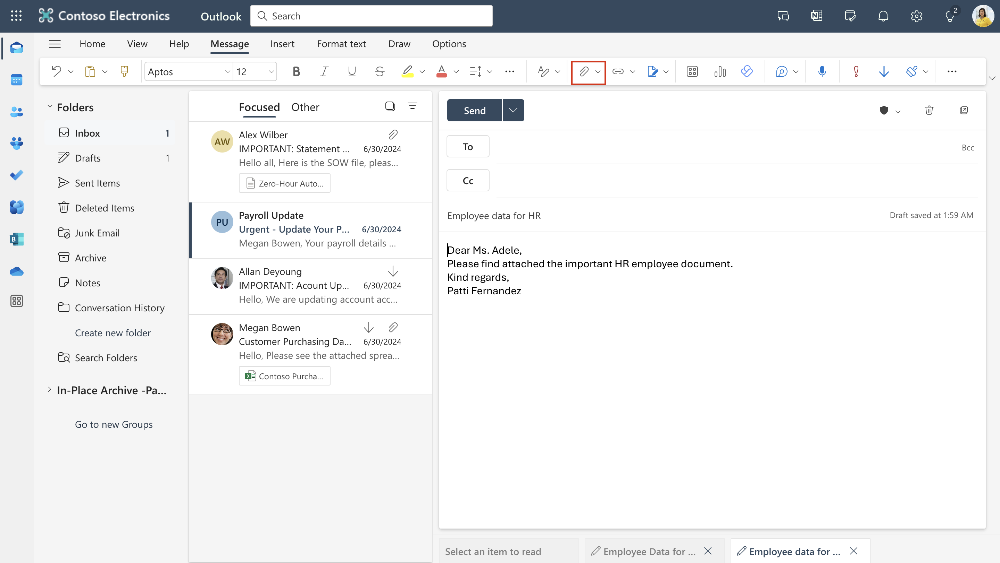

# Laboratório 4 – Trabalhando com rótulos de confidencialidade

## Objetivo:

Neste laboratório, você assumirá a função Patti Fernandez, um
administrador de sistemas da Contoso Ltd. Sua organização está sediada
em Rednitzhembach, Alemanha, e atualmente está implementando um plano de
sensibilidade para garantir que todos os documentos dos funcionários do
departamento de RH sejam marcados com um rótulo de sensibilidade como
parte das políticas de proteção de informações da sua organização.

## Exercíco 1 – Habilitando o suporte para rótulo de confidencialidade

Nesta tarefa, você instalará o módulo MSOnline e o módulo do SharePoint
Online PowerShell e habilitará o suporte para rótulos de sensibilidade
em seu locatário.

1.  Selecione o símbolo do Windows na barra de tarefas com o botão
    direito do mouse e selecione **Windows PowerShell (Admin)** e run as
    administrator.

Uma captura de tela de uma descrição de computador gerada
automaticamente

2.  Confirme a janela **User Account Control** com **Yes** e pressione
    Enter.

3.  Digite o seguinte cmdlet para instalar a versão mais recente do
    módulo do Microsoft Online PowerShell:

`Install-Module -Name ``MSOnline`

Uma captura de tela de uma descrição de computador gerada
automaticamente

4.  Confirme a caixa de diálogo de segurança do NuGet e a caixa de
    diálogo de segurança do repositório não confiável com **Y** para Sim
    e pressione Enter. O processamento pode demorar um pouco para ser
    concluído.

Imagem interrompida

5.  Digite o seguinte cmdlet para instalar a versão mais recente do
    módulo do SharePoint Online PowerShell:

`Install-Module -Name ``Microsoft.Online.SharePoint.PowerShell`

Uma captura de tela de uma descrição de computador gerada
automaticamente

6.  Confirme a caixa de diálogo de segurança do Untrusted repository com
    **Y** para Sim e pressione Enter.

Uma captura de tela de uma descrição de computador gerada
automaticamente

7.  Digite o seguinte cmdlet para se conectar ao serviço Microsoft
    Online:

`Connect-``MsolService`

Imagem interrompida

8.  No formulário **Sign in to your account**, faça login como **Patti
    Fernandez** usando o nome de usuário
    `PattiF@{TENANTPREFIX}.onmicrosoft.com` e a senha de usuário
    fornecida na guia Recursos.

Uma captura de tela de uma descrição de computador gerada
automaticamente

9.  Depois de fazer login, vá para a **janela do** **PowerShell**.

10. Digite o seguinte cmdlet para obter o domínio:

`$domain = get-``msoldomain`

Imagem interrompida

11. Digite o seguinte cmdlet para criar a url de administrador do
    SharePoint:

`$``adminurl`` = "https://" + $``domain.Name.split``('.')[0] + "-admin.sharepoint.com"`

Uma captura de tela de uma descrição de computador gerada
automaticamente

12. Digite o seguinte cmdlet para fazer login no centro de administração
    do SharePoint Online:

`Connect-``SPOService`` -``url`` $``adminurl`

Uma captura de tela de uma descrição de computador gerada
automaticamente

13. No formulário **Sign in to your account** faça login como **MOD
    Administrator** usando as credenciais fornecidas na guia resources
    do seu ambiente de laboratório.

14. Depois de fazer login, selecione a janela do PowerShell.

15. Digite o seguinte cmdlet para habilitar o suporte aos rótulos de
    confidencialidade:

`Set-``SPOTenant`` -``EnableAIPIntegration`` $true`

Imagem interrompida

16. Confirme as alterações com **Y** para Sim e pressione Enter.

Imagem interrompida

17. Feche a janela do **PowerShell**.

Você ativou com sucesso o suporte a rótulos de confidencialidade com
sites do Teams e do SharePoint.

## Exercício 2 - Criando rótulos de confidencialidade

Nesta tarefa, seu departamento de RH solicitou um rótulo de
confidencialidade para aplicar aos documentos de funcionários do RH.
Você criará um rótulo de confidencialidade para documentos internos e um
sub-rótulo para o departamento de RH.

1.  No **Microsoft Edge**, navegue até `https://purview.microsoft.com` e
    faça login com **Patti Fernandez** usando o nome de usuário
    `PattiF@{TENANTPREFIX}.onmicrosoft.com` e a senha de usuário
    fornecida na guia de recursos.

2.  No portal Microsoft Purview, no painel de navegação esquerdo,
    selecione **Solutions** \> **Information Protection**.

3.  Na subnavegação, selecione **Sensitivity Labels** \> **Create
    Labels**.

4.  O assistente de **New sensitivity label** será iniciado. Na página
    **Label** **details** para o **Name**, **Description for admins** e
    **Description for users,** digite as seguintes informações:

    - Name: `Internal`

    - Display name: `Internal`

    - Description for users: `Internal sensitivity label`

    - Description for admins: `Internal sensitivity label for Contoso.`

Interface gráfica do usuário, texto, aplicativo e descrição de e-mail
gerada automaticamente

5.  Selecione **Next**.

Interface gráfica do usuário, texto, aplicativo e descrição gerada
automaticamente

6.  Na página **Define the scope for this label**, selecione a opção
    **Items**, que protege e-mails, arquivos e itens do Power BI.
    Desmarque a caixa próxima a **Meetings**.

Uma captura de tela de uma descrição de computador gerada
automaticamente

7.  Selecione **Next**.

Uma captura de tela de uma descrição de computador gerada
automaticamente

8.  Na página **Choose protection settings for labeled items**,
    selecione **Next**.

Uma captura de tela de uma descrição de computador gerada
automaticamente

9.  Na página **Auto-labeling** de arquivos e e-mails, selecione
    **Next**.

Uma captura de tela de uma descrição de computador gerada
automaticamente

10. Na página **Define protection settings for groups and sites**,
    selecione **Next**.

Uma captura de tela de uma descrição de computador gerada
automaticamente

11. Na página **Auto-labeling for schematized data assets (preview)**,
    selecione **Next**.

Interface gráfica do usuário, texto, aplicativo e descrição gerada
automaticamente

12. Na página **Review your settings and finish**, selecione **Create
    label**.

Uma captura de tela de uma descrição de computador gerada
automaticamente

13. O rótulo será criado e, quando concluído, uma mensagem será exibida:
    **Your sensitivity label was created**

14. Selecione **Don’t create a policy yet** e, em seguida, selecione
    **Done**.

Uma captura de tela de uma descrição de computador gerada
automaticamente

15. Na página **Information protection**, destaque (sem selecionar) o
    rótulo **Internal** recém-criado e selecione a opção vertical **…**.

16. Selecione **+ Add sub label** no menu suspenso.

Uma captura de tela de uma descrição de computador gerada
automaticamente

17. O assistente de **New sensitivity label** será iniciado. Na página
    **Label details**, insira as seguintes informações:

    - Name: `Employee data (HR)`

    - Display name: `Employee data (HR)`

    - Description for users:
      `This HR label is the default label for all specified documents in the HR Department.`

    - Description for admins:
      `This label is created in consultation with Ms.Jones (Head of HR department). Contact her, when you want to change settings of the label.`

18. Selecione **Next**.

19. Na página **Define the scope for this label**, selecione a opção
    **Items** que protege e-mails, arquivos e reuniões. Selecione
    **Next**.

20. Na página **Choose protection settings for labeled items**,
    selecione a opção **Control Access**. Selecione **Next**.

21. Na página **Access Control**, selecione **Configure access control
    ettings**.

22. Insira as seguintes informações nas configurações de criptografia:

    - Assign permissions now or let users decide?: **Assign permissions
      now**

    - User access to content expires: **Never**

    - Allow offline access: **Only for a number of days**

    - Users have offline access to the content for this many days:
      **15**

Uma captura de tela de uma descrição de computador gerada
automaticamente

23. Selecione o link **Assign permissions**.

Uma captura de tela de uma descrição de computador gerada
automaticamente

24. No painel **Assign permissions** selecione a opção **+ Add any
    authenticated users**.

Imagem interrompida

25. Selecione **Save**.

Imagem interrompida

26. Na página **Encryption**, selecione **Next**.

Uma captura de tela de uma descrição de computador gerada
automaticamente

27. Na página **Auto-labeling for files and emails**, selecione
    **Next**.

Uma captura de tela de uma descrição de computador gerada
automaticamente

28. Na página **Define protection settings for groups and sites**,
    selecione **Next**.

Uma captura de tela de uma descrição de computador gerada
automaticamente

29. Na página **Auto-labeling for schematized data assests (preview)**,
    selecione **Next**.

Uma captura de tela de uma descrição de computador gerada
automaticamente

30. Na página **Review your settings and finish**, selecione **Create
    label**.

Uma captura de tela de uma descrição de computador gerada
automaticamente

31. O rótulo será criado e, quando concluído, será exibida uma mensagem
    **Your sensitivity label was created**.

32. Selecione **Don’t create a policy yet** e, em seguida, selecione
    **Done**.

Uma captura de tela de uma descrição de computador gerada
automaticamente

1.  Mantenha a guia aberta para continuar na próxima tarefa.

Você criou com sucesso um rótulo de confidencialidade para as políticas
internas da sua organização e um sub-rótulo de confidencialidade para o
departamento de Recursos Humanos (RH).

## Exercício 3 - Publicação de rótulos de sensibilidade

Agora você publicará o rótulo de confidencialidade interno e de RH para
que os rótulos de confidencialidade publicados fiquem disponíveis para
os usuários de RH aplicarem aos seus documentos de RH.

1.  No **Microsoft Edge,** navegue até `https://purview.microsoft.com` e
    faça login como **Patti Fernandez** usando o nome de usuário
    `PattiF@{TENANTPREFIX}.onmicrosoft.com` e a senha de usuário
    fornecida na guia de recursos.

2.  No portal Microsoft Purview, no painel de navegação esquerdo,
    selecione **Solutions** \> **Information Protection**.

3.  Na subnavegação, selecione **Sensitivity Labels** \> **Publish
    Labels**.

4.  O assistente para publicar rótulos de confidencialidade será
    iniciado.

5.  Na página **Choose sensitivity labels to publish**, selecione o link
    **Choose sensitivity labels to publish**.

Uma captura de tela de uma descrição de computador gerada
automaticamente

6.  Uma barra lateral chamada **Sensitivity labels to publish**
    aparecerá à direita.

7.  Marque as caixas de seleção **Internal** e **Internal/Employee Data
    (HR)**.

Uma captura de tela de uma descrição de computador gerada
automaticamente

8.  Selecione **Add**.

Uma captura de tela de uma descrição de computador gerada
automaticamente

9.  Na página **Choose sensitivity labels to publish**, selecione
    **Next**.

Uma captura de tela de uma descrição de computador gerada
automaticamente

10. Na página **Publish to users and groups page**, selecione **Next**.

Uma captura de tela de uma descrição de computador gerada
automaticamente

11. Na página de **Policy settings**, selecione **Next**.

Imagem interrompida

12. Na página **Apply a default label to documents**, selecione
    **Next**.

Uma captura de tela de uma descrição de computador gerada
automaticamente

13. Na página **Apply a default label to emails**, selecione **Next**.

14. Em **Default settings for meetings and calendar events**, selecione
    **Next**.

15. Na página **Default settings for Fabric and Power BI content**,
    selecione **Next**.

16. Na página **Name your policy**, insira as seguintes informações:

    - Name: `Internal HR employee data`

    - Enter a description for your sensitivity label policy:
      `This HR label is to be applied to internal HR employee data.`

Interface gráfica do usuário, texto, aplicativo e descrição de e-mail
gerada automaticamente

17. Selecione **Next**.

Interface gráfica do usuário, texto, aplicativo e descrição gerada
automaticamente

18. Na página **Review and finish**, selecione **Submit**.

Interface gráfica do usuário, texto, aplicativo e descrição gerada
automaticamente

19. A política será criada e, quando concluída, uma mensagem exibirá
    **New policy created**.

20. Selecione **Done e prossiga para a próxima tarefa sem fechar a
    janela**.

Uma captura de tela de uma descrição de computador gerada
automaticamente

Você publicou com êxito os rótulos de confidencialidade internos e de
RH. Observe que pode levar até 24 horas para que as alterações sejam
replicadas para todos os usuários e serviços.

## Exercício 4 – Trabalhando com rótulos de confidencialidade

Nesta tarefa, você criará rótulos de confidencialidade nos e-mails do
Outlook e no Word. O documento criado será armazenado no OneDrive e
enviado a um funcionário do RH por e-mail.

1.  Navegue até `https://portal.office.com` e faça login como **Patti
    Fernandez**.

2.  Se uma mensagem **Get your work done with Office 365** for exibida,
    feche-a.

Interface gráfica do usuário. Descrição gerada automaticamente.

3.  Selecione o símbolo do **Microsoft Word** no lado esquerdo do painel
    para abrir o Word Online.

Interface gráfica do usuário. Descrição do site gerada automaticamente

4.  Selecione **New blank document** para criar um novo documento.

Interface gráfica do usuário. Descrição do site gerada automaticamente

5.  Se a mensagem **Your privacy options** for exibida, feche-a
    selecionando **Close**.

Imagem interrompida

6.  Digite o seguinte conteúdo no documento do Word:

`Important HR employee document.`

Interface gráfica do usuário, texto, aplicativo e Word Descrição gerada
automaticamente

7.  Selecione **Sensitivity** no painel superior para abrir o menu
    suspenso.

Interface gráfica do usuário, texto, aplicativo e Word Descrição gerada
automaticamente

8.  Selecione **Internal** \> **Employee data (HR)** para aplicar o
    rótulo.

**Observação**: Lembre-se de que o script executado na tarefa 1 deste
exercício ativou os rótulos de confidencialidade no Word para seu
locatário. Às vezes, pode levar uma hora para que essa ativação seja
realizada no Microsoft Word online. Se você não ver o menu Rótulos de
confidencialidade no Word, talvez seja necessário retornar a este
laboratório mais tarde ou certificar-se de que concluiu corretamente a
tarefa 1 deste exercício.

Imagem interrompida

9.  Selecione o **Document – Saved** no canto superior esquerdo da
    janela, digite **HR Document** no File Name e pressione a tecla
    **Enter**.

Interface gráfica do usuário, texto, aplicativo e Word Descrição gerada
automaticamente

10. Feche a guia Word para retornar à guia **Office 365**. Selecione o
    símbolo do **Outlook** no painel do lado esquerdo para abrir **o
    Outlook** na web.

Interface gráfica do usuário, texto, aplicativo e descrição gerada
automaticamente

11. Se for exibida uma mensagem de boas-vindas, feche-a selecionando o
    **X**.

12. No Outlook na web, selecione **New message** **(Nova mensagem)** no
    canto superior esquerdo da janela.

Uma captura de tela de uma descrição de computador gerada
automaticamente

13. No campo **To,** digite o nome: **Adele** e selecione **Adele
    Vance** no menu suspenso.

14. No campo assusto, digite: `Employee data for HR`.

15. Na mensagem de e-mail (o painel de conteúdo grande na parte inferior
    da página), insira a seguinte mensagem:

&nbsp;

    DearMs. Adele,
    Please find attached the important HR employee document.
    Kind regards,
    Patti Fernandez

Uma captura de tela de uma descrição de computador gerada
automaticamente

16. Selecione o **paperclip symbol** no menu inferior.

17. Selecione o documento **HR Document.docx** abaixo de **Suggested
    attachments** para anexar o documento.

18. Selecione **Send** para enviar a mensagem de e-mail com o documento
    anexado.

19. Deixe a janela do navegador aberta.

Você criou com sucesso um documento do Word de RH com um rótulo de
confidencialidade, que foi salvo em seu OneDrive. Em seguida, você
enviou o documento por e-mail para um membro da equipe de RH, no qual o
e-mail também foi definido com um rótulo de confidencialidade.

Na conta de teste, observe que você poderá enviar o e-mail, mas ele será
devolvido e não chegará ao destinatário do seu locatário atual.

## Exercício 5 – Configuração de rotulagem automática

Nesta tarefa, você criará um **Sensitivity Label** que rotulará
automaticamente documentos e e-mails que contenham informações
relacionadas ao **European General Data Protection Regulation (GPDR)**.

1.  No **Microsoft Edge**, a guia do portal Microsoft Purview ainda deve
    estar aberta.

2.  Você deve estar conectado ao portal como **Patti Fernandez**.

3.  Em **Information protection**, selecione **Label**, destaque (sem
    selecionar) o rótulo **Internal** existente e selecione os três
    pontos. Selecione o item de menu **+ Create sublabel**.

Uma captura de tela de uma descrição de computador gerada
automaticamente

4.  O assistente de **New sensitivity label** será iniciado. Na página
    **label details,** digite as seguintes informações:

    - Name: `GDPR Germany`

    - Display name: `GDPR Germany`

    - Description for users:
      `This document or email contains data related to the European General Data Protection Regulation(GPDR) for the region Germany.`

    - Description for admins:
      `This label is auto applied to German GDPR documents.`

5.  Selecione **Next**.

Imagem interrompida

6.  Na página **Define the scope for this label** selecione a opção
    **Items** que protege arquivos, e-mails e reuniões. Em seguida,
    selecione **Next**.

Imagem interrompida

7.  Na página **Choose protection settings for labeled items** selecione
    **Next**.

Imagem interrompida

8.  Na página **Auto-labeling for files and emails** defina a opção
    **Auto-labeling for files and emails** como ativada.

Interface gráfica do usuário, texto, aplicativo e descrição gerada
automaticamente

9.  Na seção **Detect content that matches these conditions** selecione
    **+Add condition** e, em seguida, selecione **Content contains**.

Imagem interrompida

10. Na seção **Content contains**, selecione **Add** e depois selecione
    **Sensitive info types**.

Uma captura de tela de uma descrição de computador gerada
automaticamente

11. Um painel de **Sensitive info types** será exibido à direita.

12. No painel de pesquisa **Search for sensitive info types**, digite a
    seguinte informação:

`German`

13. Pressione a tecla Enter no teclado, e os resultados exibirão os
    sensitivity info types relacionados à Alemanha. Pressione a caixa de
    seleção **Select all**.

Imagem interrompida

14. Selecione **Add**.

Imagem interrompida

15. Selecione **Next**.

Uma captura de tela de uma descrição de computador gerada
automaticamente

16. Na página **Define protection settings for groups and sites**,
    selecione **Next**.

Uma captura de tela de uma descrição de computador gerada
automaticamente

17. Na página **Auto-labeling for schematized data assests (preview)**,
    selecione **Next**.

18. Se for redirecionado para a página **Default settings for Fabric and
    Power BI content page**, selecione **Next**.

19. Na página **Review your settings and finish**, selecione **Create
    label**.

20. O rótulo será criado e, quando concluído, será exibida uma mensagem:
    **Your sensitivity label was created**. Nas próximas etapas,
    selecione **Don’t create a policy yet**. Em seguida, selecione
    **Done**.

Interface gráfica do usuário, texto, aplicativo e Word Descrição gerada
automaticamente

21. No menu de subnavegação, selecione **Sensitivity Labels** \>
    **Publish Labels**.

22. O **assistente Publish Sensitivity Labels** será iniciado.

Interface gráfica do usuário, texto, aplicativo e Word Descrição gerada
automaticamente

23. Na página **Choose sensitivity labels to publish**, selecione o link
    **Choose sensitivity labels to publish**.

Uma captura de tela de uma descrição de computador gerada
automaticamente

24. Um painel lateral chamado **Sensitivity labels to publish**
    aparecerá à direita.

Interface gráfica do usuário, texto, aplicativo e Word Descrição gerada
automaticamente

25. Marque as caixas de seleção **Internal** e **Internal/GDPR Germany**
    e selecione **Add**.

Interface gráfica do usuário, texto, aplicativo e Word Descrição gerada
automaticamente

26. Na página **Choose sensitivity Labels to publish**, selecione
    **Next**.

Interface gráfica do usuário, texto, aplicativo e Word Descrição gerada
automaticamente

27. Na página **Publish to users and groups**, selecione **Next**.

Interface gráfica do usuário, texto, aplicativo e descrição gerada
automaticamente

28. Na página de **Policy settings**, selecione **Next**.

Interface gráfica do usuário, texto, aplicativo e Word Descrição gerada
automaticamente

29. Na página **Apply a default label to documents**, selecione
    **Next**.

Interface gráfica do usuário, texto, aplicativo e descrição gerada
automaticamente

30. Na página **Apply a default label to emails**, selecione **Next**.

31. Nas **Default settings for meetings and calendar events**, selecione
    **Next**.

32. Na **Default settings for Fabric and Power BI content page**,
    selecione **Next**.

33. Na página **Name your policy**, digite as seguintes informações:

    - Name: `GDPR Germany policy`

    - Enter a description for your sensitivity label policy:
      `This auto apply sensitivity labels policy is for the GDPR region of Germany.`

34. Selecione **Next**.

Interface gráfica do usuário, texto, aplicativo e descrição gerada
automaticamente

35. Na página **Review and finish**, selecione **Submit**.

Interface gráfica do usuário, texto, aplicativo e Word Descrição gerada
automaticamente

36. A política será criada e, quando concluída, será exibida a mensagem
    **New policy created**.

37. Selecione **Done**.

Interface gráfica do usuário, texto, aplicativo e Word Descrição gerada
automaticamente

## Resumo:

Você criou e publicou com sucesso um rótulo de confidencialidade de
aplicação automática para documentos do GDPR na região da Alemanha.

Esteja ciente de que pode levar até 24 horas para que os rótulos de
confidencialidade aplicados automaticamente sejam aplicados; essa
duração será maior quando aplicados a mais de 25.000 documentos (ou
seja, o limite diário).
