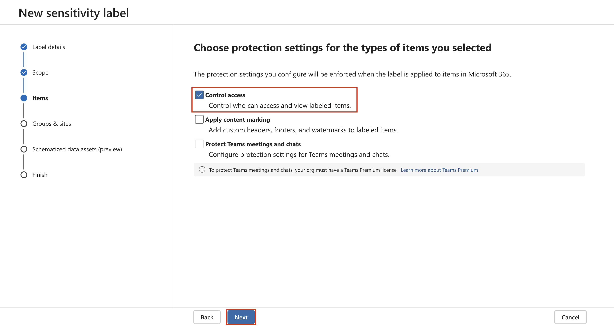
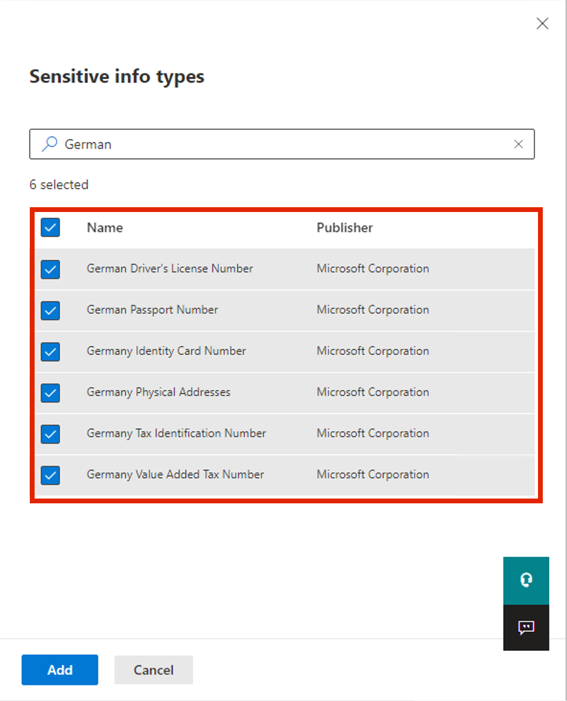

# Laboratorio 4 – Trabajar con etiquetas de confidencialidad

## Objetivo:

En este laboratorio asumirá el papel de Patti Fernández, administradora
de sistemas de Contoso Ltd. Su organización tiene su sede en
Rednitzhembach, Alemania, y actualmente está implementando un plan de
confidencialidad para garantizar que todos los documentos de los
empleados del departamento de RR. HH. se hayan marcado con una etiqueta
de confidencialidad como parte de las políticas de protección de la
información de su organización.

## Ejercicio 1 – Habilitar la compatibilidad con etiquetas de confidencialidad

En esta tarea, instalará el módulo MSOnline y el módulo SharePoint
Online PowerShell y habilitará la compatibilidad con etiquetas de
confidencialidad en su tenant.

1.  Selecione el símbolo de Windows en la barra de tareas con el botón
    derecho del mouse y seleccione **Windows PowerShell (Admin)** y
    ejecute como administrador.

Una captura de pantalla de una descripción de ordenador generada
automáticamente

2.  Confirme la ventana **User Account Control** con **Yes** y presione
    Enter.

3.  Ingrese el siguiente cmdlet para instalar la última version del
    modulo Microsoft Online PowerShell:

`Install-Module -Name ``MSOnline`

Una captura de pantalla de una descripción de ordenador generada
automáticamente

4.  Confirme el cuadro de diálogo de seguridad de NuGet y el cuadro de
    diálogo de seguridad del repositorio no confiable con Y para Yes y
    presione Enter. Esto puede tardar un poco en completarse.

5.  Ingrese el siguiente cmdlet para instalar la última versión del
    módulo de PowerShell de SharePoint Online:

`Install-Module -Name ``Microsoft.Online.SharePoint.PowerShell`

Una captura de pantalla de una descripción de ordenador generada
automáticamente

6.  Confirme el cuadro de diálogo de seguridad del repositorio no
    confiable con **Y** para Yes y presione Enter.

Una captura de pantalla de una descripción de pantalla de ordenador
generada automáticamente

7.  Ingrese el siguiente cmdlet para conectarse al servicio Microsoft
    Online:

`Connect-``MsolService`

8.  En el formulario **Sign in to your account**, inicie sesión como
    **Patti Fernandez** utilizando el nombre de usuario
    `PattiF``@{TENANTPREFIX``}.onmicrosoft.com` y la contraseña de
    usuario proporcionada en la pestaña de recursos.

Una captura de pantalla de una descripción de pantalla de ordenador
generada automáticamente

9.  Después de iniciar sesión, vaya a la **ventana de** **PowerShell.**

10. Ingrese el siguiente cmdlet para obtener el dominio:

`$domain = get-``msoldomain`

11. Ingrese el siguiente cmdlet para crear la URL de administrador de
    SharePoint:

`$``adminurl`` = "https://" + $``domain.Name.split``(``'.')[``0] + "-admin.sharepoint.com"`

Una captura de pantalla de una descripción de pantalla de ordenador
generada automáticamente

12. Ingrese el siguiente cmdlet para iniciar sesión en el centro de
    administración de SharePoint Online:

`Connect-``SPOService`` -``url`` $``adminurl`

Una captura de pantalla de una descripción de pantalla de ordenador
generada automáticamente

13. En el formulario **Sign in to your account**, inicie sesión como
    **MOD Administrator** utilizando las credenciales proporcionadas en
    la pestaña de recursos de su entorno de laboratorio.

14. Después de iniciar sesión, seleccione la ventana de PowerShell.

15. Ingrese el siguiente cmdlet para habilitar la compatibilidad con
    etiquetas de confidencialidad:

`Set-``SPOTenant`` -``EnableAIPIntegration`` $true`

16. Confirme los cambios con **Y** para Yes y presione Enter.

17. Cierre la ventana de **PowerShell**.

Ha habilitado correctamente la compatibilidad con etiquetas de
confidencialidad en Teams y sitios de SharePoint.

## 

## Ejercicio 2 – Creación de etiquetas de confidencialidad

En esta tarea, su departamento de RR. HH. ha solicitado una etiqueta de
confidencialidad para aplicar a los documentos de RR. HH. de los
empleados. Creará una etiqueta de confidencialidad para los documentos
internos y una subetiqueta para el departamento de RR. HH.

1.  En **Microsoft Edge** vaya to `https://purview.microsoft.com` e
    inicie sesión como **Patti Fernandez** utilizando el nombre de
    usuario `PattiF``@{TENANTPREFIX``}.onmicrosoft.com` y la contraseña
    de usuario que figura en la pestaña de recursos.

2.  En el portal Microsoft Purview, en el panel de navegación izquierdo,
    seleccione **Solutions** \> **Information Protection**.

3.  Desde la subnavegación, seleccione **Sensitivity Labels** \>
    **Create Labels**.

4.  Se iniciará el asistente **New sensitivity label**. En la página
    **Label** **details** para **Name**, **Description for admins** y
    **Description for users**, ingrese la siguiente información:

    - Name: `Internal`

    - Display name: `Internal`

    - Description for users: `Internal sensitivity label`

    - Description for admins: `Internal sensitivity label for Contoso.`

Interfaz gráfica de usuario, texto, aplicación, descripción de correo
electrónico generada automáticamente

5.  Seleccione **Next**.

Interfaz gráfica de usuario, texto, descripción de la aplicación
generada automáticamente

6.  En la página **Define the scope for this label**, seleccione la
    opción **Items** que protégé correos electrónicos, archivos, y
    elementos de Power BI. Desmarque la casilla junto a **Meetings**.

Una captura de pantalla de una descripción de ordenador generada
automáticamente

7.  Seleccione **Next**.

Una captura de pantalla de una descripción de ordenador generada
automáticamente

8.  En la página **Choose protection settings for labeled items**,
    seleccione **Next**.

Una captura de pantalla de una descripción de ordenador generada
automáticamente

9.  En la página **Auto-labeling** para archivos y correos electrónicos,
    seleccione **Next**.

Una captura de pantalla de una descripción de ordenador generada
automáticamente

10. En la página **Define protection settings for groups and sites**,
    seleccione **Next**.

Una captura de pantalla de una descripción de ordenador generada
automáticamente

11. En la página **Auto-labeling for schematized data assets
    (preview)**, seleccione **Next**.

Interfaz gráfica de usuario con texto, descripción de aplicación
generada automáticamente

12. En la página **Review your settings and finish**, seleccione
    **Create label**.

Una captura de pantalla de una descripción de ordenador generada
automáticamente

13. La etiqueta se creará y, cuando esté complete, se mostrará un
    mensaje: **Your sensitivity label was created**

14. Seleccione **Don’t create a policy yet** y luego seleccione
    **Done**.

Una captura de pantalla de una descripción de pantalla de ordenador
generada automáticamente

15. En la página **Information protection**, resalte (sin seleccionar)
    la etiqueta recién creada **Internal** y seleccione la opción
    vertical **…**.

16. Seleccione **+ Add sub label** en el menú despegable.

Una captura de pantalla de una descripción de ordenador generada
automáticamente

17. Se iniciará el asistente **New sensitivity label**. En la página
    **Label details**, ingrese la siguiente información:

    - Name: `Employee data (HR)`

    - Display name: `Employee data (HR)`

    - Description for users:
      `This HR label is the default label for all specified documents in the HR Department.`

    - Description for admins:
      `This label is created in consultation with ``Ms.Jones`` (Head of HR department). Contact her, when you want to change settings of the label.`

18. Seleccione **Next**.

19. En la página **Define the scope for this label**, seleccione la
    opción **Items** que protegen correos electrónicos, archivos y
    reuniones. Seleccione **Next**.

20. En la página **Choose protection settings for labeled items**,
    seleccione la opción **Control Access**. Seleccione **Next**.

21. En la página **Access Control**, seleccione **Configure access
    control ettings**.

22. Ingrese la siguiente información en la configuración de cifrado:

    - Assign permissions now or let users decide?: **Assign permissions
      now**

    - User access to content expires: **Never**

    - Allow offline access: **Only for a number of days**

    - Users have offline access to the content for this many days:
      **15**

Una captura de pantalla de una descripción de ordenador generada
automáticamente

23. Seleccione el enlace **Assign permissions**.

Una captura de pantalla de una descripción de ordenador generada
automáticamente

24. En la página **Assign permissions**, seleccione **+ Add any
    authenticated users**.

25. Seleccione **Save**.

26. En la página **Encryption**, seleccione **Next**.

Una captura de pantalla de una descripción de ordenador generada
automáticamente

27. En la página **Auto-labeling for files and emails**, seleccione
    **Next**.

Una captura de pantalla de la descripción de un ordenador generada
automáticamente

28. En la página **Define protection settings for groups and sites**,
    seleccione **Next**.

Una captura de pantalla de la descripción de un ordenador generada
automáticamente

29. En la página **Auto-labeling for schematized data assests
    (preview)**, seleccione **Next**.

Una captura de pantalla de la descripción de un ordenador generada
automáticamente

30. En la página **Review your settings and finish**, seleccione
    **Create label**.

Una captura de pantalla de la descripción de un ordenador generada
automáticamente

31. La etiqueta se creará y cuando esté complete aparecerá un mensaje
    **Your sensitivity label was created**

32. Seleccione **Don’t create a policy yet** y luego seleccione
    **Done**.

Una captura de la descripción de la pantalla de un ordenador generada
automáticamente

33. Mantenga la pestaña abierta para continuar con la siguiente tarea.

Ha creado correctamente una etiqueta de confidencialidad para las
políticas internas de su organización y una subetiqueta de
confidencialidad para el departamento de Recursos Humanos (RRHH).

## Ejercicio 3 – Publicación de etiquetas de confidencialidad 

Ahora publicará la etiqueta de confidencialidad interna y de RRHH para
que las etiquetas de confidencialidad publicadas estén disponibles para
que los usuarios de RRHH las apliquen a sus documentos de RRHH.

1.  En **Microsoft Edge** navegue hasta `https://purview.microsoft.com`
    e inicie sesión como **Patti Fernandez** utilizando el nombre de
    usuario `PattiF``@{TENANTPREFIX``}.onmicrosoft.com` y la contraseña
    de usuario proporcionada en su pestaña de recursos.

2.  En el portal Microsoft Purview, en el panel de navegación izquierdo,
    seleccione **Solutions** \> **Information Protection**.

3.  En la subnavegación, seleccione **Sensitivity Labels** \> **Publish
    Labels**.

4.  Se iniciará el asistente para publicar etiquetas de
    confidencialidad.

5.  En la página **Choose sensitivity labels to publish**, seleccione el
    enlace **Choose sensitivity labels to publish**.

Una captura de pantalla de la descripción de un ordenador generada
automáticamente

6.  A la derecha aparecerá una barra lateral llamada **Sensitivity
    labels to publish**.

7.  Seleccione las casillas de verificación **Internal** y
    **Internal/Employee Data (HR)**.

Una captura de pantalla de la descripción de un ordenador generada
automáticamente

8.  Seleccione **Add**.

Una captura de pantalla de la descripción de un ordenador generada
automáticamente

9.  En la página **Choose sensitivity labels to publish**, seleccione
    **Next**.

Una captura de pantalla de la descripción de un ordenador generada
automáticamente

10. En la página **Publish to users and groups page**, seleccione
    **Next**.

Una captura de pantalla de la descripción de un ordenador generada
automáticamente

11. En la página **Policy settings**, seleccione **Next**.

12. En la página **Apply a default label to documents**, seleccione
    **Next**.

Una captura de pantalla de la descripción de un ordenador generada
automáticamente

13. En la página **Apply a default label to emails**, seleccione
    **Next**.

14. En la página **Default settings for meetings and calendar events**,
    seleccione **Next**.

15. En la página **Default settings for Fabric and Power BI content**,
    seleccione **Next**.

16. En la página **Name your policy**, ingrese la siguiente información:

    - Name: `Internal HR employee data`

    - Enter a description for your sensitivity label policy:
      `This HR label is to be applied to internal HR employee data.`

Interfaz gráfica de usuario, texto, aplicación, descripción del correo
electrónico generada automáticamente

17. Seleccione **Next**.

Interfaz gráfica de usuario, texto, descripción de la aplicación
generada automáticamente

18. En la página **Review and finish**, seleccione **Submit**.

Interfaz gráfica de usuario, texto, descripción de la aplicación
generada automáticamente

19. La política se creará y cuando se complete aparecerá un mensaje
    **New policy created**.

20. Seleccione **Done y pase a la siguiente tarea sin cerrar la
    ventana**.

Una captura de pantalla de la descripción de un ordenador generada
automáticamente

Ha publicado correctamente las etiquetas de confidencialidad Interna y
RRHH. Tenga en cuenta que los cambios pueden tardar hasta 24 horas en
replicarse a todos los usuarios y servicios.

## Ejercicio 4 – Trabajar con etiquetas de confidencialidad

En esta tarea, creará etiquetas de confidencialidad en Word y correos
electrónicos de Outlook. El documento creado se almacenará en OneDrive y
se enviará a un empleado de RRHH por correo electrónico.

1.  Navegue hasta `https://portal.office.com` e inicie sesión como
    **Patti Fernandez**.

2.  Si aparece el mensaje **Get your work done with Office 365**,
    ciérrelo.

Descripción de la interfaz gráfica de usuario generada automáticamente

3.  Seleccione el símbolo de **Microsoft Word** en el panel lateral
    Izquierdo para abrir Word Online.

Interfaz gráfica de usuario, descripción del sitio web generada
automáticamente

4.  Seleccione **New blank document** para crear un nuevo documento.

Interfaz gráfica de usuario, descripción del sitio web generada
automáticamente

5.  Si aparece el mensaje **Your privacy options**, ciérrelo
    seleccionando **Close**

6.  Ingrese el siguiente contenido en el documento de Word:

`Important HR employee document.`

Interfaz gráfica de usuario, aplicación, descripción en Word generada
automáticamente

7.  Seleccione **Sensitivity** en el panel superior para abrir el menu
    desplegable.

Interfaz gráfica de usuario, aplicación, descripción en Word generada
automáticamente

8.  Seleccione **Internal** \> **Employee data (HR)** para aplicar la
    etiqueta.

**Nota**: Tenga en cuenta que el script ejecutado en la Tarea 1 de este
ejercicio activó las etiquetas de confidencialidad en Word para su
inquilino. En algunos casos, esta activación puede tardar hasta una hora
en reflejarse en Word Online. Si no visualiza el menú de etiquetas de
confidencialidad en Word.

9.  Seleccione **Document – Saved** en la parte superior izquierda de la
    ventana, ingrese **HR Document** como File Name y presione la tecla
    **Enter**.

Interfaz gráfica de usuario, aplicación, descripción en Word generada
automáticamente

10. Cierre la pestaña Word para volver a la pestaña **Office 365**.
    Seleccione el símbolo de **Outlook** en el panel lateral izquierdo
    para abrir en **Outlook** en la web.

Interfaz gráfica de usuario, texto, descripción de la aplicación
generada automáticamente

11. Si aparece un mensaje de bievenida, ciérrelo seleccionando la **X**.

12. En Outlook en la web, seleccione **New message** en la parte
    superior izquierda de la ventana.

Una captura de pantalla de la descripción de un ordenador generada
automáticamente

13. En el campo **To** ingrese el nombre: **Adele** y seleccione **Adele
    Vance** en la lista despegable.

14. En el campo de asunto, escriba: `Employee data for HR`.

    14. Dentro del mensaje de correo electrónico (el gran panel de
        contenido de la parte inferior de la página), inserte el
        siguiente mensaje:

&nbsp;

    DearMs. Adele,
    Please find attached the important HR employee document.
    Kind regards,
    Patti Fernandez

Una captura de pantalla de la descripción de un ordenador generada
automáticamente

16. Seleccione el **símbolo del clip** en el menú inferior.

17. Seleccione **HR Document.docx** que aparece a continuación de
    **Suggested attachments** para adjuntar el documento.

18. Seleccione **Send** para enviar el mensaje de correo electrónico con
    el documento adjunto.

19. Deje abierta la ventana del navegador.

Ha creado correctamente un documento Word de RR.HH. con una etiqueta de
confidencialidad, que se guardó en su OneDrive. A continuación, ha
enviado el documento por correo electrónico a un miembro del personal en
el que el correo electrónico también se ha configurado con una etiqueta
de confidencialidad.

En la cuenta de prueba, observe que podrá enviar el correo pero éste
rebotará y no podrá llegar al destinatario de su tenant actual.

## Ejercicio 5 – Configuración del etiquetado automático

En esta tarea, creará una **Sensitivity Label** que etiquetará
automáticamente los documentos y correos electrónicos que contengan
información relacionada con el **Reglamento General de Protección de
Datos (RGPD)** europeo.

1.  En **Microsoft Edge**, la pestaña del portal Microsoft Purview
    debería seguir abierta.

2.  Deberá iniciar sesión en el portal como **Patti Fernandez**.

3.  Debajo de **Information protection**, seleccione **Label**, resalte
    (sin seleccionar) la etiqueta **Internal** existente, y seleccione
    los tres puntos. Seleccione la opción de menú **+ Create sublabel**.

Una captura de pantalla de la descripción de un ordenador generada
automáticamente

4.  Se iniciará el asistente **New sensitivity label**. En la página
    **label details**, ingrese la siguiente información:

    - Name: `GDPR Germany`

    - Display name: `GDPR Germany`

    - Description for users:
      `This document or email contains data related to the European General Data Protection ``Regulation(``GPDR) for the region Germany.`

    - Description for admins:
      `This label is auto applied to German GDPR documents.`

5.  Seleccione **Next**.

6.  En la página **Define the scope for this label**, seleccione la
    opción **Items** que protege los elementos Files, Emails, and
    Meetings. A continuación, seleccione **Next**.

7.  En la página **Choose protection settings for labeled items**,
    seleccione **Next**.

8.  En la página **Auto-labeling for files and emails**, active la
    opción **Auto-labeling for files and emails**.

Interfaz gráfica de usuario, texto, descripción de la aplicación
generada automáticamente

9.  En la sección **Detect content that matches these conditions**,
    seleccione **+Add condition** y luego seleccione **Content
    contains**.

10. En la sección **Content contains** seleccione **Add** y luego
    seleccione **Sensitive info types**.

Una captura de pantalla de la descripción de un ordenador generada
automáticamente

11. A la derecha aparecerá un panel **Sensitive info types**.

12. En el panel de búsqueda **Search for sensitive info types**, ingrese
    la siguiente información:

`German`

13. Presione la tecla Enter en su teclado, los resultados mostrarán
    tipos de información de confidencialidad relacionados con Alemania.
    Presione la casilla de verificación **Select all**.

14. Seleccione **Add**.

15. Seleccione **Next**.

Una captura de pantalla de una descripción de ordenador generada
automáticamente

16. En la página **Define protection settings for groups and sites**,
    seleccione **Next**.

Una captura de pantalla de una descripción de ordenador generada
automáticamente

17. En la página **Auto-labeling for schematized data assets
    (preview)**, seleccione **Next**.

18. Si se le redirige a la página **Default settings for Fabric and
    Power BI content,** seleccione **Next**.

19. En la página **Review your settings and finish**, seleccione
    **Create label**.

20. Se creará la etiqueta y, cuando esté complete, aparecerá un mensaje:
    **Your sensitivity label was created**. En los siguientes pasos,
    seleccione **Don’t create a policy yet**. Luego, seleccione
    **Done**.

Interfaz gráfica de usuario, texto, aplicación, descripción de Word
generada automáticamente

21. En el submenu, seleccione **Sensitivity Labels** \> **Publish
    Labels**.

22. Se iniciará el **Publish sensitivity labels wizard**.

Interfaz gráfica de usuario, texto, aplicación, descripción de Word
generada automáticamente

23. En la página **Choose sensitivity labels to publish**, seleccione el
    enlace **Choose sensitivity labels to publish**.

Una captura de pantalla de una descripción de ordenador generada
automáticamente

24. A la derecha aparecerá una barra lateral llamada **Sensitivity
    labels to publish**.

Interfaz gráfica de usuario, aplicación, descripción de Word generada
automáticamente

25. Seleccione la casilla de verificación **Internal** e **Internal/GDPR
    Germany** y seleccione **Add**.

Interfaz gráfica de usuario, aplicación, descripción de Word generada
automáticamente

26. En la página **Choose sensitivity labels to publish**, seleccione
    **Next**.

Interfaz gráfica de usuario, texto, aplicación, descripción de Word
generada automáticamente

27. En la página **Publish to users and groups**, seleccione **Next**.

Interfaz gráfica de usuario, texto, descripción de la aplicación
generados automáticamente

28. En la página **Policy settings**, seleccione **Next**.

Interfaz gráfica de usuario, texto, aplicación, descripción de Word
generada automáticamente

29. En la página **Apply a default label to documents**, seleccione
    **Next**.

Interfaz gráfica de usuario, texto, descripción de la aplicación
generada

automáticamente

30. En la página **Apply a default label to emails**, seleccione
    **Next**.

31. En la página **Default settings for meetings and calendar events**,
    seleccione **Next**.

32. En la página **Default settings for Fabric and Power BI content**,
    seleccione **Next**.

33. En la página **Name your policy**, ingrese la siguiente información:

    - Name: `GDPR Germany policy`

    - Enter a description for your sensitivity label policy:
      `This auto apply sensitivity labels policy is for the GDPR region of Germany.`

34. Seleccione **Next**.

Interfaz gráfica de usuario, texto, descripción de la aplicación
generada

automáticamente

35. En la página **Review and finish**, seleccione **Submit**.

Interfaz gráfica de usuario, descripción de la aplicación generada
automáticamente

36. Se creará la política y, cuando esté complete, aparecerá el mensaje
    **New policy created**.

37. Seleccione **Done**.

Interfaz gráfica de usuario, texto, aplicación, descripción de Word
generada automáticamente

## Resumen:

Ha creado y publicado correctamente una etiqueta de confidencialidad de
aplicación automática para documentos GDPR en la región Alemania.

Tenga en cuenta que la aplicación automática de etiquetas puede tardar
hasta 24 horas, y este plazo será mayor cuando se aplique a más de
25,000 documentos (que es el límite diario).
