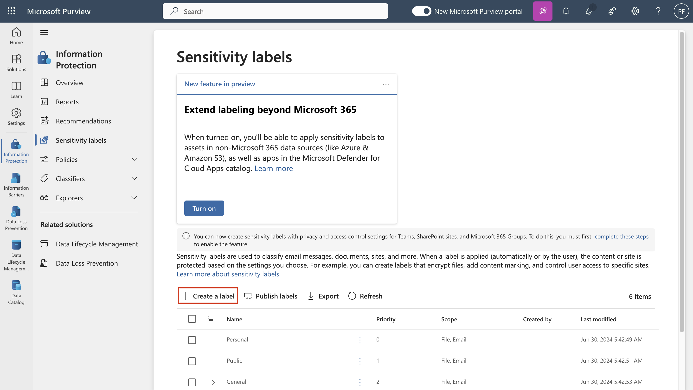

# 实验 4 - 使用敏感度标签

## **目的**:

在本实验中，您将扮演 Contoso Ltd. 的系统管理员 Patti Fernandez
的角色。你的组织位于德国雷德尼茨亨巴赫，目前正在实施敏感度计划，以确保人力资源部门的所有员工文档都已标有敏感度标签，作为组织信息保护策略的一部分。

## 练习 1 - 启用对敏感度标签的支持

在此任务中，你将安装 MSOnline 模块和 SharePoint Online PowerShell
模块，并在租户上启用对敏感度标签的支持。

1.  用鼠标右键选择任务栏中的 Windows 符号，然后选择 **Windows PowerShell
    （Admin）** 并以管理员身份运行。

自动生成的计算机 Description 的屏幕截图

2.  确认 **User Account Control** 窗口，然后单击 **Yes**，然后按 Enter。

3.  输入以下 cmdlet 以安装最新的 Microsoft Online PowerShell 模块版本:

`Install-Module -Name MSOnline`

自动生成的计算机 Description 的屏幕截图

4.  确认 NuGet 安全对话框和“不受信任的存储库”安全对话框，并使用 Y
    表示“是”，然后按 Enter。这可能需要一段时间才能完成处理。

5.  输入以下 cmdlet 以安装最新的 SharePoint Online PowerShell 模块版本：

`Install-Module -Name ``Microsoft.Online.SharePoint.PowerShell`

自动生成的计算机 Description 的屏幕截图

6.  在 Untrusted repository security 对话框中，使用 Y 表示“是”，然后按
    Enter。

自动生成的计算机屏幕描述的屏幕截图

7.  输入以下 cmdlet 以连接到 Microsoft Online 服务：

`Connect-``MsolService`

8.  在 **Sign in to your account （登录您的账户**） 表单中，
    **使用用户名**
    PattiF@{TENANTPREFIX}.onmicrosoft.com` ``和资源选项卡上提供的用户密码以`` `Patti
    Fernandez 身份登录。

自动生成的计算机屏幕描述的屏幕截图

9.  登录后，转到 **PowerShell window**。

10. 输入以下 cmdlet 以获取域：

`$domain = get-``msoldomain`

11. 输入以下 cmdlet 以创建 SharePoint 管理员 URL：

`$``adminurl`` = "https://" + $``domain.Name.split``(``'.')[``0] + "-admin.sharepoint.com"`

自动生成的计算机屏幕描述的屏幕截图

12. 输入以下 cmdlet 以登录到 SharePoint Online 管理中心：

`Connect-``SPOService`` -``url`` $``adminurl`

自动生成的计算机屏幕描述的屏幕截图

13. 在 **Sign in to your account（登录您的账户**）表单中，
    使用实验室环境的 resources（资源）选项卡中提供的凭证以 **MOD
    Administrator**身份登录。

&nbsp;

14. 登录后，选择 PowerShell 窗口。

15. 输入以下 cmdlet 以启用对敏感度标签的支持：

`Set-``SPOTenant`` -``EnableAIPIntegration`` $true`

16. 使用 **Y** 确认更改， 对于 Yes ，然后按 Enter。

17. 关闭 **PowerShell** 窗口。

你已成功为 Teams 和 SharePoint 网站启用对敏感度标签的支持。

## 练习 2 - 创建敏感度标签

在此任务中，HR 部门已请求将敏感度标签应用于 HR 员工文档。你将为 Internal
documents （内部文档） 创建一个敏感度标签，并为 HR 部门创建一个子标签。

1.  在 **Microsoft Edge** 中，导航到 `https://purview.microsoft.com`
    并使用用户名 PattiF@{TENANTPREFIX}.onmicrosoft.com
    和资源选项卡上提供的用户密码以 `Patti Fernandez` 身份登录。

2.  在 Microsoft Purview 门户的左侧导航窗格中，选择 **Solutions \>
    Information Protection。**

3.  从子导航栏中，选择 **Sensitivity Labels** \> **Create Labels**。

4.  New **sensitivity label** 向导将启动。在 **Name**、**Description for
    admins** 和 **Description for users 的** Label details
    **页面上**，输入以下信息：

    - 名字: `Internal`

    - 显示名称: `Internal`

    - 用户描述: `Internal sensitivity label`

    - 管理员描述: `Internal sensitivity label for Contoso.`

自动生成图形用户界面、文本、应用程序、电子邮件描述

5.  选择 **Next**。

自动生成图形用户界面、文本、应用程序描述

6.  在 **Define the scope for this label**
    页面上，选择“保护电子邮件、文件和 Power BI **Items**
    的项目”选项。取消选中 **Meetings** 旁边的框。

自动生成的计算机 Description 的屏幕截图

7.  选择 **Next**。

自动生成的计算机 Description 的屏幕截图

8.  在 **Choose protection settings for labeled items** 页上，选择
    **Next** 。

自动生成的计算机 Description 的屏幕截图

9.  在 **Auto-labeling** 文件和电子邮件” 页面上，选择 **Next**。

自动生成的计算机 Description 的屏幕截图

10. 在 **Define protection settings for groups and sites** 页面上，选择
    **Next**。

自动生成的计算机 Description 的屏幕截图

11. 在 **Auto-labeling for schematized data assets
    (preview)**页面上，选择**Next**。

自动生成图形用户界面、文本、应用程序描述

12. 在 **Review your settings and finish （查看您的设置并完成** ）
    页面上，选择 **Create label**。

自动生成的计算机 Description 的屏幕截图

13. 将创建标签，完成后将显示一条消息： **Your sensitivity label was
    created**

14.选择 **Don't create a policy yet** ，然后选择 **Done**。

自动生成的计算机屏幕描述的屏幕截图

15. 在 **Information protection**页上，突出显示 （但不选择） 新创建的
    **Internal** 标签，然后选择垂直 **...**。

16.选择 **+ Add sub label** 从下拉菜单中。

自动生成的计算机 Description 的屏幕截图

> 17.New **sensitivity label** 向导将启动。在 **Label details**
> 页面上，输入以下信息：

- 名字: `Employee data (HR)`

- 显示名称: `Employee data (HR)`

- 用户描述:
  `This HR label is the default label for all specified documents in the HR Department.`

- 管理员描述:
  `This label is created in consultation with ``Ms.Jones`` (Head of HR department). Contact her, when you want to change settings of the label.`

> 18.选择 **Next**。

> 19.在 **Define the scope for this label** 页面上，选择选项 **Items**
> that protect email， files， and Meetings.选择 **Next**。

> 20.在 **Choose protection settings for labeled items** 页面上，选择
> **Control Access** 选项。选择 **Next**。

> 21.在 **Access Control** 页面上，选择 **Configure access control
> ettings**。

22. 在加密设置中输入以下信息:

    - Assign permissions now or let users decide?: **Assign permissions
      now**

    - User access to content expires: **Never**

    - Allow offline access: **Only for a number of days**

    - Users have offline access to the content for this many days:
      **15**

自动生成的计算机 Description 的屏幕截图

23. Select the **Assign permissions** link.

自动生成的计算机 Description 的屏幕截图

24. 在 **Assign permissions** 窗格中，选择 **+ Add any authenticated
    users**。

25. 选择 **Save** 。

26. 在 **Encryption** 页面上，选择 **Next** 。

自动生成的计算机 Description 的屏幕截图

27. 在 **Auto-labeling for files and emails** 页面上，选择 **Next**。

自动生成的计算机 Description 的屏幕截图

28. 在 **Define protection settings for groups and sites** 页面上，选择
    **Next** 。

自动生成的计算机 Description 的屏幕截图

29. 在 **Auto-labeling for schematized data assests
    （preview）**页面上，选择 **Next**。

自动生成的计算机 Description 的屏幕截图

30. 在 **Review your settings and finish** 页面上，选择 **Create
    label**。

自动生成的计算机 Description 的屏幕截图

31. 将创建标签，完成后，将显示一条消息 **Your sensitivity label was
    created**。

32. 选择 **Don't create a policy yet**，然后选择 **Done**。

自动生成的计算机屏幕描述的屏幕截图

33. 保持选项卡打开以继续执行下一个任务。

你已成功为组织内部策略创建敏感度标签，并为人力资源 （HR）
部门创建敏感度子标签。

## 练习 3 - 发布敏感度标签

现在，你将发布 “内部 ”和 “HR 敏感度” 标签，以便已发布的敏感度标签可供 HR
用户应用于其 HR 文档。

1.  在 **Microsoft Edge** 中，导航到 `https://purview.microsoft.com`
    并使用用户名 PattiF@{TENANTPREFIX}.onmicrosoft.com
    和资源选项卡上提供的用户密码以 `Patti Fernandez` 身份登录。

2.  在 Microsoft Purview 门户的左侧导航窗格中，**选择 Solutions \>
    Information Protection。**

3.  从子导航栏中，选择 **Sensitivity Labels** \> **Publish Labels**。

4.  发布敏感度标签向导将启动。

5.  在 **Choose sensitivity labels to publish**页上，选择 **Choose
    sensitivity labels to publish**链接。

自动生成的计算机 Description 的屏幕截图

6.  右侧将显示一个名为 **Sensitivity labels to publish** **的**侧边栏。

7.  选中 **Internal** 和 **Internal/Employee Data （HR）** 复选框。

自动生成的计算机 Description 的屏幕截图

8.  选择 **Add**。

自动生成的计算机 Description 的屏幕截图

9.  在 **Choose sensitivity labels to publish**页上，选择Next。

自动生成的计算机 Description 的屏幕截图

10. 在 **Publish to users and groups**，选择**Next**。

自动生成的计算机 Description 的屏幕截图

11. 在 **Policy settings** 页面上，选择 **Next**。

12. 在 **Apply a default label to documents** 页面上，选择**Next**。

自动生成的计算机 Description 的屏幕截图

13. 在 **Apply a default label to emails** 页面上，选择 **Next**。

14. 在 Default **settings for meetings and calendar events**上，选择
    **Next**。

15. 在 **Default settings for Fabric and Power BI
    content**页面上，选择**Next**。

16. 在 **Name your policy** 页面上，输入以下信息:

    - 名字: `Internal HR employee data`

    - 输入敏感度标签策略的说明:
      `This HR label is to be applied to internal HR employee data.`

自动生成图形用户界面、文本、应用程序、电子邮件描述

17. 选择 **Next**。

自动生成图形用户界面、文本、应用程序描述

18. 在 **Review and finish** 页面上，选择 **Submit** 。

自动生成图形用户界面、文本、应用程序描述

19. 将创建策略，完成后，将显示 **New policy created**。

20. 选择 **Done and proceed to next task without closing the window**。

自动生成的计算机 Description 的屏幕截图

您已成功发布 Internal （内部） 和 HR sensitivity （人力资源敏感度）
标签。请注意，更改最多可能需要 24 小时才能复制到所有用户和服务。

## 练习 4 - 使用敏感度标签

在此任务中，您将在 Word 和 Outlook
电子邮件中创建敏感度标签。创建的文档将存储在 OneDrive
中，并通过电子邮件发送给 HR 员工。

1.  导航到 `https://portal.office.com ``并以`` `**Patti Fernandez**
    身份登录。

2.  如果**显示 Get your work with Office 365** 消息，请将其关闭。

图形用户界面 自动生成描述

3.  从左侧窗格中选择 **Microsoft Word** 符号以打开 Word Online。

图形用户界面，自动生成网站描述

4.  选择 **New blank document** 以创建新文档。

图形用户界面，自动生成网站描述

5.  如果显示 **Your privacy options** 消息，请选择 Close **将其关闭**。

6.  在 word 文档中输入以下内容：

`Important HR employee document.`

自动生成图形用户界面、应用程序、Word 描述

7.  选择 **Sensitivity** 从顶部窗格中打开下拉菜单。

自动生成图形用户界面、应用程序、Word 描述

8.  选择 **Internal** \> **Employee data （HR）** 以应用标签。

**注意**：请注意，在本练习的任务 1 中运行的脚本在 Word
中为租户激活了敏感度标签。有时可能需要一个小时才能在 Microsoft Word
Online 中实现该激活。如果在 Word 中看不到 Sensitivity
label（敏感度标签）菜单，则可能需要稍后返回此实验室，或确保正确完成本练习的任务
1。

9.  选择 Document – Saved 在窗口的左上角，输入HR Document 作为 文件名
    然后按 Enter 键。

自动生成图形用户界面、应用程序、Word 描述

10. 关闭单词选项卡以返回到 **Office 365** 选项卡。从左侧窗格中选择
    **Outlook** 符号以打开 **Outlook** 网页版。

自动生成图形用户界面、文本、应用程序描述

11. 如果显示欢迎消息，请选择 **X** 将其关闭。

12. 在 Outlook 网页版中，选择 窗口左上角的 **New message**。

自动生成的计算机 Description 的屏幕截图

13. 在 **To** 字段中输入名称： **Adele** 并选择 **Adele Vance**
    从下拉列表中。

14. 在主题字段中，输入：`Employee data for HR``。`

15. 在电子邮件消息（页面底部的大内容面板）中，插入以下消息:

&nbsp;

    DearMs. Adele,
    Please find attached the important HR employee document.
    Kind regards,
    Patti Fernandez

自动生成的计算机 Description 的屏幕截图

16. 从 底部菜单中选择 **paperclip symbol**。

17. 选择 **Document.docx Suggested attachments** 下方的 HR 以附加文档。

18. 选择 **Send**以发送带有附加文档的电子邮件。

19. 使浏览器窗口保持打开状态。

你已成功创建带有敏感度标签的 HR Word 文档，该文档已保存到 OneDrive
上。然后，你通过电子邮件将 Document
发送给一名工作人员，其中电子邮件也设置了敏感度标签。

请注意，在试用帐户中，您将能够发送邮件，但邮件会退回，并且无法从当前租户联系到收件人。

## 练习 5 – 配置自动标签

在此任务中，您将创建一个**Sensitivity
Label**敏感度标签，该标签将自动标记发现包含与**European General Data
Protection Regulation (GPDR)** 相关的信息的文档和电子邮件。

1.  在 **Microsoft Edge** 中，Microsoft Purview
    门户选项卡应仍处于打开状态。

2.  您应该以 **Patti Fernandez 的身份登录门户**。

3.  在Information protection,
    **下**，选择Label,，突出显示（不选择）现有的 **Internal**
    标签，然后选择三个点。选择 **+ Create sublabel** 菜单项。

自动生成的计算机 Description 的屏幕截图

4.  New **sensitivity label** 向导将启动。在 **label details**
    页面上，输入以下信息:

    - 名字: `GDPR Germany`

    - 显示名称: `GDPR Germany`

    - 用户描述:
      `This document or email contains data related to the European General Data Protection ``Regulation(``GPDR) for the region Germany.`

    - 管理员描述: `This label is auto applied to German GDPR documents.`

5.  选择 **Next**。

6.  在 **Define the scope for this label** 页面上，选择选项 **Items**
    that protect Files， Emails， and Meetings items.然后选择 **Next**。

7.  在 **Choose protection settings for labeled items**页上，选择
    **Next**。

8.  在 **Auto-labeling for files and emails** 页面上，将 **Auto-labeling
    for files and emails** 设置为 enabled。

自动生成图形用户界面、文本、应用程序描述

4.  在 **Detect content that matches these conditions**
    部分中，选择**+Add condition**，然后选择 **Content contains**。

9.  在 **Content contains** 部分中，选择 **Add text** ，然后选择
    **Sensitive info types。**

自动生成的计算机 Description 的屏幕截图

11. 右侧**将显示 Sensitive info types** 面板。

12. 在 **Search for sensitive info types** 搜索面板中，输入以下信息:

`German`

13. 按键盘上的 Enter 键，结果将显示与德国相关的敏感度信息类型。按
    **Select all** 复选框。

14. 选择 **Add**。

15. 选择 **Next**。

自动生成的计算机 Description 的屏幕截图

16. 在 **Define protection settings for groups and sites** 页面上，选择
    **Next** 。

自动生成的计算机 Description 的屏幕截图

17. 在 **Auto-labeling for schematized data assets
    (preview)**页面上，选择 **下一步**。

18. 如果重定向到 **Default settings for Fabric and Power BI content
    page**页面，请选择 **Next**。

19. 在 **Review your settings and finish** 页面上，选择 **Create label**
    。

> 20\. 将创建标签，完成后将显示一条消息： **Your sensitivity label was
> created**。在 “后续步骤” 下，选择 **Don’t create a policy
> yet。**然后选择 **Done**。

自动生成图形用户界面、文本、应用程序、Word 描述

21. 从子导航栏中，选择 **Sensitivity Labels** \> **Publish Labels**。

22. Publish **Publish sensitivity labels wizard** 将启动。

自动生成图形用户界面、文本、应用程序、Word 描述

23. 在 Choose sensitivity labels to publish 页上，选择 **Choose
    sensitivity labels to publish**链接。

自动生成的计算机 Description 的屏幕截图

24. 右侧将显示一个名为 **Sensitivity labels to publish** **的**侧边栏。

自动生成图形用户界面、应用程序、Word 描述

25. 选中 **Internal** and **Internal/GDPR Germany** 复选框，然后选择
    **Add**。

自动生成图形用户界面、应用程序、Word 描述

26. 在 **Choose sensitivity labels to publish** 页上，选择 **Next**。

自动生成图形用户界面、文本、应用程序、Word 描述

27. 在 **Publish to users and groups**页面上，选择 **Next**。

自动生成图形用户界面、文本、应用程序描述

28. 在 **Policy settings** 页面上，选择 **Next** 。

自动生成图形用户界面、文本、应用程序、Word 描述

29. 在 **Apply a default label to documents**页面上，选择 **Next**。

自动生成图形用户界面、文本、应用程序描述

30. 在 **Apply a default label to emails** 页面上，选择 **Next**。

31. 在 Default **settings for meetings and calendar events**上，选择
    **Next**。

32. 在 **Default settings for Fabric and Power BI content** 页面上，选择
    **Next**。

33. 在 **Name your policy** 页面上，输入以下信息:

    - 名字: `GDPR Germany policy`

    - 输入敏感度标签策略的说明：
      `This auto apply sensitivity labels policy is for the GDPR region of Germany.`

34. 选择 **Next**。

自动生成图形用户界面、文本、应用程序描述

35. 在 **Review and finish** 页面上，选择 **Submit**。

图形用户界面，自动生成应用程序描述

36. 将创建策略，完成后将显示一条消息， **New policy created**。

37. 选择 **Done**。

自动生成图形用户界面、文本、应用程序、Word 描述

## 总结:

你已成功在德国区域为 GDPR 文档创建并发布了自动应用敏感度标签。

请注意，应用自动应用的敏感度标签最多可能需要 24 小时，当应用于超过
25,000 个文档时，此持续时间会更长（即每日限制）。
