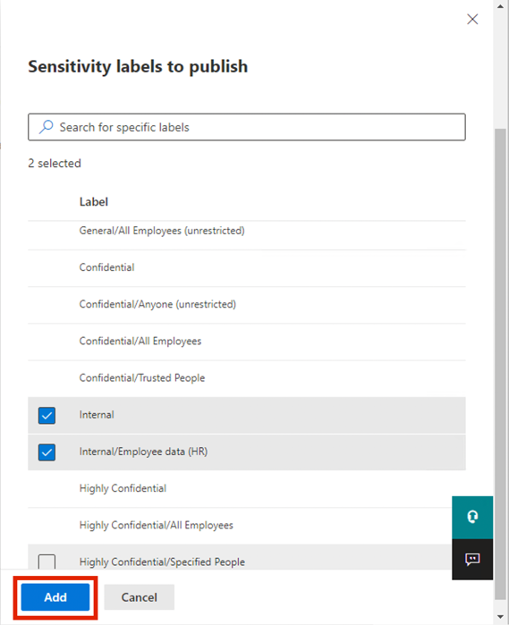
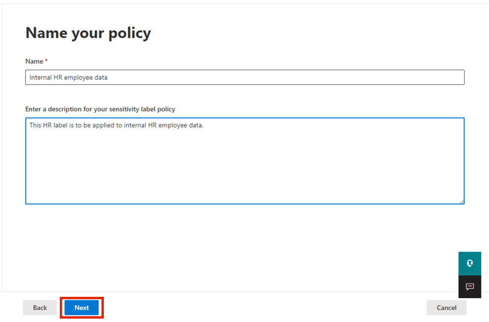
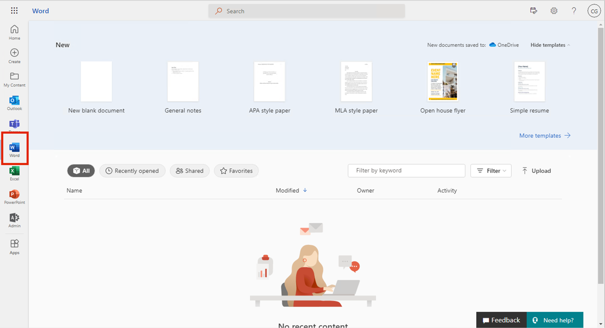
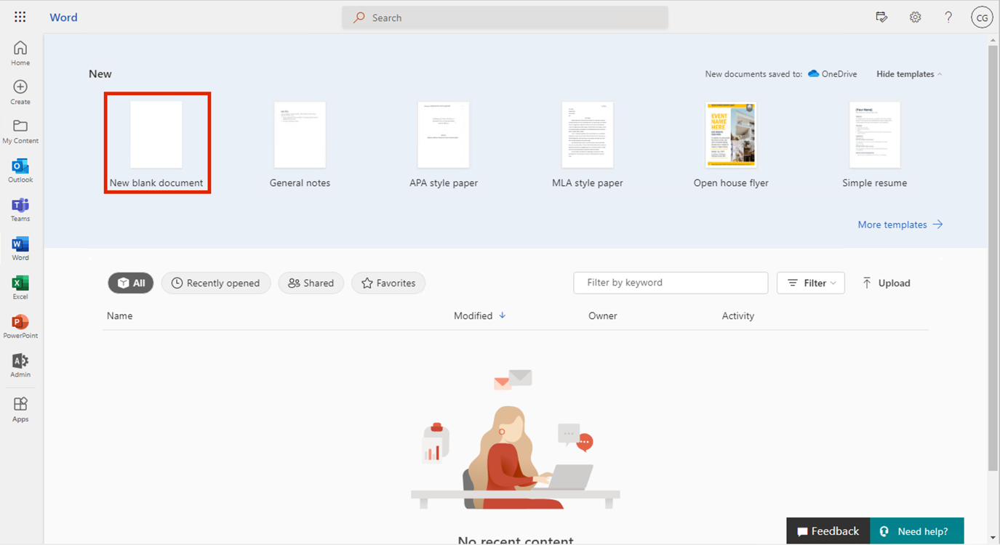
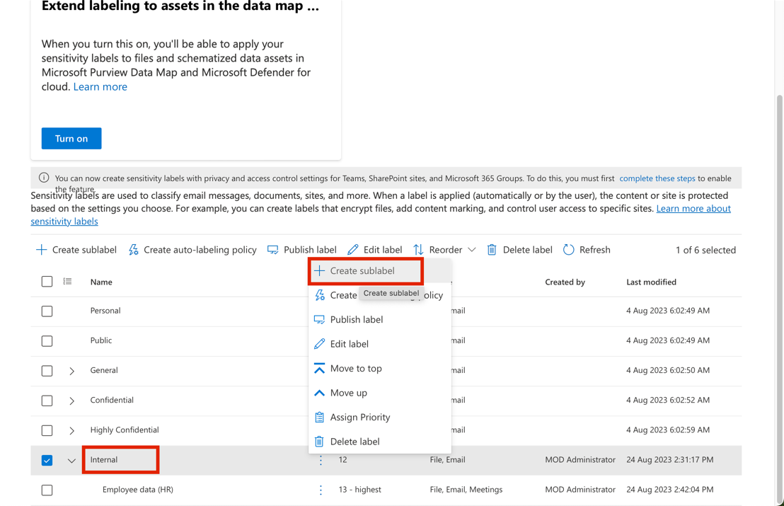
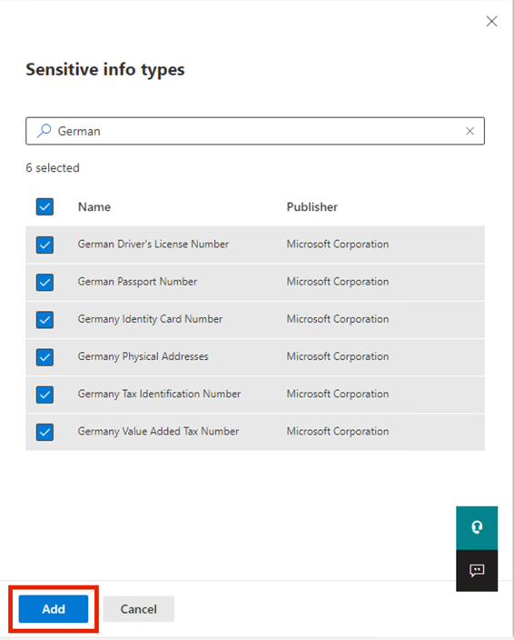
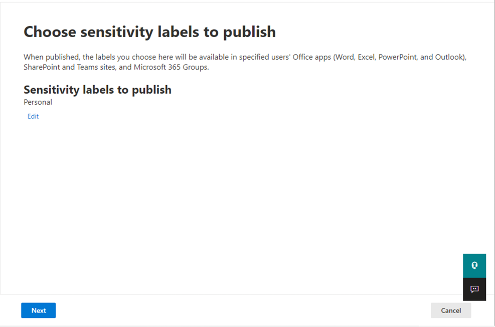
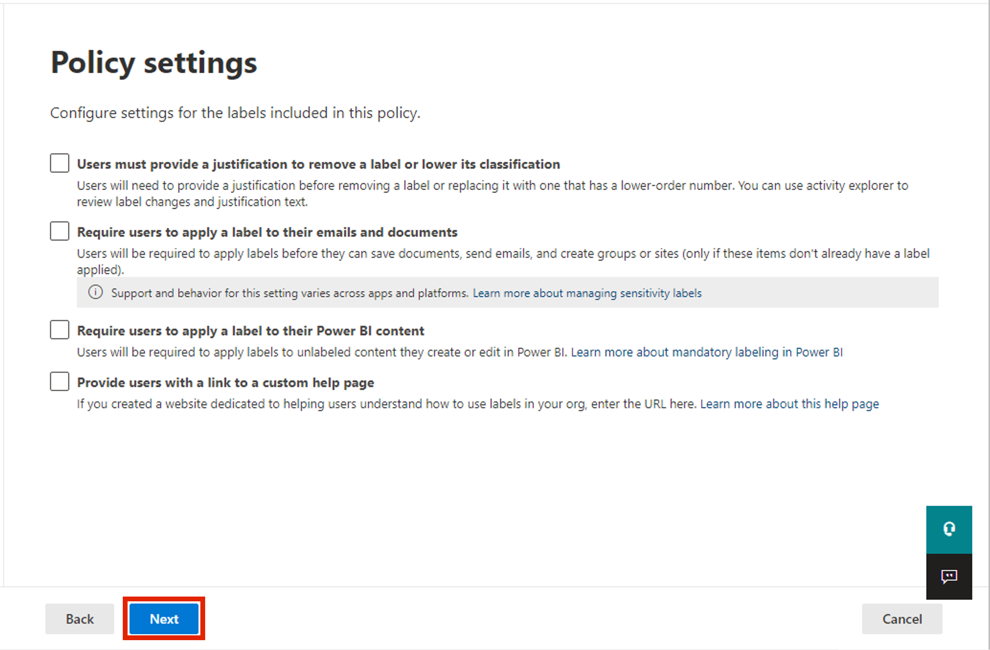
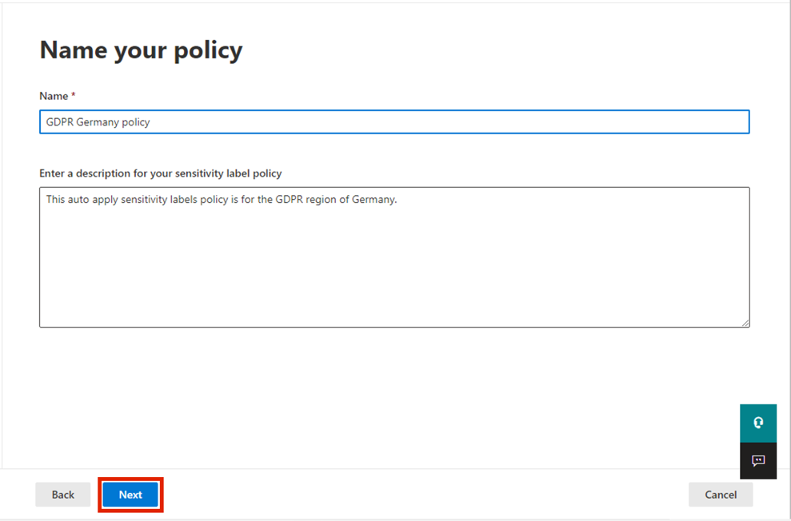

**实验室 4_使用敏感度标签**

## 介绍

在本练习中，你将扮演 Contoso Ltd 的系统管理员 Patti Fernandez
的角色。你的组织位于德国
Rednitzhembach，目前正在实施敏感度计划，以确保人力资源部门中的所有员工文档都已标记为敏感度标签，作为组织信息保护策略的一部分。

**目标**

- 在 Microsoft 365 和 SharePoint 中启用对敏感度标签的支持。

- 使用保护设置创建和发布敏感度标签和子标签。

- 在 Microsoft 365 应用 （Word、Outlook、OneDrive） 中应用敏感度标签。

- 根据敏感信息类型配置和测试自动标记策略。

## 练习 1 – 启用对敏感度标签的支持

在此任务中，你将安装 MSOnline 模块和 SharePoint Online PowerShell
模块，并在租户上启用对敏感度标签的支持。

1.  右键单击 Windows 图标，然后导航并单击 **Windows PowerShell (Admin)**

2.  在“**User Account Control** ”对话框中，单击“**Yes**”按钮。

3.  输入以下 cmdlet 以安装最新的 Microsoft Online PowerShell 模块版本:

**+++Install-Module -Name MSOnline+++**

4.  在 **You are installing the modules from an untrusted repository...
    message**，键入 **Y**，然后按 Enter 按钮

> 

5.  输入以下 cmdlet 以安装最新的 SharePoint Online PowerShell 模块版本:

**+++Install-Module -NameMicrosoft.Online.SharePoint.PowerShell+++**

6.  在 **You are installing the modules from an untrusted repository...
    message**,键入 **Y**，然后按 Enter 按钮

> 

7.  输入以下 cmdlet 以连接到 Microsoft Online 服务:

**+++Connect-MsolService+++**

8.  在**Sign in to your account** 表单中，使用资源选项卡上提供的用户名
    **PattiF@WWLxXXXXXX.onmicrosoft.com** 和用户密码以 **Patti
    Fernandez** 身份登录。

> 
>
> 

9.  输入以下 cmdlet 以获取域:

**+++\\domain = get-msoldomain+++**

10. 输入以下 cmdlet 以创建 SharePoint 管理员 URL:

**+++\\adminurl = "https://" +\\domain.Name.split('.')\[0\] +"-admin.sharepoint.com"+++**

11. 输入以下 cmdlet 以登录到 SharePoint Online 管理中心:

**+++Connect-SPOService -url \\adminurl+++**

12. 在“**Sign in to your
    account** ”窗体中，使用实验室环境的“资源”选项卡中提供的凭据以 **MOD
    Administrator** 身份登录。

13. 输入以下 cmdlet 以启用对敏感度标签的支持:

**+++Set-SPOTenant -EnableAIPIntegration $true+++**

14. 使用 **Y** 表示是确认更改，然后按 Enter。

15. 关闭 **PowerShell** 窗口。

已成功启用对 Teams 和 SharePoint 网站敏感度标签的支持。

## 练习 2 – 创建敏感度标签

在此任务中，人力资源部门已请求将敏感度标签应用于人力资源员工文档。你将为内部文档创建敏感度标签，并为
HR 部门创建子标签。

1.  在私人窗口中打开 **Microsoft Edge** 浏览器，导航到
    **+++**https://purview.microsoft.com**+++**并使用资源选项卡上给出的用户名
    **PattiF@WWLxXXXXXX.onmicrosoft.com** 和用户密码以 Patti Fernandez
    身份登录。

2.  在Microsoft Purview 门户的左侧导航窗格中，选择“**Solutions** \>
    **Information Protection**”。

3.  从子导航中，选择“**Sensitivity Labels** \> **Create Labels**”。

4.  “**New sensitivity label**”向导将启动。在“**Name**”、“**Description
    for admins**”和**“Description for users “Label
    details ”**页上，输入以下信息:

    - 名字: **+++Internal+++**

    - 显示名称: **+++Internal+++**

    - 用户说明: **+++Internal sensitivity label+++**

    - 管理员说明: **+++Internal sensitivity label for Contoso.+++**

    - 

5.  选择 **Next**。

6.  在“**Define the scope for this label** ”页上，确保选中“**Files &
    other data
    assets**”复选框。然后，取消选中“**Meetings**”复选框，然后单击“**Next**”按钮。

7.  在“**Choose protection settings for the types of items you
    selected**”页上，单击“**Next**”按钮。

8.  在“文件和电子邮件的 **Auto-labeling** ”页上，选择“**Next**”。

9.  在“**Define protection settings for groups and
    sites**”页上，选择“**Next**”。 

10. 在“**Review your settings and finish** ”页上，单击“**Create
    label**”按钮。

11. 在“**Your sensitivity label was created**”页上，导航并选择“**Don’t
    create a policy yet**”单选按钮。然后，单击“**Done**”按钮。

12. 在“**Information
    protection**”页上，导航到“**Internal**”标签，然后选择垂直省略号 

13. 然后，导航并单击 **Create sublabel**。

14. “**New sensitivity label”**向导将启动。在 Label details 页上
    ，输入以下信息:

    - 名字: **+++Employee data (HR) +++**

    - 显示名称: **+++Employee data (HR) +++**

    - 用户说明: **+++This HR label is the default label for all
      specified documents in the HR Department. +++**

    - 管理员说明: **+++This label is created in
      consultation with Ms.Jones (Head of HR department). Contact her,
      when you want to change settings of the label. +++**

15. 在“**Define the scope for this
    label ”**页上，确保选中“文件和其他数据资产”、“电子邮件”和“会议”复选框，然后单击“**Next**”按钮。

16. 在“**Choose protection settings for labeled
    items** ”页上，选择“**Control Access** ”选项。选择 **Next**。 

17. 在**Access control**页面上，确保选择 **Configure access control
    settings**。 

18. 在加密设置中输入以下信息:

    - 立即分配权限还是让用户决定？：**Assign permissions now**

    - 用户对内容的访问权限过期：**Never**

    - 允许离线访问：**Only for a number of days**

    - 用户可以在这许多天内离线访问内容：**15**

    &nbsp;

    - 

19. 选择“**Assign permissions** ”链接。

20. 在“**Assign permissions** ”窗格中，选择“**+ Add any authenticated
    users**”。

> 

21. 选择 **Save。**

22. 在“**Access control**”页上，选择“**Next**”。

23. 在“**Auto-labeling for files and emails** ”页上，选择“**Next**”。

24. 在“**Define protection settings for groups and
    sites**”页上，选择“**Next**”。

25. 在“**Review your settings and finish**”页上，选择“**Create
    label**”。

26. 在“**Your sensitivity label was created**”页上，选择“尚**Don’t
    create a policy yet**”单选按钮，然后单击“**Done**”按钮。

已成功为组织内部策略创建敏感度标签，并为人力资源 （HR）
部门创建敏感度子标签。

## 练习 3 – 发布敏感度标签

现在，你将发布内部和 HR 敏感度标签，以便 HR
用户可以使用已发布的敏感度标签应用于其 HR 文档。

1.  在 **Microsoft Edge** 中，导航到
    **+++https://purview.microsoft.com+++**，然后使用资源选项卡上提供的用户名
    **PattiF@WWLxXXXXXX.onmicrosoft.com** 和用户密码以 **Patti
    Fernandez** 身份登录。 

2.  在Microsoft Purview 门户的左侧导航窗格中，选择“**Solutions** \>
    **Information Protection**”。

3.  从子导航中，选择“**Sensitivity Labels** \> **Publish Labels**”。

4.  发布敏感度标签向导将启动。

5.  在“**Choose sensitivity labels to publish**”页上，选择“**Choose
    sensitivity labels to publish** ”链接。

6.  右侧将显示一个名为“**Sensitivity labels to publish**”的侧栏。

7.  选中**I nternal** 和 **Internal/Employee Data
    (HR)** 复选框。选择**Add**。 

8.  在“**Choose sensitivity labels to publish**”页上，选择“**Next**”。

9.  在“Assign admin units”页上，选择“**Next**”。

10. 在“**Publish to users and groups**”页上，确保选中“**Users and
    groups**”复选框，然后单击“**Next**”按钮。

11. 在“**Policy settings** ”页上，选择“**Next**”。

12. 在 **Apply a default label to documents** 页上，选择**Next**。

13. 在“**Apply a default label to emails**”页上，选择“**Next**”。 

> 

14. 在 **Default settings for meetings and calendar events**
    上，选择**Next**。

> 

15. 在“**Default settings for Fabric and Power BI
    content**”页上，选择“**Next**”。** **

> 

16. 在“**Name your policy**”页上，输入以下信息，然后单击“**Next**”按钮:

    - **名字**: **+++Internal HR employee data+++**

    - **输入敏感度标签策略的说明**: **+++This HR label is to be applied
      to internal HR employee data. +++**

17. 在“**Review and finish** ”页上，选择“**Submit**”。

18. 将创建策略，完成后将显示一条消息，显示 **New policy created**。

19. 选择 **Done and proceed to next task without closing the window**。

已成功发布内部和 HR 敏感度标签。请注意，更改最多可能需要 24
小时才能复制到所有用户和服务。

## 练习 4 – 使用敏感度标签

在此任务中，你将在 Word 和 Outlook
电子邮件中创建敏感度标签。创建的文档将存储在 OneDrive
中，并通过电子邮件发送给人力资源员工。

1.  导航到 **+++https://portal.office.com+++**并以 Patti **Fernandez**
    身份登录。

2.  如果出现“**Copilot everywhere you need it**”对话框，然后将其关闭。

3.  现在，单击左侧导航菜单上的**Apps**，然后单击 **Word**。

4.  **Welcome, Patti Fernandez!** 页面，单击“**Create blank
    document**”按钮。

5.  如果出现“**Your privacy options**”消息，请单击“**Close**”按钮。 

6.  在word文档中输入以下内容:

**+++Important HR employee document.+++**

7.  然后，从顶部窗格中选择 **Sensitivity**
    以打开下拉菜单，导航并单击**Internal**。 

注意：如果在下拉菜单中没有看到“**内部**”，请选择“**机密 -
财务**”并跳过步骤 8。✅

8.  单击“**Employee data (HR)**”以应用标签。

**注意**： 请注意，在本练习的任务 1 中运行的脚本在 Word
中为租户激活了敏感度标签。有时可能需要一个小时才能在 Microsoft Word
在线中实现该激活。如果在 Word
中看不到“敏感度标签”菜单，则可能需要稍后返回到此实验室，或确保正确完成本练习的任务
1。

9.  选择 **Document – Saved** 在窗口的左上角，输入 **HR
    Document** 作为文件名，然后按 **Enter** 键。

10. 关闭单词选项卡。在 M365 Copilot – 应用页面中，单击 **Outlook**。

11. 如果出现“**Your privacy matters**”对话框，请单击“**Continue**”按钮。

12. 在 Outlook 网页版中，从 窗口左上角选择“**New message**”。

13. 在收件人字段中输入名称：**Adele**，然后从下拉列表中选择 **Adele
    Vance**。 

14. 在主题字段中，输入: **+++Employee data for HR+++**.

15. 在电子邮件正文中，插入以下消息:

> **+++Dear Ms. Adele,**
>
> **Please find attached the important HR employee document.**
>
> **Kind regards,**
>
> **Patti Fernandez+++**

16. 从底部菜单中选择**回形针符号。**

17. 选择 **Suggested attachments** 下方的 **HR Document.docx** 
    以附加文档。 

> 

18. 选择**“Send”**以发送带有附加文档的电子邮件。

19. 保持浏览器窗口打开。

你已成功创建具有敏感度标签的 HR Word 文档，该文档已保存到 OneDrive
中。然后，你通过电子邮件将文档发送给 HR
工作人员，其中电子邮件也设置了敏感度标签。

请注意，在试用帐户中，您将能够发送邮件，但它会退回，并且无法从当前租户到达收件人。

## 练习 5 – 配置自动标记

在此任务中，你将创建一个 **Sensitivity
Label** ，该标签将自动标记发现包含与 **European General Data Protection
Regulation (GPDR)** 相关的信息的文档和电子邮件。

1.  在 **Microsoft Edge** 中，Microsoft Purview 门户选项卡仍应打开。

2.  您应该以 **Patti Fernandez** 的身份登录门户。

3.  在“**Information protection**”下，导航并单击“**Sensitivity**
    **Labels**”，选中“**Internal
    label**”旁边的复选框，然后单击垂直省略号。导航并单击 **+ Create
    sublabel**。

4.  “**New sensitivity label** ”向导将启动。在 **label details**
    页上，输入以下信息 :

    1.  名字: **+++GDPR Germany+++**

    2.  显示名称: **+++GDPR Germany+++**

    3.  用户说明: **+++This document or email contains data related to
        the European General Data Protection Regulation(GPDR) for the
        region Germany. +++**

    4.  管理员说明: **+++This label is auto applied to German GDPR
        documents. +++**

5.  选择 **Next**。

6.  在“**Define the scope for this label** ”页上，确保选中“**Files &
    other data assets,
    Emails,**”和“**Meetings**”复选框，然后单击“**Next**”按钮。

7.  在“**Choose protection settings for the types of items you
    selected**”页上，选择“**Next**”。

8.  在“**Auto-labeling for files and
    emails** ”页上，打开“**Auto-labeling for files and
    emails**”切换开关。

9.  在“**Detect content that matches these
    conditions** ”部分中，选择“**+Add condition** ”，然后选择“**Content
    contains**”。

10. 在“**Content contains** ”部分中，选择“**Add**”，然后选择“**Sensitive
    info types**”。 

11. 右侧将显示“**Sensitive info types** ”面板。

12. 在“**Search for sensitive info types**”搜索面板中，输入以下信息:

**+++German+++**

13. 按回车键，结果将显示与德国相关的灵敏度信息类型。选中“**Name**”旁边的复选框
    以选择所有敏感信息类型。

14. 选择 **Add**。 

15. 选择 **Next**。

16. 在“**Define protection settings for groups and
    sites** ”页上，选择“**Next**”。

17. 在“**Review your settings and finish**”页上，选择“**Create
    label**”。 

> 

18. 在“**Your sensitivity label was created**”页上，选择“**Automatically
    apply label to sensitive
    content**”的单选按钮，然后单击“**Done**”按钮。

19. 从子导航中，选择“**Sensitivity Labels** \> **Publish Labels**”。

20. “**Publish sensitivity labels**”向导将启动。 

21. 在“**Choose sensitivity labels to publish**”页上，选择“**Choose
    sensitivity labels to publish**”链接。

22. **Sensitivity labels to publish**
    窗格将显示在右侧。导航并选中“**Internal** ”和“**Internal/GDPR
    Germany** ”复选框，然后单击“**Add**”按钮**。**

23. 在“**Choose sensitivity labels to publish**”页上，选择“**Next**”。

24. 在“Assign admin units”页上，单击“**Next**”按钮。

> 

25. 在“**Publish to users and groups** ”页上，选择“**Next**”。

26. 在“**Policy settings** ”页上，选择“**Next** ”。

27. 在 **Apply a default label to documents** 页上，选择**Next**。

28. 在“**Apply a default label to emails** ”页上，选择“**Next**”。

> 

29. 在 **Default settings for meetings and calendar events** 上，选择
    **Next**。

30. 在“**Default settings for Fabric and Power BI
    content **”页上，选择“**Next**”。

31. 在“**Name your policy**”页上，输入以下信息:

    1.  名字: **+++GDPR Germany policy+++**

    2.  输入敏感度标签策略的说明: **+++This auto apply sensitivity
        labels policy is for the GDPR region of Germany. +++**

32. 选择 **Next**。

33. 在“**Review and finish** ”页上，选择“**Submit**”。

34. 在“**New policy created**”页面上，单击“**Done**”按钮。

## 总结

在本实验室中，你担任 Contoso Ltd. 的系统管理员 Patti Fernandez
的角色，并使用 Microsoft Purview 敏感度标签实现信息保护。使用 PowerShell
在 SharePoint 和 Teams
中启用了敏感度标签支持，创建并发布了内部标签和特定于 HR 的子标签，并在
Word 文档和 Outlook 电子邮件中应用了这些标签。你还为特定于德国的 GDPR
相关内容创建并发布了自动标记敏感度标签。这些步骤可确保人力资源和监管文件在组织内得到正确分类和保护。
