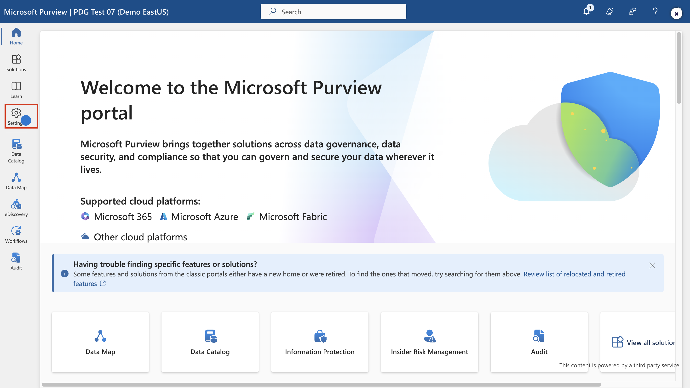

# **ラボ 5 – DLP ポリシーの作成と管理**

## 導入

あなたは、Contoso
Ltd.に新しく採用されたコンプライアンス管理者、パティ・フェルナンデスです。同社のMicrosoft
365テナントをData Loss Prevention用に設定する任務を負っています。Contoso
Ltd.は米国で運転教習サービスを提供する会社であり、機密性の高い顧客情報が社外に漏洩しないよう徹底する必要があります。

## 目的

- Microsoft Purview で DLP ポリシーを作成してテストします。

- PowerShell を使用して DLP 設定を管理します。

- Defender for Cloud Apps でファイル監視を有効にし、ファイル
  ポリシーを作成します。

- データ フローを制御するために、Power Platform の DLP を実装します。

## 演習1 – DLPポリシーの作成

### タスク1 – テストモードでのDLPポリシーの作成

この演習では、Microsoft Purview ポータルでData Loss
Preventionポリシーを作成し、機密データがユーザーによって共有されるのを防ぎます。作成する
DLP
ポリシーは、クレジットカード情報を含むコンテンツを共有するかどうかをユーザーに通知し、その情報を送信する正当な理由を提示できるようにします。ブロックアクションがまだユーザーに影響を与えないようにするため、ポリシーはテストモードで実装します。

1.  **Microsoft Edge**で、
    **+++https://purview.microsoft.com+++に移動します。 また、 Patti
    Fernandez**として**Microsoft
    Purviewポータル**にログインしていることを確認してください。

2.  **Microsoft Purviewポータルの左側のナビゲーション ウィンドウ**で、
    **\[Solution\]** \> **\[Data Loss Prevention\]**を選択します。

3.  **\[Data Loss Prevention\]**の下で**\[Policies\]**を選択し、
    **\[+Create policy\]を選択して**、新しいData Loss
    Preventionポリシーを作成するためのウィザードを開始します。

4.  **Choose what type of data to protect**ページで、 **「Data stored in
    connected sources」ラジオ ボタンが選択されていることを確認し、
    「Next」ボタン**をクリックします。

> 

5.  **「Start with a template or create a custom
    policy」**ページで、下にスクロールし、
    「**Categories**」の**「Custom」を選択します。**次に、
    **「Regulations」**の**「Custom policy」を選択します。
    「Next」ボタン**をクリックします。

6.  **「Name your DLP policy」ページ**で、 **「Name」欄**に**「+++Credit
    Card DLP Policy+++」と入力し**、
    **「Description」**欄に**「+++Protect credit card numbers from being
    shared.+ ++」と入力します。 「Next」**を選択します。

7.  **\[Assign admin units\]ページ**で、 **\[Next\]を選択します**。

> 

8.  **\[Choose where to apply the policy\]ページ**で、 **\[Teams chat
    and channel
    messages**\]**の**横にあるチェックボックスをオンにし、\[その他のリソース\]
    の横にあるチェックボックスをオフにして、**\[Next\]**ボタンをクリックします。

9.  **\[Define policy settings\]ページ**で、 \[**Create or customize
    advanced DLP rules**\] ラジオ ボタンが選択されていることを確認し、
    **\[Next\]**ボタンをクリックします。

10. **\[Customize advanced DLP rules\]ページ**で、 **\[+Create
    rule\]**を選択します。

11. \[**Create rule**\] ページで、\[**Name**\]
    フィールドに「**+++****Credit card information+++**」と入力します。

12. **\[Create rule\]ページ**の**\[Conditions\]**で**\[+Add
    condition\]**を選択し、ドロップダウン メニューから**\[Content is
    shared from Microsoft 365** **\]**を選択します。

13. 新しい**\[Content is shared from Microsoft 365\]**セクションで、
    **\[with people outside my organization\]**オプションを選択します。

14. **\[+Add condition\]**を選択し、ドロップダウン
    メニューから**\[Content contains\]**を選択します**。**

15. 新しい**\[Content
    contains\]**領域で**\[Add\]を選択し、**ドロップダウン
    メニューから**\[Sensitive Information Types\]**を選択します。

16. 右側に表示される**「Sensitive Information
    Types」パネル**の検索バーに**「Credir card
    number」と入力し、Enterキーを押します。 「Credit card
    number」の**横にあるチェックボックスをオンにし、**「Add」ボタン**を選択します。

17. **\[Create rule\]ページ**で、 **\[+Add an action\]を選択し**、
    **\[Restrict access or encrypt the content in Microsoft 365
    locations\]を選択します**。

18. **\[Restrict access or encrypt the content in Microsoft 365
    locations\]**セクションで、 **\[Block users from receiving email or
    accessing shared SharePoint, OneDrive, and Teams files, and Power BI
    items\]**ラジオ ボタンが選択されていることを確認し、次に**\[Block
    only people outside your organization\]**ラジオ
    ボタンが選択されていることを確認します。

19. **\[Create rule\]**ページの **\[User
    notifications\]セクション**で、スイッチを選択して**On**の位置に切り替えます。

20. **「Create rule」**ページの「User
    overrides**」セクションにある「Allow overrides from M365
    services」**で、「**Allow overrides from M365 services. Allows users
    in Exchange, SharePoint, OneDrive and Teams to override policy
    restrictions.**

**注**: **「Allow overrides from M365
services**」チェックボックスをオンにできなかった場合は、 **「Notify
users in Office 365 with a policy
tip」チェックボックスをオンにしてください。このポリシーヒントは、前の手順の「Create
rule」**ページの「**User notification」\>\\ \>「Microsoft 365
services」セクション**にあります。次に、「**Allow overrides from M365
services. Allows users in Exchange, SharePoint, OneDrive and Teams to
override policy
restrictions**」チェックボックスをオンにしてください**。**

21. **\[Require a business justification to
    override\]**ボックスをオンにします。

22. **Incident reports**セクションの \[**Use this severity level in
    admin alerts and reports\]**ドロップダウンで、
    **\[Low\]を選択します**。

23. **\[Save\]**を選択し、 **\[Next\]を選択します**。

24. **「Policy mode」ページ**で、 **「Run the policy in simulation
    mode」**ラジオボタンが選択されていること、および**「Show policy tips
    while in test
    mode」チェックボックス**が選択されていることを確認します。
    **「Next」**ボタンをクリックします。

25. **\[Submit\]**を選択してポリシーを作成します。

26. ポリシーが作成されたら、 **\[Done\]**を選択します。

これで、Microsoft Teams
のチャットとチャネルでクレジットカード番号をスキャンし、ユーザーがポリシーを上書きするためのビジネス上の正当な理由を提供できる
DLP ポリシーが作成されました。

### タスク2 – DLPポリシーの変更

このタスクでは、前の手順で作成した既存の DLP
ポリシーを変更して、電子メールでクレジットカード情報もスキャンし、このコンテンツを電子メールで共有するかどうかをユーザーに通知します。

1.  **「Credit Card DLP
    Policy」の**横にあるチェックボックスを選択し、下の画像に示すようにコマンド
    バーの**編集アイコン**をクリックします。

2.  **Name your DLP policy**と**Assign admin units** ページで、
    **\[Next\]を選択します**。

> 
>
> 

3.  **\[Choose where to apply the policy\]ページ**で、 **\[Exchange
    email\] の**横にあるチェックボックスのみを選択し、 **\[Review and
    finish\]ページ**が表示されるまで**\[Next\]**を選択します。

4.  ポリシーに加えた変更を適用するには、 **\[Submit\]**を選択します。

5.  ポリシーが更新されたら、 **\[Done\]**ボタンを選択します。

既存の DLP
ポリシーを変更し、コンテンツをスキャンする場所を変更しました。

### タスク3 – PowerShellでDLPポリシーを作成する

このタスクでは、PowerShell を使用して、Contoso
EmployeeIDを保護し、Exchange で共有されないようにするための DLP
ポリシーを作成します。ユーザーには、機密データを共有しようとしていることが通知され、Contoso
EmployeeIDを含むメールの送信がブロックされます。

1.  タスクバーの Windows アイコンを右クリックし、\[Windows PowerShell
    (管理者)\] を選択して管理者として実行します。

2.  **「User account control」ダイアログ ボックス**で、
    **「Yes」**ボタンをクリックします。

3.  PowerShell で次のコマンドを実行します。

**+++ Install-ModuleExchangeOnlineManagement+++**

**+++Import-ModuleExchangeOnlineManagement+++**

> 
>
> 

4.  **PowerShellウィンドウ**で、次のように入力します。

**+++Connect- IPPSSession +++**

次に、 **Patti Fernandez としてサインインします。**

「**Automatically sign in to all desktop apps and websites on this
device?**」というダイアログ ボックスが表示された場合は、「**No, this app
only**」ボタンをクリックします。

5.  すべての Exchange メールボックスをスキャンする DLP
    ポリシーを作成するには、PowerShell に次のコマンドを入力します。

**+++New-DlpCompliancePolicy -Name"EmployeeID DLP Policy" -Comment "This
policy blocks sharing of Employee IDs" -ExchangeLocation All+++**

6.  前の手順で作成した DLP ポリシーに DLP
    ルールを追加するには、PowerShell に次のコマンドを入力します。

**+++New-DlpComplianceRule -Name"EmployeeID DLP rule" -Policy"EmployeeID
DLP
Policy" -BlockAccess\\true -ContentContainsSensitiveInformation@{Name="Contoso
Employee IDs"}+++**

7.  **EmployeeID DLP ルール**を確認するには、次のコマンドを使用します。

**+++ Get-DLPComplianceRule -Identity "EmployeeID DLP rule +++**

PowerShell を使用して Exchange 内の Contoso EmpoloyeeID をスキャンする
DLP ポリシーが作成されました。

### タスク4 – テストモードでポリシーを有効化する

このタスクでは、テスト モードで作成したクレジットカード情報 DLP
ポリシーをアクティブ化して、保護アクションを適用します。

1.  **Microsoft Edge InPrivate ウィンドウ**で、
    **+++https://purview.microsoft.com+++に移動します。 また、 Patti
    Fernandez**として**Microsoft
    Purviewポータル**にログインしていることを確認してください。

2.  **Microsoft Purviewポータルの左側のナビゲーション ウィンドウ**で、
    **\[Solutions\]** \> **\[Data Loss Prevention\]を選択します**。

3.  **\[Data Loss Prevention\]**の下で**\[Policies\]**を選択し、
    **\[Credit Card DLP Policy\]**という名前のポリシーを選択して、
    **\[Edit policy\] (鉛筆アイコン)**を選択し、ポリシー
    ウィザードを開きます。

4.  **\[Next\]**を選択し**、\[Test or turn on the
    policy\]ページに**到達して、 **\[Turn the policy on
    immediately\]**を選択します。

5.  **「Next」**を選択し、
    **「Submit」を選択して**ポリシーを有効にします。

6.  ポリシーが更新されたら、 **\[Done\]を選択します**。

DLPポリシーの有効化に成功しました。ポリシーがクレジットカード情報の共有試行を検知した場合、その試行はブロックされ、ユーザーはブロック解除の正当な理由を提示できるようになります。

## 演習2 – DLPポリシーの管理

### タスク1 – ポリシーの優先順位の変更

2つのDLPポリシーを作成した後、より制限の厳しいポリシーが、より制限の緩いポリシーよりも高い優先度で処理されるようにする必要があります。そのため、EmployeeID
DLPポリシーをより高い優先度に移動します。

1.  **Microsoft Edge**で、
    **+++https://purview.microsoft.com+++に移動します。 また、 Patti
    Fernandez**として**Microsoft
    Purviewポータル**にログインしていることを確認してください。

2.  **Microsoft Purview**ポータルの左側のナビゲーション ウィンドウで、
    **\[Solutions\]** \> **\[Data Loss Prevention\]**を選択します。

3.  **「Data Loss Prevention」**の**「Policies」**を選択し、 **「Credit
    Card DLP Policy」**というポリシーを選択します。 **「Move to top
    (highest priority)」**を選択します。

4.  **Data Loss Preventionウィンドウ**で、
    **\[Refresh\]を選択し、**ポリシー
    テーブルの**\[Order\]列**で優先順位を確認します。

DLPポリシーの優先度を変更しました。両方のポリシーが同じコンテンツに一致した場合、優先度の高いポリシーのアクションが適用されます。

### タスク2 – Microsoft 365 Defenderでファイル監視を有効にする

**Microsoft
Defender**のファイルポリシーを使用したいとお考えですか？ファイルポリシーを作成する前に、Microsoft
Defender
が組織内のファイルをスキャンできるように、ファイル監視を有効にする必要があります。

1.  **Microsoft Edge**を開き、
    **+++https://security.microsoft.com+++**に移動して、 **MOD
    Administrator**として Microsoft Defender ポータルにログインします。

2.  Microsoft
    Defenderポータルで、左側のナビゲーションメニューの**「Settings」までスクロールダウンし、クリックします。
    「Settings」ページで「Cloud
    Apps」**をクリックします。

3.  **「Information Protection」**セクションまでスクロールし、
    **「Files」をクリックします**。 **「Files」ページで、「Enable file
    monitoring」**の横にあるチェックボックスをオンにし、
    **「Save」ボタン**をクリックします。

Microsoft Defender for Cloud Apps
でファイル監視が正常に有効化され、ファイル
ポリシーを使用してファイルの機密コンテンツをスキャンできるようになりました。

### タスク3 – Microsoft 365 Defenderのファイルポリシーの作成

このタスクでは、Microsoft Defender でファイル ポリシーを作成し、OneDrive
と SharePoint Online
内のファイルをスキャンし、共有されているクレジットカード情報を含むファイルを自動的に検疫します。

1.  次に、同じ**「Information Protection」セクションで「Microsoft
    Information Protection」**をクリックし、 **「Automatically scan new
    files for Microsoft Information Protection sensitivity labels and
    content inspection
    warnings」**の横にあるチェックボックスをオンにします。次に、「Save」ボタンをクリックします。

2.  **\[Inspect protected files\]**の下で、 **\[Grant
    Permission\]をクリックします**。

3.  **「Pick an account」**ダイアログボックスが表示されたら、MOD
    Administatorテナント資格情報を選択します。

4.  **「Permission requested」ページ**で、
    **「Accept」**ボタンをクリックします。

5.  権限が正常に付与されたことを示す**Active**ステータスが表示されます。

6.  サブナビゲーションの**「Connected apps」セクションで、 「App
    connectors」**をクリックし、 **Microsoft
    365**が追加されていることを確認します。

7.  次に、 **Microsoft Defender**ポータルの左側のナビゲーション
    ウィンドウで、 **\[Policies\]を展開し**、 **\[Policy
    managemnet\]を選択します**。

8.  **\[Policies\]ページ**で、 **\[Create policy\]をクリックし**、
    **\[File policy\]を選択します**。

9.  **Create file
    policy** **ページ**で、**ポリシー名フィールド**に**「+++
    Credit Card Information for files
    +++」と入力し**、**説明フィールド**に**「+++ Protect credit card
    numbers from being shared in files.+++」と入力します**。

10. **Policy severityを「Low」**
    （点灯アイコン1つ）に設定し、「**Category」が「DLP」**に設定されていることを確認してください。ファイルポリシーの場合、これがデフォルトです。

11. **Files matching all of the following** **領域**で、ドロップダウン
    メニューの**\[Public
    (Internet)\]、\[External\]、\[Public\]を展開し**、 **\[Internal\]**
    を追加します。

12. **\[Apply to\] セクション**の**\[Inspection method\]ドロップダウン
    メニュー**で、 **\[Data Classification Service\]を選択します**。

**注:**ドロップダウンに**Data Classification
Service** が表示されていない場合は、今は**「None」を選択してください**。しばらくしてから\[**Policies**\>**Policy
management** \>**All Policies**\>**Search for name: Credit
card** \>**Select Credit Card Information for
files\]に戻ってください。**

13. **\[Choose inspection type...\]ドロップダウン メニュー**で、
    **\[Sensitive Information Type...\]を選択します**。

14. **\[Select a sensitive information type\]ダイアログ
    ボックス**で、検索バーに「+++ **Credit Card Number +++」と入力し、
    \[Credit Card Number\] の横にあるチェックボックスをオンにして、
    \[Done\]ボタン**をクリックします。

15. **「Alerts」セクション**で、 **「Create an alert for each matching
    file」**の横にあるチェックボックスをオンにします。次に、 **「Save as
    default settings」**ボタンをクリックします。

16. **\[Governance actions\]セクション**で、 **\[Microsoft OneDrive for
    Business\]を展開し**、 **\[Put in user quarantine\]を選択します**。

17. **\[Governance actions\]セクション**で、 **\[Microsoft SharePoint
    Online\]を展開し**、 **\[Put in user quarantine\]を選択します**。

18. ページの下部にある**\[Create\]**を選択します。

19. 右上にある MOD
    ADMINISTARTORの**プロフィール写真**を選択し、歯車の横にある**\[Sign
    out\]**を選択して、ブラウザを閉じます。

これで、OneDrive と SharePoint
に保存されているファイルを継続的にスキャンしてクレジットカード情報を検索し、組織内で共有されている場合は隔離するファイル
ポリシーが作成されました。

### タスク4 – Power PlatformのDLPポリシーの作成

会社では、Power Automate フローを使用して SharePoint Online と
SalesForce 間でデータを共有しています。このタスクでは、Power Platform の
DLP
ポリシーを作成します。このポリシーでは、既存のフローは引き続き動作しますが、SharePoint
Online
と非ビジネスとして定義されたアプリ間でデータを共有するフローの作成を禁止します。

1.  **Microsoft Edge**で、
    **+++https://admin.powerplatform.microsoft.com+++に移動します。 MOD
    ADMINISTARTOR**として Power Platform 管理センターにログインします。

2.  **Power Platform admin
    center**ページで、下の画像に示すように、トグル
    ボタンをオフにして、**New admin center**を無効にします**。**

3.  **「Feedback to Microsoft」ダイアログ
    ボックスが表示された**場合は、閉じます。

4.  **Power Platform admin center**の左側のナビゲーション ウィンドウで、
    **\[Policies\]**のドロップダウンを選択し、 **\[Data
    policies\]を選択します**。

5.  **\[Data policies\]ページ**で、 **\[+New Policy\]**を選択します。

6.  **\[Name your policy\]ページ**で、 **「 +++Tenant-wide SharePoint
    Policy+++ 」と入力し**、 **\[Next\]を選択します**。

7.  **\[Non-business |
    Default\]タブ**で**\[SharePoint**と**Salesforce\]**を選択し、ページの上部にある**\[Move
    to Business\]**を選択します。

8.  **\[Assign connectors\]ページ**で**\[Buisness\]タブ**を選択し、
    SharePoint と Salesforce の両方が表示されていることを確認します。

9.  **\[Next\]を2回**選択します。

10. **\[Define scope\]ページ**で、 **\[Add all
    environments\]を選択し**、 **\[Next\]を選択します**。

11. **\[Review and create policy\]ページ**でポリシー設定を確認し、
    **\[Create policy\]** を選択します。

これで、SharePoint Online コネクタと Salesforce
以外のコネクタを含むフローをユーザーが作成できないようにする Power
Platform DLP ポリシーが作成されました。

## まとめ：

このラボでは、Microsoft Teams、Exchange、OneDrive、SharePoint、Power
Platform
全体でクレジットカード番号や従業員IDなどの機密データを保護するためのData
Loss Prevention (DLP) ポリシーを作成および管理しました。Microsoft
Purview と PowerShell
を使用してポリシーを構築し、ユーザー通知とオーバーライドを有効化し、ポリシーの優先順位付けを行い、Microsoft
Defender
でファイル監視を有効化し、ファイルの検疫アクションを構成しました。さらに、非ビジネスコネクタとのデータ共有を制限する
Power Platform DLP ポリシーも作成しました。
