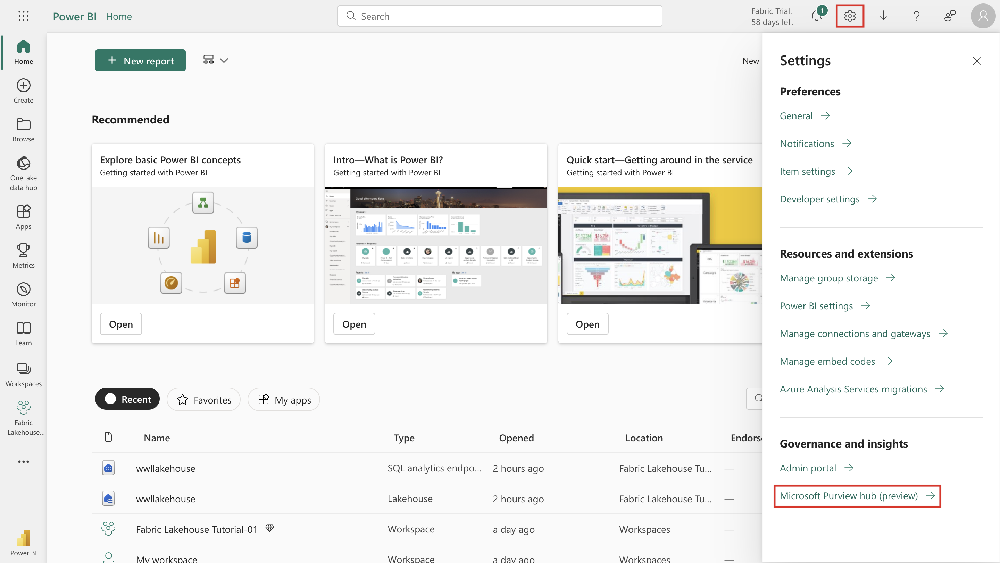
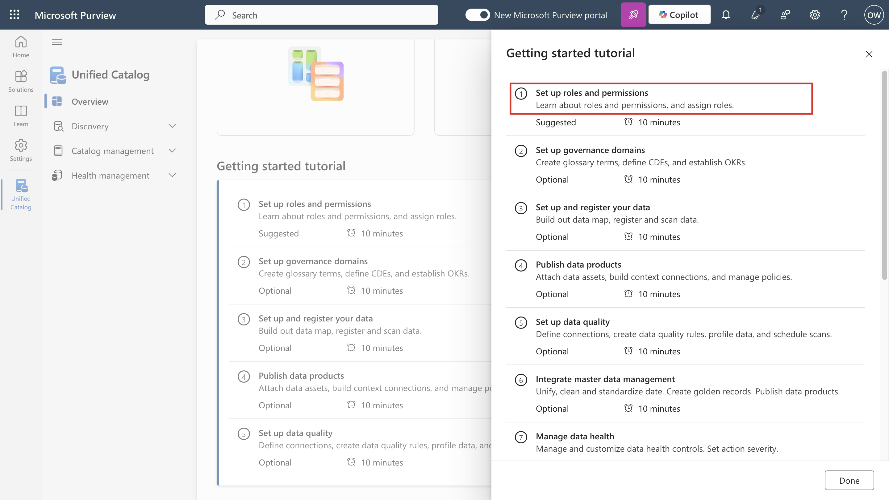
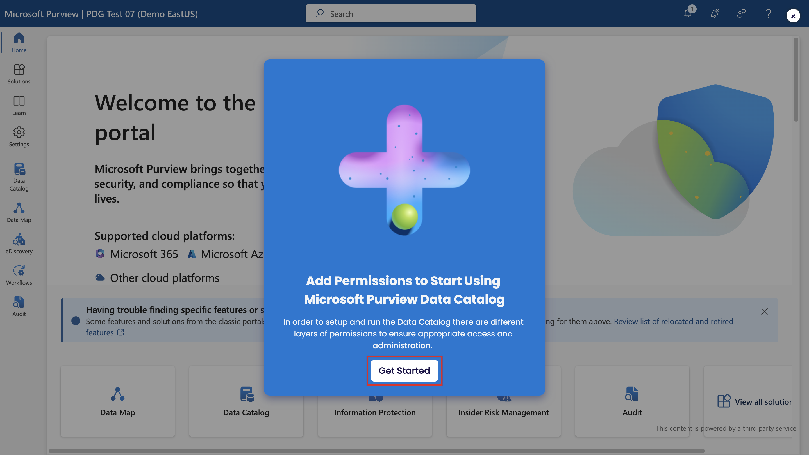

**实验室 5_创建和管理 DLP 策略**

## 介绍

你是 Patti Fernandez，是 Contoso Ltd.
新聘用的合规性管理员，负责配置公司的 Microsoft 365
租户以防止数据丢失。Contoso Ltd.
是一家在美国提供驾驶指导的公司，您需要确保敏感的客户信息不会离开组织。

## 目标 

- 在 Microsoft Purview 中创建和测试 DLP 策略。

- 使用 PowerShell 管理 DLP 设置。

- 在 Defender for Cloud Apps 中启用文件监视并创建文件策略。

- 为 Power Platform 实施 DLP 以控制数据流。

## 练习 1 – 创建 DLP 策略

### 任务 1 – 在测试模式下创建 DLP 策略

在本练习中，你将在 Microsoft Purview
门户中创建数据丢失防护策略，以保护敏感数据不被用户共享。你创建的 DLP
策略将通知用户是否要共享包含信用卡信息的内容，并允许他们提供发送此信息的理由。该策略将在测试模式下实现，因为您不希望阻止作影响您的用户。

1.  在 **Microsoft Edge** 中，导航到
    **+++https://purview.microsoft.com+++**，并确保以 **Patti
    Fernandez** 身份登录到 **Microsoft Purview** 门户。 

2.  在Microsoft Purview 门户的左侧导航窗格中，选择“**Solutions** \>
    **Data loss prevention**”。

3.  在“**Data loss
    prevention**”下，选择“**Policies**”，然后选择“**+Create
    policy**”以启动用于创建新数据丢失防护策略的向导。

4.  在“**Choose what type of data to protect**”页面上，确保已选择“**Data
    stored in connected sources**”单选按钮，然后单击“**Next**”按钮。

> 

5.  在“**Start with a template or create a custom
    policy**”页上，向下滚动并选择“**Categories**”下的“**Custom**”。然后，选择“**Regulations**”下的“**Custom
    policy**”。单击“下一步”按钮。 

6.  在“**Name your DLP policy** ”页上，在“**Name**”字段中键入
    **+++Credit Card DLP Policy+++** ，在“**Description**”字段中键入
    **+++Protect credit card numbers from being
    shared.+++**。选择**Next**。

7.  在 **Assign admin units** 页上，选择 **Next**。

> 

8.  在“**Choose where to apply the policy**”页上，选中“**Teams chat and
    channel
    messages** ”旁边的复选框，并取消选中其他资源旁边的复选框，然后单击“**Next**”按钮。

9.  在“**Define policy settings** ”页上，确保选中“**Create or customize
    advanced DLP rules**”单选按钮，然后单击“**Next**”按钮。

10. 在“**Customize advanced DLP rules** ”页上，选择“**+ Create rule**”。

11. 在“**Create rule**”页上，在“**Name**”字段中键入 **+++Credit card
    information+++** 。 

12. 在“**Create rule** ”页上的“**Conditions**”下，选择“**+ Add
    condition** ”，然后从下拉菜单中选择“**Content is shared from
    Microsoft 365** ”。 

13. 在新的“**Content is shared from Microsoft 365** ”部分中，选择“**with
    people outside my organization**”选项。

14. 选择 **+ Add Condition**，然后从下拉菜单中选择 **Content
    contains**。

15. 在新的“**Content
    contains** ”区域中，选择“**Add**”，然后从下拉菜单中选择“**Sensitive
    info types** ”。

16. 在右侧显示的“**Sensitive info types**”窗格中，在搜索栏中键入
    **credit card number**，然后按 Enter 按钮。选中 **Credit Card
    Number** 旁边的复选框，然后选择 **Add** 按钮。

17. 在“**Create rule** ”页上，选择**+ Add an
    action** ”，然后选择“**Restrict access or encrypt the content in
    Microsoft 365 locations**”。

18. 在“**Restrict access or encrypt the content in Microsoft 365
    locations** ”部分下，确保选中“**Block users from receiving email or
    accessing shared SharePoint, OneDrive, and Teams files, and Power BI
    items**”单选按钮，然后确保选择“**Block only people outside your
    organization**”单选按钮。

19. 在“**Create rule** ”页的“**User
    notifications** ”部分中，选择开关以将其置于“**On**”位置。

20. 在“**Create rule** ”页的“**User overrides**”部分的“**Allow overrides
    from M365 services**”下，选中“**Allow overrides from M365
    services**”框。**Allows users in Exchange, SharePoint, OneDrive and
    Teams to override policy restrictions**。

**注意：** 如果无法选中“**Allow overrides from M365
services**”复选框，请启用“**Notify users in Office 365 with a policy
tip**”复选框，其中包含策略提示，该提示可在上一步的“**User notification
\>\\ \>Microsoft 365 services** ”部分下的“**Create
rule**”页上找到。然后选中“**Allow overrides from M365 services. Allows
users in Exchange, SharePoint, OneDrive and Teams to override policy
restrictions**。

21. 选中 **Require a business justification to override**。

22. 在“**Incident reports** ”部分的“在**Use this severity level in admin
    alerts and reports**”下拉列表中，选择“**Low**”。

23. 选择“**Save**”，然后选择“**Next**”。

24. 在“**Policy mode**”页上，确保选中“**Run the policy in simulation
    mode** ”单选按钮，并确保选中“**Show policy tips while in test
    mode**”旁边的复选框。然后，单击“**Next**”按钮。

25. 选择**“Submit ”**以创建策略。

26. 创建策略后，选择“**Done”**。

现在，你已创建了一个 DLP 策略，该策略扫描 Microsoft Teams
聊天和频道中的信用卡号，并允许用户提供业务理由来替代该策略。

### 任务 2 – 修改 DLP 策略

在此任务中，您将修改在上一步中创建的现有 DLP
策略，以同时扫描电子邮件中的信用卡信息，并通知用户是否要在电子邮件中共享此内容。

1.  选中“**Credit Card DLP
    Policy**”旁边的复选框，然后单击命令栏中的“**Edit**”图标，如下图所示。

2.  在“**Name your DLP policy** 和 **Assign admin
    units** ”页上，选择“**Next**”。 

> 
>
> 

3.  在“**Choose where to apply the policy**”页上，仅选中 **Exchange
    email** 旁边的复选框，然后选择“**Next** ”，直到到达“**Review and
    finish** ”页。

4.  选择“**Submit** ”以应用在策略中所做的更改。

5.  更新策略后，选择“**Done**”按钮。

现在，你已修改现有的 DLP 策略，并更改了它扫描内容的位置。

### 任务 3 – 在 PowerShell 中创建 DLP 策略

在此任务中，你将使用 PowerShell 创建 DLP 策略来保护 Contoso EmployeeID
并阻止它们在 Exchange
中共享。用户将收到通知，他们正在尝试共享敏感数据，如果电子邮件包含
Contoso EmployeeID，则会被阻止发送电子邮件。

1.  右键单击任务栏上的 Windows 图标，然后选择 Windows
    PowerShell（管理员）以管理员身份运行它。

2.  在“**User Account Control** ”对话框中，单击“**Yes**”按钮。

3.  在 PowerShell 中，执行以下命令:

**+++Install-ModuleExchangeOnlineManagement+++**

**+++Import-ModuleExchangeOnlineManagement+++**

> 
>
> 

4.  在 **PowerShel**l 窗口中，输入

**+++Connect-IPPSSession+++**

然后以 **Patti Fernandez** 身份登录。

如果 **Automatically sign in to all desktop apps and websites on this
device?** 出现对话框，然后单击“**No, this app only**”按钮。

5.  在 PowerShell 中输入以下命令以创建扫描所有 Exchange 邮箱的 DLP 策略:

**+++New-DlpCompliancePolicy -Name"EmployeeID DLP Policy" -Comment "This
policy blocks sharing of Employee IDs" -ExchangeLocation All+++**

6.  在 PowerShell 中输入以下命令，将 DLP 规则添加到在上一步中创建的 DLP
    策略:

**+++New-DlpComplianceRule -Name"EmployeeID DLP rule" -Policy"EmployeeID
DLP
Policy" -BlockAccess\\true -ContentContainsSensitiveInformation@{Name="Contoso
Employee IDs"}+++**

7.  使用以下命令查看 **EmployeeID DLP rule**:

**+++Get-DLPComplianceRule -Identity "EmployeeID DLP rule"+++**

现在，你已创建了一个 DLP 策略，该策略使用 PowerShell 在 Exchange 中扫描
Contoso EmpoloyeeID。

### 任务 4 – 在测试模式下激活策略

在此任务中，您将激活在测试模式下创建的信用卡信息 DLP
策略，以便它强制执行其保护作。

1.  在 **Microsoft Edge InPrivate** 窗口中，导航到
    **+++https://purview.microsoft.com+++**，并确保以 **Patti
    Fernandez** 身份登录到 **Microsoft Purview** 门户。 

2.  在 **Microsoft Purview** 门户的左侧导航窗格中，选择“**Solutions** \>
    **Data loss prevention**”。

3.  在“**Data loss
    prevention**”下，选择“**Policies**”，然后选择名为“**Credit Card DLP
    Policy** ”的策略，然后选择“**Edit policy**”（铅笔图标）
    以打开策略向导。

4.  选择“**Next**”，直到到达“**Test or turn on the
    policy** ”页，然后选择“**Turn the policy on immediately**”。 

5.  选择“**Next**”，然后选择“**Submit**”以激活策略。

6.  更新策略后，选择“**Done”**。

已成功激活 DLP
策略。如果策略检测到共享信用卡信息的尝试，它现在将阻止该尝试，并允许用户提供业务理由来替代阻止作。

## 练习 2 – 管理 DLP 策略

### 任务 1 - 修改策略优先级

创建两个 DLP
策略后，需要确保以比限制性较低的策略更高的优先级处理限制性更强的策略。因此，你希望将
EmployeeID DLP 策略移动到更高的优先级。

1.  在 **Microsoft Edge** 中，导航到
    **+++https://purview.microsoft.com+++**，并确保以 **Patti
    Fernandez** 身份登录到 **Microsoft Purview** 门户。

2.  在 **Microsoft Purview** 门户的左侧导航窗格中，选择“**Solutions** \>
    **Data loss prevention**”。.

3.  在“**Data loss
    prevention**”下，选择“**Policies**”，然后选择名为“**Credit Card DLP
    Policy**”的策略。选择“**Move to top (highest priority)**”。

4.  在“**Data loss
    prevention** ”窗口中，选择“**Refresh**”，然后查看策略表的“**Order**”列中的优先级。 

已成功修改 DLP
策略的优先级。如果两个策略都匹配相同的内容，则将强制执行优先级较高的策略的作。

### 任务 2 – 在 Microsoft 365 Defender 中启用文件监视

你想要在 **Microsoft Defender** 中使用文件策略来保护 OneDrive 和
SharePoint Online
位置中的文件。在创建文件策略之前，需要启用文件监视，以便 Microsoft
Defender 可以扫描组织中的文件。

1.  打开 **Microsoft Edge** 并导航到
    **+++https://security.microsoft.com+++**，然后以 **MOD
    Administrator** 身份登录到 Microsoft Defender 门户。 

2.  在 Microsoft Defender
    门户中，向下滚动到左侧导航菜单中的“**Settings**”，然后单击它。在“**Settings**”页中，单击“**Cloud
    Apps**”。

3.  现在，向下滚动到 **Information Protection** 部分，然后单击
    **Files**。在“**Files**”页面中，选中“**Enable file
    monitoring**”旁边的复选框，然后单击“**Save**”按钮。

你已成功在 Microsoft Defender for Cloud Apps
中启用了文件监视，现在可以使用文件策略扫描文件中的敏感内容。

### 任务 3 – 为 Microsoft 365 Defender 创建文件策略

在此任务中，你想要在 Microsoft Defender 中创建文件策略，以扫描 OneDrive
和 SharePoint Online
中的文件，并自动隔离包含信用卡信息的文件（如果这些文件是共享的）。

1.  现在，在同一“**Information Protection**”部分下，单击“**Microsoft
    Information Protection**”，然后选中“**Automatically scan new files
    for Microsoft Information Protection sensitivity labels and content
    inspection warnings**”旁边的复选框。然后，单击“保存”按钮

2.  在“**Inspect protected files**”下，单击“**Grant Permission**”。

3.  此时将显示“**Pick an account**”对话框，然后选择 MOD 管理员租户凭据。

4.  在 **Permissions requested** 页面中，单击 **Accept** 按钮。

5.  您将观察到“**Active**”状态，指示权限已成功授予。

6.  在子导航的“**Connected apps**”部分下，单击“**App
    Connectors**”，然后确保已添加 **Microsoft 365**。

7.  现在，在 **Microsoft Defender**
    门户左侧导航窗格中，展开“**Policies**”，然后选择“**Policy
    management**”。

8.  在“**Policies**”页上，单击“**Create policy**”，然后选择“**File
    policy**”。

9.  在“**Create file policy** ”页上，在“**Policy name** ”字段中键入
    **+++Credit Card Information for
    files+++**，然后在“**Description**”字段中键入 **+++Protect credit
    card numbers from being shared in files.+++**。

10. 将 **Policy Severity** 保持在 **Low** （一个亮起的图标） ，并确保将
    **Category** 设置为 **DLP**。对于文件策略，这应该是默认值。

11. 在 **Files matching all of the following**  区域中，展开下拉菜单
    **Public (Internet), External, Public**，然后添加 **Internal**。

12. 在“**Apply to**”部分的“**Inspection Method**”下拉菜单中，选择“**Data
    Classification Service**”。

**注意**：如果在下拉列表中尚未看到“**Data Classification
Service** ”，请选择“**None**”。完成后，一段时间后返回“**Policies**\>**Policy
management** \>**All Policies**\>**Search for name: Credit
card** \>**Select Credit Card Information for files**”**。**

13. 在 **Choose inspection type…** 下拉菜单，选择“**Sensitive
    information type…**”。

14. 在“**Select a sensitive information type**”对话框中，在搜索栏中键入
    +++**Credit Card Number+++**，选中“**Credit Card
    Number**”旁边的复选框，然后单击“**Done**”按钮。

15. 在“**Alerts**”部分下，选中“为**Create an alert for each matching
    file**”旁边的复选框。然后，单击 **Save as default settings** 按钮。

16. 在“**Governance actions** ”部分中，展开“**Microsoft OneDrive for
    Business**”，然后选择“**Put in user quarantine**”。

17. 在“**Governance actions** ”部分中，展开“**Microsoft SharePoint
    Online**”，然后选择“**Put in user quarantine**”。

18. 选择页面底部的 **Create**。 

19. 选择右上角 MOD 管理员的 **Profile picture** ，然后选择齿轮旁边的
    **Sign out**，然后关闭浏览器。

现在，你已创建了一个文件策略，该策略将持续扫描保存在 OneDrive 和
SharePoint
中的文件以获取信用卡信息，并在组织内部共享这些文件时对其进行隔离。

### 任务 4 – 为 Power Platform 创建 DLP 策略

您的公司使用 Power Automate 流在 SharePoint Online 和 SalesForce
之间共享数据。在此任务中，您将为 Power Platform 创建一个 DLP
策略，该策略允许您的现有流继续工作，但阻止创建将在 SharePoint Online
和定义为非业务的应用之间共享数据的流。

1.  在 **Microsoft Edge** 中，导航到
    **+++https://admin.powerplatform.microsoft.com+++**并以 **MOD
    Administrator** 身份登录 Power Platform 管理中心。

2.  在 **Power Platform admin center** 页面中，通过关闭切换按钮来禁用
    **New admin center**，如下图所示。

3.  如果出现“**Feedback to Microsoft**”对话框，请将其关闭。

4.  在 **Power Platform admin center** 的左侧导航窗格中，选择
    **Policies**下拉列表，然后选择 **Data policies**。

5.  在“**Data policies** ”页上，选择“**+ New Policy**”。

6.  在“**Name your policy** ”页上，键入 **+++Tenant-wide SharePoint
    Policy+++**，然后选择“**Next**”。

7.  关于 **Non-business | Default** 选项卡，选择 **SharePoint** 和
    **Salesforce**，然后选择页面顶部的 **Move to Business** 。

8.  在“**Assign connectors** ”页中，选择“**Business** ”选项卡，以确保
    SharePoint 和 Salesforce 现在同时显示。

9.  选择“**Next** ”两次。

10. 在“**Define scope** ”页上，选择“**Add all
    environments**”，然后选择“**Next**”。

11. 在“**Review and create
    policy** ”页上，查看策略设置，然后选择“**Create policy**”。

您现在已经创建了一个 Power Platform DLP 策略，该策略阻止用户创建涉及
SharePoint Online 连接器和任何非 Salesforce 连接器的流。

## 总结：

在本实验室中，你创建并管理了数据丢失防护 （DLP） 策略，以保护 Microsoft
Teams、Exchange、OneDrive、SharePoint 和 Power Platform
中的敏感数据，如信用卡号和员工 ID。你使用 Microsoft Purview 和
PowerShell 生成策略、启用用户通知和替代、优先级策略、在 Microsoft
Defender 中激活文件监视以及配置文件隔离作。此外，您还创建了 Power
Platform DLP 策略来限制与非业务连接器的数据共享。
