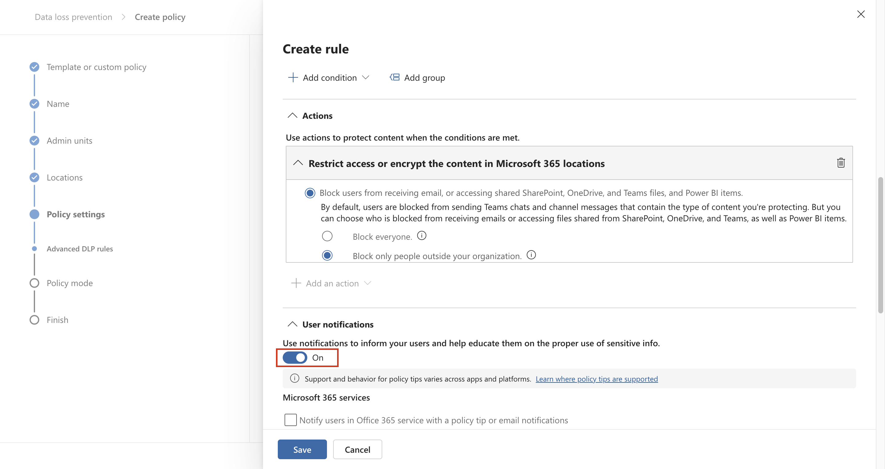
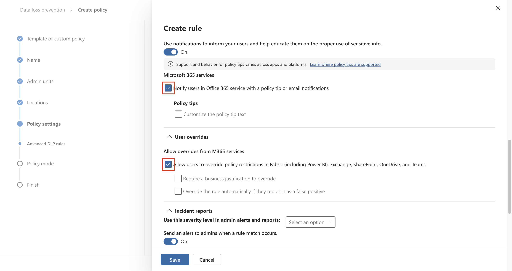

# **ラボ6 – Insider Risk Managementの設定**

## 導入

このラボでは、Insider Risk Managementポリシーを使用してInsider Risk
Managementを構成する方法を学習します。ラボ1で作成したSensitive
Information
Typesとラボ4で作成したDLPポリシーを使用して、リスクの高いブラウザの使用やデータの盗難・漏洩から組織を保護するポリシーを作成します。

これを実現するために、組織内のデバイスを表すインフラストラクチャをAzureに構築します。これらのデバイスをAzure
ADとIntuneにオンボードし、MDMエージェントをインストールして、これらのデバイスからアラートを受信できるようにする方法を学習します。

## 目的

- VM クロックを同期して、ポリシー テストの正確な時間設定を確保します。

- Microsoft Purview の Insider Risk Management
  役割グループにユーザーを割り当てます。

- テナントおよびユーザー レベルでインサイダー
  リスクを検出するための分析情報を有効にします。

- インサイダー リスクを監視するために、Windows 10 デバイスを Microsoft
  Defender for Endpoint にオンボードします。

- 次の Insider リスク管理ポリシーを作成して構成します。

  - 危険なブラウザの使用

  - 退会したユーザーによるデータ盗難

  - ユーザーによるデータ漏洩

- 各ポリシーにスコアを付けて、MOD
  ADMINISTRATORアカウントの内部リスク検出シナリオをシミュレートします。

## 演習1: 環境を設定する

### タスク0: VMクロックを同期する

1.  VM 上で開いている Microsoft Edge ブラウザーのタブをすべて閉じます。
    **Windowsアイコン**をクリックし、下の画像に示すように**\[Settings\]をクリックします。**

2.  **Windows Settingsの検索バー**に**「+++data and
    time+++」**と入力し、リストから**「Date & time
    settings」**を選択します。

3.  **\[Date &time」ページ**で、 **「Sync
    now」**ボタンに移動してクリックします。

## 演習 2: Insider Risk Managementポリシーを作成します。

### 前提条件

#### ステップ1 – Insider Risk Management役割グループにユーザーを追加する

1.  Microsoft
    Purviewポータルが開いている場合は手順2に進みます。開いていない場合は、
    **+++https://purview.microsoft.com+++を開きます。** MOD
    Administratorの資格情報を使用してログインします。

2.  左側のナビゲーション メニューで、 **\[Settings\]**
    をクリックします。

3.  **Settingsパネル**で、 **「Roles and scopes」**をクリックします。
    **「Role groups」をクリックし、 「Insider Risk
    Management」**の横にあるチェックボックスをオンにして、鉛筆アイコンをクリックして編集します。

4.  **Edit Members of the role group** **ページ**で、**Choose
    users**をクリックします。

5.  **Alex Wilber の**横にあるチェックボックスをオンにします。次に、
    **「Select」**ボタンをクリックします。

**注意**: メンバー編集名に Megan Bowen と MOD
ADMINISTRATOR名が表示されない場合は、Alex 名に加えて、Megan Bowen と MOD
ADMINISTRATOR名も選択してください。

6.  MOD Administrator、Megan Bowen、Alex Wilber
    の名前が表示されていることを確認し、
    **\[Next\]**ボタンをクリックします。

7.  **\[Save\]**を選択して、ユーザーをロール グループに追加します。

8.  手順を完了するには、 **「Done」を**選択します。

#### ステップ2 – インサイダーリスク分析のインサイトを有効にする

1.  Microsoft Purviewポータルで、
    **「Settings」**に移動し、下にスクロールして**「Insider Risk
    Management」**をクリックします。 **「Insider Risk Management
    settings**-**Analytics」ページで、 「Show insights at tenant
    level」**と**「Show insights at user
    level」の**トグルをオンにします。
    **「Save」ボタン**をクリックします。

#### ステップ3 – デバイスのオンボーディング

この展開シナリオでは、まだオンボードされていないデバイスをオンボードし、Windows
10 デバイスでの内部リスク
アクティビティを検出することのみを目的としています。

インサイダー リスク ポリシーを作成するための前提条件として、デバイス/VM
を Microsoft Entra ID に登録する必要があります。

1.  Windows
    アイコンをクリックし、下の画像に示すように**\[Settings\]を選択します。**

2.  **「Accounts」** \> **「Access work or school」**に移動します。
    **「Access work or school」ページ**で、
    **「Connect」をクリックします**。

3.  **\[Set up a work or school account\]プロンプト**で、 **\[Join this
    device to Microsoft Entra ID\]をクリックします**。

4.  サインイン プロンプトで、ラボ環境のリソース タブに指定された**MOD
    Administratorの**資格情報を使用してサインインします。

5.  **「Make sure this is your
    organisation」**ダイアログボックスで、「**Join」**ボタンをクリックします。

6.  完了すると確認ウィンドウ: **You're all set!**が表示されます。
    **「Done」**をクリックします。

7.  もう一度、 **\[Access work or school\]**ページで、
    **\[Connect\]をクリックします**。

8.  **Set up a work or school account** **プロンプト**で、MOD
    Administratorの資格情報を使用してログインします。

9.  **\[Stay signed in?\]**ダイアログ ボックスで、
    **\[Yes\]**ボタンをクリックします。

10. **Setting up your device** **の**ダイアログ
    ボックスが表示されたら、\[**Got it**\] を選択し**ます**。

11. 次に、**windows settings** \> **Accounts** \> **Access work or
    school** \> **Connected to Contoso
    MDM** \> **Info** \> **Sync**に移動します。

12. VM上のWindowsシンボルをクリックします。ユーザー**「Admin」**を選択し、
    「Sign out」を選択します。

13. ユーザー画面で**「Other user」を選択します**。

14. ラボ環境のホームページに記載されている O365 資格情報を入力し、 **MOD
    Administrator**として VM にログインします。

15. ラボ VM でMOD Administrator**アカウント**を使用して+++
    **https://security.microsoft.com/+++にサインインします。**

16. **Settings** \> **Device** **onboarding \>
    Devices**を選択してください。**Turn on Device
    onboarding**をクリックします。

17. **\[Turn on device onboarding\]**ダイアログボックスで、
    **\[OK\]**ボタンをクリックします。

18. **Device monitoring is being turned on**ダイアログボックスで、
    **\[OK\]**ボタンをクリックします。

19. 数分待ってからページを更新してください。

20. **settings** \> **Device onboarding** \> **Onboarding**から、
    **「Download package」**をクリックします。

21. ダウンロードしたら、ファイルをデスクトップにコピーします。ファイルを右クリックし、「**Extract
    all…」**を選択し、 **「Extract」**ボタンをクリックします。

22. **Administrator権限**でファイルを実行します。

23. **「Search for app in the Store?**」のダイアログ
    ボックスが表示された場合は、
    **「Yes」**ボタンをクリックし、それ以外の場合は無視します。

24. \[**The publisher could not be verified. Are you sure you want to
    run this software?」**というダイアログボックスが表示されたら、
    **「Run」**ボタンをクリックします。

25. **「User Account Control」**ダイアログ
    ボックスが表示されたら、「**Yes**」ボタンをクリックし**ます**。

26. コマンドプロンプトで**Yを押し**、Enterキーを押して確定します。デバイスがオンボードされたことを示すメッセージが表示されます。**Command
    Prompt**で「**Press any key to continue . .
    .」**というメッセージが表示されたら、任意のキーを押してください。

27. コマンド プロンプトが閉じられたら、 Windows
    検索バーに**「cmd」**と入力してコマンド
    プロンプトを管理者モードで開き、**Command
    Prompt**を右クリックして「**Run as administrator**」を選択します。

28. **\[User Account Control\]ダイアログ ボックス**で、\[Yes\]
    ボタンをクリックします。

29. 次のコマンドを実行して検出テストを実行します。コマンドプロンプトウィンドウは自動的に閉じます。

**+++powershell.exe -NoExit -ExecutionPolicy Bypass -WindowStyleHidden
$ErrorActionPreference=
'silentlycontinue';(New-ObjectSystem.Net.WebClient ).DownloadFile ('
http://127.0.0.1/1.exe','C:\test-WDATP-test\invoice.exe ' );Start
-Process 'C:\test-WDATP-test\invoice.exe'+++**

30. VM 接続を閉じます。

31. ナビゲーションの**settings**をクリックして設定を開き、**Devices
    Onboarding** \> **Devices**を選択します。

**注:**デバイスのオンボーディングが有効になるまでに通常約 60
秒かかりますが、最大 30 分ほどかかる場合があります。

32. **Devices**リストを確認できます。デバイスをオンボードするまでリストは空ですが、完了すると、VMがオンボードされたデバイスとして表示されます。

### タスク1: 危険なブラウザの使用を検出してスコア付けするための組織全体のポリシーを作成する

#### ステップ1 – 新しいポリシーを作成する

1.  Microsoft Purviewポータルで、「ソリューション」をクリックし、
    **「Insider Risk
    Management」**をクリックします。 

2.  **「Policies」**をクリックします。「Policies」ページで、 **「+Create
    policy」\>「Custom policy」**をクリックします。

3.  \[Choose a policy template\] ページで、\[Risky browser usage
    (preview)\] の \[Risky browser usage (preview)\] を選択します。

4.  すべての前提条件を確認してください。

5.  **「Next」**を選択してください。

6.  **「Name and description」ページ**で、次のフィールドに入力します。

    - Name (required): Risky usage of browser

    - Description (optional): This is a test policy for the risky
      browser usage.

7.  **「Next」**を選択してください。

8.  「Choose users and groups」ページで、「Include all users and
    groups」を選択します。「Next」を選択して続行します。

9.  **「Choose users, groups, & adaptive scopes」ページ**で、「**All
    users, groups, & adaptive scopes」を選択します**。
    **「Next」を選択して**続行します。

> 

10. **\[Exclude users and groups\]**ページで、
    **\[Next\]**を選択します。

11. 「Decide whether to
    prioritize」ページで、「今は優先コンテンツを指定しません」（ポリシー作成後に指定できるようになります）を選択します。「Next」を選択して続行します。

12. **\[Choose triggering event for this policy\]**ページで、 **\[Turn
    on indicators\]**ボタンを選択します。

13. **Turn on indicators for your
    organization**ダイアログボックスで、下にスクロールして、**Choose
    indicators to turn on**ボタンをクリックします。

14. **\[Choose indicators to turn on\]**ダイアログ ボックスで、\[Risky
    browsing indicators (preview)\]
    のすべてのインジケーターが選択されていることを確認します。

15. 下にスクロールして**「Save」**を選択します。

16. **「Choose triggering event for this policy」ページ**で、 **「User
    browsed to a potentially risky
    website」**の横にあるラジオボタンが選択されていることを確認します。
    **「Select which activities will trigger this
    policy」**の下で、すべてのオプションを選択し、
    **「Next」**ボタンをクリックします。

17. **\[Choose thresholds for triggering events\]ページ**で、 **\[Choose
    your own thresholds\]**ラジオ ボタンを選択し、すべてのしきい値を 1
    日あたり 1 に変更して、 **\[Next\]**を選択します。

> 

18. **Indicators**ページで、 **\[Next\]**を選択します。

19. **\[Choose threshold type for indicators\]ページ**で、 **\[Apply
    thresholds provided by Microsoft\]が選択されていることを確認し、
    \[Next\]ボタン**をクリックします。

20. **Review settings and finish**ページで、
    **\[Submit\]**を選択します。

21. **「Your policy was created」**ページで、 **「Done」**を選択します。

22. タブを開いたまま、次のタスクに進みます。

#### ステップ2 – ポリシーを評価する

1.  「Risky usage of
    browser」という新しいポリシーをクリックします。「**Start scoring
    activity for users」**を選択します。

2.  「Reason for scoring activity」フィールドに「**Testing the
    policy」**と入力します。 **「Scoring activity for this many days
    (between 5 and 30)」**フィールドで**「10 days」**を選択します。

3.  ユーザーのアクティビティをスコアリングするフィールドに「MOD」と入力し、MOD
    Administratorを選択します。

4.  次に、 **「Start scoring activity」**ボタンをクリックします。

5.  **\[Close\]ボタン**をクリックします。

### タスク2: 退職ユーザーによるデータ盗難

#### ステップ1 – 新しいポリシーを作成する

1.  **「Policies」**ページで、 **「+ Create policy」**をクリックし、
    **「Custom policy」**を選択します。

2.  「Choose a policy template」ページで、「Data theft」の「Data theft
    by departing users」を選択します。「Next」を選択して続行します。

3.  **「Name and description」ページ**で、次のフィールドに入力します。

    - Name (required): Data theft by a user

    - Description (optional): This is a test policy forthe preventing
      data theft.

4.  **「Next」**を選択してください。

5.  「Choose users and groups」ページで、「Include all users and
    groups」を選択します。「Next」を選択して続行します。

6.  「Decide whether to prioritize」ページで、「I want to specify
    priority content」を選択します。「Sensitivity Labels」と「Sensitive
    Information
    Types」のチェックボックスのみをオンにします。「Next」を選択して続行します。

7.  「Sensitivity labels to prioritize」ページで、「Add or edit
    sensitivity labels」を選択します。「Add or edit sensitivity
    labels」検索バーに「従業員」と入力してEnterキーを押し、「Internal/Employee
    data
    (HR) 」を選択して「Add」を選択します。「Next」をクリックします。

8.  「Sensitive info types to prioritize ページで、「Add or edit
    sensitive info
    types」を選択します。ポップアップウィンドウで、「Credit Card
    number」、「Contoso Employee ID」、「Contoso Employee
    EDM」を検索して選択します。「Add」を選択します。「Next」をクリックします。

9.  「Decide whether to score only activity with priority
    content」で、「Get alerts for all
    activity」を選択します。「Next」を選択します。

10. **\[Choose triggering event for this
    policy\]ページ**で、デフォルトの選択をそのままにして**\[Next\]を選択します**。

11. **\[Indicators\]ページ**で、 **\[Office indicators (31/31
    selected)\] の**横にあるドロップダウンをクリックします。

12. すべての Office インジケーターが選択されていることを確認し、
    **\[Next\]**ボタンをクリックします。

13. **Detenction
    optionsページ**のすべてのパラメータをデフォルト状態のままにして、
    **「Next」**ボタンをクリックします。

14. **\[Choose threshold type for indicators\]ページ**で、 **\[Choose
    your own thresholds\]**の横にあるラジオ
    ボタンを選択し、下にスクロールして \[Office インジケーター\]
    ドロップダウンをクリックします。

15. \[Sharing SharePoint files with people outside the organization\]
    で、各ステージにそれぞれ 1、2、3 のイベントを使用し、\[Next\]
    を選択します。

16. **Review settings and finish**ページで、
    **\[Submit\]**ボタンをクリックします。

17. Your policy was createdで、\[Done\] を選択します。

#### ステップ2 – ポリシーを評価する

1.  「Data theft by a
    user」という新しいポリシーをクリックします。「Start scoring activity
    for users」を選択します。

2.  「Reason for scoring activity」フィールドに「**Testing the
    policy」と入力します**。 **「Scoring activity for this many days
    (between 5 and 30)」**フィールドで**「10 days」**を選択します。

3.  ユーザーのアクティビティをスコアリングするフィールドに「MOD」と入力し、MOD
    Administratorを選択します。

4.  次に、 **「**Start Scoring activity**」**ボタンをクリックします。

5.  \[Close\]**ボタン**をクリックします。

### タスク3: ユーザーによるデータ漏洩

#### ステップ1 – 新しいポリシーを作成する

1.  「Policies」**ページ**で、 **「+ Createt Policy」**をクリックし、
    **「Custom policy」を選択します**。

2.  **「Choose a policy template」ページ**で、 **「Data
    leaks」**の**「Data leaks」を選択します**。
    **「Next」を選択して**続行します。

3.  **「Name and
    description** **」ページ**で、次のフィールドに入力します。

    - Name: Data leaks by a user

    - Description: This is a test policy forthe preventing data leaks.

4.  **「Next」**を選択してください。

5.  **「Choose users, groups, & adaptive scopes」ページ**で、「**All
    users, groups, and adaptive
    scopes」**ラジオボタンが選択されていることを確認します。
    **「Next」**ボタンをクリックして続行します。

6.  「Decide whether to prioritize 」ページで、「I want to specify
    priority content」を選択します。「SharePointサイト」、「Sensitivity
    Labels」、「Sensitive Information
    Types」のチェックボックスをオンにします。「Next」を選択して続行します。

7.  「SharePoint sites to prioritize」ページで、「**Add or edit
    SharePoint sites」を選択します**。ポップアップウィンドウで、
    **https://wwlxXXXXXX.sharepoint.com/sites/ContosoWeb1を選択し**、
    **「Add」を選択します**。次に、 **「Next」をクリックします**。

**注**: テナント プレフィックスは \[**Resources\]**タブで使用できます。

8.  「Sensitivity labels to prioritize」ページで、 **「Add or edit
    sensitivity
    labels」を選択します**。ポップアップペインで**「+++employee+++」**と入力し、「Internal/Employee
    data（HR）」チェックボックスをオンにして「**Add」ボタンをクリックします。「Next」ボタン**をクリックします。

9.  「Sensitive info types to prioritize」 ページで、「Add or edit
    sensitive info
    types」を選択します。ポップアップウィンドウで、「Credit Card
    number」、「Contoso EmployeeID」、「Contoso Employee
    EDM」を検索して選択します。「Add」を選択します。「Next」をクリックします。

10. 「Decide whether to score only activity with priority
    content」で、「Get alerts for all
    activity」を選択します。「Next」を選択します。

11. **「Choose triggering event for this policy」ページ**で、 **「User
    performs an exfiltration
    activity」**のラジオボタンが選択されていることを確認します。
    **「Select which activities will trigger this policy」で**、
    **「Download content from SharePoint, Sending email with attachments
    to recipients outside the organisation**, **Sharing SharePoint files
    with people outside the organization」を選択し**、
    **「Next」を選択します**。

12. このポリシーのトリガーしきい値で、「Use custom
    thresholds」を選択します。すべてのしきい値を1に設定し、「Next」を選択します。

13. **\[Indicators\]ページ**でデフォルト設定を維持し、
    **\[Next\]を選択します**。

14. **Detection optionsページ**でデフォルト設定を維持し、
    **\[Next\]を選択します**。

15. **「Choose threshold type for indicators」ページ**で、「**Choose
    your own
    thresholds」**ラジオボタンが選択されていることを確認します。次に、「Office
    indicators」をクリックし、各ステージにそれぞれ1、2、3のイベントを指定して、
    **「Next」を選択します**。

16. **Review settings and finishで**、 \[Submit**\]を選択します**。

17. Your policy was createdで、\[Done\] を選択します。

#### ステップ2 – ポリシーを評価する

1.  「Policies」ページで、「Data leaks by a
    user」という新しいポリシーの横にあるチェックボックスをオンにします。次に、「**Start
    scoring activity for users」を選択します**。

2.  「Reason for scoring activity」フィールドに**「Testing the
    policy」と入力します**。 **「Scoring activity for this many days
    (between 5 and 30)」**フィールドで**「10
    days」を選択します。「**Score activity for these
    users」フィールドに「MOD」と入力し、「MOD
    Administrator」を選択します。

3.  次に、 **「**Start Scoring activity**」**ボタンをクリックします。

4.  \[Close\]**ボタン**をクリックします。

## まとめ：

このラボでは、まずVMのクロックを同期し、Microsoft PurviewのInsider Risk
Managementに必要なユーザーとデバイスをオンボードすることで環境を準備しました。分析情報を有効にし、すべての対象VMでDefenderマルウェア対策クライアントのバージョンを確認しました。デバイスのオンボード後、危険なブラウザの使用、退職ユーザーによる潜在的なデータ盗難、社内ユーザーによるデータ漏洩に関連するアクティビティを監視およびスコアリングするための3つの異なるInsider
Risk Managementポリシーを作成しました。各ポリシーは、Sensitivity
Labels、SharePointサイト、Sensitive Information
Typesを優先コンテンツとしてカスタマイズし、アラートとスコアリングをトリガーするためのしきい値を構成しました。最後に、実際のインサイダーリスクシナリオをシミュレートし、構成したポリシーの有効性を評価するためのStart
Scoring activityしました。
