# **实验室 6 – 配置内部风险管理**

## 介绍

在本实验室中，我们将了解如何使用内部风险管理策略配置内部风险管理。我们将使用我们在实验室
1 中创建的敏感信息类型和在实验室 4 中创建的 DLP
策略来创建策略，以保护组织免受有风险的浏览器使用或任何数据盗窃或泄露。

为此，我们将在 Azure
中创建一个基础结构，该基础结构将表示组织中的设备。我们将了解如何在 Azure
AD 和 Intune 中载入这些设备，并在其上安装 MDM
代理，以便它们可用于从这些计算机获取警报。

## 目标

- 同步虚拟机时钟，以确保策略测试的时间设置准确无误。

- 将用户分配到 Microsoft Purview 中的内部风险管理角色组。

- 在租户和用户级别启用内部风险检测的分析见解。

- 将 Windows 10 设备载入 Microsoft Defender for Endpoint
  以进行内部风险监视。

- 创建和配置内部风险管理策略:

  - 有风险的浏览器使用

  - 离职用户的数据窃取

  - 用户数据泄

- 对每个策略进行评分，以模拟 MOD 管理员帐户的内部风险检测方案。

## 练习 1：设置环境

### 任务 0：同步 VM 时钟

1.  关闭虚拟机上打开的所有 Microsoft Edge 浏览器选项卡。单击 **Windows**
    图标，然后单击 **Settings**，如下图所示。

    

2.  在 **Windows Settings** 搜索栏上，**+++data and
    time+++**，然后从列表中选择 **Date & time settings**。

    

3.  在“**Date & time**”页面中，导航并单击“**Syn now**”按钮。

    

## 练习 2：创建内部风险管理策略。

### 先决条件

#### 步骤 1 – 将用户添加到内部风险管理角色组

1.  如果打开了 Microsoft Purview 门户，请继续执行步骤 2，否则，打开
    **+++https://purview.microsoft.com+++**并使用 **MOD Administrator**
    凭据登录。

2.  在左侧导航菜单中，单击 **Settings。**

    

3.  在“**Settings**”窗格中，导航并单击“**Roles and
    scopes**”。单击“**Role groups**”，然后选中“**Insider Risk
    Management**”旁边的复选框，然后单击铅笔图标以进行“编辑”。

    

    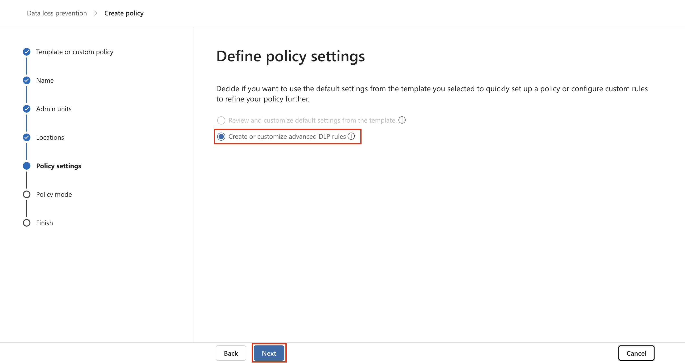

4.  在“**Edit Members of the role group** ”页上，单击“**Choose
    users**”。

    

5.  选中 **Alex Wilber** 附近的复选框。然后，单击“**Select**”按钮。

**注意**：如果您在编辑成员名称中没有看到 Megan Bowen 和 MOD
管理员名称，那么除了 Alex 名称之外，还选择 Megan Bowen 和 MOD
管理员名称。

    

6.  确保显示 MOD 管理员、Megan Bowen 和 Alex Wilber 姓名，然后单击
    **Next** 按钮。

    

7.  选择**“Save ”**以将用户添加到角色组。

    

8.  选择 **Done** 以完成步骤。

    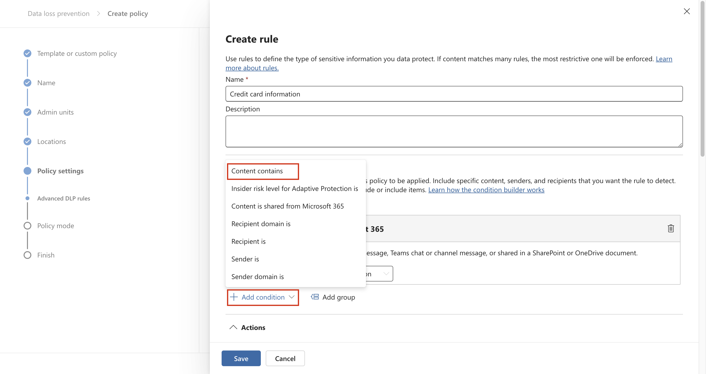

#### 步骤 2 – 启用内部风险分析见解

1.  在 Microsoft Purview
    门户中，导航到“**Settings**”，然后向下滚动并单击“**Insider risk
    management**”。在“**Insider Risk Management settings** –
    **Analytics**”页上，打开“**Show insights at tenant level** and
    **Show insights at user level**”的切换。然后，单击“**Save**”按钮。

    

#### 步骤 3 – 载入设备

在此部署方案中，你将载入尚未载入的设备，并且只想检测 Windows 10
设备上的内部风险活动。

我们需要在 Microsoft Entra ID
中注册设备/VM，作为创建任何内部风险策略的先决条件。

1.  单击 Windows 图标，然后选择 **Settings**，如下图所示。

    

2.  转到“**Accounts** \> **Access work or school**”。在“**Access work or
    school** ”页上，单击“**Connect**”。

    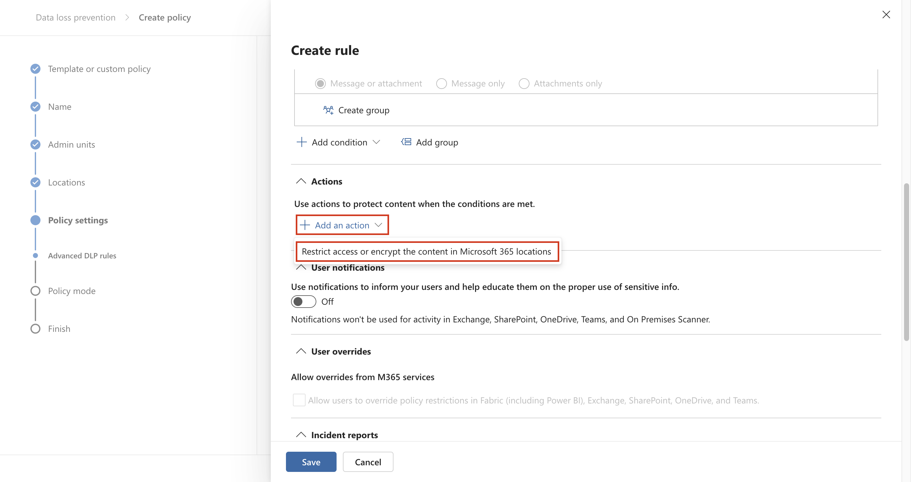

    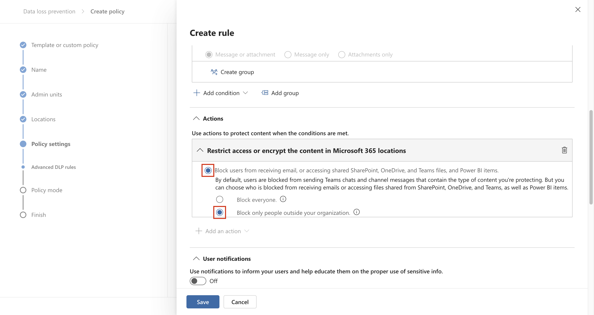

3.  在“**Set up a work or school account**”提示中，单击“**Join this
    device to Microsoft Entra ID**”。 

    

4.  在登录提示中，使用实验室环境的“资源”选项卡上提供的 **MOD
    Administrator** 凭据登录。

    

    

5.  在“**Make sure this is your
    organisation**”对话框中，单击“**Join**”按钮。

    

6.  完成后，您将看到一个确认窗口 **You're all set!** 点击 **Done**。

    

7.  同样，在“**Access work or school** ”页上，单击“**Connect**”。

    

8.  在 **Set up a work or school account**  提示中，使用 MOD
    管理员凭据登录。

    

    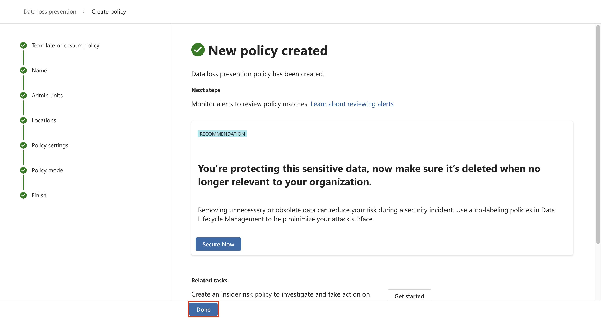

9.  在 **Stay signed in?**对话框中，单击“**Yes**”按钮。

    

10. 如果出现“**Setting up your device** ”对话框，请选择“**Got it**”。

    

11. 现在转到 **windows settings** \> **Accounts** \> **Access work or
    school** \> **Connected to Contoso MDM** \> **Info** \> **Sync**”。

    

    

12. 单击 VM 上的 Windows 符号。选择用户 **Admin**，然后选择** Sign
    out。**

    

13. 在用户屏幕上，选择 **Other user**。

    

14. 输入在实验室环境主页上提供的 O365 凭据，然后以 **MOD Administrator**
    身份登录到 VM。

    

15. 使用实验室 VM 上的 **MOD Administrator** 帐户登录
    +++**https://security.microsoft.com/+++**。

16. 选择“**Settings** \> **Device** **onboarding \> Devices**”。单击
    **Turn on Device onboarding**。

  

  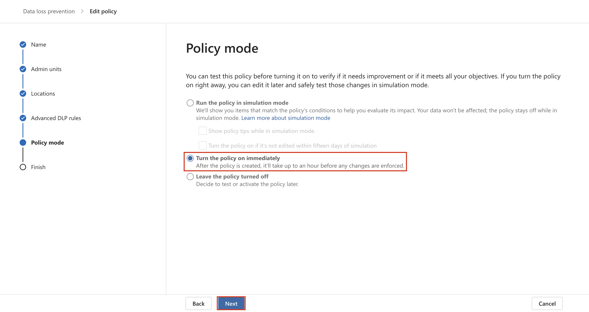

17. 在“**Turn on device onboarding**”对话框中，单击“**OK**”按钮。

    

18. 在 **Device monitoring is being turned on** 对话框中，单击 **OK**
    按钮。

    

19. 等待几分钟，然后刷新页面。

    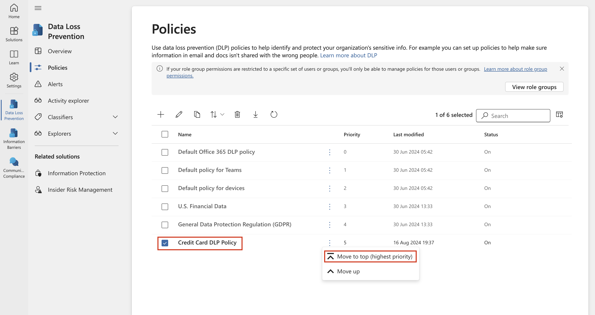

    

20. 从 **settings** \> **Device onboarding** \> **Onboarding**。单击
    **Download package**。

    

21. 下载后，将文件复制到桌面。右键单击该文件并 **Extract
    all…**，然后单击**Extract** 按钮,

    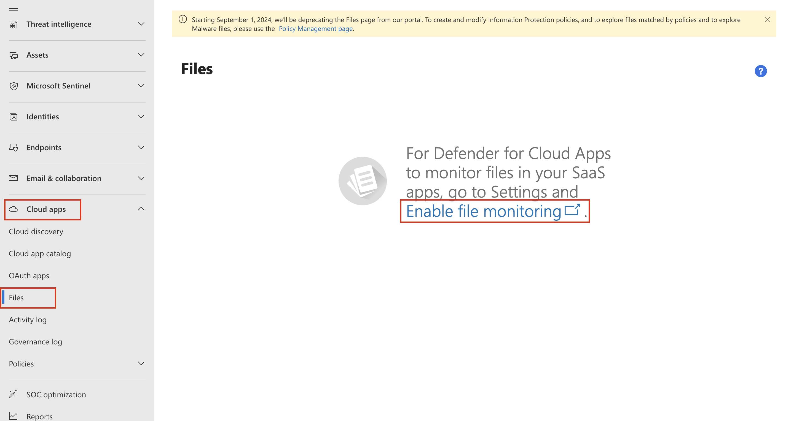

    

    

22. 完成后，打开文件夹并以 **Administrator** 权限运行文件。 

    

23. 如果 **Search for app in the Store?**
    对话框出现，然后单击“**Yes**”按钮，否则忽略。

24. **The publisher could not be verified. Are you sure you want to run
    this software?** 对话框中，单击“**Run**”按钮。

    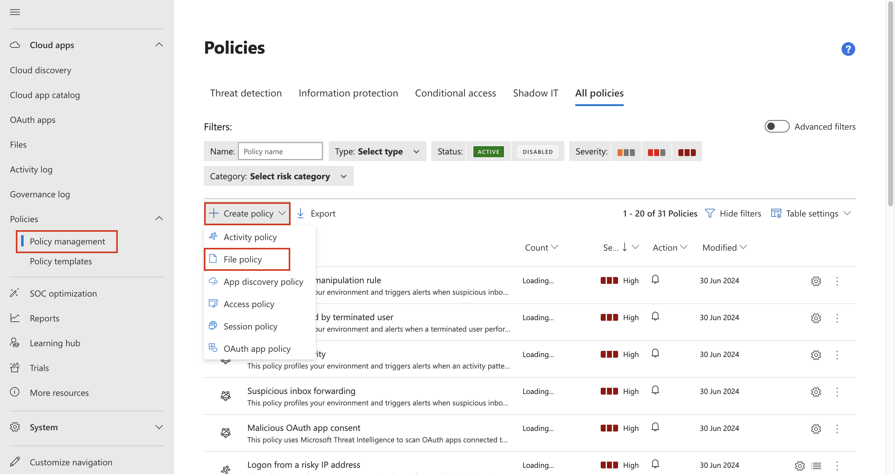

25. 如果出现“**User Account Control**”对话框，请单击“**Yes**”按钮。

    

28. 在命令提示符下，按 **Y** 并按 Enter
    进行确认。您将收到一条消息，表明设备已载入。在命令提示符中收到消息后，**Press
    any key to continue . . .**，按任意键。

    

27. 关闭命令提示符后，通过在 Windows 搜索栏中键入 cmd
    以管理员模式打开命令提示符，然后右键单击 **Command Prompt** 并选择
    **Run as administrator**。

    

28. 在“**User Account Control**”对话框中，单击“**Yes**”按钮。
   
    

31. 通过运行以下命令运行检测测试。命令提示符窗口将自动关闭。

**+++powershell.exe -NoExit -ExecutionPolicy Bypass -WindowStyleHidden $ErrorActionPreference= 'silentlycontinue';(New-ObjectSystem.Net.WebClient).DownloadFile('http://127.0.0.1/1.exe','C:\test-WDATP-test\invoice.exe');Start-Process 'C:\test-WDATP-test\invoice.exe'+++**

    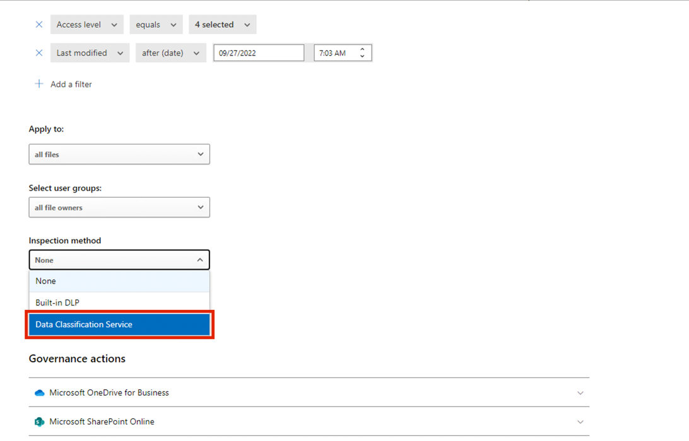

30. 关闭 VM 连接。

31. 通过单击导航中的设置打开 **settings**，然后选择“**Devices
    Onboarding** \> **Devices**”。 

**注意：**虽然启用设备载入通常需要大约 60 秒，但最多需要 30 分钟。

32. 您将能够检查**Devices **列表。在载入设备之前，该列表将为空，完成后，你将能够看到
    VM 列为载入设备。

### 任务 1：创建组织范围的策略以检测和评分有风险的浏览器使用情况

#### 步骤 1 - 创建新策略

1.  在 Microsoft Purview 门户中，单击“Solutions”，然后单击 **“Insider
    Risk Management”**

    

2.  单击策略。在“**Policies**”页中，单击“**+Create policy \> Custom
    policy**”。

    

3.  在“选择策略模板”页上，在“有风险的浏览器使用情况（预览版）”下，选择“有风险的浏览器使用情况（预览版）”。

    

4.  查看所有先决条件。

    

5.  选择**“Next**”继续。

    

6.  在 **Name and description** 页上，填写以下字段:

    - 名称（必填）：浏览器的危险使用方式

    - 说明（可选）：这是针对有风险的浏览器使用的测试策略.

7.  选择**“Next**”继续。

    

8.  在“Choose users and
    groups ”页上，选择“包括所有用户和组”。选择“Next”继续。

    

9.  在“**Choose users, groups, & adaptive scopes** ”页上，选择“**All
    users, groups, & adaptive scopes**”。选择“**Next**”继续。

    

10. 在“**Exclude users and groups** ”页上，选择“**Next**”。

  

11. 在“Decide whether to prioritize ”页上，选择“select I don't want to
    specify priority content right now (you'll be able to do this after
    the policy is created) 。选择“Next”继续。

    

12. 在“Triggers for this policy ”页上，选择“Turn on indicators”。

    

13. 在“**Turn on indicators for your
    organization**”对话框中，向下滚动并单击“**Choose indicators to turn
    on**”按钮。

    

    

14. 在“**Choose indicators to turn on**”对话框中，确保在“Risky browsing
    indicators (preview)”下选择了所有指示器。 

    

    

15. 向下滚动并选择 **Save**。.

16. 选择“**Choose to a potentially risky website**”。在“选**Select which
    activities triggering event for this policy**”页下，确保“**User
    browsed will trigger this
    policy**，选择所有选项，然后单击“**Next**”按钮。 

    

17. 在“**Choose thresholds for triggering events**”页上，选择“**Choose
    your own thresholds**”单选按钮，将所有阈值更改为每天 1
    个，然后选择“**Next**”。

    

    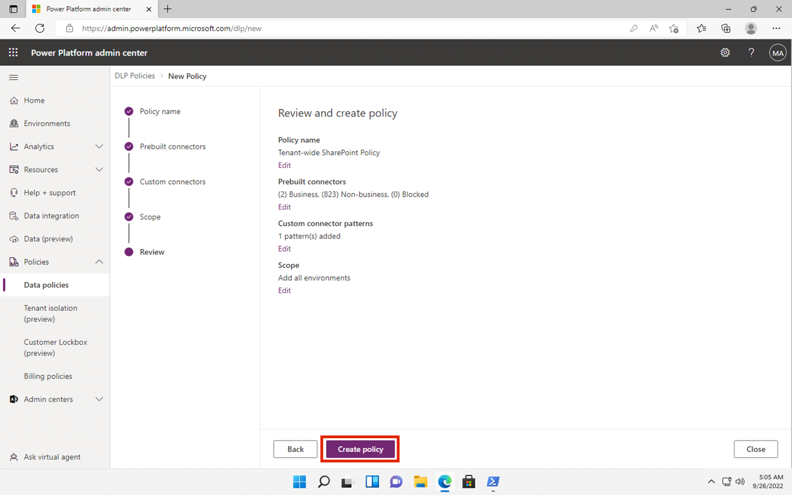

18. 在“**indicators** ”页上，选择“**Next**”。 

    

19. 在“**Choose threshold type for indicators**”页上，确保选择“**Apply
    thresholds provided by Microsoft**”，然后单击“**Next**”按钮。

    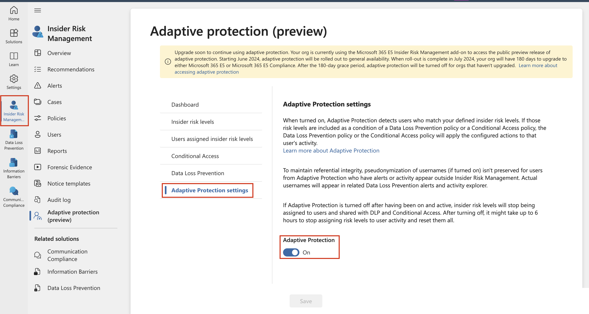

20. 在“**Review settings and finish**”页上，选择“**Submit**”。

    

21. 在“**Your policy was created**”页上，选择“**Done**”。 

    

22. 保持选项卡打开并继续执行下一个任务。

#### 步骤 2 – 对策略进行评分

1.  单击名为“Risky usage of browser”的新策略。选择“**Start scoring
    activity for users**”。

    

2.  在“评分活动的原因”字段中，键入“**Testing the policy**”。在 **Scoring
    activity for this many days (between 5 and 30)** 字段中，选择 **10
    days**。

    

3.  在 对这些用户的活动进行评分 字段中，键入 MOD，然后选择 MOD 管理员。

    

4.  然后，单击 **Start scoring activity** 按钮。

    

5.  单击“ **Close”** 按钮。

    

### 任务 2：离职用户的数据窃取

#### 步骤 1 - 创建新策略

1.  在“**Policies**”页中，单击“**+ Create policy**”，然后选择“**Custom
    policy**”。

    

2.  在“Choose a policy template ”页上，在“Data theft”下选择“Data theft
    by departing users”。选择“Next”继续。

    

3.  在 **Name and description** 页上，填写以下字段:

    - 名称（必填）：用户盗窃数据

    - 说明（可选）：这是防止数据盗窃的测试策略.

4.  选择“**Next**”继续。  

   

5.  在“Choose users and groups ”页上，选择“Include all users and
    groups”。选择“Next”继续。

    

6.  在“Decide whether to prioritize”页上，选择“I want to specify
    priority content”。仅选中“Sensitivity labels and Sensitive info
    types”复选框。选择“Next”继续。 

    

7.  在“Sensitivity labels to prioritize ”页上，选择“Add or edit
    sensitivity labels”。在“Add or edit sensitivity
    labels”搜索栏上，键入 employee 并按 Enter
    按钮，选择“Internal/Employee data
    (HR)”，然后选择“Next”。然后单击下一步。

    

8.  在“Sensitive info types to prioritize ”页上，选择“Add or edit
    sensitive info types”。在浮出控件窗格中，搜索并选择“Credit Card
    Number”、“Contoso Employee ID ”和“and Contoso Employee
    EDM”。选择添加。然后单击Next。

    

9.  在“Decide whether to score only activity with priority
    content”上，选择“Get alerts for all activity”。选择 Next。

    

10. 在“**Choose triggering event for this
    policy**”页上，保留默认选择，然后选择“**Next**”。

    

11. 在“**Indicators**”页面上，单击“**Office indicators (31/31
    selected)**。

    

12. 确保选择所有 Office 指示器，然后单击 **Next** 按钮。

    

13. 将 **Detection options** 页面上的所有参数保持默认状态，然后单击
    **Next** 按钮

    

14. 在“**Choose threshold type for indicators**”页上，选择“**Choose your
    own thresholds**”旁边的单选按钮，然后向下滚动并单击“Office
    indicators”下拉列表。

    

    

15. 在“Sharing SharePoint files with people outside the
    organization”下，分别为每个阶段使用 1、2 和 3
    个事件，然后选择“Next”。

    

16. 在“**Review settings and finish**”页面上，单击“**Submit**”按钮。

    

17. 在“Your policy was created”上，选择“Done”。

    

#### 步骤 2 – 对策略进行评分

1.  单击名为“Data theft by a user”的新策略。选择“Start scoring activity
    for users”。

    

2.  在“Reason for scoring activity”字段中，键入“**Testing the
    policy**”。在 **Scoring activity for this many days (between 5 and
    30)** 字段中，选择 **10 days**。

    

3.  在 Score activity for these users 字段中，键入 MOD，然后选择 MOD
    administrator。

    

4.  然后，单击 **Start scoring activity** 按钮。

    

5.  单击“**Close**”按钮。

    

### 任务 3：用户数据泄露

#### 步骤 1 - 创建新策略

1.  在“**Policies**”页中，单击“**+ Create policy**”，然后选择“**Custom
    policy**”。

    

2.  在“**Choose a policy template** ”页上，选择“**Data
    leaks**”下的“**Data leaks**”。选择“**Next**”继续。

    

3.  在 **Name and description** 页上，填写以下字段:

    - 名称：用户 Data leaks

    - 说明：这是防止 Data leaks 的测试策略.

4.  选择“**Next**”继续。 

    

5.  在“**Choose users, groups, & adaptive scopes**”页上，确保选择“**All
    users, groups, and adaptive
    scopes**”单选按钮。然后，单击“**Next** ”按钮继续。 

    

6.  在“Decide whether to prioritize ”页上，选择“I want to specify
    priority content”。选中 SharePoint
    网站、敏感度标签和敏感信息类型的复选框。选择“Next”继续。

    

7.  在“SharePoint sites to prioritize ”页上，选择“**Add or edit
    SharePoint sites**”。在浮出控件窗格中，选择
    **https://wwlxXXXXXX.sharepoint.com/sites/ContosoWeb1**并选择
    “**Add**”。然后，单击 **Next**。

**注意：** 租户前缀在“**Resources”**选项卡中可用。

    

    

    

8.  在“Sensitivity labels to prioritize ”页上，选择“**Add or edit
    sensitivity labels**”。在浮出控件窗格中，键入
    **+++employee+++**，然后选择“Internal/Employee data
    (HR) ”复选框，然后单击“**Add**”按钮。然后，单击“**Next**”按钮。

    

    

9.  在“Sensitive info types to prioritize”页上，选择“Add or edit
    sensitive info types”。在浮出控件窗格中，搜索并选择“Credit Card
    Number, Contoso Employee ID 和 Contoso Employee EDM”。选择
    Add。然后单击 Next。

    

10. 在“Decide whether to score only activity with priority
    content”上，选择“Get alerts for all activity”。选择 Next。

    

11. 在“**Choose triggering event for this
    policy**”页上，确保已选择“**User performs an exfiltration
    activity**”单选按钮。在“**Select which activities will trigger this
    policy**”下，选择“**Download content from SharePoint, Sending email
    with attachments to recipients outside the organisation**, **Sharing
    SharePoint files with people outside the
    organization**”，然后选择“**Next**”。

    

    

12. 在“Triggering thresholds for this policy”上，选择“Use custom
    thresholds”。将每个阈值设置为 1，然后选择 Next。 

    

    

13. 保留“**Indicators** ”页上的默认设置，然后选择“**Next**”。

    

14. 保留“**Detection options**”页上的默认设置，然后选择“**Next**”。

    

15. 在“**Choose threshold type for indicators**”页上，确保选择“**Choose
    your own thresholds**”单选按钮。然后，单击 Office
    指示器，分别为每个阶段使用 1、2 和 3 个事件，然后选择 **Next**。

    

    

    

16. 在“**Review settings and finish**”中，选择“**Submit**”。

    

17. 在“Your policy was created”上，选择“Done”。 

    

#### 步骤 2 – 对策略进行评分

1.  在“Policies”页中，选中名为“用户数据泄漏”的新策略旁边的复选框。然后，选择“**Start
    scoring activity for users**”。

    

2.  在“Reason for scoring activity”字段中，键入“**Testing the
    policy**”。在 **Scoring activity for this many days (between 5 and
    30)**的活动进行评分 字段中，选择 **10 days**。在 Score activity for
    these users 字段中，键入 MOD，然后选择 MOD administrator。

    

    

3.  然后，单击 **Start scoring activity** 按钮。

    

4.  单击“**Close**”按钮。

    

## 总结：

在本实验室中，你首先通过同步 VM 时钟并载入 Microsoft Purview
中的内部风险管理所需的用户和设备来准备环境。你启用了分析见解，并在所有目标
VM 上验证了 Defender
反恶意软件客户端版本。载入设备后，创建了三个不同的内部风险管理策略，用于监视和评分与有风险的浏览器使用、离职用户的潜在数据盗窃以及内部用户的数据泄露相关的活动。每个策略都使用敏感度标签、SharePoint
网站和敏感信息类型作为优先级内容进行自定义，并将阈值配置为触发警报和评分。最后，你启动了评分活动，以模拟现实世界的内部风险方案，并评估配置策略的有效性。

