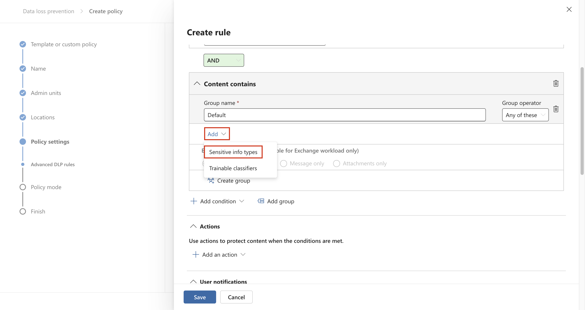

# Lab 6 – Erstellen und Verwalten von DLP-Richtlinien

## Ziel:

Sie sind Patti Fernandez, die neu eingestellte
Compliance-Administratorin für Contoso Ltd., die damit beauftragt ist,
den Microsoft 365-Mandanten des Unternehmens für die Verhinderung von
Datenverlust zu konfigurieren. Contoso Ltd. ist ein Unternehmen, das
Fahrunterricht in den USA anbietet, und Sie müssen sicherstellen, dass
vertrauliche Kundeninformationen die Organisation nicht verlassen.

## Übung 1 – Erstellen von DLP-Richtlinien

### Aufgabe 1 – Erstellen einer DLP-Richtlinie im Testmodus

In dieser Übung erstellen Sie eine Richtlinie zur Verhinderung von
Datenverlust im Azure Purview-Portal, um vertrauliche Daten vor der
Freigabe durch Benutzer zu schützen. Die DLP-Richtlinie, die Sie
erstellen, informiert Ihre Benutzer, wenn sie Inhalte freigeben möchten,
die Kreditkarteninformationen enthalten, und ermöglicht es ihnen, eine
Begründung für das Senden dieser Informationen anzugeben. Die Richtlinie
wird im Testmodus implementiert, da Sie noch nicht möchten, dass sich
die Blockierungsaktion auf Ihre Benutzer auswirkt.

1.  Navigieren Sie in **Microsoft
    Edge**` zu https://purview.microsoft.com,  und stellen Sie sicher,`` ``dass Sie `beim
    **Microsoft Purview-Portal** als **Patti Fernandez** angemeldet
    sind.

2.  Wählen Sie im **Azure Purview-Portal** im linken Navigationsbereich
    **Solutions** \> **Data loss prevention** aus.

Wählen Sie unter **Data Loss Prevention** die Option **Policies**, und
dann **+Create Policy** aus, um den Assistenten zum Erstellen einer
neuen Richtlinie zur Verhinderung von Datenverlust zu starten.

4.  Scrollen Sie auf der Seite **Start with a template or create a
    custom policy** nach unten, und wählen Sie unter **Categories** die
    Option **Custom policy** und unter **Custom** die Option
    Benutzerdefinierte **Regulations** aus. Standardmäßig sollten beide
    Optionen bereits ausgewählt sein, wählen Sie **Next.**

5.  Geben Sie auf der **Seite Name Ihrer DLP-Richtlinie** den Text
    `Kreditkarten-DLP-Richtlinie` in das Feld **Name** ein und
    `schützen Sie Kreditkartennummern vor der Freigabe``.` Im Feld
    Beschreibung. Wählen Sie **Next** aus.

*Ein Screenshot einer automatisch generierten Computerbeschreibung*

6.  Wählen Sie auf der Seite **Assign Admin Units** die Option **Next**
    aus.

7.  Stellen Sie auf der Seite **Choose locations to apply the policy**
    sicher, dass die Option **Teams chat and channel messages**
    aktiviert ist und alle anderen Optionen deaktiviert sind, und wählen
    Sie **Next** aus.

*Ein Screenshot einer automatisch generierten Computerbeschreibung*

8.  Wählen Sie auf der Seite **Define Policy Settings** die Option
    **Create or Customize Advanced DLP Rules** aus**,** und klicken Sie
    dann auf **Next**.

*Ein Screenshot einer automatisch generierten Computerbeschreibung*

1.  Wählen Sie auf der Seite **Erweiterte DLP-Regeln anpassen** die
    Option +**Create rule** aus.

Ein Screenshot einer automatisch generierten Computerbeschreibung

10. Geben Sie auf der Seite **Create rule**
    Kreditkarteninformationen` in`` ``da``s`` `Feld **Name** ein.

Ein Screenshot einer automatisch generierten Computerbeschreibung

1.  Wählen Sie unter **Conditions** auf der Seite **Create Rule** die
    Option **+ Add Condition** aus, und wählen Sie im Dropdownmenü
    **Content is shared from Microsoft 365** aus.

12. Wählen Sie im neuen Abschnitt **Content is shared from Microsoft
    365** die Option **with people outside my organization** aus.

Ein Screenshot einer automatisch generierten Computerbeschreibung

13. Wählen Sie **+ Add Condition** und wählen Sie dann **Content
    Contains** aus dem Dropdown-Menü.

Ein Screenshot einer automatisch generierten Computerbeschreibung

14. In neuen **Content Contains** Bereich, wählen Sie **Add** und wählen
    Sie **Sensitive Info Types** aus dem Dropdown-Menü.

15. Auf der **Sensitive Info Types** Seite, wählen Sie **Credit Card
    Number** und wählen Sie **Add** aus.

16. Auf der **Create Rule** Seite, wählen Sie **+ Add an action** und
    dann wählen Sie **Restrict access or encrypt the content in
    Microsoft 365 locations** aus.

17. Aktivieren Sie das Kästchen vor **Restrict access or encrypt the
    content in Microsoft 365 locations** und wählen Sie dann **Block
    only people outside your organization** aus.

Ein Screenshot einer automatisch generierten Computerbeschreibung

18. Auf der **Create Rule** Seite, im **User Notifications** Abschnitt,
    Wählen Sie den Schalter, um ihn in die Position On zu versetzen.

Ein Screenshot einer automatisch generierten Computerbeschreibung

19. Auf der **Create Rule** Seite, im **User Overrides** Abschnitt,
    unter **Allow Overrides from M365 Services**, aktivieren Sie das
    Kontrollkästchen **Allow Overrides from M365 Services. Allows Users
    in Exchange, SharePoint, OneDrive and Teams to Override Policy
    Restrictions.**

**Anmerkung**: Sollten Sie nicht das Kontrollkästchen **Allow overrides
from M365 services** sehen, aktivieren Sie das Kontrollkästchen **Notify
users in Office 365 with a policy tip** welchen Sie auf der **Create
Rule** Seite unter dem **User notification** \> **Microsoft 365
services** aus dem vorherigen Schritt befindet. Aktivieren Sie dann das
Kontrollkästchen **Allow overrides from M365 services. Allows users in
Exchange,** **SharePoint, OneDrive and Teams to override policy
restrictions.**

20. Aktivieren Sie das Kontrollkästchen **Require a business
    justification to override**.

21. Im **Incident reports** Abschnitt, in **Use this severity level in
    admin alerts and reports** Dropdown, wählen Sie **Low** aus.

22. Wählen Sie **Save**, wählen Sie dann **Next**.

Ein Screenshot einer automatisch generierten Computerbeschreibung

23. Auf **Test or turn on the policy** Seite wählen Sie **Run the policy
    in simulation mode** und wählen Sie **Show policy tips while in test
    mode** aus.

24. Wählen Sie **Submit,** so erstellen Sie die Richtlinie.

25. Sobald die Richtlinie erstellt wurde, wählen Sie **Done** aus.

Ein Screenshot einer automatisch generierten Computerbeschreibung

Sie haben jetzt eine DLP-Richtlinie erstellt, die in Microsoft
Teams-Chats und -Kanälen nach Kreditkartennummern sucht und es Benutzern
ermöglicht, eine geschäftliche Begründung für die Außerkraftsetzung der
Richtlinie anzugeben.

### Aufgabe 2 – Ändern einer DLP-Richtlinie

In dieser Aufgabe ändern Sie die vorhandene DLP-Richtlinie, die Sie im
vorherigen Schritt erstellt haben, um auch E-Mails auf
Kreditkarteninformationen zu überprüfen und Benutzer zu informieren,
wenn sie diesen Inhalt in einer E-Mail freigeben möchten.

1.  In **Microsoft Edge**, navigieren Sie zu
    `https://purview.microsoft.com` und stellen Sie sicher, dass Sie
    beim **Microsoft Purview-Portal** als **Patti Fernandez** angemeldet
    sind.

2.  Im **Microsoft Purview** Portal, wählen Sie im linken
    Navigationsbereich die Option **Solutions** \> **Data Loss
    Prevention**.

3.  Unter **Data loss prevention**, wählen Sie **Policies**, und wählen
    Sie dann die Richtlinie mit dem Namen **Credit Card DLP Policy** und
    wählen Sie dann **Edit policy**(pencil icon) so öffnen Sie den
    Richtlinien-Assistenten.

4.  Auf der **Name your DLP policy** und **Assign admin units** Seite,
    wählen Sie **Next** aus.

5.  Auf der **Choose locations to apply the policy** Seite, aktivieren
    Sie **Exchange email** Option und wählen dann **Next** bis Sie die
    **Review and finish** Seite erreichen. Stellen Sie sicher, dass die
    restlichen Speicherorte deaktiviert sind.

6.  Wählen Sie **Submit** aus, um die Änderung zu übernehmen, die Sie in
    der Richtlinie vorgenommen haben.

7.  Sobald die Richtlinie aktualisiert wurde, wählen Sie **Done** aus.

Ein Screenshot einer automatisch generierten Computerbeschreibung

Sie haben nun eine vorhandene DLP-Richtlinie geändert und die
Speicherorte geändert, an denen nach Inhalten gesucht wird.

### Aufgabe 3 – Erstellen einer DLP-Richtlinie in PowerShell

In dieser Aufgabe verwenden Sie PowerShell, um eine DLP-Richtlinie zu
erstellen, um die Contoso EmployeeIDs zu schützen und zu verhindern,
dass sie in Exchange freigegeben werden. Benutzer werden darüber
informiert, dass sie versuchen, vertrauliche Daten freizugeben, und
werden am Senden der E-Mail gehindert, wenn sie Contoso EmployeeIDs
enthält.

1.  Wählen Sie im Startmenü **Windows PowerShell**.

&nbsp;

1.  Geben Sie im PowerShell-Fenster

`Connect-IPPSSession`` ein`

und melden Sie sich dann als **Patti Fernandez** an**.**

Text Beschreibung wird automatisch generiert

Anmerkung: Wenn ein Fehler angezeigt wird, versuchen Sie, zuerst die
folgenden Befehle nacheinander auszuführen, und führen Sie dann den
Schritt erneut aus.

`Install-Module ExchangeOnlineManagement`

`Import-Module ExchangeOnlineManagement`

Wenn ein Fehler angezeigt wird, versuchen Sie, die folgenden Befehle
zuerst nacheinander auszuführen, und führen Sie dann den Schritt erneut
aus. Wenn weiterhin ein Fehler auftritt, laden Sie die folgende Datei
herunter und installieren Sie sie, bevor Sie fortfahren.
`https://github.com/PowerShell/PowerShell/releases/download/v7.4.0/PowerShell-7.4.0-win-x64.msi`

3.  Geben Sie den folgenden Befehl in PowerShell ein, um eine
    DLP-Richtlinie zu erstellen, die alle Exchange-Postfächer überprüft:

`New-DlpCompliancePolicy -Name "EmployeeID DLP Policy" -Comment "This policy blocks sharing of Employee IDs" -ExchangeLocation All`

4.  Geben Sie den folgenden Befehl in PowerShell ein, um der
    DLP-Richtlinie, die Sie im vorherigen Schritt erstellt haben, eine
    DLP-Regel hinzuzufügen:

`New-DlpComplianceRule -Name "EmployeeID DLP rule" -Policy "EmployeeID DLP Policy" -BlockAccess $\\true -ContentContainsSensitiveInformation @{Name="Contoso Employee IDs"}`

Text Beschreibung wird automatisch generiert

5.  Verwenden Sie den folgenden Befehl, um die **EmployeeID DLP Rule**
    zu überprüfen:

`Get-DLPComplianceRule -Identity "EmployeeID DLP rule"`

Text Beschreibung wird automatisch generiert

Sie haben jetzt eine DLP-Richtlinie erstellt, die mithilfe von
PowerShell nach Contoso EmpoloyeeIDs in Exchange sucht.

### Aufgabe 4 – Aktivieren einer Richtlinie im Testmodus

In dieser Aufgabe aktivieren Sie die DLP-Richtlinie für
Kreditkarteninformationen, die Sie im Testmodus erstellt haben, damit
sie ihre Schutzmaßnahmen erzwingt.

1.  Navigieren Sie in **Microsoft
    Edge**` zu https://purview.microsoft.com,und stellen Sie sicher, dass Sie`` `beim
    **Microsoft Purview-Portal** als **Patti Fernandez** angemeldet
    sind.

2.  Wählen Sie im **Azure Purview-Portal** im linken Navigationsbereich
    **Solutions** \> **Data Loss Prevention** aus.

1.  Unter **Data Loss Prevention**, wählen Sie **Policies**, und wählen
    Sie dann die Richtlinie mit dem Namen **Credit Card DLP Policy** aus
    und wählen Sie dann **Edit Policy**(pencil icon), um den
    Richtlinien-Assistenten zu öffnen.

4.  Wählen Sie **Next** bis Sie die **Test or turn on the policy** Seite
    sehen und wählen Sie dann **Turn the policy on immediately** aus.

Ein Screenshot einer automatisch generierten Computerbeschreibung

5.  Wählen Sie **Next**, und wählen Sie dann **Submit**, um die
    Richtlinie zu aktivieren.

6.  Sobald die Richtlinie aktualisiert wurde, wählen Sie **Done** aus.

Ein Screenshot einer automatisch generierten Computerbeschreibung

Sie haben die DLP-Richtlinie erfolgreich aktiviert. Wenn die Richtlinie
einen Versuch erkennt, Kreditkarteninformationen freizugeben, blockiert
sie nun den Versuch und ermöglicht es den Benutzern, eine geschäftliche
Begründung anzugeben, um die Blockierungsaktion außer Kraft zu setzen.

## Übung 2 – Verwalten von DLP-Richtlinien

### Aufgabe 1 – Ändern der Richtlinienpriorität

Nachdem Sie zwei DLP-Richtlinien erstellt haben, möchten Sie
sicherstellen, dass die restriktivere Richtlinie mit einer höheren
Priorität als die weniger restriktive Richtlinie verarbeitet wird. Aus
diesem Grund möchten Sie die DLP-Richtlinie "EmployeeID" in die höhere
Priorität verschieben.

1.  Navigieren Sie in **Microsoft
    Edge**` zu https://purview.microsoft.com,und stellen Sie sicher, dass Si``e`
    beim **Microsoft Purview-Portal** als **Patti Fernandez** angemeldet
    sind.

&nbsp;

3.  Wählen Sie im **Azure Purview-Portal** im linken Navigationsbereich
    **Solutions** \> **Data loss prevention** aus.

3.  Unter **Data Loss Prevention**, wählen Sie **Policies**, und wählen
    Sie dann die Richtlinie mit dem Namen **Credit Card DLP Policy** und
    wählen Sie dann **Edit Policy** (pencil icon) aus, so öffnen Sie den
    Richtlinien-Assistenten.

4.  Wählen Sie **Move to top** aus.

5.  Im **Data loss prevention** Fenster, wählen Sie **Refresh** und
    überprüfen Sie die Priorität in der Spalte **Order** der
    Richtlinientabelle.

Sie haben die Priorität Ihrer DLP-Richtlinien erfolgreich geändert. Wenn
beide Richtlinien mit demselben Inhalt übereinstimmen, wird die Aktion
der Richtlinie mit höherer Priorität erzwungen.

### Aufgabe 2 – Aktivieren der Dateiüberwachung in Microsoft 365 Defender

Sie möchten Dateirichtlinien in **Microsoft 365 Defender verwenden**, um
Dateien an Ihren OneDrive- und SharePoint Online-Speicherorten zu
schützen. Bevor Sie eine Dateirichtlinie erstellen können, müssen Sie
die Dateiüberwachung aktivieren, damit Microsoft 365 Defender Dateien in
Ihrer Organisation überprüfen kann.

1.  Öffnen Sie **Microsoft Edge**, navigieren Sie zu
    https://security.microsoft.com,
    `und melden Sie sich beim Microsoft 365 Defender-Portal als `**MOD-Administrator**
    an.

&nbsp;

1.  Wählen Sie in der Navigation **Cloud Apps System** \> **Files
    Settings** \> **Cloud Apps** aus dem Menü aus.

3.  Wählen Sie dann **Enable file monitoring**. Wählen Sie **Files**
    unter **Information Protection** aus.

Ein Screenshot einer automatisch generierten Computerbeschreibung

4.  Wählen Sie das **Enable File Monitoring** Kontrollkästchen und
    wählen Sie dann **Save** wenn es nicht bereits markiert ist.

Ein Screenshot einer automatisch generierten Computerbeschreibung

Sie haben die Dateiüberwachung in Microsoft Defender für Cloud Apps
erfolgreich aktiviert und können jetzt Dateien mithilfe von
Dateirichtlinien auf vertrauliche Inhalte scannen.

### Aufgabe 3 – Erstellen einer Dateirichtlinie für Microsoft 365 Defender

In dieser Aufgabe möchten Sie eine Dateirichtlinie in Microsoft 365
Defender erstellen, um Dateien in OneDrive und SharePoint Online zu
überprüfen und Dateien mit Kreditkarteninformationen automatisch unter
Quarantäne zu stellen, wenn sie freigegeben werden.

1.  Öffnen Sie **Microsoft Edge**, navigieren Sie zu
    https://security.microsoft.com,
    `und melden Sie sich beim Microsoft 365 Defender-Portal als `**MOD-Administrator**
    an.

&nbsp;

1.  Wählen Sie in der Navigation unter **System** die Option
    **Settings** aus, und wählen Sie im Menü **Cloud-Apps** aus.

3.  Unter **Information Protection** \> **Microsoft Information
    Protection**, stellen Sie sicher das **Automatically scan new files
    for sensitivity labels from Microsoft Purview Protection and content
    inspection warnings** ausgewählt ist, sollte es nicht schon
    ausgewählt sein. Klicken Sie auf **Save**.

4.  Unter **Inspect Protected Files**, klicken Sie auf **Grant
    Permission**.

5.  Wenn Sie dazu aufgefordert werden, melden Sie sich mit der
    **MOD-Administrator-ID** an und klicken Sie auf dem nächsten
    Bildschirm auf Accept.

&nbsp;

1.  Wählen Sie in der Unternavigation **Connected apps** \> **App
    Connectors** aus. Stellen Sie sicher, dass **Microsoft 365**
    hinzugefügt wurde.

- Wenn nicht, wählen Sie **Connect an app** aus, und fügen Sie die App
  hinzu. Unter **Select Office 365 Components**, aktivieren Sie alle
  Kontrollkästchen und klicken Sie dann auf **Connect Office 365**.

- Wenn die Meldung **Office 365 was successfully connected**, schließen
  Sie das Feld.

7.  Im **Microsoft 365 Defender** Portal, im linken Navigationsbereich,
    erweitern Sie **Cloud apps** \> **Policies** und wählen Sie **Policy
    management** aus.

8.  Erweitern Sie auf der Seite **Policies** die Option **+ Create
    Policiy**, und wählen Sie dann **File policy** aus.

Ein Screenshot einer automatisch generierten Computerbeschreibung

9.  Geben Sie auf der Seite **Create File policy** den Namen
    `Credit Card Information for files` im **Policy Name** Feld ein, und
    geben Sie `Protect credit card numbers from being shared in files.`
    in das **Description** Feld ein.

Grafische Benutzeroberfläche, Anwendung Beschreibung wird automatisch
generiert

10. Behalten Sie die **Policy Severity** auf **Low** (ein leuchtendes
    Symbol) und stellen Sie sicher, dass die **Category** auf **DLP**
    festgelegt ist. Für eine Dateirichtlinie sollte dies die
    Standardeinstellung sein.

Grafische Benutzeroberfläche, Text, Anwendung Beschreibung wird
automatisch generiert

1.  Erweitern Sie im Bereich **Dateien, die allen folgenden Inhalten
    entsprechen**, das Dropdown-Menü **Public (Internet), External,
    Public** und fügen Sie **Internal** hinzu.

Grafische Benutzeroberfläche, Anwendung Beschreibung wird automatisch
generiert

1.  Wählen Sie unter Anwenden auf im Dropdown-Menü **Inspection Method**
    die Option **Data Classification Service** aus.

Grafische Benutzeroberfläche, Text, Anwendung Beschreibung wird
automatisch generiert

**Anmerkung:** Wenn der **Data Classification Service** noch nicht in
der Dropdown-Liste angezeigt wird, wählen Sie ab sofort **None** aus.
Sobald Sie fertig sind, kommen Sie nach einiger Zeit zurück zu
**Policies** \> **Policy management** \> **All Policies** \> **Search
for name: Credit card** \> **Select Credit Card Information for files**.

Ein Screenshot einer automatisch generierten Computerbeschreibung

13. Wählen Sie **Data Classification Service** aus der Dropdown-Liste
    von **Inspection Method** aus.

Ein Screenshot einer Computerbeschreibung, die automatisch mit mittlerer
Zuverlässigkeit generiert wird

1.  Klicken Sie im Feld **Choose inspection type...** Dropdown-Menü,
    wählen Sie **Sensitive information type...**.

Benutzeroberfläche, Text, Anwendung Beschreibung wird automatisch
generiert

15. In **Select a Sensitive Information Type** Dialogfeld, wählen Sie
    **Credit Card Number**, wählen Sie dann **Done** in der oberen
    rechten Ecke.

Grafische Benutzeroberfläche, Website-Beschreibung wird automatisch
generiert

16. Aktivieren Sie unter Alerts das Kontrollkästchen **Create an alert
    for each matching file** erstelllen und überprüfen Sie Ihre
    Optionen. Behalten Sie die Standardeinstellungen bei, indem Sie als
    **Save as default settings** auswählen.

Ein Screenshot einer automatisch generierten Computerbeschreibung

1.  Erweitern Sie im Abschnitt **Governance Actions** die Option
    **Microsoft OneDrive for Business,** und wählen Sie In **Put in user
    quarantine** aus.

Ein Screenshot einer automatisch generierten Computerbeschreibung

1.  Erweitern Sie im Abschnitt **Governance Actions** die Option
    **Microsoft SharePoint Online,** und wählen Sie In **Put in User
    Quarantine** aus.

Ein Screenshot einer automatisch generierten Computerbeschreibung

19. Wählen Sie **Create** am Ende der Seite aus.

Grafische Benutzeroberfläche, Text, Anwendung Beschreibung wird
automatisch generiert

1.  Wählen Sie oben rechts das **Profile picture** des
    MOD-Administrators aus, wählen Sie neben dem Zahnrad **Sign out**
    aus und schließen Sie dann den Browser.

Sie haben jetzt eine Dateirichtlinie erstellt, die in OneDrive und
SharePoint gespeicherte Dateien kontinuierlich nach
Kreditkarteninformationen durchsucht und unter Quarantäne stellt, wenn
sie in Ihrer Organisation freigegeben sind.

### Aufgabe 4 – Erstellen einer DLP-Richtlinie für Power Platform

Ihr Unternehmen verwendet Power Automate Flows, um Daten zwischen
SharePoint Online und Salesforce auszutauschen. In dieser Aufgabe
erstellen Sie eine DLP-Richtlinie für Power Platform, die es Ihren
vorhandenen Flows ermöglicht, weiterhin zu funktionieren, aber die
Erstellung von Flows verhindert, die Daten zwischen SharePoint Online
und Apps freigeben, die als nicht geschäftlich definiert sind.

1.  Navigieren Sie in **Microsoft Edge** zu
    `https://admin.powerplatform.microsoft.com` und melden Sie sich beim
    Power Platform Admin Center als **MOD-Administrator an**.

&nbsp;

1.  Wählen Sie im **Power Platform Admin Center** im linken
    Navigationsbereich das Dropdown-Menü für **Policies** und dann
    **Data Policies** aus.

3.  Wählen Sie auf der Seite **Data Policies** die Option **+ New
    Policy** aus.

Grafische Benutzeroberfläche, Anwendung, Teams Beschreibung automatisch
generiert

1.  Geben Sie auf der Seite **Name your policy** den Namen
    `"Mandantenweite SharePoint-Richtlinie`" ein, und wählen Sie dann
    **Next** aus.

Grafische Benutzeroberfläche, Text, Anwendung Beschreibung wird
automatisch generiert

1.  Über die **Non-Business| Default** Registerkarte Standard, wählen
    Sie **SharePoint** und **Salesforce** und dann oben auf der Seite
    **Move to Business** aus.

1.  Wählen Sie auf der Seite **Assign connectors** die Registerkarte
    **Business** aus, um sicherzustellen, dass sowohl SharePoint als
    auch Salesforce jetzt angezeigt werden.

Grafische Benutzeroberfläche, Anwendung Beschreibung wird automatisch
generiert

7.  Wählen Sie zweimal **Next** aus.

Grafische Benutzeroberfläche, Anwendung Beschreibung wird automatisch
generiert

Grafische Benutzeroberfläche, Text, Anwendung Beschreibung wird
automatisch generiert

8.  Auf der **Define scope** Seite, wählen Sie **Add all Environments**,
    und wählen Sie dann **Next** aus.

Grafische Benutzeroberfläche, Text, Anwendung Beschreibung wird
automatisch generiert

1.  Überprüfen Sie auf der Seite **Review and Create Policy** Ihre
    Richtlinieneinstellungen, und wählen Sie dann **Create Policies**
    aus.

*Ein Screenshot einer automatisch generierten Computerbeschreibung*

Sie haben jetzt eine Power Platform DLP-Richtlinie erstellt, die
verhindert, dass Benutzer Flows erstellen, die einen SharePoint Online
Connector und einen Connector enthalten, der nicht Salesforce ist.

## Übung 3 – Aktivieren des adaptiven Schutzes

1.  Navigieren Sie in **Microsoft Edge** zu
    `https://purview.microsoft.com,`und melden Sie sich beim
    Purview-Portal als **MOD-Administrator an**.

2.  Wählen Sie im linken Navigationsbereich **Solutions** \> **Insider
    Risk Management** \> **Adaptive protection** \> **Dashboard** aus.
    Wählen Sie **Quick setup**.

3.  Es wird eine Meldung angezeigt, die besagt, dass wir die Dinge
    einrichten. Es dauert 72 Stunden, bis es aktiviert ist. Wir werden
    dies im letzten Lab verwenden, in dem wir die Funktion des
    **Adaptive Protection** untersuchen.

*Ein Screenshot einer automatisch generierten Computerbeschreibung*

4.  Wählen Sie die Registerkarte **Adaptive Protection settings** und
    aktivieren Sie die Umschaltfläche **Adaptive Protection**. Wählen
    Sie dann **Save** aus.

## *Ein Screenshot einer automatisch generierten Computerbeschreibung* 

## Zusammenfassung:

In dieser Übung haben wir gelernt, wie Sie neue DLP-Richtlinien
erstellen, den Dateischutz aktivieren und die DLP-Richtlinien verwalten.
Wir haben auch gelernt, wie man den Adoptivschutz aktiviert, den wir
später im Lab untersuchen werden.
