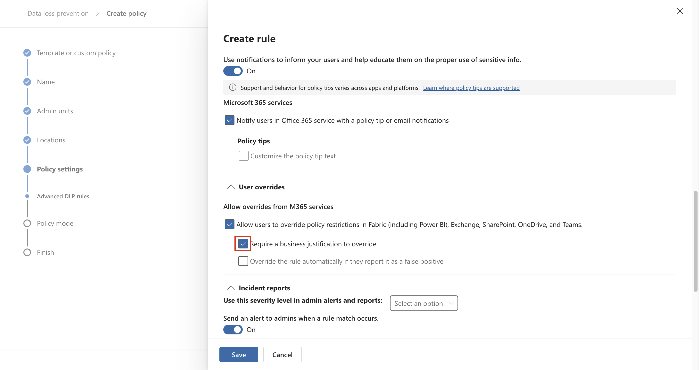
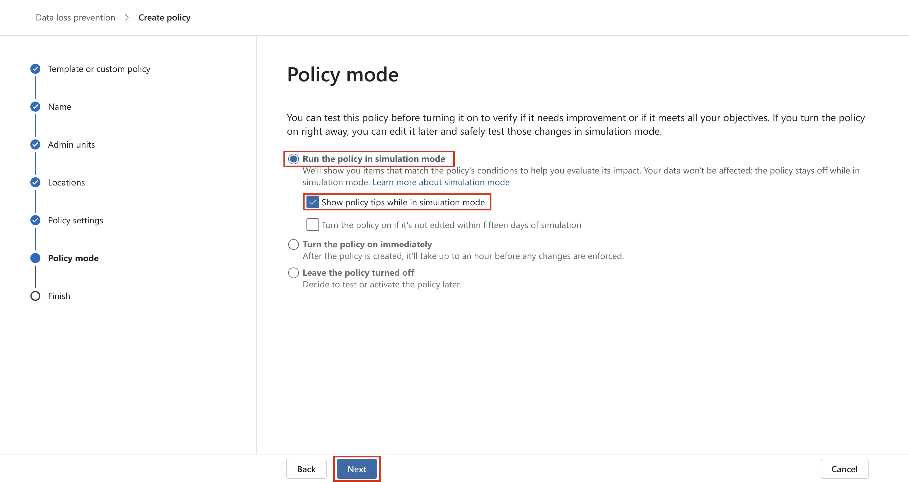

# Laboratório 6 – Criando e gerenciando Policies DLP

## Objetivo:

Você é Patti Fernandez, a recém-contratada Administradora de
Conformidade da Contoso Ltd. com a tarefa de configurar o locatário do
Microsoft 365 da empresa para data loss prevention. A Contoso Ltd. é uma
empresa que oferece instrução de direção nos Estados Unidos e você
precisa garantir que as informações confidenciais do cliente não saiam
da organização.

## Exercício 1 – Criando Policies DLP

### Tarefa 1 – Criar uma política DLP no modo de teste

Neste exercício, você criará uma política de Data loss prevention no
portal do Microsoft Purview para proteger dados confidenciais de serem
compartilhados pelos usuários. A política DLP que você criar informará
aos usuários se eles desejam compartilhar conteúdo que contenha
informações de cartão de crédito e permitirá que eles forneçam uma
justificativa para o envio dessas informações. A política será
implementada no modo de teste porque você ainda não quer que a ação de
bloqueio afete os usuários.

1.  No **Microsoft Edge**, navegue até `https://purview.microsoft.com` e
    verifique se você está conectado ao portal do **Microsoft Purview**
    como **Patti Fernandez**.

2.  No portal do **Microsoft Purview**, no painel de navegação esquerdo,
    selecione **Solutions** \> **Data loss prevention**.

3.  Em **Data loss prevention**, selecione a guia **Policies**  e, em
    seguida, selecione **+** **Create policy** para iniciar o assistente
    de criação de uma nova política de data loss prevention.

4.  Na página **Start with a template or create a custom policy**, role
    para baixo e selecione **Custom** em **Categories** e **Custom
    policy** em **Regulations**. Por padrão, ambas as opções já devem
    estar selecionadas, selecione **Next**.

5.  Na página **Name your DLP policy**, digite
    `Credi Card DLP Policy``,` no campo **Name** e Protect credit card
    numbers from being shared,` `no campo **Description**. Selecione
    **Next**.

Uma captura de tela de uma descrição de computador gerada
automaticamente

6.  Na página **Assign admin units**, selecione **Next**.

7.  Na página **Choose locations to apply the policy**, certifique-se de
    que a opção **Teams chat and channel messages** está ativada e todas
    as outras opções estão desativadas e selecione **Next**.

Uma captura de tela de uma descrição de computador gerada
automaticamente

8.  Na página **Define policy settings**, selecione **Create or
    customize advanced DLP rules** e selecione **Next**.

Uma captura de tela de uma descrição de computador gerada
automaticamente

9.  Na página **Customize advanced DLP rules**, selecione **+ Create
    rule**.

Uma captura de tela de uma descrição de computador gerada
automaticamente

10. Na página **Create rule**, digite `C``redit card information` no
    campo **Name**.

Uma captura de tela de uma descrição de computador gerada
automaticamente

11. Em **Conditions** na página **Create rule**, selecione **+ Add
    condition** e selecione **Content is shared from Microsoft 365** no
    menu suspenso.

12. Na nova seção **Content is shared from Microsoft 365**, selecione a
    opção **with people outside my organization**.

Uma captura de tela de uma descrição de computador gerada
automaticamente

13. Selecione **+ Add Condition** e, em seguida, selecione **Content
    contains** no menu suspenso.

Uma captura de tela de uma descrição de computador gerada
automaticamente

14. Na nova área **Content contains**, selecione **Add** e selecione
    **Sensitive info types** no menu suspenso.

15. Na página **Sensitive info types**, selecione **Credit Card Number**
    e selecione **Add**.

16. Na página **Create rule**, selecione **+ Add an action** e selecione
    **Restrict access or encrypt the content in Microsoft 365
    locations**.

17. Marque a caixa na frente de **Restrict access or encrypt the content
    in Microsoft 365 locations** e selecione **Block only people outside
    your organization**.

Uma captura de tela de uma descrição de computador gerada
automaticamente

18. Na página **Create rule**, na seção **User notifications**,
    selecione a opção para colocá-la na posição **On**.

Uma captura de tela de uma descrição de computador gerada
automaticamente

19. Na página **Create rule**, na seção **User overrides**, na opção
    **Allow overrides from M365 services**, marque a caixa **Allow
    overrides from M365 services.** Marque a caixa **Allows users in
    Exchange, SharePoint, OneDrive and Teams to override policy
    restrictions.**

**Observação**: Se você não conseguiu marcar a caixa de seleção **Allow
overrides from M365 services**, ative a caixa de seleção **Notify users
in Office 365 with a policy tip** que pode ser encontrada na página
**Create rule** na seção **User notification** \> **Microsoft 365
services** da etapa anterior. Em seguida, marque a caixa de seleção
**Allow overrides from M365 services. Allows users in Exchange,**
**SharePoint, OneDrive and Teams to override policy restrictions.**

20. Marque a caixa **Require a business justification to override**.

21. Na seção **Incident reports**, no menu suspenso **Use this severity
    level in admin alerts and reports**, selecione **Low**.

22. Selecione **Save** e, em seguida, selecione **Next**.

Uma captura de tela de uma descrição de computador gerada
automaticamente

23. Na página **Test or turn on the policy**, selecione **Run the policy
    in simulation mode** e selecione **Show policy tips while in test
    mode**.

24. Selecione **Submit** para criar a política.

25. Depois que a política for criada, selecione **Done**.

Uma captura de tela de uma descrição de computador gerada
automaticamente

Você criou uma política DLP que verifica números de cartão de crédito
nos chats e canais do Microsoft Teams e permite que os usuários forneçam
uma justificativa comercial para substituir a política.

### Tarefa 2 – Modificar uma política de DLP

Nesta tarefa, você modificará a política de DLP existente criada na
etapa anterior para também verificar se há informações de cartão de
crédito nos e-mails e informar aos usuários se eles desejam compartilhar
esse conteúdo em um e-mail.

1.  No **Microsoft Edge**, navegue até `https://purview.microsoft.com` e
    verifique se você está conectado ao portal do **Microsoft Purview**
    como **Patti Fernandez**.

2.  No portal do **Microsoft Purview** , no painel de navegação
    esquerdo, selecione **Solutions** \> **Data loss prevention**.

3.  Na janela **Data loss prevention**, selecione a guia **Policies** e,
    em seguida, selecione a política chamada **Credit Card DLP Policy**
    e, em seguida, selecione **Edit policy** (ícone de lápis) para abrir
    o assistente de política.

4.  Na página **Name your DLP policy** e **Assign admin units**,
    selecione **Next**.

5.  Na página **Choose locations to apply the policy**, ative a opção
    **Exchange email** e selecione **Next** até chegar à página **Review
    and finish**. Certifique-se de que os demais locais estejam
    desativados.

6.  Selecione **Submit** para aplicar a alteração que você fez na
    política.

7.  Quando a política for atualizada, selecione **Done**.

Uma captura de tela de uma descrição de computador gerada
automaticamente

Você modificou uma política de DLP existente e alterou os locais em que
ela faz varredura de conteúdo.

### Tarefa 3 – Criando uma política DLP no PowerShell

Nesta tarefa, você usará o PowerShell para criar uma política de DLP
para proteger os EmployeeIDs da Contoso e impedir que sejam
compartilhados no Exchange. Os usuários serão informados de que estão
tentando compartilhar dados confidenciais e serão impedidos de enviar o
e-mail se ele incluir Contoso EmployeeIDs.

1.  No menu Iniciar, selecione **Windows PowerShell**.

2.  Na janela do **PowerShell**, digite

`Connect-``IPPSSession`

e, em seguida, faça login como **Patti Fernandez.**

Descrição do texto gerada automaticamente

Observação: se aparecer um erro, tente executar os seguintes comandos um
a um primeiro e, em seguida, execute a etapa novamente.

`Install-Module ExchangeOnlineManagement`

`Import-Module ``ExchangeOnlineManagemen``t`

Se aparecer um erro, tente executar os seguintes comandos um a um
primeiro e, em seguida, execute a etapa novamente. Se ainda ocorrer
algum erro, baixe o arquivo a seguir e instale-o antes de continuar.
`https://github.com/PowerShell/PowerShell/releases/download/v7.4.0/PowerShell-7.4.0-win-x64.msi`

3.  Digite o seguinte comando no PowerShell para criar uma política de
    DLP que varre todas as caixas de correio do Exchange:

`New-``DlpCompliancePolicy`` -Name "``EmployeeID`` DLP Policy" -Comment "This policy blocks sharing of Employee IDs" -``ExchangeLocation`` All`

Imagem interrompida

4.  Digite o seguinte comando no PowerShell para Add uma regra de DLP à
    política de DLP que você criou na etapa anterior:

`New-``DlpComplianceRule`` -Name "``EmployeeID`` DLP rule" -Policy "``EmployeeID`` DLP Policy" -``BlockAccess`` $\\true -``ContentContainsSensitiveInformation`` @{Name="Contoso Employee IDs"}`

Descrição do texto gerada automaticamente

5.  Use o seguinte comando para revisar a **EmployeeID DLP rule**:

`Get-``DLPComplianceRule`` -Identity "``EmployeeID`` DLP rule"`

Descrição do texto gerada automaticamente

Você criou uma política de DLP que faz a varredura de Contoso
EmpoloyeeIDs no Exchange usando o PowerShell.

### Tarefa 4 – Ativando uma política no modo de teste

Você criou uma política de DLP que faz a varredura de Contoso
EmpoloyeeIDs no Exchange usando o PowerShell.

1.  No **Microsoft Edge**, navegue até `https://purview.microsoft.com` e
    verifique se você está conectado ao portal do **Microsoft Purview**
    como **Patti Fernandez**.

2.  No portal do **Microsoft Purview** , no painel de navegação
    esquerdo, selecione **Solutions** \> **Data loss prevention**.

3.  Na janela **Data loss prevention**, selecione a guia **Policies** e,
    em seguida, selecione a política denominada **Credit Card DLP
    Policy** e, em seguida, selecione **Edit policy** (ícone de lápis)
    para abrir o assistente de política.

4.  Selecione **Next** até chegar a página **Test or turn on the
    policy** e selecione **Turn the policy on immediately**.

Uma captura de tela de uma descrição de computador gerada
automaticamente

5.  Selecione **Next** e, em seguida, selecione **Submit** para ativar a
    política.

6.  Depois que a política for atualizada, selecione **Done**.

Uma captura de tela de uma descrição de computador gerada
automaticamente

Você ativou com sucesso a política de DLP. Se a política detectar uma
tentativa de compartilhar informações de cartão de crédito, ela agora
bloqueará a tentativa e permitirá que os usuários forneçam uma
justificativa comercial para substituir a ação de bloqueio.

## Exercício 2 – Gerenciando Policies DLP

### Tarefa 1 – Modificar a prioridade da política

Depois de criar duas políticas de DLP, você quer garantir que a política
mais restritiva seja processada com prioridade mais alta do que a
política menos restritiva. Por esse motivo, você deseja mover a política
de DLP EmployeeID para a prioridade mais alta.

1.  No **Microsoft Edge**, navegue até `https://purview.microsoft.com` e
    verifique se você está conectado ao portal do **Microsoft Purview**
    como **Patti Fernandez**.

2.  No portal do **Microsoft Purview** , no painel de navegação
    esquerdo, selecione **Solutions** \> **Data loss prevention**.

3.  Na janela **Data loss prevention**, selecione a guia **Policies** e,
    em seguida, selecione a política chamada **Credit Card DLP Policy**
    e, em seguida, selecione **Edit policy** (ícone de lápis) para abrir
    o assistente de política.

4.  Selecione **Move to top**.

5.  Na janela **Data loss prevention**, selecione **Refresh** e revise a
    prioridade na coluna **Order** da tabela de Policies.

Você modificou com sucesso a prioridade de suas políticas de DLP. Se
ambas as políticas corresponderem ao mesmo conteúdo, será aplicada a
ação da política de prioridade mais alta.

### Tarefa 2 – Ativar o monitoramento de arquivos no Microsoft 365 Defender

Você deseja usar Políticas de arquivo no **Microsoft 365 Defender** para
proteger arquivos em seus locais do OneDrive e do SharePoint Online.
Antes de criar uma política de arquivos, você precisa habilitar o
monitoramento de arquivos para que o Microsoft 365 Defender possa
verificar arquivos em sua organização.

1.  Abra o **Microsoft Edge** e navegue até
    `https://security.microsoft.com` e faça login no portal Microsoft
    365 Defender como **MOD Administrator**.

2.  Na navegação, selecione **Cloud appsSystem** \> **Files Settings**
    \> **Cloud apps** no menu.

3.  Em seguida, selecione **Enable file monitoring**. Selecione
    **Files** em **Information Protection**.

Uma captura de tela de uma descrição de computador gerada
automaticamente

4.  Marque a caixa de seleção **Enable file monitoring** e, em seguida,
    selecione **Save** se ainda não estiver marcada.

Uma captura de tela de uma descrição de computador gerada
automaticamente

Você ativou com sucesso o monitoramento de arquivos no Microsoft
Defender for Cloud Apps e agora pode verificar se há conteúdo
confidencial nos arquivos usando políticas de arquivo.

### Tarefa 3 – Criar Política de Arquivo para o Microsoft 365 Defender

Nesta tarefa, você criará uma política de arquivo no Microsoft 365
Defender para verificar os arquivos no OneDrive e no SharePoint Online e
colocar automaticamente em quarentena os arquivos que contêm informações
de cartão de crédito se forem compartilhados.

1.  Abra o **Microsoft Edge** e navegue até
    `https://security.microsoft.com` e faça login no portal do Microsoft
    365 Defender como **MOD Administrator**.

2.  Na navegação, selecione **Settings** em **System** e selecione
    **Cloud apps** no menu.

3.  Em **Information Protection** \> **Microsoft Information
    Protection**, verifique se a opção **Automatically scan new files
    for sensitivity labels from Microsoft Purview Protection and content
    inspection warnings** está selecionada, caso contrário, selecione-a.
    Clique em **Save**.

4.  Em **Inspect protected files**, clique em **Grant Permission**.

5.  Se solicitado, faça login usando o ID do **MOD Administrator** e
    clique em **Accept** na próxima tela.

6.  Na subnavegação, selecione **Connected apps** \> **App Connectors**.
    Verifique se o **Microsoft 365** foi adicionado.

- Caso contrário, selecione **Connect an app** e adicione o aplicativo.
  Em **Select Office 365 components**, marque todas as caixas de seleção
  e clique em **Connect Office 365**.

- Quando você ver a mensagem **Office 365 was successfully connected**,
  feche a caixa.

7.  No portal **Microsoft 365 Defender**, no painel de navegação
    esquerdo, expanda **Cloud apps** \> **Policies** e selecione
    **Policy management**.

8.  Na página **Policies**, expanda **+ Create policy** e selecione
    **File policy**.

Uma captura de tela de uma descrição de computador gerada
automaticamente

9.  Na página **Create file policy**, digite
    `C``redit Card Information for files` no campo **Policy name** e
    digite `Prote``ct credit card numbers from being shared in files` no
    campo **Description**.

Interface gráfica do usuário, aplicação e descrição gerada
automaticamente

10. Mantenha a **Policy Severity** em **Low** (um ícone iluminado) e
    certifique-se de que a **Category** esteja definida como **DLP**.
    Para uma política de arquivo, esse deve ser o padrão.

Interface gráfica do usuário, texto, aplicativo Descrição gerada
automaticamente

11. Na área **Files matching all of the following**, expanda o menu
    suspenso **Public (Internet), External, Public** e adicione
    **Internal**.

Interface gráfica do usuário, aplicação e descrição gerada
automaticamente

12. Em Apply to, no menu suspenso **Inspection Method**, selecione
    **Data Classification Service**.

Interface gráfica do usuário, texto, aplicativo e descrição gerada
automaticamente

**Observação:** Se você ainda não vir o **Data Classification Service**
no menu suspenso, selecione **None** no momento. Uma vez feito isso,
volte depois de algum tempo para **Policies** \> **Policy management**
\> **All Policies** \> **Search for name: Credit card** \> **Select
Credit Card Information for files**.

Uma captura de tela de uma descrição de computador gerada
automaticamente

13. Selecione **Data Classification Service** no menu suspenso do
    **Inspection method**.

Uma captura de tela de uma descrição de computador gerada
automaticamente com confiança média

14. No menu suspenso **Choose inspection type...**, selecione
    **Sensitive information type...**.

Interface gráfica do usuário, texto, aplicativo e descrição gerada
automaticamente

15. Na caixa de diálogo **Select a sensitive information type,**
    selecione **Credit Card Number** e, em seguida, selecione **Done**
    no canto superior direito.

Interface gráfica do usuário. Descrição do site gerada automaticamente

16. Em **Alerts**, marque a caixa de seleção **Create an alert for each
    matching file** e revise suas opções. Mantenha as Settings no padrão
    selecionando **Save as default settings**.

Uma captura de tela de uma descrição de computador gerada
automaticamente

17. Na seção **Governance actions**, expanda **Microsoft OneDrive for
    Business** e selecione **Put in user quarantine**.

Uma captura de tela de uma descrição de computador gerada
automaticamente

18. Na seção **Governance actions**, expanda **Microsoft OneDrive for
    Business** e selecione **Put in user quarantine**.

Uma captura de tela de uma descrição de computador gerada
automaticamente

19. Selecione **Create** na parte inferior da página.

Interface gráfica do usuário, texto, aplicativo Descrição gerada
automaticamente

20. Selecione a **Profile picture** do MOD Admin no canto superior
    direito e selecione **Sign out** ao lado do ícone de configurações
    e, em seguida, feche o navegador.

Você criou uma política de arquivos que verificará continuamente os
arquivos salvos no OneDrive e no SharePoint em busca de informações de
cartão de crédito e os colocará em quarentena se forem compartilhados
dentro da sua organização.

### Tarefa 4 – Criar uma política de DLP para o Power Platform

Sua empresa usa fluxos do Power Automate para compartilhar dados entre o
SharePoint Online e o Salesforce. Nesta tarefa, você criará uma política
de DLP para o Power Platform que permite que os fluxos existentes
continuem funcionando, mas impede a criação de fluxos que compartilharão
dados entre o SharePoint Online e os aplicativos definidos como não
comerciais.

1.  No **Microsoft Edge**, navegue até
    `https://admin.powerplatform.microsoft.com` e faça login no centro
    de administração do Power Platform como **MOD Administrator**.

2.  No **Power Platform admin center**, no painel de navegação esquerdo,
    selecione o menu suspenso **Policies** e, em seguida, selecione
    **Data policies**.

3.  Na página **Data policies**, selecione **+ New Policy**.

Interface gráfica do usuário, aplicativo e descrição do Teams gerada
automaticamente

4.  Na página **Name your policy**, digite
    T`enant-wide SharePoint Policy` e selecione **Next**.

Interface gráfica do usuário, texto, aplicativo e descrição gerada
automaticamente

5.  Na guia **Non-business | Default**, selecione **SharePoint** e
    **Salesforce** e, em seguida, selecione **Move to Business** na
    parte superior da página.

6.  Na página **Assign connectors**, selecione a guia **Business** para
    garantir que o SharePoint e o Salesforce sejam exibidos.

Interface gráfica do usuário, aplicação e descrição gerada
automaticamente

7.  Selecione **Next** duas vezes.

Interface gráfica do usuário, aplicativo e descrição gerada
automaticamente

Interface gráfica do usuário, texto, aplicativo e descrição gerada
automaticamente

8.  Na página **Define scope**, selecione **Add all environments** e, em
    seguida, selecione **Next**.

Interface gráfica do usuário, texto, aplicativo e descrição gerada
automaticamente

9.  Na página **Review and create policy**, revise suas Configurações de
    política e selecione **Create policy**.

Uma captura de tela de uma descrição de computador gerada
automaticamente

Você criou uma política de DLP do Power Platform que impede que os
usuários criem fluxos que envolvam um SharePoint Online Connector e
qualquer conector que não seja o Salesforce.

## Exercício 3 – Ativando a proteção adaptativa

1.  No **Microsoft Edge**, navegue até `https://purview.microsoft.com` e
    faça login no portal do Purview como **MOD Administrator**.

2.  No painel de navegação esquerdo, selecione **Solutions** \>
    **Insider Risk Management** \> **Adaptive protection** \>
    **Dashboard**. Selecione **Quick setup**.

3.  Será exibida uma mensagem informando que estamos configurando as
    coisas. A ativação levará 72 horas. Usaremos isso no último
    laboratório, no qual exploraremos o recurso **Adaptive Protection**.

Uma captura de tela de uma descrição de computador gerada
automaticamente

4.  Selecione a guia **Adaptive Protection settings** e ative o botão de
    alternância **Adaptive Protection**. Selecione **Save**.

Uma captura de tela de uma descrição de computador gerada
automaticamente

## Resumo:

Neste laboratório, aprendemos a criar novas políticas de DLP, ativar a
proteção de arquivos e gerenciar as políticas de DLP. Também aprendemos
a ativar Proteção Adaptativa, que será explorada no laboratório mais
adiante.
