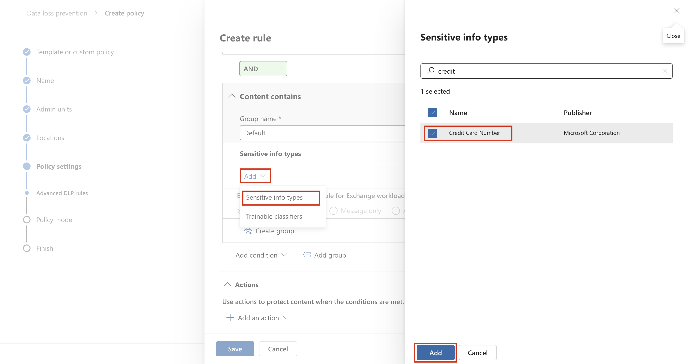
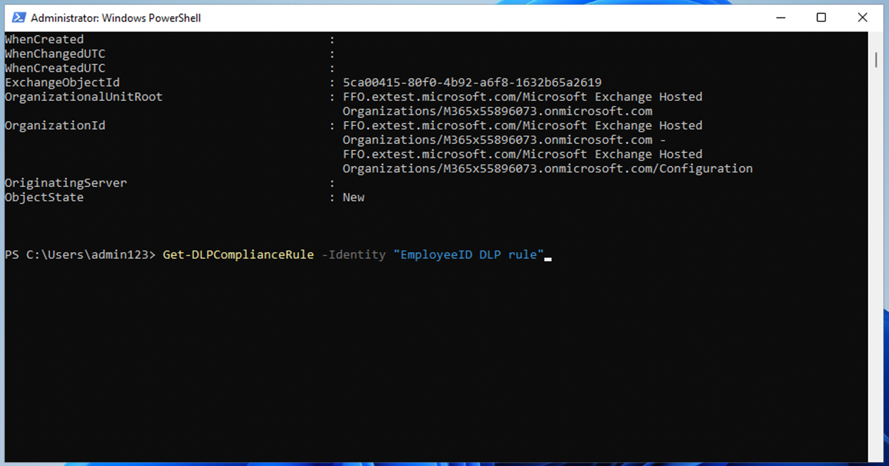

# ラボ 6 – DLP ポリシーの作成と管理

## 目的:

あなたは、Contoso Ltd. に新しく採用されたコンプライアンス管理者の Patti
Fernandez です。会社の Microsoft 365
テナントをデータ損失防止用に構成する任務を負っています。Contoso Ltd.
は米国で運転指導を提供する会社であり、機密性の高い顧客情報が組織外に漏れないようにする必要があります。

## エクササイズ1 – DLP ポリシーの作成

### タスク 1 – テストモードでの DLP ポリシーの作成

この演習では、Microsoft Purview
ポータルでデータ損失防止ポリシーを作成し、機密データがユーザーによって共有されるのを防ぎます。作成する
DLP ポリシーは、クレジット
カード情報を含むコンテンツを共有するかどうかをユーザーに通知し、この情報を送信する理由をユーザーに提示できるようにします。ブロック
アクションがまだユーザーに影響を与えないようにするため、ポリシーはテスト
モードで実装されます。

1.  Microsoft Edge で、https://purview.microsoft.com に移動し、Patti
    Fernandez として Microsoft Purview
    ポータルにログインしていることを確認します。

2.  Microsoft Purview ポータルの左側のナビゲーション
    ウィンドウで、\[Solutions\] \> \[Data loss prevention\]
    を選択します。

3.  「Data loss prevention」で「Policies」を選択し、「+ Create
    policy」を選択して、新しいデータ損失防止ポリシーを作成するためのウィザードを起動します。

4.  \[Start with a template or create a custom policy\]
    ページで、下にスクロールして、\[Category\] の \[Custom\] と
    \[Regulations\] の \[Custom policy\]
    を選択します。デフォルトでは、両方のオプションが既に選択されているはずなので、\[Next\]
    を選択します。

5.  \[Name your DLP policy\] ページで、\[Name\] フィールドに「Credit
    Card DLP Policy」と入力し、\[Description\] フィールドに「Protect
    credit card numbers from being shared.」と入力します。\[Next\]
    を選択します。

コンピュータのスクリーンショット 説明は自動的に生成されました

6.  \[Assign admin units\] ページで、\[Next\] を選択します。

7.  \[Choose locations to apply the policy\] ページで、\[Teams chat and
    channel messages\]
    オプションが有効になっており、その他のオプションがすべて無効になっていることを確認し、\[Next\]
    を選択します。

コンピュータのスクリーンショット 説明は自動的に生成されました

8\. \[Define policy settings\] ページで、\[Create or customize advanced
DLP rules\] を選択し、\[Next\] を選択します。

コンピュータのスクリーンショット 説明は自動的に生成されました

9\. 「Customize advanced DLP rules」ページで、「+ Create
rule」を選択します。

コンピュータのスクリーンショット 説明は自動的に生成されました

10\. 「Create rule」ページで、「Name」フィールドに「Credit card
information」と入力します。

コンピュータのスクリーンショット 説明は自動的に生成されました

11\. \[Create rule\] ページの \[Conditions\] で \[+ Add condition\]
を選択し、ドロップダウン メニューから \[Content is shared from Microsoft
365\] を選択します。

12\. 新しい \[new Content is shared from Microsoft 365\]
セクションで、\[with people outside my organization\]
オプションを選択します。

コンピュータのスクリーンショット 説明は自動的に生成されました

13\. \[+ Add condition\] を選択し、ドロップダウン メニューから \[Content
contains\] を選択します。

コンピュータのスクリーンショット 説明は自動的に生成されました

14\. 新しい「Content contains」領域で、「Add」を選択し、ドロップダウン
メニューから「Sensitive info
types」を選択します。

15\. 「Sensitive info types」ページで、「Credit card
number」を選択し、「Add」を選択します。

16. \[Create rule\] ページで、\[+ Add an action\] を選択し、\[Restrict
    access or encrypt the content in Microsoft 365 locations\]
    を選択します。

17\. \[Restrict access or encrypt the content in Microsoft 365
locations\] の前のボックスをオンにし、\[Block only people outside your
organization\] を選択します。

コンピュータのスクリーンショット 説明は自動的に生成されました

18\. 「Create rule」ページの「User
notification」セクションで、スイッチを選択してオンの位置に切り替えます。

コンピュータのスクリーンショット 説明は自動的に生成されました

19. \[Create rule\] ページの \[User overrides\] セクションの \[Allow
    overrides from M365 services\] で、\[Allow overrides from M365
    services\]
    チェックボックスをオンにします。Exchange、SharePoint、OneDrive、および
    Teams のユーザーがポリシー制限を上書きできるようにします。

注: \[M365 サービスからのオーバーライドを許可する\] チェック
ボックスを選択できなかった場合は、前の手順の \[ルールの作成\] ページの
\[ユーザー通知\] \> \[Microsoft 365 サービス\] セクションにある
\[ポリシー ヒントを使用して Office 365 のユーザーに通知する\] チェック
ボックスを有効にします。次に、\[M365
サービスからのオーバーライドを許可する\] チェック
ボックスをオンにします。Exchange、SharePoint、OneDrive、および Teams
のユーザーがポリシー制限をオーバーライドできるようにします。

20. \[Require a business justification to override\]
    チェックボックスをオンにします。

21. 「Incident reports」セクションの「Use this severity level in admin
    alerts and reports」ドロップダウンで、「Low」を選択します。

22\. \[Save\] を選択し、\[Next\] を選択します。

コンピュータのスクリーンショット 説明は自動的に生成されました

23. \[Test or turn on the policy\] ページで、\[Run the policy in
    simulation mode\] を選択し、\[Show policy tips while in test mode\]
    を選択します。

24\. 「Submit」を選択してポリシーを作成します。

25\. ポリシーが作成されたら、「Done」を選択します。

コンピュータのスクリーンショット 説明は自動的に生成されました

これで、Microsoft Teams
のチャットとチャネルでクレジットカード番号をスキャンし、ユーザーがポリシーを上書きするビジネス上の正当な理由を提示できるようにする
DLP ポリシーが作成されました。

### タスク 2 – DLP ポリシーの変更

このタスクでは、前の手順で作成した既存の DLP
ポリシーを変更して、電子メールでクレジットカード情報もスキャンし、このコンテンツを電子メールで共有するかどうかをユーザーに通知します。

1.  Microsoft Edge で、https://purview.microsoft.com に移動し、Patti
    Fernandez として Microsoft Purview
    ポータルにログインしていることを確認します。

2.  Microsoft Purview ポータルの左側のナビゲーション
    ウィンドウで、\[Solutions\] \> \[Data loss prevention\]
    を選択します。

3\. \[DLP\] で \[Policy\] を選択し、\[Credit Card DLP Policy\]
というポリシーを選択してから、\[Edit policy(pencil icon)\]
を選択してポリシー ウィザードを開きます。

4\. 「Name your DLP policy and Assign admin
units」ページで、「Next」を選択します。

5\. 「Choose locations to apply the policy」ページで、Exchange メール
オプションを有効にし、「Review and
finish」ページが表示されるまで「Next」を選択します。残りの場所が無効になっていることを確認します。

6\.
「Submit」を選択して、ポリシーに加えた変更を適用します。

7\. ポリシーが更新されたら、「Done」を選択します。

コンピュータのスクリーンショット 説明は自動的に生成されました

これで、既存の DLP
ポリシーが変更され、コンテンツをスキャンする場所が変更されました。.

### タスク3 – PowerShell で DLP ポリシーを作成する

このタスクでは、PowerShell を使用して、Contoso EmployeeID
を保護し、Exchange で共有されないようにする DLP
ポリシーを作成します。ユーザーには、機密データを共有しようとしていることが通知され、電子メールに
Contoso EmployeeID
が含まれている場合は、その電子メールの送信がブロックされます。

1\. スタート メニューで、Windows PowerShell を選択します。

2\. PowerShell ウィンドウで、Connect-IPPSSession と入力し、Patti
Fernandez としてサインインします。

テキストの説明が自動的に生成されます

注: エラーが表示された場合は、まず次のコマンドを 1
つずつ実行してから、手順を再度実行してください。

Install-Module ExchangeOnlineManagement

Import-Module ExchangeOnlineManagement

エラーが表示された場合は、まず次のコマンドを 1
つずつ実行してから、手順を再度実行してください。それでもエラーが発生する場合は、次のファイルをダウンロードしてインストールしてから、先へ進んでください。https://github.com/PowerShell/PowerShell/releases/download/v7.4.0/PowerShell-7.4.0-win-x64.msi

3.  PowerShell に次のコマンドを入力して、すべての Exchange
    メールボックスをスキャンする DLP ポリシーを作成します。

`New-``DlpCompliancePolicy`` -Name "``EmployeeID`` DLP Policy" -Comment "This policy blocks sharing of Employee IDs" -ExchangeLocation All`

4.  PowerShell に次のコマンドを入力して、前の手順で作成した DLP
    ポリシーに DLP ルールを追加します。

`New-``DlpComplianceRule`` -Name "``EmployeeID`` DLP rule" -Policy "EmployeeID DLP Policy" -BlockAccess $\\true -ContentContainsSensitiveInformation @{Name="Contoso Employee IDs"}`

自動生成されるテキスト説明

5.  `次のコマンドを使用して、``EmployeeID`` DLP ``ルールを確認します。`

> `Get-``DLPComplianceRule`` -Identity "``EmployeeID`` DLP rule"`

自動生成されるテキスト説明

PowerShell を使用して Exchange 内の Contoso EmpoloyeeID をスキャンする
DLP ポリシーが作成されました。

### タスク 4 – テストモードでポリシーを有効にする

このタスクでは、テスト モードで作成したクレジットカード情報 DLP
ポリシーをアクティブ化して、保護アクションを適用します。

1.  1\. Microsoft Edge で、https://purview.microsoft.com に移動し、Patti
    Fernandez として Microsoft Purview
    ポータルにログインしていることを確認します。

2.  2\. Microsoft Purview ポータルの左側のナビゲーション
    ウィンドウで、\[Solutions \> Data loss prevention\] を選択します。

3\. \[ＤＬＰ\] で \[Policy\] を選択し、\[Credit Card DLP Policy\]
というポリシーを選択してから、\[Edit policy(pencil
icon)\]を選択してポリシー ウィザードを開きます。

4\. 「Test or turn on the
policy」ページに到達するまで「Next」を選択し、「Turn the policy on
immediately」を選択します。

コンピュータのスクリーンショット 説明は自動的に生成されました

5\.
「Next」を選択し、「Submit」を選択してポリシーを有効にします。

6\. ポリシーが更新されたら、「Done」を選択します。

コンピュータのスクリーンショット 説明は自動的に生成されました

DLP
ポリシーが正常に有効化されました。ポリシーがクレジットカード情報を共有しようとする試みを検出すると、その試みはブロックされ、ユーザーはブロック
アクションを無効にするビジネス上の正当性を提供できるようになります。

## エクササイズ2 – DLP ポリシーの管理

### タスク 1 – ポリシーの優先順位の変更

2 つの DLP
ポリシーを作成した後、より制限の厳しいポリシーが、より制限の緩いポリシーよりも高い優先度で処理されるようにする必要があります。このため、EmployeeID
DLP ポリシーをより高い優先度に移動します。

1.  Microsoft Edge で、https://purview.microsoft.com に移動し、Patti
    Fernandez として Microsoft Purview
    ポータルにログインしていることを確認します。

2.  Microsoft Purview ポータルの左側のナビゲーション
    ウィンドウで、\[Solutions \> Data loss prevention\] を選択します。

3.  \[ＤＬＰ\] で \[Policy\] を選択し、\[Credit Card DLP Policy\]
    というポリシーを選択してから、\[Edit policy (pencil
    icon)\]を選択してポリシー
    ウィザードを開きます。

&nbsp;

4.  **Move to top**を選択します。

5.  「ＤＬＰ」ウィンドウで、「Refresh」を選択し、ポリシー
    テーブルの「Order」列の優先順位を確認します。

DLP ポリシーの優先度を正常に変更しました。2
つのポリシーの両方が同じコンテンツに一致する場合、優先度の高いポリシーのアクションが適用されます。

### タスク 2 – Microsoft 365 Defender でファイル監視を有効にする

Microsoft 365 Defender のファイル ポリシーを使用して、OneDrive および
SharePoint Online の場所にあるファイルを保護します。ファイル
ポリシーを作成する前に、Microsoft 365 Defender
が組織内のファイルをスキャンできるように、ファイル監視を有効にする必要があります。

1.  Microsoft Edge を開き、https://security.microsoft.com
    に移動して、Microsoft 365 Defender ポータルに MOD
    管理者としてログインします。

2.  ナビゲーションで、メニューから \[Cloud appsSystem \> Files Settings
    \> Cloud apps\] の順に選択します。

3.  次に、「Enable file monitoring」を選択します。「Information
    Protection」の下の「Files」を選択します。

コンピュータのスクリーンショット 説明は自動的に生成されました

4\. 「Enable file monitoring
checkbox」チェックボックスをオンにし、まだオンになっていない場合は「Save」を選択します。

コンピュータのスクリーンショット 説明は自動的に生成されました

Microsoft Defender for Cloud Apps
でファイル監視が正常に有効になり、ファイル
ポリシーを使用して機密コンテンツのファイルをスキャンできるようになりました。

### タスク 3 – Microsoft 365 Defender のファイル ポリシーの作成

このタスクでは、Microsoft 365 Defender でファイル
ポリシーを作成し、OneDrive と SharePoint Online
内のファイルをスキャンし、共有されているクレジットカード情報を含むファイルを自動的に検疫します。

1.  Microsoft Edge を開き、https://security.microsoft.com
    に移動して、MOD 管理者として Microsoft 365 Defender
    ポータルにログインします。

2.  ナビゲーションで \[System\] の \[Settings\] を選択し、メニューから
    \[Cloud apps\] を選択します。

3\. \[Information Protection\] \> \[Microsoft Information Protection\]
で、\[Microsoft Purview Protection
からの機密ラベルとコンテンツ検査の警告について新しいファイルを自動的にスキャンする\]
が選択されていることを確認します。選択されていない場合は選択します。\[Save\]
をクリックします。

4\. \[Under Inspect protected files\] で、\[Grant Permission\]
をクリックします。

5\. 求められたら、MOD 管理者の ID を使用してサインインし、次の画面で
\[Accept\] をクリックします。

6\. サブナビゲーションで、\[Connected apps \> App Connectors\]
を選択します。Microsoft 365
が追加されていることを確認します。

> • そうでない場合は、\[Connect an app\]
> を選択してアプリを追加します。\[Office 365 コンポーネントの選択\]
> で、すべてのチェック ボックスをオンにして、\[Connect Office 365\]
> をクリックします。
>
> • 「Office 365
> が正常に接続されました」というメッセージが表示されたら、ボックスを閉じます。

7\. Microsoft 365 Defender ポータルの左側のナビゲーション
ウィンドウで、\[Cloud apps\] \> \[Policy\] を展開し、\[Policy
management\] を選択します。

8\. \[Policy\] ページで、\[+ Create policy成\] を展開し、\[File policy\]
を選択します。

コンピュータのスクリーンショット 説明は自動的に生成されました

9\. \[Create file policy\] ページで、\[Policy name\]
フィールドに「ファイルのクレジット カード情報」と入力し、\[Description\]
フィールドに「ファイルでクレジット
カード番号が共有されないように保護します。」と入力します。

グラフィカルユーザーインターフェイス、アプリケーションの説明は自動的に生成されます

10\. ポリシーの重大度を「Low」（点灯したアイコン 1
つ）のままにして、カテゴリが DLP
に設定されていることを確認します。ファイル
ポリシーの場合、これがデフォルトになります。

グラフィカルユーザーインターフェイス、テキスト、アプリケーションの説明が自動的に生成されます

11\. 「Files matching all of the following area」領域で、ドロップダウン
メニューの「パブリック
(インターネット)」、「External」、「Public」を展開し、「内部」を追加します。

グラフィカルユーザーインターフェイス、アプリケーションの説明は自動的に生成されます

12\. 「Apply to in the Inspection Method」ドロップダウン
メニューの「適用先」で、「Data Classification
Service」を選択します。

グラフィカルユーザーインターフェイス、テキスト、アプリケーションの説明が自動的に生成されます

注:
ドロップダウンにデータ分類サービスがまだ表示されない場合は、今のところは
\[なし\] を選択します。完了したら、しばらくしてから \[ポリシー\] \>
\[ポリシー管理\] \> \[すべてのポリシー\]
に戻り、名前「クレジットカード」を検索して、ファイルの
\[クレジットカード情報\] を選択します。

コンピュータのスクリーンショット 説明は自動的に生成されました

13\. 検査方法のドロップダウンからデータ分類サービスを選択します。

コンピュータのスクリーンショット 説明は自動的に生成されました

14\. \[Choose inspection type\]ロップダウン メニューで、\[Sensitive
information type...\] を選択します。

グラフィカルユーザーインターフェイス、テキスト、アプリケーションの説明が自動的に生成されます

15\.
「機密情報の種類を選択」ダイアログで、「クレジットカード番号」を選択し、右上隅の「Done」を選択します。

グラフィカルユーザーインターフェイス、ウェブサイトの説明は自動的に生成されます

16. \[Alerts\] で、\[Create an alert for each matching file\]
    チェックボックスをオンにして、オプションを確認します。\[Save as
    default settings\] を選択して、設定をデフォルトのままにします。

コンピュータのスクリーンショット 説明は自動的に生成されました

17\. \[Governance actions\] セクションで、\[Microsoft OneDrive for
Business\] を展開し、\[Put in user quarantine\] を選択します。

コンピュータのスクリーンショット 説明は自動的に生成されました

18. \[Governance action\] セクションで、\[Microsoft SharePoint Online\]
    を展開し、\[Put in user quarantine\] を選択します。

コンピュータのスクリーンショット 説明は自動的に生成されました

19\. ページの下部にある「Create」を選択します。

グラフィカルユーザーインターフェイス、テキスト、アプリケーションの説明が自動的に生成されます

19. 右上にある MOD 管理者のプロフィール写真を選択し、歯車の横にある
    \[Sign out\] を選択して、ブラウザを閉じます。

> これで、OneDrive と SharePoint
> に保存されているファイルを継続的にスキャンしてクレジットカード情報を検索し、組織内で共有されている場合は隔離するファイル
> ポリシーが作成されました。

### タスク 4 – Power Platform の DLP ポリシーの作成

会社では、Power Automate フローを使用して SharePoint Online と
SalesForce
間でデータを共有しています。このタスクでは、既存のフローが引き続き機能するようにしながら、SharePoint
Online
と非ビジネスとして定義されたアプリ間でデータを共有するフローの作成を防止する、Power
Platform の DLP ポリシーを作成します。

1.  Microsoft Edge で、https://admin.powerplatform.microsoft.com
    に移動し、MOD 管理者として Power Platform
    管理センターにログインします。

2.  Power Platform 管理センターの左側のナビゲーション
    ウィンドウで、\[Policy\] のドロップダウンを選択し、\[Data policy\]
    を選択します。

3\. 「Data policy」ページで、「+ New policy」を選択します。

グラフィカルユーザーインターフェイス、アプリケーション、Teamsの説明が自動的に生成されます

4\. \[Name your policy\] ページで、「Tenant-wide SharePoint
Policy」と入力し、\[Next\] を選択します。

グラフィカルユーザーインターフェイス、テキスト、アプリケーションの説明が自動的に生成されます

5\. \[Non-business | Default\] タブで \[SharePoint と Salesforce\]
を選択し、ページの上部にある \[Move to business\]
を選択します。

6\. 「Assign connectors」ページで、「BUsiness」タブを選択し、SharePoint
と Salesforce の両方が表示されていることを確認します。

グラフィカルユーザーインターフェイス、アプリケーションの説明は自動的に生成されます

7\. 「Next」を2回選択します。

グラフィカルユーザーインターフェイス、アプリケーションの説明は自動的に生成されます

グラフィカルユーザーインターフェイス、テキスト、アプリケーションの説明が自動的に生成されます

8\. 「Define scope」ページで、「Add all
environments」を選択し、「Next」を選択します。

グラフィカルユーザーインターフェイス、テキスト、アプリケーションの説明が自動的に生成されます

9\. 「Review and create policy」ページでポリシー設定を確認し、「Create
policy」を選択します。

コンピュータのスクリーンショット 説明は自動的に生成されました

これで、SharePoint Online コネクタと Salesforce
以外のコネクタを含むフローをユーザーが作成できないようにする Power
Platform DLP ポリシーが作成されました。

## エクササイズ3 – 適応型保護の有効化

1.  Microsoft Edge で、https://purview.microsoft.com に移動し、MOD
    管理者として purview ポータルにログインします。

2.  左側のナビゲーション ペインから、\[Solutions\] \> \[Insider Risk
    Management\] \> \[Adaptive protection\] \> \[Dashboard\]
    を選択します。\[Quick setup\] を選択します。

3.  設定中であることを示すメッセージが表示されます。有効にするには 72
    時間かかります。これは、Adaptive Protection
    機能について説明する最後のラボで使用します。

コンピュータのスクリーンショット 説明は自動的に生成されました

4\. 「Adaptive Protection」タブを選択し、「Adaptive
Protection」トグルボタンをオンにします。「Save」を選択します。

コンピュータのスクリーンショット 説明は自動的に生成されました

## 概要:

このラボでは、新しい DLP ポリシーを作成し、ファイル保護を有効にして、DLP
ポリシーを管理する方法を学習しました。また、Adoptive Protection
を有効にする方法も学習しました。これについては、後でラボで説明します。
